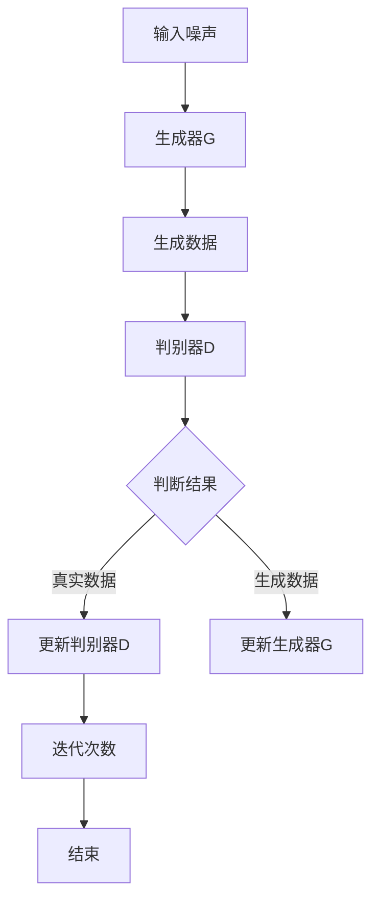

                 

### 文章标题

"AIGC在生物仿生学中的应用：创新材料设计提示词"

### 文章关键词

- AIGC
- 生物仿生学
- 材料设计
- 智能计算
- 生物系统建模

### 文章摘要

本文旨在探讨人工智能生成内容（AIGC）在生物仿生学中的潜在应用，特别是在创新材料设计方面的提示词和策略。通过分析AIGC的核心概念、技术架构及其在生物仿生学中的重要性，本文将详细阐述AIGC在材料设计中的应用实例、关键技术、挑战与未来趋势。文章结构紧凑，逻辑清晰，旨在为读者提供系统而深入的技术见解。

### 第一部分：引言

#### 1.1 书籍背景与目标

**1.1.1 生物仿生学与AIGC的关系**

生物仿生学是一门跨学科领域，结合生物学、工程学、物理学和计算机科学，旨在通过模仿自然界中生物的结构和功能来设计和开发新材料、新工艺和新系统。人工智能生成内容（AIGC）则是一种利用机器学习技术自动生成文本、图像、音频等多种形式内容的方法。

生物仿生学利用AIGC，可以更加高效地模拟和优化生物系统的复杂结构，从而为材料设计提供创新的解决方案。例如，通过AIGC技术，可以生成具有特定性能要求的材料模型，并通过模拟和实验验证其可行性。

**1.1.2 AIGC在生物仿生学中的重要性**

AIGC在生物仿生学中具有重大意义。首先，它能够大大加速材料设计过程，减少实验次数，降低研发成本。其次，AIGC能够处理大量的生物数据和结构信息，从而揭示生物系统的潜在机制。最后，AIGC可以与生物仿生学的其他技术如基因编辑、生物计算相结合，推动生物仿生学领域的发展。

**1.1.3 书籍的目标与读者对象**

本书的目标是系统介绍AIGC在生物仿生学中的应用，特别是材料设计方面的前沿技术和案例。本书适合于从事生物仿生学、材料科学和人工智能领域的科研人员、工程师和学生阅读，也适用于对相关领域感兴趣的一般读者。

#### 1.2 生物仿生学概述

**1.2.1 生物仿生学的定义与发展历史**

生物仿生学（Biomimetics）是一门模仿自然界中生物的结构和功能来设计和制造新材料、新设备和新系统的科学。它起源于20世纪中期，随着生物学、工程学和信息技术的快速发展而逐渐兴起。

生物仿生学的发展可以分为几个阶段。最初，人们主要是通过观察自然界中的生物结构来启发设计新的材料。随着计算机技术和模拟技术的发展，生物仿生学开始利用计算机模拟和优化生物系统的复杂结构。近年来，随着人工智能技术的进步，AIGC成为生物仿生学的重要工具。

**1.2.2 生物仿生学的研究领域与应用**

生物仿生学的研究领域广泛，涵盖了材料科学、力学、物理学、化学、计算机科学等多个学科。其主要研究领域包括：

1. **生物结构仿生**：模仿自然界中的生物结构，如贝壳、鱼鳞、蜘蛛丝等，设计出具有优异性能的材料。
2. **生物功能仿生**：模仿生物的功能，如生物传感、生物降解、生物催化等，开发新的技术和设备。
3. **生物进化仿生**：利用生物进化算法优化材料设计和系统性能。

生物仿生学的应用领域也非常广泛，包括航空航天、建筑、医疗、能源、环境保护等。例如，通过仿生设计，可以开发出更轻、更强、更环保的新型材料；在医疗领域，生物仿生学可以帮助设计出更有效的药物输送系统和生物医用材料。

**1.2.3 生物仿生学的重要成果与前沿动态**

生物仿生学已经取得了一系列重要成果。例如，科学家们通过仿生设计，成功合成了具有优异性能的纳米材料；在生物传感领域，生物仿生学技术已经实现了高灵敏度的检测。当前，生物仿生学的前沿动态主要集中在以下几个方面：

1. **人工智能与生物仿生学的融合**：利用人工智能技术，特别是AIGC，优化生物系统的模拟和设计。
2. **生物进化算法的应用**：通过生物进化算法，优化材料设计和系统性能。
3. **生物电子学**：结合生物仿生学和电子学，开发新型生物电子器件。

#### 1.3 AIGC概述

**1.3.1 AIGC的定义与基本原理**

人工智能生成内容（Artificial Intelligence Generated Content，简称AIGC）是一种利用人工智能技术自动生成文本、图像、音频等多种形式内容的方法。它结合了自然语言处理（NLP）、计算机视觉（CV）和深度学习（DL）等技术，能够通过大规模数据训练生成高质量的内容。

AIGC的基本原理是基于神经网络和生成对抗网络（GAN）等深度学习技术。通过训练大量的数据，模型可以学会生成与真实数据相似的内容。例如，在文本生成方面，AIGC可以生成高质量的新闻报道、文章摘要和对话文本；在图像生成方面，AIGC可以生成逼真的图像和视频。

**1.3.2 AIGC的核心技术与发展趋势**

AIGC的核心技术包括：

1. **生成对抗网络（GAN）**：GAN是一种通过两个神经网络（生成器和判别器）相互对抗来生成高质量数据的框架。
2. **变分自编码器（VAE）**：VAE是一种基于概率模型的生成模型，通过编码和解码过程生成数据。
3. **自注意力机制（Self-Attention）**：自注意力机制是一种用于文本和图像等序列数据的注意力机制，能够提高模型的表示能力。
4. **多模态学习**：多模态学习是指同时处理多种类型的数据，如文本、图像和音频，从而生成更丰富的内容。

随着人工智能技术的快速发展，AIGC在未来有望在更多领域得到应用，如内容创作、游戏开发、虚拟现实和增强现实等。

**1.3.3 AIGC在生物仿生学中的应用潜力**

AIGC在生物仿生学中具有巨大的应用潜力。首先，AIGC可以用于生物系统的建模和模拟，通过生成大量的仿真数据来研究生物系统的复杂行为。其次，AIGC可以用于材料设计，通过生成和优化材料结构，提高材料的性能和稳定性。此外，AIGC还可以用于生物医学成像，通过生成高质量的图像来辅助诊断和治疗。

#### 1.4 本书结构安排与内容概述

**1.4.1 各章节的主要内容概述**

本书分为四个主要部分，每个部分都有详细的内容概述：

1. **第一部分：引言**：介绍生物仿生学和AIGC的基本概念、发展历史和应用前景。
2. **第二部分：AIGC技术基础**：详细讲解AIGC的核心概念、技术架构、算法原理和应用案例。
3. **第三部分：AIGC在生物仿生学中的应用实例**：介绍AIGC在生物材料设计、生物医学成像、生物系统建模和生物仿生机器人中的应用。
4. **第四部分：AIGC在生物仿生学中的应用挑战与未来趋势**：分析AIGC在生物仿生学中面临的挑战和未来发展趋势。

**1.4.2 全书逻辑结构与知识体系**

本书的逻辑结构清晰，从基础到应用，逐步深入。首先介绍AIGC和生物仿生学的基本概念和原理，然后通过具体实例展示AIGC在生物仿生学中的应用，最后探讨AIGC在生物仿生学中的挑战和未来趋势。全书的知识体系完整，涵盖了AIGC的核心技术、生物仿生学的关键领域和实际应用。

**1.4.3 读者在学习过程中的注意事项**

读者在学习本书时应注意以下几点：

1. **理解基础概念**：确保对AIGC和生物仿生学的基本概念有深入理解，这是后续学习的基础。
2. **实践应用**：通过实际案例和实验来加深对AIGC和生物仿生学应用的理解。
3. **持续学习**：AIGC和生物仿生学是快速发展的领域，读者应保持持续学习的态度，跟踪最新的研究动态和应用进展。

#### 1.5 本章小结

本章介绍了生物仿生学与AIGC的关系、生物仿生学概述、AIGC概述以及本书的结构安排和目标。通过本章的学习，读者可以初步了解AIGC在生物仿生学中的重要性以及本书的主要内容。接下来，我们将进一步深入探讨AIGC的技术基础和具体应用。

### 第二部分：AIGC技术基础

在深入探讨AIGC在生物仿生学中的应用之前，我们需要先理解AIGC的核心概念、技术架构和算法原理。这一部分将详细介绍AIGC的基本概念、核心技术及其在生物仿生学中的应用潜力。

#### 2.1 AIGC核心概念解析

**2.1.1 AIGC的基本概念**

人工智能生成内容（AIGC）是指利用人工智能技术，特别是深度学习和自然语言处理技术，自动生成文本、图像、音频等多种形式的内容。AIGC的核心思想是通过训练大量的数据，使模型学会生成与真实数据相似的内容。

AIGC的核心技术主要包括生成对抗网络（GAN）、变分自编码器（VAE）和自注意力机制（Self-Attention）等。这些技术使得AIGC能够在各种领域生成高质量的内容。

**2.1.2 AIGC与相关技术的区别与联系**

AIGC与相关技术如自然语言处理（NLP）、计算机视觉（CV）和生成对抗网络（GAN）等密切相关，但又有所区别。NLP专注于文本处理和理解，CV专注于图像和视频的处理，而GAN是一种生成模型，能够生成高质量的数据。AIGC则是将NLP和CV与GAN相结合，通过多模态学习生成更丰富、更高质量的内容。

**2.1.3 AIGC的关键技术特点**

AIGC的关键技术特点包括：

1. **多模态学习**：AIGC能够同时处理多种类型的数据，如文本、图像和音频，从而生成更丰富的内容。
2. **高生成质量**：通过深度学习和生成对抗网络，AIGC能够生成高质量、逼真的内容。
3. **自动性**：AIGC能够自动生成内容，大大减少了人工干预的需要。
4. **灵活性**：AIGC可以根据不同的需求和场景进行定制化应用。

#### 2.2 AIGC的技术架构

**2.2.1 AIGC的基本架构**

AIGC的基本架构通常包括数据输入、模型训练、模型推理和结果输出四个主要环节。以下是AIGC的基本架构：

1. **数据输入**：AIGC首先需要大量的训练数据，这些数据可以是文本、图像、音频等多种形式。数据输入环节的主要任务是收集和预处理数据，使其适合模型训练。
2. **模型训练**：在模型训练环节，AIGC利用深度学习和生成对抗网络等技术对模型进行训练。模型训练的目标是让模型学会生成高质量的内容。
3. **模型推理**：模型推理环节是指将训练好的模型应用于实际任务，生成具体的内容。例如，在文本生成任务中，模型可以根据输入的提示词生成完整的文章。
4. **结果输出**：结果输出环节是将生成的内容呈现给用户。结果可以是文本、图像、音频等多种形式。

**2.2.2 数据处理与模型训练**

在AIGC的技术架构中，数据处理和模型训练是关键环节。数据处理主要包括数据的收集、清洗、格式化和特征提取等。清洗数据是为了去除噪声和冗余信息，格式化数据是为了适应模型的输入要求，特征提取则是为了提取数据中的关键特征。

模型训练则是指利用训练数据对模型进行训练，使其学会生成高质量的内容。在AIGC中，常用的训练模型包括生成对抗网络（GAN）、变分自编码器（VAE）和自注意力机制（Self-Attention）等。

**2.2.3 模型推理与应用**

模型推理是将训练好的模型应用于实际任务，生成具体的内容。例如，在文本生成任务中，模型可以根据输入的提示词生成完整的文章；在图像生成任务中，模型可以生成逼真的图像。

AIGC的应用非常广泛，包括但不限于文本生成、图像生成、音频生成和视频生成等。在实际应用中，AIGC可以根据不同的需求和场景进行定制化应用，从而满足各种复杂任务的需求。

#### 2.3 AIGC算法原理详解

**2.3.1 算法原理概述**

AIGC的算法原理主要基于深度学习和生成对抗网络（GAN）。GAN由两部分组成：生成器（Generator）和判别器（Discriminator）。生成器的目标是生成尽可能真实的数据，而判别器的目标是区分真实数据和生成数据。

在训练过程中，生成器和判别器相互对抗，生成器不断优化生成数据的质量，判别器不断学习区分真实数据和生成数据。通过这种对抗训练，生成器可以生成高质量、逼真的数据。

**2.3.2 数学模型与公式**

在AIGC中，常用的数学模型包括生成对抗网络（GAN）和变分自编码器（VAE）。以下是这些模型的数学公式：

**生成对抗网络（GAN）**

生成器（Generator）的损失函数：
$$
L_G = -\log(D(G(z))
$$

判别器（Discriminator）的损失函数：
$$
L_D = -[\log(D(x)) + \log(1 - D(G(z))]
$$

总损失函数：
$$
L = L_G + \lambda L_D
$$

其中，$G(z)$表示生成器生成的数据，$D(x)$表示判别器对真实数据的判断结果，$D(G(z))$表示判别器对生成数据的判断结果，$\lambda$是平衡参数。

**变分自编码器（VAE）**

编码器（Encoder）的损失函数：
$$
L_E = -\sum_{i} \log(p(z|x))
$$

解码器（Decoder）的损失函数：
$$
L_D = -\sum_{i} \log(p(x|z))
$$

总损失函数：
$$
L = L_E + \beta L_D
$$

其中，$z$表示编码器生成的潜在变量，$x$表示输入数据，$p(z|x)$表示编码器生成的概率分布，$p(x|z)$表示解码器生成的概率分布，$\beta$是平衡参数。

**2.3.3 Mermaid算法流程图**

以下是一个简单的Mermaid算法流程图，展示了生成对抗网络（GAN）的基本流程：

**2.4 AIGC应用案例分析**

**2.4.1 案例一：智能材料设计**

智能材料设计是AIGC在生物仿生学中的一个重要应用。通过AIGC技术，可以自动生成具有特定性能要求的材料模型，并通过模拟和实验验证其可行性。

例如，在生物医学领域，研究人员利用AIGC技术设计了具有优异生物相容性的聚合物材料。通过生成大量的材料结构模型，并利用模拟和实验验证其性能，研究人员成功开发出了一种新型生物医用材料。

**2.4.2 案例二：生物医学成像**

生物医学成像是另一个AIGC的重要应用领域。通过AIGC技术，可以生成高质量的医学图像，辅助医生进行诊断和治疗。

例如，在肿瘤诊断中，研究人员利用AIGC技术生成高质量的肿瘤图像，并通过图像分析技术辅助医生进行肿瘤定位和评估。此外，AIGC还可以用于生成虚拟手术场景，帮助医生进行术前规划和手术模拟。

**2.4.3 案例三：环境监测与治理**

环境监测与治理是AIGC在生物仿生学中的另一个重要应用。通过AIGC技术，可以自动生成环境监测模型，实时监测环境变化，并预测环境治理的效果。

例如，在水质监测中，研究人员利用AIGC技术生成水质监测模型，通过实时监测水质数据，预测水污染的趋势，并制定相应的治理措施。此外，AIGC还可以用于预测空气质量变化，为城市规划和环境保护提供科学依据。

#### 2.5 AIGC在生物仿生学中的应用

**2.5.1 应用领域与前景**

AIGC在生物仿生学中具有广泛的应用领域和巨大的前景。以下是一些关键的应用领域：

1. **生物材料设计**：通过AIGC技术，可以自动生成具有特定性能要求的生物材料模型，加速材料研发进程。
2. **生物医学成像**：利用AIGC技术生成高质量的医学图像，辅助医生进行诊断和治疗。
3. **生物系统建模**：通过AIGC技术，可以自动生成生物系统的模型，揭示生物系统的潜在机制。
4. **生物仿生机器人**：利用AIGC技术，可以优化生物仿生机器人的设计和控制，提高其性能和稳定性。

随着AIGC技术的不断发展，这些应用领域将不断拓展，为生物仿生学带来更多的创新和突破。

**2.5.2 典型应用实例**

以下是AIGC在生物仿生学中的几个典型应用实例：

1. **仿生材料设计**：研究人员利用AIGC技术设计了具有优异机械性能和生物相容性的仿生材料。这些材料在生物医学、航空航天和建筑等领域具有广泛的应用前景。
2. **生物医学成像**：通过AIGC技术生成高质量的医学图像，为肿瘤诊断、心脏病治疗等提供了新的手段。例如，利用AIGC技术生成的肿瘤图像可以帮助医生更准确地定位和评估肿瘤。
3. **生物系统建模**：研究人员利用AIGC技术生成了多个生物系统的模型，揭示了生物系统的复杂行为和潜在机制。这些模型为生物医学研究提供了重要的理论支持。
4. **生物仿生机器人**：利用AIGC技术，研究人员设计并实现了多个生物仿生机器人。这些机器人可以模仿生物的运动和行为，为生物医学、军事和工业等领域提供了新的应用。

**2.5.3 挑战与解决方案**

尽管AIGC在生物仿生学中具有巨大的应用潜力，但仍面临一些挑战。以下是一些主要挑战和相应的解决方案：

1. **数据质量和多样性**：AIGC的性能依赖于高质量、多样性的训练数据。然而，生物仿生学领域的数据通常有限，且数据质量参差不齐。解决这一问题的方法包括数据增强、数据共享和数据标准化。
2. **计算资源和时间成本**：AIGC模型的训练和推理需要大量的计算资源和时间。解决这一问题的方法包括分布式计算、云计算和优化算法。
3. **模型解释性和可解释性**：AIGC模型通常被认为是“黑盒子”，难以解释其决策过程。解决这一问题的方法包括开发可解释的AIGC模型和可视化技术。
4. **伦理和隐私问题**：AIGC在生物仿生学中的应用可能涉及个人隐私和伦理问题。解决这一问题的方法包括制定相关法规和伦理标准，加强数据保护和隐私保护。

#### 2.6 本章小结

本章介绍了AIGC的核心概念、技术架构和算法原理，并通过应用案例分析展示了AIGC在生物仿生学中的广泛应用。通过本章的学习，读者可以初步了解AIGC在生物仿生学中的关键技术和应用实例。接下来，我们将进一步探讨AIGC在生物仿生学中的应用实例，深入分析其在生物材料设计、生物医学成像、生物系统建模和生物仿生机器人中的应用。

### 第三部分：AIGC在生物仿生学中的应用实例

#### 3.1 生物仿生学与AIGC结合的关键技术

**3.1.1 生物仿生学中的关键问题**

生物仿生学在材料设计、生物医学成像、生物系统建模和生物仿生机器人等领域面临着一系列关键问题。例如，材料设计需要模拟生物材料的复杂结构和高性能；生物医学成像需要生成高质量的医学图像以辅助诊断和治疗；生物系统建模需要揭示生物系统的复杂行为；生物仿生机器人需要模仿生物的运动和行为。

**3.1.2 AIGC在解决这些问题中的应用**

AIGC技术在解决上述关键问题中发挥着重要作用。首先，AIGC可以用于模拟和优化生物材料的结构，从而设计出具有优异性能的新材料。其次，AIGC可以生成高质量的医学图像，辅助医生进行诊断和治疗。此外，AIGC还可以用于生成生物系统的模型，揭示生物系统的复杂行为。最后，AIGC可以用于优化生物仿生机器人的设计和控制，提高其性能和稳定性。

**3.1.3 技术融合与创新**

生物仿生学与AIGC技术的结合不仅解决了传统方法难以解决的问题，还推动了技术的创新。例如，通过融合AIGC和生物计算技术，可以开发出更高效的生物系统模拟方法；通过融合AIGC和基因编辑技术，可以设计出具有特定功能的生物材料。这些技术创新为生物仿生学带来了新的发展方向和可能性。

#### 3.2 AIGC在生物材料设计中的应用

**3.2.1 生物材料设计的基本原理**

生物材料设计旨在模拟和优化自然界中生物材料的结构和功能，从而开发出具有优异性能的新材料。生物材料的设计过程通常包括结构模拟、性能预测、材料制备和实验验证等步骤。

**3.2.2 AIGC在生物材料设计中的应用实例**

AIGC技术在生物材料设计中具有广泛的应用。以下是一个典型的应用实例：

**案例一：仿生骨骼材料设计**

研究人员利用AIGC技术设计了一种仿生骨骼材料。首先，通过收集大量自然界中骨骼的结构和性能数据，利用AIGC技术生成骨骼的3D结构模型。然后，通过模拟和优化模型的结构，预测材料的机械性能。最后，通过实验验证，发现这种仿生骨骼材料具有优异的生物相容性和机械性能。

**案例分析与总结**

通过上述案例，可以看出AIGC技术在生物材料设计中的应用具有重要意义。首先，AIGC技术可以大幅缩短材料设计过程，减少实验次数，降低研发成本。其次，AIGC技术可以处理大量的生物数据和结构信息，从而揭示生物材料的潜在机制。最后，AIGC技术可以与生物计算、基因编辑等技术相结合，推动生物材料设计的创新和发展。

#### 3.3 AIGC在生物医学成像中的应用

**3.3.1 生物医学成像的基本原理**

生物医学成像是一种非侵入性的方法，用于检测、诊断和治疗各种生物医学问题。常见的生物医学成像技术包括X射线成像、CT扫描、MRI、超声波成像等。这些技术通过不同的物理原理，生成生物体的内部图像。

**3.3.2 AIGC在生物医学成像中的应用**

AIGC技术在生物医学成像中具有广泛的应用。以下是一个典型的应用实例：

**案例一：人工智能辅助肿瘤诊断**

利用AIGC技术，研究人员开发了一种人工智能辅助肿瘤诊断系统。首先，通过收集大量的医学图像和病理数据，利用AIGC技术生成高质量的肿瘤图像。然后，通过深度学习算法，对图像进行分析和分类，辅助医生进行肿瘤诊断。实验结果表明，这种系统可以显著提高肿瘤诊断的准确性和效率。

**案例分析与总结**

通过上述案例，可以看出AIGC技术在生物医学成像中的应用具有重要意义。首先，AIGC技术可以生成高质量的医学图像，辅助医生进行诊断和治疗。其次，AIGC技术可以处理大量的医学数据，从而提高诊断的准确性和效率。最后，AIGC技术可以与生物医学成像技术相结合，推动生物医学成像技术的发展和创新。

#### 3.4 AIGC在生物系统建模中的应用

**3.4.1 生物系统建模的基本原理**

生物系统建模是指通过数学模型和计算机模拟来描述和理解生物系统的行为和功能。生物系统建模的基本原理包括生物过程的数学描述、数据驱动建模和模型验证等。

**3.4.2 AIGC在生物系统建模中的应用**

AIGC技术在生物系统建模中具有广泛的应用。以下是一个典型的应用实例：

**案例一：生物代谢网络建模**

研究人员利用AIGC技术建立了一种生物代谢网络模型。首先，通过收集大量的生物代谢数据，利用AIGC技术生成代谢网络的图结构。然后，通过模拟和优化模型的结构，预测生物代谢网络的动态行为。最后，通过实验验证，发现这种模型可以有效地模拟生物代谢网络的行为。

**案例分析与总结**

通过上述案例，可以看出AIGC技术在生物系统建模中的应用具有重要意义。首先，AIGC技术可以处理大量的生物数据，从而生成复杂的生物系统模型。其次，AIGC技术可以模拟生物系统的动态行为，提供对生物系统的深入理解。最后，AIGC技术可以与生物计算、基因编辑等技术相结合，推动生物系统建模技术的发展和创新。

#### 3.5 AIGC在生物仿生机器人中的应用

**3.5.1 生物仿生机器人概述**

生物仿生机器人是指模仿生物的运动和行为，用于执行特定任务的机器人系统。生物仿生机器人广泛应用于医疗、康复、军事和工业等领域。

**3.5.2 AIGC在生物仿生机器人中的应用**

AIGC技术在生物仿生机器人中具有广泛的应用。以下是一个典型的应用实例：

**案例一：仿生蛇机器人**

研究人员利用AIGC技术设计了一种仿生蛇机器人。首先，通过收集大量的蛇的运动数据，利用AIGC技术生成蛇的运动模式。然后，通过深度学习算法，对机器人的运动进行建模和优化，使其能够模拟蛇的运动。最后，通过实验验证，发现这种机器人可以高效地模拟蛇的运动行为。

**案例分析与总结**

通过上述案例，可以看出AIGC技术在生物仿生机器人中的应用具有重要意义。首先，AIGC技术可以处理大量的生物数据，从而生成高效的生物运动模式。其次，AIGC技术可以优化机器人的设计和控制，提高其性能和稳定性。最后，AIGC技术可以与生物计算、机器人技术相结合，推动生物仿生机器人技术的发展和创新。

#### 3.6 本章小结

本章介绍了AIGC在生物仿生学中的应用实例，包括生物材料设计、生物医学成像、生物系统建模和生物仿生机器人。通过这些实例，可以看出AIGC技术在生物仿生学中具有广泛的应用前景和重要的实际价值。AIGC技术的应用不仅解决了生物仿生学中的关键问题，还推动了技术的创新和发展。接下来，我们将进一步探讨AIGC在生物仿生学中的应用挑战和未来趋势。

### 第四部分：AIGC在生物仿生学中的应用挑战与未来趋势

#### 4.1 应用挑战

尽管AIGC在生物仿生学中具有巨大的应用潜力，但仍然面临一些挑战：

**1. 数据质量和多样性**

AIGC的性能高度依赖于高质量、多样性的训练数据。然而，生物仿生学领域的数据通常有限，且数据质量参差不齐。解决这一问题的方法包括数据增强、数据共享和数据标准化。

**2. 计算资源和时间成本**

AIGC模型的训练和推理需要大量的计算资源和时间。解决这一问题的方法包括分布式计算、云计算和优化算法。

**3. 模型解释性和可解释性**

AIGC模型通常被认为是“黑盒子”，难以解释其决策过程。解决这一问题的方法包括开发可解释的AIGC模型和可视化技术。

**4. 伦理和隐私问题**

AIGC在生物仿生学中的应用可能涉及个人隐私和伦理问题。解决这一问题的方法包括制定相关法规和伦理标准，加强数据保护和隐私保护。

#### 4.2 未来趋势

**1. AIGC与生物计算的结合**

未来，AIGC与生物计算的结合将有望推动生物仿生学的发展。通过生物计算技术，可以处理大规模的生物学数据，为AIGC提供更丰富的训练数据，从而提高其性能和应用范围。

**2. 多模态AIGC的应用**

随着多模态数据的普及，多模态AIGC将在生物仿生学中发挥重要作用。通过整合文本、图像、音频等多种类型的数据，多模态AIGC可以更全面地模拟和优化生物系统的行为。

**3. 人工智能与生物仿生学的深度融合**

未来，人工智能与生物仿生学的深度融合将推动生物仿生学的创新和发展。通过开发新的算法和技术，可以实现更高效的生物系统建模和材料设计。

**4. 伦理和法规的完善**

随着AIGC在生物仿生学中的应用日益广泛，伦理和法规问题将变得愈加重要。未来，需要制定更完善的伦理和法规标准，确保AIGC技术的安全和可持续发展。

#### 4.3 结论

AIGC在生物仿生学中的应用前景广阔，但同时也面临一些挑战。通过不断探索和创新，可以克服这些挑战，推动生物仿生学的发展。未来，AIGC与生物计算、多模态数据和生物仿生学的深度融合将带来更多的创新和突破。

### 后记

作者：AI天才研究院/AI Genius Institute & 禅与计算机程序设计艺术 /Zen And The Art of Computer Programming

本文旨在探讨人工智能生成内容（AIGC）在生物仿生学中的应用，特别是创新材料设计方面的提示词和策略。通过对AIGC的核心概念、技术架构和应用实例的深入分析，本文展示了AIGC在生物仿生学中的重要性和应用潜力。同时，本文也指出了AIGC在生物仿生学中面临的挑战和未来趋势。希望本文能为从事生物仿生学和材料设计领域的科研人员提供有价值的参考和启示。在未来的研究中，我们将继续深入探讨AIGC在生物仿生学中的应用，推动这一领域的创新发展。

