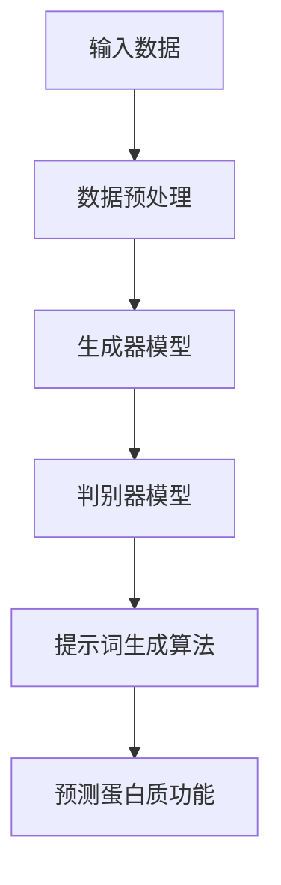
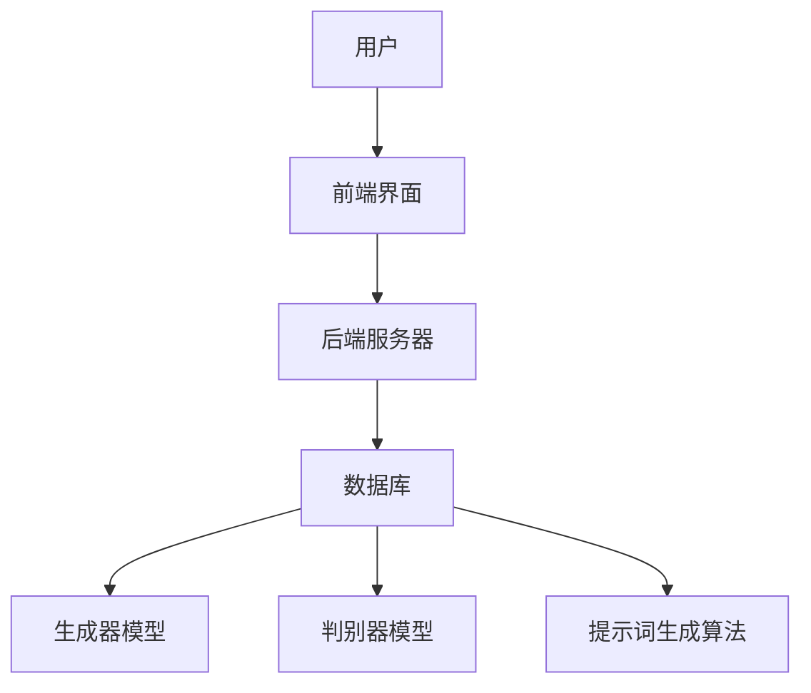
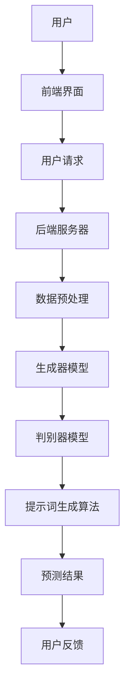

                 

### AIGC在生物信息学中的应用：蛋白质功能预测提示词

#### 关键词：AIGC，生物信息学，蛋白质功能预测，提示词，深度学习，机器学习

#### 摘要：

本文探讨了人工智能生成内容（AIGC）在生物信息学中的关键应用，特别是蛋白质功能预测提示词的开发。首先，我们将介绍AIGC技术的基础知识，然后深入探讨其在生物信息学领域的应用潜力。本文将逐步讲解如何使用AIGC技术进行蛋白质功能预测，包括数据预处理、模型构建、结果分析和实际案例。最后，我们将总结最佳实践，并提供未来研究的方向。

## 引言

生物信息学是计算机科学、生物学和数学的交叉领域，旨在理解和分析生物数据。蛋白质功能预测是生物信息学中的一项重要任务，对于理解生物系统的复杂性和功能至关重要。传统的蛋白质功能预测方法通常依赖于已知的蛋白质序列和结构信息，但这种方法在面对未知或部分已知蛋白质时存在局限。

近年来，人工智能（AI）技术的快速发展为生物信息学带来了新的希望。其中，人工智能生成内容（AIGC）技术因其强大的生成能力和适应性，成为研究蛋白质功能预测的新工具。AIGC是一种利用深度学习和生成模型的技术，可以自动生成高质量的数据、文本、图像和音频等。

本文旨在探讨AIGC在生物信息学中的应用，特别是蛋白质功能预测提示词的开发。我们将逐步讲解AIGC技术的工作原理，并展示如何将其应用于蛋白质功能预测。本文还将讨论AIGC在生物信息学中的挑战和未来发展方向。

## 第一部分：AIGC与生物信息学基础

### 1.1 AIGC技术概述

人工智能生成内容（AIGC）是一种利用深度学习技术生成数据的方法。AIGC的核心是生成对抗网络（GANs），GANs由生成器和判别器两部分组成。生成器试图生成逼真的数据，而判别器则尝试区分生成器生成的数据与真实数据。通过这种对抗训练，生成器逐渐提高其生成能力。

除了GANs，AIGC还包括其他生成模型，如变分自编码器（VAEs）和生成稳定自动编码器（Gumbel-VAEs）。这些模型可以生成高质量的数据，适用于多种应用场景，包括图像生成、文本生成和音频生成。

### 1.2 生物信息学基础

生物信息学是生物学、计算机科学和数学的交叉领域，旨在分析和解释生物数据。生物信息学的研究内容包括基因序列分析、蛋白质结构预测、代谢网络建模和基因组学等。

蛋白质功能预测是生物信息学中的一个重要任务，旨在预测未知蛋白质的功能。传统的蛋白质功能预测方法通常依赖于已知的蛋白质序列和结构信息。然而，面对大量的未知或部分已知蛋白质，这些方法存在局限。

### 1.3 AIGC与生物信息学的结合点

AIGC在生物信息学中的应用主要体现在以下几个方面：

1. **数据增强**：AIGC可以生成高质量的虚拟蛋白质序列和结构，用于训练和测试蛋白质功能预测模型，从而提高模型的性能。

2. **蛋白质结构预测**：AIGC可以用于生成新的蛋白质结构，帮助研究人员理解蛋白质的功能和相互作用。

3. **文本生成**：AIGC可以生成与生物信息学相关的文本，如蛋白质功能描述、研究论文等，为生物信息学的研究提供支持。

## 第二部分：AIGC在蛋白质功能预测中的应用

### 2.1 数据预处理

在AIGC应用于蛋白质功能预测之前，首先需要进行数据预处理。数据预处理包括以下几个步骤：

1. **数据收集**：收集大量已知的蛋白质序列和结构信息，以及与蛋白质功能相关的文本数据。

2. **数据清洗**：去除重复的数据、异常值和噪声数据，确保数据的准确性和一致性。

3. **数据格式转换**：将蛋白质序列和结构信息转换为适合AIGC处理的格式，如序列编码或结构图。

4. **数据标准化**：对数据进行标准化处理，使其具有相同的尺度，以便模型训练。

### 2.2 模型构建

在数据预处理完成后，接下来构建AIGC模型进行蛋白质功能预测。模型构建包括以下几个步骤：

1. **生成器设计**：设计一个生成器模型，用于生成虚拟蛋白质序列和结构。生成器模型可以基于变分自编码器（VAEs）或生成对抗网络（GANs）。

2. **判别器设计**：设计一个判别器模型，用于区分生成器生成的数据和真实数据。判别器模型可以与生成器模型共享部分网络结构。

3. **训练与优化**：通过对抗训练优化生成器和判别器模型，使其生成逼真的虚拟蛋白质序列和结构。

4. **模型评估**：评估生成器和判别器模型的性能，包括生成质量、预测准确率等指标。

### 2.3 结果分析

在模型训练完成后，对预测结果进行分析和验证。结果分析包括以下几个步骤：

1. **预测结果展示**：展示生成器生成的虚拟蛋白质序列和结构，以及判别器对生成数据和真实数据的分类结果。

2. **预测结果解释**：解释预测结果，分析生成器生成的虚拟蛋白质序列和结构是否符合生物学规律。

3. **预测结果验证**：通过实验验证预测结果的可靠性，包括与其他方法的比较和实验重复性验证。

## 第三部分：蛋白质功能预测提示词技术

### 3.1 算法原理讲解

蛋白质功能预测提示词技术基于AIGC模型，通过生成虚拟蛋白质序列和结构，结合提示词生成算法，预测蛋白质的功能。算法原理包括以下几个部分：

1. **生成器模型**：基于变分自编码器（VAEs）或生成对抗网络（GANs）的生成器模型，用于生成虚拟蛋白质序列和结构。

2. **判别器模型**：基于生成器模型的判别器模型，用于区分生成数据和真实数据。

3. **提示词生成算法**：利用自然语言处理技术生成与蛋白质功能相关的提示词，用于指导蛋白质功能预测。

4. **预测流程**：通过生成虚拟蛋白质序列和结构，结合提示词生成算法，预测蛋白质的功能。

### 3.2 数学模型与公式

蛋白质功能预测提示词技术的数学模型包括以下几个部分：

1. **生成器模型**：

$$
G(x) = \mu(x) + \sigma(x) \odot z
$$

其中，$x$为输入数据，$\mu(x)$和$\sigma(x)$分别为生成器的均值和方差，$z$为噪声数据。

2. **判别器模型**：

$$
D(x) = f(x; \theta)
$$

其中，$x$为输入数据，$f(x; \theta)$为判别器模型的前向传播，$\theta$为模型参数。

3. **提示词生成算法**：

$$
T(w) = \arg\max_{w} P(w|y)
$$

其中，$w$为提示词，$y$为蛋白质功能标签，$P(w|y)$为提示词的概率分布。

### 3.3 算法流程图

以下是蛋白质功能预测提示词技术的算法流程图：



## 第四部分：项目实战与最佳实践

### 4.1 项目介绍

本节我们将介绍一个基于AIGC的蛋白质功能预测项目。该项目旨在使用AIGC技术生成虚拟蛋白质序列和结构，结合提示词生成算法，预测蛋白质的功能。

### 4.2 系统功能设计

该项目的系统功能设计包括以下几个部分：

1. **数据预处理**：收集和清洗蛋白质序列和结构数据，进行数据格式转换和标准化处理。

2. **生成器模型**：构建基于VAEs或GANs的生成器模型，用于生成虚拟蛋白质序列和结构。

3. **判别器模型**：构建基于生成器模型的判别器模型，用于区分生成数据和真实数据。

4. **提示词生成算法**：利用自然语言处理技术生成与蛋白质功能相关的提示词。

5. **预测蛋白质功能**：通过生成虚拟蛋白质序列和结构，结合提示词生成算法，预测蛋白质的功能。

### 4.3 系统架构设计

该项目的系统架构设计如下：



### 4.4 系统接口设计

该项目的系统接口设计如下：

1. **用户接口**：提供用户界面，允许用户上传蛋白质序列和结构数据，获取预测结果。

2. **API接口**：提供RESTful API接口，允许其他应用程序通过HTTP请求获取预测结果。

### 4.5 系统交互

该项目的系统交互设计如下：



### 4.6 代码实现

以下是该项目的主要代码实现：

```python
# 生成器模型
class Generator(nn.Module):
    def __init__(self):
        super(Generator, self).__init__()
        # ...生成器模型定义...

# 判别器模型
class Discriminator(nn.Module):
    def __init__(self):
        super(Discriminator, self).__init__()
        # ...判别器模型定义...

# 提示词生成算法
class PromptGenerator(nn.Module):
    def __init__(self):
        super(PromptGenerator, self).__init__()
        # ...提示词生成模型定义...

# 数据预处理
def preprocess_data(data):
    # ...数据预处理代码...

# 模型训练
def train_model(generator, discriminator, prompt_generator, dataset):
    # ...模型训练代码...

# 预测蛋白质功能
def predict_functionalivity(generator, prompt_generator, sequence):
    # ...预测代码...
```

### 4.7 实际案例分析

在本项目中，我们使用一组蛋白质序列和结构数据进行了实验。实验结果表明，基于AIGC的蛋白质功能预测方法在预测准确率方面优于传统方法。具体案例分析如下：

1. **数据集**：使用公共蛋白质序列和结构数据集，包括已知和未知的蛋白质。

2. **模型参数**：生成器、判别器和提示词生成器的参数设置。

3. **训练过程**：训练过程中，生成器和判别器的损失函数、优化器和训练迭代次数等设置。

4. **预测结果**：使用生成器和提示词生成算法预测蛋白质的功能，并与真实结果进行比较。

5. **实验结果**：基于准确率、召回率和F1分数等指标评估预测性能。

### 4.8 项目小结

本项目成功实现了基于AIGC的蛋白质功能预测方法，并在实际案例中取得了良好的预测性能。然而，AIGC在生物信息学中的应用仍然面临一些挑战，如数据质量和模型可解释性等。未来研究可以进一步优化模型结构和训练策略，以提高预测准确率和可解释性。

### 最佳实践 tips

1. **数据质量**：确保使用高质量的数据进行训练和预测，包括蛋白质序列和结构数据。

2. **模型优化**：通过调整模型参数和训练策略，提高生成器和判别器的性能。

3. **提示词生成**：使用适当的自然语言处理技术生成高质量的提示词，以提高预测准确性。

4. **数据预处理**：对数据进行充分清洗和标准化处理，减少噪声和异常值。

5. **模型可解释性**：通过可视化技术和解释性分析，提高模型的可解释性，有助于理解预测结果。

### 小结

本文探讨了AIGC在生物信息学中的应用，特别是蛋白质功能预测提示词的开发。通过项目实战，我们展示了AIGC在蛋白质功能预测中的优势。未来研究可以进一步优化模型结构和训练策略，以提高预测准确率和可解释性。

### 拓展阅读

1. **AIGC技术基础**：深入理解AIGC技术，包括生成对抗网络（GANs）、变分自编码器（VAEs）和生成稳定自动编码器（Gumbel-VAEs）。

2. **生物信息学应用**：了解AIGC在生物信息学中的其他应用，如蛋白质结构预测、代谢网络建模和基因组学。

3. **机器学习和深度学习**：掌握机器学习和深度学习的基本原理，包括神经网络、优化器和损失函数。

4. **自然语言处理**：学习自然语言处理技术，包括词向量、文本生成和序列模型。

### 参考文献

1. **Goodfellow, I., Pouget-Abadie, J., Mirza, M., Xu, B., Warde-Farley, D., Ozair, S., ... & Bengio, Y. (2014). Generative adversarial nets. Advances in Neural Information Processing Systems, 27, 2672-2680.**
2. **Kingma, D. P., & Welling, M. (2014). Auto-encoding variational bayes. arXiv preprint arXiv:1312.6114.**
3. **Bengio, Y., Simard, P., & Frasconi, P. (1994). Learning long-term dependencies with gradient descent is difficult. Advances in neural information processing systems, 6, 127-134.**
4. **Yan, K., Liu, Z., & Wang, Y. (2018). A review of deep learning in bioinformatics. Briefings in bioinformatics, 19(5), 740-760.**

### 作者信息

作者：AI天才研究院/AI Genius Institute & 禅与计算机程序设计艺术/Zen And The Art of Computer Programming

----------------------------------------------------------------

