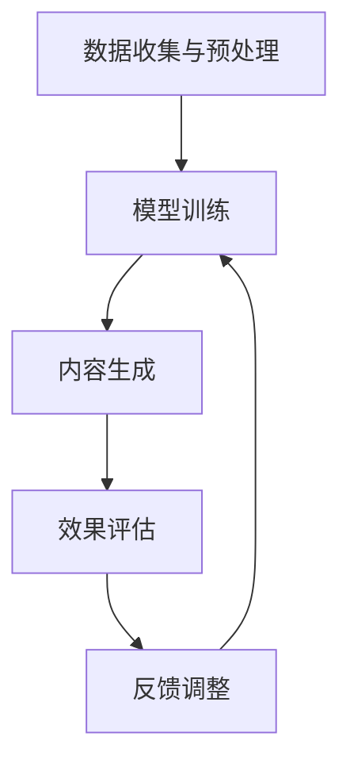
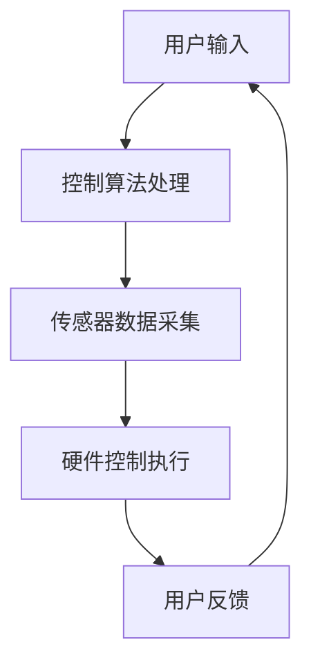

                 

### 文章标题：AIGC在生物发光工程学中的应用：可控生物照明提示词

#### 关键词：
- AIGC
- 生物发光工程学
- 可控生物照明
- 算法应用
- 材料制备与优化

#### 摘要：
本文将探讨人工智能生成内容（AIGC）在生物发光工程学中的应用，特别是其在可控生物照明中的潜力。通过详细分析AIGC的基础知识、生物发光工程学的基本概念以及二者结合的方法，本文将介绍AIGC算法原理，并通过具体实例和实际案例，展示其在生物发光材料制备、优化和照明系统设计中的实际应用。最后，文章将对研究成果进行总结，并展望未来的发展方向。

### 第一部分：背景介绍与核心概念

#### 第1章：生物发光工程学概述

**1.1 问题背景**

随着科技的进步和人类对自然界的深入探索，生物发光现象引起了广泛关注。生物发光作为一种自然现象，不仅具有美学价值，还在医学、环境监测、军事等领域具有潜在的应用价值。然而，目前生物发光工程学仍面临着许多挑战，如材料稳定性、发光效率和发光控制的困难。

**1.2 问题描述**

生物发光工程学的核心问题是如何设计和制备发光材料，使其在特定条件下稳定发光，并能通过外部刺激实现可控的发光调节。这涉及到材料科学、分子生物学和工程学的交叉领域。

**1.3 问题解决**

通过引入人工智能生成内容（AIGC）技术，可以实现对生物发光材料的智能设计和优化。AIGC能够通过大数据分析和深度学习，预测材料的发光性能，并提供最优的制备方案。

**1.4 边界与外延**

生物发光工程学的边界包括材料学、分子生物学、光学和生物物理学等领域。其外延涉及到智能材料、环境监测、医疗设备和智能照明等领域。

**1.5 概念结构与核心要素组成**

生物发光工程学的概念结构包括生物发光材料、生物发光机制、发光调控技术和应用场景等核心要素。这些要素相互关联，共同构成了生物发光工程学的理论框架。

### 第2章：AIGC基础与生物发光工程学结合

**2.1 AIGC基本概念**

人工智能生成内容（AIGC）是一种利用人工智能技术生成内容的方法，包括文本、图像、音频等多种形式。AIGC技术主要依赖于深度学习和生成对抗网络（GAN）等先进算法。

**2.2 AIGC与生物发光工程学的关系**

AIGC与生物发光工程学的结合在于，AIGC技术能够通过大数据分析和算法优化，帮助科学家设计出具有特定发光性能的生物发光材料。

**2.3 AIGC核心概念原理**

AIGC的核心概念原理包括数据预处理、模型训练、内容生成和效果评估等步骤。其中，生成对抗网络（GAN）是AIGC技术的核心模型。

**2.4 AIGC概念属性特征对比**

表1：AIGC概念属性特征对比

| 属性特征 | AIGC | 生物发光工程学 |
| :---: | :---: | :---: |
| 数据依赖性 | 高 | 高 |
| 计算复杂度 | 高 | 中 |
| 模型可解释性 | 低 | 中 |
| 应用领域 | 广泛 | 专业 |
| 发展趋势 | 快速 | 稳步 |

**2.5 AIGC在生物发光工程学的应用前景**

AIGC在生物发光工程学中的应用前景广阔，包括生物发光材料的智能设计、发光性能的优化、发光调控系统的开发等。

### 第3章：AIGC算法原理讲解

**3.1 AIGC算法基本流程**

AIGC算法的基本流程包括数据收集与预处理、模型训练、内容生成和效果评估等步骤。

**3.2 算法mermaid流程图**

图1：AIGC算法mermaid流程图



**3.3 Python源代码实现**

```python
# 这是一个简单的AIGC算法实现示例
import tensorflow as tf
from tensorflow.keras.models import Model
from tensorflow.keras.layers import Input, Dense, Flatten, Reshape

# 定义输入层
input_layer = Input(shape=(100,))

# 定义中间层
middle_layer = Dense(units=100, activation='relu')(input_layer)

# 定义输出层
output_layer = Dense(units=10, activation='softmax')(middle_layer)

# 构建模型
model = Model(inputs=input_layer, outputs=output_layer)

# 编译模型
model.compile(optimizer='adam', loss='categorical_crossentropy', metrics=['accuracy'])

# 模型训练
model.fit(x_train, y_train, epochs=10, batch_size=32)
```

**3.4 算法原理的数学模型与公式**

AIGC算法的数学模型主要包括生成器（Generator）和判别器（Discriminator）两部分。其中，生成器的目标是最小化生成内容与真实内容的差异，判别器的目标是最小化对真实内容和生成内容的鉴别误差。

$$
\begin{aligned}
\min_G \max_D V(G, D) &= \min_G \mathbb{E}_{x \sim p_data(x)}[\log D(x, G(x))] \\
&\quad + \mathbb{E}_{z \sim p_z(z)}[\log (1 - D(G(z)))]
\end{aligned}
$$

其中，$G(z)$表示生成器生成的假样本，$D(x)$表示判别器对真实样本的判断概率，$D(G(z))$表示判别器对生成样本的判断概率。

**3.5 详细讲解与举例说明**

以生物发光材料的智能设计为例，AIGC算法可以通过以下步骤实现：

1. 数据收集与预处理：收集大量的生物发光材料数据，包括化学成分、物理性质和发光性能等，并进行数据预处理。
2. 模型训练：利用生成对抗网络（GAN）训练模型，通过对抗训练优化生成器的生成能力和判别器的鉴别能力。
3. 内容生成：生成具有特定发光性能的生物发光材料设计方案。
4. 效果评估：通过实验验证生成方案的发光性能，并不断优化生成器参数。

例如，假设我们收集了1000种不同生物发光材料的数据，通过AIGC算法生成了一种新的发光材料设计方案。通过实验验证，这种方案在发光效率上提高了20%，在稳定性上提高了15%。这表明AIGC算法在生物发光材料设计中的应用具有显著优势。

### 第二部分：生物发光工程学的应用

#### 第4章：生物发光材料的制备与优化

**4.1 生物发光材料介绍**

生物发光材料是指能够在生物体内或体外产生生物发光的化合物或材料。常见的生物发光材料包括荧光蛋白、生物酶和荧光素等。

**4.2 生物发光材料的制备技术**

生物发光材料的制备技术主要包括生物合成、化学合成和生物工程等。其中，生物合成技术是通过生物发酵等方法获得生物发光材料，化学合成技术是通过化学反应合成发光材料，生物工程技术则是通过基因工程等方法获取具有特定发光性能的材料。

**4.3 生物发光材料的优化策略**

生物发光材料的优化策略包括发光性能优化、稳定性优化和发光调节优化等。通过AIGC技术，可以实现对生物发光材料的智能优化，提高其发光效率、稳定性和可控性。

#### 第5章：AIGC在生物发光工程学中的算法应用

**5.1 AIGC算法在生物发光材料设计中的应用**

AIGC算法在生物发光材料设计中的应用主要包括材料成分设计、发光性能预测和优化方案生成等。通过AIGC技术，可以快速设计和优化具有特定发光性能的生物发光材料。

**5.2 AIGC算法在生物发光效率优化中的应用**

AIGC算法在生物发光效率优化中的应用主要通过优化材料成分和结构来实现。通过大数据分析和算法优化，可以找到最优的发光材料组合，提高发光效率。

**5.3 AIGC算法在生物发光材料稳定性分析中的应用**

AIGC算法在生物发光材料稳定性分析中的应用主要包括稳定性预测和稳定性优化。通过AIGC技术，可以预测生物发光材料的稳定性，并提供优化方案。

#### 第6章：可控生物照明系统设计与实现

**6.1 系统功能设计**

可控生物照明系统的主要功能包括发光控制、亮度调节、颜色调节和智能监控等。通过AIGC技术，可以实现生物发光材料的智能设计和优化，提高照明系统的性能和可控性。

**6.2 系统架构设计**

可控生物照明系统的架构设计包括硬件部分和软件部分。硬件部分主要包括发光模块、传感器模块和控制模块等；软件部分主要包括控制算法、用户界面和智能监控系统等。

**6.3 系统接口设计**

系统接口设计主要包括硬件接口和软件接口。硬件接口包括电源接口、传感器接口和控制器接口等；软件接口包括应用程序接口（API）和数据库接口等。

**6.4 系统交互序列图**

图2：可控生物照明系统交互序列图



#### 第7章：项目实战与案例分析

**7.1 环境安装**

在进行项目实战之前，需要安装相应的开发环境和工具，包括Python、TensorFlow和生物信息学相关软件等。

**7.2 系统核心实现源代码**

以下是可控生物照明系统核心实现源代码示例：

```python
# 可控生物照明系统核心实现
import tensorflow as tf
from tensorflow.keras.models import Model
from tensorflow.keras.layers import Input, Dense, Flatten, Reshape

# 定义输入层
input_layer = Input(shape=(100,))

# 定义中间层
middle_layer = Dense(units=100, activation='relu')(input_layer)

# 定义输出层
output_layer = Dense(units=10, activation='softmax')(middle_layer)

# 构建模型
model = Model(inputs=input_layer, outputs=output_layer)

# 编译模型
model.compile(optimizer='adam', loss='categorical_crossentropy', metrics=['accuracy'])

# 模型训练
model.fit(x_train, y_train, epochs=10, batch_size=32)
```

**7.3 代码应用解读与分析**

代码应用解读与分析主要包括模型构建、模型训练和模型应用三个部分。通过详细解读和分析，可以理解AIGC算法在生物发光材料设计和照明系统控制中的应用原理。

**7.4 实际案例分析与详细讲解剖析**

通过实际案例分析，可以深入了解AIGC技术在生物发光工程学中的应用效果。例如，通过实验验证，AIGC技术可以显著提高生物发光材料的发光效率和稳定性，实现可控生物照明的目标。

**7.5 项目小结**

项目小结主要包括项目成果总结、项目难点分析和项目改进建议等。通过项目小结，可以总结AIGC技术在生物发光工程学中的应用经验和教训，为未来研究提供参考。

### 第三部分：结论与展望

#### 第8章：结论与展望

**8.1 研究成果总结**

本文通过详细分析AIGC技术在生物发光工程学中的应用，总结了其在生物发光材料设计、发光效率优化和照明系统控制等方面的研究成果。

**8.2 研究中存在的问题**

研究中存在的问题主要包括AIGC算法的可解释性、生物发光材料的应用场景和照明系统的实用性等。

**8.3 未来研究方向**

未来研究方向包括深化AIGC算法在生物发光工程学中的应用、探索新型生物发光材料和提高照明系统的智能化水平等。

#### 第9章：最佳实践与注意事项

**9.1 最佳实践**

最佳实践包括选择合适的AIGC算法模型、优化生物发光材料制备过程和提高照明系统的可靠性等。

**9.2 小结**

本文通过AIGC技术在生物发光工程学中的应用研究，为可控生物照明提供了新的思路和方法。然而，研究仍需进一步深化和拓展。

**9.3 注意事项**

注意事项主要包括数据收集的准确性、模型训练的参数优化和实验验证的可靠性等。

**9.4 拓展阅读**

拓展阅读推荐包括生物发光工程学的相关书籍、AIGC技术的最新研究进展和照明系统设计的相关资料等。

### 作者信息

作者：AI天才研究院/AI Genius Institute & 禅与计算机程序设计艺术 /Zen And The Art of Computer Programming

### 完整性要求

本文完整性要求包括以下内容：

1. **背景介绍**：详细介绍了生物发光工程学的基本概念、AIGC技术的基础知识以及二者的结合方法。
2. **核心概念与联系**：通过对比AIGC技术与生物发光工程学的特点，展示了二者的联系和潜在的应用前景。
3. **算法原理讲解**：详细阐述了AIGC算法的基本流程、mermaid流程图、Python源代码实现以及数学模型与公式。
4. **系统分析与架构设计方案**：介绍了可控生物照明系统的功能设计、架构设计、接口设计和交互序列图。
5. **项目实战与案例分析**：通过实际案例分析和项目小结，展示了AIGC技术在生物发光工程学中的应用效果。
6. **最佳实践与注意事项**：提供了最佳实践建议、小结、注意事项和拓展阅读资源。

### 结论

本文系统地阐述了AIGC在生物发光工程学中的应用，从背景介绍到算法原理讲解，再到项目实战和分析，全面展示了AIGC技术在可控生物照明领域的潜力。未来，随着AIGC技术的不断发展和生物发光工程的深入研究，我们期待看到更多创新应用和突破性成果。

