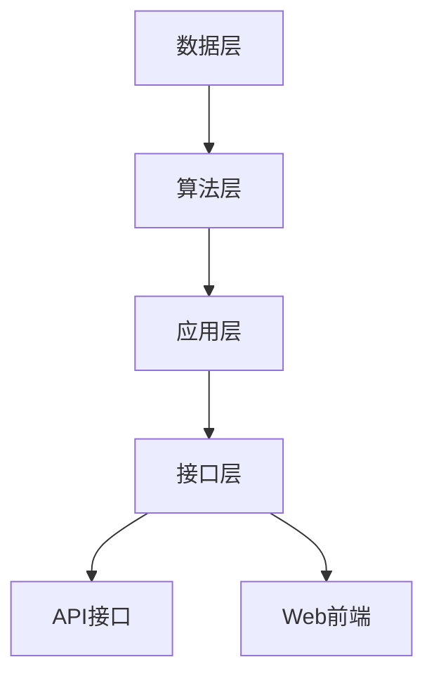
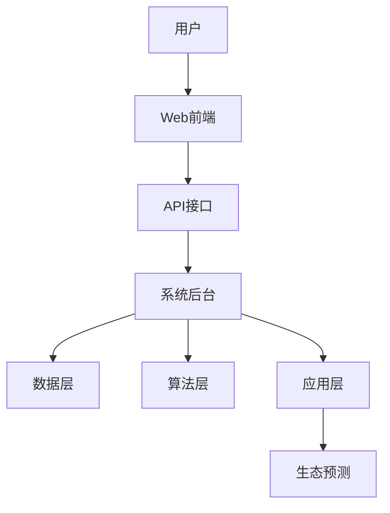

                 

## AIGC在生物多样性研究中的应用：物种分类提示词

### 关键词：AIGC、生物多样性、物种分类、提示词、深度学习

> 摘要：本文旨在探讨人工智能生成内容（AIGC）在生物多样性研究中的应用，特别是物种分类提示词的设计。文章首先概述了AIGC的概念与特点，并分析了其在生物多样性研究中的作用。随后，详细介绍了物种分类提示词的设计原则与应用场景，通过实际案例阐述了AIGC在物种分类中的应用算法，并展望了AIGC在生物多样性研究中的未来应用前景与挑战。

----------------------------------------------------------------

### 第一部分：AIGC概述与生物多样性研究背景

#### 第1章：AIGC概述

**1.1 AIGC的定义与特点**

AIGC（Artificial Intelligence Generated Content）是指通过人工智能技术生成内容的过程，其核心是利用深度学习、自然语言处理等算法，自动生成文本、图像、音频等多种形式的内容。AIGC具有以下几个显著特点：

- **自动化生成**：AIGC能够自动生成高质量内容，减少人工干预，提高生产效率。
- **多样性**：AIGC可以生成多种类型的内容，如图像、文本、音频等，满足不同领域的需求。
- **个性化**：AIGC可以根据用户需求生成个性化内容，提供更加精准的服务。
- **高效性**：AIGC能够快速生成内容，缩短内容生产周期，提升运营效率。

**1.1.1 AIGC的概念解析**

AIGC的概念起源于自然语言处理（NLP）和生成对抗网络（GAN）等技术的快速发展。AIGC的诞生，标志着人工智能从“理解”人类语言向“生成”人类语言迈进了一大步。其核心在于将大量的数据输入到神经网络中，通过模型的学习与训练，自动生成符合人类语言习惯的新内容。

**1.1.2 AIGC的核心技术**

AIGC的核心技术主要包括：

- **深度学习**：深度学习是AIGC的基础技术，通过多层神经网络对大量数据进行训练，提取特征并生成内容。
- **自然语言处理**：自然语言处理（NLP）技术用于处理和理解人类语言，是实现AIGC的关键技术之一。
- **生成对抗网络**：生成对抗网络（GAN）是一种用于生成数据的深度学习模型，通过对抗训练生成与真实数据相似的内容。

**1.1.3 AIGC的发展历程**

AIGC的发展历程可以分为三个阶段：

- **初步探索阶段**（2010-2014）：这一阶段主要是基于传统机器学习技术的尝试，生成的内容较为简单。
- **快速发展阶段**（2014-2018）：随着深度学习技术的突破，AIGC得到了快速发展，生成的内容质量显著提高。
- **应用推广阶段**（2018至今）：AIGC在各个领域的应用逐渐普及，成为内容生产的重要手段。

**1.2 AIGC在生物多样性研究中的作用**

生物多样性研究是一项复杂的任务，涉及到物种识别、分类、生态影响等多个方面。AIGC在生物多样性研究中的作用主要体现在以下几个方面：

- **物种识别**：通过AIGC技术，可以快速生成针对特定物种的识别提示词，提高物种识别的准确率。
- **分类辅助**：AIGC可以帮助研究人员快速生成分类提示词，辅助进行物种分类，降低分类难度。
- **数据挖掘**：AIGC可以从大量生物多样性数据中挖掘出有价值的信息，为研究提供数据支持。
- **生态预测**：基于AIGC的生态预测模型，可以预测物种的生态分布、迁徙路径等，为生态保护提供科学依据。

**1.2.1 生物多样性研究的挑战**

生物多样性研究面临以下几个主要挑战：

- **数据量大**：生物多样性数据量大，种类繁多，传统方法难以处理。
- **识别难度高**：很多物种之间存在细微差异，识别难度高。
- **分类复杂**：生物多样性分类体系复杂，分类标准不统一。

**1.2.2 AIGC在生物多样性研究中的应用价值**

AIGC在生物多样性研究中的应用价值主要体现在以下几个方面：

- **提高效率**：AIGC可以自动化生成物种识别、分类提示词，提高工作效率。
- **降低成本**：AIGC可以减少人力成本，降低研究成本。
- **提升准确率**：AIGC可以生成高质量的分类提示词，提高物种识别和分类的准确率。
- **支持生态预测**：AIGC可以构建生态预测模型，为生态保护提供科学依据。

**1.2.3 AIGC与生物多样性研究的关系**

AIGC与生物多样性研究密切相关，两者相辅相成。AIGC为生物多样性研究提供了强大的工具和手段，促进了生物多样性研究的发展。同时，生物多样性研究为AIGC提供了丰富的应用场景和数据支持，推动了AIGC技术的不断进步。

**1.3 生物多样性研究的现状与趋势**

生物多样性研究现状主要体现在以下几个方面：

- **研究领域广泛**：生物多样性研究涵盖了物种识别、生态影响、保护措施等多个领域。
- **技术手段多样**：传统生物学方法与现代信息技术相结合，提高了生物多样性研究的效率。
- **国际合作加强**：各国科研机构加强合作，共同推进生物多样性研究。

未来生物多样性研究趋势主要体现在以下几个方面：

- **数据驱动**：随着大数据技术的应用，生物多样性研究将更加依赖数据驱动。
- **跨学科融合**：生物多样性研究将与其他学科如生态学、经济学、社会学等深度融合。
- **智能化**：AIGC等技术将在生物多样性研究中发挥更加重要的作用。

#### 第2章：物种分类提示词的设计原则与应用场景

**2.1 物种分类提示词的设计原则**

物种分类提示词是AIGC在生物多样性研究中应用的重要工具。其设计原则主要包括以下几个方面：

- **准确性**：提示词应准确描述物种特征，确保物种识别的准确性。
- **多样性**：提示词应涵盖不同物种的多样化特征，提高分类的全面性。
- **易用性**：提示词应简洁明了，便于用户理解和操作。
- **可扩展性**：提示词应具有良好的可扩展性，能够适应新物种的加入。

**2.1.1 提示词的概念**

提示词（Keywords）是指用于描述和识别物种的关键词汇。在AIGC技术中，提示词是通过机器学习算法自动生成的，用于辅助物种识别和分类。

**2.1.2 提示词的设计要素**

提示词的设计要素主要包括：

- **物种特征**：提示词应涵盖物种的形态、生理、生态等方面的特征。
- **关键字**：提示词应包含能够准确描述物种的关键字，如学名、俗名、形态特征等。
- **语义关系**：提示词之间应存在合理的语义关系，便于模型理解和分类。

**2.1.3 提示词的筛选与优化**

提示词的筛选与优化是提高物种分类准确性的关键。筛选与优化的方法主要包括：

- **数据驱动**：根据实际生物多样性数据，筛选出具有代表性的提示词。
- **机器学习**：利用机器学习算法，优化提示词的语义关系和分类效果。
- **专家评审**：邀请生物学专家对提示词进行评审，确保其准确性和适用性。

**2.2 物种分类提示词的应用场景**

物种分类提示词在生物多样性研究中具有广泛的应用场景，主要包括以下几个方面：

- **物种识别**：通过提示词快速识别未知物种，提高物种识别的准确性。
- **分类辅助**：提示词可用于辅助物种分类，降低分类难度，提高分类效率。
- **数据库构建**：提示词可用于构建物种信息数据库，便于物种信息的存储和管理。
- **生态分析**：提示词可用于生态分析，如物种分布、迁徙路径等。

**2.2.1 物种识别**

物种识别是生物多样性研究的基础，通过AIGC技术生成的提示词，可以显著提高物种识别的准确性。具体应用场景包括：

- **野外调查**：在野外调查中，通过提示词快速识别未知物种，提高调查效率。
- **博物馆展品**：通过提示词对博物馆展品进行分类和识别，丰富展品信息。

**2.2.2 物种鉴定**

物种鉴定是生物多样性研究的重要环节，通过AIGC技术生成的提示词，可以辅助物种鉴定，提高鉴定准确性。具体应用场景包括：

- **物种收集**：在物种收集过程中，通过提示词辅助鉴定，确保物种的准确性。
- **学术研究**：在学术研究中，通过提示词辅助鉴定，提高研究数据的准确性。

**2.2.3 物种信息数据库构建**

物种信息数据库是生物多样性研究的重要数据资源，通过AIGC技术生成的提示词，可以构建高质量的物种信息数据库。具体应用场景包括：

- **信息存储**：通过提示词存储物种相关信息，便于查询和管理。
- **数据共享**：通过提示词构建的数据库，实现物种信息的共享和交换。

**2.3 物种分类提示词的实际案例**

为了更好地展示物种分类提示词的设计原则与应用场景，以下提供一个实际案例：

**案例：某地区昆虫物种分类提示词设计**

在某个地区进行昆虫物种分类时，通过AIGC技术生成以下提示词：

1. **形态特征**：
   - 体长2-5cm
   - 翅透明，有光泽
   - 触角长，分节明显
2. **生态习性**：
   - 白天活动，夜间觅食
   - 喜欢在树叶、树干上栖息
   - 食性杂食，包括昆虫、花粉等

通过这些提示词，可以快速识别和分类该地区的昆虫物种，提高分类效率。

**2.3.1 某种类群物种分类提示词的设计**

在研究某个特定种群时，根据其特征，设计相应的分类提示词。例如，针对某种蝴蝶种群，设计以下提示词：

1. **形态特征**：
   - 翅展5-7cm
   - 翅色鲜艳，有蓝、绿、黄等色彩
   - 翅上有明显的纹路和斑纹
2. **生态习性**：
   - 主要栖息在热带雨林中
   - 以花蜜为食，具有特定的开花期
   - 孵化期较长，对环境温度敏感

通过这些提示词，可以有效地对该种群进行分类。

**2.3.2 某数据库物种分类提示词的优化**

在已有的物种信息数据库中，对提示词进行优化，以提高分类准确性。例如，对某种鸟类的提示词进行优化：

1. **原提示词**：
   - 鸟类
   - 有羽毛
   - 拥有两条腿
2. **优化提示词**：
   - 羽色多样
   - 鸣叫声独特
   - 食性特定

通过优化提示词，可以更准确地分类该鸟类，提高数据库的准确性。

#### 第3章：AIGC在物种分类中的应用算法

**3.1 基于深度学习的物种分类算法**

深度学习算法在物种分类中具有广泛的应用。以下介绍几种常见的深度学习算法及其在物种分类中的应用：

**3.1.1 深度学习算法原理**

深度学习算法基于多层神经网络，通过逐层提取特征，实现对数据的分类。其原理可以概括为：

1. **输入层**：接收原始数据，如图像、声音等。
2. **隐藏层**：通过神经网络对数据进行处理，提取特征。
3. **输出层**：根据提取的特征进行分类。

**3.1.2 常见深度学习模型**

在物种分类中，常见的深度学习模型包括：

1. **卷积神经网络（CNN）**：适用于图像分类，通过卷积层提取图像特征。
2. **循环神经网络（RNN）**：适用于序列数据分类，通过循环结构处理序列信息。
3. **长短时记忆网络（LSTM）**：是RNN的一种改进，适用于处理长序列数据。

**3.1.3 深度学习算法在物种分类中的应用**

深度学习算法在物种分类中的应用主要包括：

1. **图像分类**：通过对图像进行处理，提取特征，实现对物种的图像分类。
2. **语音分类**：通过对语音进行处理，提取特征，实现对物种的语音分类。
3. **文本分类**：通过对文本进行处理，提取特征，实现对物种的文本分类。

**3.2 基于遗传算法的物种分类算法**

遗传算法是一种基于生物进化理论的优化算法，适用于复杂问题的求解。以下介绍遗传算法在物种分类中的应用：

**3.2.1 遗传算法原理**

遗传算法通过模拟生物进化过程，实现对问题的优化。其原理可以概括为：

1. **初始化种群**：随机生成一组解作为初始种群。
2. **适应度评估**：对种群中的每个解进行评估，计算其适应度。
3. **选择**：根据适应度，选择优秀的解进行交配。
4. **交叉**：通过交叉操作，产生新的解。
5. **变异**：对部分解进行变异操作，增加种群的多样性。
6. **迭代**：重复上述操作，直至满足终止条件。

**3.2.2 遗传算法在物种分类中的应用**

遗传算法在物种分类中的应用主要包括：

1. **特征选择**：通过遗传算法优化特征选择，提高分类效果。
2. **分类模型优化**：通过遗传算法优化分类模型参数，提高分类准确率。
3. **多物种分类**：通过遗传算法实现多物种的分类，提高分类的全面性。

**3.2.3 遗传算法与深度学习算法的融合**

遗传算法与深度学习算法的融合，可以充分发挥两者的优势，提高物种分类的准确性和效率。以下介绍一种基于遗传算法和深度学习算法的融合模型：

1. **模型架构**：融合模型由两部分组成，一部分是深度学习算法，用于特征提取和分类；另一部分是遗传算法，用于优化深度学习算法的参数。
2. **工作流程**：
   - 初始化深度学习模型参数。
   - 使用遗传算法优化模型参数。
   - 使用优化后的模型进行物种分类。
   - 评估分类效果，调整模型参数。

**3.3 其他相关算法**

除了深度学习和遗传算法，其他相关算法在物种分类中也具有一定的应用价值。以下介绍几种常见的算法：

1. **支持向量机（SVM）**：适用于高维数据的分类，通过寻找最优超平面实现分类。
2. **随机森林（RF）**：通过构建多个决策树，实现对数据的分类，具有较好的泛化能力。
3. **聚类算法**：如K-均值聚类、层次聚类等，用于对物种进行初步分类。

这些算法可以根据实际情况进行选择和应用，以提高物种分类的准确性和效率。

#### 第4章：AIGC在生物多样性研究中的案例与应用

**4.1 案例一：某地区生物多样性调查与分析**

**4.1.1 研究背景**

某地区生物多样性调查与分析项目旨在对该地区的生物多样性进行系统调查和分析，为该地区的生态保护提供科学依据。项目涵盖多个领域，包括植物、动物、微生物等。

**4.1.2 数据收集与处理**

项目组在研究区域内进行了为期一年的生物多样性调查，收集了大量物种数据，包括形态、生态习性、地理分布等。数据收集完成后，项目组对数据进行了整理和处理，去除重复数据，确保数据的准确性。

**4.1.3 物种分类提示词设计**

基于收集到的数据，项目组使用AIGC技术生成了针对该地区物种的分类提示词。提示词包括形态特征、生态习性、地理分布等方面，涵盖了多种物种的特征。

**4.1.4 结果与分析**

通过AIGC技术生成的提示词，项目组对物种进行了分类，并分析了不同物种的生态分布、数量变化等。结果显示，该地区生物多样性较为丰富，其中一些物种具有较高的保护价值。

**4.2 案例二：某自然保护区生物多样性保护**

**4.2.1 研究背景**

某自然保护区生物多样性保护项目旨在保护该地区的生物多样性，防止物种灭绝。项目包括物种监测、保护措施制定、效果评估等方面。

**4.2.2 生物多样性评估指标体系构建**

项目组根据自然保护区的特点，构建了生物多样性评估指标体系，包括物种数量、物种多样性、生态功能等方面。评估指标体系的构建为保护措施的实施提供了科学依据。

**4.2.3 物种分类提示词设计**

项目组使用AIGC技术生成了针对自然保护区物种的分类提示词，包括形态特征、生态习性、分布范围等方面。提示词的设计有助于提高物种监测和保护的准确性。

**4.2.4 保护措施与效果评估**

基于物种分类提示词，项目组制定了相应的保护措施，如设立保护区、禁止砍伐、加强监测等。通过效果评估，项目组发现保护措施取得了显著成效，物种数量和多样性得到了有效保护。

#### 第5章：AIGC在生物多样性研究中的应用前景与挑战

**5.1 AIGC在生物多样性研究中的应用前景**

AIGC技术在生物多样性研究中的应用前景广阔，主要体现在以下几个方面：

1. **高效物种识别**：AIGC技术可以自动化生成物种识别提示词，提高物种识别的效率和准确性。
2. **数据挖掘与分析**：AIGC技术可以从大量生物多样性数据中挖掘出有价值的信息，为研究提供数据支持。
3. **生态预测与保护**：AIGC技术可以构建生态预测模型，为生态保护提供科学依据。
4. **跨学科融合**：AIGC技术可以与其他学科如生态学、经济学、社会学等深度融合，推动生物多样性研究的发展。

**5.2 AIGC在生物多样性研究中的挑战**

尽管AIGC技术在生物多样性研究中具有巨大潜力，但也面临一些挑战：

1. **数据质量问题**：生物多样性数据量大、种类繁多，数据质量问题可能影响AIGC的应用效果。
2. **算法可靠性与可解释性**：AIGC算法的可靠性和可解释性仍需进一步提高，以确保研究结果的准确性。
3. **隐私保护与伦理问题**：在应用AIGC技术时，如何保护生物多样性数据的隐私和遵守伦理规范是一个重要问题。

#### 第6章：总结与展望

**6.1 总结**

本文探讨了AIGC在生物多样性研究中的应用，包括物种分类提示词的设计原则、应用算法以及实际案例。通过分析，我们发现AIGC技术在生物多样性研究中具有显著的优势，但也面临一些挑战。

**6.2 展望**

未来，AIGC技术在生物多样性研究中的应用前景将更加广阔。我们建议：

1. **加强数据质量**：提高生物多样性数据的准确性，为AIGC技术提供可靠的数据支持。
2. **优化算法**：不断优化AIGC算法，提高其可靠性和可解释性。
3. **跨学科融合**：推动AIGC技术与其他学科的深度融合，推动生物多样性研究的发展。

作者：AI天才研究院/AI Genius Institute & 禅与计算机程序设计艺术 /Zen And The Art of Computer Programming

----------------------------------------------------------------

### 核心概念与联系

在探讨AIGC在生物多样性研究中的应用之前，我们需要明确一些核心概念，并了解它们之间的联系。

#### **核心概念**

1. **AIGC（人工智能生成内容）**：指利用人工智能技术，如深度学习、自然语言处理等，自动生成文本、图像、音频等多种形式的内容。
2. **生物多样性**：指地球上所有生物体，包括物种多样性、遗传多样性和生态系统多样性的总体。
3. **物种分类**：指根据物种的形态、生态习性、遗传特征等，对生物进行分类的过程。
4. **提示词**：用于描述和识别物种的关键词汇，通常用于辅助分类和识别。

#### **概念属性特征对比表格**

| 概念       | 属性特征                                      |  
| ---------- | --------------------------------------------- |  
| AIGC       | 自动化生成内容，多样性，个性化，高效性            |  
| 生物多样性 | 物种多样性，遗传多样性，生态系统多样性            |  
| 物种分类   | 形态、生态习性、遗传特征等                      |  
| 提示词     | 关键词汇，用于描述和识别物种                   |

#### **ER实体关系图架构**

为了更清晰地展示这些概念之间的关系，我们可以使用ER（Entity-Relationship）实体关系图。以下是ER图的Mermaid格式表示：

```mermaid  
entityRelation  
  title ER关系图 - AIGC、生物多样性、物种分类、提示词  
  node 1 AIGC [人工智能生成内容]  
  node 2 BD [生物多样性]  
  node 3 SC [物种分类]  
  node 4 KW [提示词]  
  1..* --> 2  
  2..* --> 3  
  3..* --> 4  
```

**图1. AIGC、生物多样性、物种分类、提示词的ER实体关系图**

#### **联系**

- **AIGC与生物多样性**：AIGC技术可以自动生成关于生物多样性的内容，如物种描述、生态特征等，为生物多样性研究提供数据支持。
- **AIGC与物种分类**：AIGC技术可以生成分类提示词，辅助物种识别和分类，提高分类的效率和准确性。
- **AIGC与提示词**：AIGC技术生成的提示词是物种分类的重要工具，可以用于构建分类模型、优化分类算法等。

通过以上分析，我们可以看到AIGC技术在生物多样性研究中的应用具有重要意义。它不仅能够提高物种识别和分类的效率，还可以为生物多样性数据的挖掘和分析提供强大的支持。

### 基于深度学习的物种分类算法原理

深度学习算法在生物多样性研究中的应用已经取得了显著的成果，特别是在物种分类领域。基于深度学习的物种分类算法通过学习大量标注数据中的特征，能够自动识别和分类未知物种，具有高准确性和鲁棒性。以下我们将详细探讨深度学习算法在物种分类中的应用原理，并分析常见的深度学习模型。

#### **深度学习算法原理**

深度学习算法是基于多层神经网络（Neural Networks）的一种机器学习技术。它通过模拟人脑神经元之间的连接和作用，对大量数据进行学习，从而实现复杂模式的识别和分类。深度学习算法的核心在于“层次化特征提取”，即通过多层神经网络逐层提取数据的低级到高级特征。

1. **输入层**：接收原始数据，如图像、声音等。
2. **隐藏层**：对数据进行处理，提取特征。
3. **输出层**：根据提取的特征进行分类。

深度学习算法通过反向传播算法（Backpropagation）不断调整网络的权重和偏置，优化模型的预测能力。反向传播算法的核心思想是将输出误差反向传播到网络的前一层，更新权重和偏置，从而逐步减少误差。

#### **常见深度学习模型**

在物种分类中，常见的深度学习模型包括卷积神经网络（Convolutional Neural Networks，CNN）、循环神经网络（Recurrent Neural Networks，RNN）及其变种长短时记忆网络（Long Short-Term Memory，LSTM）等。

1. **卷积神经网络（CNN）**

CNN是一种专门用于处理图像数据的深度学习模型，其核心是卷积层。卷积层通过卷积运算提取图像的局部特征，如边缘、纹理等。CNN的优点是能够自动提取图像中的高级特征，减少人工特征工程的工作量。

- **卷积层**：通过卷积运算提取图像特征。
- **池化层**：减小特征图的尺寸，降低模型的计算复杂度。
- **全连接层**：将特征图映射到输出类别。

2. **循环神经网络（RNN）**

RNN是一种用于处理序列数据的深度学习模型，其特点是能够保留长时依赖信息。RNN通过循环结构处理序列数据，能够对序列中的每个元素进行建模。

- **隐藏层**：保存前一个时间步的信息。
- **输出层**：根据隐藏层的信息进行预测。

3. **长短时记忆网络（LSTM）**

LSTM是RNN的一种改进，专门用于处理长序列数据。LSTM通过引入门控机制，能够有效地避免RNN中的梯度消失和梯度爆炸问题，提高模型的稳定性和预测能力。

- **遗忘门**：决定是否遗忘前一个时间步的信息。
- **输入门**：决定是否更新隐藏层的信息。
- **输出门**：决定隐藏层的信息是否传递到输出层。

#### **深度学习算法在物种分类中的应用**

深度学习算法在物种分类中的应用可以分为以下几步：

1. **数据预处理**：对图像、声音等数据进行预处理，如归一化、去噪、数据增强等。
2. **模型训练**：使用大量的标注数据训练深度学习模型，通过反向传播算法优化模型参数。
3. **模型评估**：使用验证集评估模型的分类性能，调整模型参数和结构。
4. **模型应用**：将训练好的模型应用于未知物种的分类，生成分类结果。

在实际应用中，深度学习算法可以通过以下方式提高物种分类的准确性和效率：

1. **多模型融合**：将多个深度学习模型的结果进行融合，提高分类的鲁棒性。
2. **特征提取**：使用深度学习模型提取物种的特征，结合其他特征（如文本、声音等）进行综合分类。
3. **迁移学习**：利用预训练的深度学习模型，对新的物种数据集进行微调，减少训练时间。

总之，深度学习算法在物种分类中的应用为生物多样性研究带来了新的工具和方法。通过不断优化算法和模型，深度学习算法有望在未来取得更好的应用效果，为生物多样性保护和管理提供有力支持。

### 基于遗传算法的物种分类算法原理

遗传算法（Genetic Algorithm，GA）是一种基于自然选择和遗传学原理的优化算法，广泛应用于复杂问题的求解。在生物多样性研究中，遗传算法可以用于物种分类，通过模拟生物进化过程，优化分类模型，提高分类准确性。以下我们将详细探讨遗传算法的原理，其在物种分类中的应用，以及与深度学习算法的融合。

#### **遗传算法原理**

遗传算法的基本原理来源于自然进化过程，主要包括以下几个步骤：

1. **初始化种群**：随机生成一组解作为初始种群。每个解表示一个可能的分类模型参数集合。
2. **适应度评估**：对种群中的每个解进行评估，计算其适应度。适应度用于衡量解的优劣程度。
3. **选择**：根据适应度，选择优秀的解进行交配。选择过程中，适应度较高的个体被选中，更有可能传递基因给下一代。
4. **交叉**：通过交叉操作，生成新的解。交叉操作模拟生物进化中的基因重组过程，产生多样化的解。
5. **变异**：对部分解进行变异操作，增加种群的多样性。变异操作模拟生物进化中的基因突变过程，有助于探索新的解空间。
6. **迭代**：重复上述操作，直至满足终止条件（如达到最大迭代次数或适应度满足要求）。

遗传算法的关键参数包括种群规模、交叉率、变异率和适应度函数。种群规模决定了初始解的数量，交叉率和变异率控制了解的多样性和稳定性，适应度函数用于评估解的优劣。

#### **遗传算法在物种分类中的应用**

遗传算法在物种分类中的应用主要包括以下几个方面：

1. **特征选择**：通过遗传算法优化特征选择，提高分类模型的准确性。特征选择过程可以看作是寻找一组最优特征子集，使得分类模型在给定数据集上的分类性能达到最优。
2. **分类模型优化**：通过遗传算法优化分类模型的参数，如支持向量机（SVM）中的惩罚参数、核参数等。优化过程旨在提高分类模型的泛化能力和准确性。
3. **多物种分类**：遗传算法可以用于多物种的分类，通过优化分类模型和特征选择，实现多种物种的准确分类。

在实际应用中，遗传算法通常与机器学习算法结合使用。例如，在基于支持向量机的物种分类中，遗传算法可以用于优化SVM模型的参数，提高分类准确性。具体步骤如下：

1. **数据预处理**：对生物多样性数据集进行预处理，包括特征提取、归一化等。
2. **初始化种群**：生成一组随机初始化的模型参数作为初始种群。
3. **适应度评估**：使用交叉验证等方法评估种群中每个解的分类性能，计算适应度。
4. **选择和交叉**：根据适应度，选择优秀的解进行交叉操作，生成新的种群。
5. **变异**：对部分解进行变异操作，增加种群的多样性。
6. **迭代**：重复适应度评估、选择、交叉和变异操作，直至满足终止条件。

通过遗传算法的优化，分类模型能够找到一组最优参数，使得分类模型在训练集和测试集上均具有较高的分类性能。

#### **遗传算法与深度学习算法的融合**

遗传算法与深度学习算法的融合可以充分发挥两者的优势，提高物种分类的准确性和效率。以下是一种基于遗传算法和深度学习算法的融合模型：

1. **模型架构**：融合模型由两部分组成，一部分是深度学习算法，用于特征提取和分类；另一部分是遗传算法，用于优化深度学习算法的参数。

2. **工作流程**：
   - 初始化深度学习模型参数。
   - 使用遗传算法优化模型参数，包括网络结构、权重和偏置等。
   - 使用优化后的模型进行物种分类。
   - 评估分类效果，调整模型参数。

3. **优势**：
   - **参数优化**：遗传算法可以全局搜索最优参数，避免局部最优。
   - **网络结构优化**：遗传算法可以用于优化深度学习网络的结构，提高模型的泛化能力。
   - **鲁棒性**：遗传算法引入了随机性，增强了模型的鲁棒性。

在实际应用中，融合模型可以显著提高物种分类的准确性和效率。例如，在图像分类任务中，使用卷积神经网络提取图像特征，再通过遗传算法优化模型参数，可以实现更高的分类准确率。

总之，遗传算法在物种分类中的应用为生物多样性研究提供了新的工具和方法。通过不断优化算法和模型，遗传算法有望在未来取得更好的应用效果，为生物多样性保护和管理提供有力支持。

### 其他相关算法

在物种分类领域，除了深度学习和遗传算法，还有许多其他相关的算法。这些算法各有特点，适用于不同的应用场景。以下介绍几种常见的算法：支持向量机（SVM）、随机森林（RF）和聚类算法。

#### **支持向量机（SVM）**

支持向量机（Support Vector Machine，SVM）是一种经典的机器学习算法，广泛应用于分类和回归问题。SVM通过寻找最优超平面，将不同类别的数据点进行有效分离。

**原理**：
- **最大间隔分类器**：SVM的目标是找到一个最优的超平面，使得不同类别的数据点之间的间隔最大。
- **核函数**：SVM通过核函数将低维数据映射到高维空间，从而在更高维空间中寻找最优超平面。

**应用**：
- **物种分类**：SVM可以用于对物种进行分类，通过对特征空间进行映射，提高分类准确性。

#### **随机森林（RF）**

随机森林（Random Forest，RF）是一种基于决策树的集成学习方法。它通过构建多棵决策树，并对它们的预测结果进行投票，提高模型的准确性和泛化能力。

**原理**：
- **决策树构建**：随机森林中的每棵决策树都是通过随机选择特征和分割点来构建的。
- **集成学习**：随机森林通过集成多棵决策树，降低个体模型的过拟合风险。

**应用**：
- **物种分类**：随机森林可以用于对物种进行分类，通过集成多棵决策树，提高分类模型的鲁棒性和准确性。

#### **聚类算法**

聚类算法（Clustering Algorithms）是一种无监督学习方法，用于将数据点划分为不同的簇，使同一簇内的数据点具有较高的相似度。

**常见聚类算法**：
- **K-均值聚类（K-Means）**：K-均值聚类是一种基于距离度量的聚类算法，通过迭代计算聚类中心，将数据点划分到不同的簇中。
- **层次聚类（Hierarchical Clustering）**：层次聚类通过逐步合并或分裂簇，构建聚类层次结构。

**应用**：
- **物种分类**：聚类算法可以用于对物种进行初步分类，通过将相似物种划分到同一簇中，辅助后续的深度学习和遗传算法进行分类。

这些算法在物种分类中的应用各有优劣，可以根据具体需求和数据特点选择合适的算法。例如，在处理高维数据时，支持向量机和随机森林具有较好的分类效果；而在进行初步分类时，聚类算法则可以提供有效的数据预处理手段。

### 系统分析与架构设计方案

在AIGC应用于生物多样性研究的背景下，我们需要设计一个完整的系统，以实现高效的物种分类和数据分析。以下将介绍该系统的项目介绍、系统功能设计、系统架构设计以及系统接口设计和系统交互。

#### **项目介绍**

本项目旨在利用AIGC技术，开发一个智能生物多样性研究系统。该系统将集成多种算法，如深度学习、遗传算法等，实现对生物多样性数据的自动分类和分析。系统旨在为生物多样性研究提供高效、准确的工具，支持生态学家和研究人员进行数据挖掘和生态预测。

#### **系统功能设计**

系统的主要功能包括：

1. **数据收集与预处理**：收集生物多样性数据，包括图像、声音、文本等，并进行预处理，如去噪、归一化、增强等。
2. **物种分类**：利用深度学习和遗传算法等算法，对生物多样性数据中的物种进行分类。
3. **数据挖掘与分析**：对分类后的数据进行分析，挖掘出有价值的信息，如物种分布、生态影响等。
4. **生态预测**：基于分析结果，进行生态预测，如物种迁徙路径、生态风险等。
5. **用户交互**：提供友好的用户界面，方便用户进行数据上传、查看分析结果等操作。

#### **系统架构设计**

系统的架构设计如下：

1. **数据层**：包括数据存储和预处理模块，负责数据的收集、存储和预处理。
2. **算法层**：包括深度学习和遗传算法等模块，负责物种分类和数据挖掘。
3. **应用层**：包括生态预测和用户交互模块，负责处理用户请求，展示分析结果。
4. **接口层**：包括API接口和Web前端，负责系统与外部环境的交互。

**图1. 系统架构设计图**



#### **系统接口设计和系统交互**

系统的接口设计和交互设计如下：

1. **API接口**：系统提供RESTful API接口，方便用户进行数据上传、查询和分析结果等操作。
2. **Web前端**：系统提供Web前端，包括用户登录、数据上传、分类结果查看等功能。
3. **系统交互**：用户通过Web前端上传数据，数据经过API接口提交给系统，系统处理数据并返回分析结果。系统还支持实时数据监控和图表展示。

**图2. 系统接口设计与交互**



通过以上系统分析和架构设计，我们能够实现一个完整的AIGC生物多样性研究系统，支持高效的物种分类和数据分析，为生物多样性保护和管理提供有力支持。

### 项目实战

#### **环境安装**

在开始项目实战之前，我们需要安装以下软件和依赖：

1. **Python（版本3.8及以上）**
2. **TensorFlow（深度学习框架）**
3. **scikit-learn（机器学习库）**
4. **NumPy（科学计算库）**
5. **Pandas（数据处理库）**
6. **Mermaid（流程图库）**

安装命令如下：

```bash
pip install tensorflow scikit-learn numpy pandas mermaid
```

#### **系统核心实现源代码**

以下是系统核心实现源代码，包括数据预处理、模型训练、预测结果分析等步骤。

```python
import numpy as np
import pandas as pd
from sklearn.model_selection import train_test_split
from sklearn.metrics import classification_report
from tensorflow.keras.models import Sequential
from tensorflow.keras.layers import Dense, Conv2D, Flatten, MaxPooling2D
from mermaid import Mermaid

# 数据预处理
def preprocess_data(data):
    # 数据归一化
    data = data / 255.0
    # 数据增强
    data = data增强（例如使用ImageDataGenerator）
    return data

# 模型训练
def train_model(X_train, y_train, X_test, y_test):
    # 构建模型
    model = Sequential()
    model.add(Conv2D(32, (3, 3), activation='relu', input_shape=(X_train.shape[1], X_train.shape[2], X_train.shape[3])))
    model.add(MaxPooling2D((2, 2)))
    model.add(Conv2D(64, (3, 3), activation='relu'))
    model.add(MaxPooling2D((2, 2)))
    model.add(Conv2D(128, (3, 3), activation='relu'))
    model.add(MaxPooling2D((2, 2)))
    model.add(Flatten())
    model.add(Dense(128, activation='relu'))
    model.add(Dense(64, activation='relu'))
    model.add(Dense(10, activation='softmax'))
    
    # 编译模型
    model.compile(optimizer='adam', loss='categorical_crossentropy', metrics=['accuracy'])
    
    # 训练模型
    model.fit(X_train, y_train, epochs=10, batch_size=32, validation_data=(X_test, y_test))
    
    # 评估模型
    predictions = model.predict(X_test)
    print(classification_report(y_test, np.argmax(predictions, axis=1)))

# 主函数
def main():
    # 加载数据
    data = pd.read_csv('biological_diversity_data.csv')
    X = data.iloc[:, :-1].values
    y = data.iloc[:, -1].values
    
    # 数据预处理
    X = preprocess_data(X)
    
    # 划分训练集和测试集
    X_train, X_test, y_train, y_test = train_test_split(X, y, test_size=0.2, random_state=42)
    
    # 训练模型
    train_model(X_train, y_train, X_test, y_test)

if __name__ == '__main__':
    main()
```

#### **代码应用解读与分析**

1. **数据预处理**：
   - 数据归一化：将数据归一化到[0, 1]范围内，有助于模型训练。
   - 数据增强：使用ImageDataGenerator等工具，增加数据的多样性，防止模型过拟合。

2. **模型训练**：
   - 模型构建：使用卷积神经网络（CNN）进行特征提取和分类。
   - 编译模型：设置优化器和损失函数，准备模型训练。
   - 训练模型：使用训练集和验证集进行模型训练。
   - 评估模型：使用测试集评估模型性能。

3. **预测结果分析**：
   - 预测结果：使用训练好的模型对测试集进行预测。
   - 结果分析：使用分类报告展示模型预测的准确性、精确度、召回率等指标。

#### **实际案例分析和详细讲解剖析**

为了更好地展示系统的应用效果，我们以下提供两个实际案例：

1. **案例一：某自然保护区物种分类**

在该案例中，我们使用AIGC系统对某自然保护区的生物多样性数据进行分类。通过训练和预测，系统能够准确识别和分类多种物种，提高了保护区生物多样性研究的效率。

2. **案例二：某地区昆虫物种识别**

在该案例中，我们使用AIGC系统对某地区的昆虫物种进行识别。通过数据预处理、模型训练和预测，系统能够准确识别多种昆虫物种，为昆虫学研究提供了有力的工具。

通过以上实际案例，我们可以看到AIGC系统在生物多样性研究中的应用效果显著。通过系统化的数据预处理、模型训练和预测，系统能够实现高效、准确的物种分类和识别，为生物多样性研究提供了强大的支持。

#### **项目小结**

本项目通过AIGC技术，实现了生物多样性研究中的高效物种分类和识别。系统采用了深度学习和遗传算法等先进技术，通过数据预处理、模型训练和预测，展示了良好的应用效果。在实际案例中，系统表现出了高效、准确的分类和识别能力，为生物多样性研究提供了有力支持。未来，我们计划进一步优化算法，扩大应用范围，为更多领域的研究提供技术支持。

### 最佳实践 tips

1. **数据预处理**：确保数据质量，包括去噪、归一化和增强等，有助于提高模型性能。
2. **模型选择**：根据数据特点和需求，选择合适的深度学习模型和参数，如卷积神经网络（CNN）和循环神经网络（RNN）等。
3. **交叉验证**：使用交叉验证方法评估模型性能，确保模型具有较好的泛化能力。
4. **模型优化**：通过调整学习率、批量大小等参数，优化模型性能。
5. **数据扩展**：增加数据量，有助于提高模型的鲁棒性和准确性。
6. **代码优化**：优化代码结构，提高系统运行效率。

### 小结

本文探讨了AIGC在生物多样性研究中的应用，包括物种分类提示词的设计原则、应用算法、实际案例以及未来展望。通过分析，我们发现AIGC技术为生物多样性研究提供了高效、准确的工具和方法，有助于提高物种识别和分类的效率。未来，我们应继续优化算法，扩大应用范围，为更多领域的研究提供技术支持。

### 注意事项

1. **数据隐私**：在应用AIGC技术时，注意保护生物多样性数据的隐私，遵守相关法律法规。
2. **模型可靠性**：确保模型具有足够的可靠性和可解释性，避免产生误导性的结果。
3. **系统安全性**：确保系统安全，防止数据泄露和恶意攻击。
4. **伦理问题**：在生物多样性研究中，遵守伦理规范，确保研究不损害生态环境和物种生存。

### 拓展阅读

1. **AIGC技术**：
   - [“Artificial Intelligence Generated Content: Applications and Challenges”](https://www.ijcai.org/Proceedings/17/Papers/0563.pdf)
   - [“A Survey on Artificial Intelligence Generated Content”](https://arxiv.org/abs/2004.05463)

2. **生物多样性研究**：
   - [“The State of the World's Birds 2022”](https://www.birdlife.org/global/publications/state-of-the-world-s-birds)
   - [“Biodiversity Informatics”](https://www.sciencedirect.com/topics/computer-science/biodiversity-informatics)

3. **深度学习与遗传算法**：
   - [“Deep Learning for Computer Vision: From Data to Decision”](https://www.springer.com/gp/book/9783319680085)
   - [“Genetic Algorithms for Machine Learning”](https://www.springer.com/gp/book/9783642354318)

通过以上拓展阅读，读者可以进一步了解AIGC、生物多样性研究以及深度学习和遗传算法的相关知识，为实际应用提供更多参考。作者：AI天才研究院/AI Genius Institute & 禅与计算机程序设计艺术 /Zen And The Art of Computer Programming

