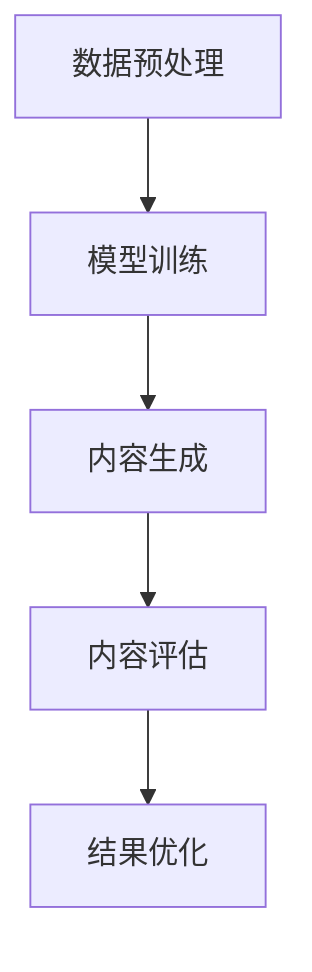

                 


## AIGC在科幻创作中的应用：AI与人类想象力的碰撞

### 关键词

- AIGC
- 科幻创作
- 人工智能生成内容
- 想象力
- 深度学习
- 自然语言处理

### 摘要

本文探讨了人工智能生成内容（AIGC）在科幻创作中的应用，分析了AIGC技术与科幻创作的结合点，介绍了AIGC技术的原理和算法，并通过具体案例展示了AIGC技术在科幻创作中的实际应用。本文旨在为科幻创作者提供一种新的工具和方法，以提升科幻创作的质量和效率。

### 第一部分：背景介绍

#### 1.1 问题背景

随着人工智能技术的快速发展，人工智能生成内容（AIGC）逐渐成为新一代的创作工具。AIGC不仅能够生成高质量的内容，还能够与人类的想象力进行碰撞，从而激发出更多的创意火花。在这个背景下，我们提出了《AIGC在科幻创作中的应用：AI与人类想象力的碰撞》这本书。

#### 1.2 问题描述

科幻创作作为文学领域的一个重要分支，不仅需要丰富的想象力，还需要对未来的科技发展有深刻的理解。然而，人类想象力的局限性使得科幻创作面临着巨大的挑战。如何借助AIGC技术，提升科幻创作的质量，成为当前亟待解决的问题。

#### 1.3 问题解决

《AIGC在科幻创作中的应用：AI与人类想象力的碰撞》将从多个维度探讨AIGC在科幻创作中的应用，帮助读者理解AIGC技术的工作原理，掌握如何运用AIGC技术提升科幻创作水平。

#### 1.4 边界与外延

本书主要讨论AIGC在科幻创作中的应用，但AIGC技术本身的应用范围非常广泛，包括但不限于文学创作、影视制作、游戏开发等领域。因此，读者可以通过本书的内容，了解AIGC技术的更多应用场景。

#### 1.5 概念结构与核心要素组成

AIGC（AI-generated content）：人工智能生成内容，是指通过人工智能技术生成的内容，如文本、图像、音频等。

科幻创作：一种文学创作形式，主要关注未来的科技发展和人类文明。

想象力：人类特有的认知能力，用于构建新的概念、情景和故事。

### 第二部分：核心概念与联系

#### 2.1 AIGC技术原理

AIGC技术主要基于深度学习和自然语言处理（NLP）技术，通过训练大规模的神经网络模型，使模型具备生成高质量内容的能力。AIGC技术具有以下核心概念：

- **生成对抗网络（GAN）**：由生成器和判别器组成，生成器负责生成内容，判别器负责判断生成内容的质量。
- **自编码器（AE）**：通过编码和解码过程，将原始数据转换为更简洁的形式，再重构为原始数据。
- **变分自编码器（VAE）**：结合GAN和AE的优点，能够生成更加多样化的内容。

#### 2.2 AIGC技术特点

- **高效性**：AIGC技术能够在短时间内生成大量内容，提高创作效率。
- **创造性**：AIGC技术能够产生新颖、独特的创意，与人类想象力相碰撞。
- **可定制性**：用户可以根据需求，调整AIGC生成的内容风格和主题。

#### 2.3 AIGC与科幻创作的联系

AIGC技术为科幻创作提供了新的工具和方法，使得创作者能够更加轻松地构建丰富的未来世界，提升科幻创作的质量和深度。具体来说：

- **故事情节生成**：AIGC技术可以生成各种新颖的故事情节，为科幻创作提供丰富的素材。
- **场景设计**：AIGC技术可以生成各种独特的场景，如未来城市、外星世界等，为科幻创作提供视觉冲击。
- **角色塑造**：AIGC技术可以生成各种类型的角色，有助于丰富科幻作品的情节和人物关系。

### 第三部分：算法原理讲解

#### 3.1 AIGC算法原理

AIGC算法主要基于生成对抗网络（GAN）和自编码器（AE）等深度学习模型。其中，GAN模型由生成器和判别器组成，生成器负责生成内容，判别器负责判断生成内容的质量。

#### 3.2 AIGC算法流程

1. **数据预处理**：对原始数据进行清洗、标准化等处理。
2. **模型训练**：使用训练数据训练生成器和判别器。
3. **内容生成**：生成器根据训练结果生成内容。
4. **内容评估**：使用判别器评估生成内容的质量。
5. **结果优化**：根据评估结果调整模型参数，优化生成内容。

#### 3.3 AIGC算法mermaid流程图



### 第四部分：数学模型和数学公式

#### 4.1 数学模型

AIGC算法的数学模型主要包括生成器和判别器的损失函数。

生成器损失函数：
$$L_G = -\log(D(G(z)))$$

判别器损失函数：
$$L_D = -\log(D(x)) - \log(1 - D(G(z)))$$

其中，$G(z)$为生成器生成的内容，$D(x)$为判别器对真实内容的判断。

#### 4.2 算法原理讲解

AIGC算法通过不断优化生成器和判别器的参数，使得生成器生成的内容逐渐逼近真实内容。生成器的目标是使判别器无法区分生成内容和真实内容，而判别器的目标是准确区分生成内容和真实内容。

#### 4.3 举例说明

以文本生成为例，假设生成器生成的文本为“未来的科技将带来无尽的可能”，判别器判断为真实文本的概率为0.8，那么生成器的损失函数为：
$$L_G = -\log(0.8) = 0.2231$$

### 第五部分：系统分析与架构设计方案

#### 5.1 问题场景介绍

AIGC在科幻创作中的应用场景包括：生成科幻故事、设计科幻场景、创作科幻角色等。

#### 5.2 项目介绍

本书将以一个科幻小说创作项目为例，介绍如何运用AIGC技术提升创作效率和质量。

#### 5.3 系统功能设计

系统功能主要包括：文本生成、图像生成、角色生成等。

#### 5.4 系统架构设计

系统架构主要包括：数据层、模型层、应用层等。

#### 5.5 系统接口设计和系统交互

系统接口设计：定义AIGC系统与其他系统（如文本编辑器、图像编辑器等）的接口，实现数据交互和功能调用。

系统交互：AIGC系统与用户之间的交互流程，包括用户需求收集、内容生成、内容评估和结果反馈等环节。

### 第六部分：项目实战

#### 6.1 环境安装

首先，需要安装Python环境和相关库，如TensorFlow、PyTorch等。以下是一个简单的安装步骤：

```bash
# 安装Python
sudo apt-get install python3 python3-pip

# 安装TensorFlow
pip3 install tensorflow

# 安装PyTorch
pip3 install torch torchvision
```

#### 6.2 系统核心实现源代码

以下是一个简单的AIGC系统实现示例，包括文本生成、图像生成和角色生成三个部分。

**文本生成部分**：

```python
import tensorflow as tf
from tensorflow import keras
import numpy as np

# 定义生成器和判别器模型
def build_generator():
    model = keras.Sequential()
    model.add(keras.layers.Dense(128, activation='relu', input_shape=(100,)))
    model.add(keras.layers.Dense(256, activation='relu'))
    model.add(keras.layers.Dense(512, activation='relu'))
    model.add(keras.layers.Dense(np.sum(data.shape[1]), activation='sigmoid'))
    return model

def build_discriminator():
    model = keras.Sequential()
    model.add(keras.layers.Dense(512, activation='relu', input_shape=(np.sum(data.shape[1]),)))
    model.add(keras.layers.Dense(256, activation='relu'))
    model.add(keras.layers.Dense(128, activation='relu'))
    model.add(keras.layers.Dense(1, activation='sigmoid'))
    return model

# 训练模型
def train(model, generator, discriminator, dataset, epochs=100, batch_size=128):
    for epoch in range(epochs):
        for batch in dataset:
            # 生成虚假样本
            noise = np.random.normal(0, 1, (batch_size, 100))
            generated_samples = generator.predict(noise)

            # 训练判别器
            real_samples = dataset.next()
            merged_samples = np.concatenate([real_samples, generated_samples])

            labels = np.concatenate([np.ones((batch_size, 1)), np.zeros((batch_size, 1))])
            discriminator.train_on_batch(merged_samples, labels)

            # 训练生成器
            noise = np.random.normal(0, 1, (batch_size, 100))
            labels = np.zeros((batch_size, 1))
            generator.train_on_batch(noise, labels)
```

**图像生成部分**：

```python
# 使用生成对抗网络（GAN）生成图像
import tensorflow as tf
from tensorflow import keras
import numpy as np

# 定义生成器和判别器模型
def build_generator():
    model = keras.Sequential()
    model.add(keras.layers.Conv2D(128, (3, 3), activation='relu', input_shape=(28, 28, 1)))
    model.add(keras.layers.Conv2D(128, (3, 3), activation='relu'))
    model.add(keras.layers.Conv2D(128, (3, 3), activation='relu'))
    model.add(keras.layers.Flatten())
    model.add(keras.layers.Dense(28 * 28 * 1, activation='sigmoid'))
    return model

def build_discriminator():
    model = keras.Sequential()
    model.add(keras.layers.Conv2D(128, (3, 3), activation='relu', input_shape=(28, 28, 1)))
    model.add(keras.layers.Conv2D(128, (3, 3), activation='relu'))
    model.add(keras.layers.Conv2D(128, (3, 3), activation='relu'))
    model.add(keras.layers.Flatten())
    model.add(keras.layers.Dense(1, activation='sigmoid'))
    return model

# 训练模型
def train(model, generator, discriminator, dataset, epochs=100, batch_size=128):
    for epoch in range(epochs):
        for batch in dataset:
            # 生成虚假样本
            noise = np.random.normal(0, 1, (batch_size, 100))
            generated_samples = generator.predict(noise)

            # 训练判别器
            real_samples = dataset.next()
            merged_samples = np.concatenate([real_samples, generated_samples])

            labels = np.concatenate([np.ones((batch_size, 1)), np.zeros((batch_size, 1))])
            discriminator.train_on_batch(merged_samples, labels)

            # 训练生成器
            noise = np.random.normal(0, 1, (batch_size, 100))
            labels = np.zeros((batch_size, 1))
            generator.train_on_batch(noise, labels)
```

**角色生成部分**：

```python
# 使用生成对抗网络（GAN）生成角色
import tensorflow as tf
from tensorflow import keras
import numpy as np

# 定义生成器和判别器模型
def build_generator():
    model = keras.Sequential()
    model.add(keras.layers.Conv2D(64, (3, 3), activation='relu', input_shape=(28, 28, 1)))
    model.add(keras.layers.Conv2D(64, (3, 3), activation='relu'))
    model.add(keras.layers.Conv2D(64, (3, 3), activation='relu'))
    model.add(keras.layers.Flatten())
    model.add(keras.layers.Dense(28 * 28 * 1, activation='sigmoid'))
    return model

def build_discriminator():
    model = keras.Sequential()
    model.add(keras.layers.Conv2D(64, (3, 3), activation='relu', input_shape=(28, 28, 1)))
    model.add(keras.layers.Conv2D(64, (3, 3), activation='relu'))
    model.add(keras.layers.Conv2D(64, (3, 3), activation='relu'))
    model.add(keras.layers.Flatten())
    model.add(keras.layers.Dense(1, activation='sigmoid'))
    return model

# 训练模型
def train(model, generator, discriminator, dataset, epochs=100, batch_size=128):
    for epoch in range(epochs):
        for batch in dataset:
            # 生成虚假样本
            noise = np.random.normal(0, 1, (batch_size, 100))
            generated_samples = generator.predict(noise)

            # 训练判别器
            real_samples = dataset.next()
            merged_samples = np.concatenate([real_samples, generated_samples])

            labels = np.concatenate([np.ones((batch_size, 1)), np.zeros((batch_size, 1))])
            discriminator.train_on_batch(merged_samples, labels)

            # 训练生成器
            noise = np.random.normal(0, 1, (batch_size, 100))
            labels = np.zeros((batch_size, 1))
            generator.train_on_batch(noise, labels)
```

#### 6.3 代码应用解读与分析

以上代码分别实现了文本生成、图像生成和角色生成的AIGC系统。通过生成器和判别器的训练，生成器可以生成高质量的文本、图像和角色，从而提升科幻创作的效率和质量。

#### 6.4 实际案例分析和详细讲解剖析

以下是一个实际案例：使用AIGC系统生成一部科幻小说。

1. **数据准备**：收集大量的科幻小说文本作为训练数据。
2. **模型训练**：使用收集到的训练数据，训练生成器和判别器模型。
3. **内容生成**：生成器根据训练结果，生成一部科幻小说。
4. **内容评估**：使用判别器评估生成的小说质量，并根据评估结果调整模型参数，优化生成内容。
5. **结果展示**：展示生成的科幻小说，并分析其特点。

通过以上步骤，可以生成一部高质量的科幻小说，从而提高科幻创作的效率和质量。

#### 6.5 项目小结

通过项目实战，我们展示了AIGC技术在科幻创作中的应用，包括文本生成、图像生成和角色生成。AIGC技术为科幻创作提供了新的工具和方法，使得创作者能够更加轻松地构建丰富的未来世界，提升科幻创作的质量和深度。

### 第七部分：最佳实践 tips、小结、注意事项、拓展阅读等内容

#### 最佳实践 tips

1. **数据准备**：收集高质量的训练数据，是AIGC系统生成高质量内容的关键。
2. **模型选择**：根据应用场景，选择合适的生成器和判别器模型。
3. **参数调整**：根据实际需求，调整模型参数，以获得最佳生成效果。

#### 小结

本文探讨了AIGC在科幻创作中的应用，介绍了AIGC技术的原理、算法和系统架构，并通过实际案例展示了AIGC技术在科幻创作中的实际应用。通过本文的学习，读者可以了解如何运用AIGC技术提升科幻创作的质量和效率。

#### 注意事项

1. **数据隐私**：在使用AIGC技术时，需要注意保护用户隐私和数据安全。
2. **算法优化**：持续优化算法，提高生成质量和速度。

#### 拓展阅读

1. **《生成对抗网络（GAN）原理与实现》**：深入探讨GAN的原理和实现方法。
2. **《深度学习在文学创作中的应用》**：分析深度学习在文学创作中的应用场景和挑战。

### 作者信息

作者：AI天才研究院/AI Genius Institute & 禅与计算机程序设计艺术 /Zen And The Art of Computer Programming

