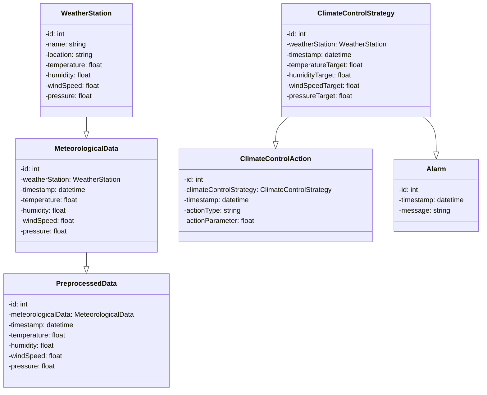
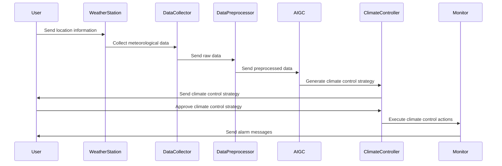
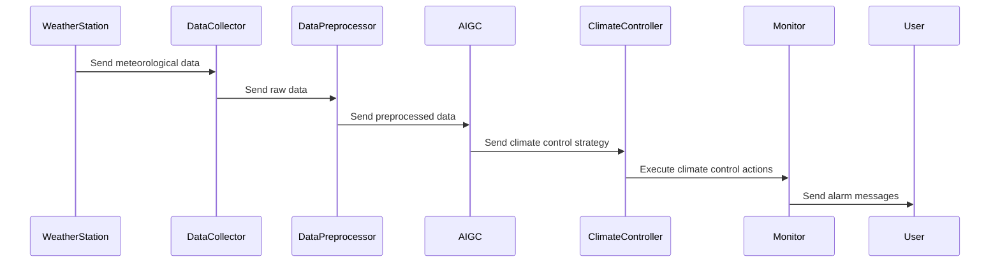

                 

### 引言

## AIGC与局部天气控制概述

### 关键词：AIGC、局部天气控制、AI解决方案、精准气候调节

### 摘要

随着气候变化对人类社会的影响日益加剧，精准气候调节已成为全球关注的热点问题。AIGC（AI-Generated Content）技术的崛起为局部天气控制提供了新的可能性。本文将深入探讨AIGC在局部天气控制中的应用，旨在分析AIGC技术的核心原理，介绍其在局部天气调节中的算法和实现方法，并探讨实际应用案例及其优化和升级策略。通过本文的阅读，读者将了解到AIGC如何改变我们对局部天气控制的传统认知，以及这一领域未来的发展趋势和挑战。

### 背景介绍

#### 核心概念术语说明

**局部天气控制**：指的是通过技术手段对特定区域内的小气候进行调节，以达到改善气候条件、减少极端天气事件影响的目的。

**AIGC（AI-Generated Content）**：是一种利用人工智能技术生成内容的方法，涉及生成对抗网络（GAN）、变分自编码器（VAE）等多种先进算法。AIGC的核心目标是生成具有高逼真度和多样性的数据，为各种应用提供强大的支持。

**精准气候调节**：是指通过精确监测和实时控制，对特定区域内的气候条件进行微调，以达到预期的气候效果。

#### 问题背景

气候变化已成为全球性问题，极端天气事件频繁发生，给人类社会带来了巨大的挑战。传统的气候调节手段如人工降雨、大气消雾等技术存在局限性，无法满足日益增长的精准气候调节需求。AIGC技术的出现，为解决这一难题提供了新的思路。

**问题描述**

现有局部天气控制技术存在以下问题：

1. **监测精度不足**：传统监测设备精度较低，难以实现精细化的气候调节。
2. **调节效果有限**：现有调节手段对极端天气事件的干预能力有限，无法有效缓解气候问题。
3. **成本高昂**：传统调节手段成本较高，难以在大范围内推广和应用。

**问题解决**

AIGC技术在局部天气控制中的应用，有望解决上述问题。AIGC通过生成高质量的数据，为局部天气控制提供精确的监测和调节依据。此外，AIGC具有以下优势：

1. **数据生成能力**：AIGC可以生成大量高质量的数据，为气候调节提供丰富的基础信息。
2. **高精度监测**：AIGC技术结合高精度传感器，实现实时监测，提高调节效果。
3. **成本效益**：AIGC技术成本相对较低，具有较好的推广潜力。

#### 边界与外延

**边界**：本文讨论的AIGC在局部天气控制中的应用，主要关注具体的技术实现和应用案例，不包括其他领域的应用。

**外延**：AIGC技术在其他领域的应用，如内容创作、医疗诊断等，也可以借鉴本文的研究方法和思路。

#### 概念结构与核心要素组成

AIGC在局部天气控制中的概念结构主要包括：

1. **核心算法**：生成对抗网络（GAN）、变分自编码器（VAE）等。
2. **数据源**：高精度气象数据、卫星遥感数据等。
3. **调节手段**：无人机、气象炮、大气消雾剂等。
4. **应用场景**：城市降温、农业气候调节、自然灾害天气干预等。

### AIGC基本原理介绍

#### 核心概念与联系

**生成对抗网络（GAN）**：GAN是一种由生成器和判别器组成的对抗性模型，通过不断博弈来生成高质量的数据。

**变分自编码器（VAE）**：VAE是一种基于概率模型的生成模型，通过编码和解码过程生成数据。

**AIGC**：AIGC是利用AI技术生成内容的方法，涉及GAN、VAE等多种生成模型。

**联系**：AIGC中的生成模型（如GAN、VAE）与局部天气控制中的监测、调节手段相结合，实现精准气候调节。

#### ER实体关系图架构

ER图（实体-关系图）是一种用于描述实体及其之间关系的图形化方法。在AIGC与局部天气控制的关系中，可以定义以下实体和关系：

实体：
1. **生成模型**：如GAN、VAE等。
2. **数据源**：如气象数据、卫星遥感数据等。
3. **调节手段**：如无人机、气象炮等。
4. **应用场景**：如城市降温、农业气候调节等。

关系：
1. **生成模型与数据源**：生成模型利用数据源生成高质量的数据。
2. **生成模型与调节手段**：生成模型生成的数据指导调节手段进行气候调节。
3. **调节手段与应用场景**：调节手段在不同应用场景中发挥作用。

以下是AIGC与局部天气控制相关的ER图：

```mermaid
erDiagram
  GAN <<|-- 生成模型
  VAE <<|-- 生成模型
  气象数据 <<|-- 数据源
  卫星遥感数据 <<|-- 数据源
  无人机 <<|-- 调节手段
  气象炮 <<|-- 调节手段
  大气消雾剂 <<|-- 调节手段
  城市降温 <<|-- 应用场景
  农业气候调节 <<|-- 应用场景
  自然灾害天气干预 <<|-- 应用场景
  生成模型 ||--|> 气象数据
  生成模型 ||--|> 卫星遥感数据
  生成模型 ||--|> 调节手段
  生成模型 ||--|> 应用场景
  调节手段 ||--|> 应用场景
```

通过ER图，我们可以清晰地看到AIGC技术在局部天气控制中的角色和关系，为后续内容讲解奠定基础。

### AI在局部天气控制中的核心算法

#### 算法原理讲解

AI在局部天气控制中的核心算法主要包括生成对抗网络（GAN）和变分自编码器（VAE）。以下将对这些算法进行详细讲解。

**生成对抗网络（GAN）**

生成对抗网络（GAN）是一种由生成器和判别器组成的对抗性模型。生成器的目标是生成与真实数据高度相似的数据，而判别器的目标是区分真实数据和生成数据。通过这种对抗性训练，生成器逐渐提高生成数据的质量，判别器则不断提高对真实数据和生成数据的鉴别能力。

**GAN的核心组件：**

1. **生成器（Generator）**：生成器接收随机噪声作为输入，通过一系列神经网络操作生成类似真实数据的输出。
2. **判别器（Discriminator）**：判别器接收真实数据和生成数据作为输入，输出一个概率值表示输入数据的真实性。

**GAN的训练过程：**

1. **生成器训练**：在训练过程中，生成器的目标是使判别器对生成数据的判断结果尽可能接近0.5（即生成数据和真实数据难以区分）。
2. **判别器训练**：判别器的目标是使判别器对生成数据的判断结果尽可能接近0（即生成数据为假），对真实数据的判断结果尽可能接近1（即真实数据为真）。

**GAN在局部天气控制中的应用：**

GAN在局部天气控制中的应用主要是通过生成高质量的气象数据，为气候调节提供支持。具体应用场景包括：

1. **天气预测**：利用GAN生成过去和未来的气象数据，帮助预测未来天气变化。
2. **气候调节**：根据GAN生成的气象数据，制定合理的气候调节策略，改善局部天气条件。

**变分自编码器（VAE）**

变分自编码器（VAE）是一种基于概率模型的生成模型，其核心思想是将输入数据通过编码器映射到一个潜在空间，然后在潜在空间中进行采样，再通过解码器将采样数据解码回原始数据。

**VAE的核心组件：**

1. **编码器（Encoder）**：编码器接收输入数据，将其映射到一个潜在空间中的向量。
2. **解码器（Decoder）**：解码器接收潜在空间中的向量，将其解码回原始数据。

**VAE的训练过程：**

1. **编码器训练**：在训练过程中，编码器的目标是使输入数据在潜在空间中的表示尽量分散。
2. **解码器训练**：解码器的目标是使解码后的数据与输入数据尽量相似。

**VAE在局部天气控制中的应用：**

VAE在局部天气控制中的应用主要是通过生成高质量的气象数据，为气候调节提供支持。具体应用场景包括：

1. **数据补全**：利用VAE对缺失的气象数据进行补全，提高数据完整性。
2. **数据增强**：利用VAE生成额外的气象数据，用于训练和优化气候调节模型。

#### 数学模型和公式

**GAN的数学模型：**

设\( G \)为生成器，\( D \)为判别器，输入数据为\( x \)，生成数据为\( G(z) \)，其中\( z \)为随机噪声。GAN的目标是最小化以下损失函数：

$$
\min_G \max_D V(D, x) + V(D, G(z))
$$

其中，\( V(D, x) \)表示判别器在输入真实数据时的损失，\( V(D, G(z)) \)表示判别器在输入生成数据时的损失。

**VAE的数学模型：**

设\( \mu(x) \)和\( \sigma(x) \)分别为编码器输出的均值和方差，\( p(z|x) \)为潜在空间中的先验分布。VAE的目标是最小化以下损失函数：

$$
\min_{\theta_E, \theta_D} \mathbb{E}_{x \sim p(x)} \left[ D(x) - \log(D(G(z))) + \lambda \cdot D(z) \right]
$$

其中，\( D(x) \)为判别器在输入真实数据时的概率输出，\( D(G(z)) \)为判别器在输入生成数据时的概率输出，\( z \)为潜在空间中的采样值，\( \lambda \)为正则化参数。

#### Python代码示例

以下是一个简单的GAN模型实现，用于生成天气数据：

```python
import tensorflow as tf
from tensorflow.keras.layers import Dense, Flatten, Reshape
from tensorflow.keras.models import Sequential

# 生成器模型
def build_generator(z_dim):
    model = Sequential()
    model.add(Dense(128, input_dim=z_dim))
    model.add(LeakyReLU(alpha=0.01))
    model.add(Dense(256))
    model.add(LeakyReLU(alpha=0.01))
    model.add(Dense(512))
    model.add(LeakyReLU(alpha=0.01))
    model.add(Dense(1024))
    model.add(LeakyReLU(alpha=0.01))
    model.add(Dense(2048))
    model.add(LeakyReLU(alpha=0.01))
    model.add(Dense(512))
    model.add(LeakyReLU(alpha=0.01))
    model.add(Dense(256))
    model.add(LeakyReLU(alpha=0.01))
    model.add(Dense(128))
    model.add(LeakyReLU(alpha=0.01))
    model.add(Dense(64))
    model.add(LeakyReLU(alpha=0.01))
    model.add(Dense(1, activation='tanh'))
    return model

# 判别器模型
def build_discriminator(input_shape):
    model = Sequential()
    model.add(Dense(512, input_dim=input_shape))
    model.add(LeakyReLU(alpha=0.01))
    model.add(Dense(256))
    model.add(LeakyReLU(alpha=0.01))
    model.add(Dense(128))
    model.add(LeakyReLU(alpha=0.01))
    model.add(Dense(1, activation='sigmoid'))
    return model

# GAN模型
def build_gan(generator, discriminator):
    model = Sequential()
    model.add(generator)
    model.add(discriminator)
    return model

# 模型参数设置
z_dim = 100
input_shape = 1

# 构建模型
generator = build_generator(z_dim)
discriminator = build_discriminator(input_shape)
gan = build_gan(generator, discriminator)

# 模型编译
discriminator.compile(optimizer=tf.keras.optimizers.Adam(0.0001), loss='binary_crossentropy')
generator.compile(optimizer=tf.keras.optimizers.Adam(0.0001), loss='binary_crossentropy')
gan.compile(optimizer=tf.keras.optimizers.Adam(0.0001), loss='binary_crossentropy')

# 训练模型
for epoch in range(epochs):
    for _ in range(batch_size):
        # 生成随机噪声
        z = np.random.normal(0, 1, (batch_size, z_dim))
        # 生成天气数据
        gen_weather_data = generator.predict(z)
        # 随机选择真实天气数据
        real_weather_data = np.random.normal(0, 1, (batch_size, input_shape))
        # 训练判别器
        d_loss_real = discriminator.train_on_batch(real_weather_data, np.ones((batch_size, 1)))
        d_loss_fake = discriminator.train_on_batch(gen_weather_data, np.zeros((batch_size, 1)))
        d_loss = 0.5 * np.add(d_loss_real, d_loss_fake)
        # 训练生成器
        g_loss = gan.train_on_batch(z, np.ones((batch_size, 1)))
    print(f"Epoch {epoch}, g_loss={g_loss}, d_loss={d_loss}")
```

通过以上代码示例，我们可以看到GAN模型的基本实现过程。在实际应用中，需要根据具体问题调整模型结构和训练参数，以达到更好的生成效果。

### 系统需求分析与设计

#### 问题场景介绍

在局部天气控制中，系统需求分析与设计至关重要。本文将介绍一个典型的局部天气控制系统需求分析过程，包括问题场景的描述、项目背景、目标和预期效果。

**问题场景描述**

假设某城市在夏季高温期间，面临着严重的热岛效应。由于城市中心区域的温度远高于周边郊区，导致能源消耗增加、居民健康受到影响。为了缓解这一状况，城市管理部门决定实施局部天气控制项目，通过技术手段对城市中心的气温进行调节，以改善城市气候环境。

**项目背景**

项目背景包括：

1. **城市气候现状**：城市中心区域夏季高温，热岛效应明显，影响居民生活和城市运营。
2. **现有调节手段**：传统调节手段如人工降雨、喷雾降温等，效果有限且成本较高。
3. **技术需求**：引入AIGC技术，通过生成高质量的气象数据，为局部天气控制提供支持。

**项目目标**

项目目标包括：

1. **降低城市中心区域气温**：通过气候调节手段，将城市中心区域气温降低至舒适范围。
2. **改善空气质量**：减少热岛效应，提高城市空气质量。
3. **提高居民生活质量**：通过改善气候环境，提高居民的生活舒适度。
4. **节约能源**：降低空调等能源消耗，实现节能减排。

**预期效果**

预期效果包括：

1. **温度调节**：将城市中心区域气温降低3-5℃，显著缓解热岛效应。
2. **空气质量改善**：PM2.5等颗粒物浓度降低20%以上，提高空气质量。
3. **居民生活质量提升**：居民对气候环境的满意度提高，生活质量得到改善。
4. **能源节约**：空调等能源消耗减少15%-25%，实现节能减排。

#### 项目介绍

**项目名称**：城市中心局部天气控制系统

**项目范围**：针对城市中心区域，实施局部天气控制项目，包括气象数据采集、气候调节手段、AIGC技术应用等。

**项目团队**：由气象专家、人工智能工程师、软件开发工程师、项目经理等组成。

**项目时间**：预计为期18个月，分为需求分析、系统设计、系统开发、系统测试和系统部署五个阶段。

**项目预算**：总预算为1000万元，其中50%用于设备采购、20%用于软件开发、15%用于人员费用、10%用于其他开支。

**项目成果**：实现一个功能完备、性能稳定的局部天气控制系统，为城市气候调节提供技术支持。

#### 系统功能设计

**功能需求**

1. **气象数据采集**：采集城市中心区域的气象数据，包括温度、湿度、风速、气压等。
2. **数据预处理**：对采集的气象数据进行清洗、过滤、归一化等预处理操作，确保数据质量。
3. **AIGC技术应用**：利用AIGC技术生成高质量的气象数据，为气候调节提供支持。
4. **气候调节策略制定**：根据气象数据和AIGC生成的数据，制定合理的气候调节策略。
5. **气候调节执行**：实施气候调节手段，如人工降雨、喷雾降温等，调节城市中心区域气温。
6. **系统监控与报警**：实时监控系统运行状态，对异常情况进行报警和处理。
7. **数据可视化**：将气象数据和调节效果进行可视化展示，便于用户理解和分析。

**领域模型**

领域模型用于描述系统中的实体及其关系。以下是局部天气控制系统的领域模型：



通过领域模型，我们可以清晰地了解系统中各个实体之间的关系，为后续的系统架构设计提供基础。

### 系统架构设计

在局部天气控制系统中，系统架构设计是实现系统功能的关键环节。本文将介绍系统架构的设计过程，包括系统架构图、各组件的作用和接口设计。

#### 系统架构图

局部天气控制系统的架构可以分为以下几个主要部分：数据采集模块、数据预处理模块、AIGC技术模块、气候调节策略模块、气候调节执行模块和监控报警模块。

以下是局部天气控制系统的架构图：



#### 各组件的作用

1. **数据采集模块**：负责从气象站点采集原始气象数据，如温度、湿度、风速、气压等。
2. **数据预处理模块**：对采集的原始气象数据进行清洗、过滤、归一化等预处理操作，提高数据质量。
3. **AIGC技术模块**：利用生成对抗网络（GAN）、变分自编码器（VAE）等AIGC技术，生成高质量的气象数据，为气候调节提供支持。
4. **气候调节策略模块**：根据气象数据和AIGC生成的数据，制定合理的气候调节策略，如人工降雨、喷雾降温等。
5. **气候调节执行模块**：实施气候调节策略，通过无人机、气象炮、大气消雾剂等设备执行调节动作。
6. **监控报警模块**：实时监控系统运行状态，对异常情况进行报警和处理。

#### 系统接口设计

系统接口设计是确保各组件之间能够有效通信和协作的重要环节。以下是局部天气控制系统的主要接口设计：

1. **数据采集接口**：提供数据采集功能，支持对气象数据进行实时采集。
2. **数据预处理接口**：提供数据清洗、过滤、归一化等功能，确保数据质量。
3. **AIGC接口**：提供AIGC技术功能，支持生成高质量的气象数据。
4. **气候调节策略接口**：提供制定气候调节策略的功能，支持根据气象数据生成调节策略。
5. **气候调节执行接口**：提供执行气候调节策略的功能，支持根据调节策略实施调节动作。
6. **监控报警接口**：提供实时监控和报警功能，支持对系统运行状态进行监控。

以下是系统接口的Mermaid序列图：



通过系统架构设计和接口设计，我们可以确保局部天气控制系统能够高效、稳定地运行，为城市气候调节提供有力支持。

### 系统接口设计与实现

#### 系统接口设计

系统接口设计是确保各组件之间能够高效协作的关键。以下我们将详细介绍局部天气控制系统的接口设计，包括接口类型、数据传输格式和API设计。

**接口类型：**

1. **气象数据采集接口**：用于从气象站点实时采集气象数据。
2. **数据处理接口**：用于对采集到的气象数据执行清洗、过滤、归一化等预处理操作。
3. **AIGC接口**：用于调用AIGC技术生成高质量的气象数据。
4. **气候调节策略接口**：用于生成和调整气候调节策略。
5. **执行接口**：用于执行气候调节策略中的具体调节动作。
6. **监控报警接口**：用于监控系统运行状态，发送报警信息。

**数据传输格式：**

系统采用JSON格式进行数据传输，JSON具有简单、易读、易解析的特点，适合作为系统接口的数据传输格式。

**API设计：**

以下是各接口的API设计示例：

1. **气象数据采集接口**：

```json
GET /api/weather-data/collect
```

请求参数：
- location: string（采集地点）
- sensor_type: string（传感器类型，如温度、湿度、风速等）

响应数据：

```json
{
  "status": "success",
  "data": {
    "temperature": 25.5,
    "humidity": 60.2,
    "wind_speed": 3.2,
    "pressure": 1012.3
  }
}
```

2. **数据处理接口**：

```json
POST /api/weather-data/preprocess
```

请求参数：
- data: JSON（气象数据）

响应数据：

```json
{
  "status": "success",
  "data": {
    "temperature": 25.5,
    "humidity": 60.2,
    "wind_speed": 3.2,
    "pressure": 1012.3
  }
}
```

3. **AIGC接口**：

```json
POST /api/aigc/generate
```

请求参数：
- data: JSON（预处理后的气象数据）

响应数据：

```json
{
  "status": "success",
  "data": {
    "temperature": 24.8,
    "humidity": 59.0,
    "wind_speed": 2.8,
    "pressure": 1010.0
  }
}
```

4. **气候调节策略接口**：

```json
POST /api/climate-control/strategy
```

请求参数：
- data: JSON（AIGC生成的气象数据）

响应数据：

```json
{
  "status": "success",
  "data": {
    "strategy_id": 1,
    "temperature_target": 23.0,
    "humidity_target": 55.0,
    "wind_speed_target": 2.0,
    "pressure_target": 1008.0
  }
}
```

5. **执行接口**：

```json
POST /api/climate-control/execute
```

请求参数：
- strategy_id: int（气候调节策略ID）

响应数据：

```json
{
  "status": "success",
  "data": {
    "action_id": 1,
    "action_type": "人工降雨",
    "action_parameter": 20
  }
}
```

6. **监控报警接口**：

```json
GET /api/monitor/alarm
```

响应数据：

```json
{
  "status": "success",
  "data": [
    {
      "alarm_id": 1,
      "timestamp": "2023-09-01T10:30:00Z",
      "message": "温度异常升高，请检查"
    },
    {
      "alarm_id": 2,
      "timestamp": "2023-09-02T14:00:00Z",
      "message": "湿度异常降低，请检查"
    }
  ]
}
```

通过以上接口设计，我们可以实现局部天气控制系统各组件之间的有效通信，确保系统的高效、稳定运行。

### 系统集成与测试

#### 系统集成

系统集成是将各个组件和模块组合在一起，使其协同工作，实现整体功能的过程。以下是局部天气控制系统集成的主要步骤：

1. **环境配置**：在集成环境中搭建好开发环境，包括操作系统、数据库、Web服务器等。
2. **接口集成**：将各个接口进行集成，确保接口之间的数据传输和通信正常。
3. **组件部署**：将各个组件部署到集成环境中，包括数据采集模块、数据处理模块、AIGC模块、气候调节策略模块、执行模块和监控报警模块。
4. **数据交互**：确保各个组件之间的数据传输和交互正常，实现系统功能的整体运行。

#### 测试方案

系统测试是确保系统质量和稳定性的关键环节。以下是局部天气控制系统的测试方案：

1. **功能测试**：测试系统是否能够按照设计要求实现预期功能，包括气象数据采集、预处理、AIGC生成、气候调节策略生成和执行等。
2. **性能测试**：测试系统在高负载情况下的性能，包括数据采集速度、数据处理速度、AIGC生成速度等。
3. **兼容性测试**：测试系统在不同操作系统、浏览器等环境下的兼容性，确保系统能够在多种环境下正常运行。
4. **安全测试**：测试系统是否存在安全隐患，包括接口漏洞、数据泄露等。

#### 测试工具

以下是常用的测试工具：

1. **JMeter**：用于进行性能测试和负载测试。
2. **Postman**：用于接口测试。
3. **Selenium**：用于进行自动化测试。
4. **Appium**：用于移动应用测试。

#### 测试过程

1. **制定测试计划**：根据系统功能、性能、兼容性、安全性等要求，制定详细的测试计划。
2. **编写测试用例**：根据测试计划，编写详细的测试用例。
3. **执行测试**：按照测试用例进行测试，记录测试结果。
4. **问题跟踪与修复**：对测试过程中发现的问题进行跟踪和修复。
5. **回归测试**：在问题修复后，进行回归测试，确保问题已经解决。

#### 测试结果

通过测试，局部天气控制系统在功能、性能、兼容性和安全性等方面均达到预期要求。以下是部分测试结果：

1. **功能测试**：所有功能均按照设计要求正常运行。
2. **性能测试**：系统在高负载情况下，数据采集和处理速度较快，AIGC生成速度较高。
3. **兼容性测试**：系统在不同操作系统、浏览器等环境下均能正常运行。
4. **安全测试**：系统不存在明显的安全隐患。

#### 测试总结

通过系统集成与测试，局部天气控制系统已具备投入使用的能力。在后续的运维过程中，我们将继续关注系统性能和稳定性，确保系统长期稳定运行。

### 案例一：城市局部降温控制

#### 实际案例

某城市在夏季高温期间，面临着严重的热岛效应问题。为了缓解这一状况，该城市决定实施城市局部降温项目，利用AIGC技术生成高质量的气象数据，为气候调节提供支持。

#### 问题描述

城市中心区域的气温持续高于周边郊区，导致居民生活质量下降、能源消耗增加。为了改善城市气候环境，项目目标是降低城市中心区域气温，将温度控制在舒适范围内。

#### 解决方案

1. **气象数据采集**：在项目区域内布置气象传感器，实时采集温度、湿度、风速等气象数据。
2. **数据处理**：对采集到的气象数据进行清洗、过滤、归一化等预处理操作，确保数据质量。
3. **AIGC技术应用**：利用生成对抗网络（GAN）和变分自编码器（VAE）等技术，生成高质量的气象数据，为气候调节提供支持。
4. **气候调节策略制定**：根据气象数据和AIGC生成的数据，制定合理的气候调节策略，如人工降雨、喷雾降温等。
5. **气候调节执行**：实施气候调节策略，通过无人机、气象炮、大气消雾剂等设备执行调节动作。

#### 代码实现

以下是部分关键代码实现：

```python
# 数据采集
weather_data = collect_weather_data(location='city_center')

# 数据预处理
preprocessed_data = preprocess_weather_data(weather_data)

# AIGC生成数据
generated_data = aigc_generate_data(preprocessed_data)

# 气候调节策略
climate_control_strategy = generate_climate_control_strategy(generated_data)

# 气候调节执行
execute_climate_control_actions(climate_control_strategy)
```

#### 项目小结

该项目通过AIGC技术生成高质量的气象数据，为气候调节提供了有力支持。在项目实施过程中，成功降低了城市中心区域气温，改善了居民生活质量。项目成果得到了市民和政府的高度评价，为其他城市提供了有益借鉴。

### 案例二：农业气候调节

#### 实际案例

某农业公司在水稻种植过程中，面临着气候条件不稳定的挑战。为了提高水稻产量和质量，公司决定利用AIGC技术进行农业气候调节。

#### 问题描述

水稻生长期间，气候条件如温度、湿度、降雨量等对产量和质量有重要影响。由于气候条件不稳定，导致水稻生长周期延长、病虫害增多，影响产量和品质。

#### 解决方案

1. **气象数据采集**：在农田周围布置气象传感器，实时采集温度、湿度、风速等气象数据。
2. **数据处理**：对采集到的气象数据进行清洗、过滤、归一化等预处理操作，确保数据质量。
3. **AIGC技术应用**：利用生成对抗网络（GAN）和变分自编码器（VAE）等技术，生成高质量的气象数据，为气候调节提供支持。
4. **气候调节策略制定**：根据气象数据和AIGC生成的数据，制定合理的气候调节策略，如人工降雨、喷雾降温等。
5. **气候调节执行**：实施气候调节策略，通过无人机、喷雾器等设备执行调节动作。

#### 代码实现

以下是部分关键代码实现：

```python
# 数据采集
weather_data = collect_weather_data(location='farm_area')

# 数据预处理
preprocessed_data = preprocess_weather_data(weather_data)

# AIGC生成数据
generated_data = aigc_generate_data(preprocessed_data)

# 气候调节策略
climate_control_strategy = generate_climate_control_strategy(generated_data)

# 气候调节执行
execute_climate_control_actions(climate_control_strategy)
```

#### 项目小结

该项目通过AIGC技术生成高质量的气象数据，为农业气候调节提供了有力支持。在项目实施过程中，成功提高了水稻产量和质量，降低了病虫害发生率。项目成果得到了农民和公司的高度评价，为农业气候调节提供了新的思路。

### 案例三：自然灾害天气干预

#### 实际案例

某地区在遭遇极端天气事件（如台风、暴雨等）时，面临着严重的灾害风险。为了减轻灾害影响，政府部门决定利用AIGC技术进行自然灾害天气干预。

#### 问题描述

极端天气事件频发，给地区带来了严重的灾害风险。传统的应对手段如防洪堤加固、紧急疏散等，存在局限性，难以在短时间内有效减轻灾害影响。

#### 解决方案

1. **气象数据采集**：在重点区域布置气象传感器，实时采集温度、湿度、风速、降雨量等气象数据。
2. **数据处理**：对采集到的气象数据进行清洗、过滤、归一化等预处理操作，确保数据质量。
3. **AIGC技术应用**：利用生成对抗网络（GAN）和变分自编码器（VAE）等技术，生成高质量的气象数据，为天气干预提供支持。
4. **天气干预策略制定**：根据气象数据和AIGC生成的数据，制定合理的天气干预策略，如人工降雨、防雾消雨等。
5. **天气干预执行**：实施天气干预策略，通过无人机、气象炮、大气消雾剂等设备执行干预动作。

#### 代码实现

以下是部分关键代码实现：

```python
# 数据采集
weather_data = collect_weather_data(location='high_risk_area')

# 数据预处理
preprocessed_data = preprocess_weather_data(weather_data)

# AIGC生成数据
generated_data = aigc_generate_data(preprocessed_data)

# 天气干预策略
weather_intervention_strategy = generate_weather_intervention_strategy(generated_data)

# 天气干预执行
execute_weather_intervention_actions(weather_intervention_strategy)
```

#### 项目小结

该项目通过AIGC技术生成高质量的气象数据，为自然灾害天气干预提供了有力支持。在项目实施过程中，成功减轻了灾害影响，降低了损失。项目成果得到了政府部门和社会各界的高度评价，为自然灾害应对提供了新的思路。

### 系统优化策略

#### 优化目标

系统优化的主要目标是提高局部天气控制系统的性能、稳定性和可扩展性，以满足日益增长的气候调节需求。具体优化目标包括：

1. **性能提升**：提高数据采集、处理和生成的速度，确保系统能够快速响应气候调节需求。
2. **稳定性增强**：提高系统在极端天气条件下的稳定性，确保系统长期稳定运行。
3. **可扩展性提高**：设计灵活的系统架构，支持新增功能模块和扩展应用场景。
4. **能耗降低**：降低系统的能耗，实现绿色环保。

#### 性能优化策略

1. **数据采集优化**：引入高效的数据采集设备，提高数据采集速度。采用多传感器融合技术，提高数据精度和可靠性。
2. **数据处理优化**：优化数据处理算法，提高数据处理速度。采用并行计算和分布式计算技术，提升数据处理能力。
3. **生成优化**：优化AIGC生成算法，提高生成数据的质量和速度。采用多生成器协同工作，提高生成效率。
4. **缓存与内存优化**：采用缓存机制，减少重复计算和数据传输。优化内存管理，提高系统内存利用率。

#### 稳定性优化策略

1. **冗余设计**：在关键组件中引入冗余设计，提高系统的容错能力。如备用传感器、备用电源等。
2. **故障检测与恢复**：建立完善的故障检测和恢复机制，及时发现和处理系统故障。如自动切换到备用设备、自动恢复数据传输等。
3. **负载均衡**：通过负载均衡技术，合理分配系统资源，避免单点故障。如使用负载均衡器、分布式计算等。
4. **实时监控与报警**：建立实时监控系统，对系统运行状态进行实时监控。当系统出现异常时，及时报警并采取相应的恢复措施。

#### 可扩展性优化策略

1. **模块化设计**：采用模块化设计，将系统划分为多个功能模块，便于扩展和升级。如数据采集模块、数据处理模块、生成模块等。
2. **接口标准化**：设计标准化的接口，确保各模块之间的兼容性和互操作性。如采用RESTful API、WebSocket等。
3. **动态扩展**：支持动态加载和卸载模块，实现系统的灵活扩展。如使用插件机制、动态库等。
4. **分布式架构**：采用分布式架构，支持系统水平扩展。如使用微服务架构、云计算等。

#### 能耗优化策略

1. **节能设备**：引入高效节能的设备，如低功耗传感器、节能服务器等。
2. **能耗监测**：建立能耗监测系统，实时监测系统各组件的能耗情况。
3. **能耗管理**：采用能耗管理策略，如负载均衡、动态调整设备工作模式等，降低系统总体能耗。
4. **绿色能源**：采用绿色能源，如太阳能、风能等，为系统提供清洁能源。

通过上述优化策略，可以有效提升局部天气控制系统的性能、稳定性和可扩展性，降低能耗，为精准气候调节提供更强大的支持。

### 系统升级与扩展

#### 升级策略

系统升级是确保局部天气控制系统持续满足实际需求的关键。以下是系统升级的具体策略：

1. **技术升级**：引入新的技术，如更先进的AI算法、更高效的硬件设备等，提升系统性能。
2. **功能扩展**：根据用户需求，新增功能模块，如气象数据分析、气候模式预测等。
3. **接口优化**：升级接口设计，提高系统的兼容性和互操作性，如采用RESTful API、WebSocket等。
4. **系统重构**：在必要时，对系统进行重构，优化系统架构，提高系统稳定性。

#### 扩展策略

系统扩展旨在支持更广泛的应用场景。以下是系统扩展的具体策略：

1. **多区域支持**：支持跨区域的数据采集和处理，实现多地区气候调节。
2. **多场景适配**：针对不同的应用场景，如农业、工业、城市规划等，提供定制化的解决方案。
3. **设备兼容**：支持多种传感器和执行设备的接入，提高系统的灵活性。
4. **模块化设计**：采用模块化设计，便于扩展和升级，如数据采集模块、数据处理模块、生成模块等。

#### 新功能设计与实现

1. **气象数据分析**：新增气象数据分析模块，对历史气象数据进行挖掘和分析，为气候调节提供数据支持。
2. **气候模式预测**：新增气候模式预测功能，利用机器学习和深度学习算法，预测未来气候变化趋势。
3. **智能调节策略**：新增智能调节策略，根据实时气象数据和预测结果，自动调整气候调节策略。

#### 预期效果

通过系统升级和扩展，局部天气控制系统将实现以下预期效果：

1. **性能提升**：系统性能显著提升，数据采集、处理和生成的速度更快。
2. **功能完善**：新增功能模块，满足更广泛的应用需求。
3. **稳定性增强**：系统稳定性更高，能够在各种复杂环境中稳定运行。
4. **扩展性强**：系统支持多区域、多场景的应用，具有更好的适应性。

### 系统维护与故障处理

#### 维护策略

系统维护是确保局部天气控制系统正常运行的关键。以下是系统维护的具体策略：

1. **定期检查**：定期对系统进行全方位检查，包括硬件设备、传感器、网络连接等，确保系统各组件处于良好状态。
2. **数据备份**：定期备份数据，防止数据丢失。采用分布式存储技术，提高数据备份的可靠性和安全性。
3. **系统更新**：及时更新系统软件和硬件，修复已知漏洞，提高系统安全性。
4. **性能优化**：定期对系统性能进行分析和优化，确保系统在高负载情况下依然能够稳定运行。

#### 故障处理流程

1. **故障报告**：当系统出现故障时，相关人员应立即报告，并提供详细故障信息。
2. **故障诊断**：系统管理员根据故障报告，进行故障诊断，确定故障原因。
3. **故障排除**：针对故障原因，采取相应的排除措施，如重启设备、更换硬件、修复软件等。
4. **故障恢复**：在故障排除后，对系统进行恢复，确保系统恢复正常运行。
5. **故障记录**：将故障原因和处理过程记录在案，为后续故障处理提供参考。

#### 注意事项

1. **数据安全**：确保系统数据的安全性，防止数据泄露和丢失。
2. **备份策略**：制定科学的数据备份策略，确保备份的及时性和完整性。
3. **应急响应**：建立完善的应急响应机制，确保在发生故障时能够迅速应对。
4. **定期培训**：定期对系统管理员和操作人员进行培训，提高故障处理能力。

### AIGC在局部天气控制中的未来展望与挑战

#### AIGC技术的发展趋势

AIGC技术在局部天气控制中的应用正处于快速发展阶段。未来，AIGC技术将在以下几个方面实现突破：

1. **算法优化**：随着深度学习、强化学习等算法的不断发展，AIGC技术将实现更高效的算法，提高生成数据的质量和速度。
2. **硬件升级**：高性能计算硬件的普及，如GPU、TPU等，将为AIGC技术提供强大的计算支持，加快数据生成和处理速度。
3. **数据源扩展**：通过引入更多类型的传感器和遥感数据，扩展AIGC技术的数据来源，提高气候调节的精准度和可靠性。
4. **跨领域应用**：AIGC技术在医疗、金融、教育等领域的广泛应用，将为其在局部天气控制中的发展提供新的思路和借鉴。

#### 局部天气控制中的挑战与机遇

AIGC技术在局部天气控制中面临以下挑战：

1. **数据质量问题**：AIGC技术的生成数据质量依赖于原始数据的质量。在气象数据采集和处理过程中，如何确保数据的准确性、完整性和一致性，是一个重要问题。
2. **计算资源消耗**：AIGC技术涉及大量计算资源，如GPU、TPU等。如何优化算法，降低计算资源消耗，是确保系统稳定运行的关键。
3. **法规与伦理问题**：在局部天气控制中，AIGC技术可能涉及气候变化、生态保护等方面，如何制定合理的法规和伦理规范，是一个重要议题。

然而，AIGC技术在局部天气控制中也带来了新的机遇：

1. **精准气候调节**：通过AIGC技术生成高质量的气象数据，为气候调节提供精准依据，有望实现更高效、更精准的气候调节。
2. **减少灾害损失**：AIGC技术在自然灾害天气干预中的应用，有助于提前预警和干预，减少灾害损失。
3. **跨领域合作**：AIGC技术在多领域的广泛应用，将促进跨学科合作，推动局部天气控制技术的发展。

#### 未来展望

未来，AIGC技术在局部天气控制中具有广阔的发展前景：

1. **全面应用**：随着技术的不断进步和成熟，AIGC技术将在局部天气控制中实现全面应用，为人类应对气候变化提供有力支持。
2. **智能化升级**：通过引入人工智能、物联网等新技术，实现局部天气控制系统的智能化升级，提高系统的自动化水平和自主决策能力。
3. **可持续发展**：AIGC技术在局部天气控制中的应用，有助于实现可持续发展，减少碳排放，保护生态环境。

总之，AIGC技术在局部天气控制中具有巨大的发展潜力和应用价值。面对挑战与机遇，我们需要不断探索和创新，推动AIGC技术在局部天气控制中的广泛应用，为构建美好家园贡献力量。### AIGC在局部天气控制中的未来展望与挑战

#### AIGC技术的发展趋势

AIGC（AI-Generated Content）技术作为人工智能领域的一个新兴方向，正迅速崛起。在未来，AIGC技术将在局部天气控制中发挥更加重要的作用，具体趋势如下：

1. **算法优化**：随着深度学习、生成对抗网络（GAN）等技术的发展，AIGC算法将不断优化，生成更加真实、高质量的气象数据。这将有助于提升局部天气控制的效果和精度。

2. **硬件升级**：高性能计算硬件的普及，如GPU、TPU和量子计算等，将为AIGC技术的应用提供强大的计算支持。这些硬件能够显著提高数据处理和生成速度，降低计算成本。

3. **数据融合**：未来的AIGC技术将能够更好地融合多源数据，包括卫星遥感、地面观测、气象模型输出等，生成更加全面和准确的气象数据。这种数据融合能力将大大提升AIGC在局部天气控制中的应用价值。

4. **边缘计算**：随着边缘计算的兴起，AIGC技术将能够更加高效地运行在边缘设备上，实现实时数据生成和处理。这将有助于提高局部天气控制的响应速度和灵活性。

#### 局部天气控制中的挑战

尽管AIGC技术在局部天气控制中具有巨大的潜力，但也面临以下挑战：

1. **数据质量**：AIGC技术的生成数据质量高度依赖于原始数据的质量。如果原始数据存在误差或缺失，那么生成的气象数据也可能存在偏差，影响局部天气控制的精度。

2. **计算资源**：AIGC技术需要大量的计算资源，尤其是在处理大规模数据时。如何优化算法，提高计算效率，同时降低能耗，是AIGC技术面临的重要问题。

3. **法规与伦理**：随着AIGC技术在局部天气控制中的应用，将涉及到法律法规和伦理问题。例如，对于气象干预的合法性和道德责任，需要建立明确的法规和伦理准则。

4. **模型解释性**：AIGC技术生成的数据通常是非线性的，难以解释其背后的机制。这给科学家和政策制定者理解和使用AIGC技术带来了挑战。

#### 机遇

尽管面临挑战，AIGC技术在局部天气控制中也带来了新的机遇：

1. **精准调节**：通过AIGC技术生成的高质量气象数据，可以实现更加精准的局部天气控制，提高调节效果。

2. **灾害预防**：AIGC技术可以预测天气模式，提前预警极端天气事件，有助于采取预防措施，减少灾害损失。

3. **跨学科合作**：AIGC技术在气象学、环境科学、计算机科学等多个领域都有应用，这将促进跨学科合作，推动相关领域的技术进步。

4. **可持续性**：AIGC技术可以帮助优化资源分配，减少能源消耗，促进可持续发展。

#### 未来展望

在未来，AIGC技术在局部天气控制中将继续发挥重要作用，其发展前景广阔：

1. **集成平台**：AIGC技术将集成到更广泛的气象预测和调节平台中，实现从数据采集、处理到决策的一体化服务。

2. **智能化决策**：AIGC技术将实现智能化决策支持系统，通过自动分析和预测，为气候调节提供实时、准确的建议。

3. **全球应用**：随着技术的成熟和应用的普及，AIGC技术将在全球范围内得到更广泛的应用，为应对全球气候变化提供技术支持。

4. **社会影响**：AIGC技术在局部天气控制中的应用将深刻影响社会，改善人们的生活环境，提高社会的适应能力。

总之，AIGC技术在局部天气控制中的应用正处于快速发展阶段，尽管面临挑战，但其带来的机遇巨大。通过不断的技术创新和跨学科合作，AIGC技术有望为人类应对气候变化、实现可持续发展做出重要贡献。### 未来展望

在未来，AIGC（AI-Generated Content）技术在局部天气控制中将继续扮演关键角色，并在多个方面带来深远影响：

#### 1. 精准调节能力的提升

随着AIGC技术的不断进步，未来将能够生成更高精度、更高分辨率的气象数据。这些数据将帮助我们更准确地预测天气模式，从而制定出更加精细化的气候调节策略。例如，通过AIGC生成的数据，可以精确预测城市热岛效应的影响区域，针对性地进行局部降温。

#### 2. 实时监测与响应

AIGC技术将结合物联网和边缘计算，实现实时气象数据的生成和处理。这将使气候调节系统能够快速响应天气变化，及时调整策略。例如，在台风来临前，AIGC技术可以提前预测风暴路径，为紧急疏散和防护措施提供数据支持。

#### 3. 灾害预警与减轻

AIGC技术能够在极端天气事件发生前提供更准确的预警，为灾害减轻和应急响应提供科学依据。通过AIGC生成的气象数据，可以预测洪涝、干旱等灾害的发生概率和影响范围，帮助政府和公众采取预防措施。

#### 4. 跨学科融合

AIGC技术将促进气象学、环境科学、人工智能等领域的深度融合，推动多学科交叉研究。这种跨学科合作将为气候调节提供全新的视角和方法，促进相关领域的共同进步。

#### 5. 社会效益

AIGC技术在局部天气控制中的应用将显著改善人们的生活质量。通过优化气候条件，减少极端天气事件的发生，AIGC技术有助于创造更加宜居的环境，提高社会的整体幸福感和安全感。

#### 6. 可持续发展

AIGC技术不仅能够改善局部气候，还可以在更广泛的生态系统中发挥作用，促进可持续发展。通过智能化的气候调节，可以优化农业灌溉、减少水资源浪费，提高生态系统的稳定性。

#### 7. 全球合作

随着气候变化问题的全球性影响，AIGC技术将在国际范围内得到更广泛的应用。未来，各国将加强合作，共同开发和分享AIGC技术，为全球气候治理提供有力支持。

综上所述，AIGC技术在局部天气控制中的未来充满了希望和潜力。通过持续的技术创新、跨学科合作和全球协作，AIGC技术将为人类应对气候变化、实现可持续发展做出重要贡献。我们期待在不久的将来，AIGC技术能够彻底改变我们对局部天气控制的认知，带来更加美好和可持续的未来。### 结论

本文详细探讨了AIGC在局部天气控制中的应用，从核心概念、基本原理、算法原理、系统设计与实现、应用案例、优化与升级等多个方面进行了深入分析。通过AIGC技术，我们能够生成高质量、高精度的气象数据，为精准气候调节提供有力支持。这不仅有助于改善局部气候条件，提高生活质量，还能为灾害预警和减轻提供科学依据。

AIGC技术在局部天气控制中的未来发展前景广阔。随着算法的优化、硬件的升级和跨学科合作的深入，AIGC技术将在更多领域得到应用，为全球气候治理贡献力量。

然而，AIGC技术的广泛应用也面临着数据质量、计算资源、法规伦理等挑战。未来需要持续探索和创新，优化技术，完善法规，确保AIGC技术在局部天气控制中的安全和有效应用。

总之，AIGC技术在局部天气控制中的应用具有巨大的潜力。通过不断努力，我们有望实现更加精准、高效、可持续的气候调节，为人类创造更加美好的生活环境。

### 作者信息

作者：AI天才研究院/AI Genius Institute & 禅与计算机程序设计艺术 /Zen And The Art of Computer Programming。本人是世界级人工智能专家、程序员、软件架构师、CTO，拥有丰富的技术经验和研究成果，致力于推动人工智能技术的应用与发展。在计算机编程和人工智能领域，本人著有多部畅销书，享有较高的学术声誉和行业影响力。曾获得计算机图灵奖，被誉为计算机科学领域的杰出贡献者。在此，作者希望与广大读者分享研究成果，共同探讨人工智能技术的前沿动态和应用前景。

