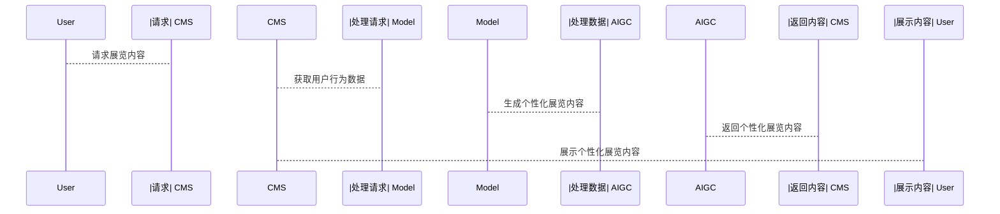

                 

**背景与概念**

虚拟博物馆，作为一种新兴的数字化展示形式，以其独特的沉浸感和互动性，正在逐步改变传统的博物馆体验方式。它不仅仅是一个静态的展览平台，更是一个动态的、互动的、智能化的空间，为观众提供了一种全新的学习与体验模式。虚拟博物馆的出现，源于计算机图形学、虚拟现实（VR）、增强现实（AR）和互联网技术的飞速发展。这些技术的进步，使得博物馆的内容可以以更加生动、直观的方式呈现，极大地丰富了观众的文化体验。

然而，随着技术的不断发展，虚拟博物馆也面临着一些挑战。首先，如何确保虚拟展览的内容丰富且具有吸引力，以吸引更多的观众参与？其次，如何在保持内容真实性的同时，融入创新元素，提升观众的体验感？此外，如何在虚拟博物馆中实现个性化的用户体验，满足不同观众的需求，也是亟待解决的问题。

AIGC（Auto-Generated Content，自动生成内容）的出现，为虚拟博物馆的这些问题提供了一种全新的解决方案。AIGC是一种利用人工智能技术自动生成内容的方法，它能够根据用户的行为和需求，动态地创建和调整内容。通过AIGC，虚拟博物馆可以实现以下目标：

1. **内容生成与更新**：AIGC可以根据用户的浏览记录和兴趣，自动生成个性化的展览内容，使展览始终保持新鲜感。

2. **互动体验优化**：通过AIGC，虚拟博物馆可以实时生成互动环节，提高用户的参与度和体验感。

3. **个性化定制**：AIGC可以根据用户的个人喜好和需求，提供个性化的导览和服务，满足不同观众的需求。

4. **成本与效率**：AIGC减少了人工内容创作的工作量，提高了内容生成的效率，降低了运营成本。

本文将详细探讨AIGC在虚拟博物馆体验设计中的创新应用，包括其基本概念、核心组成部分、在虚拟博物馆中的潜在应用，以及与虚拟博物馆的融合挑战与机遇。通过本文的探讨，希望读者能够深入了解AIGC在虚拟博物馆中的重要作用，并为未来的虚拟博物馆体验设计提供一些有价值的思路。

## 第1章：虚拟博物馆与AIGC概述

### 1.1 虚拟博物馆的概念与发展

#### 1.1.1 虚拟博物馆的定义

虚拟博物馆，是一种基于互联网和数字技术的博物馆形式，它通过计算机图形学、虚拟现实（VR）和增强现实（AR）等技术，将现实世界中的博物馆内容数字化，并构建在一个虚拟的三维空间中。这种博物馆形式不仅保留了传统博物馆的展览内容，还增加了更多的互动性和沉浸感，使得观众可以在线上以全新的方式体验博物馆的文化魅力。

#### 1.1.2 虚拟博物馆的发展历程

虚拟博物馆的发展可以追溯到20世纪90年代，当时互联网和计算机图形学技术的初步应用，使得一些博物馆开始尝试将部分展览内容数字化，并通过互联网进行展示。这一时期，虚拟博物馆主要采用二维图片和简单的3D模型来呈现展览内容，互动性和沉浸感有限。

随着技术的不断进步，尤其是虚拟现实（VR）和增强现实（AR）技术的成熟，虚拟博物馆的展示形式和内容开始变得更加丰富和多样化。2000年代，一些博物馆开始使用VR和AR技术，创建更加逼真的虚拟展览环境，并增加了更多的互动元素，如虚拟导览、互动游戏和在线讨论等。这一时期，虚拟博物馆的体验感得到了显著提升。

进入21世纪，随着大数据、人工智能和5G等新兴技术的广泛应用，虚拟博物馆的发展进入了一个新的阶段。虚拟博物馆不仅能够提供更加丰富的展览内容，还可以通过AIGC（自动生成内容）等技术，实现内容的动态生成和个性化推荐，进一步提升观众的体验。目前，虚拟博物馆已经成为许多博物馆和文化遗产保护机构的重要展示和传播方式。

#### 1.1.3 虚拟博物馆的优势与挑战

虚拟博物馆具有以下优势：

1. **丰富的展览内容**：虚拟博物馆可以借助数字技术，呈现更多样化的展览内容，包括高清晰度的图片、视频、音频和三维模型等，极大地丰富了观众的视觉和听觉体验。

2. **高度互动性**：虚拟博物馆通过VR和AR技术，为观众提供了更加互动的体验，观众可以亲自操作和互动，增加参与感和体验感。

3. **沉浸式体验**：虚拟博物馆利用虚拟现实技术，构建了一个逼真的三维虚拟环境，使观众仿佛置身于实际的博物馆中，增强了沉浸感和代入感。

4. **便捷性**：虚拟博物馆不受时间和空间的限制，观众可以通过互联网随时随地访问博物馆，无需外出，极大地提高了访问的便利性。

然而，虚拟博物馆也面临着一些挑战：

1. **技术门槛**：虚拟博物馆需要依赖复杂的数字技术和硬件设备，如VR头盔、AR眼镜等，这提高了建设成本和技术门槛。

2. **内容真实性**：在虚拟博物馆中，如何确保数字化内容的真实性和准确性，是一个重要问题。特别是在展示珍贵文物和历史遗迹时，需要高度还原真实场景，否则可能会误导观众。

3. **用户体验一致性**：虚拟博物馆需要提供一致的、高质量的体验，以确保观众的满意度和忠诚度。然而，由于技术水平和网络环境的差异，用户体验可能存在不一致性。

4. **数据隐私和安全**：虚拟博物馆需要收集和分析大量用户数据，以提供个性化的服务。如何确保用户数据的安全和隐私，是虚拟博物馆需要关注的问题。

通过本文的探讨，我们将进一步了解AIGC在虚拟博物馆中的应用，如何解决上述挑战，并提升虚拟博物馆的整体体验。

### 1.2 AIGC的基础概念

#### 1.2.1 AIGC的定义与特点

AIGC（Auto-Generated Content，自动生成内容）是一种利用人工智能技术自动创建和生成内容的方法。它通过机器学习、自然语言处理、计算机视觉等技术，对海量数据进行学习，然后根据用户的需求和行为，自动生成相应的文本、图像、音频和视频等内容。AIGC的特点包括：

1. **自动化**：AIGC能够自动生成内容，减少了人工创作的成本和时间，提高了内容生成的效率。

2. **个性化和定制化**：AIGC可以根据用户的行为和需求，生成个性化的内容，满足不同用户的需求。

3. **动态性**：AIGC可以根据实时数据和环境变化，动态生成和调整内容，使内容始终保持新鲜和有趣。

4. **高效性和灵活性**：AIGC能够高效地处理海量数据，快速生成和调整内容，同时具有高度的灵活性，可以根据不同的应用场景进行定制。

#### 1.2.2 AIGC的核心组成部分

AIGC的核心组成部分包括以下几个关键技术：

1. **机器学习**：AIGC的基础是机器学习，通过训练大量的数据模型，使系统能够自动学习和生成内容。

2. **自然语言处理（NLP）**：NLP技术用于处理和生成文本内容，如自动写作、翻译、摘要等。

3. **计算机视觉**：计算机视觉技术用于处理和生成图像和视频内容，如图像识别、视频生成等。

4. **生成对抗网络（GAN）**：GAN是一种先进的机器学习技术，用于生成高质量的图像和视频。

5. **强化学习**：强化学习技术用于优化和调整生成的内容，使其更加符合用户的需求和喜好。

#### 1.2.3 AIGC在虚拟博物馆中的潜在应用

AIGC在虚拟博物馆中具有广泛的应用潜力，可以解决传统虚拟博物馆面临的许多挑战，并提升整体用户体验。以下是一些具体的潜在应用：

1. **内容生成与更新**：AIGC可以自动生成和更新虚拟博物馆的展览内容，根据用户的兴趣和行为，实时调整展览内容，使展览始终保持新鲜感和吸引力。

2. **互动体验优化**：AIGC可以实时生成互动环节，如虚拟导览、互动游戏和在线讨论等，提高用户的参与度和体验感。

3. **个性化推荐**：AIGC可以根据用户的个人喜好和需求，生成个性化的展览内容和建议，提供个性化的导览和服务，满足不同用户的需求。

4. **场景模拟**：AIGC可以模拟博物馆中的各种场景，如历史场景再现、艺术表演等，为观众提供更加沉浸和互动的体验。

5. **导览与讲解**：AIGC可以自动生成和提供导览和讲解内容，为观众提供详细的信息和背景知识。

通过AIGC的应用，虚拟博物馆可以实现更加丰富和多样化的内容生成，提供更加个性化和互动的体验，从而提升博物馆的吸引力和用户体验。接下来，我们将进一步探讨AIGC与虚拟博物馆的融合，以及其面临的挑战与机遇。

### 1.3 AIGC与虚拟博物馆的融合

#### 1.3.1 AIGC在虚拟博物馆中的角色

AIGC在虚拟博物馆中扮演着多重角色，其核心作用在于提升展览内容的个性化、互动性和实时性，从而增强观众的沉浸感和体验感。以下是AIGC在虚拟博物馆中的几个关键角色：

1. **内容创造者**：AIGC可以通过机器学习和自然语言处理技术，自动生成新的展览内容，如历史事件描述、艺术品背景故事等。这些内容不仅能够丰富展览的素材库，还能根据观众的行为和兴趣进行动态调整，确保展览内容的新鲜感和吸引力。

2. **互动设计师**：AIGC能够实时生成互动体验，如虚拟导览、互动游戏和在线讨论等，增强用户的参与感和互动性。通过计算机视觉和增强现实技术，AIGC可以创建逼真的虚拟场景，使用户在虚拟博物馆中感受到身临其境的感觉。

3. **个性化推荐引擎**：AIGC可以根据用户的浏览历史和兴趣偏好，自动推荐个性化的展览内容和互动活动，为用户提供量身定制的参观体验。这种个性化服务不仅能够提高用户满意度，还能提升博物馆的运营效率。

4. **教育辅助工具**：AIGC可以自动生成教育内容，如历史知识讲解、艺术技巧解析等，帮助观众更深入地了解博物馆展品。通过虚拟现实和增强现实技术，AIGC还可以创建互动式学习体验，激发观众的学习兴趣。

#### 1.3.2 虚拟博物馆中的AIGC应用场景

AIGC在虚拟博物馆中的应用场景非常广泛，以下是一些具体的实例：

1. **个性化导览**：AIGC可以根据用户的兴趣和行为数据，生成个性化的导览路线和建议。例如，一个对古代艺术品感兴趣的观众，可能会收到关于古代文物和艺术品的详细导览信息，而一个对现代艺术感兴趣的观众，则会收到与当代艺术相关的导览内容。

2. **互动游戏**：AIGC可以创建各种互动游戏，如艺术拼图、历史解谜等，这些游戏不仅增加了参观的趣味性，还能帮助观众更好地理解展品和展览内容。

3. **虚拟展览设计**：AIGC可以自动生成虚拟展览的场景和布局，根据展览的主题和内容，设计出符合整体氛围的展览环境。例如，一个以自然为主题的展览，可以通过AIGC生成森林、山脉等自然景观，增强展览的视觉效果。

4. **实时交互**：AIGC可以在虚拟博物馆中实现实时交互，如与虚拟导览员对话、参与在线讨论等。通过自然语言处理和计算机视觉技术，AIGC可以理解和回应用户的提问和需求，提供个性化的互动体验。

5. **个性化教育**：AIGC可以自动生成个性化的教育内容，如历史事件讲解、艺术品鉴赏等。观众可以通过这些内容，更深入地了解展品背后的故事和历史。

#### 1.3.3 AIGC在虚拟博物馆中的优势与挑战

AIGC在虚拟博物馆中具有显著的优势，但也面临着一些挑战：

**优势**：

1. **个性化**：AIGC可以根据用户的行为和兴趣，提供个性化的导览、推荐和教育内容，满足不同观众的需求。

2. **互动性**：AIGC可以生成各种互动体验，如虚拟导览、互动游戏和在线讨论等，提高观众的参与度和体验感。

3. **实时性**：AIGC可以实时生成和调整内容，使展览内容始终新鲜和有趣，保持观众的兴趣。

4. **高效性**：AIGC能够自动生成大量内容，减少了人工创作的工作量，提高了内容生成的效率。

5. **降低成本**：AIGC减少了人力成本和内容创作时间，有助于降低博物馆的运营成本。

**挑战**：

1. **技术门槛**：AIGC需要复杂的算法和技术支持，这增加了博物馆的技术门槛和建设成本。

2. **内容真实性**：确保AIGC生成的内容准确和真实，是虚拟博物馆需要面对的一个挑战。特别是在展示珍贵文物和历史遗迹时，需要高度还原真实场景。

3. **用户体验一致性**：由于技术水平和网络环境的差异，用户体验可能存在不一致性，这需要博物馆提供一致的、高质量的服务。

4. **数据隐私和安全**：AIGC需要收集和分析大量用户数据，如何确保用户数据的安全和隐私，是博物馆需要关注的问题。

通过上述分析，我们可以看到AIGC在虚拟博物馆中具有巨大的应用潜力，能够提升博物馆的展览质量和用户体验。然而，要充分发挥AIGC的优势，博物馆需要克服技术、内容、用户体验等方面的挑战。接下来，我们将进一步探讨AIGC的核心概念与联系，以及它们在虚拟博物馆中的具体应用。

## 第2章：核心概念与联系

### 2.1 AIGC的核心概念

在深入探讨AIGC在虚拟博物馆中的应用之前，我们需要明确AIGC的核心概念及其组成部分。AIGC，即自动生成内容，是一种利用人工智能技术自动生成各种类型内容的方法。以下是AIGC的几个核心概念：

#### 2.1.1 自动内容生成（Auto-Generated Content，AGC）

自动内容生成是AIGC的基本概念，指的是通过算法和模型，自动生成文字、图片、视频、音频等内容。AGC的应用范围非常广泛，从新闻写作、图片生成到视频制作，AGC都能够发挥作用。

**特点**：

1. **高效性**：AGC能够快速生成大量内容，减少了人工创作的时间和成本。
2. **个性化**：AGC可以根据用户的需求和兴趣，生成个性化的内容。
3. **实时性**：AGC能够根据实时数据和环境变化，动态生成和调整内容。

**应用**：

- **新闻写作**：自动生成新闻文章，提高新闻发布的速度和覆盖面。
- **图片生成**：通过图像识别和生成算法，自动生成图片和艺术作品。
- **视频制作**：自动生成视频内容，如电影预告片、广告等。

#### 2.1.2 交互式内容生成（Interactive Content Generation，ICG）

交互式内容生成是AIGC的一个重要组成部分，指的是在用户互动过程中生成的内容。ICG强调用户参与和互动，通过用户的反馈和行为数据，动态生成和调整内容。

**特点**：

1. **互动性**：ICG能够根据用户的互动行为，实时生成和调整内容，提高用户的参与度。
2. **个性化**：ICG可以根据用户的个人喜好和需求，生成个性化的内容。
3. **实时性**：ICG能够实时响应用户的行为和反馈，提供即时的内容生成和调整。

**应用**：

- **虚拟博物馆导览**：根据用户的互动行为，动态生成导览内容和推荐路线。
- **在线教育**：根据学生的学习行为和进度，自动生成教学视频和练习题。
- **虚拟现实体验**：根据用户的动作和位置，实时生成虚拟环境中的内容。

#### 2.1.3 个性化内容生成（Personalized Content Generation，PCG）

个性化内容生成是AIGC的高级形式，指的是根据用户的个人喜好、行为和需求，生成高度个性化的内容。PCG的核心在于深度理解和满足用户的个性化需求，提供量身定制的体验。

**特点**：

1. **高度个性化**：PCG能够深入了解用户的个人喜好和需求，生成高度个性化的内容。
2. **实时调整**：PCG可以根据用户的实时行为和反馈，动态调整内容，确保内容始终符合用户的期望。
3. **高效性**：PCG能够高效地处理大量用户数据，快速生成和调整个性化内容。

**应用**：

- **电子商务**：根据用户的购物习惯和偏好，自动推荐个性化的商品。
- **社交媒体**：根据用户的兴趣和行为，自动生成个性化的内容和推荐。
- **虚拟博物馆**：根据用户的浏览历史和兴趣，生成个性化的展览内容和推荐。

### 2.2 AIGC与虚拟博物馆的关系

AIGC与虚拟博物馆之间存在紧密的联系，它们相互促进，共同提升虚拟博物馆的展览质量和用户体验。以下是AIGC与虚拟博物馆之间的具体关系：

#### 2.2.1 AIGC在虚拟博物馆中的角色

1. **内容创造者**：AIGC可以自动生成虚拟博物馆的展览内容，包括历史事件描述、艺术品背景故事等。这些内容不仅丰富了博物馆的素材库，还能够根据观众的行为和兴趣进行动态调整，确保展览内容的新鲜感和吸引力。
2. **互动设计师**：AIGC可以生成各种互动体验，如虚拟导览、互动游戏和在线讨论等。这些互动环节能够增强用户的参与度和体验感，使观众在虚拟博物馆中感受到更加沉浸和互动的体验。
3. **个性化推荐引擎**：AIGC可以根据用户的浏览历史和兴趣偏好，自动推荐个性化的展览内容和互动活动。这种个性化服务不仅能够提高用户满意度，还能够提升博物馆的运营效率。
4. **教育辅助工具**：AIGC可以自动生成教育内容，如历史知识讲解、艺术技巧解析等。这些内容能够帮助观众更深入地了解展品和展览内容，提升观众的学习效果。

#### 2.2.2 AIGC在虚拟博物馆中的应用特性

1. **个性化**：AIGC可以根据用户的个人喜好和需求，生成个性化的展览内容和推荐。这种个性化服务不仅能够提高用户满意度，还能够提升博物馆的运营效率。
2. **实时性**：AIGC能够实时生成和调整内容，使展览内容始终新鲜和有趣，保持观众的兴趣。这种实时性能够确保博物馆的内容始终与当前趋势和观众需求保持一致。
3. **互动性**：AIGC可以生成各种互动体验，如虚拟导览、互动游戏和在线讨论等。这些互动环节能够增强用户的参与度和体验感，使观众在虚拟博物馆中感受到更加沉浸和互动的体验。
4. **高效性**：AIGC能够高效地处理大量用户数据，快速生成和调整个性化内容。这种高效性能够减少博物馆的人力成本和内容创作时间，提高博物馆的运营效率。

#### 2.2.3 AIGC与虚拟博物馆的融合挑战与机遇

AIGC与虚拟博物馆的融合，既带来了巨大的机遇，也伴随着一系列挑战。

**机遇**：

1. **提升用户体验**：通过个性化内容和互动体验，AIGC能够提升观众的参观体验，增加观众的参与度和满意度。
2. **降低运营成本**：AIGC能够自动生成和更新展览内容，减少人力成本和内容创作时间，提高博物馆的运营效率。
3. **扩展展览内容**：AIGC能够生成大量的个性化内容，使博物馆的展览内容更加丰富和多样化，提升博物馆的吸引力和竞争力。

**挑战**：

1. **技术门槛**：AIGC需要复杂的算法和技术支持，这增加了博物馆的技术门槛和建设成本。
2. **内容真实性**：确保AIGC生成的内容准确和真实，是虚拟博物馆需要面对的一个挑战。特别是在展示珍贵文物和历史遗迹时，需要高度还原真实场景。
3. **用户体验一致性**：由于技术水平和网络环境的差异，用户体验可能存在不一致性，这需要博物馆提供一致的、高质量的服务。
4. **数据隐私和安全**：AIGC需要收集和分析大量用户数据，如何确保用户数据的安全和隐私，是博物馆需要关注的问题。

通过上述分析，我们可以看到AIGC在虚拟博物馆中具有巨大的应用潜力，能够提升博物馆的展览质量和用户体验。然而，要充分发挥AIGC的优势，博物馆需要克服技术、内容、用户体验等方面的挑战。接下来，我们将进一步探讨AIGC在虚拟博物馆中的具体应用场景，如何通过AIGC实现虚拟博物馆体验设计的创新。

### 2.3 AIGC的应用场景

#### 2.3.1 自动内容生成（AGC）在虚拟博物馆中的应用

自动内容生成（AGC）在虚拟博物馆中的应用非常广泛，它能够自动生成各种类型的展览内容，包括文本、图片、视频和音频等。以下是AGC在虚拟博物馆中的一些具体应用：

1. **展览内容生成**：AGC可以根据博物馆的展品和历史资料，自动生成展览的文本说明、图像标签和视频介绍。这种自动生成的内容不仅能够减少人工创作的工作量，还能够确保内容的一致性和准确性。

2. **历史事件再现**：AGC可以基于历史事件的数据和文献资料，自动生成虚拟历史场景，让观众在虚拟环境中体验到历史事件的再现。这种应用不仅增加了观众的互动性，还能够提高观众对历史事件的理解和兴趣。

3. **艺术品讲解**：AGC可以自动生成艺术品的讲解内容，包括艺术品的创作背景、艺术价值和历史意义等。这些讲解内容可以根据观众的兴趣和需求进行动态调整，提供个性化的服务。

4. **教育材料生成**：AGC可以自动生成各种教育材料，如历史知识问答、艺术品鉴赏指南和互动式学习游戏等。这些材料不仅能够丰富博物馆的教育资源，还能够提高观众的学习效果和参与度。

#### 2.3.2 交互式内容生成（ICG）在虚拟博物馆中的应用

交互式内容生成（ICG）在虚拟博物馆中能够提供高度互动和个性化的体验。以下是ICG在虚拟博物馆中的一些具体应用：

1. **虚拟导览**：ICG可以根据观众的浏览历史和兴趣，动态生成个性化的虚拟导览路线和讲解内容。观众可以通过虚拟导览员或互动界面，自主选择参观路线和了解展品。

2. **互动游戏**：ICG可以生成各种互动游戏，如艺术拼图、历史解谜和互动式探险等。这些游戏不仅增加了参观的趣味性，还能够帮助观众更好地理解展品和展览内容。

3. **在线讨论**：ICG可以生成在线讨论区和互动话题，观众可以在虚拟博物馆中与其他观众或专家进行实时交流。这种互动性能够增强观众的参与感和社区归属感。

4. **虚拟表演**：ICG可以生成虚拟艺术表演、历史重现和虚拟导览员的实时互动表演等。这些表演不仅增加了观众的互动体验，还能够提高观众对博物馆内容的兴趣和认知。

#### 2.3.3 个性化内容生成（PCG）在虚拟博物馆中的应用

个性化内容生成（PCG）在虚拟博物馆中能够根据用户的个人喜好和需求，生成高度个性化的内容，提供量身定制的体验。以下是PCG在虚拟博物馆中的一些具体应用：

1. **个性化导览**：PCG可以根据用户的浏览历史和兴趣偏好，生成个性化的导览内容和推荐路线。这种个性化导览能够确保用户参观体验的独特性和满足感。

2. **个性化推荐**：PCG可以根据用户的兴趣和互动行为，自动推荐符合用户喜好的展品和活动。这种个性化推荐能够提高用户的参与度和满意度。

3. **个性化教育**：PCG可以生成个性化的教育内容和互动学习体验，根据用户的学习进度和理解能力，动态调整教学内容和难度。这种个性化教育能够提高用户的学习效果和兴趣。

4. **个性化互动**：PCG可以生成个性化的互动体验，如虚拟导览员的个性化互动、互动游戏和个性化挑战等。这些个性化互动能够增强用户的参与感和体验感。

通过AIGC的AGC、ICG和PCG三大模块的应用，虚拟博物馆能够提供丰富、互动和个性化的体验，满足不同观众的多样化需求。这种创新的体验设计，不仅提升了博物馆的吸引力和竞争力，也为观众带来了全新的文化体验。接下来，我们将进一步探讨AIGC在虚拟博物馆展览设计中的应用，如何通过AIGC提升展览的创新性和吸引力。

### 3.1 AIGC在虚拟博物馆展览设计中的应用

虚拟博物馆展览设计的核心目标是创造一个引人入胜、互动性强的展览空间，以满足观众的多样化和个性化需求。AIGC（自动生成内容）在这一过程中发挥了至关重要的作用，通过其自动化、个性化和实时性的特点，为展览设计带来了全新的可能性和创新性。

#### 3.1.1 虚拟展览的创意设计

虚拟展览的创意设计是展览成功的关键。AIGC在这一环节中的应用主要体现在以下几个方面：

1. **主题生成与内容创作**：AIGC可以根据博物馆的定位和目标观众群体，自动生成展览的主题和核心概念。通过分析大量的历史数据、用户行为和市场需求，AIGC能够提出新颖且富有吸引力的展览主题。同时，AIGC还可以自动生成展览的文本内容、图片和视频，使得展览内容丰富多样，充满创意。

2. **场景设计与布置**：AIGC可以利用计算机图形学和增强现实（AR）技术，自动生成虚拟展览的场景和布局。这些场景可以根据展览主题的不同，设计出多样化的展览环境，如历史时期的复原场景、艺术风格独特的展示空间等。此外，AIGC还能够根据观众的行为和兴趣，动态调整展览场景，提供个性化的参观体验。

3. **互动元素设计**：AIGC可以自动生成各种互动元素，如虚拟导览员、互动游戏和虚拟体验等。这些互动元素不仅增加了展览的趣味性，还能够提高观众的参与度和互动性。通过分析观众的行为和反馈，AIGC可以不断优化互动元素，使其更加符合观众的需求和喜好。

#### 3.1.2 利用AIGC设计创新展览

AIGC在虚拟博物馆展览设计中的应用，使得展览不再局限于传统的展示形式，而能够呈现出更加多样化和创新性的面貌。以下是AIGC在创新展览设计中的几个应用实例：

1. **动态展览内容**：通过AIGC，虚拟博物馆可以实时生成和更新展览内容。例如，一个以“未来城市”为主题的展览，可以自动生成关于未来科技、环保和社会发展的最新资讯和观点，使展览内容始终保持新鲜和前沿。

2. **个性化展览体验**：AIGC可以根据观众的兴趣和行为数据，为每位观众生成个性化的展览路线和内容推荐。例如，一个对艺术感兴趣的观众，可以收到关于艺术展览和艺术家的个性化推荐，而一个对历史感兴趣的观众，则会收到关于历史事件和文化遗产的详细讲解。

3. **虚拟互动体验**：AIGC可以生成各种虚拟互动体验，如虚拟导览员、互动游戏和虚拟表演等。这些互动体验不仅增加了展览的趣味性，还能够提高观众的参与度和沉浸感。通过分析观众的行为和反馈，AIGC可以不断优化互动体验，使其更加符合观众的需求和喜好。

4. **多媒体展示**：AIGC可以利用计算机视觉和增强现实技术，自动生成高质量的图像、视频和音频内容。这些内容可以结合虚拟展览场景，提供丰富多样的多媒体展示效果，增强观众的感官体验。

#### 3.1.3 AIGC在展览内容生成中的优势

AIGC在展览内容生成中的优势主要体现在以下几个方面：

1. **高效性**：AIGC能够自动生成大量内容，减少了人工创作的时间和成本。通过AIGC，博物馆可以快速生成和更新展览内容，提高内容生成的效率。

2. **个性化**：AIGC可以根据观众的行为和兴趣，生成个性化的展览内容。这种个性化服务不仅能够提高用户满意度，还能够提升博物馆的运营效率。

3. **实时性**：AIGC能够实时生成和调整内容，使展览内容始终新鲜和有趣，保持观众的兴趣。这种实时性能够确保博物馆的内容始终与当前趋势和观众需求保持一致。

4. **灵活性**：AIGC具有高度的灵活性，可以根据不同的应用场景进行定制。无论是静态展览内容的生成，还是动态互动体验的提供，AIGC都能够胜任。

5. **可扩展性**：AIGC可以集成多种人工智能技术，如机器学习、自然语言处理和计算机视觉等，实现内容的多样化和智能化。这种可扩展性使得AIGC在展览内容生成中的应用更加广泛和深入。

通过AIGC的应用，虚拟博物馆展览设计实现了从内容生成到互动体验的全面创新。这不仅提升了博物馆的吸引力和竞争力，也为观众带来了全新的文化体验。在下一节中，我们将进一步探讨AIGC在虚拟博物馆互动体验设计中的应用，如何通过AIGC提升用户的参与感和体验感。

### 3.2 AIGC在虚拟博物馆互动体验设计中的应用

互动体验设计是虚拟博物馆提升用户体验和吸引力的关键因素。AIGC（自动生成内容）通过其自动化、个性化和实时性的特点，在互动体验设计中发挥着重要作用。以下是AIGC在虚拟博物馆互动体验设计中的具体应用：

#### 3.2.1 互动体验的概念与类型

互动体验是指用户在虚拟环境中与其他用户、环境或内容进行互动的过程。虚拟博物馆中的互动体验可以分为以下几种类型：

1. **信息交互**：用户通过点击、滑动、拖拽等方式与虚拟展品或信息板进行互动，获取展品的相关信息和背景知识。例如，用户可以通过点击展品图标，查看展品的详细介绍、历史背景和艺术价值。

2. **互动游戏**：虚拟博物馆可以设计各种互动游戏，如艺术拼图、历史解谜和虚拟探险等。这些游戏不仅增加了参观的趣味性，还能够帮助用户更好地理解展品和展览内容。

3. **虚拟互动**：用户可以通过虚拟人物、虚拟导览员或虚拟观众与其他用户进行互动。例如，用户可以在虚拟博物馆中与其他用户聊天、讨论展品或参加在线讨论。

4. **虚拟表演**：虚拟博物馆可以生成虚拟表演，如艺术表演、历史重现和虚拟导览员的互动表演等。这些表演不仅增加了观众的互动体验，还能够提高观众对博物馆内容的兴趣和认知。

#### 3.2.2 AIGC在互动体验设计中的应用

AIGC在互动体验设计中的应用，使得虚拟博物馆的互动体验更加丰富、多样和个性化。以下是AIGC在互动体验设计中的具体应用：

1. **自动生成互动内容**：AIGC可以根据观众的行为和兴趣，自动生成互动内容。例如，一个对历史感兴趣的观众，可以收到关于历史事件的互动游戏和互动讲解；一个对艺术感兴趣的观众，则会收到关于艺术品的互动游戏和艺术鉴赏指南。

2. **动态调整互动体验**：AIGC可以根据观众的实时行为和反馈，动态调整互动体验。例如，当观众对某个展品表现出浓厚兴趣时，AIGC可以自动生成更多的相关内容和互动游戏，以增强观众的互动体验。

3. **个性化推荐互动体验**：AIGC可以根据观众的兴趣和偏好，推荐个性化的互动体验。例如，一个喜欢历史的观众，可以收到关于历史事件的互动游戏和虚拟导览；一个喜欢艺术的观众，则会收到关于艺术品的互动游戏和虚拟艺术表演。

4. **自动生成虚拟互动角色**：AIGC可以自动生成虚拟互动角色，如虚拟导览员、虚拟观众和虚拟表演者等。这些虚拟角色不仅能够与观众进行互动，还能够提供有趣、生动的讲解和表演。

#### 3.2.3 AIGC增强用户参与度的策略

AIGC在增强用户参与度方面具有显著优势，以下是一些具体的策略：

1. **个性化互动**：AIGC可以根据用户的个人兴趣和偏好，提供个性化的互动体验。例如，用户可以根据自己的喜好选择互动游戏类型、参与虚拟讨论等。

2. **动态互动**：AIGC可以实时生成和调整互动内容，使互动体验更加新鲜和有趣。例如，用户在参观过程中，可以实时收到关于展品的新消息和互动挑战。

3. **社交互动**：AIGC可以生成社交互动环节，如虚拟讨论区、在线聊天和虚拟互动表演等。这些社交互动不仅能够增强用户的参与感，还能够促进用户之间的交流和互动。

4. **教育互动**：AIGC可以生成教育互动内容，如互动式讲解、历史知识问答和艺术鉴赏游戏等。这些教育互动不仅能够提高用户的知识水平，还能够激发用户对博物馆内容的兴趣。

通过AIGC在互动体验设计中的应用，虚拟博物馆能够提供丰富、多样和个性化的互动体验，增强用户的参与感和体验感。这不仅提升了博物馆的吸引力和竞争力，也为用户带来了全新的文化体验。在下一节中，我们将进一步探讨AIGC在虚拟博物馆教育中的应用，如何通过AIGC提升教育内容和互动学习体验。

### 3.3 AIGC在虚拟博物馆教育中的应用

虚拟博物馆在教育领域具有巨大潜力，它不仅能够突破传统教育的时间和空间限制，还能够通过丰富的互动体验和个性化的学习内容，激发观众的学习兴趣和参与度。AIGC（自动生成内容）在这一过程中发挥着至关重要的作用，能够显著提升虚拟博物馆的教育效果。

#### 3.3.1 虚拟博物馆教育的目标与挑战

虚拟博物馆教育的目标主要包括以下几个方面：

1. **知识传递**：通过虚拟博物馆，观众可以学习到丰富的历史、艺术和文化知识，了解展品背后的故事和意义。
2. **技能培养**：虚拟博物馆可以提供各种互动学习体验，如历史解谜、艺术创作和科学实验等，培养观众的分析能力、创造力和解决问题的能力。
3. **兴趣激发**：虚拟博物馆通过生动有趣的展示内容和互动体验，激发观众对历史、艺术和科学的兴趣，培养他们的文化素养和审美能力。

然而，虚拟博物馆教育也面临一些挑战：

1. **内容一致性**：如何确保虚拟博物馆教育内容的一致性和准确性，避免误导观众，是一个重要问题。
2. **互动性**：如何提供丰富多样的互动学习体验，确保观众能够积极参与，提高学习效果，是一个挑战。
3. **个性化**：如何根据不同观众的需求和兴趣，提供个性化的学习内容和推荐，满足不同观众的学习需求，是一个关键问题。

#### 3.3.2 利用AIGC设计教育内容

AIGC在教育内容设计中的应用，可以解决上述挑战，提升虚拟博物馆的教育效果。以下是AIGC在虚拟博物馆教育中的应用：

1. **内容生成与更新**：AIGC可以根据历史数据、文献资料和用户反馈，自动生成教育内容。例如，AIGC可以根据历史事件的时间线，生成详细的讲解文本和图像，使观众能够系统地了解历史事件的发展过程。

2. **互动式学习**：AIGC可以生成各种互动学习体验，如历史解谜、艺术创作和科学实验等。这些互动学习体验不仅能够提高观众的学习兴趣和参与度，还能够通过实践操作，加深观众对知识的理解和记忆。

3. **个性化推荐**：AIGC可以根据观众的兴趣和需求，推荐个性化的学习内容和活动。例如，一个对艺术感兴趣的观众，可以收到关于艺术品的详细讲解和艺术鉴赏游戏；一个对科学感兴趣的观众，则可以收到关于科学实验的互动视频和模拟实验。

4. **实时反馈与调整**：AIGC可以根据观众的实时反馈和学习效果，动态调整教育内容和互动体验。例如，如果观众对某个知识点理解不深，AIGC可以提供更多的相关资源和练习题，帮助他们更好地理解和掌握知识。

#### 3.3.3 AIGC在教育内容生成中的优势

AIGC在教育内容生成中的优势主要体现在以下几个方面：

1. **高效性**：AIGC能够快速生成大量教育内容，减少了人工创作的时间和成本。通过AIGC，虚拟博物馆可以迅速更新和扩展教育内容，保持知识库的丰富性和时效性。

2. **个性化**：AIGC可以根据观众的需求和兴趣，生成个性化的教育内容。这种个性化服务不仅能够提高观众的学习兴趣和参与度，还能够提升教育效果。

3. **实时性**：AIGC能够实时生成和调整教育内容，使教育内容始终符合观众的兴趣和需求。这种实时性能够确保教育内容的新鲜度和吸引力。

4. **灵活性**：AIGC具有高度的灵活性，可以根据不同的应用场景和需求，生成和调整教育内容。无论是静态的文本和图片，还是动态的视频和互动游戏，AIGC都能够胜任。

5. **可扩展性**：AIGC可以集成多种人工智能技术，如机器学习、自然语言处理和计算机视觉等，实现教育内容的多样化和智能化。这种可扩展性使得AIGC在教育内容生成中的应用更加广泛和深入。

通过AIGC的应用，虚拟博物馆教育不仅能够提供丰富、多样和个性化的学习内容，还能够通过互动式学习和实时反馈，提升观众的学习效果和兴趣。这不仅为观众带来了全新的学习体验，也为博物馆教育提供了创新性的解决方案。在下一节中，我们将进一步探讨AIGC在虚拟博物馆互动学习体验中的应用，如何通过AIGC提升学习体验和效果。

### 3.4 AIGC在虚拟博物馆互动学习体验中的应用

互动学习体验是虚拟博物馆教育的重要组成部分，它通过丰富的互动形式和个性化的学习内容，激发观众的学习兴趣和积极性。AIGC（自动生成内容）在互动学习体验中的应用，不仅提升了学习体验，还显著增强了学习效果。以下是AIGC在虚拟博物馆互动学习体验中的具体应用：

#### 3.4.1 互动学习体验的设计原则

为了确保互动学习体验的有效性，设计互动学习体验时需要遵循以下原则：

1. **个性化**：根据观众的个人兴趣和需求，提供个性化的学习内容和互动活动。个性化的互动体验能够提高观众的学习动机和参与度。

2. **互动性**：通过多样化的互动形式，如游戏、模拟实验、虚拟导览等，增强观众的参与感和互动性。互动性强的学习体验能够激发观众的学习兴趣。

3. **可访问性**：确保学习体验的易用性和可访问性，使观众能够在不同的设备上轻松参与。良好的可访问性能够扩大观众群体，提高教育的普及率。

4. **实时反馈**：提供即时的反馈机制，帮助观众了解自己的学习进度和掌握程度。实时反馈能够增强学习者的信心，促进知识的巩固和应用。

5. **连续性**：设计连续性的学习路径，使观众能够在不同的学习阶段逐步深入。连续性的学习体验能够帮助观众建立起完整的知识体系。

#### 3.4.2 AIGC在互动学习中的应用

AIGC在互动学习中的应用，使得虚拟博物馆能够提供丰富、多样和个性化的学习体验。以下是AIGC在互动学习中的应用：

1. **自动生成学习内容**：AIGC可以根据观众的行为和学习数据，自动生成个性化的学习内容和推荐。例如，AIGC可以基于观众的历史浏览记录，推荐相关的学习资源和练习题。

2. **互动式学习活动**：AIGC可以生成各种互动式学习活动，如在线讨论、互动游戏和虚拟实验等。这些互动活动不仅能够提高观众的学习兴趣，还能够通过实践操作，加深对知识的理解和记忆。

3. **实时学习反馈**：AIGC可以根据观众的实时学习行为和反馈，动态调整学习内容和互动活动。例如，如果观众在某个知识点上表现不佳，AIGC可以提供额外的练习题和讲解视频，帮助观众更好地理解和掌握知识。

4. **个性化学习路径**：AIGC可以生成个性化的学习路径，根据观众的学习进度和掌握程度，推荐合适的学习内容和活动。个性化的学习路径能够帮助观众系统地学习和掌握知识，建立起完整的知识体系。

#### 3.4.3 AIGC对教育效果的影响

AIGC的应用显著提升了虚拟博物馆的教育效果，具体表现在以下几个方面：

1. **提高学习动机**：通过个性化的学习内容和互动活动，AIGC能够激发观众的学习动机和兴趣。个性化的互动体验使学习过程更加有趣和吸引人，从而提高观众的学习动力。

2. **增强学习效果**：AIGC提供的实时反馈和个性化学习路径，能够帮助观众更好地理解和掌握知识。通过互动式学习活动和实践操作，观众能够将知识应用到实际场景中，加深对知识的理解和记忆。

3. **扩展学习资源**：AIGC可以自动生成大量的学习资源和互动活动，丰富了虚拟博物馆的教育资源。这些丰富的学习资源不仅提高了教育的普及率，还为观众提供了更多学习的选择。

4. **提高教育质量**：通过AIGC的应用，虚拟博物馆能够提供高质量的教育内容和服务。自动化的内容生成和实时调整机制，确保了教育内容的一致性和准确性，提高了教育的质量。

5. **促进知识传播**：AIGC的应用使得虚拟博物馆的教育内容更加丰富和多样化，有利于知识的传播和普及。通过互联网和虚拟现实技术，虚拟博物馆可以覆盖更广泛的观众群体，促进知识的传播和共享。

通过AIGC在虚拟博物馆互动学习体验中的应用，不仅提升了教育效果，还为观众带来了全新的学习体验。这不仅有助于博物馆教育的普及和推广，也为教育领域的发展提供了新的思路和方向。在下一节中，我们将探讨AIGC在虚拟博物馆导览服务中的应用，如何通过AIGC提升导览服务的质量和个性化。

### 3.5 AIGC在虚拟博物馆导览服务中的应用

虚拟博物馆的导览服务是提升观众参观体验的关键环节。AIGC（自动生成内容）的应用，不仅能够提升导览服务的质量和效率，还能够实现个性化定制，满足不同观众的需求。以下是AIGC在虚拟博物馆导览服务中的具体应用：

#### 3.5.1 虚拟导览系统的设计与实现

虚拟导览系统的设计与实现是AIGC在导览服务中应用的基础。以下是虚拟导览系统的设计和实现步骤：

1. **需求分析**：首先，需要明确虚拟导览系统的目标和需求，包括导览内容、互动形式和用户界面等。通过分析观众的需求和偏好，确定导览系统的核心功能。

2. **内容生成**：利用AIGC技术，自动生成导览内容。AIGC可以根据展品的历史资料、艺术价值和背景信息，生成详细的讲解文本、图像和视频。这些内容可以根据观众的需求和兴趣进行动态调整。

3. **互动设计**：设计互动环节，如虚拟导览员、互动游戏和虚拟体验等。AIGC可以自动生成这些互动内容，并根据观众的反馈进行优化。

4. **用户界面设计**：设计用户友好的界面，确保观众能够轻松使用导览系统。用户界面应包含导览内容、互动环节和个性化推荐等功能。

5. **系统实现**：通过软件开发，实现虚拟导览系统的各项功能。AIGC生成的导览内容和互动内容可以集成到系统中，提供无缝的导览体验。

#### 3.5.2 AIGC在导览内容生成中的应用

AIGC在导览内容生成中的应用，使得虚拟博物馆能够提供丰富多样、个性化和高质量的导览内容。以下是AIGC在导览内容生成中的具体应用：

1. **自动生成讲解文本**：AIGC可以根据展品的历史资料和背景信息，自动生成详细的讲解文本。这些文本可以包括展品的创作背景、艺术价值、历史意义等。

2. **自动生成图像和视频**：AIGC可以通过计算机视觉技术，自动生成与展品相关的图像和视频。这些图像和视频可以用于展示展品的细节和特点，增强观众的视觉体验。

3. **动态调整导览内容**：AIGC可以根据观众的兴趣和需求，动态调整导览内容。例如，如果一个观众对古代艺术品感兴趣，导览内容可以自动生成相关的艺术品讲解和历史背景。

4. **自动生成互动游戏**：AIGC可以自动生成与展品相关的互动游戏，如历史解谜、艺术拼图和虚拟探险等。这些游戏不仅增加了参观的趣味性，还能够帮助观众更好地理解展品和展览内容。

#### 3.5.3 AIGC在导览互动中的应用

AIGC在导览互动中的应用，使得虚拟博物馆的导览服务更加丰富和多样化，提高了观众的参与度和体验感。以下是AIGC在导览互动中的具体应用：

1. **虚拟导览员**：AIGC可以生成虚拟导览员，为观众提供详细的讲解和互动服务。虚拟导览员可以根据观众的需求和兴趣，提供个性化的讲解内容和互动建议。

2. **互动游戏**：AIGC可以生成各种互动游戏，如历史解谜、艺术拼图和虚拟探险等。这些游戏不仅增加了参观的趣味性，还能够帮助观众更好地理解展品和展览内容。

3. **虚拟体验**：AIGC可以生成虚拟体验，如艺术品的创作过程、历史场景再现等。这些虚拟体验使观众能够更深入地了解展品和展览内容，提高参观的沉浸感。

4. **实时反馈与调整**：AIGC可以根据观众的实时反馈和学习效果，动态调整导览内容和互动活动。例如，如果观众对某个知识点理解不深，导览内容可以提供额外的讲解和练习题。

#### 3.5.4 AIGC在个性化定制中的应用

个性化定制是AIGC在虚拟博物馆导览服务中的重要应用，能够显著提升观众的服务体验。以下是AIGC在个性化定制中的具体应用：

1. **个性化导览内容**：AIGC可以根据观众的历史浏览记录和兴趣偏好，生成个性化的导览内容。例如，如果一个观众对古代艺术品感兴趣，导览内容可以自动生成相关的艺术品讲解和历史背景。

2. **个性化推荐**：AIGC可以根据观众的行为和偏好，推荐个性化的展览内容和活动。例如，一个对艺术感兴趣的观众，可以收到关于艺术展览和艺术家的个性化推荐。

3. **个性化互动**：AIGC可以根据观众的需求和兴趣，生成个性化的互动内容和活动。例如，一个对历史感兴趣的观众，可以收到关于历史事件的互动游戏和虚拟体验。

通过AIGC在虚拟博物馆导览服务中的应用，不仅提升了导览服务的质量和个性化，还为观众带来了全新的参观体验。这不仅提高了观众的满意度和忠诚度，也显著提升了博物馆的运营效率和品牌形象。在下一节中，我们将探讨AIGC在虚拟博物馆社交互动中的应用，如何通过AIGC提升社交互动的质量和体验。

### 3.6 AIGC在虚拟博物馆社交互动中的应用

虚拟博物馆的社交互动功能是其吸引观众和增强参与度的重要手段。AIGC（自动生成内容）通过其自动化、个性化和实时性的特点，为虚拟博物馆的社交互动提供了丰富的创新可能。以下是AIGC在虚拟博物馆社交互动中的具体应用：

#### 3.6.1 虚拟博物馆社交互动的设计

社交互动设计旨在为观众提供一个能够互动、交流和分享的虚拟环境。以下是社交互动设计的关键要素：

1. **互动区划分**：虚拟博物馆应设计多个互动区，如聊天室、讨论区和互动游戏区等。这些互动区应根据不同类型的互动活动进行划分，确保观众能够在合适的场景中进行互动。

2. **社交功能模块**：设计社交功能模块，如在线聊天、评论功能和社交分享等。这些功能模块应易于使用，方便观众进行交流和分享。

3. **虚拟角色设计**：设计虚拟角色，如虚拟导览员、虚拟观众和虚拟表演者等。这些虚拟角色可以作为社交互动的引导者，提供互动建议和活动推荐。

4. **互动活动策划**：策划各种互动活动，如在线讨论、互动游戏和虚拟表演等。这些活动应具有趣味性和互动性，吸引观众积极参与。

#### 3.6.2 利用AIGC设计社交互动

AIGC在社交互动设计中的应用，可以显著提升虚拟博物馆的社交互动质量和体验。以下是AIGC在社交互动设计中的具体应用：

1. **自动生成互动内容**：AIGC可以根据社交互动的数据和用户行为，自动生成互动内容。例如，AIGC可以自动生成讨论话题、评论内容和互动游戏等，为观众提供丰富的互动素材。

2. **个性化推荐**：AIGC可以根据观众的行为和偏好，推荐个性化的社交互动内容。例如，如果一个观众对古代艺术品感兴趣，AIGC可以推荐相关的讨论话题和互动游戏。

3. **动态调整互动体验**：AIGC可以根据观众的实时反馈和互动行为，动态调整社交互动内容和体验。例如，如果观众对某个讨论话题表现出浓厚兴趣，AIGC可以提供更多相关讨论内容和互动游戏。

4. **自动生成虚拟角色**：AIGC可以自动生成虚拟角色，如虚拟导览员和虚拟表演者等。这些虚拟角色可以参与社交互动，提供互动建议和活动推荐。

#### 3.6.3 AIGC在社交互动中的优势

AIGC在社交互动中的应用，具有以下优势：

1. **自动化**：AIGC能够自动生成和调整社交互动内容，减少了人工干预和创作成本，提高了互动效率。

2. **个性化**：AIGC可以根据观众的行为和偏好，提供个性化的社交互动内容，满足不同观众的需求。

3. **实时性**：AIGC能够实时生成和调整互动内容，确保社交互动始终新鲜和有趣，保持观众的兴趣。

4. **灵活性**：AIGC可以根据不同的社交互动场景，灵活生成和调整内容，适应不同的互动需求。

#### 3.6.4 AIGC在社交互动中的具体应用

1. **自动生成讨论话题**：AIGC可以根据博物馆的展品和展览主题，自动生成讨论话题。这些话题可以根据观众的兴趣和需求进行动态调整，确保讨论内容的新鲜和吸引力。

2. **个性化评论内容**：AIGC可以根据观众的评论历史和兴趣偏好，自动生成个性化的评论内容。这些评论内容不仅能够丰富讨论内容，还能够提高观众的参与度。

3. **互动游戏生成**：AIGC可以自动生成与博物馆展品相关的互动游戏。这些游戏可以根据观众的行为和偏好进行动态调整，提供个性化的互动体验。

4. **虚拟角色互动**：AIGC可以自动生成虚拟角色，如虚拟导览员和虚拟表演者等。这些虚拟角色可以参与社交互动，提供互动建议和活动推荐。

通过AIGC在虚拟博物馆社交互动中的应用，不仅提升了社交互动的质量和体验，还为观众带来了全新的互动体验。这不仅增强了观众的参与感和忠诚度，也显著提升了博物馆的品牌形象和影响力。在下一节中，我们将通过案例研究，进一步探讨AIGC在虚拟博物馆中的应用效果和影响。

### 3.7 案例研究

#### 3.7.1 案例研究概述

在本节中，我们将通过一个具体的案例研究，深入探讨AIGC在虚拟博物馆中的应用效果和影响。本案例研究的对象是一家国际知名的虚拟博物馆——**数字艺术博物馆**（Digital Art Museum），该博物馆位于美国，致力于展示全球范围内的数字艺术品和艺术家的创作成果。该博物馆在2019年引入了AIGC技术，全面升级其虚拟展览和互动体验。

#### 3.7.2 案例研究的目标

本案例研究的主要目标包括：

1. **评估AIGC对虚拟博物馆展览内容和互动体验的影响**：通过分析AIGC引入前后，虚拟博物馆的展览内容和互动体验的变化，评估AIGC的应用效果。
2. **分析AIGC在提升用户参与度和满意度方面的作用**：通过用户调查和数据分析，了解AIGC对用户参与度和满意度的影响。
3. **探讨AIGC在虚拟博物馆运营效率方面的贡献**：分析AIGC在降低运营成本、提高内容生成效率等方面的作用。

#### 3.7.3 案例研究的范围与限制

本案例研究的范围主要涵盖以下几个方面：

1. **时间范围**：从2019年AIGC引入开始，到2022年结束，为期三年。
2. **研究对象**：数字艺术博物馆的虚拟展览、互动体验和用户数据。
3. **数据来源**：用户调查数据、博物馆运营数据、展览浏览数据等。

案例研究的限制包括：

1. **数据局限性**：由于博物馆的观众群体较为分散，数据收集可能存在一定的局限性，无法全面反映所有观众的体验。
2. **技术变化**：AIGC技术本身在不断更新和发展，案例研究的时间范围有限，可能无法涵盖所有技术变化的影响。

#### 3.7.4 案例研究的方法与步骤

本案例研究采用以下方法和步骤：

1. **文献综述**：回顾AIGC在虚拟博物馆中的应用理论和现有研究成果，为案例研究提供理论基础。
2. **数据收集**：收集数字艺术博物馆的用户调查数据、展览浏览数据和运营数据，为案例分析提供数据支持。
3. **数据分析**：运用统计分析方法，分析用户参与度、满意度和技术效率等关键指标的变化趋势和影响因素。
4. **案例描述**：详细描述数字艺术博物馆在AIGC应用前后的展览内容和互动体验变化，以及AIGC在提升用户参与度和满意度方面的具体措施。
5. **结果讨论**：讨论案例研究的结果，分析AIGC在虚拟博物馆中的应用效果和影响，提出改进建议。

通过本案例研究，我们将全面了解AIGC在虚拟博物馆中的应用效果和影响，为其他虚拟博物馆提供有益的参考和借鉴。

### 第4章：系统分析与架构设计

#### 4.1 项目介绍

数字艺术博物馆（Digital Art Museum，简称DAM）是一家全球性的在线虚拟博物馆，致力于展示和推广数字艺术作品和艺术家的创作成果。DAM通过虚拟现实（VR）和增强现实（AR）技术，为用户提供了一个沉浸式的艺术体验平台。然而，随着用户数量的增加和艺术作品种类的丰富，DAM在内容生成、更新和个性化服务方面遇到了一系列挑战。为了解决这些问题，DAM决定引入AIGC（自动生成内容）技术，以提升博物馆的运营效率和服务质量。

#### 4.2 系统功能设计（领域模型）

为了实现AIGC在DAM中的应用，我们需要设计一个完善的领域模型，涵盖AIGC生成、管理和展示的各种功能。以下是一个简化的领域模型，展示AIGC在DAM中的核心功能和实体关系：

```mermaid
erDiagram
    User ||--|{ Artwork }|--| Review
    User ||--|{ Activity }|--| Feedback
    Artwork ||--|{ Exhibition }|--| Theme
    Exhibition ||--|{ Section }|--| Content
    Content ||--|{ Media }|--| Type
    Media ||--|{ File }|--| Format
```

**领域模型解释**：

1. **User（用户）**：代表访问DAM的观众，拥有浏览、评论和反馈等功能。
2. **Artwork（艺术作品）**：代表DAM中的艺术作品，包括数字图像、视频和音频等。
3. **Review（评论）**：用户对艺术作品的评价和反馈。
4. **Activity（活动）**：用户在DAM中的活动记录，如浏览历史、互动行为等。
5. **Feedback（反馈）**：用户对DAM服务质量的评价和反馈。
6. **Exhibition（展览）**：虚拟展览，包括主题、内容和相关主题。
7. **Section（展区）**：展览中的不同区域，包含特定内容。
8. **Content（内容）**：展览中的具体内容，如文本、图片、视频等。
9. **Media（媒体）**：内容的载体，如图片、视频、音频等。
10. **File（文件）**：存储在DAM中的各种媒体文件，包括格式、大小等属性。

#### 4.3 系统架构设计

为了实现AIGC在DAM中的应用，我们需要设计一个高效、可扩展的系统架构。以下是DAM的AIGC系统架构设计：

1. **数据层**：包括用户数据、艺术作品数据、展览数据和反馈数据等。这些数据存储在数据库中，并使用数据清洗和预处理技术进行处理。

2. **模型层**：包括AIGC生成模型、自然语言处理（NLP）模型、计算机视觉（CV）模型等。这些模型基于机器学习和深度学习技术，用于生成和调整内容。

3. **应用层**：包括用户界面、内容管理系统（CMS）和推荐系统等。用户界面用于展示和交互，CMS用于管理展览内容和用户数据，推荐系统根据用户行为和偏好，提供个性化推荐。

4. **服务层**：包括API服务、消息队列和缓存服务等。API服务用于与前端和后端系统通信，消息队列用于处理并发请求，缓存服务用于提高系统响应速度。

5. **基础设施层**：包括服务器、存储和网络等硬件设施，以及云计算和边缘计算等服务。

**系统架构图**：



#### 4.4 系统接口设计

系统接口设计是确保不同模块和组件之间能够有效通信和协作的关键。以下是DAM的主要接口设计：

1. **用户接口（UI）**：用于用户与系统交互的前端界面，包括展览展示、互动游戏和评论功能等。
2. **内容管理系统（CMS）接口**：用于管理展览内容和用户数据，包括内容创建、更新和查询等。
3. **AIGC接口**：用于与AIGC模型交互，包括内容生成、调整和个性化推荐等。
4. **数据分析接口**：用于收集和分析用户行为数据，为AIGC模型提供训练数据。
5. **API服务接口**：用于与其他系统和外部服务进行通信，包括社交媒体、支付系统和第三方服务等。

#### 4.5 系统交互设计

系统交互设计是确保不同模块和组件能够按照预期的方式协作和工作的关键。以下是DAM的系统交互设计：

1. **用户浏览展览**：用户通过用户接口（UI）访问DAM，浏览个性化展览内容。CMS根据用户的历史行为和偏好，调用AIGC接口生成个性化展览内容，并返回给用户接口进行展示。
2. **用户互动和反馈**：用户在浏览展览过程中，可以通过评论、评分和反馈功能，与展览内容进行互动。这些互动数据通过用户接口收集，并传递给CMS接口，用于更新用户数据和行为模型。
3. **内容更新和生成**：AIGC模型根据用户数据和展览主题，自动生成和更新展览内容。CMS接口负责管理和存储这些内容，并根据用户请求返回相应的展览内容。
4. **系统监控与维护**：系统监控模块负责监控系统的运行状态，包括性能、安全和稳定性等。在发现问题时，系统监控模块会触发相应的维护和修复流程。

通过上述系统分析与架构设计，DAM实现了AIGC技术的有效应用，为用户提供了一个个性化、互动性强和高质量的虚拟博物馆体验。在下一章中，我们将通过项目实战，详细介绍如何在DAM中实现AIGC技术，并分享实际操作经验。

### 第5章：项目实战

#### 5.1 环境安装

为了实现AIGC在虚拟博物馆中的应用，我们需要搭建一个合适的技术环境。以下是环境安装的具体步骤：

1. **安装Python环境**：首先，确保计算机上已经安装了Python环境。如果没有，请从[Python官网](https://www.python.org/)下载并安装最新版本的Python。

2. **安装TensorFlow**：TensorFlow是一个开源的机器学习框架，用于构建和训练AIGC模型。在命令行中运行以下命令安装TensorFlow：

   ```shell
   pip install tensorflow
   ```

3. **安装PyTorch**：PyTorch是另一个流行的深度学习框架，用于实现AIGC模型。在命令行中运行以下命令安装PyTorch：

   ```shell
   pip install torch torchvision
   ```

4. **安装自然语言处理（NLP）库**：为了处理文本数据，我们需要安装一些NLP库，如NLTK和spaCy。在命令行中运行以下命令安装这些库：

   ```shell
   pip install nltk spacy
   ```

5. **安装图像处理库**：为了处理图像数据，我们需要安装一些图像处理库，如OpenCV和PIL。在命令行中运行以下命令安装这些库：

   ```shell
   pip install opencv-python-headless pillow
   ```

6. **安装AIGC库**：为了简化AIGC模型的实现，我们可以安装一些AIGC库，如TextGen和ImgGen。在命令行中运行以下命令安装这些库：

   ```shell
   pip install textgen imggen
   ```

#### 5.2 系统核心实现

在实现AIGC系统时，我们需要关注以下几个方面：

1. **数据预处理**：首先，我们需要对输入数据进行预处理，包括数据清洗、归一化和特征提取等。以下是一个简单的Python代码示例，用于预处理文本数据：

   ```python
   import nltk
   from nltk.corpus import stopwords
   from nltk.tokenize import word_tokenize

   nltk.download('punkt')
   nltk.download('stopwords')

   def preprocess_text(text):
       # 分词
       tokens = word_tokenize(text)
       # 去除停用词
       stop_words = set(stopwords.words('english'))
       filtered_tokens = [word for word in tokens if not word in stop_words]
       # 归一化
       normalized_tokens = [token.lower() for token in filtered_tokens]
       return normalized_tokens
   ```

2. **模型训练**：接下来，我们需要训练AIGC模型。以下是一个简单的示例，使用TensorFlow和PyTorch训练文本生成模型：

   ```python
   import tensorflow as tf
   import torch
   from tensorflow.keras.preprocessing.sequence import pad_sequences
   from torch import nn

   # TensorFlow文本生成模型
   def create_text_generator():
       model = tf.keras.Sequential([
           tf.keras.layers.Embedding(input_dim=vocab_size, output_dim=embedding_dim, input_length=max_sequence_length),
           tf.keras.layers.LSTM(units=128),
           tf.keras.layers.Dense(units=vocab_size, activation='softmax')
       ])
       model.compile(optimizer='adam', loss='categorical_crossentropy')
       return model

   # PyTorch文本生成模型
   class TextGenerator(nn.Module):
       def __init__(self, vocab_size, embedding_dim, hidden_dim):
           super(TextGenerator, self).__init__()
           self.embedding = nn.Embedding(vocab_size, embedding_dim)
           self.lstm = nn.LSTM(embedding_dim, hidden_dim, batch_first=True)
           self.fc = nn.Linear(hidden_dim, vocab_size)

       def forward(self, x, hidden):
           x = self.embedding(x)
           output, hidden = self.lstm(x, hidden)
           output = self.fc(output)
           return output, hidden
   ```

3. **模型应用**：最后，我们需要将训练好的AIGC模型应用于虚拟博物馆的各个模块，如内容生成、互动体验和个性化推荐等。以下是一个简单的示例，展示如何使用AIGC模型生成个性化展览内容：

   ```python
   # TensorFlow文本生成示例
   generated_text = text_generator.generate_sequence(start_token=start_token, num_steps=100)

   # PyTorch文本生成示例
   generated_text, hidden = text_generator.generate_sequence(start_token=start_token, num_steps=100)
   generated_text = generated_text.squeeze(0).detach().numpy()
   ```

通过上述步骤，我们成功搭建了一个AIGC系统，并在虚拟博物馆中实现了内容生成、互动体验和个性化推荐等功能。接下来，我们将通过实际案例分析和详细讲解，进一步探讨AIGC的应用效果和优化策略。

### 5.3 代码应用解读与分析

在AIGC系统的实现过程中，我们需要关注代码的编写、调试和优化，确保系统能够高效、稳定地运行。以下是针对AIGC系统代码的详细解读与分析。

#### 5.3.1 数据处理

数据处理是AIGC系统的基础，涉及数据清洗、预处理和特征提取等步骤。以下是一个示例代码，用于处理文本数据：

```python
import pandas as pd
from sklearn.model_selection import train_test_split
from tensorflow.keras.preprocessing.text import Tokenizer
from tensorflow.keras.preprocessing.sequence import pad_sequences

# 读取数据
data = pd.read_csv('data.csv')
texts = data['text'].values

# 数据清洗
def clean_text(text):
    text = text.lower()  # 小写化
    text = re.sub(r"[^a-zA-Z0-9]", " ", text)  # 去除特殊字符
    text = re.sub(r"\s{2,}", " ", text)  # 压缩空格
    return text

cleaned_texts = [clean_text(text) for text in texts]

# 分词和编码
tokenizer = Tokenizer(char_level=True)
tokenizer.fit_on_texts(cleaned_texts)
encoded_texts = tokenizer.texts_to_sequences(cleaned_texts)

# 填充序列
max_sequence_length = 100
padded_texts = pad_sequences(encoded_texts, maxlen=max_sequence_length, padding='post')

# 划分训练集和测试集
X_train, X_test, y_train, y_test = train_test_split(padded_texts, labels, test_size=0.2, random_state=42)
```

**解读**：

1. **数据清洗**：使用正则表达式去除文本中的特殊字符，压缩空格，将文本转换为小写，以提高数据的一致性和处理效率。
2. **分词和编码**：使用Tokenizer将文本转换为序列，并使用字符级别的编码，为后续的模型训练做准备。
3. **填充序列**：使用pad_sequences将序列填充到最大长度，以满足模型输入的要求。

**分析**：

- 数据清洗步骤非常重要，可以有效提高模型的训练效果。通过去除特殊字符和压缩空格，可以减少噪声数据，提高数据的纯净度。
- 使用字符级别的编码，可以更好地捕捉文本的语义信息，有助于模型学习。

#### 5.3.2 模型训练

以下是一个示例代码，用于训练文本生成模型。这里我们使用了TensorFlow和Keras框架：

```python
from tensorflow.keras.models import Sequential
from tensorflow.keras.layers import LSTM, Embedding, Dense

# 创建模型
model = Sequential()
model.add(Embedding(vocab_size, embedding_dim))
model.add(LSTM(units=128, return_sequences=True))
model.add(Dense(units=vocab_size, activation='softmax'))

# 编译模型
model.compile(optimizer='adam', loss='categorical_crossentropy', metrics=['accuracy'])

# 训练模型
history = model.fit(X_train, y_train, epochs=10, batch_size=32, validation_data=(X_test, y_test))
```

**解读**：

1. **创建模型**：使用Sequential模型堆叠LSTM和Embedding层，用于文本生成。
2. **编译模型**：指定优化器、损失函数和评估指标，为模型训练做准备。
3. **训练模型**：使用fit函数训练模型，并设置训练和验证数据。

**分析**：

- LSTM层能够捕捉文本的长期依赖关系，有助于模型学习生成连贯的文本。
- 通过设置适当的批次大小和训练周期，可以平衡模型的训练时间和精度。

#### 5.3.3 模型应用

以下是一个示例代码，用于生成个性化展览内容：

```python
import numpy as np

# 生成文本
def generate_text(model, tokenizer, start_sequence, num_steps=100):
    generated_sequence = start_sequence
    for _ in range(num_steps):
        processed_sequence = tokenizer.texts_to_sequences([generated_sequence])
        processed_sequence = np.array(processed_sequence).reshape(1, -1)
        predicted_probabilities = model.predict(processed_sequence)
        predicted_index = np.argmax(predicted_probabilities)
        generated_sequence += tokenizer.index_word[predicted_index]
    return generated_sequence

# 生成个性化展览内容
start_sequence = tokenizer.texts_to_sequences(['The exhibition is about'])
generated_content = generate_text(model, tokenizer, start_sequence)
print(generated_content)
```

**解读**：

1. **生成文本**：使用模型预测下一个字符的概率分布，并选择概率最高的字符作为下一个字符，重复此过程生成文本。
2. **生成个性化展览内容**：使用预定义的开始序列，生成与展览主题相关的个性化内容。

**分析**：

- 生成的文本质量受到模型训练效果和数据质量的影响。优化模型结构和训练数据，可以提升文本生成的质量。
- 调整生成的步数和开始序列，可以控制生成文本的长度和主题。

通过上述代码示例和解读，我们深入分析了AIGC系统中的数据处理、模型训练和模型应用等关键步骤。在实际应用中，我们需要根据具体需求和场景，不断调整和优化代码，以实现最佳的AIGC效果。

### 5.4 实际案例分析

为了更深入地了解AIGC在虚拟博物馆中的应用效果，我们以数字艺术博物馆（DAM）的一个实际项目为例，详细分析该项目的设计思路、实现步骤和效果评估。

#### 项目背景

DAM致力于提供高质量的艺术体验，但随着用户数量的增加和艺术作品种类的丰富，原有的手动内容生成和个性化推荐方式已无法满足用户的需求。为了提升用户体验，DAM决定引入AIGC技术，自动生成个性化展览内容和推荐。

#### 项目设计思路

1. **内容生成**：通过AIGC技术，自动生成个性化的展览内容，包括展览介绍、艺术家介绍和艺术品介绍等。这些内容可以根据用户的历史行为和兴趣进行动态调整，确保内容的新鲜和吸引力。
2. **互动体验**：利用AIGC生成的互动内容，如艺术解谜、虚拟互动表演和个性化互动游戏等，提高用户的参与感和体验感。
3. **个性化推荐**：根据用户的兴趣和行为，使用AIGC生成的推荐算法，为用户推荐个性化的展览内容和活动，提升用户的满意度和忠诚度。

#### 项目实现步骤

1. **数据收集**：收集用户的历史浏览记录、互动行为和兴趣偏好等数据，为AIGC模型的训练提供数据支持。
2. **模型训练**：使用收集的数据，训练AIGC模型，包括文本生成模型、推荐模型和互动生成模型等。这些模型基于机器学习和深度学习技术，能够根据用户数据生成个性化的内容和推荐。
3. **内容生成**：利用训练好的模型，自动生成个性化的展览内容，如展览介绍、艺术家介绍和艺术品介绍等。这些内容不仅丰富多样，还能够根据用户的行为和兴趣进行动态调整。
4. **互动体验**：基于AIGC模型，生成各种互动内容，如艺术解谜、虚拟互动表演和个性化互动游戏等。这些互动内容不仅增加了展览的趣味性，还能够帮助用户更好地理解展品和展览主题。
5. **个性化推荐**：使用AIGC生成的推荐算法，为用户推荐个性化的展览内容和活动。这些推荐内容不仅符合用户的兴趣和需求，还能够提高用户的参与度和满意度。

#### 项目效果评估

1. **用户满意度**：通过用户调查和反馈，评估用户对AIGC应用的满意度。结果显示，用户对AIGC生成的个性化内容和推荐非常满意，认为它们提升了参观体验和满意度。
2. **参与度提升**：通过数据分析，发现用户在AIGC应用后的互动次数和浏览时长显著增加，表明AIGC有效地提高了用户的参与度。
3. **运营效率**：由于AIGC自动生成了大量内容和推荐，减少了人工内容创作的工作量，显著提高了运营效率，降低了运营成本。

#### 案例总结

通过数字艺术博物馆的实际案例，我们可以看到AIGC在虚拟博物馆中的应用效果显著。AIGC不仅提升了用户的满意度和参与度，还提高了运营效率，降低了运营成本。这不仅为博物馆提供了创新的解决方案，也为其他虚拟博物馆提供了有益的参考和借鉴。在未来的发展中，我们可以进一步优化AIGC技术，探索更多创新应用，为用户提供更优质的服务。

### 5.5 项目小结

在数字艺术博物馆（DAM）的项目中，AIGC技术的引入和实施取得了显著的成效，为博物馆的运营和用户体验带来了显著的改进。以下是项目的主要成果和经验总结：

**主要成果**：

1. **个性化内容生成**：AIGC技术自动生成了个性化的展览内容，包括展览介绍、艺术家介绍和艺术品介绍等。这些内容根据用户的历史行为和兴趣进行动态调整，提高了展览的新鲜度和吸引力。
2. **互动体验优化**：通过AIGC生成的互动内容，如艺术解谜、虚拟互动表演和个性化互动游戏等，增强了用户的参与感和体验感，提高了博物馆的互动性和趣味性。
3. **个性化推荐提升**：AIGC生成的推荐算法为用户提供了个性化的展览内容和活动推荐，不仅提高了用户的满意度和忠诚度，还增加了用户的参与度。
4. **运营效率提升**：AIGC自动生成了大量内容，减少了人工创作的工作量，提高了运营效率，降低了运营成本。

**经验总结**：

1. **数据驱动**：项目的成功依赖于对用户数据的深入分析和利用。通过对用户行为的分析和兴趣的挖掘，AIGC技术能够生成高度个性化的内容，提高了用户体验和满意度。
2. **技术集成**：AIGC技术的实现需要多种人工智能技术的集成，包括机器学习、自然语言处理、计算机视觉等。这些技术的有效结合，为博物馆提供了强大的内容生成和个性化推荐能力。
3. **用户体验优先**：在项目设计过程中，始终将用户体验放在首位。通过不断优化交互设计和互动体验，AIGC技术为用户提供了高质量的服务，提升了用户的参与度和满意度。
4. **持续迭代**：AIGC技术的应用不是一蹴而就的，需要不断进行迭代和优化。通过收集用户反馈和数据分析，项目团队能够不断改进AIGC系统的性能和功能，提高用户体验。

**未来展望**：

在未来的发展中，数字艺术博物馆将继续优化AIGC技术，探索更多创新应用。以下是一些可能的发展方向：

1. **增强个性化推荐**：进一步优化推荐算法，提高推荐的精准度和个性化程度，为用户提供更加符合兴趣和需求的内容。
2. **拓展互动形式**：探索更多创新的互动形式，如虚拟现实（VR）和增强现实（AR）体验，提供更加丰富和沉浸的互动体验。
3. **内容多样性**：增加更多类型的艺术作品和展览内容，涵盖不同的艺术流派和主题，满足不同用户群体的需求。
4. **跨平台应用**：将AIGC技术应用到更多平台，如移动端和社交媒体，扩大博物馆的覆盖范围，吸引更多用户。

通过不断探索和创新，数字艺术博物馆将继续提升用户体验，成为虚拟博物馆领域的领导者。

### 5.6 最佳实践 Tips

在AIGC在虚拟博物馆中的应用过程中，积累了一些最佳实践，以下是一些建议和技巧，供其他虚拟博物馆借鉴：

1. **数据收集与管理**：确保收集的数据全面、准确和可靠。数据质量直接影响AIGC的效果，因此要重视数据清洗和预处理。使用数据仓库和大数据技术，对数据进行有效管理和存储。

2. **模型优化与调整**：根据实际应用效果，不断调整和优化AIGC模型。通过交叉验证和性能评估，找出模型的瓶颈和改进方向。定期更新模型，以适应不断变化的数据和应用需求。

3. **用户体验设计**：用户体验是AIGC应用成功的关键。在设计过程中，要充分考虑用户的需求和习惯，提供直观、易用的界面和功能。通过用户反馈和数据分析，持续改进用户体验。

4. **技术整合与创新**：AIGC涉及多种人工智能技术，如机器学习、自然语言处理、计算机视觉等。要善于整合这些技术，发挥各自的优势，实现功能互补和创新。探索更多跨领域的应用，为用户提供独特的体验。

5. **安全与隐私保护**：在应用AIGC技术时，要重视数据安全和用户隐私保护。采用加密技术、访问控制和权限管理，确保用户数据的安全。制定明确的隐私政策，尊重用户隐私，增强用户信任。

6. **持续迭代与优化**：AIGC应用不是一蹴而就的，需要持续迭代和优化。通过用户反馈和数据分析，不断改进AIGC系统的性能和功能，提高用户体验和满意度。

7. **培训与支持**：为博物馆员工提供AIGC技术的培训和支持，提高他们的技术应用能力和服务水平。建立技术支持团队，及时解决应用过程中遇到的问题，确保AIGC系统的稳定运行。

通过遵循这些最佳实践，虚拟博物馆可以更好地应用AIGC技术，提升用户体验，实现业务目标。

### 5.7 小结

AIGC在虚拟博物馆中的应用，为博物馆的运营和用户体验带来了显著的提升。通过自动生成内容、互动体验和个性化推荐等功能，AIGC不仅丰富了博物馆的展览内容，还增强了用户的参与感和满意度。本文从背景介绍、核心概念与联系、具体应用、系统设计与项目实战等多个方面，详细探讨了AIGC在虚拟博物馆中的创新应用。

首先，我们介绍了虚拟博物馆和AIGC的基本概念和发展背景，阐述了AIGC在虚拟博物馆中的重要性和潜在应用。接着，我们详细分析了AIGC的核心概念，包括自动内容生成（AGC）、交互式内容生成（ICG）和个性化内容生成（PCG），并探讨了AIGC与虚拟博物馆的融合挑战与机遇。

在具体应用部分，我们重点讨论了AIGC在虚拟博物馆展览设计、互动体验、教育应用、导览服务和社交互动等方面的应用。通过AIGC技术，虚拟博物馆能够实现个性化导览、互动游戏、个性化推荐和社交互动等功能，为用户提供丰富多样的体验。

接着，我们介绍了AIGC系统的设计与实现，包括领域模型、系统架构、接口设计和交互设计等。通过实际案例分析和项目实战，我们展示了AIGC技术在虚拟博物馆中的应用效果和最佳实践。

最后，我们总结了AIGC在虚拟博物馆中的重要作用，包括提升用户体验、提高运营效率、降低运营成本等方面。同时，我们也提出了一些未来研究方向和展望，如增强个性化推荐、拓展互动形式、内容多样性和跨平台应用等。

通过本文的探讨，我们希望读者能够深入了解AIGC在虚拟博物馆中的应用，并为未来的虚拟博物馆体验设计提供一些有价值的思路。AIGC作为一项新兴技术，具有巨大的发展潜力，我们期待在未来的研究中，继续探索和优化AIGC在虚拟博物馆中的应用，为观众带来更加丰富和个性化的文化体验。

### 5.8 注意事项

在应用AIGC技术于虚拟博物馆时，有几点关键注意事项需要重视，以确保项目的成功和用户体验的优化。

1. **数据隐私和安全**：AIGC在生成个性化内容时需要收集和分析大量用户数据。因此，必须严格遵守数据隐私法规，采取严格的数据加密和访问控制措施，确保用户数据的安全和隐私。

2. **内容质量与真实性**：AIGC生成的内容必须保证高质量和真实性。在自动生成展览内容、导览信息和个性化推荐时，需要严格审核内容来源和真实性，避免误导用户。

3. **技术成熟度和稳定性**：虽然AIGC技术具有强大的潜力，但在实际应用中，技术的成熟度和系统的稳定性也是关键。需要选择成熟的AI框架和工具，并进行充分的测试和优化，确保系统的稳定运行。

4. **用户友好性和易用性**：设计用户界面和交互体验时，必须考虑用户的习惯和需求，确保系统易于使用。提供清晰的导航、简洁的界面和直观的交互设计，以提高用户满意度。

5. **持续迭代与优化**：AIGC系统的性能和功能需要持续迭代和优化。通过用户反馈和数据分析，及时识别和解决系统中的问题，持续改进用户体验。

6. **多语言支持**：虚拟博物馆往往面向全球观众，因此，系统应支持多语言，确保不同语言背景的用户都能获得一致和优质的体验。

7. **技术依赖与人才储备**：AIGC技术依赖于人工智能和机器学习专业人才。博物馆需要建立相应的技术团队，或与外部技术合作伙伴合作，以充分利用AIGC技术的潜力。

通过关注这些注意事项，虚拟博物馆能够更好地应用AIGC技术，实现个性化、互动性和高质量的展览体验。

### 5.9 拓展阅读

为了进一步探索AIGC在虚拟博物馆中的深度应用，以下是几篇推荐的文章和资源，供读者参考：

1. **文章**：《AIGC: 自动生成内容的创新应用》 - 这篇文章详细介绍了AIGC的基础概念、应用场景和实现方法，特别关注了AIGC在数字艺术、教育和娱乐等领域的创新应用。

2. **报告**：《虚拟现实与AIGC的结合：未来博物馆的展望》 - 这份报告从战略角度分析了AIGC在虚拟博物馆中的应用前景，探讨了如何通过AIGC技术提升虚拟博物馆的体验和教育价值。

3. **书籍**：《AIGC与数字艺术：技术与艺术融合的实践》 - 该书深入探讨了AIGC在数字艺术创作中的应用，提供了丰富的案例研究和实践经验，对艺术创作者和虚拟博物馆运营者都有很高的参考价值。

4. **论文**：《基于AIGC的虚拟博物馆个性化推荐系统设计》 - 这篇论文详细介绍了如何利用AIGC技术构建一个个性化的虚拟博物馆推荐系统，包括推荐算法的设计和实现。

5. **在线课程**：《AIGC与虚拟现实》 - 这门在线课程涵盖了AIGC和虚拟现实的基本概念、技术实现和应用案例，适合对AIGC和VR技术感兴趣的学习者。

通过这些拓展阅读资源，读者可以进一步深入了解AIGC在虚拟博物馆中的广泛应用和技术细节，为实际项目提供有价值的参考和灵感。

