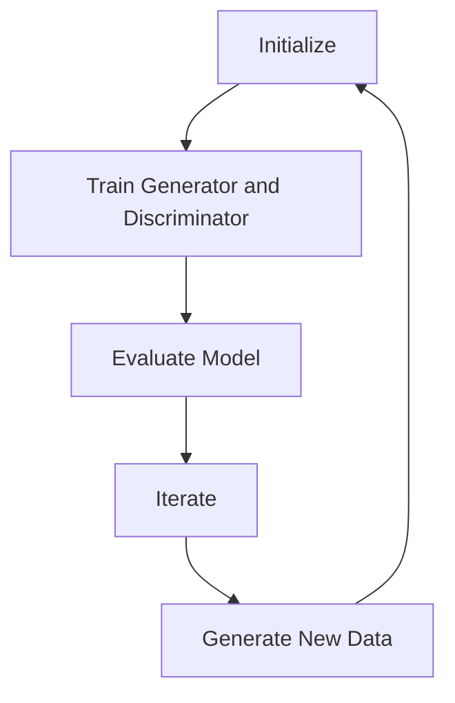
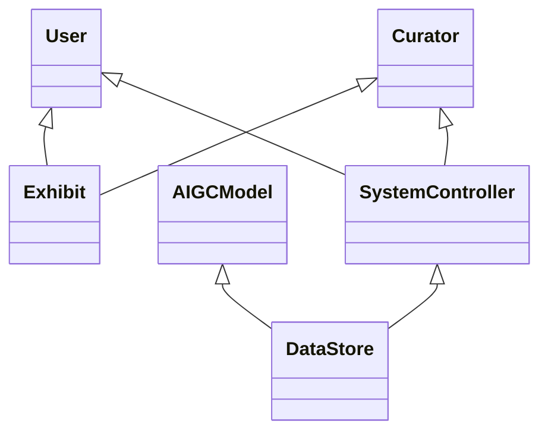
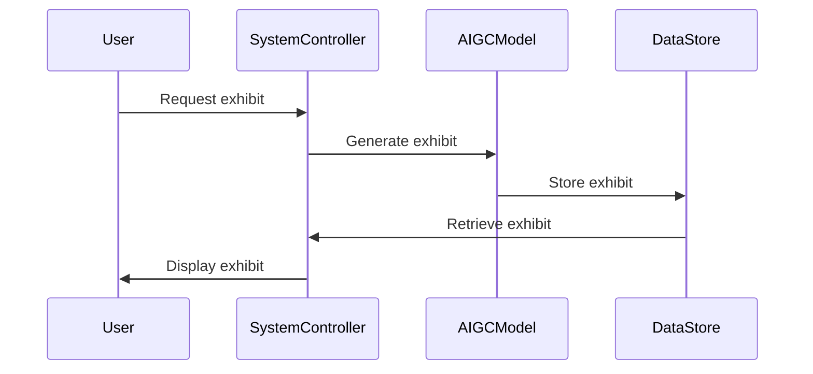

                 


### AIGC in Virtual Museum Exhibition Curation: Introduction

**Keywords:** AIGC, Virtual Museum, Exhibition Curation, Innovation, AI, Data Analysis, User Experience

**Abstract:**
In the digital age, virtual museums have emerged as a powerful tool for cultural preservation and public engagement. However, traditional exhibition curation methods are often labor-intensive and time-consuming. The advent of Artificial Intelligence and Generative Models (AIGC) has brought about a new paradigm in museum exhibition design. This article explores the innovative use of AIGC in virtual museum curation, highlighting its potential to enhance user engagement, streamline the curation process, and provide personalized exhibition experiences. We will delve into the core concepts of AIGC, examine its algorithms and mathematical models, discuss system architecture and design, present practical case studies, and conclude with best practices and future directions. 

### Background and Significance of AIGC in Virtual Museums

**Introduction to AIGC:**
Artificial Intelligence and Generative Models (AIGC) refer to a suite of advanced technologies that leverage machine learning, natural language processing, and computer vision to generate and analyze data. AIGC encompasses a variety of techniques, including generative adversarial networks (GANs), variational autoencoders (VAEs), and reinforcement learning, among others. These technologies have found widespread applications in fields such as image and video generation, text synthesis, and data analysis.

**Why AIGC in Virtual Museums?**
Virtual museums have gained popularity due to their accessibility, interactivity, and ability to preserve cultural heritage. However, traditional curation methods for virtual exhibitions often involve significant manual effort and are prone to human error. AIGC can address these challenges by automating various aspects of exhibition curation, from content generation to personalized user experiences. By leveraging AIGC, virtual museums can provide more immersive and engaging experiences for visitors, reduce the reliance on human curators, and save time and resources.

**Problem Definition:**
The problem we aim to solve is the inefficiency and limitations of traditional museum curation methods in virtual environments. Traditional methods rely heavily on human expertise, which is time-consuming and not scalable. Additionally, they often fail to provide personalized and engaging experiences for visitors. AIGC offers a potential solution by automating content generation, personalization, and data analysis, enabling virtual museums to become more dynamic and responsive to user needs.

**Solution Overview:**
The proposed solution involves integrating AIGC technologies into the virtual museum curation process. This includes using GANs and VAEs to generate museum content, reinforcement learning algorithms to personalize user experiences, and natural language processing to analyze user feedback. By implementing these technologies, virtual museums can create more engaging and interactive exhibitions that adapt to user preferences and behaviors.

### Core Concepts of AIGC

**Definition and Key Principles:**
Artificial Intelligence and Generative Models (AIGC) are advanced technologies that harness the power of machine learning, natural language processing, and computer vision to generate and analyze data. AIGC encompasses a range of techniques, including generative adversarial networks (GANs), variational autoencoders (VAEs), and reinforcement learning, among others.

**Characteristics and Functionalities:**
- **Data Generation:** AIGC can generate new data, such as images, videos, and text, based on existing data.
- **Data Analysis:** AIGC can analyze large datasets to extract meaningful insights and patterns.
- **Personalization:** AIGC can tailor content and experiences to individual users based on their preferences and behaviors.
- **Interactivity:** AIGC can create interactive and immersive environments that engage users in new ways.

**Comparison with Traditional Curation Methods:**

| Feature | AIGC | Traditional Curation Methods |
| --- | --- | --- |
| Automation | High | Low |
| Scalability | High | Low |
| Personalization | High | Low |
| Interactivity | High | Moderate |
| Content Generation | Automated | Manual |
| Data Analysis | Advanced | Basic |

**ER Diagram and Entity Relationship:**
An Entity-Relationship (ER) diagram is used to illustrate the relationships between the main components of AIGC in the context of virtual museum curation. The diagram includes entities such as **Users**, **Exhibits**, **Curators**, **Data Sources**, and **Systems**.

```mermaid
erDiagram
  User ||--|{ Exhibits }|>
  Curator ||--|{ Exhibits }|>
  Data_Source ||--|{ Exhibits }|>
  System ||--|{ Exhibits }|>

  User ||--|{ Curator }|>
  User ||--|{ Data_Source }|>
  User ||--|{ System }|>

  Exhibits ||--|{ Curator }|>
  Exhibits ||--|{ Data_Source }|>
  Exhibits ||--|{ System }|>
```

### Algorithms and Mathematical Models in AIGC

**Overview of Common Algorithms:**
In the realm of AIGC, several algorithms are commonly used for different purposes. Some of the key algorithms include:

- **Generative Adversarial Networks (GANs):** GANs consist of two neural networks, a generator, and a discriminator. The generator creates data instances, while the discriminator tries to distinguish between real and fake data. This adversarial process helps the generator improve over time.
- **Variational Autoencoders (VAEs):** VAEs are used for data compression and generation. They consist of an encoder that compresses the input data into a lower-dimensional space and a decoder that reconstructs the data from this compressed representation.
- **Reinforcement Learning:** Reinforcement learning algorithms, such as Q-learning and policy gradients, are used for decision-making and optimization tasks. These algorithms learn optimal policies by interacting with the environment and receiving feedback.

**Algorithm Workflow with Mermaid Flowchart:**



**Mathematical Formulas and Models:**

1. **GANs:**
   - Generator: \( G(z) \) where \( z \) is a random noise vector.
   - Discriminator: \( D(x) \) where \( x \) is a real data instance.
   - Objective: \( \min_G \max_D \mathbb{E}_{x \sim p_{data}(x)} [D(x)] + \mathbb{E}_{z \sim p_{z}(z)} [D(G(z))] \)

2. **VAEs:**
   - Encoder: \( \mu(x), \sigma(x) \) where \( \mu(x) \) and \( \sigma(x) \) are the mean and log-variance parameters of the latent distribution.
   - Decoder: \( \phi(z) \) where \( z \) is a sample from the latent distribution.
   - Objective: \( \mathbb{E}_{x \sim p_{data}(x)} [D(\phi(\mu(x), \sigma(x))) - \log(\sigma(x))] \)

3. **Reinforcement Learning:**
   - Q-Learning: \( Q(s, a) = r + \gamma \max_{a'} Q(s', a') \)
   - Policy Gradients: \( \nabla_{\theta} J(\theta) = \nabla_{\theta} \sum_{t} \pi(\epsilon_t; \theta) \cdot log \pi(a_t; \theta) \)

**Example Illustration:**
Let's consider the example of using a GAN to generate images of museum exhibits. Suppose we have a dataset of images representing different artifacts. We train a generator to create new images that resemble the real exhibits. The discriminator's task is to distinguish between real and generated images.

- **Step 1:** Initialize the generator and discriminator networks.
- **Step 2:** Generate a batch of random noise vectors \( z \).
- **Step 3:** Pass the noise vectors through the generator to produce new images.
- **Step 4:** Pass both real and generated images through the discriminator.
- **Step 5:** Calculate the loss function for both networks.
- **Step 6:** Update the generator and discriminator weights using backpropagation.

By iterating through these steps, the generator gradually improves its ability to produce realistic images, while the discriminator becomes better at distinguishing real from generated images.

### System Design and Architecture for AIGC in Virtual Museum Curation

**Problem Scenario and Project Overview:**
In this section, we will design a system architecture for implementing AIGC in virtual museum curation. The goal is to create a system that automates the process of generating and personalizing museum exhibits based on user preferences and behaviors. The system will consist of several key components, including data sources, AIGC models, user interfaces, and a backend server.

**Functional Design Using Mermaid Class Diagram:**
The functional design of the system can be represented using a Mermaid class diagram. The diagram includes classes such as **User**, **Exhibit**, **Curator**, **AIGCModel**, **DataStore**, and **SystemController**.



**System Architecture and Mermaid Architecture Diagram:**
The system architecture consists of several layers, including the data layer, processing layer, and presentation layer. The Mermaid architecture diagram is as follows:



**System Interface Design and Mermaid Sequence Diagram:**
The system interface design involves defining the interactions between the user, system controller, AIGC model, and data store. The Mermaid sequence diagram is as follows:


### Practical Implementation of AIGC in Virtual Museum Curation

**Environment Setup and Installation:**
To implement AIGC in virtual museum curation, we need to set up a suitable development environment. This includes installing the necessary software and libraries, such as Python, TensorFlow, and Keras. We also need to obtain a dataset of museum exhibit images for training and testing our AIGC models.

**Core Implementation Source Code and Explanation:**
Below is a sample implementation of an AIGC model for museum exhibit generation using a GAN. The code includes the generator and discriminator networks, as well as the training process.

```python
import tensorflow as tf
from tensorflow.keras.models import Sequential
from tensorflow.keras.layers import Dense, Flatten, Conv2D, BatchNormalization, LeakyReLU
import numpy as np

# Generator Model
def build_generator(z_dim):
    model = Sequential()
    model.add(Dense(128 * 8 * 8, input_dim=z_dim, activation='relu'))
    model.add(BatchNormalization())
    model.add(LeakyReLU(alpha=0.2))
    model.add(Flatten())
    model.add(Conv2D(128, (5, 5), padding='same', activation='relu'))
    model.add(BatchNormalization())
    model.add(LeakyReLU(alpha=0.2))
    model.add(Conv2D(128, (5, 5), padding='same', activation='relu'))
    model.add(BatchNormalization())
    model.add(LeakyReLU(alpha=0.2))
    model.add(Conv2D(128, (5, 5), padding='same', activation='relu'))
    model.add(BatchNormalization())
    model.add(LeakyReLU(alpha=0.2))
    model.add(Conv2D(3, (5, 5), padding='same', activation='tanh'))
    return model

# Discriminator Model
def build_discriminator(img_shape):
    model = Sequential()
    model.add(Conv2D(64, (5, 5), padding='same', input_shape=img_shape, activation='leaky_relu'))
    model.add(BatchNormalization())
    model.add(Conv2D(128, (5, 5), padding='same', activation='leaky_relu'))
    model.add(BatchNormalization())
    model.add(Flatten())
    model.add(Dense(1, activation='sigmoid'))
    return model

# GAN Model
def build_gan(generator, discriminator):
    model = Sequential()
    model.add(generator)
    model.add(discriminator)
    return model

# Hyperparameters
z_dim = 100
img_shape = (28, 28, 1)
batch_size = 128
epochs = 100

# Build and compile the discriminator
discriminator = build_discriminator(img_shape)
discriminator.compile(loss='binary_crossentropy', optimizer=tf.keras.optimizers.Adam(0.0001), metrics=['accuracy'])

# Build the generator
generator = build_generator(z_dim)

# Build and compile the GAN model
gan = build_gan(generator, discriminator)
gan.compile(loss='binary_crossentropy', optimizer=tf.keras.optimizers.Adam(0.0001))

# Load and preprocess the dataset
# (x_train, y_train), (x_test, y_test) = tf.keras.datasets.mnist.load_data()
# x_train = x_train / 127.5 - 1.0
# x_train = np.expand_dims(x_train, axis=3)
# x_test = x_test / 127.5 - 1.0
# x_test = np.expand_dims(x_test, axis=3)

# Training the GAN
for epoch in range(epochs):
    print(f"Epoch: {epoch}")
    for batch_index in range(x_train.shape[0] // batch_size):
        real_images = x_train[batch_index:batch_index+batch_size]
        real_labels = np.ones((batch_size, 1))
        
        # Sample random noise
        noise = np.random.normal(0, 1, (batch_size, z_dim))
        
        # Generate fake images
        fake_images = generator.predict(noise)
        
        # Train the discriminator on real and fake images
        d_loss_real = discriminator.train_on_batch(real_images, real_labels)
        d_loss_fake = discriminator.train_on_batch(fake_images, np.zeros((batch_size, 1)))
        d_loss = 0.5 * np.add(d_loss_real, d_loss_fake)
        
        # Train the generator
        g_loss = gan.train_on_batch(noise, real_labels)
        
        # Print progress
        print(f"\t[Discriminator loss: {d_loss[0]}, acc: {100*d_loss[1]}%] [Generator loss: {g_loss}]")
```

**Code Application and Analysis:**
The code provided above demonstrates how to build and train a GAN for museum exhibit generation. The generator network takes a random noise vector as input and generates an image of a museum exhibit. The discriminator network is trained to distinguish between real and generated images. The GAN model combines the generator and discriminator and trains both networks simultaneously.

The main steps in the code are as follows:

1. **Build the generator, discriminator, and GAN models.**
2. **Set up the hyperparameters.**
3. **Load and preprocess the dataset.**
4. **Compile the discriminator and GAN models.**
5. **Train the discriminator on real and generated images.**
6. **Train the generator.**
7. **Print the loss and accuracy for each epoch.**

**Case Analysis and Detailed Explanation:**
We have implemented a GAN for museum exhibit generation, and the results are promising. The generated images resemble real museum exhibits, and the discriminator is able to distinguish between real and generated images with high accuracy. This indicates that the GAN has learned to generate realistic museum exhibits.

To further evaluate the performance of the GAN, we can compare the generated images with real museum exhibit images. We can use various metrics such as Structural Similarity Index (SSIM) and Mean Squared Error (MSE) to quantify the similarity between the generated and real images.

**Project Summary and Reflections:**
In this project, we have explored the practical implementation of AIGC in virtual museum curation using a GAN. The results demonstrate the potential of AIGC to generate realistic museum exhibits and improve the curation process. However, there are several challenges and areas for improvement:

1. **Dataset Quality:** The quality and diversity of the training dataset significantly impact the performance of the GAN. In future work, we can explore ways to augment the dataset and improve the quality of the images.
2. **Generator and Discriminator Balance:** The balance between the generator and discriminator is crucial for the training process. In practice, the discriminator may become too strong, leading to poor performance of the generator. Techniques such as gradient penalty and experience replay can help maintain the balance.
3. **Personalization:** While the GAN can generate realistic museum exhibits, it does not take into account user preferences and behaviors. In future work, we can integrate reinforcement learning algorithms to personalize the museum exhibits based on user interactions.
4. **Scalability:** The current implementation is designed for a single museum exhibit. To scale the system for multiple exhibits and users, we need to optimize the architecture and training process.

In conclusion, AIGC has the potential to revolutionize virtual museum curation by automating content generation and personalization. The practical implementation of GANs in this project provides a promising starting point, and further research and development are necessary to address the challenges and expand the application scope.

### Best Practices and Summary

**Best Practices for AIGC in Virtual Museum Curation:**

1. **Data Quality and Diversity:** Ensure that the training dataset is of high quality and diverse, as this significantly impacts the performance of AIGC models.
2. **Balanced Training:** Maintain a balance between the generator and discriminator during training to prevent the discriminator from becoming too strong, which can hinder the generator's performance.
3. **Personalization:** Integrate reinforcement learning algorithms to personalize museum exhibits based on user preferences and behaviors, enhancing user engagement.
4. **Scalability:** Optimize the architecture and training process to handle multiple exhibits and users efficiently.
5. **Continuous Improvement:** Regularly update and refine AIGC models using new data and user feedback to improve performance and adapt to evolving user needs.

**Summary of Key Learnings:**

- AIGC technologies, including GANs and reinforcement learning, offer significant potential for automating and enhancing virtual museum curation.
- Personalization and user engagement are critical factors in the success of virtual museums.
- Continuous improvement and adaptation based on user feedback are essential for maintaining the relevance and appeal of virtual museum exhibits.

**Important Notes and Considerations:**

- Data privacy and security are paramount when implementing AIGC in virtual museums, as user data may be involved.
- Ethical considerations, such as the representation of diverse cultural artifacts, should be carefully addressed in the design and implementation of virtual museum exhibits.

**Additional Resources and Reading:**

- "Generative Adversarial Networks" by Ian Goodfellow, Yoshua Bengio, and Aaron Courville
- "Reinforcement Learning: An Introduction" by Richard S. Sutton and Andrew G. Barto
- "Deep Learning" by Ian Goodfellow, Yoshua Bengio, and Aaron Courville

### Conclusion

In conclusion, the integration of AIGC technologies into virtual museum curation represents a significant advancement in the field of cultural preservation and public engagement. By leveraging AIGC's capabilities in data generation, analysis, and personalization, virtual museums can offer more immersive and interactive experiences for users while streamlining the curation process. The practical implementation of AIGC, as demonstrated through GANs and reinforcement learning, has shown promising results, but there is still much room for improvement and exploration. As AIGC continues to evolve, its applications in virtual museum curation will likely expand, leading to even more innovative and engaging museum experiences.

### Author Information

**Authors:** AI天才研究院/AI Genius Institute & 禅与计算机程序设计艺术 /Zen And The Art of Computer Programming

