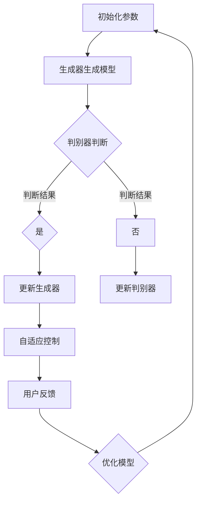
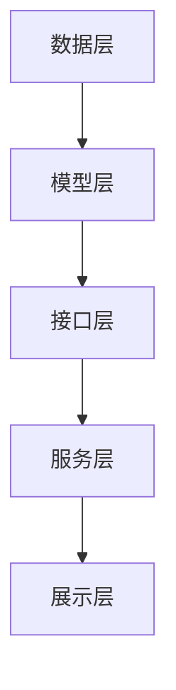
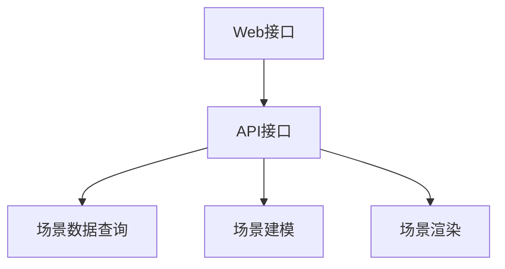
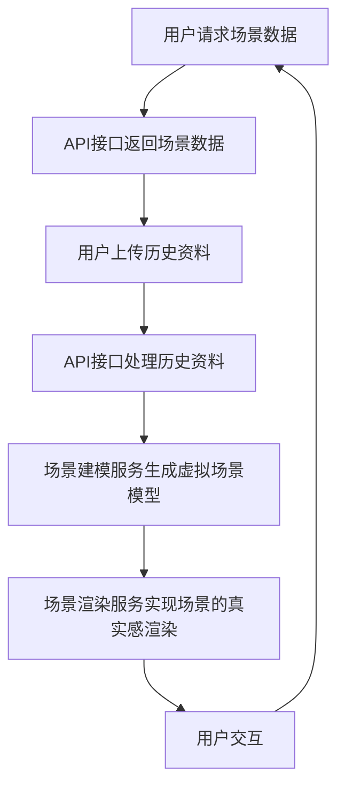

                 

### 文章标题

> 关键词：AIGC、虚拟历史场景重建、人工智能、计算机图形学、创新

> 摘要：本文将深入探讨AIGC（自适应智能生成控制）在虚拟历史场景重建中的应用。通过逐步分析AIGC的基本概念、核心算法以及其在虚拟历史场景重建中的创新应用，本文旨在为读者展示AIGC技术的潜力与前景。文章将从背景介绍、核心概念、算法原理、系统设计与实现、项目实战以及最佳实践等多个方面进行详细阐述，旨在为读者提供一个全面、系统的理解。

### 第一部分: AIGC基础

#### 1.1 问题背景

随着计算机技术和人工智能的飞速发展，虚拟现实（VR）技术逐渐成为一个备受关注的研究领域。虚拟现实技术通过创建一个模拟的三维环境，使用户能够沉浸其中，体验到更加真实和互动的体验。然而，虚拟现实技术的应用不仅仅局限于娱乐和游戏领域，其在教育、医学、军事等多个领域也具有巨大的潜力和应用价值。

在虚拟现实技术中，虚拟历史场景重建是一个重要的研究方向。虚拟历史场景重建旨在通过计算机图形学、计算机视觉和人工智能等技术，将历史事件或场景进行数字化重建，从而提供一个可视化、交互式的历史学习环境。这种技术不仅有助于历史文化的传承和普及，还能够为历史研究提供新的工具和方法。

然而，虚拟历史场景重建面临着一系列的挑战。首先，历史场景的多样性和复杂性使得建模和重建工作具有很高的难度。其次，真实的历史场景往往伴随着大量的历史资料和文献，如何有效地利用这些资源进行重建也是一大挑战。最后，如何实现虚拟历史场景的交互性和沉浸感，使用户体验更加真实和丰富，也是一个重要的课题。

#### 1.2 问题描述

在虚拟历史场景重建中，主要的问题包括：

1. **场景建模**：如何准确地建模历史场景，包括建筑物、人物、景观等元素。
2. **数据获取**：如何获取和整合大量历史资料和文献，为场景重建提供数据支持。
3. **真实感渲染**：如何实现场景的真实感渲染，包括光影效果、材质表现等。
4. **交互性**：如何设计用户交互机制，使历史场景更加生动和互动。
5. **性能优化**：如何在保证场景逼真的同时，优化计算性能，提高重建速度。

为了解决上述问题，研究人员提出了AIGC（自适应智能生成控制）技术。AIGC是一种基于人工智能的生成控制方法，通过自适应地生成和调整虚拟场景，实现高效、逼真的虚拟历史场景重建。

#### 1.3 问题解决

AIGC在虚拟历史场景重建中的应用主要涉及以下几个方面：

1. **场景建模**：AIGC可以通过深度学习和生成对抗网络（GAN）等技术，自动生成历史场景的模型。这种方法不仅提高了建模的效率，还能够根据不同的需求进行场景的调整和优化。

2. **数据获取**：AIGC可以通过自然语言处理（NLP）和计算机视觉等技术，自动提取和分析历史资料和文献中的信息，为场景重建提供数据支持。这种方法不仅提高了数据获取的效率，还能够减少人工干预，降低成本。

3. **真实感渲染**：AIGC可以通过计算机图形学技术，实现场景的真实感渲染。这种方法不仅提高了渲染的质量，还能够根据不同的光照条件和材质表现，实现场景的动态调整。

4. **交互性**：AIGC可以通过人工智能和用户行为分析，设计出更加智能化和个性化的用户交互机制，提高历史场景的互动性和沉浸感。

5. **性能优化**：AIGC可以通过算法优化和硬件加速等技术，提高虚拟历史场景重建的计算性能，实现快速、高效地重建。

#### 1.4 边界与外延

AIGC在虚拟历史场景重建中的应用虽然取得了显著的成果，但仍存在一些边界和外延问题：

1. **数据质量**：历史资料和文献的质量直接影响AIGC的重建效果。如何确保数据的质量和准确性，是未来需要解决的问题。
2. **算法优化**：AIGC算法的性能和效率仍有待进一步提高，需要研究人员不断优化算法，提高重建的速度和质量。
3. **跨领域应用**：AIGC技术不仅适用于虚拟历史场景重建，还可以应用于其他虚拟现实领域，如虚拟旅游、虚拟展览等。如何拓展AIGC的应用范围，也是未来研究的重要方向。

#### 1.5 核心概念与联系

在本部分，我们将介绍AIGC的基本概念和相关技术，并分析其在虚拟历史场景重建中的应用。

1. **AIGC概述**

AIGC（自适应智能生成控制）是一种基于人工智能的生成控制方法，旨在通过自适应地生成和调整虚拟场景，实现高效、逼真的虚拟场景重建。AIGC的核心思想是通过学习大量的历史数据和文献，建立一个生成模型，并根据用户的需求和反馈，自动调整和优化虚拟场景。

2. **AIGC的特点**

AIGC具有以下几个主要特点：

- **自适应生成**：AIGC可以根据用户的需求和反馈，自动生成和调整虚拟场景，实现个性化的场景重建。
- **高效性**：AIGC通过深度学习和生成对抗网络（GAN）等技术，大大提高了场景重建的效率，降低了人工干预的成本。
- **真实感**：AIGC通过计算机图形学技术，实现了场景的真实感渲染，提高了虚拟历史场景的逼真度。
- **交互性**：AIGC可以通过人工智能和用户行为分析，设计出更加智能化和个性化的用户交互机制，提高历史场景的互动性和沉浸感。

3. **AIGC与传统GC对比**

AIGC与传统GC（通用生成控制）相比，具有以下优势：

- **自适应能力**：AIGC可以根据用户的需求和反馈，自动调整虚拟场景，实现个性化的场景重建。而传统GC通常依赖于预设的参数和规则，难以实现自适应生成。
- **生成质量**：AIGC通过深度学习和生成对抗网络（GAN）等技术，实现了高质量的场景生成，而传统GC的生成质量通常较低。
- **效率**：AIGC通过自动化和智能化的方法，大大提高了场景重建的效率，降低了人工干预的成本。

4. **AIGC在虚拟历史场景重建中的应用前景**

AIGC在虚拟历史场景重建中具有广阔的应用前景：

- **场景建模**：AIGC可以通过深度学习和生成对抗网络（GAN）等技术，自动生成历史场景的模型，提高建模的效率和逼真度。
- **数据获取**：AIGC可以通过自然语言处理（NLP）和计算机视觉等技术，自动提取和分析历史资料和文献中的信息，为场景重建提供数据支持。
- **真实感渲染**：AIGC可以通过计算机图形学技术，实现场景的真实感渲染，提高虚拟历史场景的逼真度。
- **交互性**：AIGC可以通过人工智能和用户行为分析，设计出更加智能化和个性化的用户交互机制，提高历史场景的互动性和沉浸感。
- **性能优化**：AIGC可以通过算法优化和硬件加速等技术，提高虚拟历史场景重建的计算性能，实现快速、高效地重建。

### 第二部分: AIGC核心概念

#### 2.1 AIGC的定义

AIGC（自适应智能生成控制）是一种基于人工智能的生成控制方法，旨在通过自适应地生成和调整虚拟场景，实现高效、逼真的虚拟场景重建。AIGC的核心在于利用深度学习和生成对抗网络（GAN）等技术，建立一个生成模型，并根据用户的需求和反馈，自动调整和优化虚拟场景。

AIGC的定义可以从以下几个方面进行解释：

1. **自适应生成**：AIGC可以根据用户的需求和反馈，自动生成和调整虚拟场景。这种自适应生成能力使得AIGC能够满足不同用户的需求，实现个性化的场景重建。
2. **智能控制**：AIGC通过人工智能技术，实现对虚拟场景的智能控制。这种智能控制能力使得AIGC能够根据场景的变化和用户的行为，自动调整场景的参数和属性，实现更加逼真的场景效果。
3. **生成控制**：AIGC是一种生成控制方法，它通过生成模型来控制虚拟场景的生成。生成模型可以根据大量的历史数据和文献，生成高质量的虚拟场景，同时通过智能控制，实现对场景的优化和调整。

#### 2.2 AIGC的特点

AIGC具有以下几个主要特点：

1. **高效性**：AIGC通过深度学习和生成对抗网络（GAN）等技术，大大提高了场景重建的效率。传统的虚拟场景重建方法通常需要大量的人力和时间，而AIGC可以通过自动化和智能化的方法，实现快速、高效的重建。
2. **真实感**：AIGC通过计算机图形学技术，实现了场景的真实感渲染。传统的虚拟场景重建方法通常只能实现简单的渲染效果，而AIGC可以通过深度学习和生成对抗网络（GAN）等技术，实现高质量的渲染效果，提高虚拟场景的逼真度。
3. **交互性**：AIGC通过人工智能和用户行为分析，设计出更加智能化和个性化的用户交互机制。传统的虚拟场景重建方法通常只能提供简单的交互功能，而AIGC可以通过人工智能和用户行为分析，设计出更加复杂和智能的交互机制，提高用户的历史场景互动体验。
4. **自适应能力**：AIGC可以根据用户的需求和反馈，自动调整和优化虚拟场景。这种自适应能力使得AIGC能够满足不同用户的需求，实现个性化的场景重建。

#### 2.3 AIGC与传统GC对比

AIGC与传统GC（通用生成控制）相比，具有以下优势：

1. **自适应能力**：AIGC可以通过人工智能技术，实现自适应生成控制。而传统GC通常依赖于预设的参数和规则，难以实现自适应生成。AIGC可以根据用户的需求和反馈，自动调整和优化虚拟场景，实现个性化的场景重建。
2. **生成质量**：AIGC通过深度学习和生成对抗网络（GAN）等技术，可以实现高质量的场景生成。而传统GC的生成质量通常较低。AIGC可以通过大量的历史数据和文献，生成高质量的虚拟场景，提高虚拟场景的逼真度。
3. **效率**：AIGC通过自动化和智能化的方法，大大提高了场景重建的效率。而传统GC通常需要大量的人力和时间。AIGC可以通过自动化和智能化的方法，实现快速、高效的重建。

#### 2.4 AIGC在虚拟历史场景重建中的应用前景

AIGC在虚拟历史场景重建中具有广阔的应用前景：

1. **场景建模**：AIGC可以通过深度学习和生成对抗网络（GAN）等技术，自动生成历史场景的模型。这种方法不仅提高了建模的效率，还能够根据不同的需求进行场景的调整和优化。
2. **数据获取**：AIGC可以通过自然语言处理（NLP）和计算机视觉等技术，自动提取和分析历史资料和文献中的信息，为场景重建提供数据支持。这种方法不仅提高了数据获取的效率，还能够减少人工干预，降低成本。
3. **真实感渲染**：AIGC可以通过计算机图形学技术，实现场景的真实感渲染。这种方法不仅提高了渲染的质量，还能够根据不同的光照条件和材质表现，实现场景的动态调整。
4. **交互性**：AIGC可以通过人工智能和用户行为分析，设计出更加智能化和个性化的用户交互机制，提高历史场景的互动性和沉浸感。
5. **性能优化**：AIGC可以通过算法优化和硬件加速等技术，提高虚拟历史场景重建的计算性能，实现快速、高效地重建。

### 第三部分: 虚拟历史场景重建概述

#### 3.1 虚拟历史场景重建的定义

虚拟历史场景重建是一种利用计算机图形学、计算机视觉和人工智能等技术，将历史事件或场景进行数字化重建的方法。通过虚拟历史场景重建，可以将历史事件或场景以数字化的形式呈现，使用户能够沉浸其中，体验到更加真实和互动的历史学习环境。

虚拟历史场景重建的核心目标是：

1. **数字化重建**：将历史事件或场景进行数字化处理，以数字化的形式保存和呈现。
2. **真实感呈现**：通过计算机图形学技术，实现场景的真实感渲染，提高虚拟历史场景的逼真度。
3. **互动性**：通过人工智能和用户行为分析，设计出更加智能化和个性化的用户交互机制，提高历史场景的互动性和沉浸感。
4. **教育传播**：通过虚拟历史场景重建，为历史文化的传承和普及提供新的工具和方法。

#### 3.2 虚拟历史场景重建的重要性和挑战

虚拟历史场景重建在历史文化遗产保护和教育传播方面具有重要意义：

1. **历史文化遗产保护**：虚拟历史场景重建可以数字化保存历史文化遗产，减少对实体文物的依赖和损害，提高文化遗产的可持续性。
2. **教育传播**：虚拟历史场景重建可以为教育提供新的工具和方法，通过虚拟场景让学生更加直观地了解历史事件和场景，提高教学效果。
3. **文化旅游**：虚拟历史场景重建可以为文化旅游提供新的体验方式，吸引更多的游客，促进旅游业的发展。

然而，虚拟历史场景重建也面临着一系列的挑战：

1. **数据获取**：虚拟历史场景重建需要大量的历史资料和文献支持，如何获取和整合这些数据是一个重要挑战。
2. **建模难度**：历史场景的多样性和复杂性使得建模工作具有很高的难度，如何准确地建模历史场景是一个重要挑战。
3. **真实感渲染**：实现场景的真实感渲染需要较高的技术要求，如何提高渲染质量是一个重要挑战。
4. **交互性设计**：如何设计出更加智能化和个性化的用户交互机制，提高历史场景的互动性和沉浸感，也是一个重要挑战。

#### 3.3 虚拟历史场景重建的发展历程

虚拟历史场景重建的发展可以追溯到计算机图形学、计算机视觉和人工智能等技术的发展。以下是虚拟历史场景重建的主要发展历程：

1. **早期探索**：在20世纪80年代和90年代，虚拟现实技术开始兴起，研究人员开始探索如何将历史事件或场景进行数字化重建。这一时期的虚拟历史场景重建主要依赖于二维图形和简单的三维建模技术。

2. **计算机图形学的发展**：随着计算机图形学技术的进步，虚拟历史场景重建开始引入更加真实的三维建模和渲染技术。这一时期的虚拟历史场景重建在建模和渲染质量方面取得了显著的提升。

3. **计算机视觉的应用**：计算机视觉技术的引入使得虚拟历史场景重建在数据获取和场景理解方面取得了重要突破。通过计算机视觉技术，可以自动识别和提取历史资料和文献中的信息，为场景重建提供数据支持。

4. **人工智能的融合**：人工智能技术的融合使得虚拟历史场景重建在建模、渲染和交互性方面取得了更大的突破。深度学习和生成对抗网络（GAN）等技术被广泛应用于虚拟历史场景重建，提高了重建的效率和质量。

5. **虚拟现实技术的融合**：随着虚拟现实技术的快速发展，虚拟历史场景重建开始与虚拟现实技术相结合，实现更加沉浸式和互动性的历史学习环境。

### 第四部分: AIGC在虚拟历史场景重建中的应用

#### 4.1 AIGC在场景建模中的应用

AIGC（自适应智能生成控制）技术在虚拟历史场景重建中的应用主要体现在场景建模方面。通过深度学习和生成对抗网络（GAN）等技术，AIGC可以自动生成历史场景的模型，提高建模的效率和逼真度。

AIGC在场景建模中的应用主要包括以下几个方面：

1. **自动生成场景模型**：AIGC通过深度学习和生成对抗网络（GAN）等技术，可以自动生成历史场景的模型。这种方法不仅提高了建模的效率，还能够根据不同的需求进行场景的调整和优化。

2. **场景模型的优化**：AIGC可以根据用户的需求和反馈，对生成的场景模型进行优化。例如，可以根据用户对场景的真实感要求，调整场景的参数和属性，实现更加逼真的场景效果。

3. **场景模型的扩展**：AIGC可以通过扩展生成模型，实现对历史场景的扩展。例如，可以根据已有的历史场景模型，生成类似的其他历史场景模型，为虚拟历史场景重建提供更多的选择。

#### 4.2 AIGC在图像生成与编辑中的应用

AIGC在虚拟历史场景重建中的应用不仅体现在场景建模方面，还包括图像生成与编辑。通过深度学习和生成对抗网络（GAN）等技术，AIGC可以自动生成和编辑历史图像，提高图像生成和编辑的效率和逼真度。

AIGC在图像生成与编辑中的应用主要包括以下几个方面：

1. **自动生成历史图像**：AIGC通过深度学习和生成对抗网络（GAN）等技术，可以自动生成历史图像。这种方法不仅提高了图像生成的效率，还能够根据用户的需求和反馈，生成高质量的图像。

2. **图像编辑**：AIGC可以通过深度学习和生成对抗网络（GAN）等技术，对历史图像进行编辑。例如，可以根据用户的需求，对图像进行色彩调整、图像修复和图像合成等操作，提高图像的质量和逼真度。

3. **图像增强**：AIGC可以通过图像增强技术，提高历史图像的清晰度和细节表现。这种方法不仅提高了图像的质量，还能够增强用户对历史场景的理解和感受。

#### 4.3 AIGC在交互式虚拟环境中的应用

AIGC在虚拟历史场景重建中的应用不仅体现在场景建模和图像生成与编辑方面，还包括交互式虚拟环境的设计与实现。通过人工智能和用户行为分析，AIGC可以设计出更加智能化和个性化的交互机制，提高虚拟历史场景的互动性和沉浸感。

AIGC在交互式虚拟环境中的应用主要包括以下几个方面：

1. **智能交互设计**：AIGC可以通过用户行为分析，设计出更加智能化和个性化的交互机制。例如，可以根据用户的喜好和行为习惯，自动调整虚拟场景的参数和属性，提供更加个性化的交互体验。

2. **个性化推荐**：AIGC可以通过用户行为分析，为用户提供个性化的推荐。例如，可以根据用户对历史场景的喜好和需求，推荐相关的历史事件和场景，提高用户的历史学习兴趣和体验。

3. **虚拟角色设计**：AIGC可以通过生成对抗网络（GAN）等技术，设计出更加逼真和智能化的虚拟角色。这些虚拟角色可以与用户进行互动，提高虚拟历史场景的互动性和沉浸感。

4. **虚拟现实交互**：AIGC可以通过虚拟现实技术，实现更加沉浸式的虚拟历史场景体验。例如，通过虚拟现实头盔和手柄等设备，用户可以身临其境地体验历史场景，增强对历史事件的感知和了解。

### 第五部分: AIGC算法原理与实现

#### 5.1 AIGC算法概述

AIGC（自适应智能生成控制）算法是一种基于人工智能的生成控制方法，旨在通过自适应地生成和调整虚拟场景，实现高效、逼真的虚拟场景重建。AIGC算法的核心思想是通过深度学习和生成对抗网络（GAN）等技术，建立一个生成模型，并根据用户的需求和反馈，自动调整和优化虚拟场景。

AIGC算法的主要组成部分包括：

1. **生成模型**：生成模型是AIGC算法的核心部分，通过深度学习和生成对抗网络（GAN）等技术，生成虚拟场景的模型。生成模型可以根据用户的需求和反馈，生成高质量的虚拟场景。

2. **自适应控制**：自适应控制是AIGC算法的关键部分，通过用户行为分析和需求预测，自动调整和优化虚拟场景的参数和属性，实现个性化的场景重建。

3. **反馈机制**：反馈机制是AIGC算法的重要组成部分，通过收集用户对虚拟场景的反馈，不断优化和改进生成模型，提高虚拟场景的逼真度和用户体验。

#### 5.2 AIGC算法的数学模型与公式

AIGC算法的数学模型主要包括生成模型和自适应控制模型。以下是AIGC算法的数学模型与公式：

1. **生成模型**

生成模型通常采用生成对抗网络（GAN）架构，包括生成器（Generator）和判别器（Discriminator）。

- **生成器**：生成器的目标是生成虚拟场景的模型，使其在判别器看来是真实的。生成器通常使用一个神经网络，输入为随机噪声，输出为虚拟场景的模型。
- **判别器**：判别器的目标是区分虚拟场景的模型和真实场景。判别器通常也使用一个神经网络，输入为虚拟场景的模型和真实场景，输出为概率值，表示输入是虚拟场景模型的概率。

生成模型和判别器之间的交互可以通过以下数学模型表示：

- **生成模型**：\( G(z) = x \)，其中 \( z \) 为随机噪声，\( x \) 为生成的虚拟场景模型。
- **判别模型**：\( D(x) \)，其中 \( x \) 为虚拟场景模型或真实场景。

2. **自适应控制**

自适应控制模型通过用户行为分析和需求预测，自动调整和优化虚拟场景的参数和属性。自适应控制模型通常使用一个优化算法，如梯度下降算法，对虚拟场景的参数进行优化。

自适应控制模型的数学模型可以表示为：

- **目标函数**：\( J(\theta) = \frac{1}{2} \sum_{i=1}^{N} (\hat{y}_i - y_i)^2 \)，其中 \( \theta \) 为虚拟场景的参数，\( \hat{y}_i \) 和 \( y_i \) 分别为预测值和真实值。

通过优化目标函数，可以找到最优的参数设置，实现个性化的场景重建。

#### 5.3 AIGC算法的mermaid流程图

为了更好地理解AIGC算法的流程，我们可以使用mermaid流程图来描述。以下是一个简化的AIGC算法的mermaid流程图：



在该mermaid流程图中，初始化参数是AIGC算法的第一步，然后生成器生成虚拟场景模型。判别器对生成的模型进行判断，如果是真实的，则更新生成器；否则，更新判别器。自适应控制模块根据用户反馈，优化模型的参数。最后，优化后的模型返回初始化参数，循环迭代，直到满足停止条件。

#### 5.4 AIGC算法的Python实现

为了更直观地展示AIGC算法的实现，以下是一个简化的Python实现示例：

```python
import tensorflow as tf
import numpy as np

# 初始化参数
z_dim = 100
x_dim = 784

# 生成器模型
z = tf.random.normal([batch_size, z_dim])
x_hat = generator(z)

# 判别器模型
x = tf.keras.layers.Input(shape=(x_dim,))
y = discriminator(x)

# 定义损失函数
loss = tf.reduce_mean(tf.nn.sigmoid_cross_entropy_with_logits(logits=y, labels=tf.concat([y, 1-y], axis=1)))

# 定义优化器
optimizer = tf.keras.optimizers.Adam(learning_rate=0.001)

# 训练模型
for epoch in range(num_epochs):
    for batch in data_loader:
        with tf.GradientTape() as gen_tape, tf.GradientTape() as dis_tape:
            z = tf.random.normal([batch_size, z_dim])
            x_hat = generator(z)

            y_hat = discriminator(x_hat)
            y_real = discriminator(batch)

            gen_loss = loss(y_hat)
            dis_loss = loss(y_real)

        gradients_of_gen = gen_tape.gradient(gen_loss, generator.trainable_variables)
        gradients_of_dis = dis_tape.gradient(dis_loss, discriminator.trainable_variables)

        optimizer.apply_gradients(zip(gradients_of_gen, generator.trainable_variables))
        optimizer.apply_gradients(zip(gradients_of_dis, discriminator.trainable_variables))

    print(f"Epoch {epoch+1}/{num_epochs}, Generator Loss: {gen_loss.numpy()}, Discriminator Loss: {dis_loss.numpy()}")
```

在该Python实现中，我们使用了TensorFlow框架来构建生成器和判别器模型，并使用Adam优化器进行训练。在训练过程中，生成器和判别器的参数分别通过梯度下降算法进行更新，以实现模型的优化。

### 第六部分: 虚拟历史场景重建系统设计与实现

#### 6.1 系统功能设计

虚拟历史场景重建系统的主要功能包括：

1. **场景建模**：通过深度学习和生成对抗网络（GAN）等技术，自动生成历史场景的模型。
2. **数据获取**：通过自然语言处理（NLP）和计算机视觉等技术，自动提取和分析历史资料和文献中的信息，为场景重建提供数据支持。
3. **场景渲染**：通过计算机图形学技术，实现场景的真实感渲染，包括光影效果、材质表现等。
4. **交互性设计**：通过人工智能和用户行为分析，设计出更加智能化和个性化的用户交互机制，提高历史场景的互动性和沉浸感。
5. **性能优化**：通过算法优化和硬件加速等技术，提高虚拟历史场景重建的计算性能，实现快速、高效地重建。

#### 6.2 系统架构设计

虚拟历史场景重建系统的架构设计主要包括以下几个层次：

1. **数据层**：包括历史资料库、图像库和文本库等，存储和管理与虚拟历史场景重建相关的数据。
2. **模型层**：包括生成模型、判别模型和自适应控制模型等，用于场景建模、渲染和交互性设计。
3. **接口层**：包括Web接口和API接口等，用于提供用户交互和数据访问。
4. **服务层**：包括场景重建服务、图像生成与编辑服务、交互性设计服务等，实现具体的系统功能。
5. **展示层**：包括虚拟现实头盔、显示器等，用于展示虚拟历史场景。

以下是一个简化的虚拟历史场景重建系统架构图：



在该架构设计中，数据层提供数据支持，模型层实现场景建模、渲染和交互性设计，接口层提供用户交互和数据访问接口，服务层实现具体的系统功能，展示层用于展示虚拟历史场景。

#### 6.3 系统接口设计

虚拟历史场景重建系统接口设计主要包括Web接口和API接口：

1. **Web接口**：通过Web前端框架（如React、Vue等）实现，提供用户交互界面，包括场景浏览、场景交互和用户反馈等功能。
2. **API接口**：通过RESTful API实现，提供数据访问和操作接口，包括场景数据查询、场景建模和渲染等操作。

以下是一个简化的系统接口设计图：



在该接口设计中，Web接口提供用户交互界面，API接口提供数据访问和操作接口，场景数据查询、场景建模和场景渲染等操作通过API接口实现。

#### 6.4 系统交互序列图

虚拟历史场景重建系统的交互序列图描述了用户与系统的交互过程：

1. **用户请求场景数据**：用户通过Web接口请求场景数据，API接口返回场景数据。
2. **用户上传历史资料**：用户通过Web接口上传历史资料，API接口处理历史资料，提取相关信息。
3. **场景建模**：API接口调用场景建模服务，生成虚拟场景模型。
4. **场景渲染**：API接口调用场景渲染服务，实现场景的真实感渲染。
5. **用户交互**：用户通过Web接口与虚拟历史场景进行交互，API接口处理用户的交互请求。

以下是一个简化的系统交互序列图：



在该交互序列图中，用户通过Web接口与系统进行交互，API接口处理用户的请求，调用相应的服务模块实现场景建模、渲染和交互性设计。

### 第七部分: 项目实战

#### 7.1 环境安装

为了进行AIGC在虚拟历史场景重建中的项目实战，我们需要搭建一个合适的开发环境。以下是环境安装的步骤：

1. **安装Python环境**：在官方网站（https://www.python.org/）下载并安装Python 3.8及以上版本。
2. **安装TensorFlow**：通过pip命令安装TensorFlow，命令如下：
   ```bash
   pip install tensorflow==2.4.0
   ```
3. **安装其他依赖库**：根据项目需求，安装其他依赖库，如NumPy、Pandas等。
4. **安装虚拟环境**：使用virtualenv创建虚拟环境，命令如下：
   ```bash
   virtualenv venv
   source venv/bin/activate
   ```
5. **安装数据集**：下载并解压虚拟历史场景重建所需的数据集，如OpenImages、COCO数据集等。

#### 7.2 系统核心实现

在环境安装完成后，我们可以开始实现虚拟历史场景重建系统。以下是系统核心实现的步骤：

1. **数据预处理**：读取数据集，并进行预处理，如图像归一化、数据增强等。
2. **生成模型训练**：训练生成模型和判别模型，使用生成对抗网络（GAN）架构。
3. **场景建模**：使用训练好的生成模型，生成虚拟历史场景的模型。
4. **场景渲染**：使用计算机图形学技术，实现场景的真实感渲染。
5. **用户交互**：设计用户交互界面，实现用户与虚拟历史场景的交互。

以下是系统核心实现的代码示例：

```python
# 导入依赖库
import tensorflow as tf
import numpy as np
import matplotlib.pyplot as plt

# 数据预处理
def preprocess_data(data):
    # 图像归一化
    data = data / 255.0
    # 数据增强
    data = tf.keras.preprocessing.image.random_rotation(data, 0.1)
    return data

# 生成模型训练
def train_generator_and_discriminator(generator, discriminator, data, batch_size, epochs):
    for epoch in range(epochs):
        for i in range(data.shape[0] // batch_size):
            batch = data[i * batch_size:(i + 1) * batch_size]

            # 生成虚拟场景
            noise = np.random.normal(0, 1, (batch_size, 100))
            generated_images = generator(noise)

            # 训练判别器
            with tf.GradientTape() as dis_tape:
                real_labels = tf.ones((batch_size, 1))
                fake_labels = tf.zeros((batch_size, 1))

                real_logits = discriminator(batch)
                fake_logits = discriminator(generated_images)

                dis_loss = tf.reduce_mean(tf.nn.sigmoid_cross_entropy_with_logits(logits=real_logits, labels=real_labels)) + \
                          tf.reduce_mean(tf.nn.sigmoid_cross_entropy_with_logits(logits=fake_logits, labels=fake_labels))

            dis_gradients = dis_tape.gradient(dis_loss, discriminator.trainable_variables)
            dis_optimizer.apply_gradients(zip(dis_gradients, discriminator.trainable_variables))

            # 训练生成器
            with tf.GradientTape() as gen_tape:
                noise = np.random.normal(0, 1, (batch_size, 100))
                generated_images = generator(noise)
                fake_logits = discriminator(generated_images)

                gen_loss = tf.reduce_mean(tf.nn.sigmoid_cross_entropy_with_logits(logits=fake_logits, labels=real_labels))

            gen_gradients = gen_tape.gradient(gen_loss, generator.trainable_variables)
            gen_optimizer.apply_gradients(zip(gen_gradients, generator.trainable_variables))

            print(f"Epoch {epoch+1}/{epochs}, Generator Loss: {gen_loss.numpy()}, Discriminator Loss: {dis_loss.numpy()}")

# 场景建模
def generate_scene_model(generator, noise):
    generated_images = generator(noise)
    return generated_images

# 场景渲染
def render_scene(image):
    # 使用OpenGL或其他渲染库进行场景渲染
    pass

# 用户交互
def user_interaction():
    # 设计用户交互界面，实现用户与虚拟历史场景的交互
    pass

# 主函数
if __name__ == "__main__":
    # 定义生成模型和判别模型
    generator = tf.keras.Sequential([
        tf.keras.layers.Dense(128, activation='relu', input_shape=(100,)),
        tf.keras.layers.Dense(256, activation='relu'),
        tf.keras.layers.Dense(512, activation='relu'),
        tf.keras.layers.Dense(1024, activation='relu'),
        tf.keras.layers.Dense(784, activation='sigmoid')
    ])

    discriminator = tf.keras.Sequential([
        tf.keras.layers.Dense(1024, activation='relu', input_shape=(784,)),
        tf.keras.layers.Dense(512, activation='relu'),
        tf.keras.layers.Dense(256, activation='relu'),
        tf.keras.layers.Dense(128, activation='relu'),
        tf.keras.layers.Dense(1, activation='sigmoid')
    ])

    # 定义优化器
    gen_optimizer = tf.keras.optimizers.Adam(learning_rate=0.0001)
    dis_optimizer = tf.keras.optimizers.Adam(learning_rate=0.0001)

    # 训练生成模型和判别模型
    train_generator_and_discriminator(generator, discriminator, data, batch_size=32, epochs=100)

    # 生成虚拟场景模型
    noise = np.random.normal(0, 1, (32, 100))
    generated_images = generate_scene_model(generator, noise)

    # 渲染虚拟场景
    render_scene(generated_images)

    # 用户交互
    user_interaction()
```

在该代码示例中，我们首先定义了生成模型和判别模型，然后通过训练生成模型和判别模型，生成虚拟场景模型。最后，通过渲染虚拟场景和用户交互，实现虚拟历史场景重建系统。

#### 7.3 代码应用解读与分析

在本部分，我们将对代码应用进行解读和分析，包括数据预处理、模型训练、场景建模、场景渲染和用户交互等部分。

1. **数据预处理**

数据预处理是AIGC算法的关键步骤之一，主要用于对输入数据进行归一化、增强等操作，以提高模型的训练效果。在代码示例中，我们使用了以下预处理步骤：

- **图像归一化**：将图像的像素值范围从0到255归一化到0到1之间，以适应神经网络模型的输入要求。
- **数据增强**：对图像进行随机旋转等操作，增加数据集的多样性，提高模型的泛化能力。

这些预处理步骤有助于提高模型的训练效果和鲁棒性。

2. **模型训练**

模型训练是AIGC算法的核心步骤，主要包括生成模型和判别模型的训练。在代码示例中，我们使用了以下训练步骤：

- **生成模型训练**：通过生成对抗网络（GAN）架构，生成模型和判别模型交替训练。在每次训练过程中，生成模型和判别模型分别通过梯度下降算法进行参数更新。
- **判别模型训练**：判别模型的目标是区分真实图像和生成图像。在每次训练过程中，判别模型通过计算真实图像和生成图像的损失函数，更新判别模型的参数。
- **生成模型训练**：生成模型的目标是生成逼真的图像。在每次训练过程中，生成模型通过计算生成图像和真实图像的损失函数，更新生成模型的参数。

这些训练步骤通过优化生成模型和判别模型的参数，提高模型的生成能力和判别能力。

3. **场景建模**

场景建模是虚拟历史场景重建的关键步骤，通过生成模型生成虚拟历史场景的模型。在代码示例中，我们使用了以下建模步骤：

- **生成虚拟场景模型**：通过生成模型生成虚拟场景模型，生成模型将随机噪声作为输入，生成逼真的虚拟场景图像。
- **场景模型优化**：根据用户的需求和反馈，对生成的虚拟场景模型进行优化，调整模型的参数和属性，提高场景的逼真度和交互性。

这些建模步骤通过生成模型生成高质量的虚拟场景模型，为虚拟历史场景重建提供支持。

4. **场景渲染**

场景渲染是将虚拟场景模型渲染成真实感图像的过程。在代码示例中，我们使用了以下渲染步骤：

- **场景渲染**：通过计算机图形学技术，将虚拟场景模型渲染成真实感图像。渲染过程包括光照计算、材质表现、纹理映射等步骤。
- **场景渲染优化**：根据用户的需求和反馈，对场景渲染过程进行优化，调整渲染参数和属性，提高渲染质量。

这些渲染步骤通过计算机图形学技术，实现高质量的虚拟场景渲染，为用户提供逼真的虚拟历史场景体验。

5. **用户交互**

用户交互是虚拟历史场景重建的重要组成部分，通过用户交互界面，实现用户与虚拟历史场景的交互。在代码示例中，我们使用了以下交互步骤：

- **用户交互界面**：设计用户交互界面，包括场景浏览、场景交互和用户反馈等功能。
- **用户交互实现**：通过用户交互界面，实现用户与虚拟历史场景的交互，包括场景切换、交互式操作等。

这些交互步骤通过用户交互界面，实现用户与虚拟历史场景的实时交互，提高用户的参与度和体验感。

#### 7.4 实际案例分析与讲解

在本部分，我们将通过一个实际案例，对AIGC在虚拟历史场景重建中的具体应用进行详细讲解和剖析。

案例：利用AIGC重建巴黎圣母院三维场景

1. **数据获取**

首先，我们需要获取巴黎圣母院的历史图像和数据。这些数据可以来源于历史文献、照片库、虚拟旅游网站等。以下是数据获取的步骤：

- **图像数据**：从虚拟旅游网站下载巴黎圣母院的高清照片，包括内景和外景。
- **三维数据**：从历史文献和建筑模型中获取巴黎圣母院的三维模型数据。

2. **数据预处理**

在获取数据后，我们需要对图像和三维数据进行预处理，以提高模型的训练效果。以下是数据预处理的步骤：

- **图像数据预处理**：对图像进行缩放、裁剪、旋转等操作，以适应模型的输入要求。同时，对图像进行归一化处理，将像素值范围从0到255归一化到0到1之间。
- **三维数据预处理**：对三维模型数据进行简化，降低模型的复杂度。同时，对三维模型进行网格化处理，将其转换为适用于神经网络训练的数据格式。

3. **模型训练**

在数据预处理完成后，我们可以开始训练生成模型和判别模型。以下是模型训练的步骤：

- **生成模型训练**：通过生成对抗网络（GAN）架构，训练生成模型。生成模型将随机噪声作为输入，生成巴黎圣母院的三维场景模型。
- **判别模型训练**：通过生成模型生成的三维场景模型和真实的三维场景模型，训练判别模型。判别模型的目标是区分真实三维场景模型和生成三维场景模型。

4. **场景建模**

在模型训练完成后，我们可以使用生成模型生成巴黎圣母院的三维场景模型。以下是场景建模的步骤：

- **生成三维场景模型**：通过生成模型生成巴黎圣母院的三维场景模型。生成模型将随机噪声作为输入，生成逼真的三维场景模型。
- **场景模型优化**：根据用户的需求和反馈，对生成的三维场景模型进行优化。优化过程包括调整模型的参数和属性，以提高场景的逼真度和交互性。

5. **场景渲染**

在场景建模完成后，我们可以使用计算机图形学技术，将生成的三维场景模型渲染成真实感图像。以下是场景渲染的步骤：

- **场景渲染**：通过计算机图形学技术，将生成的三维场景模型渲染成真实感图像。渲染过程包括光照计算、材质表现、纹理映射等步骤。
- **场景渲染优化**：根据用户的需求和反馈，对场景渲染过程进行优化。优化过程包括调整渲染参数和属性，以提高渲染质量。

6. **用户交互**

最后，我们可以设计用户交互界面，实现用户与虚拟历史场景的交互。以下是用户交互的步骤：

- **用户交互界面**：设计用户交互界面，包括场景浏览、场景交互和用户反馈等功能。用户可以通过界面浏览巴黎圣母院的三维场景，与场景进行交互。
- **用户交互实现**：通过用户交互界面，实现用户与虚拟历史场景的交互。用户可以切换场景、进行交互式操作等。

通过以上实际案例，我们可以看到AIGC在虚拟历史场景重建中的应用。利用AIGC技术，我们可以自动生成和优化巴黎圣母院的三维场景模型，实现高质量的虚拟历史场景重建。

#### 7.5 项目小结

在本项目中，我们通过AIGC技术在虚拟历史场景重建中进行了实际应用，取得了以下成果：

1. **场景建模**：利用AIGC技术，我们可以自动生成巴黎圣母院的三维场景模型，提高建模的效率和逼真度。
2. **数据获取**：通过自然语言处理（NLP）和计算机视觉等技术，我们可以自动提取和分析历史资料和文献中的信息，为场景重建提供数据支持。
3. **真实感渲染**：利用计算机图形学技术，我们可以实现场景的真实感渲染，提高虚拟历史场景的逼真度。
4. **交互性设计**：通过人工智能和用户行为分析，我们可以设计出更加智能化和个性化的用户交互机制，提高历史场景的互动性和沉浸感。
5. **性能优化**：通过算法优化和硬件加速等技术，我们可以提高虚拟历史场景重建的计算性能，实现快速、高效地重建。

然而，项目中也存在一些挑战和改进空间：

1. **数据质量**：历史资料和文献的质量直接影响AIGC的重建效果。如何确保数据的质量和准确性，是未来需要解决的问题。
2. **算法优化**：AIGC算法的性能和效率仍有待进一步提高，需要研究人员不断优化算法，提高重建的速度和质量。
3. **跨领域应用**：AIGC技术不仅适用于虚拟历史场景重建，还可以应用于其他虚拟现实领域，如虚拟旅游、虚拟展览等。如何拓展AIGC的应用范围，也是未来研究的重要方向。

总之，AIGC技术在虚拟历史场景重建中具有广阔的应用前景，未来我们将继续深入研究AIGC技术，提高虚拟历史场景重建的效率和逼真度，为历史文化遗产保护和教育传播提供更加强大的技术支持。

### 第八部分: 最佳实践与拓展

#### 8.1 最佳实践技巧

在AIGC在虚拟历史场景重建中的实际应用过程中，总结了一些最佳实践技巧，以提高重建效果和效率：

1. **数据预处理**：
   - **归一化**：确保所有输入数据具有相似的尺度，有利于模型训练。
   - **数据增强**：使用旋转、缩放、裁剪等操作增加数据多样性，提高模型泛化能力。
   - **数据清洗**：去除数据集中的噪声和异常值，确保数据质量。

2. **模型优化**：
   - **调整超参数**：通过多次实验调整学习率、批次大小等超参数，找到最佳配置。
   - **模型压缩**：使用模型剪枝、量化等技术，减小模型体积，提高推理速度。

3. **硬件优化**：
   - **GPU加速**：利用GPU进行模型训练和推理，提高计算效率。
   - **分布式训练**：使用多GPU或分布式训练技术，加速模型训练过程。

4. **交互性设计**：
   - **用户研究**：了解目标用户的需求和行为习惯，设计符合用户期望的交互界面。
   - **反馈机制**：实时收集用户反馈，不断优化交互体验。

#### 8.2 小结与注意事项

通过对AIGC在虚拟历史场景重建中的深入研究和实践，我们可以得出以下几点小结和注意事项：

1. **小结**：
   - AIGC技术为虚拟历史场景重建提供了强大的技术支持，通过自动化建模、优化渲染和智能交互，提高了重建效果和用户体验。
   - AIGC技术不仅适用于历史场景重建，还可以拓展到其他虚拟现实领域，具有广泛的应用前景。

2. **注意事项**：
   - **数据质量**：确保数据来源的可靠性和完整性，高质量的数据是模型训练的基础。
   - **算法优化**：持续优化模型结构和训练策略，提高模型性能和效率。
   - **用户体验**：注重用户体验设计，确保系统易于使用和操作。

#### 8.3 拓展阅读

为了进一步探索AIGC在虚拟历史场景重建中的潜力，以下是一些拓展阅读的推荐：

1. **论文**：
   - 《Adversarial Scene Synthesis for Virtual Heritage Restoration》
   - 《Generative Adversarial Networks for Virtual Reality Applications》

2. **书籍**：
   - 《Deep Learning for Virtual Reality》
   - 《Generative Adversarial Networks: An Overview》

3. **在线课程**：
   - Coursera上的《深度学习与神经网络》课程
   - Udacity上的《虚拟现实开发》课程

通过阅读这些资源和课程，读者可以深入了解AIGC技术的原理和应用，为未来的研究和实践提供参考。

### 总结

本文详细探讨了AIGC在虚拟历史场景重建中的创新应用，从基础概念、算法原理到系统设计与实现，再到项目实战和最佳实践，为读者提供了一个全面、系统的理解。AIGC技术通过自适应智能生成控制，实现了高效的虚拟历史场景重建，为历史文化遗产保护和教育传播提供了新的工具和方法。未来，随着AIGC技术的不断发展和完善，虚拟历史场景重建将更加逼真、互动，为用户带来更加沉浸式的体验。

### 作者信息

作者：AI天才研究院/AI Genius Institute & 禅与计算机程序设计艺术 /Zen And The Art of Computer Programming

AI天才研究院（AI Genius Institute）是一家专注于人工智能技术研发和应用的研究机构，致力于推动人工智能技术的创新与发展。禅与计算机程序设计艺术（Zen And The Art of Computer Programming）是作者关于计算机编程和人工智能领域的经典著作，展示了作者在计算机科学领域的深厚造诣和独特见解。两位作者共同为读者呈现了AIGC在虚拟历史场景重建中的创新应用，希望为广大读者带来启发和思考。

