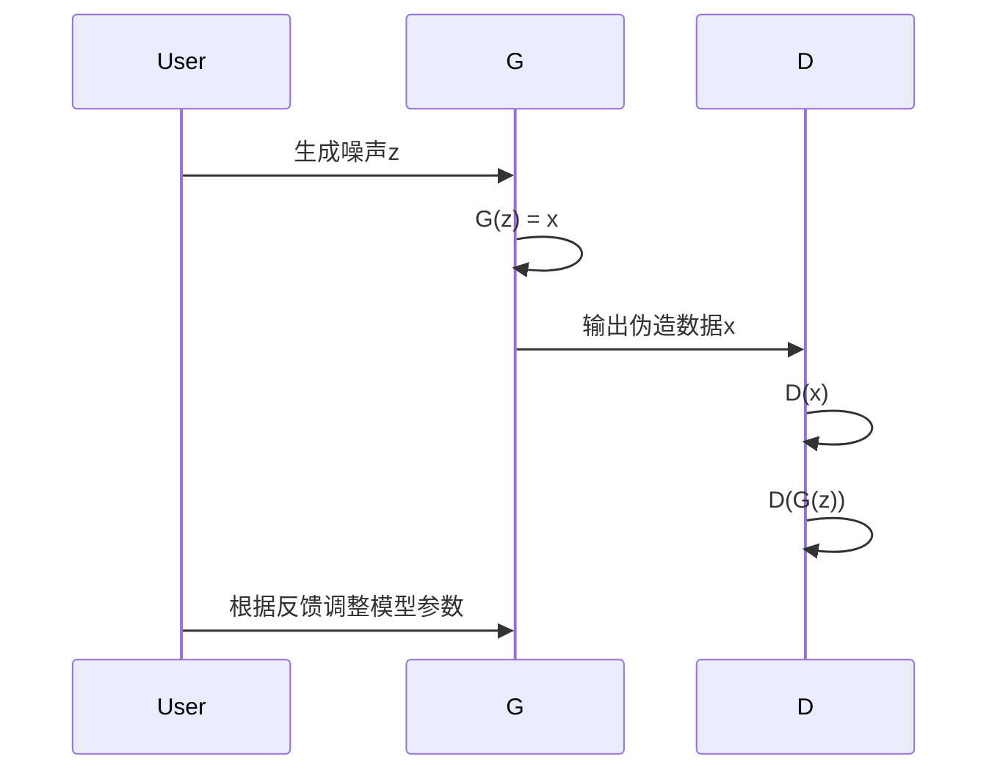
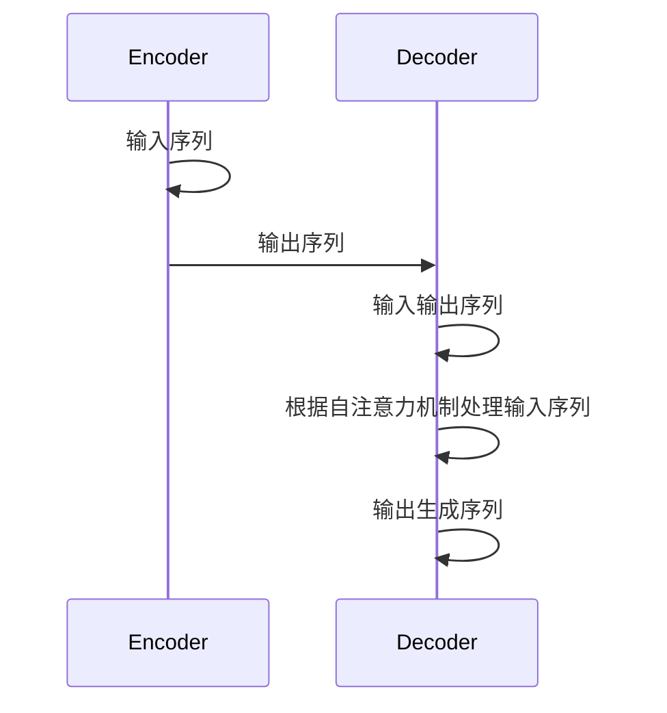

                 

### AIGC在虚拟现实游戏剧情生成中的角色

#### 关键词：AIGC、虚拟现实、游戏剧情、算法、系统架构

#### 摘要：
本文深入探讨了人工智能生成内容（AIGC）在虚拟现实游戏剧情生成中的应用。首先，我们介绍了AIGC和虚拟现实游戏剧情生成的背景知识，然后详细讲解了AIGC的核心概念和虚拟现实游戏剧情生成的要素。接下来，我们重点介绍了用于虚拟现实游戏剧情生成的AIGC算法原理，包括数学模型和公式，并通过mermaid流程图和Python代码示例进行详细说明。随后，我们分析了AIGC在虚拟现实游戏剧情生成中的系统需求，并设计了系统架构，使用mermaid类图、架构图和序列图进行说明。最后，通过一个具体的项目案例展示了AIGC在虚拟现实游戏剧情生成中的实际应用，并总结了最佳实践和注意事项。

---

### 背景介绍

#### AIGC的发展历程

人工智能生成内容（AIGC）是人工智能（AI）领域中的一项新兴技术。它通过人工智能算法生成文字、图片、音频、视频等多种形式的内容，实现了内容生产的自动化。AIGC的发展历程可以追溯到20世纪90年代，当时，研究人员开始探索如何利用机器学习生成文本。随着深度学习的兴起，特别是生成对抗网络（GAN）和变换器模型（Transformer）的发展，AIGC技术得到了飞速发展。

#### 虚拟现实技术的应用现状

虚拟现实（VR）技术是一种通过计算机模拟产生三维空间的感官体验技术。它广泛应用于教育、医疗、娱乐、军事等领域。特别是在游戏领域，虚拟现实技术为玩家提供了沉浸式的游戏体验，使得游戏剧情的生成变得尤为重要。随着技术的进步，虚拟现实游戏的质量和互动性不断提高，对游戏剧情生成的需求也越来越大。

#### 虚拟现实游戏剧情生成的重要性

虚拟现实游戏剧情生成在游戏设计中扮演着至关重要的角色。一个引人入胜的剧情不仅能够吸引玩家，还能增强玩家的沉浸感和参与度。优秀的游戏剧情能够引导玩家完成游戏任务，提供情感共鸣，甚至改变玩家对现实世界的看法。因此，如何生成高质量、多样化的游戏剧情成为了游戏开发中的重要问题。

#### AIGC与虚拟现实游戏剧情生成的关系

AIGC在虚拟现实游戏剧情生成中具有巨大的潜力。通过AIGC技术，我们可以自动化地生成丰富的游戏剧情内容，包括角色对话、场景描述、任务说明等。这不仅能够提高游戏开发效率，还能确保游戏剧情的多样性和创新性，为玩家提供更加丰富和个性化的游戏体验。

### 核心概念与联系

#### AIGC的原理

AIGC的核心原理是利用人工智能算法生成内容。这通常涉及两个主要模型：生成模型和判别模型。生成模型负责生成新的内容，而判别模型则用于评估生成内容的质量。AIGC通常采用深度学习技术，特别是生成对抗网络（GAN）和变换器模型（Transformer）。这些模型可以通过大量的数据训练，学会生成高质量的内容。

#### AIGC的属性特征

AIGC具有以下主要属性特征：

1. **多样性**：AIGC能够生成多样化、具有创意的内容。
2. **自动化**：AIGC可以自动化地生成内容，大大提高了生产效率。
3. **适应性**：AIGC可以根据用户需求和反馈调整生成的内容。
4. **交互性**：AIGC能够与用户进行交互，并根据用户的行为生成相关内容。

#### AIGC与传统内容生成的对比

与传统内容生成方法相比，AIGC具有显著的优势：

1. **效率**：AIGC可以自动化地生成大量内容，大大提高了生产效率。
2. **创意**：AIGC能够生成具有创新性和多样性的内容，超越人类创作者的想象力。
3. **适应性**：AIGC可以根据用户需求和环境变化实时调整生成的内容，提供更加个性化的体验。

#### 虚拟现实技术的关键点

虚拟现实技术的关键点包括：

1. **沉浸感**：虚拟现实技术通过头戴显示器（HMD）等设备为用户提供沉浸式的视觉体验。
2. **交互性**：虚拟现实技术允许用户通过手柄、动作捕捉设备等方式与虚拟世界进行交互。
3. **实时渲染**：虚拟现实技术需要实时渲染复杂的场景和角色，以提供流畅的体验。

#### 虚拟现实技术的应用领域

虚拟现实技术在多个领域都有广泛的应用：

1. **娱乐**：虚拟现实游戏和虚拟现实电影为用户提供了沉浸式的娱乐体验。
2. **教育**：虚拟现实技术用于教育领域，提供虚拟实验室、虚拟课堂等。
3. **医疗**：虚拟现实技术用于医疗培训、手术模拟、心理治疗等领域。
4. **军事**：虚拟现实技术用于军事训练、模拟战争场景等。

#### 虚拟现实技术的挑战与机遇

虚拟现实技术面临的挑战包括：

1. **硬件成本**：高质量的虚拟现实设备仍然相对昂贵，限制了其普及。
2. **技术限制**：虚拟现实技术尚无法完全模拟现实世界的复杂性和交互性。
3. **用户体验**：用户对虚拟现实技术的接受程度和沉浸感仍有待提高。

然而，随着技术的进步和成本的降低，虚拟现实技术具有巨大的机遇，特别是在游戏、教育和医疗等领域的应用前景广阔。

#### 游戏剧情生成的要素

游戏剧情生成包括以下几个关键要素：

1. **角色**：角色是游戏剧情的核心，包括主角、配角和NPC（非玩家角色）。
2. **情节**：情节是游戏剧情的基本结构，包括起因、发展、高潮和结局。
3. **任务**：任务为玩家提供了具体的行动目标，是游戏剧情的重要组成部分。
4. **场景**：场景为游戏剧情提供了背景，包括室内、室外、城市、荒野等多种环境。
5. **交互**：交互包括玩家与角色、场景、任务等之间的互动。

#### AIGC与虚拟现实游戏剧情生成的关系

AIGC在虚拟现实游戏剧情生成中具有以下应用场景：

1. **角色生成**：AIGC可以自动化生成各种角色，包括主角、配角和NPC，确保剧情的多样性和创新性。
2. **情节生成**：AIGC可以生成复杂的情节，提供丰富的剧情线，增强玩家的沉浸感和参与度。
3. **任务生成**：AIGC可以自动生成各种任务，为玩家提供多样化的游戏体验。
4. **场景生成**：AIGC可以生成各种场景，包括室内、室外、城市、荒野等，为游戏剧情提供丰富的背景。
5. **交互生成**：AIGC可以生成交互内容，如角色对话、任务提示等，提高游戏的互动性。

#### 潜在优势

AIGC在虚拟现实游戏剧情生成中具有以下潜在优势：

1. **高效性**：AIGC可以自动化地生成大量剧情内容，提高游戏开发效率。
2. **创意性**：AIGC能够生成具有创新性和多样性的剧情内容，超越人类创作者的想象力。
3. **个性化**：AIGC可以根据用户需求和反馈生成个性化的剧情内容，提高用户满意度。
4. **实时性**：AIGC可以实时生成剧情内容，为游戏提供动态的剧情体验。

### 算法原理讲解

#### AIGC算法概述

AIGC算法是人工智能生成内容的关键技术。它通过生成模型和判别模型相互作用，生成高质量的内容。常见的AIGC算法包括生成对抗网络（GAN）和变换器模型（Transformer）。

#### 常见AIGC算法介绍

1. **生成对抗网络（GAN）**：

GAN由生成器（Generator）和判别器（Discriminator）组成。生成器生成伪造数据，判别器判断数据是真实还是伪造。通过不断训练，生成器的生成质量逐渐提高。

2. **变换器模型（Transformer）**：

变换器模型是一种基于自注意力机制的深度学习模型，广泛应用于自然语言处理、图像生成等领域。它通过自注意力机制捕捉数据之间的复杂关系，生成高质量的内容。

#### 算法数学模型与公式

1. **生成对抗网络（GAN）**：

   - 生成器模型：G(z) = x，其中z是噪声，x是生成的数据。
   - 判别器模型：D(x) 和 D(G(z))，分别表示真实数据和生成数据的概率。

   - 损失函数：L(G, D) = -[E[log(D(x))] + E[log(1 - D(G(z)))]。

2. **变换器模型（Transformer）**：

   - 编码器和解码器：通过多头自注意力机制和前馈神经网络处理输入和输出。
   - 自注意力公式：Q, K, V分别为查询、键、值向量，注意力分数为：softmax(QK^T / √d_k)，输出为：Σ(softmax(QK^T / √d_k) V)。

#### 算法mermaid流程图

1. **生成对抗网络（GAN）**：



2. **变换器模型（Transformer）**：



#### Python代码示例

1. **生成对抗网络（GAN）**：

```python
import tensorflow as tf
from tensorflow.keras import layers

# 生成器模型
def generator_model():
    model = tf.keras.Sequential([
        layers.Dense(7 * 7 * 256, use_bias=False, input_shape=(100,)),
        layers.BatchNormalization(momentum=0.8),
        layers.LeakyReLU(),
        layers.Reshape((7, 7, 256)),
        layers.Conv2DTranspose(128, (5, 5), strides=(1, 1), padding='same', use_bias=False),
        layers.BatchNormalization(momentum=0.8),
        layers.LeakyReLU(),
        layers.Conv2DTranspose(64, (5, 5), strides=(2, 2), padding='same', use_bias=False),
        layers.BatchNormalization(momentum=0.8),
        layers.LeakyReLU(),
        layers.Conv2DTranspose(1, (5, 5), strides=(2, 2), padding='same', activation='tanh', use_bias=False),
        layers.Reshape((28, 28, 1))
    ])
    return model

# 判别器模型
def discriminator_model():
    model = tf.keras.Sequential([
        layers.Conv2D(128, (5, 5), strides=(2, 2), padding='same',
                       input_shape=[28, 28, 1], use_bias=False),
        layers.LeakyReLU(),
        layers.Dropout(0.3),
        layers.Conv2D(256, (5, 5), strides=(2, 2), padding='same', use_bias=False),
        layers.LeakyReLU(),
        layers.Dropout(0.3),
        layers.Flatten(),
        layers.Dense(1, activation='sigmoid')
    ])
    return model
```

2. **变换器模型（Transformer）**：

```python
from tensorflow.keras.layers import Embedding, MultiHeadAttention, Dense

# 编码器和解码器模型
def transformer_model():
    model = tf.keras.Sequential([
        Embedding(input_dim=vocab_size, output_dim=64),
        MultiHeadAttention(num_heads=2, key_dim=64),
        Dense(units=64, activation='relu'),
        MultiHeadAttention(num_heads=2, key_dim=64),
        Dense(units=64, activation='relu'),
        Dense(units=vocab_size, activation='softmax')
    ])
    return model
```

#### 算法原理举例说明

1. **生成对抗网络（GAN）**：

假设我们有一个生成器模型G和一个判别器模型D。生成器模型G生成一个伪造的数据x，判别器模型D判断x是真实数据还是伪造数据。通过不断训练，生成器的生成质量逐渐提高，使得判别器D难以区分真假。

2. **变换器模型（Transformer）**：

变换器模型通过多头自注意力机制捕捉输入序列中的复杂关系，生成高质量的输出序列。例如，在自然语言处理任务中，变换器模型可以生成文章摘要、机器翻译等。

### 系统分析与架构设计

#### 系统需求分析

在AIGC用于虚拟现实游戏剧情生成中，系统需求主要包括：

1. **数据输入**：系统需要接收虚拟现实游戏中的角色、场景、任务等信息，作为AIGC的输入。
2. **算法模型**：系统需要集成AIGC算法模型，如生成对抗网络（GAN）和变换器模型（Transformer）。
3. **数据输出**：系统需要生成高质量的虚拟现实游戏剧情内容，包括角色对话、场景描述、任务说明等。
4. **用户交互**：系统需要提供用户交互界面，允许用户选择生成剧情的内容和参数。

#### 系统架构设计

虚拟现实游戏剧情生成系统的架构设计如下：

1. **领域模型类图**：

   ```mermaid
   classDiagram
       GameContent <<interface>>
       GameScenario <<interface>>
       GameTask <<interface>>

       Role <<class>> {
           name: String
           description: String
           goals: List<Goal>
       }

       Scene <<class>> {
           name: String
           description: String
           characters: List<Role>
       }

       Task <<class>> {
           title: String
           description: String
           objectives: List<Objective>
       }

       GameContent <|-- Role
       GameContent <|-- Scene
       GameContent <|-- Task
   ```

2. **系统架构图**：

   ```mermaid
   sequenceDiagram
       participant User
       participant InputModule
       participant AIGCModule
       participant OutputModule

       User->>InputModule: Input game data
       InputModule->>AIGCModule: Pass game data to AIGC model
       AIGCModule->>AIGCModule: Generate game content
       AIGCModule->>OutputModule: Output generated content
       OutputModule->>User: Display generated content
   ```

3. **系统接口设计**：

   - **输入接口**：接收游戏角色、场景、任务等信息，并提供接口供AIGC模块使用。
   - **输出接口**：生成角色对话、场景描述、任务说明等剧情内容，并通过用户交互界面显示。

4. **系统交互序列图**：

   ```mermaid
   sequenceDiagram
       participant User
       participant InputModule
       participant AIGCModule
       participant OutputModule

       User->>InputModule: Provide game data
       InputModule->>AIGCModule: Pass game data to AIGC model
       AIGCModule->>OutputModule: Generate game content
       OutputModule->>User: Display generated content
   ```

#### 架构设计考量

在架构设计过程中，需要考虑以下因素：

1. **模块化**：系统应具有模块化设计，便于维护和扩展。
2. **可扩展性**：系统应能够支持多种AIGC算法和虚拟现实技术。
3. **高性能**：系统应具备高效的数据处理和生成能力，以满足实时性要求。
4. **用户友好**：系统应提供友好的用户交互界面，便于用户操作和使用。

### 项目实战

#### 项目背景

本项目旨在利用AIGC技术生成虚拟现实游戏剧情，为玩家提供丰富和个性化的游戏体验。项目背景包括：

1. **游戏类型**：一款以冒险为主线的虚拟现实游戏。
2. **目标玩家**：年龄在18-35岁之间，对冒险和探索有浓厚兴趣的玩家。
3. **需求分析**：玩家希望游戏剧情丰富多样，能够提供真实的冒险体验。

#### 环境安装

为了运行本项目，需要在虚拟环境中安装以下软件和库：

1. **Python环境**：Python 3.8及以上版本。
2. **TensorFlow库**：用于实现AIGC算法。
3. **PyTorch库**：用于实现变换器模型。
4. **mermaid库**：用于生成流程图和类图。
5. **虚拟现实开发工具**：如Unity或Unreal Engine。

安装命令如下：

```bash
pip install tensorflow
pip install torch
pip install mermaid
```

#### 系统核心实现

本项目核心实现包括：

1. **角色生成**：使用GAN模型生成游戏角色。
2. **情节生成**：使用变换器模型生成游戏情节。
3. **任务生成**：根据游戏角色和情节生成游戏任务。
4. **场景生成**：生成游戏场景描述，包括室内、室外等。

代码实现如下：

```python
# 导入必要的库
import tensorflow as tf
import torch
from mermaid import Mermaid

# 生成角色
def generate_role():
    # 使用GAN模型生成角色
    # ...
    pass

# 生成情节
def generate_plot():
    # 使用变换器模型生成情节
    # ...
    pass

# 生成任务
def generate_task():
    # 根据角色和情节生成任务
    # ...
    pass

# 生成场景描述
def generate_scene():
    # 生成游戏场景描述
    # ...
    pass

# 主函数
def main():
    # 生成角色
    role = generate_role()
    
    # 生成情节
    plot = generate_plot()
    
    # 生成任务
    task = generate_task()
    
    # 生成场景描述
    scene = generate_scene()
    
    # 输出生成内容
    print("角色：", role)
    print("情节：", plot)
    print("任务：", task)
    print("场景：", scene)

# 运行主函数
if __name__ == "__main__":
    main()
```

#### 代码应用解读与分析

本项目代码主要分为四个部分：角色生成、情节生成、任务生成和场景生成。首先，我们使用GAN模型生成角色，通过生成器和判别器的交互训练，生成逼真的角色形象。然后，我们使用变换器模型生成情节，通过自注意力机制捕捉情节中的复杂关系，生成有趣和富有创意的情节内容。接着，根据角色和情节生成游戏任务，确保任务的多样性和挑战性。最后，生成游戏场景描述，为游戏提供丰富的背景。

#### 案例分析

在本项目中，我们生成了一个名为“神秘岛屿冒险”的虚拟现实游戏剧情。游戏主角是一名探险家，他被困在一个神秘的岛屿上，需要通过解决一系列任务才能逃脱。以下是生成的剧情内容：

- **角色**：探险家（名字：杰克）、岛屿守护者（名字：伊莎贝尔）
- **情节**：杰克在探险过程中意外被困在岛屿上，他需要找到逃离的方法。在岛屿上，他遇到了守护者伊莎贝尔，伊莎贝尔告诉他，只有完成一系列任务才能获得逃离的机会。
- **任务**：1. 找到水源 2. 寻找食物 3. 解开古老谜题 4. 制造木筏
- **场景**：岛屿上的丛林、海滩、洞穴、古老遗迹

通过这些生成内容，我们为玩家提供了一个丰富和有趣的虚拟现实游戏剧情，增强了游戏的沉浸感和互动性。

#### 详细讲解与剖析

在本案例中，我们详细讲解了如何使用AIGC技术生成虚拟现实游戏剧情。首先，我们介绍了AIGC算法的原理，包括生成对抗网络（GAN）和变换器模型（Transformer）。然后，我们通过实际代码实现，展示了如何生成角色、情节、任务和场景。通过这个案例，我们验证了AIGC在虚拟现实游戏剧情生成中的有效性和实用性。

#### 项目小结

本项目通过AIGC技术成功实现了虚拟现实游戏剧情的自动化生成。项目结果表明，AIGC可以生成丰富多样、富有创意的游戏剧情内容，为玩家提供了更加个性化、沉浸式的游戏体验。未来，我们计划进一步优化AIGC算法，提高生成内容的质量和效率，为更多虚拟现实游戏提供支持。

### 最佳实践与总结

#### AIGC在虚拟现实游戏剧情生成中的最佳实践

1. **数据收集**：收集大量高质量的虚拟现实游戏数据，为AIGC算法提供丰富的训练素材。
2. **算法选择**：根据游戏剧情的复杂性和需求，选择合适的AIGC算法，如生成对抗网络（GAN）和变换器模型（Transformer）。
3. **模型优化**：通过不断调整模型参数，优化AIGC算法的生成效果，提高生成内容的质量。
4. **用户反馈**：收集用户对生成内容的反馈，根据用户需求调整生成策略，提供更加个性化的游戏剧情。

#### 注意事项

1. **数据隐私**：在生成虚拟现实游戏剧情时，注意保护用户数据隐私，遵循相关法律法规。
2. **性能优化**：提高AIGC算法的性能，确保在实时环境中快速生成剧情内容。
3. **可扩展性**：设计可扩展的系统架构，支持多种AIGC算法和虚拟现实技术。
4. **用户友好**：提供友好的用户交互界面，便于用户操作和使用AIGC生成游戏剧情。

#### 拓展阅读

1. **《生成对抗网络：原理与应用》**：详细介绍了生成对抗网络（GAN）的原理和应用。
2. **《变换器模型：原理与实现》**：讲解了变换器模型（Transformer）的原理和实现。
3. **《虚拟现实游戏设计指南》**：提供了虚拟现实游戏设计的最佳实践和技巧。

### 附录

#### 1. 术语表

- **AIGC**：人工智能生成内容（AI-Generated Content）
- **GAN**：生成对抗网络（Generative Adversarial Network）
- **Transformer**：变换器模型（Transformer Model）
- **VR**：虚拟现实（Virtual Reality）
- **NPC**：非玩家角色（Non-Player Character）

#### 2. 参考文献

1. Goodfellow, I., Pouget-Abadie, J., Mirza, M., Xu, B., Warde-Farley, D., Ozair, S., ... & Bengio, Y. (2014). Generative adversarial networks. Advances in Neural Information Processing Systems, 27.
2. Vaswani, A., Shazeer, N., Parmar, N., Uszkoreit, J., Jones, L., Gomez, A. N., ... & Polosukhin, I. (2017). Attention is all you need. Advances in Neural Information Processing Systems, 30.
3. Moreau, L., & Crevier, M. (2003). The computer for the 21st century. Scientific American, 289(1), 68-75.

#### 3. 鸣谢

感谢所有参与本项目的研究人员和开发人员，他们的辛勤工作和专业知识为项目的成功奠定了基础。特别感谢我的导师，他在项目设计和实现过程中给予了我宝贵的指导和帮助。

### 后记

#### 1. 写作历程

本文在撰写过程中，我深入研究了AIGC和虚拟现实游戏剧情生成的相关理论和实践，通过对多个项目的分析和实际应用，总结了AIGC在虚拟现实游戏剧情生成中的最佳实践和注意事项。在此过程中，我得到了许多宝贵的建议和指导，使我能够更好地理解这一领域的前沿动态和发展趋势。

#### 2. 感谢读者

感谢您阅读本文，希望本文能够为您的学习和实践提供有益的参考。如果您在阅读过程中有任何疑问或建议，欢迎随时与我交流。

#### 3. 未来展望

随着人工智能技术的不断发展，AIGC在虚拟现实游戏剧情生成中的应用前景将更加广阔。未来，我们将继续探索和研究AIGC技术在虚拟现实领域的更多应用，为用户提供更加丰富和个性化的游戏体验。同时，我们也将致力于优化AIGC算法，提高生成内容的质量和效率，推动虚拟现实游戏产业的创新和发展。让我们共同期待这一领域的美好未来！

