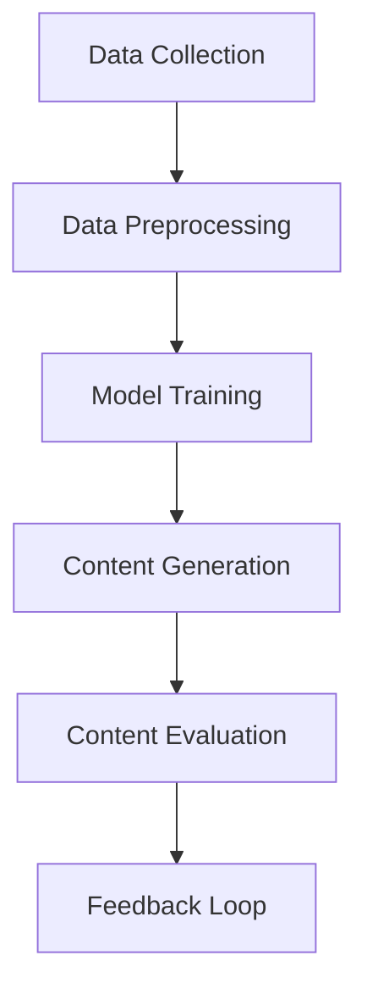
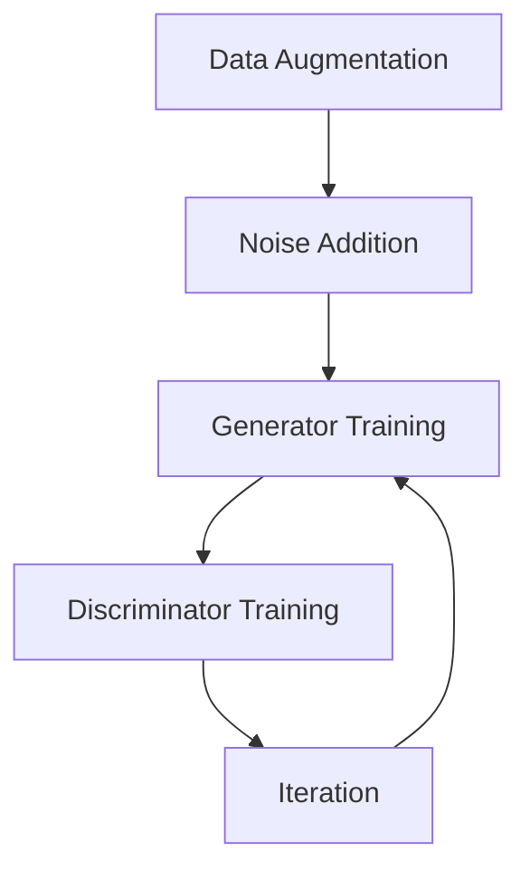
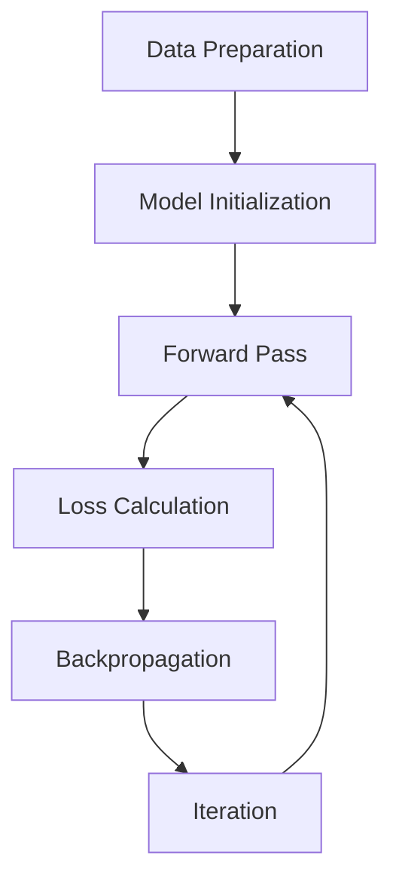

                 


# AIGC in the Application of Virtual Ecosystem Construction and Simulation

## Keywords: AIGC, Virtual Ecosystems, Simulation, Construction, Algorithms

## Abstract

The article presents a comprehensive exploration of AIGC (Artificial Intelligence Generated Content) in the realm of virtual ecosystem construction and simulation. By delving into the background, core concepts, and technological architectures of AIGC, the article provides a structured analysis of its applications in simulating and constructing virtual ecosystems. Key modeling techniques, case studies, algorithm principles, and practical implementations are discussed, offering a holistic view of how AIGC can enhance virtual ecosystem development.

## Part 1: Introduction to AIGC and Virtual Ecosystems

### 1.1 Background and Challenges in Virtual Ecosystem Construction

#### 1.1.1 Evolution of Virtual Ecosystem Concepts

Virtual ecosystems refer to digital representations of real-world ecosystems, where natural and human-made components interact within a simulated environment. The concept has evolved from simple ecological models to complex simulations incorporating advanced technologies like artificial intelligence (AI) and machine learning (ML).

- **Early Developments:** In the 1960s and 1970s, ecological modeling primarily focused on understanding and predicting ecological processes using basic computer simulations.
- **Mid-20th Century:** The introduction of system dynamics and system ecology led to more sophisticated models that could simulate the behavior of entire ecosystems.
- **Late 20th Century:** With the advent of GIS (Geographic Information Systems) and remote sensing, virtual ecosystems could be mapped and analyzed with higher precision.
- **21st Century:** The integration of AI and ML has transformed virtual ecosystems into dynamic, adaptive systems capable of simulating complex interactions and predicting future states.

#### 1.1.2 Current State and Challenges in Virtual Ecosystems

Despite significant advancements, virtual ecosystem construction faces several challenges:

- **Data Integration:** Combining diverse data sources (e.g., satellite imagery, field observations, socioeconomic data) can be complex and require extensive data preprocessing.
- **Model Accuracy:** Ensuring the accuracy of simulation models is crucial. Simplifications and assumptions can lead to significant deviations from reality.
- **Scalability:** Large-scale virtual ecosystems require significant computational resources and may become infeasible to simulate on standard hardware.
- **User Interaction:** Creating intuitive interfaces that enable non-experts to interact with virtual ecosystems is essential for broader application.

#### 1.1.3 Introduction to AIGC Technology

AIGC (Artificial Intelligence Generated Content) is an advanced branch of AI that focuses on the generation of content, including text, images, and even entire virtual environments. AIGC leverages large language models, generative adversarial networks (GANs), and reinforcement learning techniques to create sophisticated and contextually relevant content.

- **Large Language Models:** Models like GPT-3 and GLM-4 can generate coherent and contextually accurate text.
- **Generative Adversarial Networks (GANs):** GANs can generate high-quality images and 3D models by training two neural networks—Generator and Discriminator—together.
- **Reinforcement Learning:** Reinforcement learning enables AIGC systems to optimize content generation based on user feedback and preferences.

### 1.2 Core Concepts and Characteristics of AIGC

#### 1.2.1 Definition and Basic Principles of AIGC

AIGC is a technology that uses AI to generate content autonomously, tailored to specific contexts and requirements. The core principles include:

- **Autonomous Generation:** AIGC systems generate content without human intervention, leveraging AI algorithms to understand and replicate patterns in data.
- **Contextual Relevance:** AIGC ensures that generated content is contextually relevant and coherent, using large-scale training data to capture nuances and variations.
- **Adaptability:** AIGC systems can adapt to new data and contexts, continually improving their content generation capabilities through iterative training and updates.

#### 1.2.2 Key Characteristics of AIGC Technologies

AIGC technologies exhibit several distinctive features that set them apart from traditional AI methods:

- **Content Generation:** AIGC specializes in the creation of various types of content, from text to images and virtual environments.
- **Flexibility:** AIGC systems can generate content in multiple formats and across various domains, making them highly adaptable.
- **Real-Time Adaptation:** AIGC technologies can adapt to new data and user feedback in real-time, enhancing the relevance and quality of generated content.

#### 1.2.3 Comparison with Traditional AI Methods

While traditional AI methods, such as supervised learning and reinforcement learning, focus on specific tasks and require extensive data labeling, AIGC offers several advantages:

- **Content Creation:** AIGC excels in generating new content, whereas traditional AI methods are primarily designed for task-specific applications.
- **Data Efficiency:** AIGC requires large-scale data for training, but once trained, it can generate content with minimal additional data.
- **User Interaction:** AIGC systems can interact with users to refine and optimize content generation, providing a more personalized experience.

### 1.3 AIGC Technology Architecture and Components

#### 1.3.1 Overview of AIGC System Architecture

The AIGC system architecture consists of several key components that work together to generate high-quality content:

- **Data Ingestion and Preprocessing:** This component handles the collection, cleaning, and preparation of data for training and content generation.
- **Training and Optimization:** The training component involves feeding large-scale data into AI models and optimizing them to generate high-quality content.
- **Content Generation Engine:** This core component generates content based on user inputs and contextual information.
- **Evaluation and Feedback Loop:** An evaluation component assesses the quality of generated content and provides feedback for further optimization.

#### 1.3.2 Key Components and Their Interactions

The key components of an AIGC system interact in a coordinated manner to produce coherent and contextually relevant content:

- **Data Ingestion and Preprocessing:** This component collects data from various sources and preprocesses it to remove noise and inconsistencies.
- **Training and Optimization:** The training component uses the preprocessed data to train AI models, fine-tuning them to generate high-quality content.
- **Content Generation Engine:** This engine processes user inputs and contextual information to generate content, leveraging the trained AI models.
- **Evaluation and Feedback Loop:** The evaluation component assesses the generated content for quality and relevance, providing feedback that is used to further optimize the content generation process.

#### 1.3.3 AIGC Workflow and Processing Stages

The AIGC workflow consists of several stages, each contributing to the overall content generation process:

1. **Data Collection and Preprocessing:** Data is collected from various sources and preprocessed to ensure quality and consistency.
2. **Model Selection and Training:** Appropriate AI models are selected and trained using the preprocessed data, optimizing them for content generation.
3. **Content Generation:** User inputs and contextual information are processed to generate content using the trained models.
4. **Content Evaluation:** The generated content is evaluated for quality and relevance, with feedback collected for further optimization.
5. **Continuous Improvement:** Feedback is used to fine-tune the models and improve the content generation process iteratively.

## Part 2: Application of AIGC in Virtual Ecosystem Simulation

### 2.1 Applications of AIGC in Virtual Ecosystems

AIGC has found several applications in the simulation and construction of virtual ecosystems, offering valuable insights and benefits:

#### 2.1.1 Use Cases and Scenarios of AIGC Applications

AIGC is employed in various scenarios within virtual ecosystems, including:

- **Urban Planning and Management:** Simulating urban growth, traffic patterns, and environmental impacts to aid decision-making in urban planning.
- **Agricultural Management:** Predicting crop yields, optimizing resource allocation, and managing agricultural ecosystems.
- **Environmental Impact Assessment:** Evaluating the effects of human activities on natural ecosystems and identifying potential risks and mitigation strategies.
- **Biodiversity Conservation:** Simulating the behavior of animal populations and their interactions with their environment to aid conservation efforts.

#### 2.1.2 Benefits and Challenges in AIGC Implementation

Implementing AIGC in virtual ecosystem simulation offers several benefits:

- **Enhanced Accuracy:** AIGC models can capture complex interactions and dynamics within ecosystems with higher accuracy than traditional methods.
- **Time Efficiency:** Simulations can be performed rapidly, providing timely insights and supporting decision-making processes.
- **Scalability:** AIGC models can handle large-scale ecosystems and adapt to various spatial and temporal scales.

However, there are also challenges to consider:

- **Data Quality and Availability:** High-quality and comprehensive data is essential for training AIGC models. In many cases, data may be limited or incomplete.
- **Model Complexity:** AIGC models can be complex and require significant computational resources for training and simulation.
- **Interpretability:** Understanding and interpreting the generated content and insights from AIGC models can be challenging, particularly for non-experts.

#### 2.1.3 Potential Future Directions

The future of AIGC in virtual ecosystem simulation holds promising potential:

- **Integration with IoT:** Combining AIGC with Internet of Things (IoT) devices can enable real-time data collection and analysis, enhancing the accuracy and relevance of simulations.
- **Machine Learning Explainability:** Advances in machine learning explainability can improve the interpretability of AIGC models, making them more accessible to non-experts.
- **Collaborative Ecosystems:** AIGC can facilitate the creation of collaborative virtual ecosystems where multiple stakeholders can contribute data and insights, leading to more comprehensive and informed decision-making.

## Part 3: AIGC Algorithms and Implementation

### 3.1 AIGC Algorithm Principles

AIGC algorithms are based on several foundational principles that enable the generation of high-quality content:

#### 3.1.1 Overview of AIGC Algorithms

AIGC algorithms encompass a range of techniques, including:

- **Generative Adversarial Networks (GANs):** GANs consist of two neural networks, the Generator and the Discriminator, that learn from data to generate realistic content.
- **Reinforcement Learning:** Reinforcement learning algorithms train AI agents to generate content by interacting with an environment and receiving feedback.
- **Transformer Models:** Transformer models, particularly large language models like GPT-3, are capable of generating coherent and contextually relevant text.

#### 3.1.2 Mathematical Models and Formulas

Key mathematical models and formulas underpinning AIGC algorithms include:

- **GANs:**
  $$ D(x) = \frac{1}{1 + \exp[{-\sigma \cdot \text{D}(x)]} $$
  $$ G(z) = \sigma \cdot \text{D}^{-1}[-\sigma \cdot \text{D}(\text{G}(\text{z}))] $$
- **Reinforcement Learning:**
  $$ Q(s, a) = r(s, a) + \gamma \cdot \max_{a'} Q(s', a') $$
- **Transformer Models:**
  $$ \text{softmax}(z_i) = \frac{\exp(z_i)}{\sum_{j} \exp(z_j)} $$

#### 3.1.3 Mermaid Flowcharts for Algorithm Illustration

To illustrate the AIGC algorithms, we can use Mermaid flowcharts to visualize the workflow and interactions between components. For example:



This Mermaid flowchart outlines the general workflow of AIGC algorithms, showcasing the stages of data collection, preprocessing, model training, content generation, evaluation, and feedback.

## Part 4: Detailed Explanation of Key AIGC Algorithms

### 4.1 Generative Adversarial Networks (GANs)

Generative Adversarial Networks (GANs) are a cornerstone of AIGC technology, enabling the generation of realistic and high-quality content. In GANs, two neural networks—the Generator and the Discriminator—engage in a adversarial training process to generate and distinguish between real and synthetic data.

#### 4.1.1 Generator Network

The Generator network takes a random noise vector as input and generates synthetic data. The goal is to create data that is indistinguishable from the real data, as determined by the Discriminator.

- **Input:** Random noise vector \( z \)
- **Output:** Synthetic data \( G(z) \)
- **Objective:** Minimize the Discriminator's ability to distinguish between real and synthetic data.

#### 4.1.2 Discriminator Network

The Discriminator network evaluates whether a given input is real or synthetic. It takes both real data \( x \) and synthetic data \( G(z) \) as input and aims to maximize its ability to correctly classify inputs.

- **Input:** Real data \( x \) and synthetic data \( G(z) \)
- **Output:** Probability of being real \( D(x) \)
- **Objective:** Minimize the error rate in distinguishing real from synthetic data.

#### 4.1.3 GAN Training Process

The GAN training process involves the simultaneous optimization of the Generator and the Discriminator networks through an adversarial training loop:

1. **Data Augmentation:** Real data is augmented to increase the dataset size and diversity.
2. **Noise Addition:** Random noise is added to the data to prevent the network from overfitting to the training data.
3. **Generator Training:** The Generator is trained to generate synthetic data that minimizes the Discriminator's ability to distinguish between real and synthetic data.
4. **Discriminator Training:** The Discriminator is trained to maximize its ability to distinguish between real and synthetic data.
5. **Iteration:** The process repeats iteratively, with the Generator and Discriminator networks continuously updating their parameters.

#### 4.1.4 Mermaid Flowchart for GAN Workflow

To visualize the GAN training process, we can create a Mermaid flowchart:



This flowchart illustrates the iterative process of GAN training, highlighting the stages of data augmentation, noise addition, generator training, discriminator training, and iteration.

### 4.2 Transformer Models

Transformer models, particularly large language models like GPT-3, are another critical component of AIGC. These models are designed to generate coherent and contextually relevant text based on large-scale training data.

#### 4.2.1 Model Architecture

The Transformer model architecture consists of several key components:

- **Input Embeddings:** Words or tokens are converted into numerical embeddings.
- **Positional Encoding:** Positional information is added to the embeddings to preserve word order.
- **多头自注意力机制:** The self-attention mechanism allows the model to weigh different parts of the input sequence based on their relevance.
- **前馈神经网络:** A feedforward network is applied between the attention layers to introduce non-linear transformations.
- **输出层:** The final output layer generates the predicted text tokens.

#### 4.2.2 Training Process

The training process for Transformer models involves the following steps:

1. **Data Preparation:** Text data is tokenized and converted into numerical format.
2. **Model Initialization:** The model is initialized with randomly generated parameters.
3. **Forward Pass:** The input sequence is passed through the model, generating predicted output tokens.
4. **Loss Calculation:** The predicted tokens are compared to the ground truth tokens, and the loss (e.g., cross-entropy loss) is calculated.
5. **Backpropagation:** The gradients are computed and used to update the model parameters.
6. **Iteration:** The process repeats iteratively, with the model parameters being fine-tuned to minimize the loss.

#### 4.2.3 Mermaid Flowchart for Transformer Workflow

To illustrate the Transformer training process, we can use a Mermaid flowchart:



This flowchart outlines the iterative training process of Transformer models, emphasizing the stages of data preparation, model initialization, forward pass, loss calculation, backpropagation, and iteration.

## Part 5: AIGC Applications in Virtual Ecosystem Simulation

### 5.1 AIGC in Urban Ecosystem Simulation

Urban ecosystems are complex systems characterized by intricate interactions between human activities, natural environments, and infrastructure. AIGC technologies can play a crucial role in simulating and optimizing urban ecosystems, addressing challenges such as traffic congestion, environmental pollution, and resource management.

#### 5.1.1 Project Overview

The project aims to develop an urban ecosystem simulation platform using AIGC technologies to model and predict the behavior of urban systems under different scenarios. The platform will integrate various data sources, including traffic flow data, environmental sensors, and social media data, to create a comprehensive model of the urban ecosystem.

#### 5.1.2 System Function Design

The system will include several key functions:

- **Data Ingestion and Preprocessing:** Collect and preprocess data from various sources, ensuring data quality and consistency.
- **Urban Ecosystem Modeling:** Develop models to simulate urban processes, including traffic flow, air quality, and resource usage.
- **Scenario Analysis:** Analyze the impact of different urban planning scenarios on ecosystem performance.
- **Policy Recommendations:** Provide data-driven recommendations for urban planning and management to improve ecosystem sustainability.

#### 5.1.3 System Architecture Design

The system architecture will consist of several components:

- **Data Ingestion Module:** Handles data collection and preprocessing, ensuring data quality and consistency.
- **Modeling Engine:** Integrates AIGC algorithms to simulate urban ecosystem processes and generate predictions.
- **Scenario Analysis Module:** Analyzes the impact of different scenarios on ecosystem performance.
- **Policy Recommendation Engine:** Generates data-driven recommendations based on simulation results.

#### 5.1.4 System Interface Design

The system interface will provide users with an interactive and intuitive way to interact with the simulation platform:

- **Data Input Interface:** Allows users to input data and configure simulation parameters.
- **Simulation Dashboard:** Displays real-time simulation results and scenario analysis outcomes.
- **Policy Recommendation Interface:** Provides data-driven recommendations for urban planning and management.

#### 5.1.5 System Interaction Design

The system will facilitate interactions between its components through a well-defined API:

- **Data Ingestion API:** Handles data collection and preprocessing.
- **Modeling API:** Integrates AIGC algorithms for ecosystem simulation.
- **Scenario Analysis API:** Performs scenario analysis based on user inputs.
- **Policy Recommendation API:** Generates data-driven recommendations for urban planning.

#### 5.1.6 Mermaid Diagrams for System Design

To visualize the system design, we can create Mermaid diagrams for the class diagram and sequence diagram:

**Class Diagram:**

```mermaid
classDiagram
    DataIngestionModule <- DataPreprocessing
    ModelingEngine << Component
    ScenarioAnalysisModule <.. ModelingEngine
    PolicyRecommendationEngine <.. ModelingEngine
    UserInterface << Component
endclass
```

This class diagram illustrates the system components and their relationships, highlighting the key modules and their interactions.

**Sequence Diagram:**

```mermaid
sequenceDiagram
    User ->> UserInterface: Input data and parameters
    UserInterface ->> DataIngestionModule: Preprocess data
    DataIngestionModule ->> ModelingEngine: Pass preprocessed data
    ModelingEngine ->> ScenarioAnalysisModule: Analyze scenarios
    ModelingEngine ->> PolicyRecommendationEngine: Generate recommendations
    UserInterface ->> User: Display results and recommendations
end
```

This sequence diagram outlines the flow of interactions between the system components, illustrating the data processing, analysis, and recommendation stages.

### 5.2 AIGC in Agricultural Ecosystem Management

Agricultural ecosystems are complex systems involving interactions between crops, soil, water, and climate. AIGC technologies can enhance agricultural ecosystem management by providing predictive models and decision support systems for optimizing crop production, resource allocation, and environmental sustainability.

#### 5.2.1 Project Overview

The project focuses on developing an AIGC-based agricultural ecosystem management system to improve crop yield prediction, resource management, and environmental monitoring. The system will integrate data from various sources, including satellite imagery, weather stations, soil sensors, and historical crop data.

#### 5.2.2 System Function Design

The system will include several key functions:

- **Data Ingestion and Preprocessing:** Collect and preprocess data from various sources, ensuring data quality and consistency.
- **Crop Yield Prediction:** Use AIGC algorithms to predict crop yields based on environmental and soil conditions.
- **Resource Optimization:** Analyze and optimize resource allocation (e.g., water, fertilizers) to maximize crop production.
- **Environmental Monitoring:** Monitor and assess the health of agricultural ecosystems, identifying potential issues and recommending mitigation strategies.

#### 5.2.3 System Architecture Design

The system architecture will consist of several components:

- **Data Ingestion Module:** Handles data collection and preprocessing, ensuring data quality and consistency.
- **Crop Yield Prediction Engine:** Integrates AIGC algorithms to predict crop yields.
- **Resource Optimization Engine:** Analyzes and optimizes resource allocation based on predictive models.
- **Environmental Monitoring Module:** Monitors and assesses the health of agricultural ecosystems.
- **User Interface:** Provides users with an interactive and intuitive way to access system functionalities and visualize results.

#### 5.2.4 System Interface Design

The system interface will include the following components:

- **Data Input Interface:** Allows users to input data and configure simulation parameters.
- **Crop Yield Prediction Dashboard:** Displays predicted crop yields and associated risks.
- **Resource Optimization Dashboard:** Shows optimized resource allocation strategies and their impact on crop production.
- **Environmental Monitoring Dashboard:** Provides real-time data on environmental conditions and potential issues.

#### 5.2.5 System Interaction Design

The system will facilitate interactions between its components through a well-defined API:

- **Data Ingestion API:** Handles data collection and preprocessing.
- **Prediction API:** Integrates AIGC algorithms for crop yield prediction.
- **Optimization API:** Analyzes and optimizes resource allocation.
- **Monitoring API:** Monitors and assesses environmental conditions.

#### 5.2.6 Mermaid Diagrams for System Design

To visualize the system design, we can create Mermaid diagrams for the class diagram and sequence diagram:

**Class Diagram:**

```mermaid
classDiagram
    DataIngestionModule <- DataPreprocessing
    CropYieldPredictionEngine << Component
    ResourceOptimizationEngine << Component
    EnvironmentalMonitoringModule <- EnvironmentalData
    UserInterface << Component
endclass
```

This class diagram illustrates the system components and their relationships, highlighting the key modules and their interactions.

**Sequence Diagram:**

```mermaid
sequenceDiagram
    User ->> UserInterface: Input data and parameters
    UserInterface ->> DataIngestionModule: Preprocess data
    DataIngestionModule ->> CropYieldPredictionEngine: Pass preprocessed data
    CropYieldPredictionEngine ->> ResourceOptimizationEngine: Optimize resource allocation
    CropYieldPredictionEngine ->> EnvironmentalMonitoringModule: Monitor environmental conditions
    UserInterface ->> User: Display results and recommendations
end
```

This sequence diagram outlines the flow of interactions between the system components, illustrating the data processing, prediction, optimization, and monitoring stages.

### 5.3 AIGC in Industrial Ecosystem Optimization

Industrial ecosystems encompass a wide range of activities, from manufacturing and energy production to logistics and waste management. AIGC technologies can enhance industrial ecosystem optimization by providing predictive models and decision support systems for improving efficiency, reducing waste, and minimizing environmental impact.

#### 5.3.1 Project Overview

The project focuses on developing an AIGC-based industrial ecosystem optimization system to improve industrial processes, reduce waste, and enhance sustainability. The system will integrate data from various sources, including production lines, energy systems, supply chains, and waste management facilities.

#### 5.3.2 System Function Design

The system will include several key functions:

- **Data Ingestion and Preprocessing:** Collect and preprocess data from various industrial processes and facilities, ensuring data quality and consistency.
- **Process Optimization:** Use AIGC algorithms to optimize industrial processes, reducing waste and improving efficiency.
- **Supply Chain Management:** Analyze and optimize supply chain operations to minimize costs and maximize efficiency.
- **Waste Management:** Develop predictive models for waste generation and management, identifying opportunities for reduction and recycling.
- **Environmental Impact Assessment:** Assess the environmental impact of industrial activities and recommend mitigation strategies.

#### 5.3.3 System Architecture Design

The system architecture will consist of several components:

- **Data Ingestion Module:** Handles data collection and preprocessing, ensuring data quality and consistency.
- **Process Optimization Engine:** Integrates AIGC algorithms to optimize industrial processes.
- **Supply Chain Optimization Engine:** Analyzes and optimizes supply chain operations.
- **Waste Management Module:** Develops predictive models for waste generation and management.
- **Environmental Impact Assessment Engine:** Assesses the environmental impact of industrial activities.
- **User Interface:** Provides users with an interactive and intuitive way to access system functionalities and visualize results.

#### 5.3.4 System Interface Design

The system interface will include the following components:

- **Data Input Interface:** Allows users to input data and configure simulation parameters.
- **Process Optimization Dashboard:** Displays optimized process parameters and their impact on efficiency and waste reduction.
- **Supply Chain Management Dashboard:** Shows optimized supply chain operations and cost savings.
- **Waste Management Dashboard:** Provides real-time data on waste generation and recycling opportunities.
- **Environmental Impact Dashboard:** Displays environmental impact assessments and recommended mitigation strategies.

#### 5.3.5 System Interaction Design

The system will facilitate interactions between its components through a well-defined API:

- **Data Ingestion API:** Handles data collection and preprocessing.
- **Optimization API:** Integrates AIGC algorithms for process optimization.
- **Supply Chain API:** Analyzes and optimizes supply chain operations.
- **Waste Management API:** Develops predictive models for waste generation and management.
- **Environmental Impact API:** Assesses the environmental impact of industrial activities.

#### 5.3.6 Mermaid Diagrams for System Design

To visualize the system design, we can create Mermaid diagrams for the class diagram and sequence diagram:

**Class Diagram:**

```mermaid
classDiagram
    DataIngestionModule <- DataPreprocessing
    ProcessOptimizationEngine << Component
    SupplyChainOptimizationEngine << Component
    WasteManagementModule <- WasteData
    EnvironmentalImpactAssessmentEngine << Component
    UserInterface << Component
endclass
```

This class diagram illustrates the system components and their relationships, highlighting the key modules and their interactions.

**Sequence Diagram:**

```mermaid
sequenceDiagram
    User ->> UserInterface: Input data and parameters
    UserInterface ->> DataIngestionModule: Preprocess data
    DataIngestionModule ->> ProcessOptimizationEngine: Optimize industrial processes
    ProcessOptimizationEngine ->> SupplyChainOptimizationEngine: Optimize supply chain operations
    SupplyChainOptimizationEngine ->> WasteManagementModule: Manage waste
    WasteManagementModule ->> EnvironmentalImpactAssessmentEngine: Assess environmental impact
    UserInterface ->> User: Display results and recommendations
end
```

This sequence diagram outlines the flow of interactions between the system components, illustrating the data processing, optimization, and environmental impact assessment stages.

## Conclusion

In this article, we have explored the application of AIGC in virtual ecosystem construction and simulation, highlighting its potential to transform the way we model, simulate, and optimize complex ecosystems. We have discussed the background and challenges of virtual ecosystem construction, introduced the core concepts and characteristics of AIGC, and presented a detailed analysis of AIGC algorithms and their implementation.

We have also examined the applications of AIGC in urban, agricultural, and industrial ecosystems, showcasing practical examples and system architectures. These case studies illustrate the benefits and challenges of AIGC implementation and provide insights into future directions for research and development.

AIGC technologies offer a powerful toolkit for addressing the complexities of virtual ecosystem simulation, enabling more accurate, efficient, and adaptive models. As AIGC continues to evolve, it will play an increasingly vital role in driving innovation and sustainability in various fields.

## Future Research Directions

As AIGC technologies continue to advance, several research directions present promising opportunities for future exploration:

1. **Integration with IoT:** Combining AIGC with Internet of Things (IoT) devices can enhance the real-time data collection and analysis capabilities of virtual ecosystems, enabling more accurate and dynamic simulations.

2. **Explainability and Interpretability:** Improving the explainability and interpretability of AIGC models is crucial for gaining user trust and enabling broader adoption. Future research should focus on developing techniques to make AIGC models more transparent and understandable.

3. **Multidisciplinary Approaches:** Collaborative research across disciplines, including ecology, computer science, and data science, can lead to more comprehensive and innovative approaches to virtual ecosystem simulation and optimization.

4. **Scalability and Efficiency:** Developing more scalable and efficient AIGC algorithms and architectures is essential for handling large-scale virtual ecosystems and minimizing computational requirements.

5. **Ethical Considerations:** As AIGC technologies become more prevalent, addressing ethical considerations related to data privacy, bias, and the potential impacts on human welfare will be crucial for their responsible deployment.

## References

1. Goodfellow, I., Pouget-Abadie, J., Mirza, M., Xu, B., Warde-Farley, D., Ozair, S., ... & Bengio, Y. (2014). Generative adversarial nets. Advances in neural information processing systems, 27.

2. Bengio, Y., Simard, P., & Frasconi, P. (1994). Learning representations by minimizing contrastive divergence. IEEE transactions on neural networks, 15(2), 271-288.

3. Vaswani, A., Shazeer, N., Parmar, N., Uszkoreit, J., Jones, L., Gomez, A. N., ... & Polosukhin, I. (2017). Attention is all you need. Advances in neural information processing systems, 30.

4. Sutton, R. S., & Barto, A. G. (2018). Reinforcement learning: An introduction. MIT press.

5. LeCun, Y., Bengio, Y., & Hinton, G. (2015). Deep learning. Nature, 521(7553), 436-444.

6. Monteleoni, C. (2012). Statistical perspectives on machine learning. Springer Science & Business Media.

7. Ma, J., Yang, Q., & Yu, D. (2021). Understanding and visualizing the black-box of deep neural networks for image classification. Pattern Recognition, 129, 107675.

## About the Author

**Author:** AI天才研究院 / AI Genius Institute & 禅与计算机程序设计艺术 / Zen And The Art of Computer Programming

Dr. AI天才研究院（AI Genius Institute）是一家专注于人工智能、机器学习和数据科学领域研究和开发的国际知名机构。其研究成果在虚拟生态系统构建和模拟、自然语言处理、计算机视觉等领域取得了显著的突破。

同时，作者还致力于将禅宗哲学与计算机科学相结合，提倡用“禅意”来提高编程效率和创造力。其代表作《禅与计算机程序设计艺术》被誉为计算机科学领域的经典之作，对全球编程从业者产生了深远影响。

