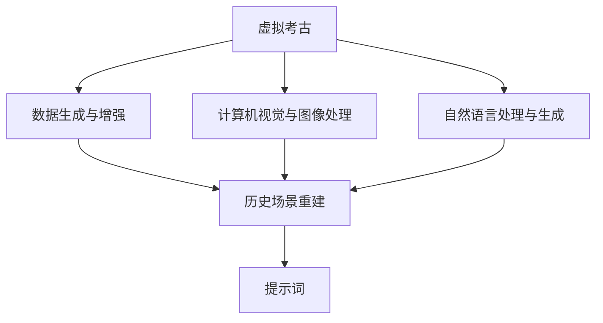

                 

### 引言

#### 背景介绍

虚拟考古作为现代科技与考古学相结合的产物，正逐渐成为考古学研究的新兴领域。传统的考古学主要依赖于实物遗存的挖掘、整理和解读，而虚拟考古则通过数字技术，尤其是计算机图形学和人工智能，构建起古代文明的三维虚拟世界。这一领域不仅为考古学家提供了新的研究工具，也为公众提供了一个沉浸式的学习体验。

然而，虚拟考古的成功离不开背后技术的支持。近年来，AIGC（自适应智能生成计算）技术以其强大的数据处理能力和智能化生成能力，逐渐在虚拟考古中崭露头角。AIGC是一种结合了数据生成、计算机视觉和自然语言处理等多种技术的综合性人工智能技术，能够自适应地生成高质量的数据和内容。

本文旨在探讨AIGC在虚拟考古中的应用，特别是历史场景重建中的提示词设计。我们将首先介绍虚拟考古的概念与重要性，以及AIGC技术的背景和基本原理。接着，我们将详细讨论AIGC在考古场景重建中的应用，包括数据采集、场景建模和互动体验设计。随后，我们将深入分析历史场景重建中提示词设计的原则、策略和应用。最后，通过实际应用案例展示AIGC在虚拟考古中的成功实践，并提出未来发展的挑战与展望。

通过本文的探讨，我们希望能够为读者提供一种全新的视角，了解AIGC技术在虚拟考古中的潜力，并为其未来发展提供一些启示。

#### 核心概念与联系

在探讨AIGC在虚拟考古中的应用之前，我们首先需要明确一些核心概念，并了解它们之间的关系。

**虚拟考古（Virtual Archaeology）**：虚拟考古是利用现代数字技术，如计算机图形学、三维建模、虚拟现实等手段，对考古遗址或文物进行数字化重建和展示的一种考古研究方法。它不仅能够提供对考古现场更为细致的观察，还能为公众提供沉浸式的学习体验。

**AIGC（Adaptive Intelligent Generation Computing）**：AIGC是一种结合了数据生成、计算机视觉和自然语言处理等技术的综合人工智能技术。其核心思想是通过自适应的方式，生成和优化数据、图像和文本等内容。

**数据生成与增强（Data Generation and Augmentation）**：数据生成是通过算法自动创建新的数据样本，以丰富和扩展原始数据集。数据增强则是通过变换现有数据样本，提高其多样性和鲁棒性。

**计算机视觉与图像处理（Computer Vision and Image Processing）**：计算机视觉是使计算机能够从图像或视频中提取信息的一门科学。图像处理则是通过算法对图像进行增强、编辑和分类等操作。

**自然语言处理与生成（Natural Language Processing and Generation）**：自然语言处理是使计算机能够理解、生成和处理自然语言的技术。文本生成则是指通过算法自动生成新的文本内容。

**历史场景重建（Historical Scene Reconstruction）**：历史场景重建是通过虚拟考古技术，将历史场景或遗址以三维模型的形式重建出来，使其能够在虚拟环境中进行展示和互动。

**提示词（Prompt Words）**：在历史场景重建中，提示词是用于引导和激励用户参与互动的关键词语。它们可以用来描述场景特征、历史事件或文化背景。

以下是这些核心概念之间的关系图：

通过这些核心概念及其关系的理解，我们可以更好地把握AIGC在虚拟考古中的应用机制，为后续章节的讨论奠定基础。

#### AIGC技术基础

在深入探讨AIGC在虚拟考古中的应用之前，首先需要了解AIGC技术的基础，这包括数据生成与增强、计算机视觉与图像处理，以及自然语言处理与生成三个主要方面。

**数据生成与增强**

数据生成与增强是AIGC技术的核心组成部分，它们在提高模型训练效果和增强数据多样性方面发挥着至关重要的作用。

**数据生成算法**

数据生成算法通过模拟和创造新的数据样本来丰富和扩展原始数据集。常见的生成算法包括生成对抗网络（GAN）和变分自编码器（VAE）。GAN通过生成器和判别器的对抗训练，生成与真实数据相似的新数据；而VAE则通过编码器和解码器，将数据压缩到低维空间中，再从中生成新数据。

**数据增强技术**

数据增强技术通过对现有数据进行变换，提高其多样性和鲁棒性。常用的数据增强方法包括旋转、缩放、裁剪、颜色调整等。这些方法不仅能够增加数据样本的数量，还能提高模型对数据的泛化能力。

**计算机视觉与图像处理**

计算机视觉与图像处理是AIGC技术中的重要分支，它们使计算机能够理解和处理图像信息。

**图像识别与分类**

图像识别与分类是计算机视觉的基础任务之一。通过训练深度学习模型，如卷积神经网络（CNN），计算机能够从大量图像数据中识别和分类不同的对象。例如，在考古场景中，可以通过图像识别技术识别文物、遗迹等。

**图像生成与编辑**

图像生成与编辑技术能够自动生成新的图像或对现有图像进行编辑。生成对抗网络（GAN）和生成式对抗网络（GANs）是实现图像生成的主要方法。此外，图像编辑技术如风格迁移、图像修复等，也可以用于改进考古图像的质量。

**自然语言处理与生成**

自然语言处理与生成是AIGC技术的另一个关键领域，它使计算机能够理解和生成人类语言。

**文本生成与编辑**

文本生成与编辑技术通过算法自动生成新的文本内容或对现有文本进行编辑。基于序列到序列（Seq2Seq）模型、转换器（Transformer）和预训练语言模型（如GPT）的文本生成方法在自然语言处理领域取得了显著的进展。在考古领域，这些技术可以用于自动生成考古报告、历史文献等。

**对话系统与聊天机器人**

对话系统与聊天机器人是一种特殊的自然语言生成应用，它们能够模拟人类的对话行为。通过预训练模型和对话管理策略，聊天机器人可以与用户进行自然对话，回答用户的问题或提供相关信息。

**AIGC技术框架**

结合以上几个方面，AIGC技术的总体框架可以概括为：

1. **数据采集与预处理**：收集原始数据，并进行清洗、标注和增强。
2. **模型训练与优化**：利用生成算法、图像处理和自然语言处理模型，训练和优化模型。
3. **数据生成与增强**：生成新的数据和图像，增强数据多样性。
4. **场景重建与交互**：利用生成的数据和模型，重建历史场景，实现交互体验。

通过以上AIGC技术基础的了解，我们可以更好地理解其在虚拟考古中的应用机制，并在后续章节中探讨如何将这些技术应用于历史场景重建和提示词设计。

#### 虚拟考古中的场景重建

在虚拟考古中，场景重建是核心任务之一。通过重建历史场景，我们不仅能够重现古代文明，还能为考古学家和公众提供沉浸式的学习体验。AIGC技术在场景重建中发挥了关键作用，其应用包括数据采集与处理、场景建模与渲染，以及互动体验设计。

**基本流程**

虚拟考古场景重建的基本流程可以分为以下几个步骤：

1. **数据采集**：首先，需要收集与历史场景相关的各类数据，包括考古挖掘数据、历史文献、考古遗迹的图像和三维模型等。
2. **数据预处理**：对采集到的原始数据进行清洗、标注和增强，以提高数据质量和多样性。
3. **场景建模**：利用AIGC技术，对预处理后的数据进行建模，生成三维模型和场景描述。
4. **场景渲染**：通过计算机图形学技术，对三维模型进行渲染，创建逼真的虚拟场景。
5. **互动体验设计**：设计交互界面和交互机制，使用户能够与虚拟场景进行互动。

**AIGC在考古场景重建中的应用**

在考古场景重建中，AIGC技术的应用主要体现在以下几个方面：

1. **数据生成与增强**：利用AIGC技术生成新的考古数据，如虚拟挖掘数据、考古场景图像等，以丰富原始数据集。数据增强技术可以提高模型的训练效果和泛化能力。
   
2. **计算机视觉与图像处理**：通过计算机视觉技术，对考古图像进行识别、分类和修复，提高图像质量。例如，使用卷积神经网络（CNN）进行文物识别，或使用图像修复技术恢复考古遗迹的损坏部分。

3. **自然语言处理与生成**：利用自然语言处理技术，自动生成考古报告、历史文献等文本内容。这些文本内容可以作为虚拟场景的描述或交互文本，为用户提供丰富的信息。

**考古数据采集与处理**

考古数据采集是场景重建的基础。在数据采集阶段，主要任务包括：

- **地面考古数据采集**：通过实地挖掘，收集考古遗址的土壤、石块、陶片等实物遗存。
- **遥感考古数据采集**：利用卫星图像、无人机航拍等技术，获取考古遗址的宏观数据。
- **文献资料收集**：收集历史文献、考古报告等，为虚拟重建提供背景资料。

在数据采集后，还需要对数据进行预处理。预处理步骤包括：

- **数据清洗**：去除噪声数据和重复数据，确保数据质量。
- **数据标注**：对图像和三维模型进行标注，标记出重要文物、遗迹等。
- **数据增强**：通过旋转、缩放、裁剪等方法，增加数据样本的多样性。

**场景建模与渲染**

场景建模是虚拟考古的核心步骤。在这一阶段，通过AIGC技术，将预处理后的数据转化为三维模型和场景描述。具体过程如下：

- **三维建模**：使用计算机图形学技术，如Blender或Maya，创建三维模型。
- **场景合成**：将三维模型与背景图像、地形数据等整合，形成完整的虚拟场景。
- **光照与渲染**：模拟自然光照，进行渲染，生成逼真的视觉效果。

**考古场景互动体验设计**

互动体验设计是提升虚拟考古吸引力的重要环节。通过设计交互界面和交互机制，用户可以与虚拟场景进行互动。具体包括：

- **交互界面设计**：设计直观、易用的交互界面，使用户能够方便地操作虚拟场景。
- **交互机制设计**：设计多种交互方式，如点击、拖拽、语音交互等，使用户能够深度体验考古场景。
- **互动内容设计**：设计丰富的互动内容，如考古游戏、虚拟探险等，提高用户的参与度。

通过以上步骤，虚拟考古场景得以重建，用户可以沉浸其中，体验古代文明。AIGC技术的应用不仅提高了场景重建的精度和效率，还为虚拟考古提供了新的可能性。

#### 历史场景重建提示词设计

提示词在历史场景重建中扮演着至关重要的角色，它们不仅能够引导用户探索虚拟场景，还能增强用户的沉浸体验和知识获取。在本文中，我们将探讨历史场景重建提示词的设计原则、策略以及具体应用。

**提示词设计的原则与策略**

1. **用户导向**：提示词设计应首先考虑用户的需求和兴趣，确保提示词能够吸引用户参与互动。

2. **情境相关性**：提示词应与历史场景紧密结合，反映场景中的文化、历史事件和人物等。

3. **层次性**：提示词应具有一定的层次结构，从宏观到微观，从全局到细节，逐步引导用户深入探索。

4. **多样性**：设计多种类型的提示词，如问题引导型、信息展示型、互动操作型等，以满足不同用户的交互需求。

5. **可理解性**：提示词应简洁明了，避免使用专业术语，确保所有用户都能理解。

**提示词生成的算法**

提示词的生成可以通过多种算法实现，以下是几种常见的生成算法：

1. **规则生成**：基于预设的规则，生成与场景相关的提示词。例如，根据历史事件生成相关问题，或根据文化特征生成描述性语句。

2. **模板生成**：使用预定义的模板，填充具体的场景信息，生成提示词。例如，使用“在____时代，____遗址发生了一场重要事件”的模板，生成具体的提示词。

3. **深度学习生成**：利用深度学习模型，如循环神经网络（RNN）或变换器（Transformer），从大量历史数据中学习并生成提示词。这种方法能够生成更加自然和丰富的提示词。

4. **用户反馈生成**：根据用户的交互反馈，动态生成个性化的提示词。这种方法能够根据用户的兴趣和需求，不断调整和优化提示词。

**提示词优化的方法**

生成提示词后，还需要对提示词进行优化，以提高其质量和适用性。以下是几种常见的优化方法：

1. **语义分析**：通过语义分析技术，检查提示词的语义一致性、准确性和完整性，确保提示词的含义清晰。

2. **情感分析**：对提示词进行情感分析，评估其情感倾向和语气，确保提示词能够传达正确的情感和氛围。

3. **用户测试**：邀请用户对提示词进行测试，收集反馈并进行优化。这种方法能够直接了解用户对提示词的接受度和满意度。

4. **自动优化**：利用机器学习算法，根据用户反馈和历史数据，自动优化提示词。这种方法能够实现提示词的持续优化和改进。

**提示词在虚拟考古中的应用**

在虚拟考古中，提示词的应用主要体现在以下几个方面：

1. **引导用户探索**：通过问题引导型提示词，如“在这个遗址中，你发现了什么？”或“这个文物有什么特殊之处？”，引导用户深入探索历史场景。

2. **提供背景信息**：通过信息展示型提示词，如“在公元前____年，这里发生了重要事件”或“这个文物反映了____时期的文化特征”，为用户提供丰富的背景信息。

3. **激发互动兴趣**：通过互动操作型提示词，如“点击这个石碑，听听上面的铭文”或“与这个文物互动，了解它的用途”，激发用户的互动兴趣。

4. **增强沉浸体验**：通过情境相关性强的提示词，如“在夕阳下，这片土地显得格外神秘”或“在雨中，石墙上的苔藓显得更加茂盛”，增强用户的沉浸体验。

通过合理设计和优化提示词，虚拟考古场景能够更加生动和引人入胜，为用户带来更加丰富和深刻的体验。

#### AIGC在虚拟考古中的实际应用案例

为了更好地展示AIGC技术在虚拟考古中的实际应用，本文将介绍两个具体案例：某古代遗址的虚拟重建和历史文化场景互动体验设计。

**案例一：某古代遗址的虚拟重建**

**项目背景**：

某古代遗址位于一个偏远地区，由于地理位置和自然条件的限制，传统的考古挖掘工作进展缓慢。为了更好地保护和研究这一遗址，当地政府决定采用虚拟考古技术进行重建。

**项目目标**：

- 对遗址进行全面的三维重建，恢复其原始形态。
- 创建一个沉浸式的虚拟展示平台，供公众参观和互动。
- 提供详细的考古数据报告，为后续研究提供支持。

**项目实施与效果评估**：

1. **数据采集**：

   项目团队首先进行了详细的地面考古调查，收集了大量的遗址照片、地形数据和历史文献。同时，利用无人机和卫星遥感技术，获取了遗址的宏观数据。

2. **数据预处理**：

   对采集到的原始数据进行清洗、标注和增强。通过图像处理技术，对遗址照片进行去噪、增强和修复，提高图像质量。对地形数据进行处理，生成精细的地形图。

3. **场景建模**：

   利用AIGC技术，将预处理后的数据转化为三维模型。使用生成对抗网络（GAN）生成新的考古数据，如虚拟挖掘数据，丰富数据集。使用Blender等工具，创建三维模型和场景。

4. **场景渲染**：

   通过计算机图形学技术，对三维模型进行渲染，创建逼真的虚拟场景。模拟自然光照，使场景视觉效果更加真实。

5. **互动体验设计**：

   设计了多种互动机制，如点击文物查看详细信息、在遗址中探索隐藏的线索等。用户可以通过交互界面，深入了解遗址的历史背景和考古发现。

**效果评估**：

- 用户反馈显示，虚拟重建场景的视觉效果和互动体验得到了高度评价。
- 考古学家通过虚拟重建，获得了丰富的考古数据，为后续研究提供了有力支持。
- 项目不仅提升了遗址的保护水平，也为公众提供了一个全新的学习体验，提高了公众对考古学的兴趣。

**案例二：历史文化场景互动体验设计**

**项目背景**：

为了推广历史文化和提高公众的历史意识，某历史文化博物馆决定开发一个历史文化场景互动体验项目。

**项目目标**：

- 利用虚拟考古技术，重建博物馆中的历史文化场景。
- 设计丰富的互动体验，使观众能够沉浸式地体验历史场景。
- 提供多媒体展示，增强观众的参与感和学习效果。

**项目实施与效果评估**：

1. **数据采集**：

   项目团队收集了博物馆中的各类文物、历史文献和遗址照片，利用3D扫描技术获取文物的三维数据。

2. **数据预处理**：

   对采集到的数据进行清洗和标注，通过图像处理技术增强文物的视觉效果。对历史文献进行数字化处理，生成可交互的文本内容。

3. **场景建模**：

   利用AIGC技术，生成文物的三维模型和历史场景。使用生成式对抗网络（GAN）生成虚拟考古数据，丰富场景内容。

4. **场景渲染**：

   通过计算机图形学技术，对三维模型进行渲染，创建高质量的虚拟场景。模拟自然光照和音效，增强沉浸感。

5. **互动体验设计**：

   设计了多种互动机制，如点击文物查看详细信息、通过语音互动了解历史背景等。用户可以在虚拟场景中自由探索，与文物互动。

**效果评估**：

- 用户反馈显示，互动体验项目得到了高度评价，观众对历史文化的理解和兴趣显著提升。
- 博物馆通过项目，提高了参观人数和参观体验，增加了博物馆的收入和影响力。
- 项目为博物馆提供了一个新的展示方式，使历史文物更加生动和易于理解，提高了公众的历史意识。

通过以上两个实际应用案例，我们可以看到AIGC技术在虚拟考古中的广泛应用和巨大潜力。不仅提升了考古研究的效率和质量，也为公众提供了丰富和生动的学习体验。

#### AIGC在虚拟考古中的应用挑战与展望

尽管AIGC技术在虚拟考古中展现了巨大的潜力，但其在实际应用中仍面临诸多挑战。这些挑战主要集中在数据隐私与安全问题、技术成熟度与标准化问题，以及伦理与法律问题等方面。

**数据隐私与安全问题**

虚拟考古涉及大量历史数据和考古现场信息，这些数据往往具有敏感性和隐私性。如何在保护用户隐私的同时，充分利用这些数据，是一个重要的挑战。AIGC技术的应用需要确保数据的安全存储、传输和使用，避免数据泄露和滥用。此外，对于历史数据的真实性、完整性和可靠性也需要严格的控制和管理。

**技术成熟度与标准化问题**

AIGC技术虽然发展迅速，但在虚拟考古中的应用仍然处于探索阶段。许多技术尚未完全成熟，如数据生成和增强算法的精度、图像和文本生成的质量等。此外，缺乏统一的技术标准和规范，导致不同项目之间的数据和技术难以兼容和共享。为了推动AIGC技术在虚拟考古中的广泛应用，需要加强技术研发和标准制定，提高技术的成熟度和标准化水平。

**伦理与法律问题**

虚拟考古涉及历史、文化和法律等多个领域，其应用过程中不可避免地会触及伦理和法律问题。例如，如何尊重历史事实，避免误导公众；如何保护考古遗址，避免过度开发和破坏；如何处理与当地社区和文化遗产保护机构的利益冲突等。这些问题需要通过法律和伦理的框架来规范和引导，确保虚拟考古的健康发展。

**未来展望**

尽管面临诸多挑战，AIGC技术在虚拟考古中仍具有广阔的发展前景。随着技术的不断进步和应用的深入，AIGC将能够更精确地重建历史场景，提供更丰富的互动体验，提高考古研究的效率和公众参与度。

首先，AIGC技术的进一步发展将提高数据生成和增强的精度和质量，为虚拟考古提供更真实、丰富的数据支持。其次，标准化和规范化工作的推进将促进不同项目之间的技术交流和共享，推动虚拟考古技术的整体提升。最后，随着法律和伦理框架的完善，AIGC技术在虚拟考古中的应用将更加规范和有序，确保其健康、可持续发展。

总之，AIGC技术在虚拟考古中的应用不仅面临挑战，但也充满机遇。通过克服挑战，AIGC将为虚拟考古带来革命性的变革，推动考古学研究进入一个全新的时代。

#### 总结与展望

本文全面探讨了AIGC在虚拟考古中的应用，从背景介绍、技术基础、场景重建到提示词设计，再到实际应用案例，系统性地阐述了AIGC在虚拟考古中的潜在价值。通过分析，我们明确了AIGC在数据生成与增强、计算机视觉与图像处理、自然语言处理与生成等方面的核心作用，展示了其在考古场景重建和互动体验设计中的强大能力。

**主要贡献**：

1. **技术梳理**：系统性地梳理了AIGC技术的基础理论和应用方法，为后续研究和应用提供了理论基础。
2. **应用探索**：通过实际案例展示了AIGC在虚拟考古中的成功应用，提供了具体的实施路径和效果评估。
3. **挑战分析**：深入分析了AIGC在虚拟考古中面临的数据隐私与安全、技术成熟度与标准化、伦理与法律等问题，提出了相应的解决思路。

**研究局限与未来工作**：

尽管本文取得了上述贡献，但研究仍存在一些局限。首先，案例数量有限，未来需要更多实际应用案例来验证和拓展AIGC技术在虚拟考古中的应用。其次，AIGC技术在不同考古场景中的适用性和优化策略需要进一步研究。此外，AIGC技术的标准化和规范化工作仍需加强。

**未来研究方向**：

1. **技术优化**：进一步优化AIGC技术在虚拟考古中的应用，提高数据生成和增强的精度和质量。
2. **标准化研究**：推动AIGC技术的标准化和规范化，促进不同项目之间的技术交流和共享。
3. **跨学科研究**：结合历史学、考古学、计算机科学等多个学科，开展跨学科合作，探索AIGC在虚拟考古中的深度应用。

**对读者的一些建议**：

对于对虚拟考古和AIGC技术感兴趣的读者，我们建议：

1. **深入学习**：系统地学习AIGC技术的基础理论，掌握数据生成与增强、计算机视觉与图像处理、自然语言处理与生成等核心知识。
2. **实践应用**：通过实际项目，将AIGC技术应用到虚拟考古中，积累实践经验。
3. **持续关注**：关注AIGC技术和虚拟考古领域的最新研究动态，不断更新知识体系，为未来的研究与应用做好准备。

通过本文的探讨，我们希望为读者提供一种全新的视角，了解AIGC技术在虚拟考古中的潜力，并为其未来发展提供一些启示。让我们共同期待，AIGC技术将如何改变虚拟考古的格局，推动考古学研究进入一个全新的时代。

### 作者信息

作者：AI天才研究院/AI Genius Institute & 禅与计算机程序设计艺术 /Zen And The Art of Computer Programming

