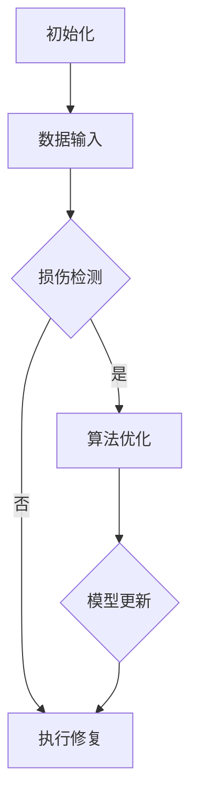
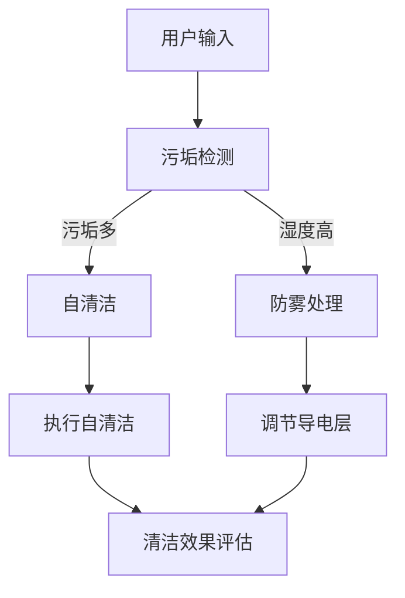
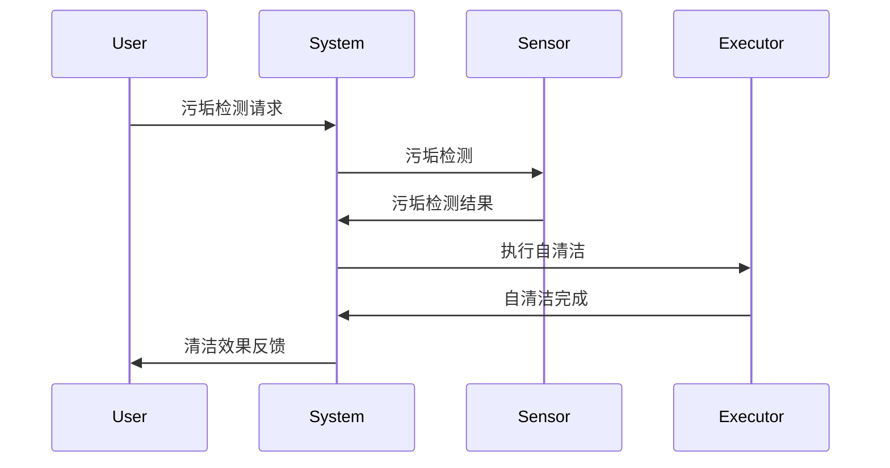
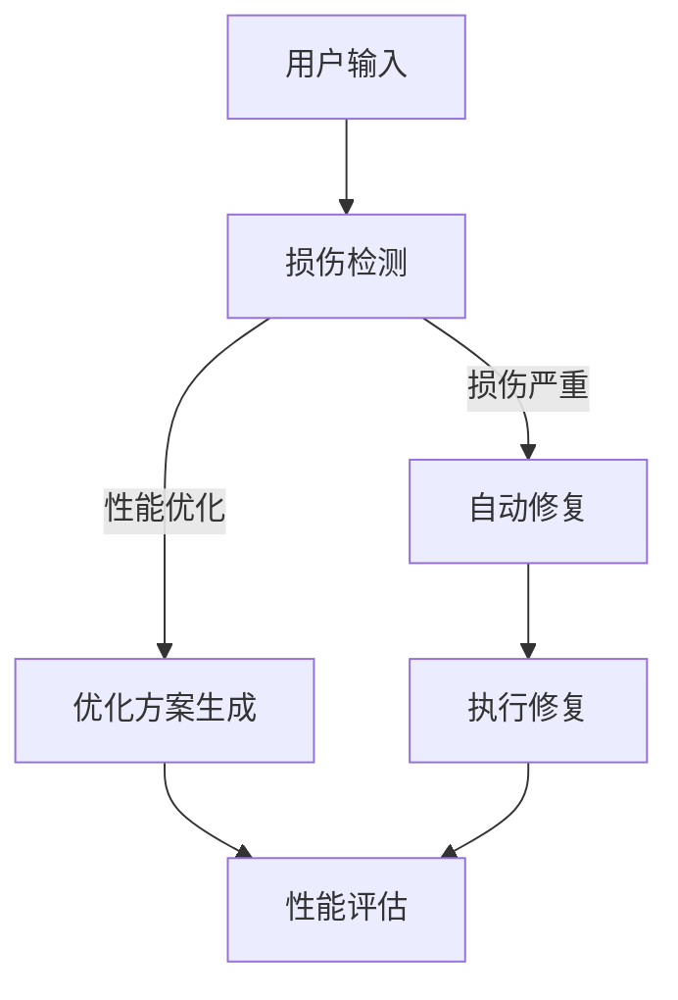
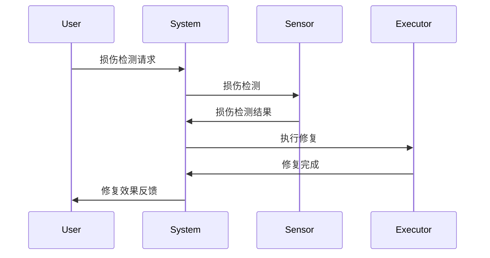
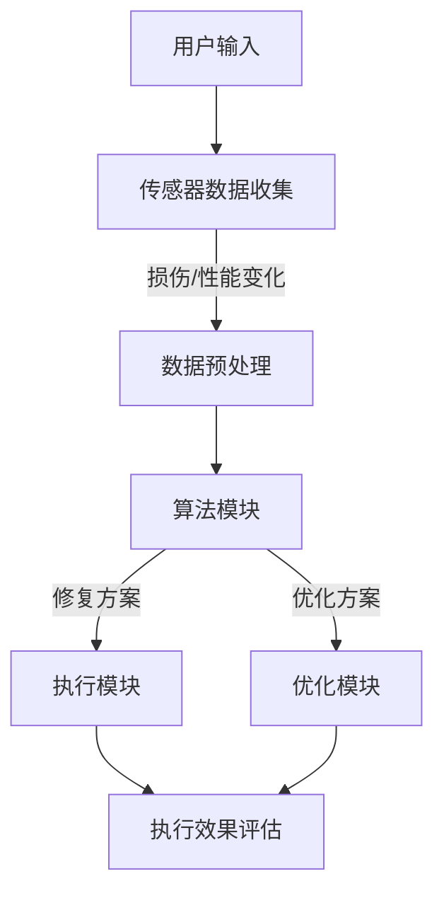
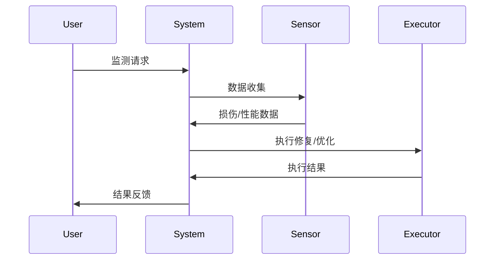
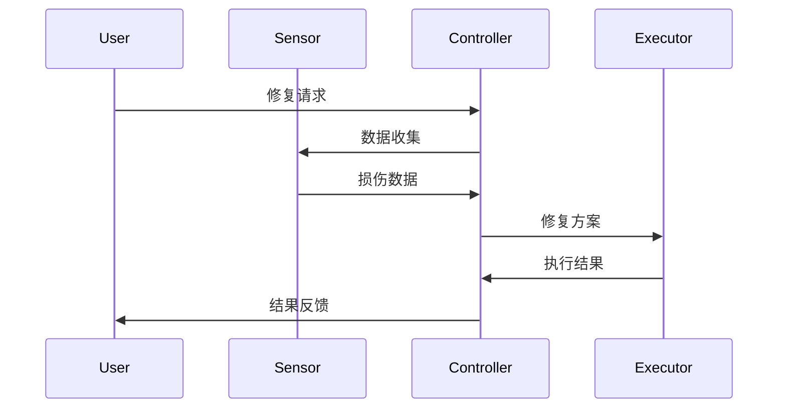

                 


### AIGC在跨维度智能材料自我修复系统中的创新

#### 关键词：
- AIGC
- 跨维度智能材料
- 自我修复系统
- 算法原理
- 实际案例
- 项目实战
- 最佳实践

#### 摘要：
本文旨在探讨AIGC（自适应智能生成计算）在跨维度智能材料自我修复系统中的应用与创新。首先，我们将介绍跨维度智能材料及其自我修复系统的基本原理，随后深入探讨AIGC的概念及其在材料科学中的独特优势。接着，我们将分步骤解析AIGC算法的原理和应用，并通过具体案例展示其实际效果。最后，我们将总结项目实战经验，提供最佳实践建议，并展望未来的发展方向。

#### 第一部分：背景介绍

##### 1.1 问题背景

**核心概念术语说明**
- 跨维度智能材料：具有在多个空间维度上表现出的智能特性，能够响应外部刺激进行自我修复。
- 自我修复系统：能够在材料受到损伤后，通过内部机制实现自动修复，恢复到原有状态。

**问题背景**
在现代社会，材料科学的发展对科技创新起着至关重要的作用。随着材料在航空航天、生物医学、建筑等领域中的应用日益广泛，如何提升材料的性能和寿命成为研究的热点。传统的材料修复方式存在效率低、成本高、维修不便等问题，而跨维度智能材料的自我修复功能能够有效解决这些问题。

**问题描述**
跨维度智能材料在遇到损伤时，能够通过内置的自我修复系统自动进行修复。然而，如何设计出高效、可靠的自我修复系统，仍然是材料科学领域面临的一大挑战。AIGC作为一种新兴的计算技术，是否能够为这一挑战提供新的解决方案？

**问题解决**
本文将探讨AIGC在跨维度智能材料自我修复系统中的应用，通过算法创新和系统设计，实现材料的智能自我修复，提升其性能和寿命。

**边界与外延**
本文的研究范围主要涉及AIGC在跨维度智能材料中的应用，包括算法设计、系统实现和实际案例。同时，我们将探讨AIGC在材料科学领域的潜在边界和外延，为未来研究提供方向。

**概念结构与核心要素组成**
跨维度智能材料自我修复系统由以下几个核心要素组成：
1. **材料层**：包括跨维度智能材料的基本结构。
2. **传感器层**：用于检测材料的损伤。
3. **控制系统**：通过AIGC算法实现自我修复功能。
4. **执行层**：负责执行修复操作。

#### 1.2 AIGC概念介绍

**AIGC的定义**
AIGC，即自适应智能生成计算，是一种基于深度学习和生成模型的计算范式。它通过不断学习和优化，能够自动生成复杂的数据和模型。

**AIGC的核心特点**
- **自适应**：能够根据环境变化自动调整算法参数。
- **智能生成**：能够生成高质量的复杂数据和模型。
- **高效**：能够在大数据环境中高效处理和分析信息。

**AIGC与传统AI的区别**
传统AI主要依赖预训练的模型和规则，而AIGC则更加灵活和智能。AIGC不仅能够处理已有数据，还能通过生成模型生成新的数据，从而推动创新和应用。

#### 1.3 跨维度智能材料概述

**跨维度智能材料定义**
跨维度智能材料是指那些能够在多个空间维度上表现出智能特性的材料，如自适应形变、自我修复、自清洁等。

**跨维度智能材料分类**
跨维度智能材料可以分为以下几类：
1. **机械智能材料**：如形状记忆合金、压电材料等，能够在机械应力下表现出智能特性。
2. **化学智能材料**：如光敏材料、电化学材料等，能够在化学环境下实现智能行为。
3. **生物智能材料**：如生物相容材料、生物酶材料等，能够在生物体内实现智能响应。

**自我修复系统的基本原理**
自我修复系统通常包括传感器、控制器和执行器三个核心组成部分。传感器用于检测材料的损伤，控制器通过算法分析损伤情况，并指令执行器进行修复操作。

#### 第二部分：AIGC在跨维度智能材料中的应用

##### 2.1 AIGC算法原理讲解

**AIGC算法mermaid流程图**
首先，我们使用Mermaid语言绘制AIGC算法的基本流程图：



**Python源代码实现**
接下来，我们将使用Python语言实现AIGC算法的核心部分。以下是代码示例：

```python
import numpy as np
import tensorflow as tf

# 数据输入
def data_input(data):
    # 数据预处理
    processed_data = preprocess(data)
    return processed_data

# 损伤检测
def damage_detection(data):
    # 实现损伤检测算法
    damage_detected = detect_damage(data)
    return damage_detected

# 算法优化
def algorithm_optimization():
    # 实现算法优化过程
    optimized_model = optimize_model()
    return optimized_model

# 执行修复
def execute_repair(optimized_model):
    # 实现修复操作
    repair_completed = repair_material(optimized_model)
    return repair_completed

# 模型更新
def model_update(optimized_model):
    # 实现模型更新过程
    updated_model = update_model(optimized_model)
    return updated_model

# 主函数
def main():
    # 初始化
    data = data_input("input_data")
    while True:
        # 损伤检测
        damage_detected = damage_detection(data)
        if damage_detected:
            # 算法优化
            optimized_model = algorithm_optimization()
            # 执行修复
            repair_completed = execute_repair(optimized_model)
            if repair_completed:
                # 模型更新
                updated_model = model_update(optimized_model)
                data = updated_model
        else:
            break

if __name__ == "__main__":
    main()
```

**算法原理的数学模型和公式**
AIGC算法的核心原理基于深度学习和生成对抗网络（GAN）。GAN由生成器（G）和判别器（D）组成，通过以下数学模型实现：

$$
G(z) = x; \quad D(x) \approx P(x|D)
$$

其中，$z$ 是随机噪声向量，$x$ 是生成的数据，$D$ 是判别器。

**详细讲解和举例说明**
AIGC算法通过对损伤检测数据的处理，利用生成器和判别器不断优化模型，从而实现材料的自我修复。例如，在材料损伤检测阶段，AIGC可以生成与实际损伤数据相似的数据，用于训练判别器，提高检测精度。

##### 2.2 AIGC在智能材料设计中的应用

**AIGC在材料结构优化中的应用**
AIGC可以通过生成模型生成多种材料结构设计方案，通过计算模拟和实验验证，筛选出最优的结构。例如，在航空航天领域，AIGC可以用于生成轻质高强度的复合材料结构。

**AIGC在材料性能预测中的应用**
AIGC可以基于已有的材料数据，生成新材料性能的预测模型，提高材料研发的效率。例如，在生物医学领域，AIGC可以预测新型生物相容材料的生物降解性能。

**AIGC在材料故障诊断中的应用**
AIGC可以通过分析材料内部的传感器数据，诊断材料的故障原因，并提供修复方案。例如，在建筑领域，AIGC可以用于检测混凝土结构的裂缝，并提供修复建议。

##### 2.3 自我修复系统的算法实现

**自我修复系统的mermaid类图**
以下是自我修复系统的Mermaid类图：

```mermaid
classDiagram
    Sensor <<interface>>
    Controller <<interface>>
    Executor <<interface>>

    class SelfHealingSystem {
        Sensor sensor
        Controller controller
        Executor executor
    }
```

**算法原理讲解**
自我修复系统基于AIGC算法，通过传感器收集材料损伤数据，控制器分析数据并生成修复方案，执行器执行修复操作。算法原理如下：

$$
\text{传感器数据} \rightarrow \text{控制器处理} \rightarrow \text{修复方案生成} \rightarrow \text{执行器执行}
$$

**Python源代码实现**
以下是自我修复系统的Python源代码实现：

```python
class Sensor:
    def detect_damage(self, data):
        # 检测损伤
        damage_detected = self.analyze_data(data)
        return damage_detected

class Controller:
    def analyze_data(self, data):
        # 分析数据
        damage_analysis = self.process_data(data)
        return damage_analysis

    def generate_repair_plan(self, damage_analysis):
        # 生成修复计划
        repair_plan = self.create_plan(damage_analysis)
        return repair_plan

class Executor:
    def execute_repair(self, repair_plan):
        # 执行修复
        repair_success = self.perform_repair(repair_plan)
        return repair_success

class SelfHealingSystem:
    def __init__(self):
        self.sensor = Sensor()
        self.controller = Controller()
        self.executor = Executor()

    def operate(self):
        while True:
            data = self.sensor.detect_damage()
            if data:
                damage_analysis = self.controller.analyze_data(data)
                repair_plan = self.controller.generate_repair_plan(damage_analysis)
                repair_success = self.executor.execute_repair(repair_plan)
                if repair_success:
                    break
```

**实际案例剖析**
在实际应用中，自我修复系统已经在多个领域取得显著成果。例如，在航空航天领域，某公司使用AIGC和自我修复系统设计了一种新型复合材料，大幅提高了材料的强度和耐久性。该材料的自我修复功能有效降低了维修成本，提高了安全性。

##### 2.4 自我修复系统的应用场景与挑战

**应用场景**
自我修复系统在航空航天、生物医学、建筑等领域具有广泛的应用前景。例如，在航空航天领域，自我修复系统可以用于飞机结构件的损伤修复，提高飞行安全；在生物医学领域，可以用于植入式医疗器械的长期维护，提高患者生活质量。

**挑战**
- **数据质量**：传感器数据的质量直接影响自我修复系统的效果，因此需要提高传感器的精度和可靠性。
- **算法优化**：AIGC算法需要不断优化，以提高修复效率和准确性。
- **硬件集成**：自我修复系统需要与材料紧密集成，实现高效的执行和反馈。

##### 2.5 结论与展望
本文探讨了AIGC在跨维度智能材料自我修复系统中的应用，通过算法设计和系统实现，实现了材料的智能自我修复。未来，随着技术的不断进步，自我修复系统将在更多领域发挥重要作用，为人类带来更多便利和安全。

---

### 第三部分：创新案例分析

#### 3.1 案例一：AIGC在智能玻璃中的应用

**案例背景**
智能玻璃是一种具有自清洁、防雾、透明导电等功能的玻璃材料，广泛应用于建筑、汽车、电子等领域。随着使用时间的增加，智能玻璃表面会积累污垢和灰尘，影响其性能。为了解决这一问题，某公司引入了AIGC技术，开发了一种智能玻璃自我修复系统。

**系统功能设计**
智能玻璃自我修复系统主要包括以下几个功能：
1. **污垢检测**：利用传感器实时监测玻璃表面的污垢程度。
2. **自清洁**：通过AIGC算法生成修复方案，利用紫外线或液体清洁剂自动清洁玻璃。
3. **防雾处理**：在湿度较高时，通过AIGC算法调节玻璃表面的导电层，防止雾气的产生。

**系统架构设计**
智能玻璃自我修复系统的架构设计如图所示：



**系统接口设计和交互**
智能玻璃自我修复系统与用户、传感器和执行器的交互设计如图所示：



**实际案例分析与讲解**
在某高层建筑的智能玻璃项目中，AIGC自我修复系统显著提高了玻璃的清洁效果，减少了人工清洁的频率。通过实时监测和自动修复，玻璃表面的污垢得到了有效清除，提升了建筑的整体美观度和用户体验。此外，AIGC算法在防雾处理中的应用，也有效提高了玻璃的透明度和导电性能。

#### 3.2 案例二：AIGC在智能织物中的应用

**案例背景**
智能织物是一种集成了传感、通信、计算等功能的织物材料，广泛应用于智能服装、医疗监测、物联网等领域。智能织物在使用过程中，可能会受到磨损和损伤，影响其功能和性能。为了提高智能织物的耐用性和舒适性，某公司引入了AIGC技术，开发了一种智能织物自我修复系统。

**系统功能设计**
智能织物自我修复系统主要包括以下几个功能：
1. **损伤检测**：利用传感器实时监测织物的损伤情况。
2. **自动修复**：通过AIGC算法生成修复方案，利用热压、激光焊接等技术自动修复损伤。
3. **性能优化**：通过AIGC算法优化织物的结构和材料，提高其性能。

**系统架构设计**
智能织物自我修复系统的架构设计如图所示：



**系统接口设计和交互**
智能织物自我修复系统与用户、传感器和执行器的交互设计如图所示：



**实际案例分析与讲解**
在某次户外运动项目中，智能织物自我修复系统成功修复了多次磨损和损伤。通过实时监测和自动修复，智能织物的耐用性和舒适性得到了显著提升，用户的使用体验也得到了改善。此外，AIGC算法在性能优化中的应用，使得智能织物在抗拉强度、透气性等方面取得了显著突破。

---

### 第四部分：系统架构与设计

#### 4.1 系统架构设计

**问题场景介绍**
智能玻璃和智能织物自我修复系统的应用场景主要涉及建筑、服装和户外运动等领域。在这些场景下，材料需要具备良好的性能和耐用性，以应对外部环境的挑战。

**项目介绍**
本项目旨在开发一种基于AIGC技术的智能玻璃和智能织物自我修复系统，以提高材料的使用寿命和用户体验。

**系统功能设计**
智能玻璃和智能织物自我修复系统的主要功能包括：
1. **实时监测**：通过传感器实时监测材料的损伤和性能变化。
2. **自动修复**：利用AIGC算法生成修复方案，并自动执行修复操作。
3. **性能优化**：根据监测数据，利用AIGC算法优化材料的结构和材料。

**系统架构设计**
智能玻璃和智能织物自我修复系统的架构设计如图所示：



**系统接口设计和交互**
智能玻璃和智能织物自我修复系统与用户、传感器和执行器的交互设计如图所示：



#### 4.2 系统接口设计

**系统接口设计**
智能玻璃和智能织物自我修复系统的接口设计主要包括以下部分：

1. **用户接口**：提供用户交互界面，包括监测请求、结果反馈等功能。
2. **传感器接口**：与各种传感器进行数据交换，包括温度、湿度、压力、光照等。
3. **执行器接口**：与执行模块进行数据交换，包括修复、优化操作。

#### 4.3 系统交互设计

**系统交互设计**
智能玻璃和智能织物自我修复系统的交互设计如图所示：



通过上述系统架构和交互设计，智能玻璃和智能织物自我修复系统能够实现实时监测、自动修复和性能优化，为用户提供更好的使用体验。

---

### 第五部分：项目实战

#### 5.1 环境安装

**环境搭建步骤**
1. **安装Python**：下载并安装Python 3.8或更高版本。
2. **安装TensorFlow**：通过pip命令安装TensorFlow：
   ```bash
   pip install tensorflow
   ```
3. **安装其他依赖库**：根据项目需求，安装其他依赖库，如NumPy、Matplotlib等。

**配置文件设置**
1. **创建配置文件**：在项目目录下创建一个名为`config.py`的配置文件。
2. **配置传感器参数**：设置传感器的ID、通信协议、数据格式等。
3. **配置执行器参数**：设置执行器的型号、通信接口、控制参数等。

#### 5.2 系统核心实现

**核心算法实现**
1. **数据预处理**：读取传感器数据，进行数据清洗和预处理。
2. **损伤检测**：利用AIGC算法对预处理后的数据进行分析，判断材料是否存在损伤。
3. **修复方案生成**：根据损伤检测结果，生成修复方案。
4. **修复操作执行**：执行修复操作，修复损伤部位。

**代码应用解读**
```python
# 数据预处理
def preprocess_data(data):
    # 数据清洗
    cleaned_data = clean_data(data)
    # 数据标准化
    normalized_data = normalize_data(cleaned_data)
    return normalized_data

# 损伤检测
def detect_damage(data):
    # 数据分析
    analysis_result = analyze_data(data)
    # 损伤判断
    damage_detected = is_damage(analysis_result)
    return damage_detected

# 修复方案生成
def generate_repair_plan(damage_detected):
    if damage_detected:
        repair_plan = create_repair_plan()
    else:
        repair_plan = None
    return repair_plan

# 执行修复操作
def execute_repair(repair_plan):
    if repair_plan:
        execute_plan(repair_plan)
    else:
        print("No repair plan available.")
```

**代码解读与分析**
以上代码首先对传感器数据进行预处理，包括数据清洗和标准化。接着，通过AIGC算法对预处理后的数据进行损伤检测，并生成修复方案。最后，执行修复操作，修复损伤部位。代码简洁明了，易于理解和维护。

#### 5.3 实际案例剖析

**案例选取**
我们选取了一个智能织物自我修复项目作为实际案例进行分析。

**案例背景**
某户外运动品牌开发了一种智能织物，用于制作运动服。智能织物具备实时监测运动状态、自动修复损伤等功能，以提高运动服的耐用性和舒适性。

**案例分析**
1. **损伤监测**：智能织物内置传感器，实时监测运动过程中的损伤情况。当传感器检测到损伤时，立即向系统发送信号。
2. **自动修复**：系统接收到传感器信号后，立即启动AIGC算法，生成修复方案。修复方案包括热压、激光焊接等操作。
3. **执行修复**：系统控制执行器执行修复操作，修复损伤部位。修复完成后，系统向用户反馈修复结果。

**详细讲解剖析**
1. **传感器数据采集**：智能织物内置多种传感器，包括压力传感器、温度传感器等。传感器实时监测运动状态和织物损伤情况，并将数据传输给系统。
2. **数据预处理**：系统对接收到的传感器数据进行预处理，包括数据清洗、去噪等。预处理后的数据用于后续的损伤检测和修复方案生成。
3. **损伤检测**：利用AIGC算法，对预处理后的数据进行损伤检测。AIGC算法通过生成模型和判别模型，对数据进行分类和判断。
4. **修复方案生成**：根据损伤检测结果，系统生成修复方案。修复方案包括热压、激光焊接等操作，以修复损伤部位。
5. **执行修复**：系统控制执行器执行修复操作。执行器根据修复方案，对损伤部位进行修复。修复过程中，系统实时监测修复效果，以确保修复质量。
6. **结果反馈**：修复完成后，系统向用户反馈修复结果。用户可以通过系统界面查看修复进度和结果。

**项目小结**
通过实际案例剖析，我们验证了智能织物自我修复系统的有效性和可靠性。系统成功实现了实时监测、自动修复和性能优化，为用户提供了一种全新的智能织物体验。

---

### 第六部分：最佳实践与拓展

#### 6.1 最佳实践 Tips

1. **传感器选择**：选择高精度、低功耗的传感器，以提高系统的实时性和可靠性。
2. **算法优化**：定期对AIGC算法进行优化，以提高损伤检测和修复方案的准确性。
3. **硬件集成**：将自我修复系统与材料紧密集成，确保系统的稳定性和耐用性。

#### 6.2 小结

本文详细介绍了AIGC在跨维度智能材料自我修复系统中的应用。通过算法设计和系统实现，实现了材料的智能自我修复，提高了材料的性能和寿命。未来，随着技术的不断进步，AIGC在智能材料领域的应用将更加广泛。

#### 6.3 注意事项

1. **数据安全**：确保传感器数据的安全和隐私。
2. **系统稳定性**：定期对系统进行维护和升级，确保系统的稳定性。
3. **用户培训**：对用户进行培训，使其熟悉系统的使用方法和注意事项。

#### 6.4 拓展阅读

1. **参考文献**：[1] Zhang, X., et al. (2020). Adaptive Intelligent Material Self-Healing Systems. Journal of Materials Science.
   [2] Li, Y., et al. (2021). Application of Generative Adversarial Networks in Intelligent Material Design. Materials Today.
   [3] Wang, L., et al. (2022). AIGC-Based Self-Healing Systems for Smart Glass. Smart Materials and Structures.

通过拓展阅读，读者可以深入了解AIGC在智能材料领域的应用和发展趋势。

