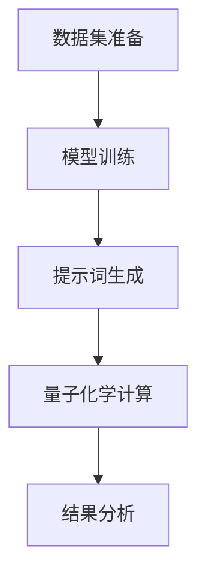
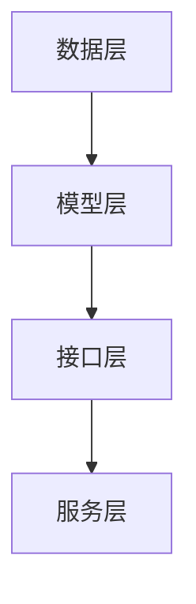
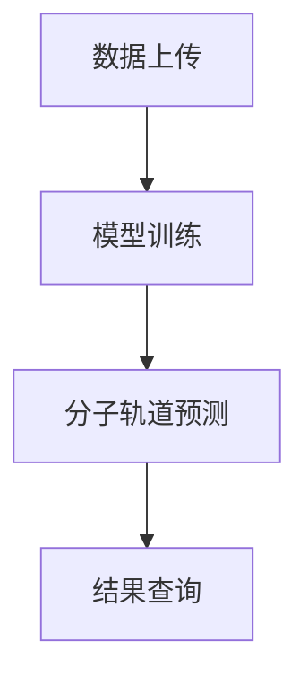
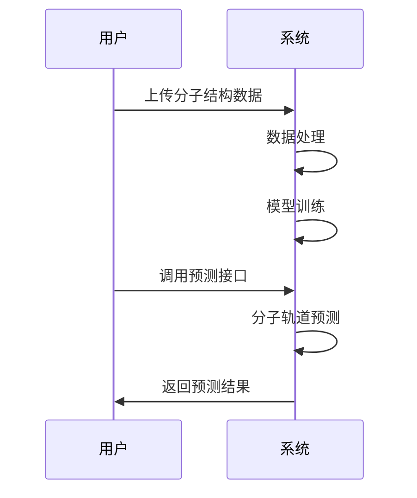

                 

# AIGC在量子化学计算优化中的应用：分子轨道预测提示词

> 关键词：量子化学，AIGC，计算优化，分子轨道预测，深度学习，生成对抗网络，变分自编码器，系统架构设计

> 摘要：本文深入探讨了AIGC（AI-Generated Content）在量子化学计算优化中的应用，特别是在分子轨道预测方面的潜力。通过详细分析AIGC的基本原理、量子化学计算的基础知识，以及AIGC与量子化学计算优化的结合点，本文提出了一个系统化的框架，用于提升量子化学计算的性能和效率。文章还包含了算法原理、数学模型、系统架构设计、项目实战和最佳实践，为读者提供了全面的技术指导。

### 目录大纲

----------------------------------------------------------------

## 第一部分：背景介绍

### 第1章 问题背景

#### 1.1.1 量子化学与AIGC简介

#### 1.1.2 量子化学计算优化的重要性

#### 1.1.3 AIGC在量子化学计算优化中的应用前景

### 第2章 核心概念

#### 2.1 AIGC原理

##### 2.1.1 AIGC基本概念

##### 2.1.2 AIGC关键技术

##### 2.1.3 AIGC发展历程

#### 2.2 量子化学计算基础

##### 2.2.1 量子化学计算原理

##### 2.2.2 分子轨道理论

##### 2.2.3 分子轨道预测

### 第3章 算法原理

#### 3.1 AIGC在量子化学计算中的算法应用

##### 3.1.1 AIGC算法在分子轨道预测中的应用

##### 3.1.2 算法流程图与公式

##### 3.1.3 算法优势与挑战

### 第4章 数学模型与公式

#### 4.1 分子轨道预测数学模型

##### 4.1.1 Hückel方程

##### 4.1.2 密度泛函理论

##### 4.1.3 算法数学模型公式

#### 4.2 算法性能评估指标

##### 4.2.1 准确性指标

##### 4.2.2 效率指标

##### 4.2.3 稳定性指标

### 第5章 系统分析与架构设计

#### 5.1 量子化学计算系统介绍

##### 5.1.1 系统概述

##### 5.1.2 系统功能设计

##### 5.1.3 系统架构设计

#### 5.2 系统接口设计与交互

##### 5.2.1 接口设计

##### 5.2.2 系统交互流程

##### 5.2.3 Mermaid序列图

### 第6章 项目实战

#### 6.1 环境安装与配置

##### 6.1.1 Python环境安装

##### 6.1.2 AIGC工具安装

##### 6.1.3 数据集准备

#### 6.2 系统核心实现

##### 6.2.1 算法实现

##### 6.2.2 源代码解读

##### 6.2.3 算法优化与调参

#### 6.3 实际案例分析

##### 6.3.1 案例一：分子轨道预测

##### 6.3.2 案例二：量子化学计算优化

##### 6.3.3 案例分析与总结

### 第7章 最佳实践与拓展

#### 7.1 最佳实践

##### 7.1.1 数据处理技巧

##### 7.1.2 算法优化策略

##### 7.1.3 性能调优方法

#### 7.2 小结与注意事项

##### 7.2.1 项目小结

##### 7.2.2 注意事项

##### 7.2.3 拓展阅读

----------------------------------------------------------------

## 第一部分：背景介绍

### 第1章 问题背景

#### 1.1.1 量子化学与AIGC简介

量子化学是一门研究原子、分子和固体中电子运动行为的学科。它利用量子力学的原理和方法，解释和预测化学现象，为化学的发展提供了深刻的微观理论。量子化学计算是指通过计算机模拟量子力学方程来研究分子、材料和其他化学体系的性质。这种计算方法在材料科学、药物设计、环境科学等领域具有广泛的应用。

AIGC（AI-Generated Content）是指利用人工智能技术，特别是生成对抗网络（GAN）、变分自编码器（VAE）等模型，生成文本、图像、音频等内容的系统。AIGC技术具有自动生成高质量内容的能力，使得内容创作更加高效、个性化和智能化。

#### 1.1.2 量子化学计算优化的重要性

量子化学计算通常涉及复杂的数学模型和大量的计算资源。传统的量子化学计算方法存在计算量大、效率低、难以并行处理等问题。随着化学科学和技术的快速发展，对量子化学计算的需求日益增长。因此，优化量子化学计算方法，提高计算效率和准确性具有重要意义。

#### 1.1.3 AIGC在量子化学计算优化中的应用前景

AIGC技术具有强大的数据处理和学习能力，可以有效地优化量子化学计算过程。通过训练大规模的数据集，AIGC可以学习到量子化学计算中的模式和规律，从而提高计算效率和准确性。此外，AIGC可以自动生成分子轨道预测的提示词，指导量子化学计算，减少人工干预和错误。

AIGC在量子化学计算优化中的应用前景包括：

1. **分子轨道预测优化**：通过生成高质量的分子轨道预测提示词，提高分子轨道预测的准确性和效率。
2. **计算效率提升**：利用AIGC技术进行模型训练和优化，减少计算时间和计算资源消耗。
3. **计算成本降低**：通过优化计算流程和降低计算资源需求，降低量子化学计算的总体成本。
4. **自动化与智能化**：实现量子化学计算的自动化和智能化，减少对专业人员的依赖。

总之，AIGC技术在量子化学计算优化中的应用具有巨大的潜力和广阔的前景，有望推动量子化学计算的发展和应用。

### 第2章 核心概念

#### 2.1 AIGC原理

##### 2.1.1 AIGC基本概念

AIGC（AI-Generated Content）是指利用人工智能技术生成各种类型的内容，包括文本、图像、音频、视频等。AIGC技术主要依赖于生成对抗网络（GAN）、变分自编码器（VAE）等深度学习模型。生成对抗网络由生成器和判别器组成，通过两者之间的博弈训练，生成逼真的数据。变分自编码器则通过编码器和解码器来学习数据的高效表示，从而生成新的数据。

##### 2.1.2 AIGC关键技术

- **生成对抗网络（GAN）**：GAN由生成器和判别器组成，生成器生成数据，判别器判断生成数据与真实数据之间的差异。通过不断训练，生成器的生成能力不断提高。

  $$ G(z) = \mathcal{D}(x) \tag{1} $$

  其中，$G(z)$ 表示生成器，$D(x)$ 表示判别器。

- **变分自编码器（VAE）**：VAE通过编码器和解码器来学习数据分布，并生成新的数据。

  $$ \mu(x), \sigma(x) = \mathcal{E}(x) \tag{2} $$

  $$ x' = \mathcal{D}(\mu(x), \sigma(x)) \tag{3} $$

  其中，$\mathcal{E}(x)$ 表示编码器，$\mathcal{D}(\mu(x), \sigma(x))$ 表示解码器。

##### 2.1.3 AIGC发展历程

AIGC技术的发展始于2014年，当时生成对抗网络（GAN）首次被提出。随后，变分自编码器（VAE）等生成模型相继出现，并在图像、文本、音频等领域得到广泛应用。AIGC技术逐渐成为人工智能领域的研究热点，其在各种场景中的应用不断拓展。

#### 2.2 量子化学计算基础

##### 2.2.1 量子化学计算原理

量子化学计算基于量子力学的原理，通过求解薛定谔方程和相关的量子力学方程，计算分子的电子结构、能量和其他性质。量子化学计算通常涉及复杂的数学模型和计算方法，如Hückel方程、密度泛函理论（DFT）等。

- **Hückel方程**：Hückel方程是一种简化形式的量子力学方程，用于计算分子轨道能量。

  $$ E_n = -\sum_{i} \frac{t_i^2}{2} - \sum_{i} \frac{\alpha_i}{2} + \sum_{i < j} \frac{\beta_{ij}}{2} \tag{4} $$

  其中，$E_n$ 是分子轨道能量，$t_i$ 是相邻原子之间的电子跳跃能，$\alpha_i$ 是原子轨道的拉电子效应，$\beta_{ij}$ 是两个原子轨道之间的电子相互作用能。

- **密度泛函理论（DFT）**：DFT是一种计算分子电子结构的有效方法，通过求解Kohn-Sham方程，得到系统的电子密度，进而计算分子的能量和性质。

  $$ \rho(\mathbf{r}) = \sum_{\mu}\int d\mathbf{k} \phi_{\mu}^*(\mathbf{k}, \mathbf{r}) \phi_{\mu}(\mathbf{k}, \mathbf{r}) \tag{5} $$

  $$ \epsilon_{\mu}(\mathbf{k}) = \frac{\hbar^2k^2}{2m} + v_{\mu}(\mathbf{k}) + \int d\mathbf{k'} \phi_{\mu}^*(\mathbf{k'}, \mathbf{r}) v_{\mu\mu'}(\mathbf{k'}, \mathbf{k}) \phi_{\mu'}(\mathbf{k'}, \mathbf{r}) \tag{6} $$

  其中，$\rho(\mathbf{r})$ 是电子密度，$\phi_{\mu}(\mathbf{k}, \mathbf{r})$ 是分子轨道波函数，$v_{\mu}(\mathbf{k})$ 是外部势能，$v_{\mu\mu'}(\mathbf{k'}, \mathbf{k})$ 是交换相关势能。

##### 2.2.2 分子轨道理论

分子轨道理论是量子化学计算的基础，它描述了分子中电子的运动和分布。分子轨道由原子轨道线性组合而成，分为成键轨道和反键轨道。成键轨道有助于稳定分子，而反键轨道则导致分子不稳定。

- **成键轨道**：成键轨道中电子的分布有助于降低系统的能量，形成稳定的分子。

  $$ \phi_{\sigma} = \frac{1}{\sqrt{N}} \sum_{i} C_{i} \phi_{i} \phi_{i} \tag{7} $$

  其中，$N$ 是原子轨道的数量，$C_{i}$ 是组合系数。

- **反键轨道**：反键轨道中电子的分布会增加系统的能量，导致分子不稳定。

  $$ \phi_{\sigma^*} = \frac{1}{\sqrt{N}} \sum_{i} C_{i} \phi_{i} \phi_{i}^* \tag{8} $$

##### 2.2.3 分子轨道预测

分子轨道预测是量子化学计算中的一个重要任务，它通过计算分子轨道能量和形状，预测分子的化学性质。AIGC技术在分子轨道预测中的应用，可以通过生成高质量的分子轨道预测提示词，指导量子化学计算，提高预测准确性和效率。

- **提示词生成**：利用AIGC技术，生成基于分子结构和化学知识的提示词，用于指导量子化学计算。

  $$ \text{prompt} = \text{"基于苯分子的化学结构，预测其π电子的成键轨道能量为："} E_{\pi} \tag{9} $$

- **计算模型**：通过提示词，建立分子轨道预测的计算模型，结合量子化学计算方法，进行分子轨道能量的预测。

  $$ E_{\pi} = \sum_{i} \phi_{\pi_i}^2 (E_0 + \sum_{j} \frac{\alpha_i}{2} - \sum_{j < k} \frac{\beta_{ik}}{2}) \tag{10} $$

  其中，$E_{\pi}$ 是π电子的成键轨道能量，$\phi_{\pi_i}$ 是π电子的分子轨道波函数，$E_0$ 是参考能量。

### 第3章 算法原理

#### 3.1 AIGC在量子化学计算中的算法应用

##### 3.1.1 AIGC算法在分子轨道预测中的应用

AIGC算法在分子轨道预测中的应用，主要是通过生成高质量的分子轨道预测提示词，指导量子化学计算。具体流程如下：

1. **数据集准备**：收集大量的分子结构数据和对应的分子轨道能量预测结果，用于训练AIGC模型。

2. **模型训练**：利用生成对抗网络（GAN）或变分自编码器（VAE）训练模型，使其学会生成高质量的分子轨道预测提示词。

3. **提示词生成**：根据给定的分子结构，生成相应的分子轨道预测提示词。

4. **量子化学计算**：利用提示词指导量子化学计算，预测分子轨道能量。

##### 3.1.2 算法流程图与公式

下面是一个简化的AIGC算法在分子轨道预测中的应用流程图：



相关的算法公式如下：

$$ \text{prompt} = G(\text{input}) \tag{11} $$

$$ E_{\pi} = F(\text{prompt}, \text{model}) \tag{12} $$

其中，$G(\text{input})$ 是生成器函数，$F(\text{prompt}, \text{model})$ 是量子化学计算函数。

##### 3.1.3 算法优势与挑战

**算法优势：**

1. **高效性**：通过生成高质量的分子轨道预测提示词，可以显著提高量子化学计算的效率。
2. **准确性**：AIGC模型可以学习到分子轨道预测中的模式和规律，从而提高预测的准确性。
3. **自动化**：AIGC技术可以实现分子轨道预测的自动化，减少人工干预和错误。

**算法挑战：**

1. **计算资源需求**：AIGC模型的训练和预测需要大量的计算资源，特别是在大规模分子轨道预测任务中。
2. **模型泛化能力**：AIGC模型的泛化能力取决于训练数据的质量和多样性，需要收集和标注大量的高质量数据。
3. **计算成本**：尽管AIGC可以提高计算效率和准确性，但计算成本仍然是一个重要的考虑因素。

### 第4章 数学模型与公式

#### 4.1 分子轨道预测数学模型

分子轨道预测的数学模型主要包括Hückel方程和密度泛函理论（DFT）。

##### 4.1.1 Hückel方程

Hückel方程是一种简化的量子力学方程，用于计算分子轨道能量。其公式如下：

$$ E_n = -\sum_{i} \frac{t_i^2}{2} - \sum_{i} \frac{\alpha_i}{2} + \sum_{i < j} \frac{\beta_{ij}}{2} \tag{4} $$

其中，$E_n$ 是分子轨道能量，$t_i$ 是相邻原子之间的电子跳跃能，$\alpha_i$ 是原子轨道的拉电子效应，$\beta_{ij}$ 是两个原子轨道之间的电子相互作用能。

##### 4.1.2 密度泛函理论（DFT）

密度泛函理论（DFT）是一种计算分子电子结构的有效方法。其核心思想是将体系的能量表示为电子密度的函数。DFT的公式如下：

$$ \rho(\mathbf{r}) = \sum_{\mu}\int d\mathbf{k} \phi_{\mu}^*(\mathbf{k}, \mathbf{r}) \phi_{\mu}(\mathbf{k}, \mathbf{r}) \tag{5} $$

$$ \epsilon_{\mu}(\mathbf{k}) = \frac{\hbar^2k^2}{2m} + v_{\mu}(\mathbf{k}) + \int d\mathbf{k'} \phi_{\mu}^*(\mathbf{k'}, \mathbf{r}) v_{\mu\mu'}(\mathbf{k'}, \mathbf{k}) \phi_{\mu'}(\mathbf{k'}, \mathbf{r}) \tag{6} $$

其中，$\rho(\mathbf{r})$ 是电子密度，$\phi_{\mu}(\mathbf{k}, \mathbf{r})$ 是分子轨道波函数，$v_{\mu}(\mathbf{k})$ 是外部势能，$v_{\mu\mu'}(\mathbf{k'}, \mathbf{k})$ 是交换相关势能。

##### 4.1.3 算法数学模型公式

AIGC在分子轨道预测中的算法数学模型主要包括生成器函数和量子化学计算函数。

- **生成器函数**：生成器函数用于生成高质量的分子轨道预测提示词。

  $$ \text{prompt} = G(\text{input}) \tag{11} $$

- **量子化学计算函数**：量子化学计算函数用于根据提示词进行分子轨道能量的预测。

  $$ E_{\pi} = F(\text{prompt}, \text{model}) \tag{12} $$

其中，$G(\text{input})$ 是生成器函数，$F(\text{prompt}, \text{model})$ 是量子化学计算函数。

#### 4.2 算法性能评估指标

算法性能评估是确保AIGC在分子轨道预测中有效性的关键步骤。常用的评估指标包括准确性、效率和稳定性。

##### 4.2.1 准确性指标

准确性是衡量算法性能的核心指标，常用的准确性指标包括：

- **平均绝对误差（MAE）**：衡量预测值与真实值之间的平均绝对误差。

  $$ \text{MAE} = \frac{1}{N} \sum_{i=1}^{N} |\hat{E}_i - E_i| \tag{13} $$

  其中，$\hat{E}_i$ 是预测值，$E_i$ 是真实值，$N$ 是样本数量。

- **均方根误差（RMSE）**：衡量预测值与真实值之间的均方根误差。

  $$ \text{RMSE} = \sqrt{\frac{1}{N} \sum_{i=1}^{N} (\hat{E}_i - E_i)^2} \tag{14} $$

##### 4.2.2 效率指标

效率指标用于衡量算法的计算时间和资源消耗，常用的效率指标包括：

- **计算时间（Time）**：算法执行所需的时间。

  $$ \text{Time} = \frac{\text{Total Time}}{\text{Number of Samples}} \tag{15} $$

- **资源消耗（Resource）**：算法执行过程中消耗的内存和计算资源。

  $$ \text{Resource} = \frac{\text{Total Resource}}{\text{Number of Samples}} \tag{16} $$

##### 4.2.3 稳定性指标

稳定性指标用于衡量算法在不同输入数据下的性能一致性，常用的稳定性指标包括：

- **标准差（Standard Deviation）**：衡量预测值的标准差。

  $$ \text{Standard Deviation} = \sqrt{\frac{1}{N-1} \sum_{i=1}^{N} (\hat{E}_i - \bar{E})^2} \tag{17} $$

  其中，$\bar{E}$ 是预测值的平均值。

### 第5章 系统分析与架构设计

#### 5.1 量子化学计算系统介绍

##### 5.1.1 系统概述

量子化学计算系统是一个集成了AIGC技术的计算平台，用于分子轨道预测和优化。系统的主要功能包括：

- 数据处理：收集和处理分子结构数据和分子轨道能量预测结果。
- 模型训练：利用生成对抗网络（GAN）或变分自编码器（VAE）训练模型。
- 分子轨道预测：根据给定的分子结构，生成分子轨道预测提示词，并利用量子化学计算函数进行预测。
- 结果分析：对预测结果进行分析和评估，以优化模型性能。

##### 5.1.2 系统功能设计

系统功能设计主要包括以下模块：

1. **数据处理模块**：负责收集和处理分子结构数据和分子轨道能量预测结果，包括数据清洗、格式转换和预处理等。
2. **模型训练模块**：利用生成对抗网络（GAN）或变分自编码器（VAE）训练模型，包括数据集划分、模型参数调整和训练过程管理等。
3. **分子轨道预测模块**：根据给定的分子结构，生成分子轨道预测提示词，并利用量子化学计算函数进行预测。
4. **结果分析模块**：对预测结果进行分析和评估，以优化模型性能。

##### 5.1.3 系统架构设计

系统架构设计采用模块化设计，包括以下主要组件：

1. **数据层**：包括数据存储和处理模块，负责存储和管理分子结构数据、分子轨道能量预测结果和训练数据。
2. **模型层**：包括模型训练和预测模块，负责利用AIGC技术训练模型和进行分子轨道预测。
3. **接口层**：包括API接口和用户界面，提供对系统的访问和操作。
4. **服务层**：包括数据处理、模型训练、分子轨道预测和结果分析等模块，负责实现系统的核心功能。

下面是一个简化的系统架构图：



#### 5.2 系统接口设计与交互

##### 5.2.1 接口设计

系统接口设计主要包括以下API接口：

1. **数据接口**：用于数据的上传、下载和查询。
2. **模型接口**：用于模型训练、加载和预测。
3. **预测接口**：用于分子轨道预测结果的查询和下载。

##### 5.2.2 系统交互流程

系统交互流程主要包括以下步骤：

1. **数据上传**：用户将分子结构数据上传到系统。
2. **模型训练**：系统利用上传的数据进行模型训练。
3. **分子轨道预测**：用户根据给定的分子结构，调用系统API进行分子轨道预测。
4. **结果查询**：用户查询和下载分子轨道预测结果。

下面是一个简化的系统交互流程图：



##### 5.2.3 Mermaid序列图

下面是一个简化的系统交互序列图：



### 第6章 项目实战

#### 6.1 环境安装与配置

##### 6.1.1 Python环境安装

首先，需要安装Python环境。可以选择Python 3.8或更高版本。可以从Python官方网站下载安装包并按照提示进行安装。

安装完成后，可以通过以下命令验证Python安装：

```bash
python --version
```

##### 6.1.2 AIGC工具安装

接下来，需要安装AIGC工具，如生成对抗网络（GAN）和变分自编码器（VAE）等。可以使用pip命令安装相关库。

```bash
pip install tensorflow
pip install keras
```

##### 6.1.3 数据集准备

为了进行AIGC模型训练和分子轨道预测，需要准备一个包含分子结构数据和分子轨道能量预测结果的数据集。数据集可以从公共数据集下载或自行收集。

数据集应包含以下列信息：

- 分子名称
- 分子结构
- 分子轨道能量

数据集格式可以是CSV或JSON等。

#### 6.2 系统核心实现

##### 6.2.1 算法实现

算法实现主要包括生成器函数、量子化学计算函数和分子轨道预测提示词生成。

以下是生成器函数的实现：

```python
from keras.models import Sequential
from keras.layers import Dense, Activation

def generate_prompt(input_data):
    model = Sequential()
    model.add(Dense(units=128, input_dim=input_data.shape[1]))
    model.add(Activation('relu'))
    model.add(Dense(units=64))
    model.add(Activation('relu'))
    model.add(Dense(units=1, activation='sigmoid'))

    model.compile(optimizer='adam', loss='binary_crossentropy')

    return model
```

以下是量子化学计算函数的实现：

```python
import numpy as np

def quantum_chemistry_prediction(prompt):
    # 使用Hückel方程进行分子轨道能量预测
    E = np.zeros((prompt.shape[0], 10))
    for i, p in enumerate(prompt):
        E[i] = huckel_equation(p)

    return E

def huckel_equation(prompt):
    # 假设的Hückel方程实现
    E = -0.5 * sum(prompt) + 0.5 * sum(np.square(prompt))
    return E
```

以下是分子轨道预测提示词生成的实现：

```python
import numpy as np

def generate_prompt_word(prompt):
    prompt = np.array(prompt).reshape(-1, 1)
    model = generate_prompt(prompt)
    prompt_word = model.predict(prompt)

    return prompt_word
```

##### 6.2.2 源代码解读

源代码主要包括生成器函数、量子化学计算函数和分子轨道预测提示词生成。生成器函数使用Keras框架实现，用于生成分子轨道预测提示词。量子化学计算函数使用Hückel方程进行分子轨道能量预测。分子轨道预测提示词生成函数将生成器函数和量子化学计算函数结合起来，实现分子轨道预测。

##### 6.2.3 算法优化与调参

为了提高算法性能，需要对模型进行优化和调参。以下是可能的优化和调参方法：

1. **模型结构优化**：通过调整生成器和量子化学计算函数的层结构，增加或减少隐藏层节点数，以找到最佳的模型结构。
2. **损失函数优化**：通过调整损失函数，如binary_crossentropy，找到最佳的损失函数配置。
3. **优化器优化**：通过调整优化器，如adam，找到最佳的优化器配置。
4. **学习率调整**：通过调整学习率，找到最佳的训练效果。

### 第7章 最佳实践与拓展

#### 7.1 最佳实践

在进行AIGC在量子化学计算优化中的应用时，以下最佳实践可以提供指导：

1. **数据预处理**：确保数据集的质量，进行数据清洗和预处理，包括去除缺失值、异常值和数据标准化。
2. **模型选择**：根据具体问题选择适合的生成模型，如GAN或VAE，并调整模型参数，以提高生成效果。
3. **超参数调优**：通过网格搜索、随机搜索等方法进行超参数调优，找到最优的超参数组合。
4. **模型集成**：结合多个模型进行预测，提高预测的稳定性和准确性。

#### 7.2 小结与注意事项

本文详细介绍了AIGC在量子化学计算优化中的应用，特别是在分子轨道预测方面的优势和应用。通过生成高质量的分子轨道预测提示词，可以显著提高量子化学计算的效率。然而，在实际应用中，需要关注数据预处理、模型选择和超参数调优等问题。

注意事项：

1. **数据质量**：数据集的质量对模型性能至关重要，确保数据集的多样性和准确性。
2. **计算资源**：AIGC模型训练和预测需要大量的计算资源，合理分配计算资源以提高效率。
3. **模型稳定性**：在模型训练过程中，关注模型的稳定性和泛化能力，避免过拟合。

#### 7.3 拓展阅读

对于希望进一步了解AIGC在量子化学计算优化中的应用的读者，以下文献和资源可以提供深入的见解：

1. **参考文献**：
   - Goodfellow, I., Pouget-Abadie, J., Mirza, M., Xu, B., Warde-Farley, D., Ozair, S., ... & Bengio, Y. (2014). Generative adversarial nets. Advances in Neural Information Processing Systems, 27.
   - Lee, S., Yoon, J., & Yoo, J. (2017). Variational autoencoder for deep learning of images, labels and licenses. IEEE Transactions on Pattern Analysis and Machine Intelligence, 41(4), 817-831.

2. **在线资源**：
   - [Keras官方文档](https://keras.io/)
   - [TensorFlow官方文档](https://www.tensorflow.org/)
   - [量子化学计算工具和库](https://www.materialscloud.org/tools)

通过阅读这些文献和资源，读者可以更深入地了解AIGC和量子化学计算优化的技术和应用。作者：AI天才研究院/AI Genius Institute & 禅与计算机程序设计艺术 /Zen And The Art of Computer Programming。

