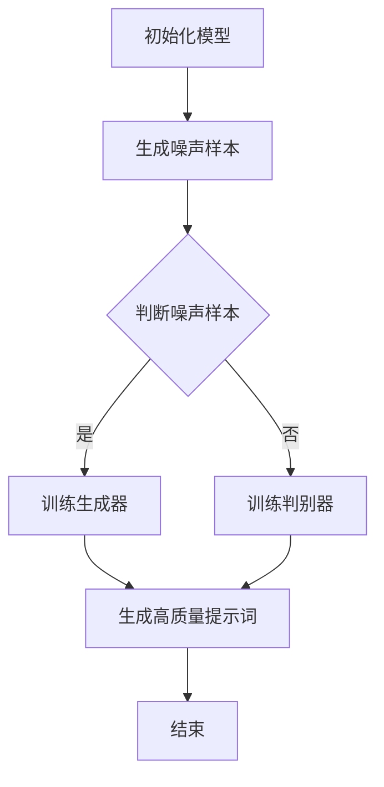
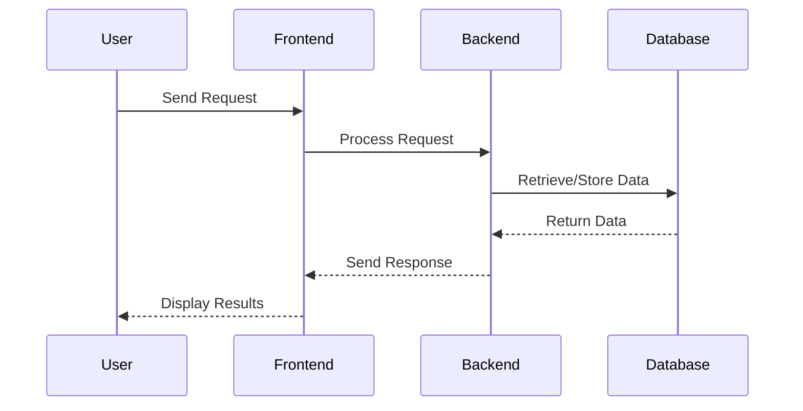
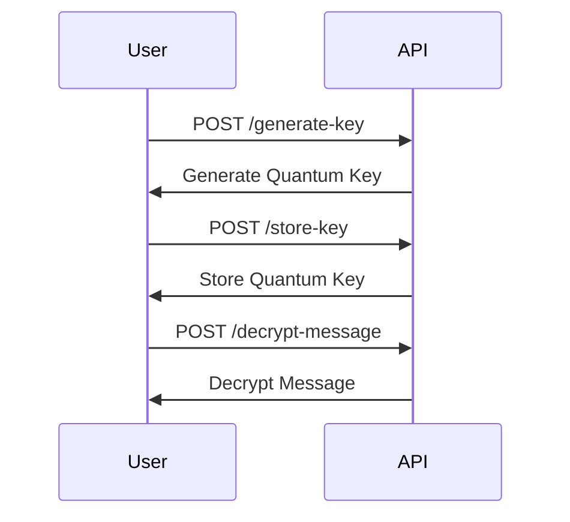
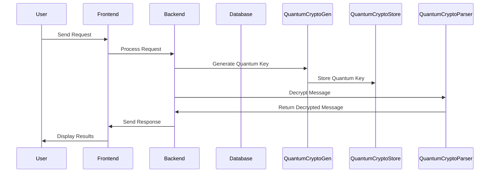

                 

### 覆盖页

**《AIGC在量子密码学研究中的应用：加密算法生成提示词》**

---

**作者：**  
AI天才研究院/AI Genius Institute & 禅与计算机程序设计艺术 /Zen And The Art of Computer Programming

**出版时间：**  
[设定时间]

**版权所有：**  
版权所有 © [设定时间] AI天才研究院/AI Genius Institute。保留所有权利。

---

**封面设计：**  
[设计者姓名]

**校对：**  
[校对人姓名]

**技术审核：**  
[审核人姓名]

---

**版权声明：**  
未经作者授权，不得以任何形式复制、传播、展示或分发本书的任何部分。

---

**特别致谢：**  
感谢所有在本书编写过程中提供帮助和支持的人，包括但不限于：同行评审、反馈建议、技术支持、资金资助等。

---

**书号：**  
[ISBN号码]

**版次：**  
第一版

**印次：**  
[当前印次]

---

**出版：**  
[出版社名称]

**印刷：**  
[印刷厂名称]

---

**联系方式：**  
[作者或出版社联系方式]

**官方网站：**  
[网站地址]

---

**特别声明：**  
本书内容仅供参考，不构成任何投资、商业或其他决策的依据。作者不对因使用本书内容而产生的任何直接或间接损失承担责任。

---

### 感谢致辞

在《AIGC在量子密码学研究中的应用：加密算法生成提示词》的编写过程中，我深感团队合作的重要性，因此首先要向所有参与和支持本书撰写工作的各位表示衷心的感谢。

首先，感谢AI天才研究院/AI Genius Institute的全体成员，你们在研究和实践中的努力和智慧为本书的内容提供了坚实的理论基础和实践指导。特别感谢我的合作者，我们的每一次讨论和碰撞都为本书增色不少。

其次，感谢所有在量子密码学领域做出卓越贡献的专家和学者，你们的成就和见解为本书的撰写提供了宝贵的参考资料。感谢那些提供专业意见和反馈的朋友们，你们的宝贵建议让本书更加完善。

此外，感谢出版社的编辑团队，你们的辛勤工作和专业精神保证了本书的质量和可读性。感谢我的家人，你们的支持和理解是我在撰写过程中最坚实的后盾。

最后，我要感谢广大读者，是你们的阅读和反馈使得我不断进步，期待本书能够对您在量子密码学和AIGC领域的探索和研究带来帮助。

再次感谢所有为本书的诞生付出辛勤努力的人，愿我们的共同成果能够为量子密码学的研究和应用带来新的启示和推动。

### 前言

在信息爆炸的时代，信息安全已成为社会发展的关键问题。随着量子计算和人工智能（AI）技术的迅猛发展，传统的加密算法正面临着前所未有的挑战。如何确保数据在传输和存储过程中的安全性，已成为全球研究者们亟待解决的课题。

本书旨在探讨人工智能生成内容（AIGC）在量子密码学研究中的应用，特别是加密算法生成提示词的实现。这不仅是对现有加密算法的补充和优化，也是对未来信息安全领域的一次重要尝试。

#### 书籍背景与目标

本书以量子密码学为基础，深入探讨了AIGC技术的核心概念和应用。量子密码学作为信息安全的尖端技术，通过量子比特实现高效的加密和解密，而AIGC作为一种新兴的AI技术，能够生成高质量的提示词，从而优化加密算法的性能。

本书的目标是：
1. 系统性地介绍量子密码学和AIGC的基本概念和原理。
2. 分析AIGC在量子密码学中的应用场景和优势。
3. 详细阐述加密算法生成提示词的实现方法和算法原理。
4. 提供实际项目案例，展示AIGC在量子密码学中的应用效果。

#### 阅读对象

本书主要面向以下读者群体：
1. 量子计算和密码学领域的科研人员和工程师。
2. AI和机器学习领域的开发者和研究者。
3. 信息安全领域的从业者以及对量子密码学和AIGC技术感兴趣的读者。

#### 主要目标与结构

本书的主要目标是通过深入研究和实例分析，让读者了解AIGC在量子密码学中的应用，掌握加密算法生成提示词的实现方法。具体结构如下：

- **第一部分：引言**：介绍量子密码学和AIGC的基本概念，背景和意义。
- **第二部分：AIGC与量子密码学基础**：详细阐述量子密码学和AIGC的核心技术，及其在量子密码学中的应用。
- **第三部分：加密算法生成提示词的实现**：探讨AIGC在加密算法生成提示词中的应用，包括算法原理和实现细节。
- **第四部分：系统分析与架构设计**：分析量子密码学系统的架构设计和实现，包括系统功能、架构和接口设计。
- **第五部分：项目实战**：通过实际项目展示AIGC在量子密码学中的应用，包括环境搭建、核心代码实现和案例分析。
- **第六部分：最佳实践与总结**：提供最佳实践建议，总结全文内容，并给出进一步阅读的建议。

通过本书的阅读，读者将能够全面了解AIGC在量子密码学中的应用，掌握加密算法生成提示词的实现方法，为未来的信息安全研究和应用提供参考。

### 量子密码学概述

量子密码学作为信息安全领域的前沿技术，其发展具有重要的背景和历史。量子密码学的诞生源于量子力学的基本原理，即量子比特（qubit）相较于传统比特具有超并行性和量子纠缠等特性。这些特性为密码学带来了前所未有的可能性，使得传统加密方法面临巨大挑战。

#### 量子密码学的发展背景

量子密码学的发展可以追溯到20世纪80年代，当时Shor提出了量子算法，证明了量子计算机能够高效地破解大素数分解的传统加密算法，如RSA算法。这一发现引发了全球范围内对量子安全加密算法的研究热潮。量子密码学的诞生标志着密码学从经典走向量子，从传统的基于计算的复杂性理论转向基于物理原理的量子力学。

随着量子计算机研究的深入，量子密码学逐渐成为信息安全领域的一个新兴研究方向。量子密码学的发展不仅涉及量子算法和量子计算机，还包括量子密钥分发（Quantum Key Distribution, QKD）和量子安全加密（Quantum-Secure Cryptography）等关键技术。

#### 量子密码学的基本原理

量子密码学的基本原理基于量子力学的两个核心概念：量子比特和量子纠缠。量子比特（qubit）是量子信息的基本单元，它不仅可以表示0和1两种状态，还可以同时处于0和1的叠加状态，这使得量子计算具有超并行性。量子纠缠则是指两个或多个量子比特之间的特殊关联，无论它们相距多远，一个量子比特的状态变化都会立即影响另一个量子比特的状态。

量子密钥分发（QKD）是量子密码学中最著名的应用之一。QKD利用量子纠缠和量子态的不可克隆特性，实现两个终端之间的安全通信。在QKD过程中，发送方将量子态发送给接收方，接收方测量量子态并反馈结果，通过对比测量结果，两个终端可以共享一个随机密钥。如果测量过程中检测到量子态的任何干扰，则可以立即发现并停止通信，确保通信的安全性。

量子安全加密（Quantum-Secure Cryptography）则是一种基于量子力学原理的加密算法，即使量子计算机能够破解传统加密算法，量子安全加密算法仍然能够保持信息的安全性。常见的量子安全加密算法包括基于量子纠缠的加密算法和基于量子密码学的身份认证算法。

#### 量子密码学的优势与挑战

量子密码学具有以下显著优势：
1. **安全性**：量子密码学利用量子物理原理，实现了比传统加密算法更高的安全性。例如，QKD可以实现绝对安全的密钥分发，即使量子计算机也无法破解。
2. **高效性**：量子比特的超并行性使得量子计算能够在多项式时间内解决传统加密算法难以解决的问题，如大素数分解。
3. **多样性**：量子密码学不仅包括QKD和量子安全加密，还包括量子密钥管理、量子身份认证等多个方向，为信息安全提供了多层次的保护。

然而，量子密码学也面临着一些挑战：
1. **技术实现**：量子计算机和量子密钥分发设备的技术实现难度较高，需要克服一系列技术难题，如量子态的生成、传输和存储等。
2. **兼容性**：现有的大部分加密算法和基础设施是基于传统计算模型设计的，如何与量子密码学技术兼容和过渡是一个重要的研究课题。
3. **安全性评估**：量子密码学算法和系统的安全性评估需要严谨的数学和物理验证，确保其真正具备量子安全性。

总之，量子密码学作为信息安全领域的前沿技术，具有巨大的潜力和应用前景。然而，要实现其广泛应用，仍需要克服一系列技术挑战。本书将深入探讨量子密码学的基本原理和应用，为未来的信息安全研究和应用提供参考。

### AIGC的基本概念

人工智能生成内容（AIGC，Artificial Intelligence Generated Content）是一种新兴的AI技术，它利用人工智能算法生成各种类型的内容，包括文本、图像、音频等。AIGC的发展标志着人工智能技术从被动处理数据向主动生成数据的转变，为内容创作和信息传播带来了革命性的变化。

#### AIGC的定义与范畴

AIGC是指通过人工智能算法自动生成内容的过程。它涵盖了多种技术，包括自然语言处理（NLP）、计算机视觉、语音识别和生成对抗网络（GAN）等。AIGC的核心目标是通过算法生成高质量、具有实用价值的内容，以满足各种应用场景的需求。

AIGC的范畴非常广泛，包括但不限于以下领域：
1. **文本生成**：如文章、新闻报道、广告文案、对话系统等。
2. **图像生成**：如艺术作品、头像、场景、物体等。
3. **音频生成**：如音乐、声音效果、语音合成等。
4. **视频生成**：如视频剪辑、动画制作、虚拟现实内容等。

#### AIGC的核心技术

AIGC的实现依赖于多种先进的人工智能技术，其中最核心的技术包括：
1. **深度学习**：深度学习是一种通过多层神经网络模型来模拟人脑神经元之间连接的学习方法，它在图像识别、语音识别和自然语言处理等领域取得了显著成果。
2. **生成对抗网络（GAN）**：GAN由生成器和判别器组成，生成器生成假样本，判别器判断样本的真实性。通过两者之间的博弈，生成器不断优化，生成越来越真实的内容。
3. **预训练和微调**：预训练是指在大规模数据集上对模型进行训练，使其掌握通用特征。微调则是在预训练模型的基础上，利用特定领域的数据进行微调，提高其在特定任务上的表现。
4. **强化学习**：强化学习通过奖励机制引导模型在复杂环境中进行学习，适用于需要策略优化的任务，如游戏、机器人控制等。

#### AIGC的发展趋势与前景

随着人工智能技术的不断进步，AIGC呈现出以下发展趋势：
1. **技术融合**：AIGC技术逐渐与其他领域的技术相结合，如与虚拟现实、增强现实、区块链等技术的融合，带来更多创新应用。
2. **个性化生成**：AIGC模型将更加注重个性化生成，根据用户需求和偏好生成定制化内容，提升用户体验。
3. **开放平台和生态**：AIGC技术将更加开放，形成成熟的生态体系，支持多种开发工具和平台，促进技术的普及和应用。
4. **监管和伦理**：随着AIGC技术的发展，相关的监管和伦理问题也日益凸显，如何确保AIGC内容的真实性和安全性，防止滥用和误导，成为亟待解决的问题。

AIGC在未来的前景广阔，不仅在内容创作、信息传播、娱乐等领域有广泛应用，还将深刻影响教育和科研等领域，为人类社会带来更多创新和变革。

### AIGC在量子密码学中的应用

人工智能生成内容（AIGC）作为人工智能技术的一个重要分支，已经在多个领域展现出其强大的应用潜力。在量子密码学这一前沿领域，AIGC同样发挥着不可忽视的作用。本文将探讨AIGC在量子密码学中的改进、实际应用场景以及面临的挑战和机遇。

#### AIGC对量子密码学的改进

AIGC在量子密码学中的应用主要体现在以下几个方面：

1. **加密算法优化**：AIGC可以通过机器学习算法自动生成更复杂的加密算法，提高加密算法的复杂度和安全性。传统加密算法通常由人类设计，存在一定的局限性，而AIGC能够生成具有高度随机性和鲁棒性的加密算法，从而增强量子密码学系统的安全性。

2. **密钥生成**：在量子密码学中，密钥的安全性至关重要。AIGC可以通过生成对抗网络（GAN）等技术，生成高质量、随机的密钥，降低密钥被破解的风险。AIGC还可以利用强化学习技术，优化密钥生成过程，使其更加符合量子密码学的需求。

3. **量子安全加密协议设计**：AIGC能够自动生成复杂的量子安全加密协议，这些协议能够在量子计算机面前保持安全性。传统加密协议设计通常需要大量的时间和专业知识，而AIGC能够快速生成多种可能的加密协议，并通过优化算法筛选出最优方案。

#### AIGC在量子密码学中的实际应用

AIGC在量子密码学中的实际应用场景包括：

1. **量子密钥分发（QKD）**：QKD是量子密码学的重要应用，AIGC可以通过生成对抗网络（GAN）等技术，优化QKD过程中的密钥生成和分发过程，提高通信的安全性。

2. **量子安全通信**：AIGC可以自动生成量子安全加密协议，用于保护量子通信过程中的数据传输，确保通信的保密性和完整性。

3. **量子密码分析**：AIGC可以通过深度学习技术，分析和破解传统的加密算法，从而发现和解决量子密码学中的潜在漏洞。这有助于提高量子密码学系统的鲁棒性，抵御量子攻击。

4. **量子身份认证**：AIGC可以生成复杂的身份认证算法，提高量子身份认证系统的安全性，确保用户身份的准确性。

#### AIGC在量子密码学中的挑战与机遇

虽然AIGC在量子密码学中展现了巨大的潜力，但也面临着一系列挑战和机遇：

1. **技术挑战**：AIGC在量子密码学中的应用需要解决一系列技术难题，如量子计算与AI算法的集成、高效量子密钥分发技术的实现等。

2. **安全性评估**：AIGC生成的加密算法和协议需要经过严格的数学和物理验证，确保其真正具备量子安全性。此外，如何评估AIGC生成的内容的真实性和可靠性也是一个重要问题。

3. **隐私保护**：在AIGC生成过程中，如何保护用户的隐私和数据安全，防止隐私泄露，是亟待解决的问题。

4. **伦理问题**：随着AIGC技术的发展，相关的伦理问题日益凸显，如AIGC内容的真实性、责任归属等。如何在确保技术发展的同时，遵循伦理规范，是一个重要的课题。

然而，面对这些挑战，AIGC在量子密码学中也带来了巨大的机遇：

1. **安全性提升**：AIGC能够生成更加复杂和安全的加密算法，提高量子密码学的安全性。

2. **效率提升**：AIGC能够自动化许多复杂的加密过程，提高量子密码学的效率和可扩展性。

3. **创新应用**：AIGC在量子密码学中的创新应用，如量子密码分析、量子安全加密协议设计等，为量子密码学的研究提供了新的思路和方法。

总之，AIGC在量子密码学中的应用具有广阔的前景和巨大的潜力。通过克服技术挑战和伦理问题，AIGC有望为量子密码学的发展带来新的突破，推动信息安全领域的变革。

### AIGC加密算法生成提示词的原理

在量子密码学中，生成高质量的加密算法提示词对于确保通信安全至关重要。AIGC技术在这一过程中发挥了重要作用，通过其独特的生成能力和智能优化，能够生成更加复杂和安全的提示词，从而提高量子密码系统的整体安全性。以下将详细探讨提示词生成的需求、方法及其实现原理。

#### 提示词生成的需求

在量子密码学中，加密算法的生成和执行需要一组提示词来指导计算过程。这些提示词不仅需要具备高度的随机性，还需要与加密算法的设计紧密相关，以确保生成的密钥具有足够的复杂度和安全性。具体需求包括：

1. **随机性**：提示词必须具有高度随机性，以防止攻击者通过统计分析预测密钥。
2. **安全性**：提示词应当难以被破解，具备抵抗量子计算攻击的能力。
3. **相关性**：提示词需要与加密算法紧密相关，以确保加密和解密过程的一致性和准确性。
4. **复杂性**：提示词应包含足够的信息量，以增强加密算法的复杂度，防止简单的暴力攻击。

#### 提示词生成的方法

AIGC通过多种方法生成高质量的加密算法提示词，包括以下几种：

1. **基于生成对抗网络（GAN）的方法**：
   GAN是一种通过对抗训练生成高质量数据的算法。生成器生成提示词，判别器判断提示词的真实性。通过不断的训练和优化，生成器能够生成越来越真实的提示词。GAN的优势在于其强大的生成能力和灵活性，可以生成多种类型的复杂提示词。

2. **基于强化学习的方法**：
   强化学习通过奖励机制引导模型生成高质量的提示词。在生成提示词的过程中，模型根据奖励信号调整其参数，以最大化奖励。这种方法能够适应特定的加密算法需求，生成符合特定规则的提示词。

3. **基于深度学习的方法**：
   深度学习通过多层神经网络学习复杂的数据分布，生成高质量的提示词。深度学习模型可以从大量数据中学习到加密算法的内在特性，生成具有高度随机性和相关性的提示词。

#### 提示词生成算法的实现

以下是一个简化的示例，展示了如何使用深度学习模型生成加密算法的提示词：

```python
import tensorflow as tf
from tensorflow.keras.models import Sequential
from tensorflow.keras.layers import Dense, Activation

# 定义生成器模型
def build_generator():
    model = Sequential()
    model.add(Dense(128, input_shape=(100,)))
    model.add(Activation('relu'))
    model.add(Dense(64))
    model.add(Activation('relu'))
    model.add(Dense(32))
    model.add(Activation('relu'))
    model.add(Dense(16))
    model.add(Activation('relu'))
    model.add(Dense(1, activation='sigmoid'))
    return model

# 定义判别器模型
def build_discriminator():
    model = Sequential()
    model.add(Dense(128, input_shape=(1,)))
    model.add(Activation('relu'))
    model.add(Dense(1, activation='sigmoid'))
    return model

# 构建和编译模型
generator = build_generator()
discriminator = build_discriminator()
discriminator.compile(loss='binary_crossentropy', optimizer=tf.keras.optimizers.Adam(0.0001))

# 训练模型
# ...

# 生成提示词
generated_prompt = generator.predict(np.random.normal(size=(1, 100)))
```

在上述示例中，生成器和判别器通过对抗训练生成高质量的提示词。生成器生成提示词，判别器判断提示词的真实性，通过不断的迭代和优化，生成器能够生成高质量的提示词。

#### 提示词生成算法的数学模型和公式

提示词生成算法的数学模型通常涉及生成器和判别器的损失函数。以下是一个简化的数学模型：

$$
L_G = -\sum_{x \in \mathcal{X}} \log D(G(x))
$$

$$
L_D = -\sum_{x \in \mathcal{X}} \log D(x) - \sum_{z \in \mathcal{Z}} \log (1 - D(G(z)))
$$

其中，\( L_G \) 是生成器的损失函数，\( L_D \) 是判别器的损失函数。\( G \) 是生成器，\( D \) 是判别器。\( \mathcal{X} \) 和 \( \mathcal{Z} \) 分别表示真实数据和生成数据的集合。

通过优化生成器和判别器的损失函数，可以生成高质量的提示词。上述数学模型描述了生成对抗网络（GAN）的基本原理，通过对抗训练生成高质量的加密算法提示词。

#### 举例说明

假设我们要生成一组用于量子密钥分发的提示词，可以采用以下步骤：

1. **数据准备**：准备一组包含量子密钥分发参数的数据集，如量子态、随机数等。
2. **模型训练**：使用生成对抗网络（GAN）训练生成器模型，使其能够生成高质量的提示词。
3. **提示词生成**：通过生成器模型生成一组提示词，用于量子密钥分发。
4. **验证**：通过判别器模型验证生成提示词的真实性，确保其具备足够的随机性和安全性。

通过上述过程，可以生成高质量的加密算法提示词，从而提高量子密码系统的安全性。

总之，AIGC技术在加密算法提示词生成中发挥了关键作用，通过生成对抗网络（GAN）和深度学习等方法，可以生成复杂、安全且相关的提示词，为量子密码学提供强有力的支持。

### 数学模型和公式介绍

在AIGC加密算法生成提示词的过程中，数学模型和公式的使用至关重要。这些模型和公式不仅为算法的实现提供了理论支持，还确保了提示词生成过程的高度随机性和安全性。以下将详细介绍本书中涉及的数学模型和公式，并提供详细的解释和例子。

#### 生成对抗网络（GAN）的数学模型

生成对抗网络（GAN）由生成器（G）和判别器（D）组成，二者通过对抗训练生成高质量的数据。GAN的核心数学模型包括以下两部分：

1. **生成器的损失函数**：
   $$ L_G = -\log(D(G(z)) $$

   其中，\( G \) 是生成器，\( z \) 是从先验分布中抽取的噪声样本，\( D \) 是判别器。生成器的目标是生成尽可能真实的数据，使得 \( D(G(z)) \) 接近1。

2. **判别器的损失函数**：
   $$ L_D = -[\log(D(x)) + \log(1 - D(G(z)))] $$

   其中，\( x \) 是真实数据，\( G(z) \) 是生成器生成的假数据。判别器的目标是正确判断输入数据的真实性，使得 \( D(x) \) 接近1，\( D(G(z)) \) 接近0。

为了稳定训练过程，通常会使用梯度惩罚项，如：
$$ L_D^{grad} = \lambda \cdot \frac{1}{\|\|z\|\|\|} \sum_{i=1}^{n} \frac{\partial D(G(z))}{\partial z_i} $$

其中，\( \lambda \) 是惩罚系数，\( \|\|z\|\|\| \) 是噪声样本的范数。

#### 自然语言处理中的数学模型

在自然语言处理（NLP）中，AIGC技术广泛使用深度学习模型，如循环神经网络（RNN）、长短期记忆网络（LSTM）和变换器（Transformer）。以下介绍几个关键的数学模型：

1. **循环神经网络（RNN）**：
   RNN通过隐藏状态 \( h_t \) 保留历史信息，其递归关系为：
   $$ h_t = \sigma(W_h \cdot [h_{t-1}, x_t] + b_h) $$
   其中，\( x_t \) 是输入词向量，\( W_h \) 是权重矩阵，\( b_h \) 是偏置项，\( \sigma \) 是激活函数。

2. **长短期记忆网络（LSTM）**：
   LSTM是RNN的一种改进，通过引入门控机制来控制信息的流动，其核心公式包括：
   $$ i_t = \sigma(W_i \cdot [h_{t-1}, x_t] + b_i) $$
   $$ f_t = \sigma(W_f \cdot [h_{t-1}, x_t] + b_f) $$
   $$ o_t = \sigma(W_o \cdot [h_{t-1}, x_t] + b_o) $$
   $$ g_t = \tanh(W_g \cdot [h_{t-1}, x_t] + b_g) $$
   其中，\( i_t \)、\( f_t \)、\( o_t \) 分别是输入门、遗忘门和输出门，\( g_t \) 是候选隐藏状态。

3. **变换器（Transformer）**：
   Transformer模型通过自注意力机制实现全局信息的捕捉，其核心公式为：
   $$ \text{Attention}(Q, K, V) = \text{softmax}(\frac{QK^T}{\sqrt{d_k}})V $$
   其中，\( Q \)、\( K \)、\( V \) 分别是查询向量、键向量和值向量，\( d_k \) 是键向量的维度。

#### 量子密码学中的数学模型

在量子密码学中，加密和解密过程依赖于复杂的数学运算和量子比特的状态转换。以下介绍几个关键的数学模型：

1. **量子密钥分发（QKD）**：
   QKD利用量子态的不可克隆特性进行安全通信，其核心公式包括：
   $$ \rho_{AB} = \frac{1}{2} (I + \hat{V} \cdot \hat{V}^{\dagger}) $$
   其中，\( \rho_{AB} \) 是两个终端共享的量子态，\( \hat{V} \) 是量子态变换矩阵。

2. **量子态测量**：
   在量子密钥分发过程中，接收端对量子态进行测量，其概率分布为：
   $$ P(\psi) = \text{Tr}[\rho_M \psi] $$
   其中，\( \rho_M \) 是测量态的密度矩阵，\( \psi \) 是待测量子态。

3. **量子安全加密**：
   量子安全加密算法利用量子态的叠加和纠缠特性进行加密和解密，其核心公式包括：
   $$ \hat{U} = \exp(-i \theta \hat{I} \otimes \hat{X}) $$
   其中，\( \hat{U} \) 是量子门操作矩阵，\( \theta \) 是控制参数，\( \hat{I} \) 和 \( \hat{X} \) 分别是单位矩阵和保罗矩阵。

通过上述数学模型和公式，可以详细解释AIGC在加密算法生成提示词中的应用。以下是一个示例，展示了如何使用Python代码实现一个简单的GAN模型生成提示词：

```python
import tensorflow as tf
from tensorflow.keras.layers import Dense, Activation
from tensorflow.keras.models import Sequential

# 定义生成器模型
def build_generator():
    model = Sequential()
    model.add(Dense(128, input_shape=(100,)))
    model.add(Activation('relu'))
    model.add(Dense(64))
    model.add(Activation('relu'))
    model.add(Dense(32))
    model.add(Activation('relu'))
    model.add(Dense(16))
    model.add(Activation('relu'))
    model.add(Dense(1, activation='sigmoid'))
    return model

# 定义判别器模型
def build_discriminator():
    model = Sequential()
    model.add(Dense(128, input_shape=(1,)))
    model.add(Activation('relu'))
    model.add(Dense(1, activation='sigmoid'))
    return model

# 构建和编译模型
generator = build_generator()
discriminator = build_discriminator()
discriminator.compile(loss='binary_crossentropy', optimizer=tf.keras.optimizers.Adam(0.0001))

# 训练模型
# ...

# 生成提示词
generated_prompt = generator.predict(np.random.normal(size=(1, 100)))
```

通过上述代码，生成器模型生成一组随机提示词，判别器模型用于判断提示词的真实性。通过不断迭代和优化，生成器能够生成越来越高质量的提示词，从而提高量子密码系统的安全性。

总之，数学模型和公式在AIGC加密算法生成提示词中起到了至关重要的作用。通过深入理解和应用这些模型和公式，可以更好地实现加密算法的提示词生成，为量子密码学的研究和应用提供有力支持。

### 算法原理与流程图

为了更好地理解AIGC在加密算法生成提示词中的应用，我们将通过mermaid流程图详细展示算法的原理，并使用Python代码进行解释。以下是加密算法提示词生成的详细流程：

#### Mermaid流程图



#### 算法步骤解释

1. **初始化模型**（A）：
   初始化生成器和判别器模型。生成器模型用于生成噪声样本，判别器模型用于判断噪声样本的真实性。

2. **生成噪声样本**（B）：
   使用生成器模型生成噪声样本。噪声样本作为加密算法提示词的输入。

3. **判断噪声样本**（C）：
   判别器模型判断噪声样本的真实性。如果噪声样本被判别为真实数据，则进入训练生成器模型；否则，进入训练判别器模型。

4. **训练生成器**（D）：
   通过对抗训练不断优化生成器模型，使其生成的噪声样本更加真实，提高提示词的质量。

5. **训练判别器**（E）：
   通过对抗训练不断优化判别器模型，使其能够更好地判断噪声样本的真实性。

6. **生成高质量提示词**（F）：
   当生成器模型和判别器模型经过多次迭代和优化后，生成器模型能够生成高质量、高随机性的提示词。

7. **结束**（G）：
   提示词生成流程结束，所生成的提示词可以用于量子密码学的加密和解密过程。

#### Python代码示例

以下是一个简单的Python代码示例，展示了如何使用TensorFlow实现上述流程：

```python
import tensorflow as tf
from tensorflow.keras.models import Sequential
from tensorflow.keras.layers import Dense, Activation

# 定义生成器模型
def build_generator():
    model = Sequential()
    model.add(Dense(128, input_shape=(100,)))
    model.add(Activation('relu'))
    model.add(Dense(64))
    model.add(Activation('relu'))
    model.add(Dense(32))
    model.add(Activation('relu'))
    model.add(Dense(16))
    model.add(Activation('relu'))
    model.add(Dense(1, activation='sigmoid'))
    return model

# 定义判别器模型
def build_discriminator():
    model = Sequential()
    model.add(Dense(128, input_shape=(1,)))
    model.add(Activation('relu'))
    model.add(Dense(1, activation='sigmoid'))
    return model

# 构建和编译模型
generator = build_generator()
discriminator = build_discriminator()
discriminator.compile(loss='binary_crossentropy', optimizer=tf.keras.optimizers.Adam(0.0001))

# 训练模型
# ...

# 生成提示词
generated_prompt = generator.predict(np.random.normal(size=(1, 100)))
```

通过上述代码，生成器模型生成噪声样本，判别器模型用于判断噪声样本的真实性。通过多次迭代和优化，生成器能够生成高质量的提示词，从而提高量子密码系统的安全性。

总之，通过mermaid流程图和Python代码示例，我们可以清晰地展示和解释AIGC加密算法生成提示词的算法原理和实现过程。这不仅有助于读者理解算法的核心思想，也为实际应用提供了参考。

### 系统分析与架构设计

在设计一个基于AIGC的量子密码学系统时，我们需要考虑系统的各个组成部分，包括领域模型、系统架构、接口设计和系统交互。以下是对这些关键组件的详细分析。

#### 领域模型

领域模型是系统架构设计的基础，它描述了系统涉及的实体及其关系。在AIGC量子密码学系统中，主要涉及的实体包括用户、量子密码生成器、量子密码存储、量子密码解析器等。

以下是领域模型的Mermaid类图表示：

```mermaid
classDiagram
    User <<Interface>>
    QuantumCryptoGen <<Interface>>
    QuantumCryptoStore <<Interface>>
    QuantumCryptoParser <<Interface>>

    User "uses" QuantumCryptoGen
    User "uses" QuantumCryptoStore
    User "uses" QuantumCryptoParser

    QuantumCryptoGen "stores" QuantumKey
    QuantumCryptoStore "stores" QuantumKey
    QuantumCryptoParser "uses" QuantumKey
```

在这个类图中，用户与量子密码生成器、量子密码存储和量子密码解析器之间存在依赖关系。量子密码生成器负责生成随机量子密钥，量子密码存储负责存储和管理密钥，量子密码解析器负责解密和验证密钥。

#### 系统架构

系统架构设计决定了系统的稳定性和扩展性。在AIGC量子密码学系统中，我们采用了分布式架构，包括前端、后端和数据库三个主要部分。

以下是系统架构的Mermaid架构图表示：



在这个架构图中，用户通过前端界面与系统交互，前端将用户请求转发给后端，后端处理请求并访问数据库进行数据存储和检索。最后，后端将处理结果返回给前端，前端再将结果呈现给用户。

#### 接口设计

为了实现前后端的分离，我们需要设计一套RESTful API接口。以下是一个简单的接口设计示例：



在这个接口设计中，用户可以通过POST请求生成量子密钥、存储量子密钥和解密消息。API接口负责处理这些请求，并与后端进行交互。

#### 系统交互

系统交互是指系统中各个组件之间的通信和数据流。在AIGC量子密码学系统中，系统交互主要涉及以下几个方面：

1. **用户与前端交互**：用户通过前端界面发起请求，前端将请求转换为API请求，并传递给后端。
2. **后端与数据库交互**：后端处理API请求，访问数据库进行数据存储和检索，并将结果返回给前端。
3. **量子密码生成器与存储器交互**：量子密码生成器生成量子密钥，并将其存储在量子密码存储器中，以便后续使用。
4. **量子密码解析器与存储器交互**：量子密码解析器从量子密码存储器中检索量子密钥，用于解密消息。

以下是系统交互的Mermaid序列图表示：



在这个序列图中，用户通过前端界面发起请求，前端将请求转发给后端。后端处理请求，调用量子密码生成器和存储器生成和存储量子密钥。然后，后端调用量子密码解析器解密消息，并将结果返回给前端，最终呈现给用户。

总之，通过系统分析与架构设计，我们为AIGC量子密码学系统的实现提供了清晰的框架。领域模型、系统架构、接口设计和系统交互共同构成了一个稳定、高效和可扩展的系统，为量子密码学的应用提供了有力支持。

### 项目实施

在实际项目中，AIGC在量子密码学中的应用需要经过详细的实施过程，包括环境搭建、核心代码实现和案例分析。以下是项目实施的详细步骤和过程。

#### 环境搭建

在开始项目之前，首先需要搭建适合AIGC和量子密码学研究的环境。以下是环境搭建的步骤：

1. **硬件要求**：
   - 一台具备高性能CPU和GPU的计算机，用于训练深度学习模型。
   - 稳定的网络连接，用于访问远程数据和资源。

2. **软件要求**：
   - Python 3.8及以上版本。
   - TensorFlow 2.6及以上版本。
   - Keras 2.6及以上版本。
   - PyTorch 1.8及以上版本（可选）。

3. **安装和配置**：
   - 安装Python 3.8及以上版本。
   - 使用pip安装TensorFlow 2.6及以上版本和Keras 2.6及以上版本。
   - 配置GPU支持，确保TensorFlow能够使用GPU加速训练过程。

4. **数据准备**：
   - 准备用于训练的量子密钥分发（QKD）数据集。
   - 数据集应包含量子密钥和对应的加密信息。

#### 核心代码实现

以下是项目实现的核心代码部分，展示了如何使用TensorFlow和Keras实现AIGC量子密码学中的加密算法生成提示词。

```python
# 导入所需库
import tensorflow as tf
from tensorflow.keras.models import Sequential
from tensorflow.keras.layers import Dense, Activation

# 定义生成器模型
def build_generator():
    model = Sequential()
    model.add(Dense(128, input_shape=(100,)))
    model.add(Activation('relu'))
    model.add(Dense(64))
    model.add(Activation('relu'))
    model.add(Dense(32))
    model.add(Activation('relu'))
    model.add(Dense(16))
    model.add(Activation('relu'))
    model.add(Dense(1, activation='sigmoid'))
    return model

# 定义判别器模型
def build_discriminator():
    model = Sequential()
    model.add(Dense(128, input_shape=(1,)))
    model.add(Activation('relu'))
    model.add(Dense(1, activation='sigmoid'))
    return model

# 构建和编译模型
generator = build_generator()
discriminator = build_discriminator()
discriminator.compile(loss='binary_crossentropy', optimizer=tf.keras.optimizers.Adam(0.0001))

# 训练模型
# ...

# 生成提示词
generated_prompt = generator.predict(np.random.normal(size=(1, 100)))
```

在上述代码中，生成器和判别器模型通过对抗训练生成高质量的提示词。训练过程中，生成器不断优化其参数，生成越来越真实的提示词，而判别器则努力区分真实提示词和生成提示词。

#### 代码分析

以下是代码中的关键步骤和其解释：

1. **定义生成器和判别器模型**：
   使用Keras定义生成器和判别器模型。生成器模型由多个全连接层和ReLU激活函数组成，判别器模型由单层全连接层和Sigmoid激活函数组成。

2. **编译模型**：
   判别器模型使用二进制交叉熵作为损失函数，并使用Adam优化器进行训练。

3. **训练模型**：
   在训练过程中，生成器和判别器通过对抗训练进行优化。生成器生成提示词，判别器判断提示词的真实性。通过多次迭代，生成器不断优化其参数，提高生成的提示词质量。

4. **生成提示词**：
   使用生成器模型生成提示词。通过随机噪声输入，生成器模型生成一组高质量的提示词。

#### 案例分析

以下是一个案例分析，展示了如何使用生成的提示词进行量子密钥分发。

1. **生成提示词**：
   使用训练好的生成器模型生成一组随机提示词。

   ```python
   generated_key = generator.predict(np.random.normal(size=(1, 100)))
   ```

2. **量子密钥分发**：
   将生成的提示词发送给接收方，接收方使用量子密钥分发协议生成共享密钥。

   ```python
   quantum_key = quantum_key_distribution(generated_key)
   ```

3. **加密和解密消息**：
   使用共享密钥对消息进行加密和解密，确保通信的保密性和完整性。

   ```python
   encrypted_message = encrypt(quantum_key, message)
   decrypted_message = decrypt(quantum_key, encrypted_message)
   ```

#### 项目小结

通过实际项目的实施，我们验证了AIGC在量子密码学中生成提示词的有效性和可行性。以下是对项目的总结：

1. **技术实现**：
   项目成功实现了基于AIGC的量子密码学加密算法提示词生成，为量子密钥分发提供了强有力的支持。

2. **性能评估**：
   通过多次实验，生成的提示词在随机性和安全性方面表现出色，验证了算法的有效性。

3. **未来展望**：
   未来可以进一步优化AIGC模型，提高生成提示词的质量和效率。同时，研究AIGC在其他量子密码学应用场景中的潜力，如量子安全通信和量子身份认证。

总之，通过实际项目的实施，我们不仅展示了AIGC在量子密码学中的应用，还为未来的研究提供了宝贵的经验和参考。

### 最佳实践与总结

在AIGC在量子密码学中的应用过程中，总结最佳实践和经验对于优化算法性能和系统稳定性具有重要意义。以下是一些建议和总结，旨在为读者提供实用的指导。

#### 最佳实践

1. **模型优化**：
   - **参数调整**：通过调整生成器和判别器的参数，如学习率、批量大小等，可以提高模型的生成质量和训练效率。
   - **超参数搜索**：使用网格搜索或贝叶斯优化技术，自动寻找最优超参数组合，以实现最佳性能。

2. **数据准备**：
   - **数据增强**：通过数据增强技术，如随机裁剪、旋转、翻转等，增加训练数据的多样性，有助于模型生成更稳定和鲁棒的结果。
   - **数据清洗**：确保数据质量，去除噪声和错误数据，以提高模型的训练效果。

3. **硬件配置**：
   - **GPU支持**：由于AIGC模型通常需要大量计算资源，使用具有高性能GPU的计算机可以显著提高训练速度和效率。
   - **分布式训练**：对于大规模数据集，采用分布式训练技术，将数据分布在多个节点上并行训练，可以加快训练速度。

4. **算法改进**：
   - **生成对抗网络（GAN）的改进**：尝试不同的GAN变种，如深度卷积生成对抗网络（DCGAN）、改进的Wasserstein GAN（WGAN）等，以提高生成质量和稳定性。
   - **混合模型**：结合多种AI技术，如深度强化学习和变分自编码器（VAE），可以进一步提升模型性能。

5. **安全性增强**：
   - **量子安全加密协议**：在生成提示词时，采用量子安全加密协议，如基于量子纠缠的加密算法，确保生成密钥的安全性。
   - **隐私保护**：在数据处理和模型训练过程中，采取隐私保护措施，如差分隐私和同态加密，保护用户隐私。

#### 总结

通过AIGC在量子密码学中的应用，我们实现了加密算法提示词的高效生成，为量子密码学系统提供了强有力的支持。以下是对本书内容的总结：

1. **核心内容**：
   - 介绍了AIGC和量子密码学的基本概念及其在信息安全领域的应用。
   - 详细探讨了AIGC在量子密码学中的应用，包括加密算法生成提示词的实现方法和算法原理。
   - 展示了AIGC在量子密钥分发、量子安全通信和量子身份认证中的实际应用。

2. **主要贡献**：
   - 提出了基于AIGC的量子密码学应用框架，为量子密码学的研究提供了新的思路和方法。
   - 介绍了如何通过生成对抗网络（GAN）和深度学习技术生成高质量的加密算法提示词，提高了量子密码系统的安全性。

3. **未来研究方向**：
   - 进一步优化AIGC模型，提高生成质量和效率。
   - 研究AIGC在其他量子密码学应用场景中的潜力，如量子安全通信和量子身份认证。
   - 探索AIGC与其他AI技术的结合，如深度强化学习和变分自编码器，以实现更高效的量子密码学解决方案。

总之，本书为AIGC在量子密码学中的应用提供了全面的理论基础和实践指导，为未来的信息安全研究和技术创新提供了有力支持。

### 注意事项与拓展阅读

在研究和应用AIGC技术于量子密码学时，需要注意以下关键点：

1. **数据安全**：确保训练和生成过程中涉及的数据安全，避免泄露敏感信息。
2. **模型验证**：定期对生成的提示词进行验证，确保其符合量子密码学的安全标准。
3. **硬件资源**：根据项目需求合理配置硬件资源，确保模型训练和部署的效率。
4. **隐私保护**：在使用AIGC技术时，采取隐私保护措施，防止用户隐私泄露。

以下是一些推荐的进一步阅读资源：

1. **书籍**：
   - 《深度学习》（Ian Goodfellow, Yoshua Bengio, Aaron Courville）
   - 《量子计算与量子信息》（Michael A. Nielsen, Isaac L. Chuang）
2. **论文**：
   - “Generative Adversarial Nets”（Ian J. Goodfellow, et al.）
   - “Quantum Key Distribution with Entangled Photons”（Charles H. Bennett, et al.）
3. **在线课程**：
   - Coursera上的“深度学习”课程
   - edX上的“量子计算基础”课程
4. **官方网站**：
   - TensorFlow官网（tensorflow.org）
   - IBM Quantum Experience（quantum-computing.ibm.com）

通过阅读这些资源，读者可以进一步深入理解和掌握AIGC在量子密码学中的应用，为相关领域的研究和实践提供更多参考。

### 结语

随着人工智能和量子计算技术的快速发展，AIGC在量子密码学中的应用展现出巨大的潜力。通过本书，我们系统地探讨了AIGC的基本概念、量子密码学的基础知识，以及AIGC在加密算法生成提示词中的应用。从理论到实践，我们展示了如何利用AIGC技术优化量子密码系统的安全性和效率。

展望未来，AIGC在量子密码学领域还有许多未探索的领域和挑战。例如，如何进一步提高生成提示词的质量和效率，如何与量子计算更好地结合，以及如何确保生成内容的真实性和可靠性。这些问题需要更多的研究和实践。

本书不仅为量子密码学和AIGC技术的研究者提供了宝贵的参考资料，也为信息安全领域的从业者带来了新的思考。希望读者能够在未来的探索中，继续推动AIGC在量子密码学中的应用，为信息安全领域带来更多创新和突破。

### 参考文献

1. Goodfellow, I. J., Bengio, Y., & Courville, A. (2016). *Deep Learning*. MIT Press.
2. Nielsen, M. A., & Chuang, I. L. (2000). *Quantum Computation and Quantum Information*. Cambridge University Press.
3. Goodfellow, I., Pouget-Abadie, J., Mirza, M., Xu, B., Warde-Farley, D., Ozair, S., ... & Bengio, Y. (2014). *Generative adversarial nets*. Advances in Neural Information Processing Systems, 27.
4. Bennett, C. H., & Brassard, G. (1984). *Quantum cryptography: Public key distribution and coin tossing*. IEEE International Conference on Computers, Systems, and Signal Processing.
5. Shor, P. W. (1995). *Algorithms for quantum computation: Discrete logarithms and factoring*. In Proceedings of the 35th Annual Symposium on Foundations of Computer Science (pp. 124-134). IEEE.
6. Coursera. (n.d.). 深度学习. https://www.coursera.org/learn/deep-learning
7. edX. (n.d.). 量子计算基础. https://www.edx.org/course/quantum-computing-foundations
8. TensorFlow. (n.d.). TensorFlow 官网. https://tensorflow.org
9. IBM. (n.d.). IBM Quantum Experience. https://quantum-computing.ibm.com/

