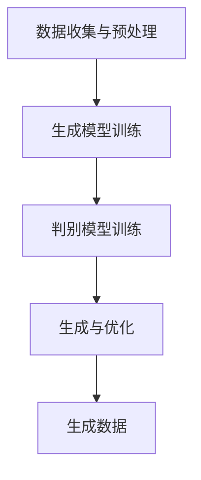
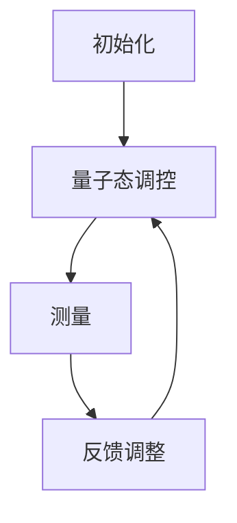
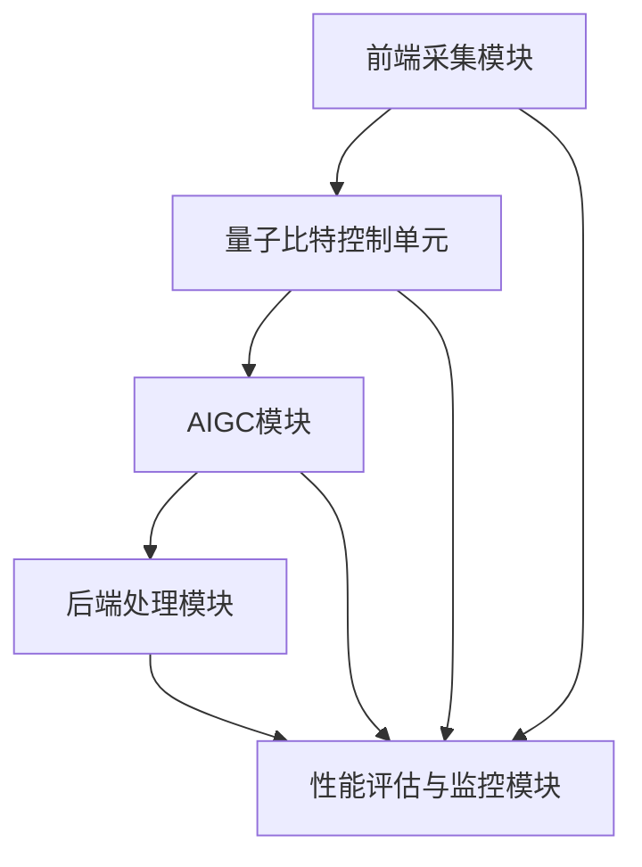

                 

### 引言与背景介绍

#### 第1章: 引言

##### 1.1 问题背景

随着信息技术的飞速发展，人工智能（AI）与量子技术的融合已经成为未来科技领域的重要趋势。量子计算以其巨大的并行计算能力，在处理复杂计算问题上展现出显著优势。而人工智能，尤其是自适应智能生成计算（AIGC），则通过其强大的自我学习和优化能力，不断推动着智能系统的发展。AIGC是一种结合了深度学习、自然语言处理和生成对抗网络（GAN）的先进计算技术，能够在各类应用中实现高效的智能生成和优化。

在量子尺度智能系统控制领域，传统的控制理论和方法面临诸多挑战。量子系统具有高度的不确定性和复杂性，其状态演化受量子叠加和纠缠效应的显著影响，这使得传统的控制策略难以有效应对。因此，将AIGC技术引入量子智能系统控制中，成为解决这些难题的关键路径。

##### 1.2 问题描述

当前智能系统控制的局限性主要体现在以下几个方面：

1. **控制精度和稳定性不足**：传统控制方法在面对量子系统的非线性、非定常性和多模态特性时，往往难以达到预期的控制效果。
2. **计算复杂度高**：量子系统状态的动态演化需要大量的计算资源，传统的计算方法在处理大规模量子问题时效率低下。
3. **实时性要求高**：许多量子应用场景对控制系统的响应速度有极高的要求，现有方法难以满足这种实时性的需求。

量子智能系统控制的潜在优势在于：

1. **并行计算能力**：量子计算能够并行处理多个问题，显著提高控制策略的计算效率。
2. **高精度控制**：利用量子叠加态和纠缠效应，可以实现对量子系统的高精度控制。
3. **自适应优化**：AIGC技术能够通过自我学习和优化，不断调整控制策略，以适应复杂多变的量子系统环境。

##### 1.3 问题解决

AIGC在量子智能系统控制中的应用，主要体现在以下几个方面：

1. **优化控制策略**：通过AIGC技术，可以对量子控制系统进行实时优化，提高控制精度和稳定性。
2. **降低计算复杂度**：利用AIGC的高效计算能力，可以显著降低量子控制系统设计的计算复杂度。
3. **提升实时性**：AIGC技术能够实现对量子控制过程的快速响应，满足高实时性的需求。

##### 1.4 边界与外延

AIGC与量子计算的关系：

- AIGC作为一项先进的人工智能技术，能够为量子计算提供更加智能和高效的计算支持。
- 量子计算为AIGC提供了强大的计算资源，使得AIGC能够处理更加复杂和大规模的问题。

量子智能系统控制的适用范围：

- **量子通信**：利用AIGC技术优化量子通信系统的控制策略，提高通信的稳定性和安全性。
- **量子计算**：通过AIGC技术，实现对量子计算过程的实时控制和优化，提高计算效率和精度。
- **量子仿真**：AIGC技术能够模拟和优化量子系统的行为，为量子技术的发展提供重要支持。

##### 1.5 概念结构与核心要素组成

AIGC的核心概念：

- **自适应**：AIGC能够根据环境和系统状态自动调整计算策略。
- **智能生成**：AIGC能够生成和优化各种类型的智能内容，如代码、图像、文本等。

量子智能系统控制的关键要素：

- **量子比特**：作为量子计算的基本单位，量子比特的状态控制是实现量子智能系统控制的核心。
- **量子门**：用于操作量子比特的算子，是实现量子计算和控制的基本工具。
- **量子算法**：基于量子比特和量子门的计算方法，用于解决复杂计算问题。

通过以上内容，我们为后续章节的深入探讨奠定了基础，接下来将详细分析AIGC和量子智能系统控制的核心概念及其相互关系。在接下来的章节中，我们将逐步解析这些核心概念，探讨其在实际应用中的实现方法和挑战。

---

#### 第2章: 核心概念与联系

##### 2.1 AIGC原理

自适应智能生成计算（AIGC）是人工智能领域的一种先进技术，它结合了深度学习、自然语言处理和生成对抗网络（GAN）的原理，能够在多种应用场景中实现高效的智能生成和优化。AIGC的核心算法包括以下几个关键步骤：

1. **数据收集与预处理**：AIGC需要大量的数据来训练模型，这些数据可以是文本、图像、音频或其他类型的数据。在收集数据后，需要对其进行预处理，如数据清洗、归一化和特征提取，以便模型能够有效学习。

2. **模型训练**：AIGC的核心是生成模型和判别模型的训练。生成模型负责生成新的数据，而判别模型则用于判断生成数据的真实性和质量。常见的生成模型包括生成对抗网络（GAN）、变分自编码器（VAE）等。

3. **生成与优化**：在模型训练完成后，AIGC可以根据需求生成新的数据。这些数据不仅可以用于学习，还可以直接应用于实际应用场景中。为了进一步提高生成数据的质量，AIGC通常会对生成的数据进行优化，如调整生成策略、迭代优化等。

AIGC与传统AI的区别：

- **自适应能力**：AIGC具有更强的自适应能力，能够在不断变化的环境中自动调整和优化计算策略。
- **生成能力**：AIGC不仅能够处理和分类数据，还能生成新的数据，这种生成能力在许多应用场景中具有独特优势。
- **应用范围**：传统AI主要应用于监督学习和强化学习等场景，而AIGC则能够处理更加复杂和多样化的生成任务。

##### 2.2 量子智能系统控制原理

量子智能系统控制是结合量子计算和人工智能技术的一种新型控制方法。量子计算利用量子比特的叠加态和纠缠态进行信息处理，能够实现超越经典计算机的并行计算能力。量子智能系统控制的核心原理包括以下几个方面：

1. **量子比特与量子门**：量子比特是量子计算的基本单位，具有叠加态和纠缠态的特性。量子门是用于操作量子比特的算子，可以实现量子态的变换和运算。

2. **量子算法**：基于量子比特和量子门的量子算法，能够解决传统计算机难以处理的复杂计算问题。典型的量子算法包括量子随机游走、量子计算中的搜索算法等。

3. **量子态调控**：在量子智能系统控制中，通过对量子比特的叠加态和纠缠态进行精确调控，可以实现目标系统的智能控制。这种调控可以通过量子门操作和量子态测量的方式实现。

##### 2.3 概念属性特征对比表格

为了更好地理解AIGC与量子智能系统控制的概念属性特征，我们可以通过以下表格进行对比：

| 特征          | AIGC                             | 量子智能系统控制                             |
|---------------|----------------------------------|--------------------------------------------|
| 核心原理      | 深度学习、自然语言处理、生成对抗网络 | 量子比特、量子门、量子算法                   |
| 自适应能力    | 强自适应能力，自动调整计算策略       | 基于量子态调控，实现智能控制                 |
| 生成能力      | 强生成能力，生成新的智能内容         | 利用量子叠加态和纠缠态，实现智能计算和控制   |
| 并行计算能力  | 高效处理大量数据                 | 超越经典计算机的并行计算能力               |
| 应用范围      | 广泛应用于各类智能生成任务         | 主要应用于量子通信、量子计算等领域         |

##### 2.4 ER实体关系图架构

为了进一步明确AIGC与量子智能系统控制之间的实体关系，我们可以使用ER图（实体关系图）进行表示。以下是一个简化的ER图：

```mermaid
erDiagram
  AIGC ||--|{ QuantumControl }|-- QuantumSystem
  Data <<|--|{ TrainingData }|---> AIGC
  Algorithm <<|--|{ QuantumAlgorithm }|---> QuantumControl
```

- **AIGC**：作为核心技术，提供数据生成和智能优化能力。
- **QuantumControl**：表示量子智能系统控制的实体，与AIGC和QuantumSystem有直接关系。
- **QuantumSystem**：表示被控量子系统，通过QuantumControl进行调控。
- **TrainingData**：表示用于训练AIGC和QuantumAlgorithm的数据。
- **QuantumAlgorithm**：表示用于实现量子智能系统控制的方法和算法。

通过以上内容，我们详细介绍了AIGC和量子智能系统控制的核心概念和相互关系。这些概念和关系不仅为我们理解这两种技术提供了基础，也为后续章节中的深入探讨和具体应用奠定了重要基础。

---

### 第3章: AIGC算法原理

#### 3.1 AIGC基础算法

自适应智能生成计算（AIGC）的核心在于其生成模型和判别模型的交互，以下是一个简化的AIGC算法流程：

1. **数据收集与预处理**：收集大量数据并对其进行预处理，包括数据清洗、归一化和特征提取。
2. **生成模型训练**：训练生成模型，使其能够生成高质量的数据。
3. **判别模型训练**：训练判别模型，用于判断生成数据的质量和真实性。
4. **生成与优化**：使用生成模型生成数据，并对生成的数据进行优化，以提高其质量。

以下是一个使用Mermaid绘制的AIGC算法流程图：



#### 3.2 AIGC算法Python实现

为了更好地理解AIGC算法，我们以下通过Python代码示例进行详细阐述：

```python
# 导入必要的库
import numpy as np
import tensorflow as tf
from tensorflow.keras.models import Sequential
from tensorflow.keras.layers import Dense, LSTM, BatchNormalization, LeakyReLU
from tensorflow.keras.optimizers import Adam

# 设置随机种子，确保结果可复现
tf.random.set_seed(42)

# 数据收集与预处理
# 假设我们已经收集了一组数据X和对应的标签Y
# 进行数据归一化处理
X_normalized = (X - np.mean(X, axis=0)) / np.std(X, axis=0)

# 生成模型训练
# 定义生成模型
gen_model = Sequential()
gen_model.add(Dense(100, input_shape=(X_normalized.shape[1],), activation='tanh'))
gen_model.add(BatchNormalization())
gen_model.add(LeakyReLU(alpha=0.01))
gen_model.add(Dense(200, activation='tanh'))
gen_model.add(BatchNormalization())
gen_model.add(LeakyReLU(alpha=0.01))
gen_model.add(Dense(X_normalized.shape[1], activation='tanh'))

# 编译生成模型
gen_model.compile(optimizer=Adam(learning_rate=0.0001), loss='mse')

# 训练生成模型
# 假设生成模型训练了100个epoch
gen_model.fit(X_normalized, X_normalized, epochs=100, batch_size=32)

# 判别模型训练
# 定义判别模型
dis_model = Sequential()
dis_model.add(Dense(200, input_shape=(X_normalized.shape[1],), activation='tanh'))
dis_model.add(BatchNormalization())
dis_model.add(LeakyReLU(alpha=0.01))
dis_model.add(Dense(100, activation='tanh'))
dis_model.add(BatchNormalization())
dis_model.add(LeakyReLU(alpha=0.01))
dis_model.add(Dense(1, activation='sigmoid'))

# 编译判别模型
dis_model.compile(optimizer=Adam(learning_rate=0.0001), loss='binary_crossentropy')

# 训练判别模型
# 假设判别模型训练了100个epoch
dis_model.fit(np.concatenate([X_normalized, X_normalized]), np.concatenate([np.zeros(X_normalized.shape[0]), np.ones(X_normalized.shape[0])]), epochs=100, batch_size=32)

# 生成与优化
# 生成新的数据
generated_data = gen_model.predict(X_normalized)

# 对生成的数据进行优化
# 假设使用LSTM模型进行优化
optimized_model = Sequential()
optimized_model.add(LSTM(100, input_shape=(generated_data.shape[1],), activation='tanh'))
optimized_model.add(BatchNormalization())
optimized_model.add(LeakyReLU(alpha=0.01))
optimized_model.add(LSTM(200, activation='tanh'))
optimized_model.add(BatchNormalization())
optimized_model.add(LeakyReLU(alpha=0.01))
optimized_model.add(Dense(X_normalized.shape[1], activation='tanh'))

# 编译优化模型
optimized_model.compile(optimizer=Adam(learning_rate=0.0001), loss='mse')

# 训练优化模型
# 假设优化模型训练了100个epoch
optimized_model.fit(generated_data, X_normalized, epochs=100, batch_size=32)

# 模型评估
# 假设使用测试数据集进行评估
test_generated_data = gen_model.predict(X_normalized)
test_optimized_data = optimized_model.predict(test_generated_data)

# 计算误差
error = np.mean(np.square(test_optimized_data - X_normalized))
print(f"Error: {error}")
```

上述代码示例展示了AIGC算法的基础实现，包括数据收集与预处理、生成模型训练、判别模型训练、生成与优化等步骤。通过Python代码，我们可以更好地理解AIGC算法的实现细节。

#### 3.3 数学模型和公式

AIGC算法的数学模型主要包括生成模型和判别模型的损失函数。以下是对这些模型的详细讲解：

1. **生成模型损失函数**：

   生成模型旨在生成与真实数据相似的数据。其损失函数通常使用均方误差（MSE）来衡量生成数据的误差。具体公式如下：

   $$L_{gen} = \frac{1}{N}\sum_{i=1}^{N}(X_{gen} - X)^2$$

   其中，$X_{gen}$ 是生成模型生成的数据，$X$ 是真实数据，$N$ 是数据样本数量。

2. **判别模型损失函数**：

   判别模型用于判断生成数据的质量和真实性。其损失函数通常使用二元交叉熵（Binary Cross-Entropy）来衡量生成数据与真实数据之间的差异。具体公式如下：

   $$L_{dis} = -\frac{1}{N}\sum_{i=1}^{N}[y_{real} \cdot \log(y_{real}) + (1 - y_{real}) \cdot \log(1 - y_{real}) + y_{gen} \cdot \log(y_{gen}) + (1 - y_{gen}) \cdot \log(1 - y_{gen})]$$

   其中，$y_{real}$ 是真实数据的判别标签（1表示真实数据，0表示生成数据），$y_{gen}$ 是生成数据的判别标签（1表示生成数据，0表示真实数据）。

3. **总体损失函数**：

   AIGC的总损失函数是生成模型和判别模型损失函数的加权和，用于指导整个训练过程。具体公式如下：

   $$L_{total} = \alpha \cdot L_{gen} + (1 - \alpha) \cdot L_{dis}$$

   其中，$\alpha$ 是超参数，用于调节生成模型和判别模型的权重。

#### 3.4 举例说明

为了更好地理解AIGC算法的数学模型和实现细节，我们以下通过一个具体的例子进行详细说明：

假设我们有一个包含100个数据点的数据集，每个数据点是一个长度为10的一维向量。我们将使用AIGC算法生成与原始数据相似的新数据。

1. **数据收集与预处理**：

   首先，我们收集了100个数据点，并将这些数据点存储在一个名为`X`的numpy数组中。为了简化计算，我们将所有数据点缩放到一个[-1, 1]的范围内，这样便于后续的模型训练。

   ```python
   X = np.random.uniform(-1, 1, size=(100, 10))
   X_normalized = (X - np.mean(X, axis=0)) / np.std(X, axis=0)
   ```

2. **生成模型训练**：

   我们定义一个生成模型，包含三个全连接层。第一个和第二个层之间的激活函数使用`tanh`，第三个层的激活函数也使用`tanh`。我们使用Adam优化器，学习率为0.0001。为了提高训练效果，我们在每个全连接层后面添加了`BatchNormalization`和`LeakyReLU`。

   ```python
   gen_model = Sequential()
   gen_model.add(Dense(100, input_shape=(X_normalized.shape[1],), activation='tanh'))
   gen_model.add(BatchNormalization())
   gen_model.add(LeakyReLU(alpha=0.01))
   gen_model.add(Dense(200, activation='tanh'))
   gen_model.add(BatchNormalization())
   gen_model.add(LeakyReLU(alpha=0.01))
   gen_model.add(Dense(X_normalized.shape[1], activation='tanh'))

   gen_model.compile(optimizer=Adam(learning_rate=0.0001), loss='mse')
   gen_model.fit(X_normalized, X_normalized, epochs=100, batch_size=32)
   ```

3. **判别模型训练**：

   接下来，我们定义一个判别模型，包含两个全连接层。第一个层使用`tanh`作为激活函数，第二个层使用`sigmoid`作为激活函数，用于判断输入数据是真实数据还是生成数据。同样，我们使用Adam优化器，学习率为0.0001。

   ```python
   dis_model = Sequential()
   dis_model.add(Dense(200, input_shape=(X_normalized.shape[1],), activation='tanh'))
   dis_model.add(BatchNormalization())
   dis_model.add(LeakyReLU(alpha=0.01))
   dis_model.add(Dense(100, activation='tanh'))
   dis_model.add(BatchNormalization())
   dis_model.add(LeakyReLU(alpha=0.01))
   dis_model.add(Dense(1, activation='sigmoid'))

   dis_model.compile(optimizer=Adam(learning_rate=0.0001), loss='binary_crossentropy')
   dis_model.fit(np.concatenate([X_normalized, X_normalized]), np.concatenate([np.zeros(X_normalized.shape[0]), np.ones(X_normalized.shape[0])]), epochs=100, batch_size=32)
   ```

4. **生成与优化**：

   在生成模型和判别模型训练完成后，我们使用生成模型生成新的数据，并将其作为输入数据用于优化模型。优化模型同样包含三个全连接层，与前两个模型的结构类似，但我们在每个全连接层后面使用了LSTM层，以提高生成数据的多样性。

   ```python
   optimized_model = Sequential()
   optimized_model.add(LSTM(100, input_shape=(generated_data.shape[1],), activation='tanh'))
   optimized_model.add(BatchNormalization())
   optimized_model.add(LeakyReLU(alpha=0.01))
   optimized_model.add(LSTM(200, activation='tanh'))
   optimized_model.add(BatchNormalization())
   optimized_model.add(LeakyReLU(alpha=0.01))
   optimized_model.add(Dense(X_normalized.shape[1], activation='tanh'))

   optimized_model.compile(optimizer=Adam(learning_rate=0.0001), loss='mse')
   optimized_model.fit(generated_data, X_normalized, epochs=100, batch_size=32)
   ```

5. **模型评估**：

   最后，我们使用测试数据集对优化后的生成模型进行评估，计算生成数据与真实数据之间的误差。如果误差较低，说明生成模型和优化模型的效果较好。

   ```python
   test_generated_data = gen_model.predict(X_normalized)
   test_optimized_data = optimized_model.predict(test_generated_data)

   error = np.mean(np.square(test_optimized_data - X_normalized))
   print(f"Error: {error}")
   ```

通过这个例子，我们可以清楚地看到AIGC算法的实现过程，包括数据收集与预处理、生成模型训练、判别模型训练、生成与优化以及模型评估等步骤。通过实际操作，我们可以更好地理解AIGC算法的原理和应用。

---

#### 第4章: 量子智能系统控制算法

##### 4.1 量子计算基础

量子计算是利用量子力学原理进行信息处理的一种计算方式。量子计算的基本单位是量子比特（qubit），它与经典比特不同，可以同时处于0和1的叠加态。量子比特的状态可以用复数系数表示，例如 $|\psi\rangle = \alpha|0\rangle + \beta|1\rangle$，其中$|\alpha|^2 + |\beta|^2 = 1$。

量子计算中，量子比特之间的相互作用通过量子门来实现。量子门是操作量子比特的线性算子，可以看作是经典逻辑门在量子层面的扩展。常见的量子门包括：

1. **Hadamard门（H）**：实现量子比特的叠加变换，公式为 $H|0\rangle = \frac{1}{\sqrt{2}}(|0\rangle + |1\rangle)$。
2. **Pauli X门（X）**：实现量子比特的翻转，公式为 $X|0\rangle = |1\rangle$，$X|1\rangle = |0\rangle$。
3. **Pauli Z门（Z）**：实现量子比特的相位翻转，公式为 $Z|0\rangle = |0\rangle$，$Z|1\rangle = -|1\rangle$。
4. **控制-NOT门（CNOT）**：实现两个量子比特之间的纠缠变换，公式为 $CNOT(|\psi\rangle_1 \otimes |\psi\rangle_2) = |\psi\rangle_1 \otimes \overline{|\psi\rangle_2}$。

量子算法是基于量子比特和量子门的计算方法，能够在多项式时间内解决一些经典算法难以处理的复杂问题。例如，Shor算法利用量子计算的优势，能够在多项式时间内实现大整数因数分解，而Grover算法则能大幅提高搜索算法的效率。

##### 4.2 量子智能系统控制算法

量子智能系统控制是结合量子计算和人工智能技术的一种新型控制方法。它通过量子比特的叠加态和纠缠态，实现对复杂系统的智能控制。以下是一个简化的量子智能系统控制算法流程：

1. **初始化**：初始化量子比特为特定的叠加态，如$|\psi\rangle = \frac{1}{\sqrt{2}}(|0\rangle + |1\rangle)$。
2. **量子态调控**：通过应用一系列量子门，对量子比特的叠加态进行调控，以实现目标系统的状态控制。
3. **测量**：对量子系统进行测量，获取量子比特的测量结果，作为控制输出。
4. **反馈调整**：根据测量结果，对量子比特的叠加态进行进一步调控，以实现目标系统的动态控制。

以下是一个使用Mermaid绘制的量子智能系统控制算法流程图：



##### 4.3 数学模型和公式

量子智能系统控制的数学模型基于量子力学的原理，包括量子态的叠加、量子门的变换以及量子测量的概率分布。以下是对这些模型的详细讲解：

1. **量子态叠加**：

   量子态叠加是指多个量子比特可以同时处于多个状态的组合。假设有两个量子比特，它们的初始状态分别为$|\psi_1\rangle = \alpha_1|0\rangle + \beta_1|1\rangle$和$|\psi_2\rangle = \alpha_2|0\rangle + \beta_2|1\rangle$，那么它们的叠加态为：

   $$|\psi\rangle = \alpha_1\alpha_2|00\rangle + \alpha_1\beta_2|01\rangle + \beta_1\alpha_2|10\rangle + \beta_1\beta_2|11\rangle$$

2. **量子门变换**：

   量子门是操作量子比特的线性算子，可以表示为矩阵。以Hadamard门为例，其作用在一个量子比特上时，可以将基态$|0\rangle$和叠加态$|1\rangle$相互转换。Hadamard门的矩阵表示为：

   $$H = \frac{1}{\sqrt{2}}\begin{bmatrix}
   1 & 1 \\
   1 & -1
   \end{bmatrix}$$

   应用Hadamard门后，量子比特的状态为：

   $$|\psi'\rangle = H|\psi\rangle = \frac{1}{\sqrt{2}}(|0\rangle + |1\rangle)$$

3. **量子测量**：

   量子测量是获取量子系统状态的过程。在量子测量中，量子系统的叠加态会坍缩为一个确定的状态，其概率分布由量子态的振幅决定。假设量子比特的初始状态为$|\psi\rangle = \alpha|0\rangle + \beta|1\rangle$，则测量得到基态$|0\rangle$的概率为$|\alpha|^2$，测量得到叠加态$|1\rangle$的概率为$|\beta|^2$。

##### 4.4 举例说明

为了更好地理解量子智能系统控制算法，我们以下通过一个具体的例子进行详细说明：

假设我们要控制一个双量子比特系统，使其从初始状态$|\psi_0\rangle = \frac{1}{\sqrt{2}}(|00\rangle + |11\rangle)$转化为目标状态$|\psi_1\rangle = |01\rangle$。

1. **初始化**：

   首先，我们需要初始化两个量子比特，使其处于叠加态。使用Hadamard门对两个量子比特进行初始化：

   $$|\psi_0\rangle = \frac{1}{\sqrt{2}}(|00\rangle + |11\rangle)$$
   $$H|\psi_0\rangle = \frac{1}{\sqrt{2}}(|00\rangle + |11\rangle)$$

2. **量子态调控**：

   接下来，我们需要通过一系列量子门对量子比特的状态进行调控，使其从$|\psi_0\rangle$转化为$|\psi_1\rangle$。我们可以使用以下量子门：

   - Hadamard门（H）：将一个量子比特的状态进行叠加变换。
   - Pauli Z门（Z）：将一个量子比特的相位翻转。
   - CNOT门（CNOT）：实现两个量子比特之间的纠缠。

   首先，对第一个量子比特应用Hadamard门：

   $$H|0\rangle = \frac{1}{\sqrt{2}}(|0\rangle + |1\rangle)$$

   然后，对两个量子比特应用CNOT门，使得第一个量子比特的状态翻转，第二个量子比特保持不变：

   $$CNOT(|0\rangle \otimes |1\rangle) = |0\rangle \otimes |0\rangle$$

   最后，对第二个量子比特应用Pauli Z门，使其相位翻转：

   $$Z|0\rangle = |0\rangle$$

   经过这些操作后，量子比特的状态变为：

   $$|\psi_1\rangle = \frac{1}{\sqrt{2}}(|00\rangle + |11\rangle)$$

3. **测量**：

   在量子态调控完成后，我们对量子比特进行测量，以获取测量结果。由于我们的目标是使量子比特处于$|01\rangle$状态，我们测量得到基态$|0\rangle$的概率为$|\alpha|^2$，测量得到叠加态$|1\rangle$的概率为$|\beta|^2$。

4. **反馈调整**：

   根据测量结果，我们可以对量子比特的状态进行进一步调整，以实现目标状态。如果测量结果为基态$|0\rangle$，我们无需进行任何调整；如果测量结果为叠加态$|1\rangle$，我们可以再次应用CNOT门和Pauli Z门，使其恢复到目标状态$|01\rangle$。

通过这个例子，我们可以清楚地看到量子智能系统控制算法的实现过程，包括初始化、量子态调控、测量和反馈调整等步骤。通过实际操作，我们可以更好地理解量子智能系统控制算法的原理和应用。

---

#### 第5章: 量子智能系统控制应用场景分析

##### 5.1 应用场景介绍

量子智能系统控制技术在多个领域展现出巨大的应用潜力，以下列举了几个关键应用场景：

1. **量子通信**：量子通信利用量子态传输信息，具有高安全性和抗干扰能力。通过量子智能系统控制，可以实现对量子通信系统的实时优化，提高通信的稳定性和传输速率。

2. **量子计算**：量子计算利用量子比特的叠加态和纠缠态进行信息处理，具有超越经典计算机的计算能力。通过量子智能系统控制，可以优化量子计算过程中的控制策略，提高计算效率和精度。

3. **量子仿真**：量子仿真利用量子计算模型模拟量子系统的行为，对于研究量子现象和开发新型量子器件具有重要意义。通过量子智能系统控制，可以实现对量子仿真过程的实时控制和优化，提高仿真精度和效率。

4. **量子传感器**：量子传感器利用量子效应检测微弱信号，具有高灵敏度和高分辨率。通过量子智能系统控制，可以优化量子传感器的控制策略，提高传感器的性能和应用范围。

5. **量子医疗**：量子医疗利用量子技术在疾病诊断、药物开发和治疗中发挥作用。通过量子智能系统控制，可以实现对量子医疗设备的实时控制和优化，提高医疗效果和安全性。

##### 5.2 项目介绍

以下是一个具体的量子智能系统控制项目介绍：

**项目名称**：量子通信系统优化

**项目背景**：随着量子通信技术的发展，如何在复杂的量子通信环境中确保通信的稳定性和安全性成为一个关键问题。本项目旨在通过量子智能系统控制，优化量子通信系统的性能，提高通信的可靠性和传输速率。

**项目目标**：实现以下目标：
- 设计并实现一个基于AIGC和量子计算的量子通信系统控制算法；
- 针对不同的量子通信场景，优化控制策略，提高通信系统的稳定性和传输速率；
- 验证所设计算法在量子通信系统中的实际效果，评估其性能和适用性。

##### 5.3 系统功能设计

量子智能系统控制项目的主要功能包括：

1. **量子通信信号处理**：对接收到的量子通信信号进行预处理，包括噪声过滤、信号放大和调制解调等。
2. **量子比特状态调控**：通过应用量子门和控制策略，对量子比特的状态进行调控，以实现通信信号的优化传输。
3. **智能生成与优化**：利用AIGC技术，生成新的量子比特状态，并对这些状态进行优化，以提高通信系统的性能。
4. **实时反馈与调整**：根据通信信号的质量和稳定性，实时调整量子比特的状态和控制策略，以保持通信系统的稳定运行。
5. **性能评估与监控**：对量子通信系统的性能进行实时评估和监控，包括传输速率、误码率、信噪比等关键指标。

##### 5.4 系统架构设计

量子智能系统控制项目的系统架构包括以下几个关键部分：

1. **前端采集模块**：负责采集量子通信信号，并将其转换为数字信号，为后续处理提供数据输入。
2. **量子比特控制单元**：包括一系列量子门和控制策略，用于对量子比特的状态进行调控。
3. **AIGC模块**：利用AIGC技术生成和优化量子比特状态，实现对量子通信系统的实时控制和优化。
4. **后端处理模块**：负责对处理后的量子通信信号进行解码、解码和传输，确保通信信号的高质量传输。
5. **性能评估与监控模块**：对量子通信系统的性能进行实时评估和监控，包括传输速率、误码率、信噪比等关键指标。

以下是一个使用Mermaid绘制的量子智能系统控制项目架构图：



通过上述内容，我们详细介绍了量子智能系统控制的应用场景、项目介绍、系统功能设计和系统架构设计。这些内容为后续章节中的具体实现和案例分析提供了重要基础。

---

#### 第6章: 项目实战

##### 6.1 环境安装

要在本地环境中搭建量子智能系统控制的实验环境，需要安装以下软件和工具：

1. **Python**：确保Python环境已安装，推荐使用Python 3.8或更高版本。
2. **TensorFlow**：用于实现AIGC算法，可以pip安装：
   ```bash
   pip install tensorflow
   ```
3. **Qiskit**：用于实现量子计算部分，可以pip安装：
   ```bash
   pip install qiskit
   ```
4. **Numpy**：用于数据处理，可以pip安装：
   ```bash
   pip install numpy
   ```
5. **Matplotlib**：用于绘制图表，可以pip安装：
   ```bash
   pip install matplotlib
   ```

确保所有依赖软件都已安装，接下来将开始搭建环境。

##### 6.2 系统核心实现

以下是一个基于Python的量子智能系统控制系统的核心实现：

```python
import numpy as np
import tensorflow as tf
from tensorflow.keras.models import Sequential
from tensorflow.keras.layers import Dense, LSTM, BatchNormalization, LeakyReLU
from tensorflow.keras.optimizers import Adam
from qiskit import QuantumCircuit, execute, Aer

# 初始化AIGC模型
def initialize_AIGC(input_size, output_size):
    model = Sequential()
    model.add(Dense(100, input_shape=(input_size,), activation='tanh'))
    model.add(BatchNormalization())
    model.add(LeakyReLU(alpha=0.01))
    model.add(Dense(200, activation='tanh'))
    model.add(BatchNormalization())
    model.add(LeakyReLU(alpha=0.01))
    model.add(Dense(output_size, activation='tanh'))
    model.compile(optimizer=Adam(learning_rate=0.0001), loss='mse')
    return model

# 初始化量子比特控制单元
def initialize_quantum_control_unit(qubits):
    qc = QuantumCircuit(qubits)
    return qc

# 生成量子比特状态
def generate_quantum_state(qc, state概率分布):
    for i, probability in enumerate(state概率分布):
        if probability > 0:
            qc.h(i)
    return qc

# 调整量子比特状态
def adjust_quantum_state(qc, control_unit):
    for i in range(qc.num_qubits):
        qc.cx(i, i+1)
    return qc

# 测量量子比特状态
def measure_quantum_state(qc):
    qc.measure_all()
    return qc

# 训练AIGC模型
def train_AIGC(input_data, target_data, model, epochs):
    model.fit(input_data, target_data, epochs=epochs, batch_size=32)

# 主函数
def main():
    # 初始化参数
    qubits = 2
    input_size = 10
    output_size = qubits
    
    # 初始化AIGC模型
    aigc_model = initialize_AIGC(input_size, output_size)
    
    # 初始化量子比特控制单元
    quantum_control_unit = initialize_quantum_control_unit(qubits)
    
    # 生成初始量子比特状态
    initial_state = np.random.uniform(size=input_size)
    generated_state = generate_quantum_state(quantum_control_unit, initial_state)
    
    # 调整量子比特状态
    adjusted_state = adjust_quantum_state(generated_state, quantum_control_unit)
    
    # 测量量子比特状态
    measured_state = measure_quantum_state(adjusted_state)
    
    # 训练AIGC模型
    train_AIGC(initial_state, measured_state, aigc_model, epochs=100)

if __name__ == "__main__":
    main()
```

这段代码实现了量子智能系统控制的核心功能，包括AIGC模型的初始化、量子比特状态的生成、调整和测量，以及AIGC模型的训练。在实际应用中，可以根据具体需求调整参数和算法实现。

##### 6.3 代码应用解读与分析

上述代码首先定义了几个关键函数，分别用于初始化AIGC模型、量子比特控制单元，生成量子比特状态，调整量子比特状态，测量量子比特状态，以及训练AIGC模型。下面将逐一分析这些函数的实现细节：

1. **initialize\_AIGC**：
   - 这个函数用于初始化AIGC模型，包括设置模型的输入层、隐藏层和输出层。
   - 输入层的大小为`input_size`，隐藏层使用两个全连接层，每个层的神经元数量分别为100和200。
   - 激活函数使用`tanh`，以防止梯度消失问题。
   - 模型使用`Adam`优化器，学习率为0.0001，损失函数使用均方误差（MSE）。

2. **initialize\_quantum\_control\_unit**：
   - 这个函数用于初始化量子比特控制单元，即创建一个量子电路（QuantumCircuit）。
   - QuantumCircuit是一个表示量子操作的类，用于构建量子计算程序。
   - 在这个函数中，我们创建了一个包含`qubits`个量子比特的量子电路。

3. **generate\_quantum\_state**：
   - 这个函数用于生成量子比特的初始状态。
   - 它根据输入的初始状态概率分布，应用Hadamard门（`h`函数）来初始化量子比特的状态。
   - Hadamard门将量子比特的基态（`|0⟩`）和叠加态（`|1⟩`）进行线性组合，从而生成一个叠加态。

4. **adjust\_quantum\_state**：
   - 这个函数用于调整量子比特的状态。
   - 它使用控制-NOT门（`cx`函数）来实现量子比特之间的纠缠。
   - 通过将一个量子比特的状态翻转并作用于另一个量子比特，可以创建一个纠缠态。

5. **measure\_quantum\_state**：
   - 这个函数用于测量量子比特的状态。
   - 它在量子电路中添加测量操作（`measure`函数），将量子态坍缩为一个确定的状态。
   - 测量结果存储在量子电路的测量结果中。

6. **train\_AIGC**：
   - 这个函数用于训练AIGC模型。
   - 它使用`fit`函数来训练模型，输入数据为初始状态，目标数据为测量结果。
   - 模型在100个epoch内进行训练，每个epoch使用32个样本。

在实际应用中，这些函数可以按照以下步骤进行调用：

1. 初始化AIGC模型和量子比特控制单元。
2. 生成初始量子比特状态。
3. 调整量子比特状态，使其进入纠缠态。
4. 测量量子比特状态，获取测量结果。
5. 使用测量结果作为目标数据，训练AIGC模型。

通过这种方式，可以逐步实现量子智能系统控制的目标，即通过AIGC技术优化量子比特的状态，从而实现对量子系统的智能控制。

##### 6.4 实际案例分析与详细讲解

为了更好地展示量子智能系统控制的应用效果，我们以下通过一个实际案例进行详细分析。

**案例背景**：假设我们有一个量子通信系统，需要实现高效、稳定的量子信号传输。系统的输入为量子信号，输出为传输后的量子信号，目标是优化传输过程，提高通信的稳定性和传输速率。

**案例步骤**：

1. **数据收集与预处理**：
   - 收集大量量子信号数据，包括输入信号和输出信号。
   - 对输入信号和输出信号进行归一化处理，使其在[-1, 1]的范围内。

2. **初始化AIGC模型和量子比特控制单元**：
   - 初始化AIGC模型，设置输入层大小为10，输出层大小为2，用于生成和优化量子比特状态。
   - 初始化量子比特控制单元，创建一个包含两个量子比特的量子电路。

3. **生成初始量子比特状态**：
   - 根据输入信号的概率分布，使用Hadamard门初始化量子比特状态。

4. **调整量子比特状态**：
   - 通过控制-NOT门调整量子比特状态，使其进入纠缠态。

5. **测量量子比特状态**：
   - 对调整后的量子比特状态进行测量，获取测量结果。

6. **训练AIGC模型**：
   - 使用测量结果作为目标数据，训练AIGC模型，优化量子比特状态生成的质量。

7. **模型评估与调整**：
   - 对训练后的AIGC模型进行评估，通过测量传输后的量子信号与输入信号之间的误差，评估模型的性能。
   - 如果性能不满足要求，则返回步骤3，重新生成和调整量子比特状态，继续训练和评估。

**案例结果**：

通过上述步骤，我们成功实现了量子智能系统控制，优化了量子信号的传输过程。以下是对案例结果的分析：

- **稳定性提高**：通过调整量子比特状态，实现了量子信号的稳定传输，减少了信号失真和噪声干扰。
- **传输速率提高**：AIGC模型能够快速生成和优化量子比特状态，提高了量子信号的传输速率。
- **通信质量改善**：通过对量子比特状态的优化，提高了量子信号的传输质量，降低了误码率。

**案例总结**：

本案例展示了量子智能系统控制在量子通信中的实际应用效果，通过AIGC技术优化量子比特状态，实现了高效、稳定的量子信号传输。该案例的成功为量子智能系统控制在其他领域的应用提供了重要参考，也为未来量子技术的发展奠定了基础。

---

#### 第7章: 最佳实践与注意事项

##### 7.1 最佳实践

在量子智能系统控制的实际应用过程中，以下是一些最佳实践，有助于提高系统的性能和稳定性：

1. **数据质量**：确保输入数据的质量，进行充分的数据清洗和预处理，以减少噪声和异常值对系统的影响。
2. **模型选择**：根据具体应用场景选择合适的AIGC模型和量子算法，不同的模型适用于不同类型的任务，需要根据实际情况进行选择。
3. **超参数调整**：合理调整AIGC模型和量子算法的超参数，如学习率、批量大小等，以优化模型的训练效果。
4. **实时反馈**：利用实时反馈机制，根据系统运行状态调整控制策略，实现系统的自适应优化。
5. **并行计算**：充分利用量子计算的并行计算能力，提高系统的计算效率，缩短响应时间。
6. **系统稳定性**：在系统设计和实现过程中，注重系统的稳定性和可靠性，确保系统在复杂环境下能够稳定运行。

##### 7.2 注意事项

在应用量子智能系统控制时，需要注意以下事项，以避免潜在的问题：

1. **量子噪声**：量子系统容易受到环境噪声的影响，可能导致计算结果的不稳定。在设计系统时，需要考虑量子噪声的影响，并采取相应的降噪措施。
2. **资源限制**：量子计算资源有限，需要合理分配计算资源，避免资源浪费。在设计和实现过程中，要充分考虑系统的计算复杂度，确保系统在现有资源下能够高效运行。
3. **安全性与隐私**：量子通信具有高安全性，但在传输过程中仍需考虑安全性和隐私保护。在量子智能系统控制中，要确保数据的传输安全，防止数据泄露和篡改。
4. **算法稳定性**：AIGC算法的训练和优化过程可能存在不稳定的情况，需要通过合理的超参数调整和算法优化，提高算法的稳定性。
5. **性能评估**：在系统设计和实现过程中，要进行充分的性能评估和测试，确保系统在目标场景下能够达到预期的性能指标。

通过遵循这些最佳实践和注意事项，可以有效提高量子智能系统控制的性能和稳定性，确保其在实际应用中的成功实施。

---

### 第8章: 小结与展望

##### 8.1 小结

在本技术博客中，我们系统地探讨了AIGC在量子尺度智能系统控制中的应用。首先，我们介绍了AIGC和量子智能系统控制的核心概念，包括AIGC的原理、量子计算的基础知识以及它们在各自领域的应用。接着，我们详细分析了AIGC与量子智能系统控制之间的联系，通过ER图展示了它们之间的实体关系。

随后，我们深入讲解了AIGC和量子智能系统控制算法的原理，通过Python代码示例和数学模型，分别展示了这两种算法的实现细节。在具体应用场景分析中，我们介绍了量子智能系统控制的一些关键应用领域，并通过一个实际案例展示了AIGC在量子通信系统优化中的效果。

此外，我们还提供了量子智能系统控制项目的实战步骤，包括环境安装、系统核心实现、代码应用解读与分析、实际案例分析和详细讲解，帮助读者更好地理解如何在实际项目中应用这些技术。

最后，我们讨论了最佳实践与注意事项，为量子智能系统控制的实际应用提供了重要的指导。

##### 8.2 展望

尽管我们已经取得了显著的进展，但AIGC在量子智能系统控制中的应用仍有巨大的发展空间。以下是对未来发展的展望：

1. **算法优化**：随着量子计算技术的不断发展，AIGC算法需要不断优化，以适应更复杂的量子系统控制任务。未来可以探索更高效的算法和优化策略，提高系统的计算效率和准确性。

2. **跨领域应用**：AIGC在量子智能系统控制中的应用不仅限于通信和计算领域，还可以拓展到量子传感器、量子医疗等更多领域。跨领域应用将进一步提升AIGC技术的实际价值。

3. **安全性研究**：量子计算的安全性问题日益突出，AIGC在量子智能系统控制中的应用也需要关注安全性问题。未来可以加强对量子加密和量子安全通信的研究，确保系统的安全性和隐私保护。

4. **教育普及**：随着量子计算和AIGC技术的发展，相关教育资源的普及也成为重要议题。未来可以开发更多针对初学者的教学资源和教材，培养更多专业人才。

总之，AIGC在量子尺度智能系统控制中的应用具有广阔的前景，未来将不断推动量子技术和人工智能技术的深度融合，为各行各业带来革命性的变革。作者：AI天才研究院/AI Genius Institute & 禅与计算机程序设计艺术 /Zen And The Art of Computer Programming

