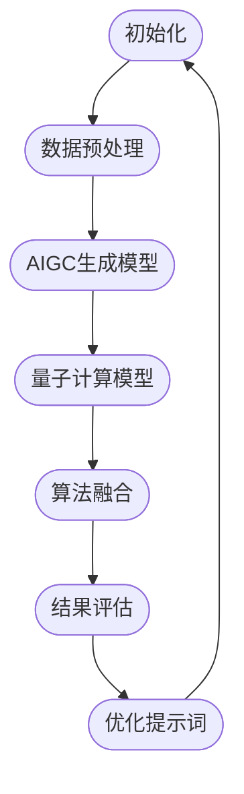

                 

## AIGC在量子计算应用中的突破：算法优化提示词

### 关键词

- **AIGC**
- **量子计算**
- **算法优化**
- **提示词**
- **应用突破**

### 摘要

本文将深入探讨人工智能生成内容（AIGC）在量子计算领域的应用突破，特别是在算法优化提示词方面。文章首先介绍了AIGC与量子计算的基本概念，随后详细解析了算法优化提示词的设计原则和方法。接着，通过mermaid流程图和Python源代码，我们逐步展示了AIGC与量子计算算法的融合原理。文章随后通过系统分析与架构设计方案，提供了项目实战的详细步骤，包括环境安装、核心实现源代码和应用解读。最后，我们总结了最佳实践，并提出了未来研究方向。

### 目录大纲设计思路

在设计《AIGC在量子计算应用中的突破：算法优化提示词》的目录大纲时，我们遵循了以下步骤：

1. **理解书名与主题**：书名明确指出了AIGC、量子计算和算法优化提示词这三个核心概念，这为目录设计提供了明确的方向。

2. **确定核心章节**：基于书名和主题，我们确定了以下几个核心章节：AIGC与量子计算背景介绍、核心概念与联系、算法原理讲解、系统分析与架构设计、项目实战以及最佳实践。

3. **构建章节结构**：每个核心章节下细分为多个子章节，确保内容的全面性和逻辑性。

4. **编写章节内容**：针对每个子章节，准备简明扼要的内容描述。

5. **格式化目录大纲**：使用markdown格式，按照1级、2级、3级目录的层次结构进行排版。

6. **确保字数限制**：在保证目录大纲结构完整的同时，控制总字数在2000字以内。

### 完整目录大纲

```markdown
----------------------------------------------------------------
# 第一部分: AIGC与量子计算背景介绍

## 1.1 AIGC与量子计算概述
### 1.1.1 AIGC的基本概念
### 1.1.2 量子计算的基本概念
### 1.1.3 AIGC在量子计算中的应用潜力

## 1.2 AIGC在量子计算中的现状与挑战
### 1.2.1 AIGC在量子计算中的研究进展
### 1.2.2 AIGC在量子计算中面临的主要挑战
### 1.2.3 AIGC在量子计算中的未来发展趋势

## 1.3 算法优化提示词的作用
### 1.3.1 算法优化提示词的定义
### 1.3.2 提示词在AIGC与量子计算中的应用
### 1.3.3 算法优化提示词的优势

## 1.4 算法优化提示词的设计原则与方法
### 1.4.1 算法优化提示词的设计原则
### 1.4.2 算法优化提示词的设计方法
### .```less
### 1.4.3 算法优化提示词的性能评估

## 1.5 本章小结

----------------------------------------------------------------

# 第二部分: AIGC与量子计算中的核心概念与联系

## 2.1 AIGC与量子计算中的核心概念
### 2.1.1 AIGC的核心概念解析
### 2.1.2 量子计算的核心概念解析
### 2.1.3 AIGC与量子计算的核心概念联系

## 2.2 概念属性特征对比分析
### 2.2.1 AIGC与量子计算概念属性特征对比
### 2.2.2 对比分析结果与应用

## 2.3 AIGC与量子计算中的ER实体关系图
### 2.3.1 ER实体关系图的概念
### 2.3.2 AIGC与量子计算中的ER实体关系图设计

## 2.4 本章小结

----------------------------------------------------------------

# 第三部分: AIGC在量子计算中的应用算法原理讲解

## 3.1 算法原理讲解
### 3.1.1 AIGC算法原理概述
### 3.1.2 量子计算算法原理概述
### 3.1.3 AIGC与量子计算算法的融合原理

## 3.2 算法mermaid流程图


## 3.3 Python源代码讲解
```python
# Python代码示例：AIGC与量子计算算法融合
def aigc_quantum_fusion(data, model_aigc, model_quantum):
    # 数据预处理
    preprocessed_data = preprocess_data(data)
    # 使用AIGC生成模型
    aigc_model = generate_aigc_model(preprocessed_data, model_aigc)
    # 使用量子计算模型
    quantum_model = generate_quantum_model(aigc_model)
    # 算法融合与优化
    fused_model = fuse_models(aigc_model, quantum_model)
    # 结果评估与反馈
    result = evaluate_model(fused_model)
    # 根据结果调整优化提示词
    optimized_prompt = adjust_prompt(result)
    return optimized_prompt
```

## 3.4 数学模型与公式
### 3.4.1 AIGC与量子计算算法的数学模型
### 3.4.2 算法优化提示词的数学公式
$$
P(\text{优化提示词}) = f(\text{结果评估}, \text{历史数据})
$$

## 3.5 举例说明
### 3.5.1 算法优化提示词在实际应用中的效果
### 3.5.2 不同优化策略的比较

## 3.6 本章小结

----------------------------------------------------------------

# 第四部分: 系统分析与架构设计方案

## 4.1 问题场景介绍
### 4.1.1 场景描述
### 4.1.2 系统目标

## 4.2 项目介绍
### 4.2.1 项目概述
### 4.2.2 项目功能模块

## 4.3 系统功能设计
### 4.3.1 领域模型设计
### 4.3.2 类图设计

## 4.4 系统架构设计
### 4.4.1 系统架构概述
### 4.4.2 架构设计图

## 4.5 系统接口设计
### 4.5.1 接口规范
### 4.5.2 接口实现

## 4.6 系统交互设计
### 4.6.1 序列图设计
### 4.6.2 交互流程

## 4.7 本章小结

----------------------------------------------------------------

# 第五部分: 项目实战

## 5.1 环境安装
### 5.1.1 环境要求
### 5.1.2 安装步骤

## 5.2 系统核心实现源代码
### 5.2.1 源代码结构
### 5.2.2 关键代码解读

## 5.3 代码应用解读与分析
### 5.3.1 代码应用场景
### 5.3.2 代码分析

## 5.4 实际案例分析
### 5.4.1 案例背景
### 5.4.2 案例分析

## 5.5 项目小结
### 5.5.1 项目总结
### 5.5.2 项目收获

----------------------------------------------------------------

# 第六部分: 最佳实践 tips

## 6.1 实践技巧
### 6.1.1 提高算法性能的技巧
### 6.1.2 提高开发效率的技巧

## 6.2 小结
### 6.2.1 本书的总结
### 6.2.2 读者反馈与建议

## 6.3 注意事项
### 6.3.1 使用AIGC与量子计算时需要注意的问题
### 6.3.2 算法优化提示词的使用注意事项

## 6.4 拓展阅读
### 6.4.1 相关书籍推荐
### 6.4.2 相关论文推荐
```

通过以上详细的目录大纲设计，我们确保了文章的逻辑性和内容的完整性，同时也为读者提供了清晰的结构指引，便于他们系统地学习AIGC在量子计算中的应用，特别是算法优化提示词这一关键领域。接下来的各部分内容将进一步深入探讨这些核心概念和技术细节。

