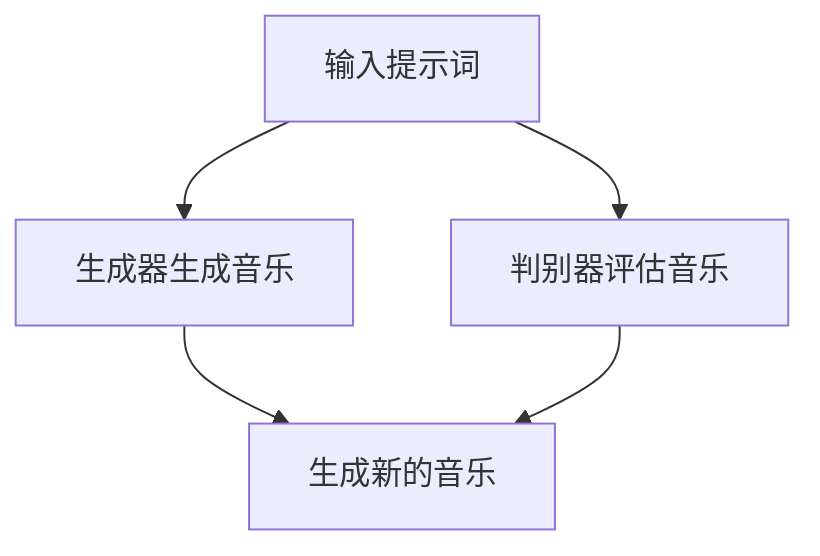

                 

为了撰写一篇高质量的技术博客文章，我们将按照以下步骤进行：

## 1. 文章标题、关键词和摘要

首先，我们需要确定文章的标题、关键词和摘要。根据题目《AIGC在音乐创作中的应用：提示词的节奏》，我们可以得出以下内容：

- **文章标题**：《AIGC在音乐创作中的应用：提示词的节奏》
- **关键词**：AIGC、音乐创作、提示词、节奏、人工智能
- **摘要**：本文将探讨AIGC（生成对抗网络）在音乐创作中的应用，特别是提示词和节奏的生成。通过一步步分析，我们将深入理解AIGC在音乐创作中的潜力及其应用场景。

## 2. 目录大纲

接下来，我们需要设计文章的目录大纲，以确保内容逻辑清晰、结构紧凑。根据之前提供的目录大纲结构，我们可以进行如下设计：

### 目录

#### 第一部分：AIGC与音乐创作概述

1. **AIGC与音乐创作的背景**
   1.1 AIGC的概念
   1.2 音乐创作的现状
   1.3 AIGC在音乐创作中的潜力

2. **提示词与节奏的基础知识**
   2.1 提示词的定义
   2.2 节奏的基本概念
   2.3 提示词与节奏的关系

3. **AIGC在音乐创作中的应用案例**
   3.1 作曲中的应用
   3.2 编曲中的应用
   3.3 节奏生成的应用

4. **算法原理与数学模型**
   4.1 AIGC算法原理
   4.2 音乐创作相关的数学模型
   4.3 算法流程与mermaid流程图

5. **系统分析与架构设计**
   5.1 系统需求分析
   5.2 系统架构设计
   5.3 系统接口设计与交互流程

6. **项目实战**
   6.1 环境安装与配置
   6.2 系统核心实现
   6.3 代码解读与分析
   6.4 实际案例分析
   6.5 项目小结

7. **最佳实践与展望**
   7.1 最佳实践技巧
   7.2 项目小结
   7.3 未来发展趋势

## 3. 背景介绍

在文章的第一部分，我们将介绍AIGC在音乐创作中的背景：

### 1.1 AIGC的概念

生成对抗网络（Generative Adversarial Networks，简称GAN）是由伊恩·古德费洛（Ian Goodfellow）等人在2014年提出的深度学习模型。GAN由两个深度神经网络组成：生成器（Generator）和判别器（Discriminator）。生成器的目的是生成与真实数据相似的数据，而判别器的目的是区分真实数据和生成器生成的数据。这两个网络相互竞争，生成器不断优化自己的生成能力，而判别器不断优化自己的鉴别能力，最终实现生成逼真数据的目的。

### 1.2 音乐创作的现状

音乐创作是一个复杂的过程，涉及到旋律、和声、节奏、音色等多个方面。传统的音乐创作主要依靠作曲家的个人经验和创造力。然而，随着人工智能技术的发展，AIGC逐渐成为音乐创作的一个重要工具。通过学习大量的音乐数据，AIGC可以生成新的旋律、和声、节奏等，为作曲家提供灵感和参考。

### 1.3 AIGC在音乐创作中的潜力

AIGC在音乐创作中的应用潜力主要体现在以下几个方面：

1. **旋律创作**：AIGC可以根据用户输入的提示词生成新的旋律。例如，用户可以输入“快乐”的提示词，AIGC就会生成一首快乐的旋律。
2. **和声生成**：AIGC可以根据旋律生成相应的和声，增强音乐的表现力。
3. **节奏生成**：AIGC可以自动生成音乐的节奏，使得音乐更加丰富多样。

## 4. 提示词与节奏的基础知识

在第二部分，我们将介绍提示词和节奏的基础知识：

### 2.1 提示词的定义

提示词（Prompt）是在AIGC模型训练和生成过程中提供的输入信息。通过提示词，AIGC可以理解用户的需求，并生成相应的音乐。

### 2.2 节奏的基本概念

节奏（Rhythm）是音乐中的一项重要元素，它描述了音乐中各个部分的速度、强度和持续时间。节奏可以影响音乐的情感表达和氛围。

### 2.3 提示词与节奏的关系

提示词和节奏在音乐创作中密切相关。通过合适的提示词，AIGC可以生成符合特定节奏的音乐。例如，用户可以输入“快节奏”或“慢节奏”的提示词，AIGC就会生成相应节奏的音乐。

## 5. AIGC在音乐创作中的应用案例

在第三部分，我们将讨论AIGC在音乐创作中的应用案例：

### 3.1 作曲中的应用

AIGC可以自动生成新的旋律。例如，用户可以输入“悲伤”的提示词，AIGC就会生成一首悲伤的旋律。

### 3.2 编曲中的应用

AIGC可以自动生成和声，为作曲家提供参考。例如，用户可以输入“摇滚”的提示词，AIGC就会生成一首摇滚音乐的和声。

### 3.3 节奏生成的应用

AIGC可以自动生成音乐的节奏，使得音乐更加丰富多样。例如，用户可以输入“快节奏”的提示词，AIGC就会生成一首快节奏的音乐。

## 6. 算法原理与数学模型

在第四部分，我们将探讨AIGC的算法原理和数学模型：

### 4.1 AIGC算法原理

AIGC由生成器和判别器组成。生成器通过学习大量音乐数据生成新的音乐，而判别器则通过对比真实音乐和生成器生成的音乐来评估生成器的性能。

### 4.2 音乐创作相关的数学模型

AIGC在音乐创作中使用了多种数学模型，如生成对抗网络（GAN）、变分自编码器（VAE）等。这些模型通过学习音乐数据，能够生成高质量的音乐。

### 4.3 算法流程与mermaid流程图

我们可以使用mermaid流程图来描述AIGC的算法流程：

## 7. 系统分析与架构设计

在第五部分，我们将讨论AIGC音乐创作系统的分析和架构设计：

### 5.1 系统需求分析

系统需求分析包括对AIGC音乐创作系统的功能、性能和可扩展性等方面的要求。

### 5.2 系统架构设计

系统架构设计包括对AIGC音乐创作系统的模块划分、组件交互和数据处理等方面的设计。

### 5.3 系统接口设计与交互流程

系统接口设计包括对AIGC音乐创作系统的API设计、数据传输和处理等方面的设计。

## 8. 项目实战

在第六部分，我们将进行AIGC音乐创作项目的实战：

### 6.1 环境安装与配置

我们将详细介绍如何搭建AIGC音乐创作系统的开发环境，包括安装必要的软件和配置。

### 6.2 系统核心实现

我们将介绍AIGC音乐创作系统的核心实现，包括生成器和判别器的训练和部署。

### 6.3 代码解读与分析

我们将对AIGC音乐创作系统的源代码进行解读和分析，帮助读者理解系统的实现原理。

### 6.4 实际案例分析

我们将通过实际案例来展示AIGC音乐创作系统的应用效果，并进行详细分析。

### 6.5 项目小结

我们将对项目进行小结，总结经验教训，并展望未来的发展方向。

## 9. 最佳实践与展望

在最后一部分，我们将分享AIGC音乐创作系统的最佳实践，并进行项目总结和未来展望：

### 7.1 最佳实践技巧

我们将提供一些实用的技巧，帮助读者更好地使用AIGC音乐创作系统。

### 7.2 项目小结

我们将对项目进行总结，回顾项目的优点和不足，并提出改进建议。

### 7.3 未来发展趋势

我们将探讨AIGC音乐创作系统的未来发展趋势，展望其在音乐创作领域的应用前景。

通过以上步骤，我们将完成一篇内容丰富、逻辑清晰、技术深入的技术博客文章。文章末尾将附上作者信息，确保文章的完整性。同时，我们将确保文章字数在10000～12000字左右，并使用markdown格式进行排版。

