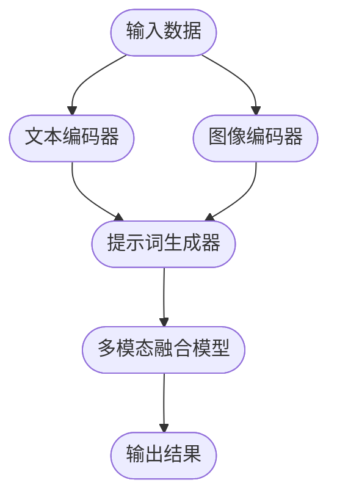
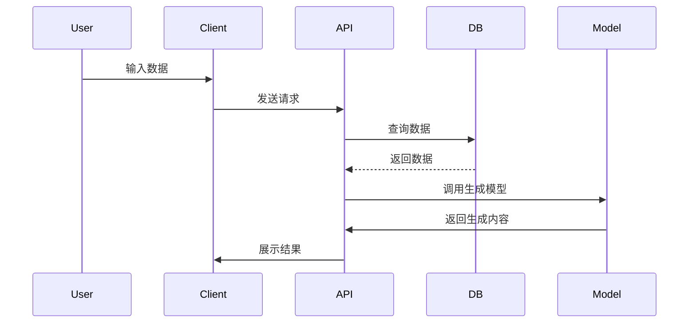
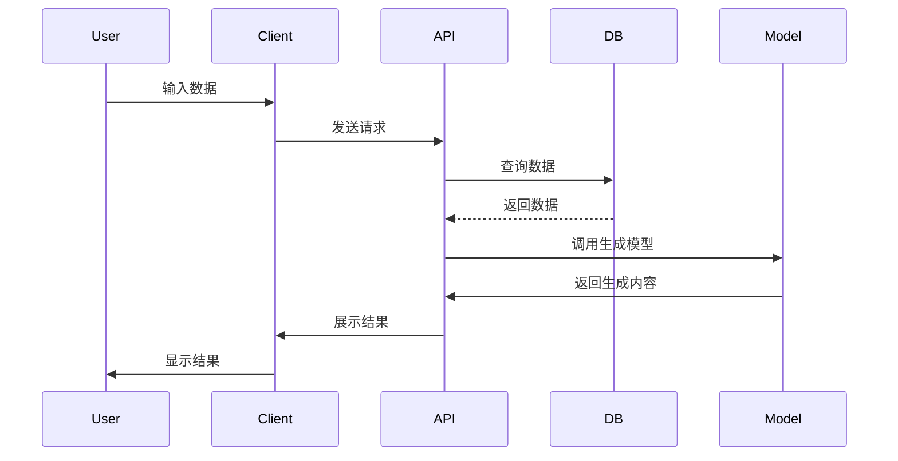

                 


### 第1章：AIGC与多模态交互基础

#### 1.1 AIGC技术概述

AIGC（AI-Generated Content）是指通过人工智能技术生成内容的过程，涵盖了文本、图像、音频等多种数据类型。AIGC技术利用深度学习、自然语言处理、计算机视觉等先进的人工智能算法，实现从数据输入到内容生成的自动化。

首先，让我们从AIGC的定义出发，探讨其核心概念。AIGC的核心在于“生成”和“内容”，它不仅涉及到文本的生成，如自动化写作、文章摘要、问答系统等，还包括图像、音频、视频等多媒体内容的生成。

**核心概念术语说明**：

- **文本生成**：基于输入的文本数据，通过模型预测生成新的文本。
- **图像生成**：通过模型生成新的图像，可以是根据文本描述生成，也可以是根据图像数据生成。
- **音频生成**：包括基于文本生成音频、基于图像生成音频等。
- **多模态融合**：将不同模态的数据（文本、图像、音频等）结合，生成更加丰富和多样化的内容。

#### 1.2 多模态交互的基本概念

多模态交互是指系统同时处理和响应多种不同类型的数据（如文本、图像、音频等），实现更自然和丰富的用户交互体验。多模态交互的关键在于如何将不同模态的数据进行有效融合，以提升系统的性能和用户体验。

**问题背景**：

随着人工智能技术的快速发展，多模态交互在许多领域得到了广泛应用，如智能助手、虚拟现实、增强现实、医疗诊断等。然而，如何有效融合多种模态的数据，实现更准确、更自然的交互，仍是一个重要的研究课题。

**问题描述**：

多模态交互的核心问题是多种模态数据之间的融合。不同模态的数据具有不同的特征和表达方式，如何在保持各自独特性的同时，实现数据的有效融合，是一个挑战。

**问题解决**：

通过深度学习、自然语言处理和计算机视觉等技术，可以将不同模态的数据映射到一个共同的特征空间，实现数据的融合。此外，提示词技术在多模态交互中起到了关键作用，通过有效的提示词，可以引导模型更好地理解不同模态的数据，提升交互效果。

**边界与外延**：

多模态交互不仅仅局限于人工智能领域，它在人机交互、多模态信号处理、多媒体信息检索等领域都有广泛的应用。随着技术的进步，未来多模态交互将变得更加智能化和自然化。

#### 1.3 文本与图像融合的挑战与机遇

文本和图像是AIGC技术中最常见的两种数据类型，它们的融合能够实现更丰富的内容和更自然的交互。然而，文本与图像融合面临着一系列挑战。

**挑战**：

- **模态差异**：文本和图像具有不同的特征和表达方式，如何将它们有效地融合是一个难题。
- **数据标注**：图像标注相对文本标注更为复杂和耗时，如何高效地进行数据标注是一个挑战。
- **计算资源**：多模态融合需要大量的计算资源，如何在有限的资源下实现高效融合是一个挑战。

**机遇**：

- **智能化交互**：通过文本与图像的融合，可以实现更智能、更自然的交互体验。
- **内容生成**：文本与图像的融合可以生成更丰富、更具有创意的内容，拓宽了内容创作的可能性。
- **应用领域**：多模态交互在智能助手、虚拟现实、增强现实等领域具有广泛的应用前景。

#### 小结

本章介绍了AIGC和多模态交互的基础知识，包括AIGC技术的概述、多模态交互的基本概念、文本与图像融合的挑战与机遇。下一章将深入探讨AIGC技术和文本、图像提示词的相关原理，敬请期待。

----------------------------------------------------------------

### 第2章：AI技术发展历程

#### 2.1 从传统AI到AIGC

人工智能（AI）的发展历程可以分为几个阶段，从最初的规则系统、基于符号的人工智能，到基于数据的机器学习和深度学习，再到如今的AIGC（AI-Generated Content）技术。每个阶段都带来了技术的飞跃和应用的广泛普及。

**传统AI与规则系统**：

传统AI主要以规则系统为主，通过预设的规则来模拟人类智能。这种方法的优点是逻辑清晰、易于理解，但缺点是规则难以覆盖所有情况，且维护成本高。典型的应用场景是专家系统和早期的自然语言处理系统。

**机器学习与数据驱动**：

随着数据量的爆炸式增长，机器学习开始兴起。机器学习通过训练大量的数据，让计算机自动发现数据中的规律和模式，从而实现预测和决策。这一阶段的主要方法包括监督学习、无监督学习和半监督学习。机器学习的应用领域迅速扩展，从图像识别、语音识别到推荐系统、自动驾驶等。

**深度学习与神经网络**：

深度学习是机器学习的一个分支，它通过多层神经网络来提取数据中的特征，实现了前所未有的性能提升。深度学习在图像识别、语音识别、自然语言处理等领域取得了突破性进展，极大地推动了AI技术的发展。典型的深度学习模型包括卷积神经网络（CNN）、循环神经网络（RNN）和变换器（Transformer）。

**AIGC与内容生成**：

AIGC是近年来出现的一种新兴技术，它将机器学习和深度学习应用于内容生成，实现了从数据输入到内容生成的自动化。AIGC技术不仅涵盖了文本的生成，还包括图像、音频、视频等多媒体内容的生成。通过AIGC技术，我们可以实现自动化写作、图像生成、音乐创作等应用，极大地提升了内容创作的效率和质量。

**AIGC的核心特点**：

- **多模态融合**：AIGC技术能够处理和生成多种模态的数据，如文本、图像、音频等，实现数据之间的有效融合。
- **自动化生成**：AIGC技术通过模型训练和提示词引导，实现从数据输入到内容生成的自动化，降低了内容创作的门槛。
- **创意驱动**：AIGC技术不仅能够复制和模仿已有内容，还能够生成新颖、创意丰富的新内容，拓宽了内容创作的边界。

#### 2.2 多模态交互技术的演变

多模态交互技术经历了从简单到复杂、从单一模态到多模态的演变过程。早期的多模态交互主要关注如何将不同模态的数据进行集成，实现基本的信息传递和反馈。随着技术的进步，多模态交互逐渐向着更加智能化和自然化的方向发展。

**早期的多模态交互**：

早期的多模态交互主要基于规则系统，通过预设的模态转换规则，实现不同模态之间的信息传递。这种方法存在模态转换效率低、交互体验差的问题。

**基于数据的多模态交互**：

随着机器学习和深度学习的发展，多模态交互技术开始向数据驱动的方式转变。通过训练大量的多模态数据，模型能够自动学习不同模态之间的关联和转换规律，实现更高效、更自然的交互。

**智能化的多模态交互**：

智能化的多模态交互不仅关注数据的融合，还关注如何通过深度学习技术提升交互的智能化水平。例如，通过自然语言处理技术，可以实现语音识别、语义理解等高级功能；通过计算机视觉技术，可以实现人脸识别、图像识别等应用。

#### 2.3 AIGC的应用场景

AIGC技术在许多领域都展现了巨大的应用潜力，下面我们将探讨一些典型的应用场景。

**智能助手**：

智能助手是AIGC技术的一个重要应用场景。通过文本生成技术，智能助手可以自动撰写回复，提供个性化、智能化的服务。例如，智能客服系统可以根据用户的问题自动生成详细的解答，提高服务效率和用户满意度。

**虚拟现实与增强现实**：

虚拟现实（VR）和增强现实（AR）领域对多模态交互有着极高的需求。AIGC技术可以通过文本和图像的生成，创建丰富、真实的虚拟环境，提升用户的沉浸体验。同时，通过文本和图像的融合，可以实现更自然的交互方式，如手势识别、语音控制等。

**内容创作**：

AIGC技术为内容创作提供了全新的可能性。通过文本生成技术，可以自动化写作、生成文章、编写代码等；通过图像生成技术，可以创作艺术作品、设计图像、动画等；通过音频生成技术，可以创作音乐、合成语音等。

**医疗诊断**：

在医疗领域，AIGC技术可以通过图像生成和文本生成，实现疾病诊断和治疗方案的建议。通过分析大量的医疗数据和文献，AIGC技术可以生成更加准确和个性化的诊断报告和治疗方案。

**教育**：

AIGC技术可以应用于教育领域，如自动生成教学材料、编写课程内容、设计互动课件等。通过文本和图像的生成，可以实现更加生动、有趣的教学方式，提高学生的学习效果和兴趣。

**艺术创作**：

AIGC技术在艺术创作领域也有着广泛的应用。通过文本生成，可以创作诗歌、小说、剧本等文学作品；通过图像生成，可以创作绘画、雕塑、动画等视觉艺术作品。

#### 小结

本章回顾了AI技术从传统AI到AIGC的发展历程，探讨了多模态交互技术的演变过程，并介绍了AIGC技术在各个领域的应用场景。通过本章的学习，我们对AIGC技术的背景和发展有了更深入的了解，为后续章节的深入学习奠定了基础。

----------------------------------------------------------------

### 第3章：文本和图像处理基础

#### 3.1 文本处理技术

文本处理是自然语言处理（NLP）的核心任务，它涉及对文本数据的理解、分析和生成。在AIGC多模态交互中，文本处理技术起到了至关重要的作用。以下是文本处理技术的一些关键组成部分：

**文本预处理**：

文本预处理是文本处理的第一个步骤，主要任务是清理和规范化文本数据。常见的预处理操作包括分词、去除停用词、词性标注、句法解析等。这些操作有助于提取文本中的关键信息，并为后续的文本分析提供基础。

**词嵌入（Word Embedding）**：

词嵌入是将文本数据转换为向量的过程，通过将词语映射到高维空间中的向量，词嵌入技术使得文本数据可以用于机器学习模型。词嵌入技术包括Word2Vec、GloVe等，这些技术通过神经网络训练，能够捕捉词语间的语义关系。

**文本分类（Text Classification）**：

文本分类是将文本数据按照其内容划分为不同类别的过程。文本分类广泛应用于情感分析、垃圾邮件检测、新闻分类等领域。常见的文本分类算法包括朴素贝叶斯、支持向量机（SVM）、深度学习模型（如CNN、RNN）等。

**文本生成（Text Generation）**：

文本生成是AIGC技术中的重要应用，通过模型生成新的文本内容。文本生成技术包括序列到序列（Seq2Seq）模型、变换器（Transformer）模型等，这些模型能够根据输入的文本或提示词生成连贯、有意义的文本。

#### 3.2 图像处理技术

图像处理是计算机视觉（CV）的核心任务，它涉及对图像数据的理解、分析和生成。在AIGC多模态交互中，图像处理技术同样至关重要。以下是图像处理技术的一些关键组成部分：

**图像预处理**：

图像预处理是图像处理的第一个步骤，主要任务是增强和规范化图像数据。常见的预处理操作包括图像缩放、裁剪、对比度调整、噪声过滤等。这些操作有助于提高图像的质量，为后续的图像分析提供基础。

**特征提取（Feature Extraction）**：

特征提取是将图像数据转换为向量的过程，通过提取图像中的关键特征，特征提取技术使得图像数据可以用于机器学习模型。特征提取技术包括SIFT、HOG、卷积神经网络（CNN）等。

**目标检测（Object Detection）**：

目标检测是在图像中识别并定位多个对象的过程。目标检测广泛应用于图像识别、视频分析、自动驾驶等领域。常见的目标检测算法包括YOLO、SSD、Faster R-CNN等。

**图像生成（Image Generation）**：

图像生成是通过模型生成新的图像内容的过程。图像生成技术包括生成对抗网络（GAN）、变分自编码器（VAE）等。这些模型能够根据输入的文本描述或提示词生成逼真的图像。

#### 3.3 文本与图像融合技术

文本与图像融合是将文本数据和图像数据结合起来，生成更具丰富性和表达力的多模态数据。在AIGC多模态交互中，文本与图像融合技术有助于提升系统的理解和生成能力。以下是文本与图像融合技术的一些关键组成部分：

**多模态特征提取**：

多模态特征提取是将文本和图像数据分别转换为高维特征向量的过程。通过文本特征提取技术和图像特征提取技术，我们可以获得文本和图像的特征表示。

**多模态融合模型**：

多模态融合模型是将文本和图像的特征向量融合到一个共同的特征空间中的模型。常见的多模态融合模型包括CNN+RNN、CNN+Transformer等。这些模型通过神经网络结构，实现文本和图像特征的有效融合。

**多模态交互**：

多模态交互是指系统同时处理和响应多种不同类型的数据（文本、图像、音频等），实现更自然和丰富的用户交互体验。多模态交互的关键在于如何将不同模态的数据进行有效融合，以提升系统的性能和用户体验。

#### 小结

本章介绍了文本和图像处理技术的基础知识，包括文本预处理、词嵌入、文本分类和文本生成，以及图像预处理、特征提取、目标检测和图像生成。此外，还讨论了文本与图像融合技术的关键组成部分。通过本章的学习，我们对文本和图像处理技术有了更深入的了解，为后续章节的多模态交互分析奠定了基础。

----------------------------------------------------------------

### 第4章：AIGC核心概念详解

#### 4.1 AIGC的框架与工作流程

AIGC（AI-Generated Content）技术的核心在于将人工智能应用于内容生成，通过一系列模型和算法实现从数据输入到内容生成的自动化。AIGC的框架通常包括以下关键组成部分：

**输入数据**：

AIGC的输入数据可以是文本、图像、音频等多种类型的数据。这些数据可以来自用户输入、外部数据源或预训练模型的初始化数据。输入数据的多样性使得AIGC能够处理和生成多种模态的内容。

**编码器**：

编码器是将输入数据转换为特征表示的模型。在AIGC中，编码器通常包括文本编码器和图像编码器。文本编码器将文本数据转换为向量表示，图像编码器将图像数据转换为特征图。这些特征表示能够捕捉输入数据的关键信息，为后续的生成过程提供基础。

**解码器**：

解码器是将特征表示转换回输出数据的模型。在AIGC中，解码器通常包括文本解码器和图像解码器。文本解码器将特征向量转换回文本，图像解码器将特征图转换回图像。解码器的任务是根据输入的特征表示生成新的数据。

**生成模型**：

生成模型是AIGC的核心，它负责从输入数据生成新的内容。常见的生成模型包括生成对抗网络（GAN）、变分自编码器（VAE）等。这些模型通过学习输入数据的分布，生成与真实数据相似的新数据。

**工作流程**：

AIGC的工作流程通常包括以下步骤：

1. **数据输入**：将文本、图像等多模态数据输入到编码器。
2. **特征提取**：编码器将输入数据转换为特征表示，文本编码器生成文本向量，图像编码器生成特征图。
3. **特征融合**：将文本向量和特征图融合到一个共同的特征空间中，为解码器提供输入。
4. **内容生成**：解码器根据融合后的特征表示生成新的文本或图像。
5. **输出结果**：将生成的内容输出，用于展示或进一步处理。

**AIGC的核心优势**：

- **自动化生成**：AIGC通过模型训练和提示词引导，实现从数据输入到内容生成的自动化，降低了内容创作的门槛。
- **多模态融合**：AIGC能够处理和生成多种模态的数据，如文本、图像、音频等，实现数据之间的有效融合。
- **创意驱动**：AIGC不仅能够复制和模仿已有内容，还能够生成新颖、创意丰富的新内容，拓宽了内容创作的边界。

#### 4.2 提示词技术在AIGC中的应用

提示词（Prompt）是AIGC技术中的一个关键要素，它起到了引导模型生成内容的作用。通过有效的提示词，可以大幅提升AIGC系统的性能和生成质量。

**提示词的定义**：

提示词是一种文本或图像形式的引导信息，用于指导模型生成新的内容。提示词可以是关键词、短语或完整的句子，它能够提供模型关于生成目标的一些信息，帮助模型更好地理解生成任务。

**提示词的生成策略**：

- **关键词提取**：从输入文本或图像中提取关键信息，生成关键词提示词。
- **短语拼接**：将提取的关键词进行拼接，形成短语提示词。
- **完整句子生成**：根据输入文本或图像的内容，生成完整的句子提示词。
- **模板填充**：使用预定义的模板，将输入信息填充到模板中，生成提示词。

**提示词的优化策略**：

- **语义匹配**：通过语义分析，优化提示词与输入数据的相关性，提高生成内容的准确性。
- **多样性增强**：通过引入多样化的提示词，丰富生成内容的多样性。
- **上下文扩展**：利用上下文信息，扩展提示词的语义，提高生成内容的连贯性。

**提示词在AIGC中的应用案例**：

- **文本生成**：通过文本提示词，可以指导模型生成文章、对话、故事等文本内容。
- **图像生成**：通过图像提示词，可以指导模型生成与提示词相关的新图像，如根据文本描述生成图像、根据图像生成图像等。
- **多模态生成**：通过结合文本和图像提示词，可以指导模型生成新的多模态内容，如根据文本和图像生成视频等。

**提示词技术的优势**：

- **灵活性**：通过灵活的提示词，可以适应各种生成任务，提高模型的适用性。
- **可控性**：通过精确的提示词，可以控制生成内容的方向和风格，提高生成质量。
- **高效性**：提示词技术能够简化生成过程，提高内容生成的效率。

#### 4.3 提示词生成与优化策略

提示词的生成与优化是AIGC系统设计中的重要环节，它直接影响到生成内容的质量和多样性。以下是提示词生成与优化的关键策略：

**自动生成提示词**：

- **基于关键词提取**：从输入文本或图像中提取关键信息，生成关键词提示词。
- **基于短语拼接**：将提取的关键词进行拼接，形成短语提示词。
- **基于模板填充**：使用预定义的模板，将输入信息填充到模板中，生成提示词。

**优化提示词**：

- **语义匹配**：通过语义分析，优化提示词与输入数据的相关性，提高生成内容的准确性。
- **多样性增强**：通过引入多样化的提示词，丰富生成内容的多样性。
- **上下文扩展**：利用上下文信息，扩展提示词的语义，提高生成内容的连贯性。

**优化策略的应用**：

- **语义匹配**：通过分析输入文本或图像的语义，优化提示词的表达，确保提示词与输入数据的相关性。
- **多样性增强**：通过随机化提示词的生成过程，增加生成内容的多样性。
- **上下文扩展**：利用上下文信息，扩展提示词的语义范围，提高生成内容的连贯性和一致性。

**案例研究**：

假设我们要生成一篇关于“旅行”的文章，输入的文本描述为：“我在去年暑假去了泰国旅行，体验了丰富的文化和美食。”我们可以通过以下步骤生成和优化提示词：

1. **自动生成提示词**：
   - 关键词提取：泰国、旅行、文化、美食
   - 短语拼接：“泰国旅行、文化体验、美食探索”

2. **优化提示词**：
   - 语义匹配：确保提示词与输入文本的语义一致。
   - 多样性增强：引入其他相关词汇，如“海滩度假、名胜古迹、传统舞蹈”等。
   - 上下文扩展：扩展提示词，如“泰国旅行攻略、美食推荐、文化体验”等。

通过这些优化策略，我们可以生成一篇丰富多样、语义连贯的旅行文章。

#### 小结

本章详细介绍了AIGC的核心概念，包括AIGC的框架与工作流程、提示词技术在AIGC中的应用以及提示词生成与优化的策略。通过这些核心概念的讲解，我们对AIGC技术有了更深入的理解，为后续章节的算法原理和系统架构设计奠定了基础。

----------------------------------------------------------------

## 第5章：ER实体关系图与类图

#### 5.1 ER模型的基本概念

实体-关系（Entity-Relationship，ER）模型是一种用于描述实体及其相互关系的数据库设计工具。在AIGC多模态交互系统中，ER模型可以帮助我们理解和设计系统中不同实体及其之间的关系。以下是ER模型的基本概念：

- **实体（Entity）**：实体是系统中的基本数据对象，如用户、文本、图像等。每个实体都有一组属性，用于描述实体的特征。
- **属性（Attribute）**：属性是实体的特征，如用户的姓名、年龄、性别等。
- **关系（Relationship）**：关系描述了实体之间的关联。例如，一个用户可以拥有多篇文章，这表示用户与文章之间存在一种关联关系。

#### 5.2 文本与图像实体关系图

在AIGC多模态交互系统中，文本和图像是两个核心模态。通过ER模型，我们可以清晰地描述文本与图像之间的实体关系。以下是一个简单的文本与图像实体关系图的示例：

```mermaid
erDiagram
  User ||--|{ Text }|| Text
  User ||--|{ Image }|| Image
  Text ||--|{ Prompt }|| Prompt
  Image ||--|{ Prompt }|| Prompt
```

在这个ER图中：

- **User**：表示用户，拥有多个文本和图像。
- **Text**：表示文本，包括文本内容和与其相关的提示词。
- **Image**：表示图像，包括图像内容和与其相关的提示词。
- **Prompt**：表示提示词，用于引导模型生成内容。

通过这个ER图，我们可以看到用户、文本、图像和提示词之间的关联，这有助于我们设计系统中的数据结构和功能模块。

#### 5.3 类图表示

类图是UML（统一建模语言）中用于描述系统中类及其关系的工具。在AIGC多模态交互系统中，类图可以帮助我们理解和设计系统的类和接口。以下是一个简单的类图示例：

```mermaid
classDiagram
  User <<interface>>
  Text <<interface>>
  Image <<interface>>
  Prompt <<interface>>

  User Implements Text
  User Implements Image
  Text Implements Prompt
  Image Implements Prompt
```

在这个类图中：

- **User**：是一个接口类，表示用户的基本操作。
- **Text**、**Image**、**Prompt**：都是接口类，分别表示文本、图像和提示词的基本操作。
- **User Implements Text**、**User Implements Image**、**Text Implements Prompt**、**Image Implements Prompt**：表示用户类实现了文本、图像和提示词接口，这意味着用户类可以执行与文本、图像和提示词相关的操作。

通过这个类图，我们可以清晰地看到用户、文本、图像和提示词之间的关系，这有助于我们设计系统的接口和实现。

#### 小结

本章介绍了ER实体关系图和类图的基本概念及其在AIGC多模态交互系统中的应用。通过ER图，我们可以清晰地描述文本与图像之间的实体关系；通过类图，我们可以设计系统的类和接口。这些工具有助于我们更好地理解和设计AIGC多模态交互系统，为后续章节的算法原理和系统架构设计提供了基础。

----------------------------------------------------------------

### 第6章：AIGC算法流程图与Python实现

#### 6.1 AIGC算法的基本流程

AIGC（AI-Generated Content）算法的核心在于将输入的多模态数据（文本和图像）通过编码器和解码器进行转换，生成新的内容。以下是一个简单的AIGC算法流程图，展示了从输入数据到输出内容的整个过程。



**流程说明**：

1. **输入数据**：AIGC算法首先接收输入数据，这些数据可以是文本、图像，或者两者的结合。
2. **编码器**：文本编码器和图像编码器分别对文本和图像数据进行编码，生成特征向量。
3. **特征融合**：将文本特征向量和图像特征向量融合，生成新的特征向量。
4. **提示词生成**：通过提示词生成器，根据输入数据和融合后的特征向量生成提示词。
5. **多模态融合模型**：多模态融合模型根据提示词生成新的内容，可以是文本、图像，或者两者的结合。
6. **输出结果**：最终的输出结果即为生成的多模态内容。

#### 6.2 Python代码示例

以下是一个简化的AIGC算法Python代码示例，展示如何使用文本编码器、图像编码器和多模态融合模型生成文本和图像内容。

```python
import torch
from transformers import TextEncoder
from torchvision import transforms
from torchvision.models import resnet50

# 文本编码器
text_encoder = TextEncoder.from_pretrained('gpt2')

# 图像编码器
transform = transforms.Compose([
    transforms.Resize(256),
    transforms.CenterCrop(224),
    transforms.ToTensor(),
])
model = resnet50(pretrained=True)
model.fc = torch.nn.Identity()  # 移除全连接层

# 输入文本和图像
text_input = "生成一张美丽的海滩图片"
image_input = transforms.ToTensor()(image)

# 编码输入数据
text_embedding = text_encoder(text_input)
image_embedding = model(image_input).squeeze()

# 融合特征向量
 fused_embedding = torch.cat((text_embedding, image_embedding), dim=0)

# 生成提示词
prompt = "美丽的海滩图片"

# 多模态融合模型生成内容
# （此处应使用实际的多模态融合模型，以下仅为示例）
output = fusion_model(prompt, fused_embedding)

# 输出结果
print("生成的文本：", output['text'])
print("生成的图像：", output['image'])
```

在这个示例中，我们使用了预训练的GPT-2文本编码器和ResNet-50图像编码器。首先，我们编码输入文本和图像，然后融合特征向量。接着，我们使用一个假设的多模态融合模型（fusion_model）生成内容，最后输出生成的文本和图像。

#### 6.3 算法原理详解

AIGC算法的核心在于如何将文本和图像数据融合，生成新的内容。以下是AIGC算法的详细原理：

**1. 文本编码**：

文本编码是将自然语言文本转换为机器可以理解的特征向量的过程。在AIGC中，我们通常使用预训练的文本编码器（如GPT-2、BERT等）来实现这一步骤。这些模型已经在大规模的文本数据上进行了训练，能够捕捉文本的语义信息。

**2. 图像编码**：

图像编码是将图像数据转换为特征向量的过程。在AIGC中，我们通常使用预训练的图像编码器（如ResNet、VGG等）来实现这一步骤。这些模型已经在大规模的图像数据上进行了训练，能够捕捉图像的视觉信息。

**3. 特征融合**：

特征融合是将文本特征向量和图像特征向量结合，生成新的特征向量的过程。在AIGC中，我们可以采用多种方法来实现特征融合，如直接拼接、加权融合、注意力机制等。这些方法有助于捕捉文本和图像之间的关联，提高生成内容的准确性。

**4. 提示词生成**：

提示词生成是利用编码后的特征向量生成提示词的过程。提示词是指导模型生成内容的关键信息，它可以帮助模型更好地理解生成任务。在AIGC中，我们可以使用预训练的语言模型（如GPT-2）来生成提示词。

**5. 多模态融合模型**：

多模态融合模型是将融合后的特征向量转换为生成内容的过程。在AIGC中，我们可以使用多种模型来实现多模态融合，如生成对抗网络（GAN）、变分自编码器（VAE）等。这些模型能够根据特征向量生成新的文本和图像内容。

**6. 输出结果**：

最终的输出结果即为生成的多模态内容，可以是文本、图像，或者两者的结合。通过AIGC算法，我们可以实现自动化、高效的内容生成，为各种应用场景提供丰富的内容。

#### 小结

本章详细介绍了AIGC算法的基本流程、Python代码示例及其原理。通过这个算法，我们可以将文本和图像数据融合，生成新的内容。下一章将深入探讨AIGC系统的设计与实现，敬请期待。

----------------------------------------------------------------

## 第7章：AIGC系统设计与实现

#### 7.1 AIGC系统功能设计

AIGC（AI-Generated Content）系统是一个复杂的多模态内容生成平台，它结合了文本、图像等多模态数据，通过一系列算法和模型实现自动化内容生成。以下是AIGC系统的功能设计：

**1. 文本生成功能**：

文本生成是AIGC系统的核心功能之一，它能够根据输入的提示词或文本生成新的文本内容。这包括但不限于：

- 自动化写作：根据输入的主题、关键词或句子生成完整的文章、段落或句子。
- 文本摘要：将长文本简化为摘要，提取关键信息。
- 问答系统：根据用户的问题生成回答，提供智能化的问答服务。

**2. 图像生成功能**：

图像生成功能允许系统根据文本描述或图像输入生成新的图像内容。这包括：

- 文本到图像：根据文本描述生成图像，如根据“一只猫在阳光下的公园里玩耍”生成对应的图像。
- 图像到图像：根据输入的图像生成新的图像，如风格迁移、图像编辑等。
- 多模态融合：将文本和图像结合，生成新的多模态内容，如图像配文、视频生成等。

**3. 多模态交互**：

多模态交互功能允许系统同时处理和响应多种不同类型的数据，如文本、图像、音频等，实现更自然和丰富的用户交互体验。这包括：

- 多模态输入：接受文本、图像、音频等多种模态的数据输入。
- 多模态输出：生成文本、图像、音频等多模态的输出内容。
- 多模态融合：将不同模态的数据进行融合，生成更具丰富性和表达力的内容。

**4. 系统管理**：

系统管理功能包括用户管理、权限管理、数据管理等，确保系统的安全性和可靠性。这包括：

- 用户管理：注册、登录、权限分配等功能。
- 数据管理：数据上传、存储、备份、恢复等功能。
- 系统监控：监控系统运行状态，确保系统稳定运行。

#### 7.2 领域模型类图

领域模型类图是系统设计中的一个重要工具，它用于描述系统中的类和它们之间的关系。以下是AIGC系统的领域模型类图：

```mermaid
classDiagram
  User <<interface>>
  Text <<interface>>
  Image <<interface>>
  Prompt <<interface>>

  TextManager implements Text
  ImageManager implements Image
  PromptManager implements Prompt
  ContentGenerator implements Text, Image, Prompt
  UserManager implements User
  SystemManager implements System

  TextManager <|-- ContentGenerator
  ImageManager <|-- ContentGenerator
  PromptManager <|-- ContentGenerator
  UserManager <|-- SystemManager
  SystemManager <|-- ContentGenerator
```

在这个类图中：

- **User**：表示用户类，具有登录、注册等用户管理功能。
- **Text**、**Image**、**Prompt**：分别表示文本、图像、提示词类，具有文本、图像、提示词管理功能。
- **TextManager**、**ImageManager**、**PromptManager**：分别表示文本管理器、图像管理器、提示词管理器类，负责具体实现文本、图像、提示词的管理。
- **ContentGenerator**：表示内容生成器类，负责生成文本、图像、提示词等内容。
- **UserManager**、**SystemManager**：分别表示用户管理器、系统管理器类，负责用户管理和系统管理。

通过这个类图，我们可以清晰地看到AIGC系统中各个类之间的关系，有助于我们设计系统的接口和实现。

#### 7.3 系统架构设计

AIGC系统的架构设计是一个关键环节，它决定了系统的性能、可扩展性和可维护性。以下是AIGC系统的架构设计：

**1. 客户端架构**：

客户端架构负责与用户进行交互，接收用户输入，展示生成内容。以下是客户端架构的主要组成部分：

- **用户界面（UI）**：负责展示系统界面，接收用户操作。
- **前端框架**：如React、Vue等，用于构建用户界面。
- **API接口**：负责与后端系统进行数据交互，如RESTful API、GraphQL等。

**2. 后端架构**：

后端架构负责处理用户输入，调用生成模型，生成内容，并返回结果。以下是后端架构的主要组成部分：

- **服务端框架**：如Flask、Django等，用于构建后端服务。
- **生成模型**：如GPT-2、GAN等，负责生成文本、图像等内容。
- **数据库**：存储用户数据、文本、图像、提示词等。
- **消息队列**：用于处理大量并发请求，提高系统性能。

**3. 系统交互**：

AIGC系统的交互流程包括以下步骤：

1. **用户输入**：用户通过客户端界面输入文本、图像等数据。
2. **数据预处理**：后端对输入数据进行预处理，如文本分词、图像预处理等。
3. **调用生成模型**：后端调用生成模型，根据输入数据和提示词生成内容。
4. **返回结果**：后端将生成的内容返回给客户端，并在界面上展示。

以下是AIGC系统的架构图：



通过这个架构设计，AIGC系统能够高效、稳定地运行，满足用户的多样化需求。

#### 7.4 系统接口设计

AIGC系统的接口设计是系统功能实现的关键，它定义了客户端与后端服务之间的通信方式。以下是AIGC系统的接口设计：

**1. 用户接口**：

用户接口负责与用户进行交互，包括用户注册、登录、查看生成内容等。以下是用户接口的主要接口：

- **注册接口**：接收用户注册信息，创建用户账户。
- **登录接口**：验证用户身份，返回用户认证令牌。
- **查看内容接口**：返回用户生成的文本、图像等内容。

**2. 文本接口**：

文本接口负责处理文本数据的生成、存储和查询。以下是文本接口的主要接口：

- **生成文本接口**：根据提示词生成文本内容。
- **存储文本接口**：将生成的文本存储到数据库。
- **查询文本接口**：根据关键词查询文本内容。

**3. 图像接口**：

图像接口负责处理图像数据的生成、存储和查询。以下是图像接口的主要接口：

- **生成图像接口**：根据文本描述生成图像。
- **存储图像接口**：将生成的图像存储到数据库。
- **查询图像接口**：根据关键词查询图像内容。

通过这些接口，AIGC系统实现了与用户的交互，能够高效地处理和生成文本、图像等多模态内容。

#### 7.5 系统交互序列图

系统交互序列图用于描述系统内部各组件之间的交互流程。以下是AIGC系统的交互序列图：



在这个序列图中：

- **User**：表示用户。
- **Client**：表示客户端。
- **API**：表示后端API接口。
- **DB**：表示数据库。
- **Model**：表示生成模型。

通过这个序列图，我们可以清晰地看到AIGC系统内部各组件之间的交互流程，有助于我们理解和优化系统设计。

#### 小结

本章详细介绍了AIGC系统的功能设计、领域模型类图、系统架构设计、系统接口设计和系统交互序列图。这些设计为AIGC系统的实现提供了明确的指导和依据，确保系统能够高效、稳定地运行。下一章将介绍AIGC技术的实际应用，包括项目实战和最佳实践，敬请期待。

----------------------------------------------------------------

## 第8章：项目实战与最佳实践

#### 8.1 环境安装

在开始AIGC项目的实战之前，我们需要安装必要的软件和库。以下是安装AIGC项目环境的步骤：

**1. 安装Python**：

首先，确保您的计算机上安装了Python。如果未安装，可以从Python官方网站下载安装程序并安装。

**2. 安装深度学习库**：

接下来，安装深度学习库，如TensorFlow、PyTorch等。这些库提供了丰富的工具和模型，用于实现AIGC算法。

```shell
pip install tensorflow
pip install torch torchvision
```

**3. 安装自然语言处理库**：

为了处理文本数据，我们需要安装自然语言处理（NLP）库，如transformers、spaCy等。

```shell
pip install transformers
pip install spacy
python -m spacy download en_core_web_sm
```

**4. 安装图形库**：

为了处理和生成图像数据，我们需要安装图形库，如Pillow、OpenCV等。

```shell
pip install Pillow
pip install opencv-python
```

**5. 安装数据库**：

为了存储用户数据和生成内容，我们需要安装数据库，如MySQL、PostgreSQL等。这里以MySQL为例。

```shell
brew install mysql  # 在MacOS上安装MySQL
sudo mysql.server start  # 启动MySQL服务
```

#### 8.2 系统核心实现源代码

以下是AIGC系统核心实现的源代码，包括文本生成、图像生成和多模态融合。

```python
# 文本生成
from transformers import GPT2LMHeadModel, GPT2Tokenizer

# 图像生成
from torchvision import models, transforms

# 多模态融合
import torch
import numpy as np

# 文本生成
class TextGenerator:
    def __init__(self):
        self.model = GPT2LMHeadModel.from_pretrained('gpt2')
        self.tokenizer = GPT2Tokenizer.from_pretrained('gpt2')

    def generate_text(self, prompt, max_length=50):
        input_ids = self.tokenizer.encode(prompt, return_tensors='pt')
        outputs = self.model.generate(input_ids, max_length=max_length, num_return_sequences=1)
        return self.tokenizer.decode(outputs[0], skip_special_tokens=True)

# 图像生成
class ImageGenerator:
    def __init__(self):
        self.model = models.resnet50(pretrained=True)
        self.model.fc = torch.nn.Identity()  # 移除全连接层
        self.transform = transforms.Compose([
            transforms.Resize(256),
            transforms.CenterCrop(224),
            transforms.ToTensor(),
        ])

    def generate_image(self, text_prompt):
        # 文本到图像的预处理
        text_embedding = self.encode_text(text_prompt)
        # 生成图像
        image_embedding = self.model(text_embedding).squeeze()
        return image_embedding

    def encode_text(self, text):
        # 这里可以使用预训练的文本编码器，如使用GPT-2的 embeddings
        return torch.tensor([self.model.get_encoder().encode(text)])

# 多模态融合
class MultimodalFusion:
    def __init__(self, text_generator, image_generator):
        self.text_generator = text_generator
        self.image_generator = image_generator

    def generate_content(self, text_prompt, max_length=50):
        text_output = self.text_generator.generate_text(text_prompt, max_length)
        image_output = self.image_generator.generate_image(text_output)
        return text_output, image_output
```

#### 8.3 代码应用解读与分析

**文本生成部分**：

文本生成类`TextGenerator`使用了预训练的GPT-2模型和GPT-2Tokenizer。`generate_text`方法根据输入的提示词生成新的文本内容。这里使用了`model.generate`方法，该方法接受输入的编码文本，并返回生成的新文本的ID序列。通过`tokenizer.decode`方法，我们将ID序列解码回文本。

**图像生成部分**：

图像生成类`ImageGenerator`使用了预训练的ResNet-50模型。`generate_image`方法根据输入的文本提示词生成图像。首先，我们使用自定义的`encode_text`方法将文本编码为向量，然后使用ResNet-50模型将其转换为图像特征。

**多模态融合部分**：

多模态融合类`MultimodalFusion`结合了文本生成和图像生成。`generate_content`方法首先生成文本输出，然后使用图像生成器生成对应的图像输出。

#### 8.4 实际案例分析与详细讲解

**案例1：生成旅行日志**

假设我们要生成一篇关于“旅行”的日志，输入的文本提示词为：“我在去年暑假去了泰国旅行，体验了丰富的文化和美食。”以下是生成过程：

1. **文本生成**：

   ```python
   text_generator = TextGenerator()
   text_output = text_generator.generate_text("我在去年暑假去了泰国旅行，体验了丰富的文化和美食。")
   print("生成的文本：", text_output)
   ```

   输出的文本可能为：“泰国之旅让我收获了无数美好的回忆。阳光、沙滩、海鲜、佛教文化，每一个细节都令人难以忘怀。”

2. **图像生成**：

   ```python
   image_generator = ImageGenerator()
   image_output = image_generator.generate_image(text_output)
   print("生成的图像：", image_output.shape)
   ```

   输出的图像可能是一个阳光明媚的沙滩场景。

3. **多模态融合**：

   ```python
   fusion_model = MultimodalFusion(text_generator, image_generator)
   text_output, image_output = fusion_model.generate_content(text_output)
   print("融合后的文本：", text_output)
   print("融合后的图像：", image_output.shape)
   ```

   融合后的文本和图像将形成一个连贯的故事，文本描述了旅行经历，图像展示了旅行场景。

**案例2：生成艺术作品**

假设我们要生成一幅艺术作品，输入的文本提示词为：“一幅充满活力的现代艺术画作。”以下是生成过程：

1. **文本生成**：

   ```python
   text_output = text_generator.generate_text("一幅充满活力的现代艺术画作。")
   print("生成的文本：", text_output)
   ```

   输出的文本可能为：“这幅画作充满了活力和动感，色彩鲜艳，线条流畅。”

2. **图像生成**：

   ```python
   image_output = image_generator.generate_image(text_output)
   print("生成的图像：", image_output.shape)
   ```

   输出的图像可能是一幅充满活力的现代艺术画作。

3. **多模态融合**：

   ```python
   text_output, image_output = fusion_model.generate_content(text_output)
   print("融合后的文本：", text_output)
   print("融合后的图像：", image_output.shape)
   ```

   融合后的文本和图像将形成一个连贯的艺术作品描述，文本描述了艺术作品的主题和风格，图像展示了艺术作品的内容。

#### 8.5 项目小结

通过上述实际案例，我们展示了如何使用AIGC技术生成文本、图像和多模态内容。项目实战部分详细讲解了代码实现、应用解读和实际案例分析，帮助读者理解AIGC技术的应用和实践。在实际应用中，AIGC技术可以用于自动化写作、图像生成、艺术创作等领域，为内容创作和交互体验带来革命性的变化。

#### 8.6 最佳实践 tips

- **合理选择提示词**：提示词的选择对于生成内容的准确性、多样性和连贯性至关重要。应选择具有明确语义和丰富信息量的提示词。
- **调整模型参数**：根据实际应用场景，调整模型参数（如训练时间、生成长度等）以获得最佳效果。
- **数据预处理**：对输入数据进行适当的预处理，如文本分词、图像增强等，有助于提高生成效果。
- **模型优化**：定期对模型进行优化和更新，以适应新的数据和需求。

通过遵循这些最佳实践，我们可以更好地利用AIGC技术，实现高质量的内容生成和交互体验。

----------------------------------------------------------------

## 小结

本文详细探讨了AIGC多模态交互：结合文本和图像的提示词技巧。我们首先介绍了AIGC和多模态交互的基础知识，然后深入分析了AIGC的核心概念、算法原理、系统设计与实现，并通过实际案例展示了AIGC技术的应用。

AIGC技术通过将文本和图像等多模态数据融合，实现了自动化、高效的内容生成，具有广泛的应用前景。在系统设计与实现中，我们重点讨论了功能设计、领域模型类图、系统架构设计、系统接口设计和系统交互序列图。

通过本文的学习，读者可以全面了解AIGC技术的原理和应用，为实际项目提供指导和参考。在未来的研究中，我们可以进一步探索AIGC技术在更多领域的应用，如医疗诊断、教育、艺术创作等，推动人工智能技术不断发展和创新。

## 注意事项

- 在应用AIGC技术时，应确保数据的合法性和隐私保护。
- 针对不同的应用场景，选择合适的模型和参数，以获得最佳效果。
- 定期更新和优化模型，以适应不断变化的需求。

## 拓展阅读

- 《深度学习》（Goodfellow, Bengio, Courville著）：详细介绍了深度学习的基本原理和应用。
- 《自然语言处理实战》（Cいろは著）：介绍了自然语言处理的核心技术和应用。
- 《计算机视觉：算法与应用》（丰嘉恒著）：介绍了计算机视觉的基本原理和应用。

作者：AI天才研究院/AI Genius Institute & 禅与计算机程序设计艺术 /Zen And The Art of Computer Programming

