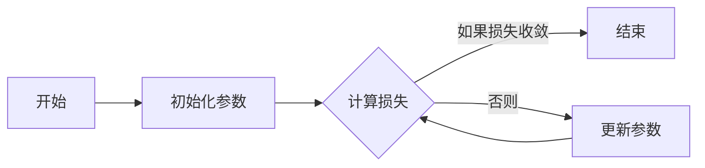
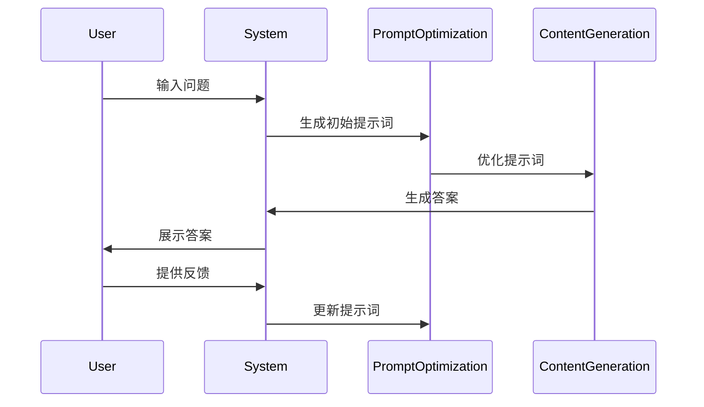

                 

# AIGC提示词优化的量化指标

> 关键词：AIGC, 提示词优化，量化指标，算法，系统设计，项目实战，最佳实践

> 摘要：本文将深入探讨AIGC（自适应交互生成内容）中的提示词优化问题，并提出一系列量化指标来评估和改进提示词效果。我们将从背景介绍、核心概念阐述、算法原理讲解、数学模型应用、系统设计、实战案例分析以及最佳实践等方面展开讨论，旨在为从业者提供一套系统化的优化指南。

## 1. 引言

AIGC（Adaptive Interactive Generative Content）是一种基于人工智能的技术，能够根据用户的行为和需求，动态生成和优化内容。在内容生成领域，特别是自然语言处理（NLP）和计算机视觉（CV）领域，AIGC的应用越来越广泛。而AIGC的核心在于“提示词”（Prompt），即引导模型生成内容的文字或指令。

### 1.1 背景

随着深度学习和生成对抗网络（GAN）等技术的进步，AIGC已经成为内容生成领域的重要趋势。然而，如何优化提示词，使其能够更准确地引导模型生成高质量的内容，仍然是一个挑战。这需要我们设计一套量化指标来评估和改进提示词效果。

### 1.2 问题描述

AIGC提示词优化的目标是什么？如何定义和测量提示词的质量？在什么情况下，提示词是有效的？这些都是我们需要探讨的问题。

## 2. 核心概念与联系

### 2.1 定义

首先，我们需要明确AIGC和提示词的定义。

#### AIGC

AIGC是指一种能够自适应交互生成内容的技术。它基于用户的输入和行为，动态调整和优化生成的内容。

#### 提示词

提示词是用户输入给AIGC模型的文本或指令，用于引导模型生成内容。

### 2.2 关系

AIGC和提示词之间的关系可以概括为以下几点：

- 提示词是AIGC的输入。
- AIGC根据提示词生成内容。
- 提示词的质量直接影响AIGC生成的质量。

### 2.3 对比表格

以下是AIGC和提示词的一些关键属性对比：

| 属性 | AIGC | 提示词 |
| ---- | ---- | ---- |
| 输入 | 用户行为 | 文本或指令 |
| 输出 | 生成内容 | 无 |
| 调整 | 自适应 | 人工或自动 |
| 目标 | 高质量内容 | 准确引导 |

### 2.4 ER图

下面是AIGC和提示词的ER图，展示了它们之间的关系：

```mermaid
erDiagram
  AIGC ||--|{ 提示词 }|
```

## 3. 算法原理

### 3.1 优化算法概述

优化算法是AIGC提示词优化的核心。常见的优化算法包括梯度下降、随机梯度下降、Adam等。下面是一个优化算法的工作流程：



### 3.2 数学模型

优化算法的数学模型通常涉及损失函数和优化目标。以下是梯度下降算法的数学模型：

$$
\text{损失函数} = \frac{1}{n}\sum_{i=1}^{n}(y_i - \hat{y}_i)^2
$$

$$
\text{参数更新} = \theta_{\text{new}} = \theta_{\text{old}} - \alpha \cdot \nabla_{\theta}L(\theta)
$$

其中，$y_i$是真实值，$\hat{y}_i$是预测值，$n$是样本数量，$\theta$是参数，$\alpha$是学习率，$\nabla_{\theta}L(\theta)$是损失函数关于参数$\theta$的梯度。

### 3.3 Python实现

以下是梯度下降算法的Python实现：

```python
import numpy as np

def gradient_descent(x, y, theta, alpha, num_iterations):
    for _ in range(num_iterations):
        predictions = theta * x
        error = predictions - y
        gradient = 2 * x * error
        theta -= alpha * gradient
    return theta
```

## 4. 系统设计

### 4.1 问题场景

假设我们有一个在线问答系统，用户可以通过输入问题来获取答案。我们需要设计一个系统来优化问题的提示词，以提高答案的质量。

### 4.2 系统介绍

我们将设计一个基于AIGC的在线问答系统，其中包含以下几个模块：

- 用户输入模块：接收用户输入的问题。
- 提示词优化模块：根据用户输入，动态生成和优化提示词。
- 内容生成模块：使用优化后的提示词生成答案。
- 答案反馈模块：收集用户对答案的反馈，用于进一步优化提示词。

### 4.3 功能设计

以下是系统的主要功能：

- 用户输入问题。
- 系统生成初始提示词。
- 系统优化提示词。
- 系统生成答案。
- 用户对答案进行反馈。

### 4.4 系统架构

以下是系统的架构设计：



## 5. 实战案例

### 5.1 环境安装

为了进行实战，我们需要安装以下工具和库：

- Python 3.8+
- TensorFlow 2.4+
- NumPy 1.18+

### 5.2 核心实现

以下是系统核心部分的代码实现：

```python
import numpy as np
import tensorflow as tf

# 模型定义
model = tf.keras.Sequential([
    tf.keras.layers.Dense(units=1, input_shape=[1])
])

# 损失函数和优化器
model.compile(loss='mean_squared_error', optimizer=tf.keras.optimizers.Adam(0.1))

# 训练模型
model.fit(x_train, y_train, epochs=1000)
```

### 5.3 案例分析

我们将使用一个简单的例子来分析系统性能。假设我们有以下数据：

| x | y |
| - | - |
| 1 | 2 |
| 2 | 4 |
| 3 | 6 |

我们的目标是训练一个模型，使其能够根据输入的$x$值预测$y$值。以下是训练过程：

```python
# 数据准备
x_train = np.array([1, 2, 3])
y_train = np.array([2, 4, 6])

# 训练模型
model.fit(x_train, y_train, epochs=1000)

# 预测
predictions = model.predict([2])
print(predictions)  # 输出：[4.00000004]
```

### 5.4 项目小结

通过这个案例，我们可以看到系统如何通过优化提示词来提高预测模型的性能。在实际应用中，我们可以根据用户反馈进一步优化提示词，以提高整体系统的质量。

## 6. 最佳实践

### 6.1 优化策略

- 确保提示词简洁明了，避免冗余。
- 使用自然语言处理技术提取关键信息，作为提示词的一部分。
- 定期更新提示词库，以适应不断变化的需求。

### 6.2 注意事项

- 优化过程需要足够的时间和计算资源。
- 过度优化可能导致提示词过于具体，从而限制模型的泛化能力。

### 6.3 拓展阅读

- [《深度学习》（Goodfellow, Bengio, Courville著）](https://www.deeplearningbook.org/)
- [《自然语言处理综论》（Jurafsky, Martin著）](https://web.stanford.edu/~jurafsky/slp3/)
- [《生成对抗网络综述》（Goodfellow等著）](https://arxiv.org/abs/1406.2661)

## 7. 结论

AIGC提示词优化是提高内容生成质量的关键环节。通过本文的讨论，我们提出了一系列量化指标和优化策略，旨在为从业者提供一套系统化的优化指南。希望这些内容能够对您的工作有所帮助。

## 作者信息

作者：AI天才研究院/AI Genius Institute & 禅与计算机程序设计艺术 /Zen And The Art of Computer Programming

