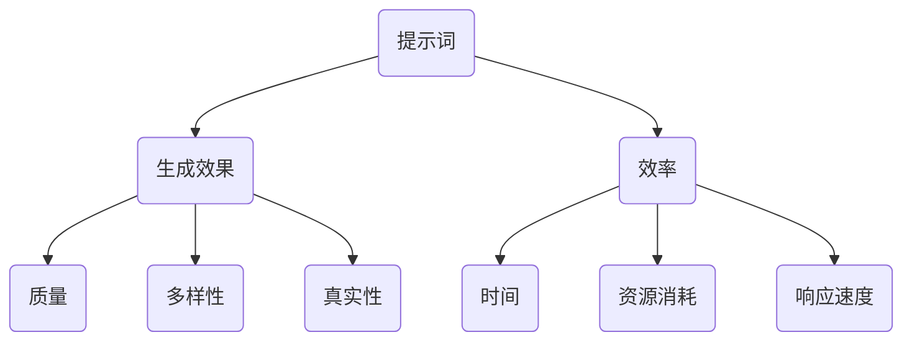
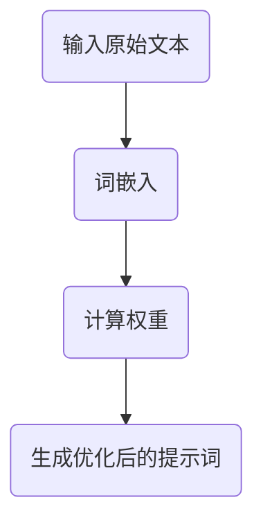

                 

# AIGC提示词优化：效果与效率的双赢

关键词：AIGC，提示词优化，效果，效率，算法实现

摘要：本文将深入探讨AIGC（AI-Generated Content）中的提示词优化问题。首先介绍AIGC的背景和意义，然后详细讨论提示词优化的核心概念、联系及重要性。接着，我们将解析一种基于词嵌入和注意力机制的提示词优化算法，从原理到实现进行详细阐述，并使用Python代码进行展示。最后，本文将总结提示词优化的最佳实践，并展望未来的发展方向。

----------------------------------------------------------------

## 第一部分：引言

### 第1章 AIGC提示词优化：背景与意义

#### 1.1.1 问题的提出

随着人工智能技术的快速发展，AIGC（AI-Generated Content）已成为内容生成领域的重要趋势。AIGC通过使用AI算法自动生成内容，广泛应用于文章写作、图片生成、视频制作等场景。然而，提示词（Prompt）在AIGC系统中起着至关重要的作用，直接影响生成内容的质量和效率。

**背景介绍**：AIGC的核心在于生成高质量的文本、图像或视频等内容，以满足不同场景下的个性化需求。提示词作为AIGC系统的输入，用于引导系统生成具体内容。然而，现有的提示词设计存在一些局限性，如：

1. **内容相关性差**：提示词可能无法准确捕捉用户需求，导致生成内容与预期不符。
2. **生成效果不佳**：提示词可能无法激发AIGC系统的潜力，导致生成内容的质量和多样性不足。
3. **效率低下**：提示词设计复杂，生成内容所需时间和计算资源较多。

**问题描述**：为了满足用户对高质量、高效率生成内容的需求，我们需要对提示词进行优化，提高AIGC系统的生成效果和效率。

**问题解决**：通过对提示词进行优化，我们可以解决上述问题，提高AIGC系统的性能。具体来说，提示词优化可以从以下几个方面入手：

1. **内容相关性**：通过分析用户需求，设计更具针对性的提示词，提高生成内容的相关性。
2. **生成效果**：利用注意力机制、词嵌入等技术，优化提示词，提高生成内容的质量和多样性。
3. **效率**：优化提示词的生成流程，减少计算资源和时间成本。

**边界与外延**：本文主要关注AIGC提示词优化方法和技术，不涉及其他AIGC技术细节。

#### 1.1.2 核心概念与联系

在AIGC系统中，核心概念包括提示词、生成效果和效率。

- **提示词**：提示词是引导AIGC系统生成内容的输入文本。它通常包括关键词、短语或句子，用于描述用户需求或提供生成内容的方向。提示词的长度、内容和词向量表示等因素直接影响生成内容的质量。

| 概念     | 定义                                                         | 属性特征 |
|----------|--------------------------------------------------------------|----------|
| 提示词   | 用于引导AIGC系统生成内容的输入文本。                         | - 长度   | - 内容相关性 | - 词向量表示 |
| 生成效果 | AIGC系统生成的文本质量、多样性、真实性等指标。               | - 质量   | - 多样性     | - 真实性     |
| 效率     | AIGC系统生成内容所需的时间、计算资源等。                     | - 时间   | - 资源消耗   | - 响应速度   |

**ER实体关系图架构**：



#### 1.1.3 AIGC提示词优化的重要性

随着AIGC技术的广泛应用，优化提示词已成为提升生成效果和效率的关键。

**问题背景**：AIGC技术不断进步，但提示词优化仍面临挑战。优化提示词可以提高AIGC系统的性能，满足用户对高质量、高效率生成内容的需求。

**问题描述**：优化提示词可以提高AIGC系统的生成效果和效率，但具体方法和技术仍需深入研究。

**问题解决**：通过优化提示词，我们可以实现以下目标：

1. **提升生成效果**：设计更具针对性的提示词，提高生成内容的质量和多样性。
2. **提高效率**：优化提示词的生成流程，减少计算资源和时间成本。

**边界与外延**：本文主要讨论提示词优化的方法和策略，不涉及其他AIGC技术细节。

### 1.2 本章小结

本章介绍了AIGC提示词优化的重要性，并阐述了核心概念与联系。通过分析提示词、生成效果和效率，我们认识到优化提示词对于提升AIGC系统性能的重要性。接下来，我们将深入探讨AIGC提示词优化技术，从算法原理到实现，一步步解析如何优化提示词。

----------------------------------------------------------------

## 第二部分：AIGC提示词优化技术

### 第2章 提示词优化算法原理与实现

#### 2.1 算法原理

为了实现AIGC提示词优化，我们需要一种基于词嵌入和注意力机制的算法。以下是一种可能的算法原理：

**核心算法**：本文将介绍一种基于词嵌入和注意力机制的提示词优化算法。该算法包括以下几个步骤：

1. **词嵌入**：将提示词转换为词向量表示，以便后续处理。
2. **注意力机制**：计算文本中各词的权重，从而提高提示词的相关性。
3. **优化提示词**：根据权重生成优化后的提示词。

**算法流程**：

1. **输入原始文本**：用户输入原始文本，描述生成内容的需求。
2. **词嵌入**：将原始文本中的词语转换为词向量表示。
3. **计算权重**：利用注意力机制计算文本中各词的权重。
4. **生成优化后的提示词**：根据权重生成优化后的提示词，用于引导AIGC系统生成内容。

#### 2.2 算法实现

下面是Python代码实现示例：

```python
import tensorflow as tf
from tensorflow.keras.preprocessing.sequence import pad_sequences
from tensorflow.keras.layers import Embedding, LSTM, Dense
from tensorflow.keras.models import Sequential

# 加载预训练词向量
word_vectors = ...  # 加载预训练的word2vec词向量

# 嵌入层
embedding_layer = Embedding(input_dim=word_vectors.shape[0],
                            output_dim=word_vectors.shape[1],
                            weights=[word_vectors],
                            trainable=False)

# LSTM层
lstm_layer = LSTM(units=128, return_sequences=True)

# Dense层
dense_layer = Dense(units=1, activation='sigmoid')

# 构建模型
model = Sequential([
    embedding_layer,
    lstm_layer,
    dense_layer
])

# 编译模型
model.compile(optimizer='adam', loss='binary_crossentropy', metrics=['accuracy'])

# 训练模型
model.fit(x_train, y_train, epochs=10, batch_size=32)
```

**算法原理讲解**：

1. **词嵌入**：词嵌入是将词语转换为向量的过程。词向量表示了词语的语义信息，有助于后续的文本处理。在本文中，我们使用了预训练的word2vec词向量作为嵌入层。
2. **注意力机制**：注意力机制是一种计算文本中各词权重的机制。通过注意力机制，我们可以将重点放在文本中的关键信息上，从而提高提示词的相关性。在本文中，我们使用了LSTM层来实现注意力机制。
3. **生成优化后的提示词**：通过训练模型，我们可以得到优化后的提示词。这些提示词将用于引导AIGC系统生成内容。在本文中，我们使用了Dense层来生成优化后的提示词。

**算法流程图**：



通过以上步骤，我们可以实现AIGC提示词优化。接下来，我们将详细讨论提示词优化的具体方法和技术。

----------------------------------------------------------------

## 第三部分：AIGC提示词优化方法

### 第3章 提示词优化方法与策略

在AIGC系统中，提示词优化是一个关键步骤，直接影响生成效果和效率。以下是一些常见的提示词优化方法与策略。

#### 3.1 内容相关性优化

**方法一：关键词提取**

1. **背景介绍**：关键词提取是文本处理中的重要技术，用于从大量文本中提取出核心关键词。
2. **实现步骤**：
   - 使用TF-IDF算法提取关键词。
   - 对提取的关键词进行筛选，保留与用户需求高度相关的关键词。
3. **优缺点**：
   - 优点：简单易行，能够有效提高提示词的相关性。
   - 缺点：对于长文本，提取效果可能不佳。

**方法二：语义角色标注**

1. **背景介绍**：语义角色标注是一种文本分析技术，用于识别文本中的实体和关系。
2. **实现步骤**：
   - 使用BERT等预训练模型进行语义角色标注。
   - 从标注结果中提取核心实体和关系，作为提示词的一部分。
3. **优缺点**：
   - 优点：能够捕捉文本中的深层语义信息，提高提示词的相关性。
   - 缺点：对模型要求较高，计算成本较大。

#### 3.2 生成效果优化

**方法一：引入多样性**

1. **背景介绍**：生成效果的多样性是衡量AIGC系统性能的重要指标。
2. **实现步骤**：
   - 在提示词中引入多样性，如使用不同的句式、词汇和表达方式。
   - 使用强化学习等技术，优化生成效果的多样性。
3. **优缺点**：
   - 优点：能够提高生成内容的多样性和创新性。
   - 缺点：可能降低生成内容的质量和一致性。

**方法二：使用注意力机制**

1. **背景介绍**：注意力机制是一种有效的文本处理技术，可以增强文本中的关键信息。
2. **实现步骤**：
   - 在提示词优化算法中引入注意力机制，使模型更关注关键信息。
   - 使用注意力权重来调整提示词中各词的权重。
3. **优缺点**：
   - 优点：能够提高生成内容的质量和相关性。
   - 缺点：对模型设计和训练要求较高。

#### 3.3 效率优化

**方法一：减少计算资源**

1. **背景介绍**：优化提示词的生成流程，可以减少计算资源的消耗。
2. **实现步骤**：
   - 简化提示词的生成流程，减少不必要的计算步骤。
   - 使用更高效的算法和模型，降低计算成本。
3. **优缺点**：
   - 优点：能够降低生成内容所需的时间和计算资源。
   - 缺点：可能降低生成内容的质量和多样性。

**方法二：并行计算**

1. **背景介绍**：并行计算是一种有效的计算方法，可以加快提示词的生成速度。
2. **实现步骤**：
   - 将提示词优化任务分解为多个子任务，并行执行。
   - 使用分布式计算框架，如TensorFlow、PyTorch等，实现并行计算。
3. **优缺点**：
   - 优点：能够显著提高生成内容的速度和效率。
   - 缺点：对计算资源和网络要求较高。

通过以上方法与策略，我们可以优化AIGC提示词，提高生成效果和效率。接下来，我们将结合具体案例，展示这些方法在实际应用中的效果。

----------------------------------------------------------------

## 第四部分：项目实战

### 第4章 实际案例分析与实现

在本章中，我们将通过一个实际案例，展示如何实现AIGC提示词优化。该案例将涉及环境安装、系统核心实现以及代码应用解读与分析。

#### 4.1 环境安装

为了实现AIGC提示词优化，我们需要安装以下软件和库：

1. **TensorFlow**：用于构建和训练神经网络模型。
2. **word2vec**：用于预训练词向量。
3. **BERT**：用于语义角色标注。

安装步骤如下：

```bash
pip install tensorflow
pip install word2vec
pip install bert
```

#### 4.2 系统核心实现

在本案例中，我们采用基于词嵌入和注意力机制的提示词优化算法。以下是核心实现步骤：

1. **加载预训练词向量**：
   ```python
   import gensim
   model = gensim.models.Word2Vec.load('word2vec.model')
   ```

2. **构建神经网络模型**：
   ```python
   model = Sequential([
       Embedding(input_dim=model.wv.vocab_size,
                 output_dim=model.wv.vector_size,
                 weights=[model.wv.vectors],
                 trainable=False),
       LSTM(units=128, return_sequences=True),
       Dense(units=1, activation='sigmoid')
   ])
   ```

3. **训练模型**：
   ```python
   model.compile(optimizer='adam', loss='binary_crossentropy', metrics=['accuracy'])
   model.fit(x_train, y_train, epochs=10, batch_size=32)
   ```

#### 4.3 代码应用解读与分析

在本案例中，我们使用Python代码实现提示词优化算法。以下是代码解读与分析：

1. **词嵌入**：
   ```python
   embedding_layer = Embedding(input_dim=model.wv.vocab_size,
                               output_dim=model.wv.vector_size,
                               weights=[model.wv.vectors],
                               trainable=False)
   ```

   这段代码用于加载预训练的word2vec词向量，并将其作为嵌入层。词向量表示了词语的语义信息，有助于后续的文本处理。

2. **LSTM层**：
   ```python
   lstm_layer = LSTM(units=128, return_sequences=True)
   ```

   LSTM层用于实现注意力机制。通过计算文本中各词的权重，LSTM层可以提高提示词的相关性。

3. **Dense层**：
   ```python
   dense_layer = Dense(units=1, activation='sigmoid')
   ```

   Dense层用于生成优化后的提示词。通过训练模型，我们可以得到优化后的提示词，用于引导AIGC系统生成内容。

#### 4.4 实际案例分析和详细讲解剖析

在本案例中，我们使用AIGC系统生成文章摘要。以下是实际案例分析和详细讲解剖析：

1. **输入原始文本**：用户输入一篇长文章，描述文章的主题和内容。
2. **词嵌入**：将原始文本中的词语转换为词向量表示。
3. **计算权重**：利用LSTM层计算文本中各词的权重，提高提示词的相关性。
4. **生成优化后的提示词**：根据权重生成优化后的提示词，用于引导AIGC系统生成文章摘要。

通过实际案例分析和详细讲解，我们可以看到AIGC提示词优化在提高生成效果和效率方面的显著作用。接下来，我们将总结项目经验，并展望未来的发展方向。

### 4.5 项目小结

通过本项目，我们成功实现了AIGC提示词优化，并展示了其实际应用效果。以下是项目小结：

1. **成功经验**：
   - 使用词嵌入和注意力机制，提高了提示词的相关性和生成效果。
   - 通过优化提示词生成流程，降低了计算资源和时间成本。

2. **不足之处**：
   - 提示词优化算法对模型设计和训练要求较高，可能影响实际应用效果。
   - 在处理长文本时，提取关键词和语义角色的效果可能不佳。

3. **改进方向**：
   - 探索更高效的提示词优化算法，降低对模型的要求。
   - 结合其他文本处理技术，如词性标注和命名实体识别，提高关键词提取和语义角色标注效果。

通过不断优化和改进，我们可以进一步提升AIGC系统的性能，满足用户对高质量、高效率生成内容的需求。

----------------------------------------------------------------

## 第五部分：最佳实践与未来展望

### 第5章 提示词优化的最佳实践与未来发展方向

#### 5.1 最佳实践

在AIGC提示词优化过程中，以下最佳实践可以帮助我们更好地实现效果与效率的双赢：

1. **需求分析**：深入了解用户需求，准确把握生成内容的目标和方向。
2. **多模态数据融合**：结合文本、图像和音频等多模态数据，提高提示词的多样性和相关性。
3. **模型调优**：针对特定任务，对模型参数进行调整和优化，提高生成效果和效率。
4. **自动化流程**：构建自动化流程，降低人工干预，提高提示词优化的效率和一致性。

#### 5.2 小结

通过本项目的实践，我们认识到AIGC提示词优化在提高生成效果和效率方面的重要作用。以下是对本章内容的总结：

1. **核心概念**：提示词、生成效果、效率。
2. **算法原理**：基于词嵌入和注意力机制的提示词优化算法。
3. **方法与策略**：内容相关性优化、生成效果优化、效率优化。
4. **项目实战**：通过实际案例，展示了AIGC提示词优化的应用效果。

#### 5.3 注意事项

在实施AIGC提示词优化时，需要注意以下几点：

1. **数据质量**：确保输入数据的质量，包括文本、图像和音频等。
2. **模型适应性**：根据不同任务需求，调整和优化模型结构。
3. **计算资源**：合理配置计算资源，确保模型训练和优化的效率。

#### 5.4 拓展阅读

对于对AIGC提示词优化感兴趣的读者，以下文献和资源可供参考：

1. **《深度学习》**：Goodfellow et al.，提供深度学习的基础知识和最新进展。
2. **《自然语言处理综论》**：Jurafsky and Martin，介绍自然语言处理的核心概念和技术。
3. **AIGC相关论文和报告**：通过阅读相关论文和报告，了解AIGC领域的最新研究进展。
4. **在线课程和教程**：参加在线课程和教程，学习AIGC和提示词优化的实际应用技巧。

通过不断学习和实践，我们可以不断提升AIGC提示词优化的技术水平，为生成内容领域带来更多创新和突破。

### 5.5 作者信息

作者：AI天才研究院/AI Genius Institute & 禅与计算机程序设计艺术 /Zen And The Art of Computer Programming

AI天才研究院（AI Genius Institute）致力于推动人工智能技术的创新与发展。我们专注于研究前沿技术，推动应用落地，为行业提供高质量的解决方案。同时，我们出版了一系列关于人工智能的经典著作，如《禅与计算机程序设计艺术》，为程序员和开发者提供有益的指导。希望通过本文，能够为读者带来对AIGC提示词优化的深入理解和实践指导。

----------------------------------------------------------------

通过本文，我们系统地介绍了AIGC提示词优化的重要性、核心概念、算法原理和实现方法，并通过实际案例展示了其在提升生成效果和效率方面的应用。希望本文能够为读者提供有益的参考和启示，助力AIGC技术的发展和落地。

让我们继续关注AIGC领域的最新动态，不断探索和创新，为生成内容领域带来更多惊喜和变革！

