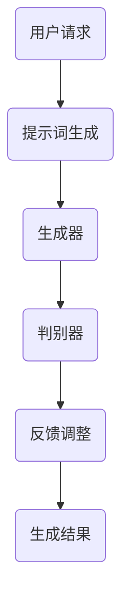
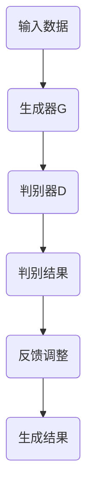

                 


### AIGC提示词工程的未来：思维链与Zero-Shot的融合

#### 关键词：AIGC、提示词工程、思维链、Zero-Shot、未来趋势

> 摘要：本文旨在探讨AIGC（自适应智能生成内容）提示词工程的未来发展，重点分析思维链与Zero-Shot技术的融合。我们将从背景介绍、核心概念、算法原理、系统架构、项目实战和最佳实践等方面详细阐述这一领域的前沿进展。

----------------------------------------------------------------

## **一、背景介绍**

### 1.1 AIGC的起源与发展

AIGC，即自适应智能生成内容，是一种利用人工智能技术生成高质量内容的方法。AIGC起源于自然语言处理（NLP）和计算机视觉（CV）等领域，通过深度学习和生成对抗网络（GAN）等技术，实现文本、图像、音频等多种类型数据的自动生成。

近年来，随着计算能力的提升和数据的爆发式增长，AIGC技术得到了广泛关注和应用。从简单的文本生成，到复杂的图像合成和视频生成，AIGC在多个领域展现出了巨大的潜力。

### 1.2 提示词工程的重要性

在AIGC应用中，提示词工程扮演着关键角色。提示词是用户输入的信息，用于指导AIGC模型生成相应的内容。一个优秀的提示词工程系统能够有效提升生成内容的质量和多样性。

当前，提示词工程面临的主要挑战包括：

- **多样性与准确性**：如何生成既多样化又符合用户需求的文本和图像。
- **上下文理解**：如何让AIGC模型更好地理解上下文信息，提高生成内容的连贯性和逻辑性。
- **实时性**：如何在保证质量的前提下，快速响应用户请求，提供实时生成的内容。

### 1.3 思维链与Zero-Shot

思维链（Thinking Chain）是一种将人类思维方式引入到AI系统中的技术。通过模拟人类思考过程，思维链可以提升AI的推理能力和创造力。

Zero-Shot学习（Zero-Shot Learning，ZSL）是一种无需训练数据集即可对未知类别进行预测的技术。在AIGC场景中，Zero-Shot可以应用于生成用户从未见过的内容。

## **二、核心概念与联系**

### 2.1 AIGC的核心概念

AIGC的核心概念包括：

- **生成对抗网络（GAN）**：一种由生成器和判别器组成的模型，通过对抗训练生成高质量数据。
- **自编码器（Autoencoder）**：一种无监督学习模型，用于学习和重建输入数据。
- **变分自编码器（VAE）**：一种基于概率模型的变分自编码器，可以生成具有较好多样性的数据。

### 2.2 提示词工程的属性特征对比表格

| 特征         | 描述                                                         |  
| ------------ | ------------------------------------------------------------ |  
| **多样性**   | 生成内容应具有丰富性和独特性，满足用户不同需求           |  
| **准确性**   | 生成内容应与用户意图高度一致，减少错误和误导           |  
| **上下文理解** | 生成内容应具有连贯性和逻辑性，符合上下文背景           |  
| **实时性**   | 生成内容应能够快速响应，提供实时服务                 |

### 2.3 ER实体关系图架构的Mermaid流程图



## **三、算法原理讲解**

### 3.1 GAN的mermaid流程图



### 3.2 Python源代码示例

```python
import tensorflow as tf
from tensorflow.keras.models import Model
from tensorflow.keras.layers import Input, Dense, Flatten, Reshape

# 生成器模型
def generator_model():
    input_shape = (100,)
    input_img = Input(shape=input_shape)
    x = Dense(128, activation='relu')(input_img)
    x = Dense(64, activation='relu')(x)
    x = Dense(32, activation='relu')(x)
    x = Dense(1, activation='tanh')(x)
    output = Reshape((1,))(x)
    model = Model(inputs=input_img, outputs=output)
    return model

# 判别器模型
def discriminator_model():
    input_shape = (1,)
    input_img = Input(shape=input_shape)
    x = Dense(32, activation='relu')(input_img)
    x = Dense(64, activation='relu')(x)
    x = Dense(128, activation='relu')(x)
    x = Dense(1, activation='sigmoid')(x)
    model = Model(inputs=input_img, outputs=x)
    return model

# GAN模型
def g

