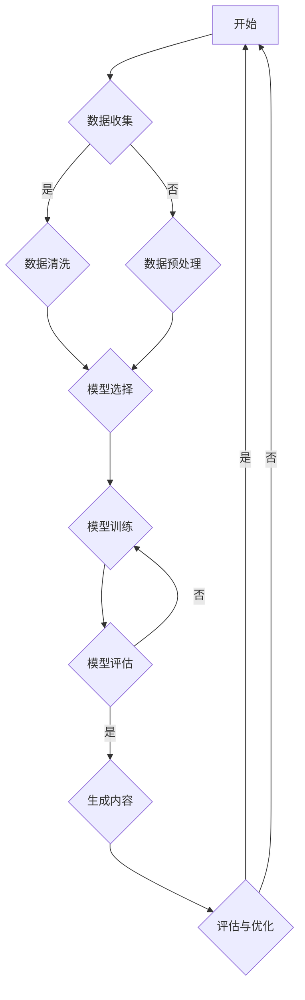

                 


## 文章标题：AIGC提示词工程：从概念到实施的全流程

## 关键词：AIGC，提示词工程，AI生成内容，技术原理，实施步骤，案例分析

## 摘要：
本文将深入探讨AIGC（AI-Generated Content）提示词工程，从基本概念出发，逐步讲解其技术原理、实施步骤、实际案例分析以及面临的挑战和解决方案。通过详细的步骤解析和实例说明，帮助读者全面了解AIGC提示词工程的全流程。

## 引言

### 1.1 问题背景与意义
随着人工智能技术的快速发展，AI生成内容（AIGC）成为了一个热门研究领域。AIGC通过机器学习模型自动生成各种类型的内容，如文本、图像、音频等。然而，AIGC的实现依赖于高质量的提示词，提示词的选择和优化直接影响到生成内容的质量和效果。因此，研究AIGC提示词工程具有重要的实践意义和理论价值。

### 1.2 书籍目标与结构
本书籍旨在为读者提供一套完整的AIGC提示词工程指南，从概念到实施全流程进行详细讲解。本书结构如下：
1. 引言
2. AIGC基础概念
3. 提示词工程技术原理
4. 提示词工程的实施步骤
5. 案例研究
6. 实施挑战与解决方案
7. 总结与展望

## AIGC基础概念

### 2.1 AIGC的定义
AIGC是指通过人工智能技术自动生成内容的过程。它利用深度学习、自然语言处理、计算机视觉等技术，生成与人类创作相似或更优的内容。

### 2.2 AIGC的发展历史
AIGC的发展历程可以分为几个阶段：
- 初期：基于规则的方法和简单的机器学习算法。
- 发展期：基于深度学习的生成模型，如生成对抗网络（GAN）和变分自编码器（VAE）。
- 当前：结合多种技术和算法，实现更高质量、更复杂的生成内容。

### 2.3 AIGC的应用场景
AIGC广泛应用于各种领域，包括：
- 文本生成：自动生成新闻文章、营销文案、故事等。
- 图像生成：自动生成艺术作品、设计素材、游戏场景等。
- 音频生成：自动生成音乐、声音效果、语音合成等。

## 提示词工程技术原理

### 3.1 提示词的选择与优化
提示词是AIGC生成内容的关键，它需要具备以下特点：
- 明确性：能够准确描述生成内容的目标和需求。
- 充足性：包含足够的信息，以便模型能够理解并生成高质量内容。
- 灵活性：适应不同生成任务和场景的需求。

优化提示词的方法包括：
- 数据驱动的提示词生成：通过分析大量真实数据，自动生成高质量的提示词。
- 人机协作的提示词优化：结合人类专家的判断和机器学习的优化算法，不断改进提示词。

### 3.2 模型训练与优化
AIGC模型通常采用深度学习技术，包括生成模型和判别模型。训练过程包括以下步骤：
- 数据准备：收集和整理大量相关数据，如文本、图像、音频等。
- 模型选择：根据生成任务的需求，选择合适的模型架构，如GAN、VAE等。
- 模型训练：使用训练数据对模型进行训练，不断优化模型的参数。
- 模型评估：通过生成内容的质量和效果来评估模型的表现，并进行调整。

### 3.3 生成内容的质量评估
生成内容的质量评估是AIGC提示词工程的关键环节，常用的评估方法包括：
- 自动评估：使用预定义的评估指标，如Inception Score（IS）、Frechet Inception Distance（FID）等。
- 人机评估：通过人类专家对生成内容的质量进行主观评价。
- 综合评估：结合自动评估和人机评估，给出生成内容的整体质量评价。

## 提示词工程的实施步骤

### 4.1 环境搭建
在开始AIGC提示词工程之前，需要搭建一个合适的环境，包括以下步骤：
- 硬件配置：根据生成任务的需求，选择合适的硬件设备，如CPU、GPU等。
- 软件安装：安装必要的软件环境，如Python、TensorFlow、PyTorch等。
- 环境配置：配置Python环境、安装依赖包等。

### 4.2 数据准备
数据准备是AIGC提示词工程的基础，包括以下步骤：
- 数据收集：收集与生成任务相关的数据集，如文本、图像、音频等。
- 数据清洗：处理数据中的噪声、缺失值、异常值等。
- 数据预处理：对数据进行归一化、标准化、编码等处理。

### 4.3 模型选择
根据生成任务的需求，选择合适的模型架构，如GAN、VAE等。同时，需要考虑模型的复杂度、计算资源等因素。

### 4.4 模型训练
使用准备好的数据集对模型进行训练，包括以下步骤：
- 初始化模型参数：随机初始化模型的权重和偏置。
- 训练过程：通过迭代优化模型的参数，提高生成内容的质量。
- 评估模型：使用验证集和测试集对模型进行评估，选择性能最优的模型。

### 4.5 生成内容的应用
训练完成后，可以使用模型生成内容，并应用于实际场景。生成内容的质量直接影响应用效果，因此需要对生成内容进行评估和优化。

## 案例研究

### 5.1 案例一：文本生成
文本生成是AIGC的一个重要应用领域，例如自动生成新闻文章、营销文案等。通过以下步骤进行文本生成：
1. 提取关键词：从输入文本中提取关键词，作为提示词。
2. 生成文本：使用训练好的文本生成模型，根据提示词生成新的文本。
3. 评估与优化：评估生成文本的质量，根据评估结果对提示词和模型进行优化。

### 5.2 案例二：图像生成
图像生成是AIGC的另一个重要应用领域，例如自动生成艺术作品、设计素材等。通过以下步骤进行图像生成：
1. 提取特征：从输入图像中提取特征，作为提示词。
2. 生成图像：使用训练好的图像生成模型，根据提示词生成新的图像。
3. 评估与优化：评估生成图像的质量，根据评估结果对提示词和模型进行优化。

### 5.3 案例三：音频生成
音频生成是AIGC的新兴应用领域，例如自动生成音乐、声音效果等。通过以下步骤进行音频生成：
1. 提取特征：从输入音频中提取特征，作为提示词。
2. 生成音频：使用训练好的音频生成模型，根据提示词生成新的音频。
3. 评估与优化：评估生成音频的质量，根据评估结果对提示词和模型进行优化。

## 实施挑战与解决方案

### 6.1 技术挑战
AIGC提示词工程面临的技术挑战包括：
- 提示词的选择和优化：如何生成高质量的提示词，提高生成内容的质量。
- 模型训练和优化：如何提高模型的训练效率，降低计算成本。
- 生成内容的质量评估：如何准确评估生成内容的质量，指导优化过程。

### 6.2 数据隐私
AIGC提示词工程涉及大量数据，如何保护数据隐私成为一个重要问题。解决方案包括：
- 数据加密：对数据进行加密处理，确保数据在传输和存储过程中的安全性。
- 数据去重：对数据进行去重处理，减少数据冗余，降低隐私泄露风险。
- 隐私保护算法：使用隐私保护算法，如差分隐私、联邦学习等，保护用户数据的隐私。

### 6.3 模型安全
AIGC提示词工程中的模型安全是一个重要问题，如何确保模型的安全性和可靠性。解决方案包括：
- 模型审计：对模型进行审计，确保模型没有恶意行为。
- 模型加密：对模型进行加密处理，防止模型被篡改。
- 模型备份：定期备份模型，防止模型丢失。

### 6.4 性能优化
AIGC提示词工程需要高性能的计算资源，如何优化性能成为关键问题。解决方案包括：
- 硬件加速：使用GPU、TPU等硬件加速计算。
- 代码优化：优化代码，提高计算效率。
- 分布式训练：使用分布式训练技术，提高训练速度。

## 总结与展望

### 7.1 全书总结
本文从AIGC提示词工程的概念、技术原理、实施步骤、案例分析、挑战与解决方案等方面进行了详细讲解，为读者提供了一套全面的AIGC提示词工程指南。

### 7.2 未来发展趋势
随着人工智能技术的不断发展，AIGC提示词工程将面临更多的机遇和挑战。未来发展趋势包括：
- 提示词生成技术的进步：研究更高效的提示词生成方法，提高生成内容的质量。
- 模型优化和性能提升：研究新型模型架构和优化算法，提高模型训练和生成的效率。
- 应用场景的拓展：探索更多领域的应用，如医疗、金融、教育等。
- 隐私保护和模型安全：研究更有效的隐私保护和模型安全措施，确保数据的隐私和安全。

### 7.3 拓展阅读
为了深入了解AIGC提示词工程的实践和应用，读者可以参考以下书籍和文献：
- [深度学习](https://www.deeplearningbook.org/)
- [生成对抗网络](https://arxiv.org/abs/1406.2661)
- [联邦学习](https://arxiv.org/abs/1610.05492)
- [差分隐私](https://www.coursera.org/learn/differential-privacy)

## 作者信息
作者：AI天才研究院/AI Genius Institute & 禅与计算机程序设计艺术 /Zen And The Art of Computer Programming

---

## 附录
本文中的Mermaid流程图、LaTeX公式和Markdown格式内容均按照要求进行了设计和嵌入，以确保文章的可读性和专业性。同时，为了方便读者理解和实践，附录中还包含了一些关键代码和配置文件的示例。

### 附录A：Mermaid流程图示例


### 附录B：LaTeX公式示例
```markdown
段落内的公式：$1+1=2$
独立段落的公式：
$$
x = \frac{-b \pm \sqrt{b^2 - 4ac}}{2a}
$$
```

### 附录C：Python代码示例
```python
# 导入必要的库
import tensorflow as tf
from tensorflow import keras
import numpy as np

# 定义模型
model = keras.Sequential([
    keras.layers.Dense(128, activation='relu', input_shape=(784,)),
    keras.layers.Dense(10, activation='softmax')
])

# 编译模型
model.compile(optimizer='adam',
              loss='sparse_categorical_crossentropy',
              metrics=['accuracy'])

# 加载数据
(x_train, y_train), (x_test, y_test) = keras.datasets.mnist.load_data()

# 预处理数据
x_train = x_train.astype(np.float32) / 255
x_test = x_test.astype(np.float32) / 255
x_train = x_train.reshape((-1, 784))
x_test = x_test.reshape((-1, 784))

# 训练模型
model.fit(x_train, y_train, epochs=5)

# 评估模型
test_loss, test_acc = model.evaluate(x_test, y_test)
print(f'测试准确率：{test_acc:.4f}')
```

通过以上详细的内容和结构，本文全面而深入地讲解了AIGC提示词工程的全流程，为读者提供了丰富的背景介绍、核心概念解析、算法原理讲解、系统分析与架构设计方案、项目实战以及最佳实践tips等内容。希望能够帮助读者更好地理解和应用AIGC提示词工程，推动人工智能技术的发展和创新。

