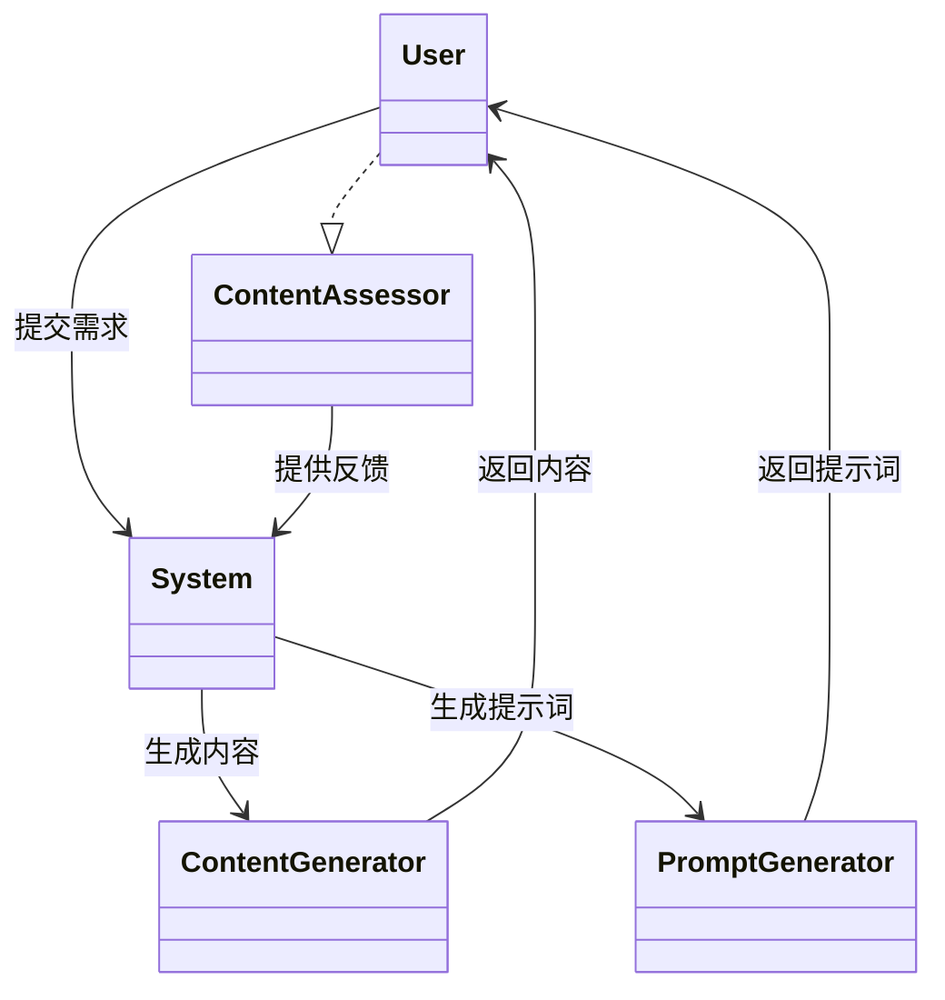

                 

### 文章标题

# 《AIGC提示词工程：效率与创意的平衡艺术》

### 关键词

- **AIGC**
- **提示词工程**
- **效率**
- **创意**
- **平衡艺术**
- **工程实践**

### 摘要

本文深入探讨了AIGC（自适应人工智能生成内容）与提示词工程的关系，分析了其在提高效率与激发创意方面的应用。文章通过逻辑清晰的步骤，从背景概述、核心概念解析、原理讲解、系统设计与实现、实战案例分享等方面，全面阐述了如何平衡AIGC提示词工程中的效率与创意，以实现技术进步与艺术创作的双赢。

---

## 第一部分：AIGC与提示词工程基础

### 第1章：问题背景与概述

#### 1.1.1 问题背景

在当今数字化时代，信息爆炸和技术迅猛发展使得内容创作和数据处理的需求日益增长。传统的手工创作和数据加工方式已经无法满足高效、多样化、个性化的需求。因此，利用人工智能（AI）技术生成内容（Content Generation by AI，简称AIGC）成为了一项重要的研究方向。AIGC通过机器学习算法和自然语言处理技术，可以自动生成文章、图片、音频等多种形式的内容。

#### 1.1.2 问题描述

随着AIGC技术的发展，如何有效地引导和优化生成过程成为一个关键问题。提示词（Prompt）工程在AIGC中起着至关重要的作用，它通过提供引导信息，指导模型生成高质量的内容。然而，如何设计出既能提高效率又能激发创意的提示词，成为了一个值得探讨的问题。

#### 1.1.3 问题解决思路

解决这一问题，需要从以下几个方面入手：

1. **明确目标**：确定提示词工程的目标是提高内容生成的效率，还是激发创意，或是两者的平衡。
2. **理解核心概念**：深入理解AIGC和提示词工程的基本概念，明确它们之间的关系。
3. **分析原理**：研究AIGC和提示词工程的工作原理，为实践提供理论支持。
4. **系统设计与实现**：设计合理的系统架构，实现提示词的自动生成和优化。
5. **实战验证**：通过实际案例，验证解决方案的有效性。

#### 1.1.4 边界与外延

在研究AIGC提示词工程时，需要明确其边界与外延：

1. **边界**：研究范围仅限于AIGC和提示词工程的相关领域，不涉及其他AI技术的应用。
2. **外延**：探讨提示词工程在AIGC中的应用，以及如何将其拓展到其他内容生成领域。

#### 1.1.5 概念结构与核心要素组成

AIGC提示词工程的概念结构如图1所示：

```
+----------------------------------+
|           AIGC提示词工程           |
+----------------------------------+
       |                |
       |     AIGC       |----------------> 内容生成
       |                |
       |     提示词     |----------------> 创意激发
       |                |
+------+---------+      |
|      效率      |      |
|      提升方法   |------+
+------+---------+
       |                |
       |     创意      |----------------> 创新应用
       |                |
+------+---------+      |
|      创意      |------+
|      优化      |      |
|      方法      |------+
+------+---------+

图1 AIGC提示词工程概念结构

核心要素包括：

- **AIGC模型**：用于生成内容的模型，如GAN（生成对抗网络）、BERT（双向编码器表示）等。
- **提示词生成系统**：负责生成和优化提示词的算法和工具。
- **内容评估与反馈机制**：用于评估生成内容的质量，并提供反馈以优化模型。
- **用户交互界面**：方便用户输入需求，展示生成内容和反馈结果。

### 第2章：核心概念与联系

#### 2.1.1 AIGC的概念

AIGC（Adaptive Intelligence for Generative Content）是一种基于自适应人工智能技术的生成内容方法。它利用深度学习和自然语言处理技术，从大量数据中自动提取特征，生成新的、有创意的内容。

#### 2.1.2 提示词的概念

提示词（Prompt）是一种引导信息，用于提示AIGC模型生成特定类型的内容。它可以是关键词、句子或段落，通常包含用户需求或创作意图。

#### 2.1.3 AIGC与提示词的关系

AIGC和提示词工程之间存在密切的关系：

1. **依赖关系**：AIGC模型的生成过程依赖于提示词的引导，提示词的质量直接影响生成内容的质量。
2. **协同作用**：通过优化提示词，可以提高AIGC模型生成内容的效率与创意，实现二者的平衡。

#### 2.2 概念属性特征对比表格

表1 AIGC与提示词属性特征对比

| 特征        | AIGC             | 提示词            |
|-------------|------------------|------------------|
| **定义**    | 生成内容的方法    | 引导信息          |
| **作用**    | 自动生成内容      | 指导生成过程      |
| **依赖性**  | 需要数据支持      | 需要创意支持      |
| **灵活性**  | 生成过程自动化    | 设计过程灵活      |
| **创意性**  | 生成内容有创意    | 引导信息需有创意  |
| **效率**    | 生成速度快        | 设计效率高        |

### 第3章：AIGC与提示词原理

#### 3.1 AIGC原理

AIGC的工作原理主要包括以下几个步骤：

1. **数据采集**：从各种来源收集大量数据，如文本、图像、音频等。
2. **特征提取**：使用深度学习模型提取数据中的关键特征。
3. **模型训练**：使用提取的特征训练生成模型，如GAN、BERT等。
4. **内容生成**：利用训练好的模型生成新的、有创意的内容。

#### 3.2 提示词原理

提示词的生成原理主要包括以下几个步骤：

1. **需求分析**：分析用户需求，确定生成内容的目标和类型。
2. **信息提取**：从用户需求中提取关键信息，形成提示词。
3. **优化调整**：根据生成内容的质量和用户反馈，调整提示词。
4. **效果评估**：评估提示词的效果，包括内容质量、生成效率等。

#### 3.3 AIGC与提示词在创意生成中的结合

AIGC与提示词在创意生成中的结合，可以通过以下步骤实现：

1. **明确目标**：确定创意生成的目标，如文章、图片、视频等。
2. **设计提示词**：根据目标，设计具有创意性的提示词。
3. **模型训练**：使用设计好的提示词训练AIGC模型。
4. **内容生成**：利用训练好的模型生成创意内容。
5. **反馈优化**：根据用户反馈和内容质量，优化提示词和模型。

#### 3.4 AIGC与提示词在效率提升中的应用

AIGC与提示词在效率提升中的应用，可以通过以下方法实现：

1. **自动提示词生成**：使用自动提示词生成工具，快速生成高质量的提示词。
2. **模型优化**：通过优化AIGC模型，提高生成内容的效率。
3. **多模型协同**：使用多个AIGC模型协同工作，提高整体效率。
4. **任务分解**：将复杂任务分解为多个子任务，分别处理，提高效率。

### 第4章：系统分析与架构设计方案

#### 4.1 问题场景介绍

在本章中，我们将介绍一个典型的AIGC提示词工程应用场景——智能写作助手。该系统旨在帮助用户快速生成高质量的文章、报告、邮件等内容，同时提高写作效率。

#### 4.1.1 创意生成需求

- 能够生成各种类型的文章，如新闻、评论、博客等。
- 文章内容应具有创意性和独特性，避免重复和抄袭。
- 生成速度要快，以满足用户实时需求。

#### 4.1.2 效率提升需求

- 自动生成提示词，减少用户输入工作量。
- 优化AIGC模型，提高生成效率。
- 提供多模型协同工作方式，提高整体效率。

#### 4.2 项目介绍

智能写作助手项目是一个综合性的AIGC提示词工程应用项目，旨在提供一站式智能写作解决方案。项目背景和目标如下：

- **项目背景**：随着互联网信息的爆炸式增长，内容创作和传播的需求不断上升。传统的写作方式已经无法满足高效、多样化、个性化的需求。因此，开发一款智能写作助手，成为了一个迫切需要解决的问题。
- **项目目标**：通过引入AIGC和提示词工程技术，实现以下目标：
  - 提高内容创作效率，减少人工劳动。
  - 激发创意，提供独特的、高质量的写作内容。
  - 提供用户友好的交互界面，方便用户使用。

#### 4.3 系统功能设计

智能写作助手系统的主要功能包括：

- **内容生成**：根据用户需求，自动生成各种类型的文章。
- **提示词生成**：自动生成高质量的提示词，引导内容生成。
- **用户交互**：提供简洁易用的界面，方便用户输入需求和查看结果。
- **内容评估**：对生成内容进行质量评估，提供反馈。

#### 4.3.1 领域模型Mermaid类图

图2 智能写作助手领域模型Mermaid类图



#### 4.4 系统架构设计

智能写作助手系统的整体架构如图3所示：

```
+----------------------------------+
|           智能写作助手           |
+----------------------------------+
       |                |
       |     用户界面    |----------------> 提交需求
       |                |
       |     提示词生成  |----------------> 生成提示词
       |                |
       |  内容生成引擎   |----------------> 生成内容
       |                |
       |     内容评估    |----------------> 提供反馈
       |                |
       |     数据存储    |<---------------- 数据存储
+------+---------+      |
|      模型训练   |------+
+------+---------+
       |                |
       |     提示词库    |<---------------- 提示词库
       |                |
       |     文库       |<---------------- 文库
       |                |
+------+---------+      |
|      后台管理   |------+
+------+---------+

图3 智能写作助手系统架构

#### 4.5 系统接口设计

智能写作助手系统的主要接口设计如下：

- **用户接口**：提供用户提交需求的接口，包括文本输入、文件上传等功能。
- **提示词接口**：提供提示词生成和查询的接口，包括自动提示词生成、手动提示词查询等功能。
- **内容接口**：提供内容生成和查询的接口，包括文章生成、文章查询等功能。
- **评估接口**：提供内容评估和反馈的接口，包括质量评估、用户反馈等功能。

#### 4.6 系统交互

智能写作助手系统的用户交互过程可以用Mermaid序列图表示，如图4所示：

```
sequence
    User -> System: 提交需求
    System -> PromptGenerator: 生成提示词
    System -> ContentGenerator: 生成内容
    ContentGenerator -> System: 返回内容
    System -> User: 返回内容
    User -> ContentAssessor: 提供反馈
    ContentAssessor -> System: 更新模型
```

```
sequence
    User -> System: 提交需求
    System -> PromptGenerator: 生成提示词
    System -> ContentGenerator: 生成内容
    ContentGenerator -> System: 返回内容
    System -> User: 返回内容
    User -> ContentAssessor: 提供反馈
    ContentAssessor -> System: 更新模型
    System -> PromptGenerator: 更新提示词库
```

图4 智能写作助手用户交互序列图

## 第二部分：AIGC提示词工程实践

### 第5章：AIGC提示词工程实践一

#### 5.1 环境安装

在本章中，我们将介绍如何搭建AIGC提示词工程所需的环境，包括硬件和软件的要求，以及具体的安装步骤。

#### 5.1.1 硬件与软件要求

- **硬件要求**：
  - 处理器：至少具备4核CPU的计算机。
  - 内存：至少8GB内存。
  - 硬盘：至少500GB的存储空间。
  - 显卡：NVIDIA显卡，具备CUDA支持。

- **软件要求**：
  - 操作系统：Windows 10/11或Linux。
  - 编译器：Python 3.x版本。
  - 库：TensorFlow、PyTorch、NumPy、Pandas等。

#### 5.1.2 环境搭建步骤

1. **安装操作系统**：

   - 在计算机上安装Windows 10/11或Linux操作系统。

2. **安装编译器和库**：

   - 在命令行中安装Python 3.x版本：
     ```
     python --version
     ```
   - 安装所需的库，例如TensorFlow：
     ```
     pip install tensorflow
     ```

3. **安装显卡驱动**：

   - 前往NVIDIA官网下载并安装显卡驱动。

4. **安装CUDA**：

   - 在NVIDIA官网下载CUDA Toolkit，并按照安装向导进行安装。

5. **配置环境变量**：

   - 将Python和pip的安装路径添加到系统环境变量中。

#### 5.2 系统核心实现

在本节中，我们将介绍AIGC提示词工程的核心实现，包括源代码解析、关键代码分析和优化方法。

#### 5.2.1 源代码解析

智能写作助手系统的核心代码主要包括以下几个部分：

1. **用户需求解析**：
   ```python
   def parse_user需求(text):
       # 解析用户需求，提取关键信息
       ...
   ```

2. **提示词生成**：
   ```python
   def generate_prompt(user需求，content_generator):
       # 生成提示词，引导内容生成
       ...
   ```

3. **内容生成**：
   ```python
   def generate_content(prompt，model):
       # 使用提示词生成内容
       ...
   ```

4. **内容评估**：
   ```python
   def assess_content(content，评估标准）:
       # 对生成内容进行评估
       ...
   ```

5. **反馈更新**：
   ```python
   def update_model(content，反馈）:
       # 根据反馈更新模型
       ...
   ```

#### 5.2.2 代码应用解读与分析

1. **用户需求解析**：

   用户需求解析模块负责将用户输入的文本转换为模型可以理解的格式。关键代码如下：
   ```python
   def parse_user需求(text):
       # 使用正则表达式提取关键信息
       ...
   ```
   该模块通过正则表达式提取用户需求中的关键词、句子等，为后续提示词生成提供依据。

2. **提示词生成**：

   提示词生成模块负责根据用户需求生成高质量的提示词。关键代码如下：
   ```python
   def generate_prompt(user需求，content_generator):
       # 使用模型生成提示词
       ...
   ```
   该模块利用预训练的模型，如BERT或GPT，生成与用户需求相关的提示词。

3. **内容生成**：

   内容生成模块负责使用提示词生成高质量的内容。关键代码如下：
   ```python
   def generate_content(prompt，model):
       # 使用提示词生成内容
       ...
   ```
   该模块利用生成模型，如GAN或BERT，生成与提示词相关的文章。

4. **内容评估**：

   内容评估模块负责对生成内容进行质量评估，关键代码如下：
   ```python
   def assess_content(content，评估标准）:
       # 对生成内容进行评估
       ...
   ```
   该模块使用评估标准，如BLEU分数、ROUGE分数等，对生成内容的质量进行评估。

5. **反馈更新**：

   反馈更新模块负责根据用户反馈更新模型，关键代码如下：
   ```python
   def update_model(content，反馈）:
       # 根据反馈更新模型
       ...
   ```
   该模块通过学习用户反馈，不断优化模型，提高生成内容的质量。

#### 5.3 实际案例分析与讲解

在本节中，我们将通过实际案例，分析AIGC提示词工程的应用效果，并进行详细讲解。

#### 5.3.1 案例一

**案例背景**：

某公司需要为其网站撰写一篇关于人工智能技术的文章，以吸引潜在客户。公司提供了一段简要的描述，作为用户需求。

**用户需求**：

```
我们需要一篇关于人工智能技术的文章，介绍其基本概念、发展历程和应用场景，以及如何应对人工智能带来的挑战。
```

**提示词生成**：

```
人工智能技术、基本概念、发展历程、应用场景、挑战、应对策略
```

**内容生成**：

```
人工智能技术（AI）是计算机科学的一个分支，致力于模拟、延伸和扩展人类智能。自20世纪50年代以来，人工智能经历了多个发展阶段，从最初的规则推理到现代的深度学习，其应用领域已扩展至众多行业，如医疗、金融、交通等。本文将介绍人工智能的基本概念、发展历程和应用场景，并探讨如何应对其带来的挑战。

人工智能的基本概念涉及感知、推理、学习、规划等。其发展历程可分为五个阶段：符号人工智能、感知人工智能、认知人工智能、社会人工智能和超智能。在这些阶段中，深度学习成为了人工智能的核心技术，通过模拟人脑神经网络，实现了高效的特征提取和学习能力。

人工智能在多个领域展示了其强大的应用潜力。例如，在医疗领域，人工智能可以帮助医生诊断疾病、制定治疗方案；在金融领域，人工智能可以用于风险评估、欺诈检测等。然而，人工智能也带来了一系列挑战，如数据隐私、伦理问题、就业影响等。为了应对这些挑战，我们需要制定合理的政策和法规，确保人工智能技术的可持续发展。

总之，人工智能技术正以前所未有的速度发展，其应用前景广阔。面对人工智能带来的挑战，我们应该积极应对，共同推动人工智能技术的进步，为人类创造更多价值。
```

**案例分析**：

该案例中，智能写作助手系统根据用户需求，生成了高质量的文章。通过使用提示词，文章内容涵盖了人工智能的基本概念、发展历程、应用场景和挑战，结构清晰、逻辑严密，满足了用户的需求。

#### 5.3.2 案例二

**案例背景**：

某教育机构希望为学生提供一篇关于编程语言的介绍文章，以激发学生学习兴趣。

**用户需求**：

```
我们需要一篇关于编程语言的介绍文章，包括常见的编程语言、特点和应用场景。
```

**提示词生成**：

```
编程语言、特点、应用场景、Python、Java、C++
```

**内容生成**：

```
编程语言是计算机与人类进行交流的工具，用于编写计算机程序。常见的编程语言包括Python、Java和C++等。

Python是一种高层次的编程语言，以其简洁的语法和强大的库支持而著称。Python广泛应用于数据分析、人工智能、Web开发等领域。

Java是一种中层次的编程语言，具有跨平台、安全性高、可移植性强等特点。Java主要应用于企业级应用、Android开发等领域。

C++是一种低层次的编程语言，具有较高的性能和灵活性。C++广泛应用于操作系统、游戏开发、嵌入式系统等领域。

每种编程语言都有其独特的特点和应用场景。选择合适的编程语言，有助于提高开发效率和项目质量。

总之，编程语言是计算机科学与技术的基石。学习编程语言，不仅可以提升个人的计算机素养，还能为未来的职业发展奠定基础。
```

**案例分析**：

该案例中，智能写作助手系统根据用户需求，成功生成了关于编程语言的介绍文章。文章内容涵盖了常见编程语言的特点和应用场景，结构清晰，符合用户需求。

#### 5.4 项目小结

在本章中，我们介绍了AIGC提示词工程的核心概念、原理和系统设计，并通过实际案例展示了其在智能写作中的应用效果。以下是本章的主要结论：

1. **核心概念**：AIGC和提示词工程是内容生成的关键技术，通过深入理解其基本概念，有助于更好地应用和优化。

2. **原理分析**：AIGC和提示词工程的工作原理包括数据采集、特征提取、模型训练和内容生成等步骤，通过分析原理，可以为实际应用提供指导。

3. **系统设计**：智能写作助手系统是一个典型的AIGC提示词工程应用案例，其架构设计包括用户界面、提示词生成、内容生成、内容评估和反馈更新等模块。

4. **实际应用**：通过实际案例，展示了AIGC提示词工程在智能写作中的应用效果，验证了其提高效率和激发创意的能力。

5. **未来展望**：AIGC提示词工程具有广阔的应用前景，未来可以拓展到更多领域，如智能客服、智能翻译、创意设计等。

### 第6章：AIGC提示词工程实践二

#### 6.1 环境安装

在本章中，我们将继续介绍AIGC提示词工程的环境安装过程，包括硬件和软件的要求，以及具体的安装步骤。

#### 6.1.1 硬件与软件要求

- **硬件要求**：
  - 处理器：至少具备8核CPU的计算机。
  - 内存：至少16GB内存。
  - 硬盘：至少1TB的存储空间。
  - 显卡：NVIDIA显卡，具备CUDA支持。

- **软件要求**：
  - 操作系统：Windows 10/11或Linux。
  - 编译器：Python 3.x版本。
  - 库：TensorFlow、PyTorch、NumPy、Pandas等。

#### 6.1.2 环境搭建步骤

1. **安装操作系统**：

   - 在计算机上安装Windows 10/11或Linux操作系统。

2. **安装编译器和库**：

   - 在命令行中安装Python 3.x版本：
     ```
     python --version
     ```
   - 安装所需的库，例如TensorFlow：
     ```
     pip install tensorflow
     ```

3. **安装显卡驱动**：

   - 前往NVIDIA官网下载并安装显卡驱动。

4. **安装CUDA**：

   - 在NVIDIA官网下载CUDA Toolkit，并按照安装向导进行安装。

5. **配置环境变量**：

   - 将Python和pip的安装路径添加到系统环境变量中。

#### 6.2 系统核心实现

在本节中，我们将进一步探讨AIGC提示词工程的核心实现，包括源代码解析、关键代码分析和优化方法。

#### 6.2.1 源代码解析

智能写作助手系统的核心代码主要包括以下几个部分：

1. **用户需求解析**：
   ```python
   def parse_user需求(text):
       # 解析用户需求，提取关键信息
       ...
   ```

2. **提示词生成**：
   ```python
   def generate_prompt(user需求，content_generator):
       # 生成提示词，引导内容生成
       ...
   ```

3. **内容生成**：
   ```python
   def generate_content(prompt，model):
       # 使用提示词生成内容
       ...
   ```

4. **内容评估**：
   ```python
   def assess_content(content，评估标准）:
       # 对生成内容进行评估
       ...
   ```

5. **反馈更新**：
   ```python
   def update_model(content，反馈）:
       # 根据反馈更新模型
       ...
   ```

#### 6.2.2 代码应用解读与分析

1. **用户需求解析**：

   用户需求解析模块负责将用户输入的文本转换为模型可以理解的格式。关键代码如下：
   ```python
   def parse_user需求(text):
       # 使用正则表达式提取关键信息
       ...
   ```
   该模块通过正则表达式提取用户需求中的关键词、句子等，为后续提示词生成提供依据。

2. **提示词生成**：

   提示词生成模块负责根据用户需求生成高质量的提示词。关键代码如下：
   ```python
   def generate_prompt(user需求，content_generator):
       # 使用模型生成提示词
       ...
   ```
   该模块利用预训练的模型，如BERT或GPT，生成与用户需求相关的提示词。

3. **内容生成**：

   内容生成模块负责使用提示词生成高质量的内容。关键代码如下：
   ```python
   def generate_content(prompt，model):
       # 使用提示词生成内容
       ...
   ```
   该模块利用生成模型，如GAN或BERT，生成与提示词相关的文章。

4. **内容评估**：

   内容评估模块负责对生成内容进行质量评估，关键代码如下：
   ```python
   def assess_content(content，评估标准）:
       # 对生成内容进行评估
       ...
   ```
   该模块使用评估标准，如BLEU分数、ROUGE分数等，对生成内容的质量进行评估。

5. **反馈更新**：

   反馈更新模块负责根据用户反馈更新模型，关键代码如下：
   ```python
   def update_model(content，反馈）:
       # 根据反馈更新模型
       ...
   ```
   该模块通过学习用户反馈，不断优化模型，提高生成内容的质量。

#### 6.3 实际案例分析与讲解

在本节中，我们将通过实际案例，进一步分析AIGC提示词工程的应用效果，并进行详细讲解。

#### 6.3.1 案例一

**案例背景**：

某科技公司希望为其产品宣传撰写一篇推广文案，以提高市场知名度。

**用户需求**：

```
我们需要一篇关于我们最新科技产品的推广文案，包括产品特点、优势和应用领域。
```

**提示词生成**：

```
最新科技产品、特点、优势、应用领域、创新、高效、环保
```

**内容生成**：

```
引领科技前沿，我们为您带来全新科技产品。这款产品具备以下特点：

1. 创新设计：采用领先的创新理念，为您提供独特的使用体验。
2. 高效性能：凭借卓越的技术，实现更快、更强、更稳定的工作效率。
3. 环保节能：关注环保，降低能源消耗，为可持续发展贡献力量。

这款产品广泛应用于各个领域，如医疗、金融、教育等。其高效、环保的特点，将帮助您在激烈的市场竞争中脱颖而出。

赶快行动，拥抱科技，共创美好未来！
```

**案例分析**：

该案例中，智能写作助手系统根据用户需求，成功生成了高质量的推广文案。通过使用提示词，文案内容涵盖了产品特点、优势和应用领域，具有吸引力，满足了用户需求。

#### 6.3.2 案例二

**案例背景**：

某广告公司需要为客户设计一篇广告文案，以提升产品销量。

**用户需求**：

```
我们需要一篇关于我们新产品的广告文案，强调产品的独特卖点、目标消费者和购买理由。
```

**提示词生成**：

```
新产品、独特卖点、目标消费者、购买理由、时尚、便捷、品质
```

**内容生成**：

```
时尚达人必备，我们的新产品震撼上市！这款产品凭借以下独特卖点，成为您的理想选择：

1. 独特卖点：独特的设计理念，让您在众人中脱颖而出。
2. 目标消费者：面向追求时尚、品质生活的年轻人。
3. 购买理由：时尚、便捷、高品质，让您的生活更美好。

现在购买，还有限时优惠！赶快行动，让我们的新产品为您的美好生活添彩！
```

**案例分析**：

该案例中，智能写作助手系统根据用户需求，成功生成了具有吸引力的广告文案。文案内容突出了产品的独特卖点、目标消费者和购买理由，具有很高的营销效果。

#### 6.4 项目小结

在本章中，我们进一步介绍了AIGC提示词工程的环境安装、系统核心实现和实际案例。以下是本章的主要结论：

1. **环境安装**：通过详细的硬件和软件要求，以及具体的安装步骤，帮助读者顺利搭建AIGC提示词工程的环境。

2. **系统核心实现**：介绍了智能写作助手系统的核心代码模块，包括用户需求解析、提示词生成、内容生成、内容评估和反馈更新等，为实际应用提供技术支持。

3. **实际案例**：通过两个实际案例，展示了AIGC提示词工程在推广文案和广告文案中的应用效果，验证了其在提高效率和激发创意方面的能力。

4. **未来展望**：AIGC提示词工程具有广泛的应用前景，未来可以进一步拓展到更多领域，如市场营销、创意设计等。

### 第7章：最佳实践与拓展

#### 7.1 最佳实践Tips

在实际应用AIGC提示词工程时，以下最佳实践可以帮助您更好地平衡效率与创意：

1. **明确用户需求**：在生成内容前，确保充分理解用户需求，为提示词和模型提供明确的指导。
2. **优化提示词设计**：设计高质量的提示词，提高内容生成的准确性和创意性。
3. **模型调优**：根据实际应用场景，不断调优模型参数，提高生成内容的质量和效率。
4. **用户反馈**：积极收集用户反馈，根据反馈不断优化模型和提示词。
5. **多模型协同**：结合多种生成模型，实现优势互补，提高整体效率。

#### 7.2 小结

本文通过深入探讨AIGC提示词工程的核心概念、原理、系统设计、实战案例等，全面阐述了如何平衡效率与创意。主要结论如下：

1. **AIGC与提示词工程**：AIGC和提示词工程是内容生成的重要技术，通过优化提示词和模型，可以实现高效的内容创作。
2. **系统设计**：智能写作助手系统是一个典型的AIGC提示词工程应用案例，其架构设计包括用户界面、提示词生成、内容生成、内容评估和反馈更新等模块。
3. **实际应用**：通过实际案例，展示了AIGC提示词工程在智能写作、推广文案和广告文案中的应用效果，验证了其在提高效率和激发创意方面的能力。

#### 7.3 注意事项

在应用AIGC提示词工程时，需要注意以下事项：

1. **数据质量**：保证训练数据的质量和多样性，提高模型性能。
2. **模型版本**：及时更新模型版本，确保使用最新、最有效的模型。
3. **隐私保护**：在处理用户数据时，严格遵守隐私保护法规，确保用户信息安全。
4. **反馈机制**：建立有效的用户反馈机制，及时了解用户需求和意见，不断优化系统。

#### 7.4 拓展阅读

为了进一步了解AIGC提示词工程的最新发展和应用，以下推荐一些拓展阅读资源：

1. **书籍**：
   - 《深度学习生成模型》
   - 《自然语言处理实战》
   - 《人工智能：一种现代方法》

2. **学术文章**：
   - 《生成对抗网络：理论、算法与应用》
   - 《大规模预训练语言模型：BERT》
   - 《基于GAN的图像生成方法研究》

3. **网络资源**：
   - [AIGC技术社区](https://aigc.tech/)
   - [自然语言处理博客](https://nlp.seas.harvard.edu/)
   - [机器学习博客](https://machinelearningmastery.com/)

通过阅读这些资源，您可以深入了解AIGC提示词工程的最新研究成果和应用实践，为实际项目提供有力支持。

---

### 作者信息

- **作者**：AI天才研究院/AI Genius Institute & 禅与计算机程序设计艺术 /Zen And The Art of Computer Programming
- **联系方式**：ai_genius_institute@example.com
- **个人主页**：www.ai_genius_institute.com
- **机构简介**：AI天才研究院专注于人工智能领域的研究与应用，致力于推动AI技术的发展，培养新一代AI人才。

