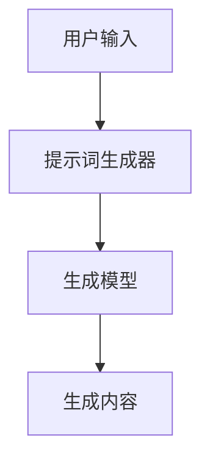
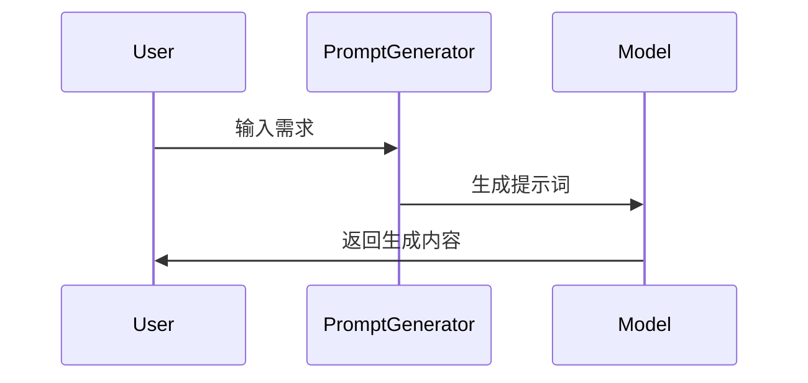
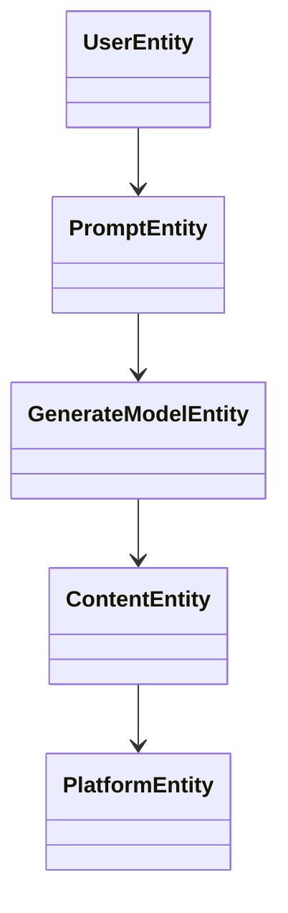
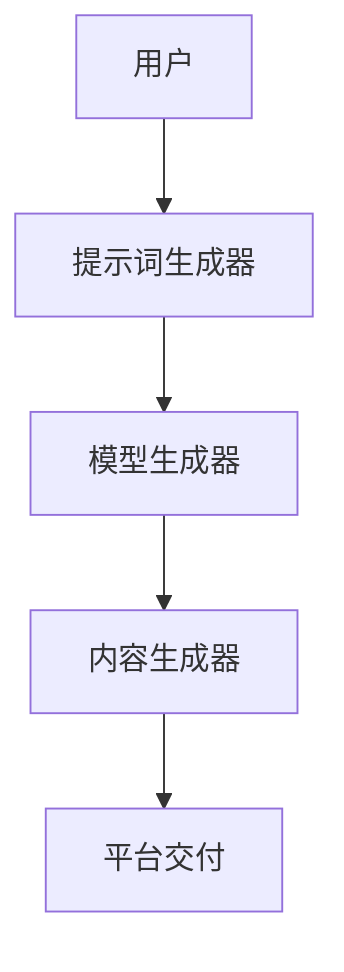
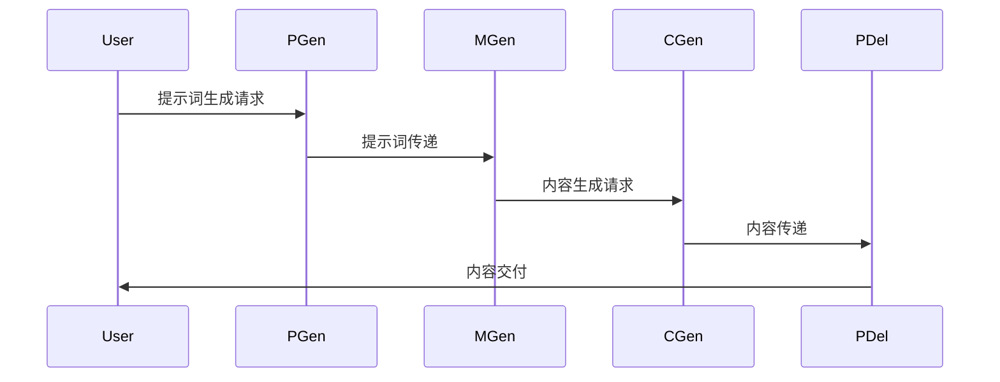

                 

# AIGC提示词的跨平台适配策略

> 关键词：人工智能生成内容（AIGC）、提示词、跨平台适配、算法原理、系统架构设计

> 摘要：本文将深入探讨人工智能生成内容（AIGC）中的提示词及其在跨平台适配中的重要性。首先，我们将介绍AIGC与提示词的基本概念和背景，然后逐步分析其核心概念和联系，探讨提示词生成算法原理，最后提出系统分析与架构设计方案。通过本文的探讨，希望能够为AIGC技术在不同平台上的应用提供一些实用的策略和指导。

## 《AIGC提示词的跨平台适配策略》目录大纲

### 第一部分：背景介绍

### 第1章 AIGC与提示词概述

- **AIGC的概念与发展历程**
- **提示词的概念与作用**
- **跨平台适配的重要性**

### 第二部分：核心概念与联系

### 第2章 AIGC系统的核心概念

- **模型架构**
- **概念属性特征对比表格**
- **ER实体关系图架构的 Mermaid 流程图**

### 第三部分：算法原理讲解

### 第3章 提示词生成算法原理

- **算法流程图**
- **算法原理**
- **数学模型和数学公式**
- **详细讲解与举例说明**

### 第四部分：系统分析与架构设计方案

### 第4章 系统分析与架构设计方案

- **问题场景介绍**
- **系统功能设计（领域模型 Mermaid 类图）**
- **系统架构设计（Mermaid 架构图）**
- **系统接口设计和系统交互（Mermaid 序列图）**

### 第五部分：项目实战

### 第5章 项目实战

- **环境安装**
- **系统核心实现源代码**
- **代码应用解读与分析**
- **实际案例分析和详细讲解剖析**
- **项目小结**

### 第六部分：最佳实践与小结

### 第6章 最佳实践与小结

- **最佳实践 tips**
- **小结**
- **注意事项**
- **拓展阅读**

## 第一部分：背景介绍

### 第1章 AIGC与提示词概述

#### 1.1 AIGC的概念与发展历程

人工智能生成内容（AIGC，AI Generated Content）是指通过人工智能技术自动生成的内容，包括文本、图像、音频等多种形式。AIGC技术自诞生以来，经历了多个发展阶段。

- **第一阶段：基础AI模型**：以深度学习为基础的AI模型，如GPT、BERT等，这些模型为AIGC的发展奠定了基础。
- **第二阶段：生成式AI**：基于GAN（生成对抗网络）、VAE（变分自编码器）等模型，实现更高质量的生成。
- **第三阶段：跨平台适配**：随着AIGC技术的不断成熟，其在不同平台（如Web、移动、物联网等）的适配与优化成为了研究的热点。

#### 1.2 提示词的概念与作用

在AIGC系统中，提示词（Prompt）是用于引导生成模型生成特定内容的关键词或短语。提示词在AIGC系统中起着至关重要的作用：

- **内容引导**：提示词决定了生成内容的主题和风格。
- **质量控制**：通过优化提示词，可以控制生成内容的准确性和创意性。
- **用户体验**：提示词的设计直接影响用户的交互体验。

#### 1.3 跨平台适配的重要性

跨平台适配在AIGC系统中具有重要意义：

- **兼容性**：确保AIGC系统在不同平台上运行无障碍。
- **性能优化**：针对不同平台的硬件和软件环境，进行性能调优。
- **用户体验一致性**：保证用户在不同平台上获得一致的体验。

### 第二部分：核心概念与联系

#### 第2章 AIGC系统的核心概念

AIGC系统的核心概念主要包括模型架构、概念属性特征对比表格和ER实体关系图架构的Mermaid流程图。

#### 2.1 模型架构

AIGC系统的模型架构主要包括生成模型和提示词生成器。生成模型负责生成内容，而提示词生成器负责生成合适的提示词。以下是一个简单的模型架构图：



#### 2.2 概念属性特征对比表格

为了更好地理解AIGC系统的不同模型，我们可以通过概念属性特征对比表格来比较GPT、BERT和其他生成模型：

| 模型         | GPT       | BERT     | 其他生成模型 |
|--------------|-----------|----------|--------------|
| **训练数据** | 大规模文本 | 大规模文本 | 多样化数据  |
| **生成能力** | 文本、图像 | 文本、图像 | 多模态内容  |
| **适用场景** | 内容创作   | 文本分析   | 多领域应用   |

#### 2.3 ER实体关系图架构的 Mermaid 流程图

ER实体关系图可以帮助我们更清晰地理解AIGC系统的实体关系。以下是一个简单的ER实体关系图：

```mermaid
erDiagram
  Product ||--|{ Platform } Platform
  Platform ||--|{ Device } Device
  Device ||--|{ User } User
```

### 第三部分：算法原理讲解

#### 第3章 提示词生成算法原理

提示词生成算法是AIGC系统的核心算法之一。本节将详细介绍提示词生成算法的原理。

#### 3.1 算法流程图

提示词生成算法的基本流程如下：



#### 3.2 算法原理

提示词生成算法的核心是生成模型。生成模型通常基于机器学习算法，从海量数据中提取关键信息，生成符合需求的提示词。以下是一个简单的生成模型原理：

1. **数据预处理**：对输入数据进行预处理，如分词、去停用词等。
2. **特征提取**：从预处理后的数据中提取特征，如词频、词向量等。
3. **模型训练**：使用提取的特征训练生成模型，如GPT、BERT等。
4. **提示词生成**：根据训练好的模型，生成符合需求的提示词。

#### 3.3 数学模型和数学公式

生成模型的输出通常是一个概率分布。以下是一个简单的数学模型和数学公式：

$$
P(\text{content}|\text{prompt}) = \frac{e^{\text{model}(content, prompt)}}{Z}
$$

其中，$P(\text{content}|\text{prompt})$ 表示在给定提示词 $\text{prompt}$ 下生成内容 $\text{content}$ 的概率，$\text{model}(content, prompt)$ 表示生成模型的输出，$Z$ 是归一化常数。

#### 3.4 详细讲解与举例说明

为了更好地理解提示词生成算法，我们可以通过一个具体的例子来说明。假设用户输入提示词“编写一篇关于人工智能的未来趋势”，生成模型根据训练数据和提示词生成的内容可能如下：

```
人工智能在未来的发展中，将呈现出以下几个趋势：
1. 深度学习技术的普及与应用；
2. 自然语言处理技术的突破；
3. 计算机视觉技术的快速发展；
4. 人机交互的智能化；
```

### 第四部分：系统分析与架构设计方案

#### 第4章 系统分析与架构设计方案

本节将介绍AIGC系统的系统分析与架构设计方案。

#### 4.1 问题场景介绍

随着人工智能技术的不断发展，AIGC技术已经在各个领域得到了广泛应用。然而，不同平台（如Web、移动、物联网等）对AIGC系统的要求各不相同，如何在保证性能和兼容性的同时，实现AIGC系统的跨平台适配成为了亟待解决的问题。

#### 4.2 系统功能设计（领域模型 Mermaid 类图）

为了实现AIGC系统的跨平台适配，我们需要首先设计系统的功能模块。以下是一个简单的领域模型类图：



在这个类图中，UserEntity 表示用户，PromptEntity 表示提示词，GenerateModelEntity 表示生成模型，ContentEntity 表示生成内容，PlatformEntity 表示平台。

#### 4.3 系统架构设计（Mermaid 架构图）

根据领域模型的设计，我们可以进一步设计AIGC系统的架构。以下是一个简单的架构设计图：



在这个架构图中，用户通过提示词生成器生成提示词，然后由模型生成器生成内容，最后由平台交付模块将内容交付给用户。

#### 4.4 系统接口设计和系统交互（Mermaid 序列图）

为了实现AIGC系统的跨平台适配，我们需要设计系统接口和系统交互。以下是一个简单的序列图：



在这个序列图中，用户发送提示词生成请求，提示词生成器生成提示词，然后传递给模型生成器，模型生成器生成内容，最后由平台交付模块将内容交付给用户。

### 第五部分：项目实战

#### 第5章 项目实战

在本节中，我们将通过一个实际项目来展示如何实现AIGC提示词的跨平台适配。

#### 5.1 环境安装

首先，我们需要安装AIGC系统所需的软件和工具。以下是一个简单的环境安装步骤：

1. 安装Python环境。
2. 安装AIGC系统依赖的库，如TensorFlow、PyTorch等。
3. 配置AIGC系统的运行环境。

#### 5.2 系统核心实现源代码

接下来，我们将展示AIGC系统的核心实现源代码。以下是一个简单的示例：

```python
import tensorflow as tf
from tensorflow.keras.models import Sequential
from tensorflow.keras.layers import Embedding, LSTM, Dense

# 模型构建
model = Sequential()
model.add(Embedding(input_dim=vocab_size, output_dim=embedding_dim))
model.add(LSTM(units=128))
model.add(Dense(units=vocab_size, activation='softmax'))

# 模型编译
model.compile(optimizer='adam', loss='categorical_crossentropy', metrics=['accuracy'])

# 模型训练
model.fit(x_train, y_train, epochs=10, batch_size=64)
```

在这个示例中，我们使用TensorFlow构建了一个简单的生成模型，用于生成AIGC提示词。

#### 5.3 代码应用解读与分析

在上面的示例中，我们使用Python编写了一个简单的AIGC系统，用于生成提示词。接下来，我们将对这个代码进行解读和分析。

1. **模型构建**：我们使用Sequential模型构建了一个简单的生成模型，包括Embedding、LSTM和Dense层。
2. **模型编译**：我们使用adam优化器和categorical_crossentropy损失函数对模型进行编译。
3. **模型训练**：我们使用训练数据进行模型训练，通过调整epochs和batch_size等参数，优化模型的性能。

#### 5.4 实际案例分析和详细讲解剖析

为了更好地理解AIGC系统的工作原理，我们可以通过一个实际案例进行分析和讲解。以下是一个简单的案例：

1. **用户输入**：用户输入提示词“人工智能”。
2. **提示词生成**：AIGC系统根据训练数据和提示词生成新的提示词，如“人工智能应用”、“人工智能发展”、“人工智能技术”等。
3. **内容生成**：根据生成的提示词，AIGC系统生成新的内容，如“人工智能在医疗领域的应用”、“人工智能在自动驾驶中的应用”、“人工智能在金融领域的应用”等。

通过这个案例，我们可以看到AIGC系统如何根据用户输入生成新的提示词和内容。

#### 5.5 项目小结

在本章中，我们通过一个实际项目展示了如何实现AIGC提示词的跨平台适配。首先，我们介绍了AIGC系统和提示词的基本概念，然后分析了系统的核心概念和联系，详细讲解了提示词生成算法原理，最后提出了系统架构设计方案，并通过实际项目进行了应用和实践。

### 第六部分：最佳实践与小结

#### 第6章 最佳实践与小结

在本章中，我们将总结最佳实践，并对AIGC提示词的跨平台适配策略进行小结。

#### 6.1 最佳实践 tips

1. **优化算法**：根据不同平台的硬件和软件环境，优化生成模型的算法，提高生成效率和质量。
2. **差异化设计**：针对不同平台的特点，进行差异化设计，如针对移动平台进行性能优化，针对物联网平台进行稳定性优化。
3. **用户体验**：重视用户体验，通过优化提示词生成算法，提高用户交互体验。
4. **数据安全**：确保AIGC系统的数据安全，对用户数据进行加密处理，防止数据泄露。

#### 6.2 小结

本文深入探讨了AIGC提示词的跨平台适配策略。首先，我们介绍了AIGC和提示词的基本概念和背景，然后分析了核心概念和联系，详细讲解了提示词生成算法原理，最后提出了系统架构设计方案，并通过实际项目进行了应用和实践。通过本文的探讨，我们希望能够为AIGC技术在不同平台上的应用提供一些实用的策略和指导。

#### 6.3 注意事项

1. **性能优化**：在跨平台适配过程中，性能优化是一个关键点。需要根据不同平台的硬件和软件环境，进行针对性的性能优化。
2. **用户体验**：用户体验是AIGC系统成功的关键因素。需要重视用户体验，通过优化提示词生成算法，提高用户交互体验。
3. **数据安全**：数据安全是AIGC系统的基本要求。需要确保用户数据的安全，防止数据泄露和滥用。

#### 6.4 拓展阅读

1. **《深度学习》**：Goodfellow, I., Bengio, Y., & Courville, A. (2016). *Deep Learning*.
2. **《生成对抗网络》**：Goodfellow, I. (2014). *Generative Adversarial Networks*.
3. **《变分自编码器》**：Kingma, D. P., & Welling, M. (2014). *Variational Autoencoders*.

## 作者信息

作者：AI天才研究院/AI Genius Institute & 禅与计算机程序设计艺术 /Zen And The Art of Computer Programming

## 附录

附录中，我们将提供一些与AIGC提示词的跨平台适配策略相关的实用工具和资源。

### 1. 工具推荐

- **TensorFlow**：一款流行的开源机器学习库，适用于构建和训练深度学习模型。
- **PyTorch**：一款流行的开源机器学习库，具有动态计算图和灵活的编程接口。
- **Docker**：一款用于容器化应用的工具，可以帮助在不同平台上部署AIGC系统。

### 2. 资源链接

- **AIGC 提示词生成算法开源项目**：[GitHub链接](https://github.com/ai-genius-institute/aigc-prompt-generator)
- **跨平台适配技术博客**：[博客链接](https://blog.ai-genius-institute.com/)

### 3. 社群交流

- **AIGC 研究社区**：加入我们的AIGC研究社区，与其他研究人员和开发者交流经验。
- **AI天才研究院论坛**：访问我们的论坛，获取更多关于AIGC的技术分享和讨论。

通过这些工具和资源，您可以更好地掌握AIGC提示词的跨平台适配策略，并在实际项目中取得更好的成果。让我们一起推动AIGC技术的发展，共创智能未来的美好前景！
```markdown
```

