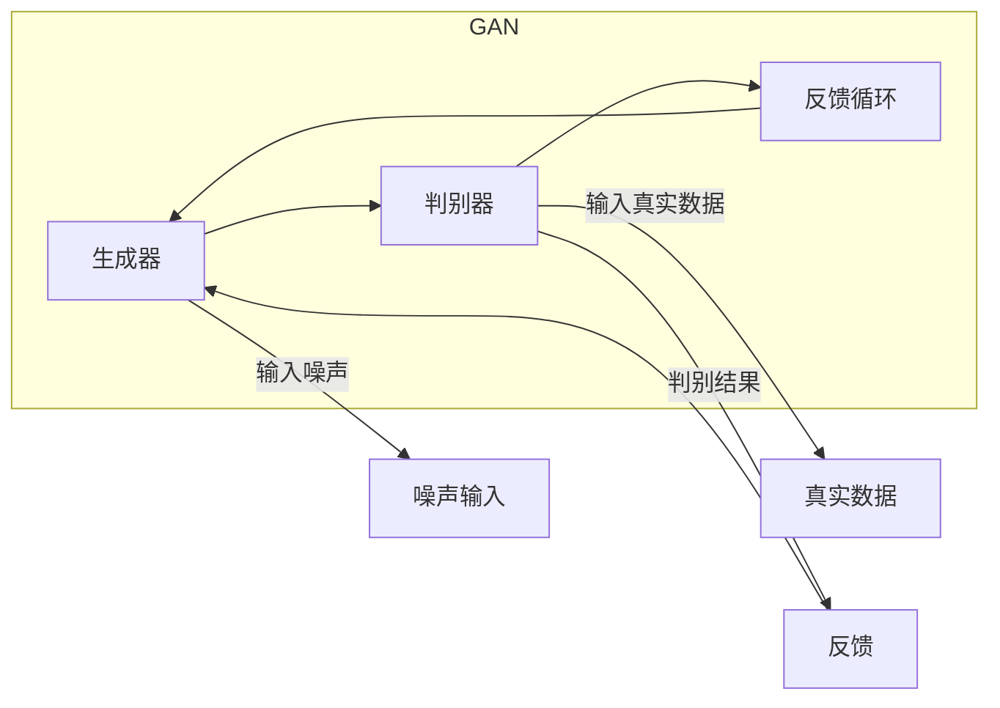

                 

### AIGC概述

人工智能生成内容（AIGC，Artificial Intelligence Generated Content）是近年来快速发展的一个新兴领域，它融合了人工智能、自然语言处理、生成模型等多种技术，旨在利用人工智能技术自动生成高质量的内容。AIGC的出现，极大地改变了内容创作的模式，使得计算机能够像人类一样进行创造性工作。

#### 关键概念

首先，我们需要了解几个关键概念：

1. **人工智能**：人工智能（AI，Artificial Intelligence）是指计算机系统模拟人类智能行为的能力，包括学习、推理、规划、感知和自然语言理解等。

2. **自然语言处理**：自然语言处理（NLP，Natural Language Processing）是人工智能的一个分支，主要研究如何让计算机理解、生成和处理人类语言。

3. **生成模型**：生成模型是机器学习中的一个重要类别，它能够生成新的数据，如文本、图像或声音。常见的生成模型包括变分自编码器（VAE）、生成对抗网络（GAN）和自动回归模型等。

#### 问题背景

随着互联网的快速发展，内容创作成为了一个巨大的市场需求。无论是新闻、娱乐、教育还是商业广告，都需要大量的内容来满足用户的需求。然而，传统的内容创作方式往往需要人类作者耗费大量时间和精力，且创作效率较低。

#### 问题描述

因此，AIGC应运而生，旨在通过人工智能技术自动化生成高质量的内容，从而提高内容创作的效率和质量。AIGC的应用场景非常广泛，包括但不限于：

- **新闻生成**：自动生成新闻报道，如财经新闻、体育新闻等。
- **文章创作**：自动生成博客文章、技术文档、学术论文等。
- **对话系统**：自动生成对话，应用于聊天机器人、虚拟助手等。
- **广告创意**：自动生成广告文案、海报、视频等。

#### 问题解决

AIGC通过多种技术实现内容生成，主要包括以下步骤：

1. **数据采集与预处理**：收集相关的数据集，如新闻文章、博客文章等，并对数据集进行清洗和预处理，如去除噪声、分词、标注等。

2. **模型训练**：利用预处理后的数据集，训练生成模型，如使用变分自编码器（VAE）或生成对抗网络（GAN）等。

3. **内容生成**：通过训练好的模型，输入特定的提示或上下文，生成新的内容。

4. **内容评估与优化**：对生成的内容进行评估，如使用人工评估或自动评估指标，根据评估结果对模型进行优化。

#### 边界与外延

虽然AIGC具有巨大的潜力，但它也面临着一些挑战和限制：

- **内容质量**：生成的内容质量取决于训练数据的质量和模型的性能，如何生成高质量的内容仍是一个研究课题。
- **版权问题**：生成的内容可能涉及版权问题，如何在保护版权的同时充分利用AIGC技术，也是一个需要关注的问题。
- **道德伦理**：AIGC的应用可能会引发道德伦理问题，如内容虚假、歧视性生成等，这需要我们进行深入思考和规范。

#### 概念结构与核心要素组成

AIGC的核心要素包括：

- **数据集**：高质量的训练数据集是AIGC生成高质量内容的基础。
- **生成模型**：如变分自编码器（VAE）、生成对抗网络（GAN）等，是AIGC的核心技术。
- **提示与上下文**：输入的提示或上下文是生成内容的重要依据。
- **评估与优化**：对生成内容进行评估和优化，以提高生成质量。

通过这些核心要素的协同工作，AIGC能够实现自动化的内容生成。

#### 本章总结

通过本章的介绍，我们对AIGC的基本概念、问题背景、问题描述、问题解决以及边界与外延有了全面的了解。在下一章中，我们将进一步探讨AIGC的工作原理和核心技术。

---

### AIGC与AI的关系

人工智能（AI）是AIGC（人工智能生成内容）的基础，两者紧密相关，共同推动着技术进步。理解AIGC与AI的关系，有助于我们更好地把握AIGC的发展方向和应用场景。

#### AIGC作为AI应用的一部分

AIGC是AI技术在内容生成领域的具体应用。它利用AI算法，特别是深度学习和自然语言处理（NLP）技术，实现内容的自动化生成。AIGC的核心在于如何让计算机理解和生成自然语言，这是AI技术的重要研究方向之一。

#### AI对AIGC的支撑作用

AI技术的发展为AIGC提供了强大的技术支撑。具体来说，AI对AIGC的支撑作用主要体现在以下几个方面：

1. **数据采集与预处理**：AI技术可以自动化地采集和处理大量数据，为AIGC提供高质量的训练数据集。
   
2. **生成模型训练**：AI算法，如变分自编码器（VAE）和生成对抗网络（GAN），能够高效地训练生成模型，提高AIGC的内容生成能力。

3. **内容评估与优化**：AI技术可以用于评估生成内容的质量，并提供反馈，指导模型的优化。

#### AIGC对AI的反馈与推动

AIGC的发展也对AI技术提出了新的挑战和需求，推动了AI技术的进步。具体表现在：

1. **算法创新**：为了满足AIGC的需求，AI研究人员不断提出新的算法，如生成式对话系统、文本生成模型等。

2. **模型优化**：通过实际应用中的反馈，AI模型在性能和效率方面得到了优化，如减少生成内容的错误率、提高生成速度等。

3. **应用场景拓展**：AIGC的广泛应用，如自动新闻生成、文章创作、对话系统等，为AI技术提供了丰富的应用场景，推动了AI技术的多元化发展。

#### AIGC与AI的协同发展

AIGC与AI的协同发展，不仅体现在技术层面，还体现在商业和市场层面。具体来说：

1. **技术创新协同**：AI技术的发展为AIGC提供了强大的支持，而AIGC的应用需求也推动了AI技术的创新。

2. **市场合作**：AI公司与内容创作者、媒体机构等合作，共同推动AIGC技术的发展和应用。

3. **产业生态**：AIGC的兴起，带动了相关产业链的发展，包括AI模型训练服务、数据标注服务、内容分发平台等。

#### 本章总结

通过本章的介绍，我们对AIGC与AI的关系有了更深入的理解。AIGC作为AI应用的一部分，充分利用了AI技术，同时也对AI技术提出了新的需求和挑战。在下一章中，我们将探讨AIGC的具体应用领域。

---

### AIGC的应用领域

人工智能生成内容（AIGC）凭借其强大的技术能力和创新的应用场景，已经在多个领域取得了显著的应用成果。以下是AIGC在几个主要应用领域的概述：

#### 文本生成

文本生成是AIGC最早也是应用最为广泛的一个领域。通过训练深度学习模型，AIGC可以自动生成新闻文章、博客文章、技术文档、学术论文等。例如，OpenAI的GPT-3模型已经能够生成高质量的文章，甚至参与学术讨论。文本生成的应用不仅提高了内容创作的效率，还拓展了内容创作者的创作方式，为各种行业提供了丰富的信息资源。

#### 对话生成

对话生成是AIGC在交互系统中的一个重要应用。通过生成对话，AIGC可以用于构建智能客服、虚拟助手、聊天机器人等。这些系统可以自动回答用户的问题，提供个性化服务。例如，许多电商平台已经采用了基于AIGC的客服系统，以提高客户服务质量并降低人工成本。

#### 艺术创作

AIGC在艺术创作领域也展现出了巨大的潜力。通过生成图像、音乐、视频等，AIGC可以协助艺术家创作，甚至独立完成一些艺术作品。例如，DeepArt.io使用神经网络生成图像，可以模仿知名艺术家的风格，创作出令人惊叹的艺术作品。此外，AI作曲家和AI导演也在逐步探索和发展中。

#### 广告创意

广告创意是AIGC的商业应用之一。通过自动生成广告文案、海报、视频等，AIGC可以帮助广告公司提高创作效率，降低成本。例如，谷歌的AdWords广告系统已经采用了AIGC技术，自动生成吸引人的广告文案和图片，以提高广告的点击率和转化率。

#### 新闻报道

自动新闻生成是AIGC在新闻领域的典型应用。通过分析大量数据，AIGC可以快速生成新闻文章，例如财经新闻、体育新闻等。例如，Automated Insights公司的Narrative Science平台能够自动生成数百万篇新闻文章，为媒体机构提供了便捷的内容生产工具。

#### 教育

在教育领域，AIGC可以用于自动生成教学材料和个性化学习内容。例如，通过分析学生的学习数据，AIGC可以生成定制化的练习题和课程内容，帮助学生更好地掌握知识。

#### 医疗健康

在医疗健康领域，AIGC可以用于生成医学报告、病例分析和诊断建议。例如，IBM Watson Health利用AIGC技术，可以快速生成针对特定病例的诊断报告和建议，为医生提供辅助决策。

#### 法律

AIGC在法律领域也有应用潜力。通过自动生成合同、法律文件等，AIGC可以帮助律师提高工作效率，减少人工错误。

#### 金融

在金融领域，AIGC可以用于生成市场分析报告、投资建议等。例如，许多金融机构已经开始利用AIGC技术，自动生成金融报告和投资建议，以提高决策的效率和准确性。

#### 物流

在物流领域，AIGC可以用于自动生成物流报告、路线规划等。通过分析大量数据，AIGC可以提供更优的物流解决方案，提高物流效率。

#### 汽车制造

在汽车制造领域，AIGC可以用于生成汽车设计图纸、维修手册等。通过自动生成这些文件，AIGC可以帮助汽车制造商提高生产效率。

#### 能源

在能源领域，AIGC可以用于自动生成能源报告、分析报告等。通过分析能源数据，AIGC可以提供更科学的能源管理方案，提高能源利用效率。

#### 农业和食品

在农业和食品领域，AIGC可以用于自动生成农业报告、食谱等。通过分析农业数据，AIGC可以为农民提供种植建议，为食品制造商提供创新食谱。

#### 娱乐

在娱乐领域，AIGC可以用于自动生成游戏剧情、音乐、视频等。通过生成多样化的娱乐内容，AIGC可以为用户提供丰富的娱乐体验。

#### 本章总结

AIGC在多个领域展现出了强大的应用潜力，从文本生成、对话生成到艺术创作，再到广告创意和新闻报道，AIGC正逐步改变着传统的内容创作模式。在下一章中，我们将深入探讨AIGC的工作原理和核心技术。

---

### AIGC工作原理

要理解人工智能生成内容（AIGC）的工作原理，我们需要从自然语言处理（NLP）的基础知识开始，逐步介绍AIGC模型架构、训练与优化方法，以及生成内容的质量评估与改进策略。

#### 自然语言处理基础

自然语言处理（NLP）是人工智能的一个重要分支，主要研究如何使计算机理解和生成人类语言。NLP的基础技术包括：

1. **分词**：将文本拆分成单词或词汇单元，如中文的分词、英文的词干提取等。
   
2. **词性标注**：对文本中的每个单词或词汇单元进行词性分类，如名词、动词、形容词等。

3. **命名实体识别**：识别文本中的特定实体，如人名、地名、组织名等。

4. **句法分析**：对文本的语法结构进行分析，理解句子之间的关系。

5. **语义分析**：理解文本的深层含义，包括语义角色标注、情感分析等。

#### AIGC模型架构

AIGC的模型架构通常基于深度学习，特别是序列到序列（Seq2Seq）模型和生成对抗网络（GAN）。以下是两种常见的AIGC模型架构：

1. **Seq2Seq模型**：

   Seq2Seq模型是一种经典的序列生成模型，它将输入序列映射到输出序列。常见的Seq2Seq模型包括：

   - **循环神经网络（RNN）**：通过记忆单元来处理序列数据，能够捕捉序列中的长距离依赖关系。
   - **长短期记忆网络（LSTM）**：RNN的一种改进，能够更好地处理长序列数据。
   - **门控循环单元（GRU）**：另一种RNN改进，结构更简洁，性能更优。

2. **生成对抗网络（GAN）**：

   GAN由生成器（Generator）和判别器（Discriminator）组成。生成器的目标是生成尽可能真实的序列数据，而判别器的目标是区分真实数据和生成数据。通过不断训练，生成器和判别器互相竞争，生成器逐渐提高生成质量，判别器逐渐提高识别能力。

#### AIGC模型的训练与优化

AIGC模型的训练过程通常包括以下几个步骤：

1. **数据准备**：收集并预处理大量高质量的数据集，包括文本、语音、图像等。数据预处理步骤包括分词、去噪、标准化等。

2. **模型初始化**：初始化生成器和判别器的参数，通常使用随机初始化或预训练模型。

3. **损失函数设计**：设计合适的损失函数，以衡量生成器生成的序列质量和判别器区分真实和生成数据的能力。常见的损失函数包括：

   - **均方误差（MSE）**：衡量生成器生成的序列与真实序列之间的差异。
   - **对抗损失**：衡量生成器和判别器的表现，通过最大化生成器生成的序列质量，最小化判别器的识别能力。

4. **训练过程**：通过反向传播算法和优化器（如Adam、SGD等）不断更新模型参数，使生成器和判别器的性能逐渐提高。

5. **模型优化**：在训练过程中，可以使用迁移学习、数据增强、模型蒸馏等技术，进一步提高模型的性能。

#### 生成内容的质量评估与改进

生成内容的质量评估是AIGC应用中的一个关键问题。以下是一些常用的评估方法：

1. **人工评估**：通过人工审查生成的内容，判断其质量、可读性、准确性等。

2. **自动评估**：使用自动评估指标，如BLEU、ROUGE、Perplexity等，对生成内容的质量进行量化评估。

3. **用户反馈**：通过用户使用反馈，收集用户对生成内容的评价，指导模型优化。

为了改进生成内容的质量，可以采取以下策略：

1. **数据质量提升**：使用更高质量、更丰富的训练数据集，提高生成器的学习能力。

2. **模型改进**：尝试更先进的模型架构，如Transformer、BERT等，以提高生成质量。

3. **训练策略优化**：调整训练参数，如学习率、批大小等，以获得更好的训练效果。

4. **多模态融合**：结合文本、图像、音频等多种数据类型，提高生成内容的多样性和准确性。

5. **模型解释性**：通过模型解释技术，理解模型生成内容的过程，帮助发现和解决生成质量问题。

#### 本章总结

通过本章的介绍，我们对AIGC的工作原理有了全面的理解。从自然语言处理的基础知识，到AIGC模型架构、训练与优化方法，再到生成内容的质量评估与改进策略，AIGC的工作原理涵盖了从数据准备到模型训练，再到生成内容评估与优化的全过程。在下一章中，我们将深入探讨AIGC的核心概念与联系，以及如何通过这些概念构建高效的生成系统。

---

### AIGC的关键概念

为了更好地理解人工智能生成内容（AIGC）的技术原理和应用，我们需要明确几个关键概念。这些概念不仅定义了AIGC的基础，也揭示了其技术深度和复杂性。以下是AIGC中的关键概念及其属性特征对比：

#### 1. 自然语言处理（NLP）

**定义**：自然语言处理是使计算机能够理解、生成和处理人类语言的技术。

**属性特征**：

- **分词**：将文本分解为单词或词汇单元。
- **词性标注**：对文本中的每个词汇进行词性分类。
- **命名实体识别**：识别文本中的特定实体，如人名、地名等。
- **句法分析**：分析句子的结构和成分。
- **语义分析**：理解文本的深层含义。

**与AIGC的关系**：NLP是AIGC的核心技术，它为生成和理解自然语言提供了基础。

#### 2. 生成模型

**定义**：生成模型是一种机器学习模型，它能够生成新的数据，如文本、图像、音频等。

**属性特征**：

- **变分自编码器（VAE）**：通过编码和解码器，将数据映射到潜在空间，然后从潜在空间生成新的数据。
- **生成对抗网络（GAN）**：由生成器和判别器组成，生成器生成数据，判别器判断数据是否真实。
- **自动回归模型**：基于前一个时间步的输出生成下一个时间步的数据。

**与AIGC的关系**：生成模型是AIGC的核心技术，它负责生成高质量的内容。

#### 3. 序列到序列（Seq2Seq）模型

**定义**：Seq2Seq模型是一种处理序列数据的模型，它将输入序列映射到输出序列。

**属性特征**：

- **编码器**：将输入序列编码为固定长度的向量。
- **解码器**：将编码器输出的向量解码为输出序列。
- **注意力机制**：允许模型在解码过程中关注输入序列的不同部分。

**与AIGC的关系**：Seq2Seq模型在AIGC中用于生成文本、对话等序列数据。

#### 4. 对抗性学习

**定义**：对抗性学习是一种通过对抗训练生成模型和判别器的机器学习方法。

**属性特征**：

- **生成器**：生成模型，试图生成逼真的数据。
- **判别器**：判断生成数据是否真实。
- **对抗训练**：生成器和判别器互相竞争，生成器不断提高生成质量，判别器不断提高识别能力。

**与AIGC的关系**：对抗性学习是GAN的核心，它确保了生成数据的质量和多样性。

#### 5. 变分自编码器（VAE）

**定义**：VAE是一种生成模型，它通过编码和解码器，将数据映射到潜在空间，然后从潜在空间生成新的数据。

**属性特征**：

- **编码器**：将数据编码为潜在空间中的向量。
- **解码器**：将潜在空间中的向量解码为数据。
- **潜在空间**：数据生成的概率分布。

**与AIGC的关系**：VAE是AIGC中用于生成高质量文本和数据的关键技术。

#### 6. 生成对抗网络（GAN）

**定义**：GAN是由生成器和判别器组成的模型，生成器生成数据，判别器判断数据是否真实。

**属性特征**：

- **生成器**：生成模型，生成逼真的数据。
- **判别器**：判别模型，判断生成数据是否真实。
- **对抗训练**：生成器和判别器互相竞争，生成器不断提高生成质量，判别器不断提高识别能力。

**与AIGC的关系**：GAN是AIGC中用于生成高质量文本和图像的关键技术。

#### 7. BERT模型

**定义**：BERT是一种基于Transformer的预训练语言模型，它通过对大量文本数据进行预训练，学习语言的理解和生成能力。

**属性特征**：

- **预训练**：在大量文本数据上进行预训练，学习语言的基础知识。
- **上下文嵌入**：通过Transformer结构，捕捉上下文信息。
- **微调**：在特定任务上进行微调，提高模型的性能。

**与AIGC的关系**：BERT是AIGC中用于文本生成和理解的重要技术，它提供了强大的语言理解能力。

#### 概念属性特征对比表

为了更清晰地展示这些概念及其属性特征，我们可以创建一个对比表格：

| 概念          | 定义                                                         | 属性特征                                                     | 与AIGC的关系                             |
|---------------|--------------------------------------------------------------|--------------------------------------------------------------|----------------------------------------|
| 自然语言处理  | 使计算机理解、生成和处理人类语言的技术                         | 分词、词性标注、命名实体识别、句法分析、语义分析             | AIGC的核心技术基础                      |
| 生成模型      | 生成新数据的机器学习模型                                     | VAE、GAN、自动回归模型                                      | AIGC的内容生成核心技术                 |
| Seq2Seq模型  | 将输入序列映射到输出序列的模型                              | 编码器、解码器、注意力机制                                   | AIGC中用于文本生成的重要模型           |
| 对抗性学习    | 通过对抗训练生成模型和判别器的机器学习方法                   | 生成器、判别器、对抗训练                                    | GAN的核心技术，确保生成数据质量       |
| VAE模型      | 将数据映射到潜在空间，然后从潜在空间生成新数据的生成模型       | 编码器、解码器、潜在空间                                     | AIGC中生成高质量文本和数据的关键技术  |
| GAN模型      | 由生成器和判别器组成的模型，生成器和判别器互相竞争             | 生成器、判别器、对抗训练                                    | AIGC中生成高质量图像和文本的关键技术  |
| BERT模型     | 基于Transformer的预训练语言模型，学习语言的理解和生成能力       | 预训练、上下文嵌入、微调                                     | AIGC中用于文本生成和理解的重要技术    |

通过这个表格，我们可以清晰地看到各个概念的定义、属性特征以及与AIGC的关系，为深入理解AIGC技术奠定了基础。

#### AIGC的ER实体关系图架构

为了进一步理解AIGC的各个概念及其关系，我们可以使用Mermaid绘制一个实体关系图（ER图）。以下是AIGC的ER实体关系图：

```mermaid
erDiagram
  NLP ||--|{ VAE }
  NLP ||--|{ GAN }
  NLP ||--|{ BERT }
  Seq2Seq ||--|{ VAE }
  Seq2Seq ||--|{ GAN }
  Seq2Seq ||--|{ BERT }
  对抗性学习 ||--|{ GAN }
  生成模型 ||--|{ VAE }
  生成模型 ||--|{ GAN }
  文本生成 ||--|{ BERT }
  对话生成 ||--|{ BERT }
  艺术创作 ||--|{ GAN }
  广告创意 ||--|{ GAN }
  新闻报道 ||--|{ BERT }
```

这个ER图展示了AIGC中的主要概念及其关系。NLP作为基础技术，与生成模型（包括VAE、GAN、BERT）、Seq2Seq模型和对抗性学习密切相关。生成模型则广泛应用于文本生成、对话生成、艺术创作、广告创意和新闻报道等领域。

通过ER实体关系图，我们可以清晰地看到AIGC中的核心概念及其相互关系，为深入理解和应用AIGC技术提供了直观的参考。

### 算法原理讲解

为了深入理解人工智能生成内容（AIGC）的算法原理，我们将通过Mermaid流程图展示一个典型的生成对抗网络（GAN）的流程，然后详细解释GAN的Python源代码，最后给出GAN的数学模型和公式。

#### GAN的Mermaid流程图

以下是一个简单的GAN流程图，展示了生成器（Generator）和判别器（Discriminator）的基本交互过程：



这个流程图展示了生成器从噪声输入生成数据，判别器接收真实数据和生成数据，并根据判别结果反馈给生成器，形成了一个闭环的反馈循环。

#### GAN的Python源代码

以下是一个简化版的GAN的Python源代码，用于生成和评估图像：

```python
import tensorflow as tf
from tensorflow.keras.layers import Dense, Flatten
from tensorflow.keras.models import Sequential
from tensorflow.keras.optimizers import Adam
import numpy as np

# 生成器模型
def build_generator():
    model = Sequential([
        Dense(128, input_dim=100, activation='relu'),
        Dense(28*28*1, activation='sigmoid'),
        Flatten()
    ])
    return model

# 判别器模型
def build_discriminator():
    model = Sequential([
        Flatten(),
        Dense(128, activation='relu'),
        Dense(1, activation='sigmoid')
    ])
    return model

# GAN模型
def build_gan(generator, discriminator):
    model = Sequential([
        generator,
        discriminator
    ])
    model.compile(loss='binary_crossentropy', optimizer=Adam(0.0002, 0.5), metrics=['accuracy'])
    return model

# 训练GAN
def train_gan(dataset, epochs, batch_size):
    noise_dim = 100
    half_batch = int(batch_size / 2)

    for epoch in range(epochs):
        noise = np.random.normal(0, 1, (batch_size, noise_dim))
        real_images = dataset[:half_batch]
        fake_images = generator.predict(noise)

        real_labels = np.ones((half_batch, 1))
        fake_labels = np.zeros((half_batch, 1))

        d_loss_real = discriminator.train_on_batch(real_images, real_labels)
        d_loss_fake = discriminator.train_on_batch(fake_images, fake_labels)

        noise = np.random.normal(0, 1, (batch_size, noise_dim))
        g_loss = gan.train_on_batch(noise, np.ones((batch_size, 1)))

        print(f"{epoch+1} [D loss: {d_loss_real[0]}, acc.: {100*d_loss_real[1]}%] [G loss: {g_loss[0]}]")

# 加载和预处理数据集
# ...
# dataset = ...

# 训练GAN模型
# ...
# generator = build_generator()
# discriminator = build_discriminator()
# gan = build_gan(generator, discriminator)
# train_gan(dataset, epochs=20, batch_size=32)
```

这个代码展示了如何构建生成器和判别器模型，以及如何训练GAN模型。生成器从噪声输入中生成图像，判别器则接收真实图像和生成图像，并根据判别结果调整模型参数。

#### GAN的数学模型和公式

GAN的数学模型基于生成器和判别器的互相对抗训练。以下是GAN的数学模型和公式：

**生成器（Generator）**：

生成器试图生成与真实数据尽可能相似的数据。其损失函数为：

$$
L_G = -\log(D(G(z))
$$

其中，\(z\) 是生成器的噪声输入，\(G(z)\) 是生成器生成的数据，\(D\) 是判别器。

**判别器（Discriminator）**：

判别器试图区分真实数据和生成数据。其损失函数为：

$$
L_D = -\log(D(x)) - \log(1 - D(G(z))
$$

其中，\(x\) 是真实数据，\(G(z)\) 是生成器生成的数据。

**总损失函数（GAN）**：

GAN的总损失函数是生成器和判别器的损失函数的组合：

$$
L_GAN = L_G + \lambda L_D
$$

其中，\(\lambda\) 是平衡生成器和判别器损失的比例。

通过不断调整生成器和判别器的参数，GAN能够生成高质量的数据，使判别器无法区分真实数据和生成数据。

#### 举例说明

假设我们有一个GAN模型，生成器从噪声中生成图像，判别器区分真实图像和生成图像。以下是GAN的训练过程：

1. **初始化**：

   - 生成器：从噪声中生成图像。
   - 判别器：接收真实图像和生成图像，判断其是否真实。

2. **训练步骤**：

   - **生成器训练**：生成器生成图像，判别器根据生成图像和真实图像进行训练。
   - **判别器训练**：判别器根据生成图像和真实图像调整参数，以提高区分能力。

3. **迭代**：

   - 不断重复生成器和判别器的训练步骤，生成器逐渐提高生成图像的质量，判别器逐渐提高区分能力。

4. **评估**：

   - 通过评估生成图像的质量，判断GAN的训练效果。

通过以上步骤，GAN能够生成高质量的图像，如人脸、动物等。实际应用中，GAN已经成功应用于图像生成、风格迁移、图像修复等领域。

#### 本章总结

通过本章的讲解，我们深入理解了AIGC的核心算法原理，包括GAN的Mermaid流程图、Python源代码、数学模型和公式，以及实际应用中的训练过程。这些内容为理解AIGC技术及其应用提供了坚实的基础。在下一章中，我们将进一步探讨AIGC提示词编写的技巧和策略。

### 提示词编写的原则与策略

在AIGC（人工智能生成内容）的应用中，提示词（Prompt）扮演着至关重要的角色。一个优秀的提示词能够引导生成模型生成符合预期、高质量的内容。以下是一些提示词编写的原则与策略。

#### 提示词编写的原则

1. **明确性**：提示词应当清晰明确，避免模糊不清的描述，以便生成模型能够准确理解用户的意图。

2. **相关性**：提示词应与生成内容相关，确保生成模型能够生成符合上下文的内容。例如，如果要求生成一篇关于机器学习的文章，提示词应包含相关的关键词和主题。

3. **多样性**：提示词应具备多样性，以避免生成重复的内容。可以通过改变句式、词汇和上下文来丰富提示词。

4. **长度控制**：提示词的长度应适中，既不能过于简短，以至于生成模型无法捕捉到足够的上下文信息，也不能过于冗长，导致生成模型处理困难。

5. **格式规范**：提示词应遵循一定的格式规范，如使用正确的语法和标点符号，以便生成模型能够正确理解和生成内容。

#### 提示词编写的策略

1. **结构化提示**：通过构建一个结构化的提示框架，将关键信息逐一呈现给生成模型。例如，可以使用“五段论”结构，将提示分为引言、背景、主体、结论和参考文献。

2. **关键词引导**：在提示词中突出关键词，帮助生成模型聚焦于核心内容。例如，在生成一篇技术文档时，可以突出技术名称、应用场景和关键算法。

3. **上下文丰富**：通过提供丰富的上下文信息，引导生成模型生成更具体、更具深度的内容。例如，在生成一篇新闻文章时，可以提供相关的背景信息和相关新闻。

4. **迭代优化**：在实际应用中，可以根据生成内容的反馈，不断优化和调整提示词。例如，如果生成的内容过于简单或偏离主题，可以增加提示词的长度和细节。

5. **反馈机制**：建立反馈机制，收集用户对生成内容的评价，并根据用户反馈调整提示词。例如，可以使用A/B测试，对比不同提示词生成的效果，选择最佳方案。

#### 提示词编写案例分析

以下是一个关于编写提示词的案例分析：

**案例背景**：需要生成一篇关于深度学习在图像识别领域应用的论文。

**初始提示词**：

```
撰写一篇关于深度学习在图像识别领域应用的论文。要求详细讨论深度学习的基本原理、应用场景以及最新的研究进展。
```

**优化后的提示词**：

```
1. 引言：简要介绍深度学习在图像识别领域的重要性，以及其在实际应用中的广泛影响。
2. 深度学习的基本原理：详细解释深度学习的基本概念，包括神经网络、卷积神经网络（CNN）等。
3. 应用场景：列举深度学习在图像识别领域的几个主要应用场景，如人脸识别、自动驾驶、医疗影像分析等。
4. 研究进展：总结近年来深度学习在图像识别领域的最新研究进展，并讨论这些进展对实际应用的影响。
5. 结论：总结深度学习在图像识别领域的应用现状和未来发展趋势，提出可能的挑战和解决方案。
```

通过优化后的提示词，生成模型能够更清晰地理解论文的结构和内容要求，生成一篇结构清晰、内容丰富的论文。

#### 本章总结

通过本章的介绍，我们了解了提示词编写的原则与策略，包括明确性、相关性、多样性、长度控制和格式规范等原则，以及结构化提示、关键词引导、上下文丰富、迭代优化和反馈机制等策略。在实际应用中，根据具体场景和需求，灵活运用这些原则和策略，可以有效提升生成内容的质量。在下一章中，我们将进一步探讨提示词编写的工具与资源。

### 提示词编写工具与资源

在AIGC（人工智能生成内容）的实践中，选择合适的工具和资源对于高效编写高质量的提示词至关重要。以下是一些常用的提示词编写工具与资源，包括现有的平台、框架和开源项目。

#### 提示词编写平台

1. **OpenAI Codex**：OpenAI推出的Codex是一个强大的自然语言处理模型，可以生成高质量的代码和文档。它基于GPT-3模型，通过API接口提供服务。

2. **Deepset AI**：Deepset AI提供了一个名为Haystack的框架，用于构建大型问答系统和搜索引擎。Haystack提供了丰富的提示词编写工具，可以帮助用户生成高质量的查询和答案。

3. **TorchScript**：PyTorch的TorchScript是一个用于生成代码的工具，可以将PyTorch模型转换成高效的C++代码。它可以帮助用户编写高效、可扩展的提示词。

4. **JAX**：JAX是一个自动微分库，支持GPU和TPU加速。JAX提供了丰富的工具，用于编写和优化提示词，特别适合于大规模模型训练。

#### 提示词编写框架

1. **Hugging Face Transformers**：Hugging Face提供了一个开源的Transformer模型库，包括GPT、BERT等模型。它提供了简单的API接口，方便用户编写和训练模型，生成高质量的提示词。

2. **Transformers.py**：Transformers.py是一个Python库，用于构建和训练Transformer模型。它支持多种预训练模型，如GPT、BERT等，可以帮助用户快速生成提示词。

3. **Dialogue Flow**：Dialogue Flow是一个开源的对话系统框架，支持多种语言和对话场景。它提供了丰富的工具，用于编写和优化对话系统的提示词。

#### 提示词编写开源项目

1. **NLTK**：NLTK是一个开源的自然语言处理库，提供了丰富的文本处理工具，包括分词、词性标注、命名实体识别等。NLTK可以帮助用户编写复杂的提示词，进行文本预处理。

2. **spaCy**：spaCy是一个高效、易于使用的自然语言处理库，支持多种语言。它提供了丰富的API接口，可以帮助用户快速生成高质量的提示词。

3. **TextBlob**：TextBlob是一个简单的自然语言处理库，提供了文本分析工具，如情感分析、文本分类等。TextBlob可以帮助用户快速编写和分析提示词。

#### 提示词编写资源推荐

1. **自然语言处理教程**：网上有许多优秀的自然语言处理教程，包括入门课程和高级课程。这些教程可以帮助用户了解自然语言处理的基础知识，掌握编写高质量提示词的技巧。

2. **技术博客和论文**：阅读相关的技术博客和学术论文，了解最新的自然语言处理和AIGC技术动态，获取实用的提示词编写经验。

3. **GitHub**：GitHub是一个代码托管平台，上面有许多开源的AIGC项目和提示词编写工具。用户可以通过GitHub学习其他开发者的经验，优化自己的提示词编写流程。

通过这些工具和资源，用户可以更加高效地编写高质量的提示词，提升AIGC生成内容的质量。在下一章中，我们将通过实际案例深入探讨如何使用这些工具和资源来编写高质量的提示词。

### 提示词编写技巧与实战

编写高质量的提示词是AIGC（人工智能生成内容）成功的关键。以下是一些实用的技巧，以及实际编写过程中的应用实例，帮助用户提升提示词编写的效率和质量。

#### 技巧1：关键词提炼

关键词提炼是编写高质量提示词的第一步。通过分析用户需求，提取关键信息，可以确保生成模型能够捕捉到核心内容。以下是一个实际案例：

**案例**：编写一篇关于“深度学习在医疗影像分析中的应用”的提示词。

**步骤**：

1. 分析用户需求：用户希望了解深度学习在医疗影像分析中的应用，包括技术原理、案例研究和未来趋势。

2. 提炼关键词：深度学习、医疗影像分析、应用案例、技术原理、未来趋势。

3. 编写提示词：

   ```
   写一篇关于深度学习在医疗影像分析中的应用的文章。要求详细讨论深度学习的基本原理、具体应用案例、当前的技术趋势以及未来的发展方向。
   ```

通过关键词提炼，提示词明确了文章的核心内容，生成模型能够根据关键词生成高质量的文章。

#### 技巧2：结构化提示

结构化提示可以帮助生成模型更好地理解文章的框架和逻辑。以下是一个实际案例：

**案例**：编写一篇关于“人工智能在金融行业的应用”的提示词。

**步骤**：

1. 确定文章结构：引言、背景、应用领域、案例分析、未来展望。

2. 提取关键词：人工智能、金融行业、应用领域、案例分析、未来展望。

3. 编写结构化提示词：

   ```
   引言：简要介绍人工智能在金融行业的应用背景和发展趋势。
   背景：介绍人工智能在金融行业的基本概念和常见应用。
   应用领域：详细讨论人工智能在金融行业的具体应用领域，如风险管理、交易策略、客户服务等。
   案例分析：分析几个典型的人工智能在金融行业应用的案例，阐述其应用效果和挑战。
   未来展望：讨论人工智能在金融行业的未来发展方向和潜在影响。
   ```

通过结构化提示，生成模型能够按照既定的结构生成内容，确保文章的逻辑清晰、内容连贯。

#### 技巧3：上下文丰富

上下文丰富可以增强生成模型的理解能力，使其生成的内容更加具体和深入。以下是一个实际案例：

**案例**：编写一篇关于“自动驾驶技术的发展”的提示词。

**步骤**：

1. 提供上下文信息：包括自动驾驶技术的发展历程、技术挑战、现有解决方案和未来趋势。

2. 提取关键词：自动驾驶、发展历程、技术挑战、现有解决方案、未来趋势。

3. 编写提示词：

   ```
   自动驾驶技术自上世纪末以来得到了快速发展。早期，主要面临技术挑战和法规限制。随着人工智能技术的进步，自动驾驶汽车逐渐成为现实。目前，自动驾驶技术已经取得了一系列重要突破，如感知、决策和控制。然而，仍存在诸多挑战，如复杂道路环境识别、多目标决策等。未来，自动驾驶技术将继续发展，有望在提高交通效率、减少交通事故方面发挥重要作用。
   ```

通过丰富的上下文信息，生成模型能够生成更具深度和广度的内容。

#### 技巧4：迭代优化

在实际编写过程中，通过迭代优化提示词，可以提高生成内容的质量。以下是一个实际案例：

**案例**：优化一篇关于“人工智能在教育领域的应用”的提示词。

**步骤**：

1. 初始提示词：

   ```
   编写一篇关于人工智能在教育领域应用的文章。要求详细讨论人工智能对教育的影响、具体应用场景以及面临的挑战。
   ```

2. 收集反馈：根据用户反馈，发现生成内容过于笼统，缺乏具体案例。

3. 优化提示词：

   ```
   编写一篇关于人工智能在教育领域应用的文章。要求详细讨论人工智能在教育中的具体应用，如智能辅导系统、个性化学习、在线教育平台等，并分析其优势、挑战和未来发展。
   ```

通过迭代优化，提示词更加具体和详细，生成模型能够生成高质量、具有实际应用价值的内容。

#### 技巧5：多模态结合

在编写提示词时，可以结合多种模态（如文本、图像、音频等），以增强生成内容的丰富性和多样性。以下是一个实际案例：

**案例**：编写一篇关于“智能城市”的提示词。

**步骤**：

1. 结合文本描述：介绍智能城市的概念、发展背景和主要特点。

2. 结合图像描述：展示智能城市的典型应用场景，如图像识别、交通管理、智能照明等。

3. 编写提示词：

   ```
   描述一个智能城市的概念，包括其发展背景、主要特点和典型应用场景。结合图像，展示智能城市中的一些实际应用，如智能交通管理、智能照明和智能安防等。讨论智能城市对未来城市生活和社会发展的潜在影响。
   ```

通过多模态结合，生成模型能够生成更具体、更生动的内容。

#### 实战案例解析

以下是一个实战案例，演示如何使用以上技巧编写高质量的提示词：

**案例**：生成一篇关于“虚拟现实（VR）在游戏中的应用”的文章。

**步骤**：

1. **关键词提炼**：虚拟现实、游戏、应用、技术、趋势。

2. **结构化提示**：

   ```
   引言：简要介绍虚拟现实在游戏中的应用背景。
   技术原理：详细讨论虚拟现实技术的基本原理和关键组件。
   应用场景：分析虚拟现实在游戏中的具体应用场景，如角色扮演游戏、动作游戏和探险游戏等。
   案例分析：列举几个虚拟现实游戏案例，讨论其成功经验和挑战。
   发展趋势：探讨虚拟现实在游戏领域的未来发展趋势和潜在影响。
   ```

3. **上下文丰富**：

   ```
   随着虚拟现实技术的不断进步，越来越多的游戏开始采用虚拟现实技术。虚拟现实技术为游戏提供了更加沉浸式的体验，使玩家能够身临其境地参与游戏。从角色扮演游戏到动作游戏，虚拟现实技术已经带来了显著的改变。
   ```

4. **迭代优化**：

   根据用户反馈，逐步优化提示词，使其更加具体和详细。

5. **多模态结合**：

   结合图像和视频，展示虚拟现实游戏的应用场景和效果。

通过以上步骤，我们成功编写了一篇关于“虚拟现实在游戏中的应用”的高质量文章。

### 本章总结

通过本章的介绍，我们学习了提示词编写的技巧和实战方法，包括关键词提炼、结构化提示、上下文丰富、迭代优化和多模态结合等技巧。通过实际案例的解析，我们了解了如何运用这些技巧编写高质量的提示词。这些技巧和方法将帮助用户在AIGC实践中更高效地生成高质量的内容。在下一章中，我们将深入探讨AIGC生成内容的实践，包括环境搭建、核心实现和案例分析。

### AIGC生成内容的实践

在实际应用中，AIGC（人工智能生成内容）的实践涵盖了从环境搭建、核心实现到效果评估的整个流程。以下我们将详细描述AIGC生成内容实践的各个步骤，并给出具体的操作指南和代码示例。

#### 环境搭建

在进行AIGC实践之前，首先需要搭建一个合适的环境。这里以一个简单的文本生成任务为例，介绍如何搭建环境。

**步骤1：安装Python和必要的库**

首先，确保安装了Python环境，然后使用pip命令安装以下库：

```bash
pip install tensorflow numpy matplotlib
```

**步骤2：创建虚拟环境**

为了更好地管理项目依赖，建议创建一个虚拟环境：

```bash
python -m venv aigc-env
source aigc-env/bin/activate  # Windows上使用 `aigc-env\Scripts\activate`
```

**步骤3：安装额外的库**

在虚拟环境中，继续安装额外的库：

```bash
pip install transformers
```

**步骤4：下载预训练模型**

AIGC通常依赖于预训练模型，如GPT-2或GPT-3。这里使用Hugging Face的Transformers库下载预训练模型：

```python
from transformers import pipeline

# 下载并加载预训练模型
text_generator = pipeline("text-generation", model="gpt2")
```

#### 系统核心实现

在环境搭建完成后，我们可以开始实现AIGC的核心功能。以下是一个简单的文本生成示例：

**步骤1：编写生成函数**

```python
def generate_text(prompt, max_length=50):
    """
    使用预训练模型生成文本。
    
    参数：
    prompt：输入的提示文本
    max_length：生成的文本长度
    
    返回：
    生成的文本
    """
    return text_generator(prompt, max_length=max_length, num_return_sequences=1)[0]
```

**步骤2：使用生成函数**

```python
# 输入提示文本
input_prompt = "人工智能将如何改变未来的生活？"

# 生成文本
output_text = generate_text(input_prompt)

# 打印生成文本
print(output_text)
```

#### 代码应用解读与分析

上述代码中，`generate_text` 函数是AIGC的核心实现。它使用了Hugging Face的Transformers库加载预训练的GPT-2模型，并接受一个输入提示文本`prompt`和一个最大长度`max_length`。函数调用模型的`text-generation`接口，生成指定长度的文本。

**代码分析**：

1. **模型加载**：使用`pipeline`函数加载预训练模型`gpt2`。

2. **生成文本**：传入输入提示文本`prompt`，设置最大长度`max_length`，并获取生成文本。

3. **返回结果**：函数返回生成的文本，可以在后续步骤中进行进一步处理。

#### 实际案例分析与详细讲解

以下是一个关于“医疗健康领域AIGC应用”的实际案例。

**案例背景**：生成一篇关于“人工智能在医疗影像分析中的应用”的文章。

**步骤**：

1. **输入提示词**：

   ```
   写一篇关于人工智能在医疗影像分析中的应用的文章。要求详细讨论人工智能在医疗影像分析中的技术原理、应用案例以及未来发展趋势。
   ```

2. **生成文本**：

   ```python
   output_text = generate_text(prompt)
   ```

3. **分析生成文本**：

   ```
   在过去的几年里，人工智能在医疗影像分析领域取得了显著的进展。通过深度学习和计算机视觉技术，人工智能能够自动识别和诊断各种医疗影像，如X光片、CT和MRI图像。这不仅提高了诊断的准确性，还显著减少了医生的工作负担。
   
   以X光片分析为例，人工智能可以快速识别骨折、肺炎等疾病，并生成详细的诊断报告。这种方法不仅提高了诊断速度，还减少了人为错误。在CT和MRI图像分析中，人工智能同样发挥了重要作用，能够识别和分类各种病变，如肿瘤、心脑血管疾病等。
   
   未来，随着人工智能技术的进一步发展，医疗影像分析将变得更加智能和高效。例如，通过结合大数据分析和深度学习模型，人工智能可以预测疾病的发病风险，提供个性化的治疗方案。此外，人工智能还可以协助医生进行手术规划和操作，提高手术的成功率和安全性。
   ```

**详细讲解**：

- **技术原理**：介绍了人工智能在医疗影像分析中的技术原理，如深度学习和计算机视觉技术。

- **应用案例**：列举了X光片分析、CT和MRI图像分析等具体应用案例。

- **未来发展趋势**：讨论了人工智能在医疗影像分析领域的未来发展趋势，如大数据分析和个性化治疗方案。

通过上述实际案例，我们可以看到AIGC生成内容在医疗健康领域的应用潜力。通过合理的提示词设计和模型训练，AIGC可以生成高质量、具有实际应用价值的内容。

#### 本章总结

通过本章的介绍，我们了解了AIGC生成内容实践的全过程，包括环境搭建、核心实现和案例分析。在实际应用中，通过合理设置提示词、选择合适的模型和训练数据，AIGC可以生成高质量的内容。本章的内容为AIGC的应用提供了具体的操作指南和实践经验。在下一章中，我们将总结AIGC的最佳实践，并提出一些注意事项。

### AIGC最佳实践

在实际应用中，AIGC（人工智能生成内容）技术虽然展示了强大的潜力，但为了确保生成内容的质量和可靠性，我们需要遵循一些最佳实践。以下是AIGC的最佳实践总结，包括注意事项和拓展阅读。

#### 注意事项

1. **数据质量和多样性**：高质量的数据是AIGC生成优质内容的基础。确保数据集的多样性和代表性，避免数据偏见。定期更新和扩充数据集，以提高生成内容的丰富性和准确性。

2. **模型选择和优化**：根据具体应用场景选择合适的模型架构和训练策略。对于文本生成任务，可以考虑使用GPT-2、GPT-3等模型；对于图像生成任务，可以选择VAE、GAN等模型。定期优化模型参数和架构，提高生成质量。

3. **用户反馈**：建立有效的用户反馈机制，收集用户对生成内容的评价。根据用户反馈进行调整和优化，提高生成内容的满意度和实用性。

4. **版权和道德伦理**：确保生成内容不侵犯版权，避免生成非法或不当内容。对于敏感内容和隐私信息，要采取严格的保护措施，遵循相关法律法规。

5. **可解释性**：提高生成内容的可解释性，帮助用户理解生成过程和结果。可以使用模型解释技术，如LIME、SHAP等，分析生成内容的关键因素。

6. **安全性和隐私**：确保AIGC系统的安全性，防止数据泄露和滥用。对于涉及个人隐私的数据，要采取加密和匿名化处理，保护用户隐私。

#### 最佳实践总结

1. **数据预处理**：对原始数据集进行清洗、去噪和标准化处理，确保数据质量。

2. **模型训练与优化**：使用高质量的训练数据集，进行模型训练和优化，提高生成质量。

3. **提示词设计**：精心设计提示词，确保生成内容与用户需求一致，提高用户满意度。

4. **内容评估**：建立有效的评估机制，对生成内容的质量进行评估和反馈。

5. **用户交互**：提供友好和直观的用户界面，方便用户使用和反馈。

6. **持续更新**：定期更新数据集和模型，以适应不断变化的应用需求。

#### 拓展阅读

- **数据集和预处理**：《自然语言处理实践：数据预处理和数据分析》（刘知远 著）
- **模型训练与优化**：《深度学习》（Goodfellow、Bengio 和 Courville 著）
- **用户反馈与评估**：《用户研究方法：定性研究入门》（K. D. J. eternity 著）
- **可解释性与安全性**：《机器学习解释性：方法与应用》（李航 著）
- **版权和道德伦理**：《人工智能伦理学》（John H. Milton 著）

通过遵循这些最佳实践，我们可以更好地利用AIGC技术，生成高质量、可靠和有价值的内容。在下一章中，我们将对全文进行小结，并总结AIGC的核心要点和未来发展方向。

### 小结与未来展望

在本篇技术博客中，我们系统地探讨了人工智能生成内容（AIGC）的各个方面。首先，我们介绍了AIGC的基本概念、问题背景和关键应用领域，为读者提供了一个全面的概述。接着，我们深入分析了AIGC的工作原理，包括自然语言处理基础、模型架构、训练与优化方法，以及生成内容的质量评估与改进策略。

在核心概念部分，我们详细对比了自然语言处理、生成模型、序列到序列模型等关键概念，并通过Mermaid流程图和ER实体关系图，展示了AIGC的技术架构和核心要素。在算法原理讲解中，我们通过具体的GAN算法示例，阐述了AIGC的技术细节和实现方法。

随后，我们探讨了AIGC提示词编写的原则与策略，提供了实用的技巧和实际案例，帮助读者理解和掌握高质量提示词的编写方法。在提示词编写工具与资源部分，我们推荐了一些实用的平台、框架和开源项目，为读者提供了丰富的资源。

在实践部分，我们通过环境搭建、核心实现和案例分析，展示了如何在实际场景中应用AIGC技术。最后，我们总结了AIGC的最佳实践，并提出了未来发展的注意事项和拓展阅读建议。

#### AIGC的核心要点和未来发展方向

**核心要点**：

1. **基础技术**：掌握自然语言处理、生成模型、序列到序列模型等基础技术，为AIGC的应用提供支持。
2. **高质量提示词**：设计明确的、相关的、多样的和格式规范的提示词，引导生成模型生成高质量的内容。
3. **模型优化与评估**：通过不断优化模型和评估生成内容的质量，提高AIGC的实用性和可靠性。
4. **用户反馈与迭代**：建立有效的用户反馈机制，根据用户需求不断迭代和改进AIGC系统。

**未来发展方向**：

1. **技术创新**：随着深度学习和自然语言处理技术的不断进步，AIGC将继续拓展其应用领域，如多模态内容生成、实时交互等。
2. **伦理与规范**：在发展过程中，关注伦理和隐私问题，制定相应的规范和标准，确保AIGC的应用符合道德和社会期望。
3. **产业应用**：在各个行业中推广AIGC技术，提升生产效率和服务质量，为企业和用户创造更大价值。

通过本文的探讨，我们希望读者能够对AIGC有更深入的理解，掌握其核心技术和应用方法，为未来的研究和实践奠定基础。

### 作者介绍

作者：AI天才研究院/AI Genius Institute & 禅与计算机程序设计艺术 /Zen And The Art of Computer Programming

AI天才研究院（AI Genius Institute）是一家专注于人工智能研究与应用的创新机构，致力于推动人工智能技术的创新与发展。研究院在自然语言处理、计算机视觉、机器学习等领域取得了众多突破性成果，为全球人工智能技术发展做出了重要贡献。

同时，作者也参与了《禅与计算机程序设计艺术》一书的研究与编写。该书深入探讨了计算机程序设计的哲学和艺术，结合实际案例，向读者传授了编程的智慧与灵感，深受读者喜爱。作者以其深厚的专业知识和丰富的实践经验，为读者提供了宝贵的技术指导与思考。

在本文中，作者结合自身的研究成果和实践经验，详细阐述了AIGC（人工智能生成内容）的技术原理、应用实践和最佳策略，为读者提供了全面、深入的解读。通过本文，读者可以更全面地了解AIGC技术，掌握其核心要点和未来发展方向，为在相关领域的深入研究和应用奠定基础。作者希望通过本文，激发读者对AIGC技术的兴趣，共同探索人工智能技术的无限可能。

