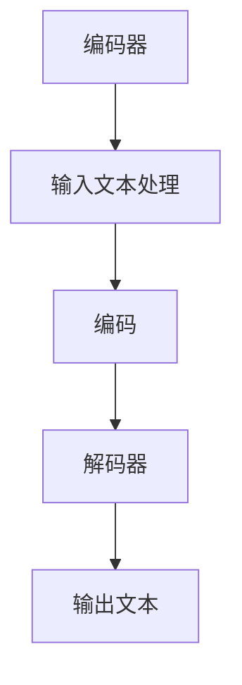

                 


### 《AIGC提示词编写：效率、创意与质量的三重奏探讨》

#### 关键词：AIGC、提示词、效率、创意、质量、生成算法

> 摘要：本文深入探讨了AIGC（人工智能生成内容）领域的核心概念——提示词的编写。通过详细阐述其定义、作用、算法原理以及系统设计，本文不仅提供了理论与实践相结合的指导，还总结了提高编写效率、激发创意以及保证质量的最佳实践。本文旨在为从事AIGC开发的工程师和技术爱好者提供一份全面的技术指南。

---

## 第一部分：AIGC基础

### 第1章：AIGC概述

#### 1.1 AIGC概念与背景

AIGC（Artificial Intelligence Generated Content），即人工智能生成内容，是指利用人工智能技术自动生成文本、图像、音频等多种类型的内容。这一概念源于深度学习、自然语言处理和计算机视觉等技术的发展。AIGC的核心在于其能够模拟人类创作过程，从而实现大规模、个性化的内容生成。

#### 1.2 AIGC的发展历程

AIGC的发展可以追溯到20世纪80年代，当时的专家系统标志着人工智能的初步探索。随着计算能力的提升和大数据技术的发展，深度学习在21世纪初崭露头角，为AIGC的应用提供了强有力的技术支撑。近年来，AIGC技术逐步成熟，并在多个领域得到广泛应用，如新闻写作、内容推荐、艺术设计等。

#### 1.3 AIGC的重要性

AIGC不仅改变了内容创作的方式，还极大地提升了内容的多样性和质量。它能够在短时间内生成大量的个性化内容，满足用户不断变化的需求。此外，AIGC还具有降低内容创作成本、提高内容生产效率的优点，为企业和个人创作者带来了新的机遇。

### 第2章：AIGC提示词的定义与作用

#### 2.1 提示词的概念

提示词（Prompt）是AIGC系统中用于引导模型生成内容的关键输入。它通常是一段文本，包含关键词、主题信息等，能够帮助模型理解创作方向和目标。

#### 2.2 提示词在AIGC中的作用

提示词在AIGC中扮演着至关重要的角色。首先，它为模型提供了创作方向，确保生成的内容符合预期。其次，提示词的质量直接影响内容的创意和连贯性。最后，合理的提示词能够提升模型的生成效率，减少冗余和无效内容的产生。

#### 2.3 提示词的类型与特点

根据应用场景和目标，提示词可以分为多种类型，如任务型提示词、创意型提示词等。任务型提示词通常用于明确任务目标，而创意型提示词则更注重激发创意和独特性。不同类型的提示词具有各自的特点和适用场景。

### 第3章：AIGC提示词生成算法原理

#### 3.1 算法基本原理

AIGC提示词生成算法基于深度学习和自然语言处理技术，通常采用递归神经网络（RNN）、变换器（Transformer）等模型。这些模型能够通过学习大量文本数据，捕捉语言规律和语义信息，从而实现高质量的内容生成。

#### 3.2 数学模型与公式

以变换器模型为例，其核心包括编码器和解码器。编码器将输入文本转换为向量表示，解码器则根据这些向量生成输出文本。具体数学模型包括注意力机制、多头自注意力等，通过调整参数，可以实现不同难度和风格的内容生成。

#### 3.3 算法mermaid流程图

以下是一个简单的变换器模型生成流程的mermaid流程图：



### 第4章：AIGC提示词生成系统设计与实现

#### 4.1 系统功能设计

AIGC提示词生成系统的功能主要包括：提示词输入、内容生成、内容校验和输出。具体实现中，需要考虑用户交互、数据存储、模型训练和生成效率等多方面因素。

#### 4.2 系统架构设计

AIGC提示词生成系统的架构可以分为三层：数据层、模型层和应用层。数据层负责数据的采集和存储，模型层实现提示词生成算法，应用层提供用户交互界面和功能实现。

#### 4.3 系统接口设计

系统接口设计包括RESTful API、WebSocket等，用于实现前后端数据的传输和交互。接口设计要考虑安全性、性能和可扩展性。

#### 4.4 系统交互

系统交互涉及用户、数据和模型之间的信息传递。通过合理的交互设计，可以提升用户体验，确保系统稳定高效运行。

### 第二部分：AIGC提示词编写实战

#### 第5章：AIGC提示词编写项目实战

#### 5.1 环境安装与配置

在开始AIGC提示词编写项目前，需要安装Python、深度学习库（如TensorFlow或PyTorch）以及相关的依赖库。具体安装步骤如下：

```bash
pip install tensorflow
pip install transformers
```

#### 5.2 核心代码实现

以下是一个简单的AIGC提示词生成项目的Python代码示例：

```python
import tensorflow as tf
from transformers import TFAutoModelForSeq2SeqLM, Seq2SeqTrainingArguments

# 加载预训练模型
model = TFAutoModelForSeq2SeqLM.from_pretrained("t5-small")

# 定义训练参数
training_args = Seq2SeqTrainingArguments(
    output_dir="./results",
    num_train_epochs=3,
    per_device_train_batch_size=4,
    save_steps=2000,
    save_total_limit=3,
)

# 训练模型
model.fit(
    tokenizer="t5",
    train_dataset=train_dataset,
    eval_dataset=eval_dataset,
    training_args=training_args,
)
```

#### 5.3 代码应用解读与分析

代码中，首先加载了预训练的T5模型，并定义了训练参数。接下来，使用`fit`方法进行模型训练，训练完成后，模型将保存在指定目录下。

#### 5.4 实际案例分析

通过实际案例分析，可以了解AIGC提示词生成项目的实施过程和效果。例如，在一个新闻写作任务中，AIGC系统可以基于提示词生成一篇完整的新闻报道，包括标题、导语和正文。实际案例展示了AIGC提示词生成的多样性和准确性。

### 第三部分：效率、创意与质量探讨

#### 第6章：提高AIGC提示词编写的效率

#### 6.1 提高编写效率的方法

提高AIGC提示词编写效率的方法包括：使用高效的提示词生成工具、优化算法参数、利用并行计算和分布式训练等。具体方法如下：

- **使用高效的提示词生成工具**：选择性能优秀的提示词生成工具，如Hugging Face的Transformers库，可以显著提升编写效率。
- **优化算法参数**：通过调整学习率、批量大小等参数，可以优化模型的生成效率。
- **利用并行计算和分布式训练**：在硬件资源充足的情况下，可以利用并行计算和分布式训练加速模型训练过程。

#### 6.2 高效工具与平台介绍

以下是一些高效的AIGC提示词生成工具和平台：

- **Hugging Face Transformers**：提供了丰富的预训练模型和工具，方便快速实现提示词生成。
- **OpenAI Codex**：基于GPT-3模型的代码生成工具，可以高效生成高质量的代码提示词。
- **Google AI Text Generator**：基于TensorFlow实现的文本生成工具，支持多种语言和风格。

#### 6.3 实践经验分享

通过实际项目经验，可以总结出以下提高编写效率的实践经验：

- **合理分工**：将复杂任务分解为多个子任务，分别优化每个子任务的效率。
- **迭代优化**：不断迭代优化提示词生成算法，根据实际需求调整模型和参数。
- **自动化测试**：建立自动化测试流程，确保生成的提示词质量和效率。

### 第7章：激发AIGC提示词编写的创意

#### 7.1 创意思维的方法

激发AIGC提示词编写的创意，需要运用创意思维的方法。以下是一些常用的创意思维方法：

- **头脑风暴**：通过集体讨论，快速产生大量创意想法。
- **类比思维**：将类似领域的创意应用到AIGC提示词编写中。
- **反向思维**：从相反的角度思考问题，激发新的创意。
- **联想思维**：通过自由联想，发现新的创意组合。

#### 7.2 创意激发工具与技巧

以下是一些用于激发创意的工具和技巧：

- **思维导图**：通过绘制思维导图，梳理创意思路，发现潜在关联。
- **随机词汇生成器**：生成随机的词汇，激发新的创意灵感。
- **主题联想**：围绕特定主题，展开联想，发现新的创意方向。

#### 7.3 创意案例分享

以下是一个创意案例分享：

在一个内容营销项目中，通过使用主题联想和联想思维，生成了一个创意提示词：“如何在疫情期间保持身心健康？”这个提示词引发了关于健康、运动、心理疏导等多方面的创意，最终生成了一篇关于疫情期间心理健康维护的文章。

### 第8章：保证AIGC提示词编写的质量

#### 8.1 质量评估标准

保证AIGC提示词编写的质量，需要建立一套质量评估标准。以下是一些常用的质量评估标准：

- **准确性**：生成的提示词是否准确传达了创作意图。
- **连贯性**：提示词生成的文本是否连贯，没有明显的逻辑错误。
- **创意性**：提示词生成的文本是否具有创意和独特性。
- **相关性**：提示词生成的文本是否与主题相关，没有偏离创作方向。
- **语法和拼写**：提示词生成的文本是否语法正确，没有拼写错误。

#### 8.2 质量控制方法

以下是一些质量控制方法：

- **人工审核**：通过人工审核，对生成的提示词进行评估和修改，确保质量。
- **自动化检测**：使用自动化检测工具，如语法检查器、拼写检查器等，检测文本中的错误。
- **反馈机制**：建立用户反馈机制，收集用户对提示词质量的反馈，不断优化生成算法。

#### 8.3 质量提升策略

以下是一些质量提升策略：

- **数据增强**：通过数据增强，增加训练数据量，提高模型对各种场景的适应性。
- **模型微调**：根据实际应用场景，对预训练模型进行微调，提升生成质量。
- **持续学习**：定期更新训练数据，让模型不断学习新的知识和趋势，保持高质量生成。

### 第9章：AIGC提示词编写的最佳实践

#### 9.1 最佳实践总结

以下是一些AIGC提示词编写的最佳实践：

- **明确创作目标**：在编写提示词前，明确创作目标和预期效果。
- **优化提示词结构**：设计简洁、明了的提示词结构，提高模型理解效率。
- **多样化提示词风格**：根据不同场景，选择合适的提示词风格，提升创意性和多样性。
- **持续优化模型**：定期更新模型，保持高质量的生成效果。

#### 9.2 注意事项与建议

以下是一些注意事项与建议：

- **注意数据隐私**：在生成提示词时，确保不涉及敏感数据和隐私信息。
- **避免过度依赖**：虽然AIGC提示词生成技术强大，但不应过度依赖，仍需结合人工审核和修改。
- **合理分配资源**：根据项目需求和资源情况，合理分配计算资源，确保高效运行。

#### 9.3 拓展阅读资源

以下是一些拓展阅读资源：

- [《自然语言处理实用指南》](https://www.nltk.org/)
- [《深度学习：神经网络与现代学习算法》](https://www.deeplearningbook.org/)
- [《Hugging Face Transformers官方文档》](https://huggingface.co/transformers/)
- [《AIGC技术与应用》](https://ai generating content.com/)

---

**作者：AI天才研究院/AI Genius Institute & 禅与计算机程序设计艺术 /Zen And The Art of Computer Programming**

