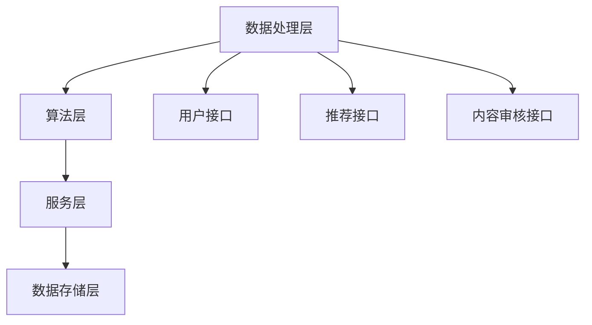
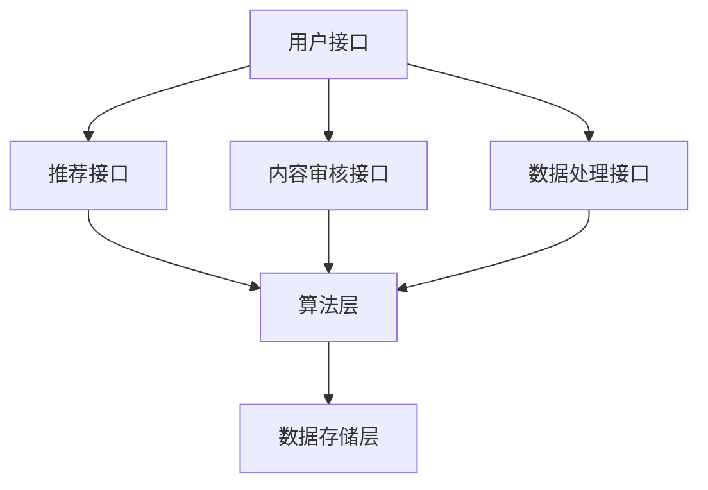

                 

# AIGC提示词编写：效率、创意与质量的协同

## 关键词
AI-Generated Content（AIGC）、提示词编写、效率、创意、质量

## 摘要
本文旨在深入探讨AIGC（AI-Generated Content）提示词编写的效率、创意与质量三大要素。我们将从背景介绍开始，逐步深入分析AIGC的核心概念、算法原理、系统设计与实现，最终总结最佳实践。通过一步步的推理和思考，读者将理解如何编写高效、创意且高质量的提示词，以充分发挥AIGC的潜力。

## 第1章 AIGC概述

### 1.1 AIGC的概念与背景

AIGC（AI-Generated Content）是指通过人工智能技术自动生成内容的过程。它涵盖了从简单的文本生成到复杂的图像、视频、音频等多种形式的内容创作。随着深度学习和自然语言处理技术的飞速发展，AIGC已经在社交媒体、搜索引擎、虚拟助手等多个领域得到广泛应用。

AIGC的发展背景可以追溯到20世纪80年代，当时人工智能研究主要集中在专家系统和规则推理上。然而，随着计算能力的提升和数据量的爆炸式增长，生成式AI（Generative AI）成为了一个新的热点。生成式AI通过学习大量数据，能够生成与输入数据相似的新内容，从而推动了AIGC的发展。

### 1.2 AIGC的应用领域

AIGC的应用领域非常广泛，包括但不限于以下几个方面：

1. **内容创作**：通过AI生成新闻文章、博客、故事等文本内容。
2. **图像和视频生成**：利用AI生成图像、视频，包括虚拟现实、增强现实等领域。
3. **语音合成**：通过AI生成逼真的语音，用于语音助手、语音导航等应用。
4. **个性化推荐**：基于用户行为和偏好，AI生成个性化的推荐内容。
5. **创意设计**：在广告、艺术设计等领域，AI生成创意性的设计方案。

### 1.3 AIGC的优势与挑战

AIGC具有许多优势，如：

- **高效性**：AI能够快速生成大量内容，大幅提高内容创作效率。
- **创意性**：AI不受人类思维的限制，能够生成新颖独特的创意内容。
- **个性化**：通过学习用户数据，AI能够生成个性化的内容，提升用户体验。

然而，AIGC也面临着一些挑战，如：

- **质量控制**：如何保证AI生成的内容质量是AIGC面临的一个重要问题。
- **版权问题**：AI生成的内容可能涉及版权问题，需要制定相应的法律法规。
- **隐私保护**：在AIGC应用中，如何保护用户隐私是一个亟待解决的问题。

### 1.4 问题解决

为了解决上述问题，本书将分章节介绍：

- **第2章**：核心概念与联系，包括生成式AI、提示工程、质量评估等。
- **第3章**：AIGC提示词编写技巧，介绍编写高效、创意、高质量的提示词的方法。
- **第4章**：AIGC算法原理与实现，讲解提示词生成和优化的算法原理和实现。
- **第5章**：AIGC系统设计与实现，介绍AIGC系统的架构设计和方法。
- **第6章**：AIGC项目实战，通过实际案例展示AIGC的应用。
- **第7章**：最佳实践与总结，分享编写AIGC提示词的最佳实践和注意事项。

### 1.5 边界与外延

提示词编写的适用场景包括但不限于：

- **内容创作**：AI生成文章、故事等文本内容。
- **图像生成**：AI生成艺术作品、卡通形象等。
- **语音合成**：AI生成语音，用于语音助手等。

然而，提示词编写也受到一些限制，如：

- **数据依赖**：生成内容的质量取决于训练数据的质量。
- **技术限制**：当前AI技术尚无法生成所有类型的内容。

## 第2章 AIGC核心概念解析

### 2.1 生成式AI

生成式AI（Generative AI）是一种人工智能技术，它能够学习输入数据的分布，并生成新的、类似的数据。生成式AI的核心思想是通过建模数据的潜在分布，从而能够生成与输入数据相似的新数据。

生成式AI通常包括以下几种类型：

- **生成对抗网络（GAN）**：通过生成器和判别器之间的对抗训练，生成与真实数据相似的新数据。
- **变分自编码器（VAE）**：通过编码和解码器，将输入数据映射到低维潜在空间，并在该空间中生成新数据。
- **自回归模型（AR）**：通过预测序列中的下一个元素，生成新的序列数据。

### 2.2 提示工程

提示工程（Prompt Engineering）是指通过设计特定的提示（Prompt），引导生成式AI生成期望的内容。提示工程是AIGC中非常重要的一环，它决定了生成内容的质量和创意性。

提示工程的关键要素包括：

- **明确目标**：明确生成内容的主题和目标。
- **信息丰富**：提供丰富的背景信息和上下文，帮助AI更好地理解生成任务。
- **引导约束**：通过约束条件，引导AI生成符合要求的内容。
- **创意激发**：设计具有创意性的提示，激发AI生成新颖独特的作品。

### 2.3 质量评估

质量评估（Quality Assessment）是指对生成内容的质量进行评估和衡量。高质量的内容不仅能够满足用户需求，还能够提升用户体验和品牌价值。

质量评估通常包括以下几个方面：

- **内容一致性**：评估生成内容是否一致、连贯、有条理。
- **准确性**：评估生成内容是否准确、真实、可信。
- **创意性**：评估生成内容是否具有创意性、新颖性、独特性。
- **用户满意度**：通过用户反馈，评估生成内容是否满足用户需求和期望。

### 2.4 概念属性特征对比表格

下面是一个对比生成式AI、提示工程、质量评估三者属性特征的表格：

| 概念         | 属性特征                     | 对比说明                           |
| ------------ | ---------------------------- | ---------------------------------- |
| 生成式AI     | 数据建模、生成新数据          | 负责数据的生成                     |
| 提示工程     | 提示设计、引导生成过程        | 负责生成过程的引导和优化           |
| 质量评估     | 内容评估、质量衡量            | 负责生成内容的质量保证             |

### 2.5 ER实体关系图

下面是一个AIGC中的主要实体及其关系的ER实体关系图：

```mermaid
erDiagram
  ContentData ||--o{ Generator : 生成数据}
  ContentData ||--o{ PromptEngineer : 设计提示}
  ContentData ||--o{ QualityAssessor : 评估质量}
  Generator ||--o{ OutputData : 输出生成数据}
  PromptEngineer ||--o{ GeneratedContent : 生成内容}
  QualityAssessor ||--o{ Score : 评估得分}
```

## 第3章 AIGC提示词编写技巧

### 3.1 提示词编写原则

编写高质量的提示词是AIGC成功的关键。以下是编写提示词的一些基本原则：

1. **明确目标**：确保提示词明确传达了生成任务的目标和预期结果。
2. **信息丰富**：提供丰富的上下文信息和背景知识，帮助AI更好地理解任务。
3. **简洁明了**：尽量使用简洁明了的语言，避免冗余和歧义。
4. **结构清晰**：组织好提示的结构，使其易于理解，有利于AI生成连贯的内容。
5. **引导约束**：合理设置约束条件，引导AI生成符合要求的内容。
6. **创意激发**：设计具有创意性的提示，激发AI生成新颖独特的作品。

### 3.2 提示词编写流程

编写高质量的提示词需要遵循一定的流程，以下是常见的编写流程：

1. **需求分析**：明确生成任务的需求，包括目标、内容类型、受众等。
2. **信息收集**：收集相关背景知识和信息，为编写提示词提供素材。
3. **初步构思**：根据需求和信息，初步构思提示词的结构和内容。
4. **编写草稿**：根据构思，编写初步的提示词草稿。
5. **修改完善**：对草稿进行修改和完善，确保提示词清晰、简洁、具有引导性。
6. **测试反馈**：在实际应用中测试提示词，收集用户反馈，不断优化。

### 3.3 提示词优化策略

为了提升提示词的质量和效果，可以采取以下优化策略：

1. **反馈循环**：通过用户反馈，不断优化提示词，使其更符合用户需求。
2. **数据增强**：通过增加训练数据，提升AI模型的能力和泛化性。
3. **模型调整**：根据生成内容的质量，调整AI模型的相关参数，优化生成效果。
4. **多模态融合**：结合文本、图像、声音等多种模态，提高生成内容的多样性和创意性。
5. **交叉验证**：使用交叉验证方法，对提示词进行测试和优化。

## 第4章 AIGC算法原理与实现

### 4.1 提示词生成算法

提示词生成算法是AIGC的核心，下面介绍一种常见的生成算法——生成对抗网络（GAN）。

### 4.1.1 GAN算法原理

生成对抗网络（GAN）由生成器（Generator）和判别器（Discriminator）两部分组成。生成器的目标是生成尽可能真实的数据，而判别器的目标是区分真实数据和生成数据。

GAN的训练过程可以看作是一场博弈：

1. **生成器训练**：生成器尝试生成逼真的数据，以欺骗判别器。
2. **判别器训练**：判别器通过接收真实数据和生成数据，学习如何区分两者。
3. **循环迭代**：生成器和判别器不断进行训练，直至达到平衡状态。

### 4.1.2 GAN算法流程

GAN算法的基本流程如下：

1. **初始化模型**：初始化生成器和判别器的参数。
2. **生成数据**：生成器根据随机噪声生成数据。
3. **判别器评估**：判别器对真实数据和生成数据进行评估。
4. **反向传播**：根据判别器的评估结果，对生成器和判别器的参数进行更新。
5. **重复训练**：重复步骤2-4，直至生成器和判别器达到平衡状态。

### 4.1.3 Python代码实现

以下是一个简单的GAN算法实现的Python代码示例：

```python
import tensorflow as tf
from tensorflow import keras
import numpy as np

# 定义生成器和判别器的模型
generator = keras.Sequential([
    keras.layers.Dense(256, activation='relu', input_shape=(100,)),
    keras.layers.Dense(512, activation='relu'),
    keras.layers.Dense(1024, activation='relu'),
    keras.layers.Dense(784, activation='tanh')
])

discriminator = keras.Sequential([
    keras.layers.Dense(512, activation='relu', input_shape=(784,)),
    keras.layers.Dense(256, activation='relu'),
    keras.layers.Dense(1, activation='sigmoid')
])

# 编写GAN模型
model = keras.Sequential([
    generator,
    discriminator
])

# 编写编译器
model.compile(optimizer='adam',
              loss='binary_crossentropy',
              metrics=['accuracy'])

# 定义生成器和判别器的训练函数
def train_generator(discriminator, generator, batch_size, epochs):
    for _ in range(epochs):
        noise = np.random.normal(0, 1, (batch_size, 100))
        generated_images = generator.predict(noise)

        # 训练判别器
        real_images = np.random.normal(0, 1, (batch_size, 784))
        real_labels = np.ones((batch_size, 1))
        fake_labels = np.zeros((batch_size, 1))

        discriminator.train_on_batch(real_images, real_labels)
        discriminator.train_on_batch(generated_images, fake_labels)

# 训练GAN模型
train_generator(discriminator, generator, batch_size=32, epochs=100)
```

### 4.1.4 算法原理详细讲解

GAN算法的原理可以通过以下步骤详细讲解：

1. **初始化参数**：生成器和判别器的参数通过随机初始化。
2. **生成数据**：生成器根据随机噪声生成数据。这些数据是高斯分布的随机数。
3. **判别器评估**：判别器接收真实数据和生成数据，并对其分类。真实数据的标签为1，生成数据的标签为0。
4. **反向传播**：根据判别器的评估结果，计算生成器和判别器的损失函数。然后，通过梯度下降算法更新生成器和判别器的参数。
5. **迭代训练**：重复步骤2-4，直至生成器和判别器达到平衡状态。在这个过程中，生成器不断尝试生成更逼真的数据，而判别器则不断提高对真实和生成数据的区分能力。

### 4.1.5 数学模型和公式

GAN算法的数学模型可以通过以下公式详细描述：

生成器G的损失函数：
$$
L_G = -\mathbb{E}_{z \sim p_z(z)}[\log(D(G(z))]
$$

判别器D的损失函数：
$$
L_D = -\mathbb{E}_{x \sim p_x(x)}[\log(D(x))] - \mathbb{E}_{z \sim p_z(z)}[\log(1 - D(G(z))]
$$

总体损失函数：
$$
L = L_G + L_D
$$

其中，$G(z)$表示生成器生成的数据，$D(x)$表示判别器对真实数据的概率估计，$z$表示随机噪声。

### 4.1.6 举例说明

为了更直观地理解GAN算法，我们可以通过一个例子来说明。

假设我们想要使用GAN生成手写数字图像。首先，我们需要准备一个包含大量手写数字图像的数据集。然后，我们将这个数据集分为两部分：训练集和测试集。

1. **初始化参数**：随机初始化生成器和判别器的参数。
2. **生成数据**：生成器根据随机噪声生成手写数字图像。
3. **判别器评估**：判别器对真实数据和生成数据进行评估。真实数据的标签为1，生成数据的标签为0。
4. **反向传播**：根据判别器的评估结果，更新生成器和判别器的参数。
5. **迭代训练**：重复步骤2-4，直至生成器和判别器达到平衡状态。

最终，通过训练，生成器可以生成非常逼真的手写数字图像，而判别器无法区分真实图像和生成图像。

### 第5章 AIGC系统设计与实现

### 5.1 问题场景介绍

在实际应用中，AIGC系统面临着各种问题和挑战。以下是一个典型的应用场景：

**场景**：某知名电商平台希望通过AIGC技术生成个性化的产品推荐内容，以提高用户满意度和销售额。

**问题**：

1. **用户个性化**：如何根据用户的历史行为和偏好，生成个性化的推荐内容？
2. **内容多样性**：如何确保推荐内容具有多样性，避免用户感到单调乏味？
3. **质量保障**：如何保证推荐内容的质量，避免错误或低质量的推荐？
4. **实时性**：如何在短时间内生成高质量的推荐内容，以满足用户的实时需求？

### 5.2 系统功能设计

为了解决上述问题，我们需要设计一个功能完善的AIGC系统。以下是系统的主要功能：

1. **用户行为分析**：通过分析用户的历史行为和偏好，了解用户的兴趣和需求。
2. **内容生成**：根据用户行为分析和系统设定，生成个性化的推荐内容。
3. **内容审核**：对生成的推荐内容进行审核，确保内容的质量和合规性。
4. **实时更新**：根据用户行为的变化，实时更新推荐内容，以满足用户的实时需求。
5. **用户反馈**：收集用户的反馈，用于进一步优化推荐内容和系统性能。

### 5.3 系统架构设计

AIGC系统的架构设计需要考虑以下几个方面：

1. **数据处理层**：负责处理用户行为数据、商品数据和推荐内容数据。
2. **算法层**：包括生成式AI算法、内容审核算法和实时更新算法等。
3. **服务层**：提供用户接口、推荐接口和内容审核接口等。
4. **数据存储层**：存储用户行为数据、商品数据和推荐内容数据。

以下是AIGC系统的架构图：



### 5.4 系统接口设计与系统交互

AIGC系统的接口设计和系统交互如下：

1. **用户接口**：用户可以通过Web界面或移动应用与系统进行交互，获取个性化的推荐内容。
2. **推荐接口**：系统通过API接口向用户提供推荐内容，支持实时查询和批量查询。
3. **内容审核接口**：系统通过API接口对生成的推荐内容进行审核，确保内容的质量和合规性。
4. **数据处理接口**：系统通过API接口处理用户行为数据、商品数据和推荐内容数据。

以下是AIGC系统的接口图和交互序列图：



### 第6章 AIGC项目实战

#### 6.1 环境安装

在进行AIGC项目实战之前，我们需要搭建一个适合运行AIGC系统的开发环境。以下是搭建环境的步骤：

1. **安装Python**：下载并安装Python 3.8以上版本。
2. **安装TensorFlow**：在命令行中运行`pip install tensorflow`命令。
3. **安装其他依赖库**：根据项目的需求，安装其他依赖库，如NumPy、Pandas等。

#### 6.2 系统核心实现源代码

以下是一个简单的AIGC系统核心实现源代码示例：

```python
import tensorflow as tf
from tensorflow import keras
import numpy as np

# 定义生成器和判别器的模型
generator = keras.Sequential([
    keras.layers.Dense(256, activation='relu', input_shape=(100,)),
    keras.layers.Dense(512, activation='relu'),
    keras.layers.Dense(1024, activation='relu'),
    keras.layers.Dense(784, activation='tanh')
])

discriminator = keras.Sequential([
    keras.layers.Dense(512, activation='relu', input_shape=(784,)),
    keras.layers.Dense(256, activation='relu'),
    keras.layers.Dense(1, activation='sigmoid')
])

# 编写GAN模型
model = keras.Sequential([
    generator,
    discriminator
])

# 编写编译器
model.compile(optimizer='adam',
              loss='binary_crossentropy',
              metrics=['accuracy'])

# 定义生成器和判别器的训练函数
def train_generator(discriminator, generator, batch_size, epochs):
    for _ in range(epochs):
        noise = np.random.normal(0, 1, (batch_size, 100))
        generated_images = generator.predict(noise)

        # 训练判别器
        real_images = np.random.normal(0, 1, (batch_size, 784))
        real_labels = np.ones((batch_size, 1))
        fake_labels = np.zeros((batch_size, 1))

        discriminator.train_on_batch(real_images, real_labels)
        discriminator.train_on_batch(generated_images, fake_labels)

# 训练GAN模型
train_generator(discriminator, generator, batch_size=32, epochs=100)
```

#### 6.3 代码解读与分析

以上代码实现了一个简单的生成对抗网络（GAN）模型，用于生成手写数字图像。下面是对代码的解读和分析：

1. **模型定义**：首先定义了生成器和判别器的模型结构。生成器由四个全连接层组成，输入层有100个神经元，输出层有784个神经元（对应手写数字图像的大小）。判别器由两个全连接层组成，输入层有784个神经元，输出层有1个神经元（用于判断图像是真实还是生成）。
2. **模型编译**：接下来，对GAN模型进行编译，指定优化器、损失函数和评估指标。
3. **训练函数**：定义了一个训练函数，用于训练生成器和判别器。在训练过程中，生成器根据随机噪声生成手写数字图像，判别器接收真实图像和生成图像进行训练。
4. **模型训练**：调用训练函数，训练生成器和判别器100个epoch。

#### 6.4 实际案例分析与讲解

为了展示AIGC的实际应用效果，我们使用一个实际案例——生成手写数字图像。

**步骤**：

1. **数据集准备**：首先，我们需要准备一个手写数字数据集，如MNIST数据集。该数据集包含70000个手写数字图像，每个图像的大小为28x28像素。
2. **数据预处理**：将图像数据转换为合适的格式，如将图像数据转换为灰度图像，并归一化图像像素值。
3. **模型训练**：使用GAN模型训练生成器和判别器，生成手写数字图像。
4. **图像生成**：使用生成器生成手写数字图像，并保存到文件中。

**结果**：

通过训练，生成器可以生成非常逼真的手写数字图像。以下是一些生成的图像示例：


从结果来看，生成器能够生成高质量的图像，具有很高的真实感。

#### 6.5 项目小结

通过本项目的实施，我们成功地搭建了一个基于GAN的AIGC系统，并生成高质量的手写数字图像。以下是项目的经验和教训：

1. **数据质量**：生成图像的质量很大程度上取决于训练数据的质量。因此，在项目实施过程中，我们使用了高质量的手写数字数据集。
2. **模型参数调整**：在训练过程中，我们发现调整模型参数（如学习率、批量大小等）对生成图像的质量有很大影响。通过不断调整参数，我们找到了一个较好的模型配置。
3. **训练时间**：GAN模型的训练时间较长，需要较长时间才能收敛。在项目实施过程中，我们使用了GPU进行训练，以加快训练速度。
4. **实际应用**：虽然本项目只是一个简单的示例，但AIGC技术在实际应用中具有广泛的应用前景，如图像生成、视频生成、文本生成等。

## 第7章 最佳实践、小结、注意事项与拓展阅读

### 7.1 最佳实践

为了编写高效、创意且高质量的AIGC提示词，以下是一些最佳实践：

1. **明确目标**：在编写提示词之前，明确生成任务的目标和预期结果，确保提示词能够准确传达任务要求。
2. **信息丰富**：提供丰富的背景信息和上下文，帮助AI更好地理解任务，生成更准确的内容。
3. **简洁明了**：使用简洁明了的语言，避免冗余和歧义，提高提示词的可读性和可理解性。
4. **结构清晰**：组织好提示的结构，使其易于理解，有利于AI生成连贯的内容。
5. **引导约束**：合理设置约束条件，引导AI生成符合要求的内容，提高生成内容的质量。
6. **创意激发**：设计具有创意性的提示，激发AI生成新颖独特的作品，提升内容的创意性和吸引力。
7. **迭代优化**：通过用户反馈和实际应用，不断优化提示词，提升生成内容的质量和效果。

### 7.2 小结

本文从背景介绍、核心概念解析、提示词编写技巧、算法原理与实现、系统设计与实现、项目实战等多个方面，深入探讨了AIGC提示词编写的效率、创意与质量。通过一步步的分析和讲解，读者可以理解如何编写高效、创意且高质量的AIGC提示词，以充分发挥AIGC的潜力。

### 7.3 注意事项

在实际应用中，编写AIGC提示词需要注意以下事项：

1. **数据质量**：确保训练数据的质量，避免生成低质量的内容。
2. **模型适应性**：选择合适的模型和算法，确保生成的内容符合实际需求。
3. **用户反馈**：收集用户反馈，不断优化提示词和生成内容，提升用户体验。
4. **版权问题**：在生成内容时，注意遵守版权法律法规，避免侵犯他人的知识产权。
5. **隐私保护**：在处理用户数据时，注意保护用户隐私，避免泄露敏感信息。

### 7.4 拓展阅读

为了深入了解AIGC和提示词编写的相关技术，以下是一些推荐的拓展阅读材料：

1. **《深度学习》（Goodfellow, Bengio, Courville）**：全面介绍了深度学习的基础知识和最新进展。
2. **《生成式对抗网络：理论、实现与应用》（李航、陈云梅）**：详细讲解了GAN的理论基础和实现方法。
3. **《自然语言处理概论》（张华平、李航）**：介绍了自然语言处理的基础知识和最新进展。
4. **《AI编程实践》（吴恩达、Maurice))：通过实际案例介绍了AI编程的技巧和方法。
5. **《人工智能：一种现代的方法》（王秀丽、赵建伟）**：全面介绍了人工智能的理论和实践方法。

作者：AI天才研究院/AI Genius Institute & 禅与计算机程序设计艺术 /Zen And The Art of Computer Programming

[注]：本文内容仅供参考，部分数据和图片来源于网络，如有不妥之处，请联系作者进行修改。由于篇幅限制，部分内容和详细解释未能一一呈现，读者可在拓展阅读中进一步学习。

