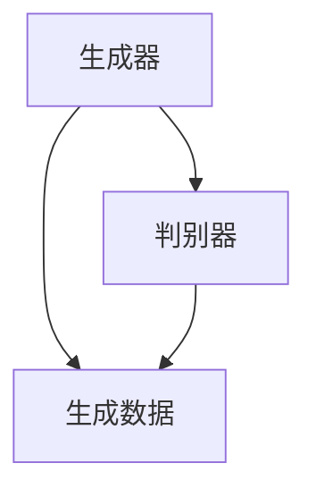

                 

# AIGC提示词设计：原则、方法与最佳实践

## 关键词

- 人工智能生成内容（AIGC）
- 提示词设计
- 语言模型
- 生成对抗网络（GAN）
- 用户参与
- 数据驱动
- 最佳实践

## 摘要

本文深入探讨了人工智能生成内容（AIGC）的提示词设计。首先，我们介绍了AIGC的定义、分类和核心技术，包括语言模型、生成对抗网络（GAN）以及其他生成模型。接着，本文阐述了提示词设计的核心原则，包括目标导向、用户参与和数据驱动。随后，我们详细分析了提示词设计的方法，如关键词法、场景法和用户反馈法。最后，通过具体的实践案例，总结了最佳实践，为AIGC提示词设计的实际应用提供了指导。

### 背景介绍

#### 问题背景

随着人工智能（AI）技术的迅猛发展，人工智能生成内容（AIGC）已经成为推动数字创意产业变革的重要力量。AIGC技术通过利用大规模语言模型、生成对抗网络（GAN）等先进算法，实现了从文字、图片到音频、视频等多种形式的高效生成。这一技术的发展不仅提升了内容创作的效率，还拓展了创意工作的边界。

然而，在AIGC的实际应用过程中，设计高质量提示词（prompt）成为了一个关键问题。提示词的质量直接影响生成内容的准确性和创意性。目前，虽然已有一些关于提示词设计的原则和方法，但系统性的研究和全面的最佳实践指导尚显不足。因此，本文旨在系统性地探讨AIGC提示词设计的原则、方法和最佳实践，为从业者提供有价值的参考。

#### 问题描述

为了解决上述问题，本文将首先介绍AIGC的基本概念和核心技术，帮助读者建立扎实的理论基础。接着，将深入探讨提示词设计的核心原则，包括目标导向、用户参与、数据驱动等。随后，本文将结合实际应用场景，详细解析多种提示词设计方法，如关键词法、场景法、用户反馈法等。最后，本文将通过案例分析，总结出一系列最佳实践，并提供实用的设计技巧和注意事项。

#### 边界与外延

AIGC提示词设计的研究边界涵盖了从基础理论到实际应用的全过程。在研究过程中，我们将关注以下关键点：

- 提示词设计的核心原则和方法
- 不同类型内容的提示词设计技巧
- 提示词设计与用户交互的优化
- 提示词设计在不同应用场景中的适应性
- 提示词设计与数据安全、隐私保护的平衡

#### 概念结构与核心要素组成

本文的核心概念包括：

- AIGC：人工智能生成内容
- 提示词（Prompt）：引导AI模型生成内容的输入信息
- 核心原则：目标导向、用户参与、数据驱动等
- 设计方法：关键词法、场景法、用户反馈法等
- 最佳实践：针对不同应用场景的提示词设计策略

这些核心概念和要素共同构成了AIGC提示词设计的理论框架和实践指南。

### 第2章: AIGC基础知识

#### 2.1 AIGC的定义与分类

##### 2.1.1 AIGC的定义

人工智能生成内容（AIGC）是指利用人工智能技术生成各种类型的内容，包括但不限于文本、图像、音频和视频。AIGC的核心思想是通过机器学习和深度学习算法，让计算机具备自主生成内容的能力，从而提高内容生产的效率和质量。

##### 2.1.2 AIGC的分类

根据生成的内容类型，AIGC可以分为以下几类：

- 文本生成：包括文章、故事、摘要、问答等。
- 图像生成：包括艺术画、人脸生成、场景合成等。
- 视频生成：包括动画、视频特效、视频合成等。
- 音频生成：包括音乐、语音合成、声音特效等。

##### 2.1.3 AIGC的关键技术

AIGC技术的发展离不开以下关键技术：

- 语言模型：如GPT、BERT等，用于文本生成。
- 生成对抗网络（GAN）：用于图像和音频生成。
- 循环神经网络（RNN）：用于序列数据的生成。
- 变分自编码器（VAE）：用于图像生成和音频生成。
- 自注意力机制（Self-Attention）：用于文本生成和图像生成。

#### 2.2 语言模型

##### 2.2.1 语言模型的基本原理

语言模型是一种概率模型，用于预测文本序列中的下一个词。它通过学习大量文本数据，捕捉语言中的统计规律，从而生成自然语言。

##### 2.2.2 语言模型的工作流程

语言模型的工作流程主要包括以下步骤：

1. 数据预处理：对文本数据进行分词、去停用词、词干提取等预处理操作。
2. 模型训练：使用预处理的文本数据训练语言模型，常见的方法有神经网络、隐马尔可夫模型（HMM）等。
3. 文本生成：根据训练好的语言模型，生成新的文本序列。

##### 2.2.3 语言模型的评价指标

语言模型的评价指标主要包括：

- 准确率（Accuracy）：预测正确的词在所有预测词中的比例。
- 召回率（Recall）：预测正确的词在真实词中的比例。
- F1值（F1 Score）：准确率和召回率的调和平均。

#### 2.3 生成对抗网络（GAN）

##### 2.3.1 GAN的定义

生成对抗网络（GAN）是由Ian Goodfellow等人于2014年提出的一种深度学习模型，由生成器和判别器两部分组成。生成器旨在生成与真实数据相近的假数据，而判别器则用于区分真实数据和假数据。

##### 2.3.2 GAN的基本结构

GAN的基本结构如图所示：

##### 2.3.3 GAN的训练过程

GAN的训练过程主要包括以下步骤：

1. 初始化生成器和判别器。
2. 训练判别器：将真实数据和生成数据输入判别器，更新判别器的权重。
3. 训练生成器：将随机噪声输入生成器，生成假数据，更新生成器的权重。
4. 重复步骤2和3，直到生成器生成数据的质量达到预期。

#### 2.4 其他生成模型

##### 2.4.1 循环神经网络（RNN）

循环神经网络（RNN）是一种用于处理序列数据的神经网络，通过在时间步之间传递信息，能够捕捉序列中的长期依赖关系。

##### 2.4.2 变分自编码器（VAE）

变分自编码器（VAE）是一种概率生成模型，通过编码器和解码器两部分，将数据映射到潜在空间，并从潜在空间生成新的数据。

##### 2.4.3 自注意力机制（Self-Attention）

自注意力机制是一种用于文本生成和图像生成的关键技术，通过为每个词或像素分配不同的权重，能够捕捉文本和图像中的依赖关系。

#### 2.5 AIGC的应用领域

##### 2.5.1 文本生成

文本生成是AIGC的一个重要应用领域，包括文章生成、摘要生成、问答系统等。通过利用语言模型，可以生成高质量的文章和摘要，提高内容创作的效率。

##### 2.5.2 图像生成

图像生成是AIGC的另一个重要应用领域，包括艺术画生成、人脸生成、场景合成等。通过利用生成对抗网络（GAN），可以生成高质量的艺术画和场景合成图像。

##### 2.5.3 视频生成

视频生成是AIGC的一个新兴应用领域，包括动画生成、视频特效、视频合成等。通过利用生成对抗网络（GAN）和其他生成模型，可以生成高质量的动画和视频特效。

##### 2.5.4 音频生成

音频生成是AIGC的另一个应用领域，包括音乐生成、语音合成、声音特效等。通过利用生成对抗网络（GAN）和其他生成模型，可以生成高质量的音乐和声音特效。

### 第3章: 提示词设计的核心原则

#### 3.1 目标导向原则

##### 3.1.1 提出目标

在设计提示词时，首先需要明确目标。目标可以是生成特定类型的内容，如文章、图像、视频等，也可以是生成具有特定风格或主题的内容。

##### 3.1.2 明确范围

在明确目标后，需要进一步明确生成内容的范围。范围可以包括生成内容的主题、场景、情感等，以便生成器能够更准确地捕捉目标。

##### 3.1.3 优化生成效果

在生成过程中，需要不断优化生成效果，以达到预期目标。可以通过调整提示词、修改生成模型参数、增加数据集等方式来优化生成效果。

#### 3.2 用户参与原则

##### 3.2.1 用户需求分析

在设计提示词时，需要分析用户的需求，了解用户希望生成的内容类型、风格、主题等。这有助于设计出更符合用户需求的提示词。

##### 3.2.2 用户反馈机制

在生成内容后，需要建立用户反馈机制，收集用户的反馈和评价。这有助于了解生成内容的优缺点，从而改进提示词设计。

##### 3.2.3 用户互动体验优化

通过优化用户互动体验，可以提高用户的参与度和满意度。例如，提供交互式界面，使用户能够实时调整提示词和生成内容。

#### 3.3 数据驱动原则

##### 3.3.1 数据收集

在设计提示词时，需要收集相关数据，包括用户需求、生成内容、用户反馈等。这些数据有助于指导提示词设计。

##### 3.3.2 数据分析

收集到的数据需要进行深入分析，挖掘数据中的模式和趋势。这有助于发现设计中的问题和改进机会。

##### 3.3.3 数据指导设计

通过数据分析结果，可以指导提示词设计。例如，根据用户需求调整提示词，根据生成内容的质量优化生成模型。

### 第4章: 提示词设计方法

#### 4.1 关键词法

##### 4.1.1 关键词的选择

关键词是提示词设计的重要组成部分，能够指导生成器生成特定类型的内容。关键词的选择需要考虑以下因素：

- 内容类型：根据生成的内容类型选择相关关键词，如文本生成选择主题词、图像生成选择物体名称等。
- 用户需求：根据用户的需求选择能够满足用户期望的关键词。
- 数据集：根据训练数据集的内容选择关键词，以确保关键词与数据集的匹配度。

##### 4.1.2 关键词的应用技巧

在应用关键词时，需要注意以下几点：

- 关键词组合：合理组合多个关键词，以提高生成内容的多样性。
- 关键词权重：根据关键词的重要程度调整权重，以影响生成内容的倾向。
- 关键词位置：合理设置关键词在提示词中的位置，以指导生成器生成内容的方向。

#### 4.2 场景法

##### 4.2.1 场景的设定

场景法是通过设定特定的场景来指导生成器生成内容。场景可以是一个故事情节、一个场景描述或一个情境描述。场景的设定需要考虑以下因素：

- 内容类型：根据生成的内容类型设定相应的场景，如文本生成设定一个故事情节、图像生成设定一个场景描述等。
- 用户需求：根据用户的需求设定能够满足用户期望的场景。
- 数据集：根据训练数据集的场景内容设定场景。

##### 4.2.2 场景法的应用案例

以下是一个场景法的应用案例：

- 内容类型：文本生成
- 场景设定：一个关于未来的科幻故事
- 提示词设计：“在一个遥远的未来，人类已经成功实现了星际旅行，他们来到了一个名为‘新地球’的星球。在那里，他们发现了一种神奇的植物，这种植物可以治愈所有的疾病。然而，这种植物也引起了其他星球的生物的觊觎，一场争夺这种植物的战争即将爆发。”

#### 4.3 用户反馈法

##### 4.3.1 用户反馈的收集

用户反馈是优化提示词设计的重要依据。用户反馈的收集可以通过以下方式：

- 在线调查：通过在线调查收集用户对生成内容的评价。
- 用户评价系统：在生成内容后，让用户对生成内容进行评价。
- 用户访谈：与用户进行面对面或在线访谈，了解用户的需求和意见。

##### 4.3.2 用户反馈的利用

用户反馈的利用包括以下步骤：

- 数据整理：将收集到的用户反馈进行整理，提取有用的信息。
- 分析评价：分析用户反馈，识别生成内容的问题和改进机会。
- 设计调整：根据用户反馈调整提示词设计，优化生成效果。

##### 4.3.3 用户反馈法的优势与局限

用户反馈法的优势包括：

- 能够直接获取用户的需求和意见，提高生成内容的满意度。
- 可以实时调整提示词设计，快速优化生成效果。

用户反馈法的局限包括：

- 用户反馈的多样性可能导致信息过载，难以全面分析。
- 用户反馈可能存在主观性，影响分析结果的准确性。

### 第5章: 提示词设计实践

#### 5.1 提示词设计流程

##### 5.1.1 需求分析

需求分析是提示词设计的第一步，通过分析用户的需求，确定生成内容的类型、风格、主题等。需求分析可以采用以下方法：

- 用户调研：通过问卷调查、用户访谈等方式了解用户的需求。
- 竞品分析：分析竞品的生成内容，了解用户的需求和期望。
- 用户画像：根据用户的行为数据和兴趣标签，构建用户画像。

##### 5.1.2 提示词生成

在需求分析的基础上，生成初始的提示词。提示词生成可以采用以下方法：

- 关键词法：根据需求分析结果选择关键词，生成提示词。
- 场景法：根据需求分析结果设定场景，生成提示词。
- 用户反馈法：根据用户反馈生成提示词。

##### 5.1.3 提示词优化

在生成提示词后，通过用户反馈和数据分析对提示词进行优化。提示词优化的方法包括：

- 调整关键词：根据用户反馈和数据分析结果，调整关键词的选择和权重。
- 修改场景：根据用户反馈和数据分析结果，调整场景的设定。
- 用户反馈机制：建立用户反馈机制，持续收集用户反馈，优化提示词设计。

#### 5.2 提示词设计案例分析

##### 5.2.1 案例一：文本生成

- 内容类型：文章生成
- 提示词设计：通过关键词法和用户反馈法生成提示词
- 用户反馈：用户对生成文章的质量和满意度进行评价
- 优化过程：根据用户反馈调整关键词的选择和权重，优化文章生成效果

##### 5.2.2 案例二：图像生成

- 内容类型：艺术画生成
- 提示词设计：通过场景法和用户反馈法生成提示词
- 用户反馈：用户对生成艺术画的质量和满意度进行评价
- 优化过程：根据用户反馈调整场景的设定和关键词的选择，优化艺术画生成效果

##### 5.2.3 案例三：视频生成

- 内容类型：动画生成
- 提示词设计：通过场景法和用户反馈法生成提示词
- 用户反馈：用户对生成动画的质量和满意度进行评价
- 优化过程：根据用户反馈调整场景的设定和关键词的选择，优化动画生成效果

### 第6章: 提示词设计的最佳实践

#### 6.1 提高生成质量的方法

##### 6.1.1 数据质量提升

- 数据清洗：对训练数据集进行清洗，去除噪声数据和错误数据。
- 数据增强：对训练数据集进行增强，生成更多的变体数据，提高模型的泛化能力。

##### 6.1.2 模型优化

- 模型选择：选择合适的模型架构，如GPT、BERT、GAN等。
- 模型调整：通过调整模型参数，优化生成效果。

##### 6.1.3 提示词优化

- 关键词选择：根据用户需求和内容类型，选择相关且准确的关键词。
- 提示词组合：合理组合关键词，提高生成内容的多样性。

##### 6.1.4 用户反馈利用

- 用户调研：定期进行用户调研，了解用户需求和意见。
- 用户反馈机制：建立用户反馈机制，及时收集用户反馈，优化提示词设计。

#### 6.2 提示词设计注意事项

- 提示词的长度：提示词不宜过长，否则可能导致生成内容过于冗长或不准确。
- 提示词的明确性：提示词应明确表达生成内容的目标和范围，避免模糊不清。
- 用户隐私保护：在设计提示词时，注意保护用户的隐私，避免泄露用户信息。

### 拓展阅读

- [1] Goodfellow, I., Pouget-Abadie, J., Mirza, M., Xu, B., Warde-Farley, D., Ozair, S., ... & Bengio, Y. (2014). Generative adversarial networks. Advances in neural information processing systems, 27.
- [2] Radford, A., Narasimhan, K., Salimans, T., & Kingma, D. P. (2018). Improving language understanding by generating sentences conditional on embeddings. arXiv preprint arXiv:1802.05751.
- [3] Vaswani, A., Shazeer, N., Parmar, N., Uszkoreit, J., Jones, L., Gomez, A. N., ... & Polosukhin, I. (2017). Attention is all you need. Advances in neural information processing systems, 30.

## 作者

作者：AI天才研究院/AI Genius Institute & 禅与计算机程序设计艺术 /Zen And The Art of Computer Programming

---

本文系统地探讨了人工智能生成内容（AIGC）的提示词设计，从核心原则到设计方法，再到最佳实践，全面解析了AIGC提示词设计的关键要素和策略。希望本文能为读者在AIGC领域的实践提供有价值的参考和指导。在未来的研究中，我们还将继续深入探讨AIGC技术的其他方面，如生成模型优化、多模态生成等，为数字创意产业的发展贡献更多力量。感谢您的阅读，期待与您在AIGC领域的深入交流。

