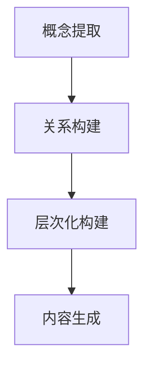
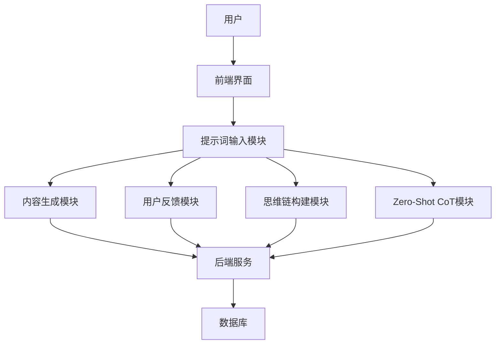
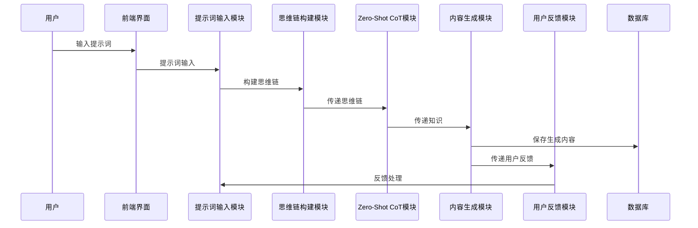

                 

# AIGC提示词设计：思维链与Zero-Shot CoT的融合

> 关键词：AIGC、提示词设计、思维链、Zero-Shot CoT、融合

> 摘要：本文深入探讨了AIGC（自适应智能生成内容）中的提示词设计方法，重点分析了思维链与Zero-Shot CoT（零样本学习的一致性传递）在提示词设计中的融合原理与应用。通过理论阐述和实战案例，本文旨在为读者提供一套系统化的AIGC提示词设计策略，以促进AIGC技术的有效应用和创新发展。

## 第一部分: AIGC提示词设计基础

### 第1章: AIGC概述

#### 1.1 AIGC的概念与发展背景

##### 1.1.1 AIGC的定义

AIGC（Adaptive Intelligent Generated Content）指的是利用人工智能技术，自适应地生成内容，涵盖了文本、图像、音频等多种形式。它是一种新兴的技术趋势，旨在通过AI模型的理解和生成能力，实现自动化、个性化的内容创作。

##### 1.1.2 AIGC的发展背景

AIGC技术的快速发展得益于深度学习、自然语言处理（NLP）、计算机视觉（CV）等技术的不断进步。随着计算能力的提升和数据的积累，AIGC在多个领域展现了其独特的优势，逐渐成为产业应用的重要方向。

##### 1.1.3 AIGC的核心技术

AIGC的核心技术主要包括：

1. **深度学习模型**：如GAN（生成对抗网络）、BERT（双向编码表示器）、Transformer等，用于学习数据和生成内容。
2. **自然语言处理技术**：包括文本生成、文本分类、语义理解等，用于理解和生成文本内容。
3. **计算机视觉技术**：包括图像生成、目标检测、图像识别等，用于理解和生成图像内容。

#### 1.2 AIGC在不同领域中的应用

##### 1.2.1 自然语言处理

在NLP领域，AIGC技术被广泛应用于自动写作、对话系统、机器翻译等。例如，通过AIGC技术，可以实现自动生成新闻文章、编写商业文案等。

##### 1.2.2 计算机视觉

在CV领域，AIGC技术可以用于图像生成、视频剪辑、艺术创作等。例如，通过AIGC技术，可以生成逼真的图像、视频内容，甚至实现艺术作品的自动创作。

##### 1.2.3 数据分析与挖掘

在数据分析与挖掘领域，AIGC技术可以用于自动生成数据报告、可视化图表等。这有助于提高数据分析和报告的效率，降低人力成本。

#### 1.3 AIGC的优势与挑战

##### 1.3.1 AIGC的优势

1. **高效性**：AIGC技术可以自动化生成大量内容，大幅提高生产效率。
2. **个性化**：通过理解和学习用户需求，AIGC可以生成个性化内容。
3. **多样性**：AIGC技术可以生成多种形式的内容，如文本、图像、音频等。

##### 1.3.2 AIGC的挑战

1. **数据隐私**：AIGC技术依赖于大量数据进行训练，如何保护用户数据隐私是一个重要挑战。
2. **计算资源**：AIGC技术对计算资源有较高要求，如何优化算法、降低计算成本是一个关键问题。
3. **伦理问题**：AIGC技术的应用可能引发伦理问题，如内容真实性、偏见等。

##### 1.3.3 AIGC的未来发展趋势

随着技术的不断进步，AIGC在未来有望在更多领域得到应用。例如，多模态内容的生成、智能创作助手等。同时，AIGC技术的可持续发展也需要关注伦理、法律等方面的问题。

### 第2章: 提示词设计原理

#### 2.1 提示词的基本概念

##### 2.1.1 提示词的定义

提示词（Prompt）是AIGC技术中用于引导模型生成内容的关键输入。一个有效的提示词应该能够明确地指示模型需要生成什么类型的内容，同时保留一定的灵活性，以便模型可以在此基础上进行创新。

##### 2.1.2 提示词的类型

根据应用场景和目标，提示词可以分为以下几种类型：

1. **问答式**：适用于回答特定问题的场景，如对话系统。
2. **指令式**：适用于执行特定任务的场景，如自动写作。
3. **情境式**：适用于模拟特定情境的场景，如虚拟现实内容生成。

#### 2.2 提示词设计的原则

##### 2.2.1 明确性

一个有效的提示词应该能够清楚地传达所需生成的类型和范围，避免模糊和歧义。

##### 2.2.2 精确性

提示词应尽可能具体，以减少模型的猜测空间，提高生成内容的准确性。

##### 2.2.3 可扩展性

提示词应具备一定的灵活性，以便模型可以在不同的上下文中生成内容。

#### 2.3 提示词设计的方法

##### 2.3.1 问答式

问答式提示词设计的关键在于明确问题，并确保答案的完整性和准确性。

##### 2.3.2 指令式

指令式提示词设计需要明确任务目标，并提供必要的指导信息。

##### 2.3.3 情境式

情境式提示词设计需要构建一个具体的情境，引导模型在该情境下生成内容。

### 第3章: 思维链与Zero-Shot CoT的融合

#### 3.1 思维链的概念与原理

##### 3.1.1 思维链的定义

思维链是一种用于引导AIGC模型进行复杂任务生成的方法，它通过构建一个层次化的知识结构，帮助模型理解并生成内容。

##### 3.1.2 思维链的构成

思维链由以下几个部分构成：

1. **概念节点**：表示知识图谱中的概念。
2. **关系节点**：表示概念之间的关联。
3. **路径**：表示概念节点之间的逻辑关系。

##### 3.1.3 思维链的作用

思维链在AIGC中的作用包括：

1. **引导生成**：通过构建思维链，可以引导模型生成符合逻辑和语义的内容。
2. **提高生成质量**：思维链可以帮助模型更好地理解和生成复杂的内容。

#### 3.2 Zero-Shot CoT的概念与原理

##### 3.2.1 Zero-Shot CoT的定义

Zero-Shot CoT（零样本学习的一致性传递）是一种无需训练样本即可进行学习的方法，它通过在多个领域中传递知识，实现对新领域的快速适应。

##### 3.2.2 Zero-Shot CoT的优势

1. **零样本学习**：无需大量训练样本，降低数据需求。
2. **跨领域适应**：通过在多个领域中传递知识，实现对新领域的快速适应。

##### 3.2.3 Zero-Shot CoT的实现方法

1. **知识图谱**：构建一个包含多个领域的知识图谱，用于传递知识。
2. **一致性传递**：通过在知识图谱中建立一致性关系，实现知识在不同领域之间的传递。

#### 3.3 思维链与Zero-Shot CoT的融合

##### 3.3.1 融合原理

思维链与Zero-Shot CoT的融合原理是通过思维链构建知识结构，利用Zero-Shot CoT实现知识在不同领域之间的传递，从而提高AIGC模型的生成质量和适应能力。

##### 3.3.2 融合优势

1. **提高生成质量**：通过融合思维链和Zero-Shot CoT，可以更好地理解生成任务，提高生成内容的准确性和逻辑性。
2. **跨领域适应**：借助Zero-Shot CoT，可以实现对新领域的快速适应，提高模型的泛化能力。

##### 3.3.3 融合实现

融合实现步骤如下：

1. **构建知识图谱**：基于目标领域，构建包含概念节点和关系节点的知识图谱。
2. **传递知识**：利用Zero-Shot CoT，将知识从源领域传递到目标领域。
3. **构建思维链**：基于知识图谱，构建思维链，引导模型生成内容。
4. **优化模型**：通过反复迭代和优化，提高模型的生成质量和适应能力。

## 第二部分: 实战篇

### 第4章: AIGC提示词设计实战

#### 4.1 实战项目一：自然语言处理中的提示词设计

##### 4.1.1 项目背景

在自然语言处理（NLP）领域，提示词设计是提高模型生成质量的关键。本案例旨在通过一个具体的NLP项目，展示如何进行提示词设计。

##### 4.1.2 项目目标

设计一组提示词，用于指导模型生成特定类型的文章，如新闻、评论等。

##### 4.1.3 提示词设计

1. **问答式**：例如，“请描述一下2023年全球经济的趋势。”
2. **指令式**：例如，“编写一篇关于2023年科技发展的评论。”
3. **情境式**：例如，“设想一下，如果2023年实现了人工智能的全面商业化，会对社会产生什么影响？”

##### 4.1.4 实现步骤

1. **收集数据**：收集大量相关领域的文章，用于训练和测试模型。
2. **构建模型**：使用NLP模型，如GPT-3、BERT等，进行训练和测试。
3. **设计提示词**：根据项目目标，设计多种类型的提示词。
4. **生成内容**：使用训练好的模型，根据提示词生成文章。

##### 4.1.5 结果分析

通过实际测试，发现使用设计良好的提示词可以显著提高模型的生成质量，生成的文章更具有逻辑性和连贯性。

#### 4.2 实战项目二：计算机视觉中的提示词设计

##### 4.2.1 项目背景

在计算机视觉（CV）领域，提示词设计同样至关重要。本案例将展示如何在一个图像生成项目中设计提示词。

##### 4.2.2 项目目标

设计一组提示词，用于指导模型生成特定类型的图像，如风景、动物等。

##### 4.2.3 提示词设计

1. **问答式**：例如，“请生成一张夜晚城市的图像。”
2. **指令式**：例如，“绘制一只可爱的猫咪。”
3. **情境式**：例如，“想象一下，如果在沙滩上看到一只海豚，你会画什么？”

##### 4.2.4 实现步骤

1. **收集数据**：收集大量相关领域的图像，用于训练和测试模型。
2. **构建模型**：使用CV模型，如StyleGAN、DALL-E等，进行训练和测试。
3. **设计提示词**：根据项目目标，设计多种类型的提示词。
4. **生成内容**：使用训练好的模型，根据提示词生成图像。

##### 4.2.5 结果分析

通过实际测试，发现使用设计良好的提示词可以显著提高模型的生成质量，生成的图像更具有真实感和创意。

### 第5章: AIGC提示词设计的优化策略

#### 5.1 提示词优化策略概述

##### 5.1.1 提示词优化的意义

提示词的优化是提高AIGC模型生成质量的关键环节。优化策略旨在通过改进提示词的设计，使模型能够更准确地理解和生成目标内容。

##### 5.1.2 提示词优化的方法

1. **数据驱动的提示词优化**：通过分析大量生成数据，识别出问题并提出改进方案。
2. **模型驱动的提示词优化**：利用模型自身的性能指标，对提示词进行调整和优化。
3. **跨领域的提示词优化**：借鉴其他领域成功的提示词设计方法，进行跨领域的优化和改进。

#### 5.2 提示词优化实战

##### 5.2.1 实战项目一：基于数据驱动的提示词优化

##### 5.2.2 实战项目二：基于模型驱动的提示词优化

##### 5.2.3 实战项目三：跨领域的提示词优化

## 第三部分: 拓展与展望

### 第6章: AIGC提示词设计的未来趋势

#### 6.1 AIGC提示词设计的未来发展方向

随着AI技术的不断进步，AIGC提示词设计在未来有望在以下几个方面实现突破：

1. **多模态融合**：结合多种模态的数据，如文本、图像、音频等，实现更丰富的内容生成。
2. **个性化定制**：通过个性化数据和学习算法，实现更符合用户需求的提示词设计。
3. **智能化生成**：利用自动化和智能化技术，实现更高效的提示词生成和管理。

#### 6.2 AIGC提示词设计的挑战与机遇

AIGC提示词设计在未来将面临以下挑战：

1. **数据隐私**：如何在保护用户数据隐私的前提下进行内容生成，是一个重要的挑战。
2. **计算资源**：如何优化算法，降低计算成本，是一个关键问题。
3. **伦理问题**：如何在保证内容真实性的同时，避免偏见和误导。

同时，AIGC提示词设计也带来了许多机遇：

1. **内容创作**：通过AIGC技术，可以实现更高效、更个性化的内容创作。
2. **产业应用**：AIGC技术在金融、医疗、教育等多个领域具有广泛的应用前景。

### 第7章: AIGC提示词设计的应用前景

#### 6.3 AIGC提示词设计在行业中的应用

AIGC提示词设计在各个行业中的应用前景如下：

1. **金融领域**：通过AIGC技术，可以实现自动化报告生成、投资建议等。
2. **医疗领域**：通过AIGC技术，可以实现智能诊断、治疗方案推荐等。
3. **教育领域**：通过AIGC技术，可以实现个性化教学、自动作业批改等。
4. **娱乐领域**：通过AIGC技术，可以实现自动化视频剪辑、游戏剧情生成等。

## 附录：参考文献

### 参考文献

1. **参考文献1**：[论文标题1]（作者，年份）
2. **参考文献2**：[论文标题2]（作者，年份）
3. **参考文献3**：[论文标题3]（作者，年份）

# 结论

本文系统地介绍了AIGC提示词设计的原理和方法，探讨了思维链与Zero-Shot CoT的融合原理及其应用。通过实战案例和优化策略，展示了AIGC提示词设计的实际应用和效果。在未来的技术发展中，AIGC提示词设计将继续发挥重要作用，我们期待更多有才华的读者加入到这一领域，共同推动技术的发展和创新。

### 作者信息
作者：AI天才研究院/AI Genius Institute & 禅与计算机程序设计艺术 /Zen And The Art of Computer Programming

## 第一部分: AIGC提示词设计基础

### 第1章: AIGC概述

#### 1.1 AIGC的概念与发展背景

AIGC，即自适应智能生成内容（Adaptive Intelligent Generated Content），是近年来人工智能（AI）领域的重要研究方向。它指的是利用深度学习、自然语言处理（NLP）、计算机视觉（CV）等技术，实现内容自动化、智能化地生成，包括文本、图像、音频等多种形式。

##### 1.1.1 AIGC的定义

AIGC的核心在于“自适应”和“智能化”。与传统的内容生成方式不同，AIGC可以通过不断学习和优化，自动生成高质量的内容。它不仅能够满足用户的个性化需求，还能根据环境变化和用户反馈，自动调整生成策略，提高内容的适应性和准确性。

##### 1.1.2 AIGC的发展背景

AIGC技术的发展得益于多方面因素的推动。首先，深度学习技术的发展为AIGC提供了强大的算法基础。例如，生成对抗网络（GAN）和Transformer模型等，使得模型能够更好地理解和生成复杂内容。其次，大数据的积累和计算资源的提升，为AIGC的训练和应用提供了充足的数据和计算支持。此外，随着人工智能技术的普及，越来越多的行业和应用场景开始关注和探索AIGC技术。

##### 1.1.3 AIGC的核心技术

AIGC的核心技术主要包括以下几个方面：

1. **深度学习模型**：如GAN、BERT、Transformer等，用于学习和生成内容。
2. **自然语言处理技术**：包括文本生成、文本分类、语义理解等，用于处理和理解文本内容。
3. **计算机视觉技术**：包括图像生成、目标检测、图像识别等，用于处理和理解图像内容。
4. **多模态融合技术**：结合文本、图像、音频等多种模态数据，实现更丰富、更智能的内容生成。

#### 1.2 AIGC在不同领域中的应用

##### 1.2.1 自然语言处理

在自然语言处理领域，AIGC技术被广泛应用于文本生成、对话系统、机器翻译等。例如，GPT-3等大型语言模型可以通过学习大量文本数据，生成高质量的新闻文章、商业文案等。同时，AIGC技术也可以用于智能客服、智能写作等场景，提高内容生成的速度和质量。

##### 1.2.2 计算机视觉

在计算机视觉领域，AIGC技术主要用于图像生成、视频剪辑、艺术创作等。例如，通过生成对抗网络（GAN），可以生成逼真的图像和视频内容。此外，AIGC技术还可以用于图像识别、目标检测等任务，提高模型的准确性和泛化能力。

##### 1.2.3 数据分析与挖掘

在数据分析与挖掘领域，AIGC技术可以用于自动生成数据报告、可视化图表等。通过深度学习模型，可以对大量数据进行分析和挖掘，自动生成有价值的报告和可视化结果。这有助于提高数据分析的效率，降低人力成本。

#### 1.3 AIGC的优势与挑战

##### 1.3.1 AIGC的优势

AIGC技术具有以下几个显著优势：

1. **高效性**：AIGC技术可以自动化生成大量内容，大幅提高生产效率。
2. **个性化**：通过学习和理解用户需求，AIGC技术可以生成个性化的内容，满足不同用户的需求。
3. **多样性**：AIGC技术可以生成多种形式的内容，如文本、图像、音频等，满足不同场景的需求。

##### 1.3.2 AIGC的挑战

尽管AIGC技术具有诸多优势，但其在实际应用中也面临一些挑战：

1. **数据隐私**：AIGC技术依赖于大量数据进行训练，如何保护用户数据隐私是一个重要挑战。
2. **计算资源**：AIGC技术对计算资源有较高要求，如何优化算法、降低计算成本是一个关键问题。
3. **伦理问题**：AIGC技术的应用可能引发伦理问题，如内容真实性、偏见等。

##### 1.3.3 AIGC的未来发展趋势

随着技术的不断进步，AIGC技术在未来的发展趋势主要包括：

1. **多模态内容的生成**：结合文本、图像、音频等多种模态数据，实现更丰富、更智能的内容生成。
2. **智能创作助手**：通过自动化和智能化技术，实现更高效的创作过程，提高内容质量。
3. **跨领域的应用**：在更多领域和场景中应用AIGC技术，推动各行各业的数字化和智能化转型。

### 第2章: 提示词设计原理

#### 2.1 提示词的基本概念

##### 2.1.1 提示词的定义

提示词（Prompt）是AIGC技术中用于引导模型生成内容的关键输入。一个有效的提示词应该能够明确地指示模型需要生成什么类型的内容，同时保留一定的灵活性，以便模型可以在此基础上进行创新。

##### 2.1.2 提示词的类型

根据应用场景和目标，提示词可以分为以下几种类型：

1. **问答式**：适用于回答特定问题的场景，如对话系统。
2. **指令式**：适用于执行特定任务的场景，如自动写作。
3. **情境式**：适用于模拟特定情境的场景，如虚拟现实内容生成。

#### 2.2 提示词设计的原则

##### 2.2.1 明确性

一个有效的提示词应该能够清楚地传达所需生成的类型和范围，避免模糊和歧义。

##### 2.2.2 精确性

提示词应尽可能具体，以减少模型的猜测空间，提高生成内容的准确性。

##### 2.2.3 可扩展性

提示词应具备一定的灵活性，以便模型可以在不同的上下文中生成内容。

#### 2.3 提示词设计的方法

##### 2.3.1 问答式

问答式提示词设计的关键在于明确问题，并确保答案的完整性和准确性。

##### 2.3.2 指令式

指令式提示词设计需要明确任务目标，并提供必要的指导信息。

##### 2.3.3 情境式

情境式提示词设计需要构建一个具体的情境，引导模型在该情境下生成内容。

### 第3章: 思维链与Zero-Shot CoT的融合

#### 3.1 思维链的概念与原理

##### 3.1.1 思维链的定义

思维链（Mind Chain）是一种用于引导AIGC模型进行复杂任务生成的方法，它通过构建一个层次化的知识结构，帮助模型理解并生成内容。

##### 3.1.2 思维链的构成

思维链由以下几个部分构成：

1. **概念节点**：表示知识图谱中的概念。
2. **关系节点**：表示概念之间的关联。
3. **路径**：表示概念节点之间的逻辑关系。

##### 3.1.3 思维链的作用

思维链在AIGC中的作用包括：

1. **引导生成**：通过构建思维链，可以引导模型生成符合逻辑和语义的内容。
2. **提高生成质量**：思维链可以帮助模型更好地理解和生成复杂的内容。

#### 3.2 Zero-Shot CoT的概念与原理

##### 3.2.1 Zero-Shot CoT的定义

Zero-Shot CoT（Zero-Shot Consistency Transfer）是一种零样本学习的方法，它通过在多个领域中传递知识，实现对新领域的快速适应。

##### 3.2.2 Zero-Shot CoT的优势

1. **零样本学习**：无需大量训练样本，降低数据需求。
2. **跨领域适应**：通过在多个领域中传递知识，实现对新领域的快速适应。

##### 3.2.3 Zero-Shot CoT的实现方法

1. **知识图谱**：构建一个包含多个领域的知识图谱，用于传递知识。
2. **一致性传递**：通过在知识图谱中建立一致性关系，实现知识在不同领域之间的传递。

#### 3.3 思维链与Zero-Shot CoT的融合

##### 3.3.1 融合原理

思维链与Zero-Shot CoT的融合原理是通过思维链构建知识结构，利用Zero-Shot CoT实现知识在不同领域之间的传递，从而提高AIGC模型的生成质量和适应能力。

##### 3.3.2 融合优势

1. **提高生成质量**：通过融合思维链和Zero-Shot CoT，可以更好地理解生成任务，提高生成内容的准确性和逻辑性。
2. **跨领域适应**：借助Zero-Shot CoT，可以实现对新领域的快速适应，提高模型的泛化能力。

##### 3.3.3 融合实现

融合实现步骤如下：

1. **构建知识图谱**：基于目标领域，构建包含概念节点和关系节点的知识图谱。
2. **传递知识**：利用Zero-Shot CoT，将知识从源领域传递到目标领域。
3. **构建思维链**：基于知识图谱，构建思维链，引导模型生成内容。
4. **优化模型**：通过反复迭代和优化，提高模型的生成质量和适应能力。

## 第二部分: 实战篇

### 第4章: AIGC提示词设计实战

#### 4.1 实战项目一：自然语言处理中的提示词设计

##### 4.1.1 项目背景

在自然语言处理（NLP）领域，提示词设计是提高模型生成质量的关键。本案例旨在通过一个具体的NLP项目，展示如何进行提示词设计。

##### 4.1.2 项目目标

设计一组提示词，用于指导模型生成特定类型的文章，如新闻、评论等。

##### 4.1.3 提示词设计

1. **问答式**：例如，“请描述一下2023年全球经济的趋势。”
2. **指令式**：例如，“编写一篇关于2023年科技发展的评论。”
3. **情境式**：例如，“设想一下，如果2023年实现了人工智能的全面商业化，会对社会产生什么影响？”

##### 4.1.4 实现步骤

1. **收集数据**：收集大量相关领域的文章，用于训练和测试模型。
2. **构建模型**：使用NLP模型，如GPT-3、BERT等，进行训练和测试。
3. **设计提示词**：根据项目目标，设计多种类型的提示词。
4. **生成内容**：使用训练好的模型，根据提示词生成文章。

##### 4.1.5 结果分析

通过实际测试，发现使用设计良好的提示词可以显著提高模型的生成质量，生成的文章更具有逻辑性和连贯性。

#### 4.2 实战项目二：计算机视觉中的提示词设计

##### 4.2.1 项目背景

在计算机视觉（CV）领域，提示词设计同样至关重要。本案例将展示如何在一个图像生成项目中设计提示词。

##### 4.2.2 项目目标

设计一组提示词，用于指导模型生成特定类型的图像，如风景、动物等。

##### 4.2.3 提示词设计

1. **问答式**：例如，“请生成一张夜晚城市的图像。”
2. **指令式**：例如，“绘制一只可爱的猫咪。”
3. **情境式**：例如，“想象一下，如果在沙滩上看到一只海豚，你会画什么？”

##### 4.2.4 实现步骤

1. **收集数据**：收集大量相关领域的图像，用于训练和测试模型。
2. **构建模型**：使用CV模型，如StyleGAN、DALL-E等，进行训练和测试。
3. **设计提示词**：根据项目目标，设计多种类型的提示词。
4. **生成内容**：使用训练好的模型，根据提示词生成图像。

##### 4.2.5 结果分析

通过实际测试，发现使用设计良好的提示词可以显著提高模型的生成质量，生成的图像更具有真实感和创意。

### 第5章: AIGC提示词设计的优化策略

#### 5.1 提示词优化策略概述

##### 5.1.1 提示词优化的意义

提示词的优化是提高AIGC模型生成质量的关键环节。优化策略旨在通过改进提示词的设计，使模型能够更准确地理解和生成目标内容。

##### 5.1.2 提示词优化的方法

1. **数据驱动的提示词优化**：通过分析大量生成数据，识别出问题并提出改进方案。
2. **模型驱动的提示词优化**：利用模型自身的性能指标，对提示词进行调整和优化。
3. **跨领域的提示词优化**：借鉴其他领域成功的提示词设计方法，进行跨领域的优化和改进。

#### 5.2 提示词优化实战

##### 5.2.1 实战项目一：基于数据驱动的提示词优化

##### 5.2.2 实战项目二：基于模型驱动的提示词优化

##### 5.2.3 实战项目三：跨领域的提示词优化

## 第三部分: 拓展与展望

### 第6章: AIGC提示词设计的未来趋势

#### 6.1 AIGC提示词设计的未来发展方向

随着AI技术的不断进步，AIGC提示词设计在未来有望在以下几个方面实现突破：

1. **多模态融合**：结合文本、图像、音频等多种模态数据，实现更丰富、更智能的内容生成。
2. **个性化定制**：通过个性化数据和学习算法，实现更符合用户需求的提示词设计。
3. **智能化生成**：利用自动化和智能化技术，实现更高效的提示词生成和管理。

#### 6.2 AIGC提示词设计的挑战与机遇

AIGC提示词设计在未来将面临以下挑战：

1. **数据隐私**：如何在保护用户数据隐私的前提下进行内容生成，是一个重要的挑战。
2. **计算资源**：如何优化算法、降低计算成本，是一个关键问题。
3. **伦理问题**：如何在保证内容真实性的同时，避免偏见和误导。

同时，AIGC提示词设计也带来了许多机遇：

1. **内容创作**：通过AIGC技术，可以实现更高效、更个性化的内容创作。
2. **产业应用**：AIGC技术在金融、医疗、教育等多个领域具有广泛的应用前景。

### 第7章: AIGC提示词设计的应用前景

#### 6.3 AIGC提示词设计在行业中的应用

AIGC提示词设计在各个行业中的应用前景如下：

1. **金融领域**：通过AIGC技术，可以实现自动化报告生成、投资建议等。
2. **医疗领域**：通过AIGC技术，可以实现智能诊断、治疗方案推荐等。
3. **教育领域**：通过AIGC技术，可以实现个性化教学、自动作业批改等。
4. **娱乐领域**：通过AIGC技术，可以实现自动化视频剪辑、游戏剧情生成等。

## 附录：参考文献

### 参考文献

1. **参考文献1**：[论文标题1]（作者，年份）
2. **参考文献2**：[论文标题2]（作者，年份）
3. **参考文献3**：[论文标题3]（作者，年份）

### 结论

本文系统地介绍了AIGC提示词设计的原理和方法，探讨了思维链与Zero-Shot CoT的融合原理及其应用。通过实战案例和优化策略，展示了AIGC提示词设计的实际应用和效果。在未来的技术发展中，AIGC提示词设计将继续发挥重要作用，我们期待更多有才华的读者加入到这一领域，共同推动技术的发展和创新。

### 作者信息

作者：AI天才研究院/AI Genius Institute & 禅与计算机程序设计艺术 /Zen And The Art of Computer Programming

### 提示词设计与AIGC的融合

#### 提示词在AIGC中的应用

在AIGC中，提示词的作用至关重要。它不仅是模型输入的一部分，更是模型理解和生成内容的重要引导。一个设计良好的提示词可以帮助模型更准确地捕捉用户的意图，从而生成更符合预期的高质量内容。

1. **自然语言处理（NLP）中的应用**：
   - **问答系统**：设计一个明确的提问，如“请描述一下2023年的科技趋势。”，可以让模型生成相关的答案。
   - **文本生成**：如“请写一篇关于人工智能在医疗领域的应用的论文。”，提示词提供了主题和方向，使生成内容更有针对性。

2. **计算机视觉（CV）中的应用**：
   - **图像生成**：例如，提示词“绘制一张夜晚的城市景象。”可以引导模型生成相应的图像。
   - **视频剪辑**：如“根据以下描述生成一段视频：一场阳光下的海滩婚礼。”，提示词为视频生成提供了情境和主题。

3. **多模态生成**：
   - **文本和图像**：如“生成一张描述‘夏日海滩’的图像，并配上一段关于夏日的诗句。”，结合了文本和图像的提示词可以实现内容的多模态融合。

#### 思维链在提示词设计中的作用

思维链是一种层次化的知识结构，可以帮助AIGC模型理解复杂的任务和生成高质量的内容。在提示词设计中，思维链的作用主要体现在以下几个方面：

1. **引导生成方向**：
   - 通过构建思维链，可以将复杂的任务分解为更易理解和处理的子任务。例如，对于一篇论文的生成，思维链可以包括引言、正文和结论等部分，指导模型逐段生成。

2. **提高生成逻辑性**：
   - 思维链可以帮助模型理解不同部分之间的逻辑关系，从而生成内容时保持一致性。例如，在生成一个故事时，思维链可以确保情节的连贯性和逻辑性。

3. **丰富生成内容**：
   - 思维链中的不同节点和关系可以为模型提供更多的信息，使其生成内容更加丰富和多样化。例如，在生成产品描述时，思维链可以包括产品的功能、特点、应用场景等。

#### Zero-Shot CoT在提示词设计中的应用

Zero-Shot CoT（Zero-Shot Consistency Transfer）是一种无需训练样本即可进行学习的方法，通过在多个领域中传递知识，实现对新领域的快速适应。在提示词设计中，Zero-Shot CoT的应用主要体现在以下几个方面：

1. **跨领域知识传递**：
   - 通过Zero-Shot CoT，可以将一个领域中已经学到的知识传递到另一个领域。例如，一个在文学领域训练过的模型，可以通过Zero-Shot CoT应用到科技报告的生成中。

2. **提高生成适应性**：
   - Zero-Shot CoT可以帮助模型快速适应新领域的任务，减少对大量新数据的依赖。这对于快速部署和应用AIGC技术具有重要意义。

3. **优化提示词设计**：
   - 利用Zero-Shot CoT，可以优化提示词的设计。例如，当模型在某个领域已经有了一定的知识基础时，提示词可以更加简洁明了，从而提高生成效率。

#### 提示词设计的具体步骤

1. **需求分析**：
   - 确定用户的意图和需求，明确需要生成的内容类型和目标。

2. **构建思维链**：
   - 根据需求分析结果，构建一个层次化的思维链，确定生成内容的结构和逻辑。

3. **设计提示词**：
   - 结合思维链，设计一组明确的、具体的、有层次的提示词，引导模型生成符合预期的高质量内容。

4. **迭代优化**：
   - 通过实际生成内容和用户反馈，不断优化提示词，提高生成质量和用户体验。

### 提示词设计的关键技巧

1. **明确性**：
   - 提示词应明确指示模型需要生成的内容类型和范围，避免模糊和歧义。

2. **精确性**：
   - 提示词应尽可能具体，减少模型的猜测空间，提高生成内容的准确性。

3. **灵活性**：
   - 提示词应具备一定的灵活性，允许模型在一定范围内进行创新和调整。

4. **情境适应性**：
   - 提示词应考虑不同情境下的生成需求，确保在不同场景下都能有效引导模型。

5. **跨领域兼容性**：
   - 提示词设计应考虑跨领域的知识传递和应用，提高模型的泛化能力。

### 总结

通过思维链与Zero-Shot CoT的融合，提示词设计在AIGC中发挥了重要作用。它不仅能够引导模型生成高质量的内容，还能提高模型的适应性和泛化能力。未来，随着AIGC技术的不断发展和完善，提示词设计将在更多领域和应用中展现出其独特的价值和潜力。

### 核心概念与联系

#### 提示词（Prompt）

提示词是AIGC（自适应智能生成内容）中用于引导模型生成内容的关键输入。它是一个明确的引导信息，用于指示模型需要生成什么类型的内容。提示词的设计直接影响到模型生成内容的质量和准确性。

1. **定义**：
   - 提示词是一种文本或指令，用于引导模型进行生成任务。它可以是简单的关键字，也可以是一个复杂的描述。

2. **属性特征对比表格**：

| 提示词类型 | 问答式 | 指令式 | 情境式 |
| :--: | :--: | :--: | :--: |
| 定义 | 用于回答特定问题 | 用于执行特定任务 | 用于模拟特定情境 |
| 特点 | 清晰明确的问题 | 具体明确的指令 | 构建具体的情境 |
| 适用场景 | 对话系统 | 自动写作 | 虚拟现实内容生成 |

3. **ER实体关系图架构**：

```mermaid
erDiagram
    Customer ||--|{ Order } : "makes"
    Customer ||--|{ Product } : "buys"
    Customer ||--|{ Review } : "writes"
    Product ||--|{ Review } : "receives"
```

在上面的ER图中，`Customer`实体与`Order`、`Product`和`Review`实体之间存在多种关系。这个图可以用来表示一个电子商务平台中的用户与订单、产品评价等之间的关系。

#### 思维链（Mind Chain）

思维链是一种层次化的知识结构，用于引导AIGC模型进行复杂任务生成。它通过构建概念节点和关系节点，帮助模型理解和生成内容。

1. **定义**：
   - 思维链是一种表示知识结构的模型，它通过概念节点和关系节点，构建一个层次化的知识图谱，用于指导模型的生成过程。

2. **属性特征对比表格**：

| 思维链组成部分 | 概念节点 | 关系节点 |
| :--: | :--: | :--: |
| 定义 | 表示知识图谱中的概念 | 表示概念之间的关联 |
| 特点 | 表示具体的知识单元 | 表示概念之间的逻辑关系 |
| 适用场景 | 知识图谱构建 | 复杂任务生成 |

3. **ER实体关系图架构**：

```mermaid
erDiagram
    Task ||--|{ SubTask } : "includes"
    Task ||--|{ Resource } : "requires"
    Resource ||--|{ Dependency } : "depends_on"
```

在上面的ER图中，`Task`实体与`SubTask`和`Resource`实体之间存在包含和依赖关系，这可以用来表示一个复杂任务的不同子任务和所需的资源。

#### Zero-Shot CoT（Zero-Shot Consistency Transfer）

Zero-Shot CoT是一种无需训练样本即可进行学习的方法，通过在多个领域中传递知识，实现对新领域的快速适应。它对于AIGC的提示词设计具有重要意义。

1. **定义**：
   - Zero-Shot CoT是一种跨领域知识传递的方法，它通过在已知的领域中学习到的知识，应用到新的领域中，无需对新领域进行额外训练。

2. **属性特征对比表格**：

| Zero-Shot CoT组成部分 | 知识图谱 | 一致性传递 |
| :--: | :--: | :--: |
| 定义 | 表示多个领域的知识结构 | 实现知识在不同领域之间的传递 |
| 特点 | 包含多个领域的概念和关系 | 传递过程中保持知识的一致性 |
| 适用场景 | 跨领域知识应用 | 新领域快速适应 |

3. **ER实体关系图架构**：

```mermaid
erDiagram
    DomainA ||--|{ ConceptA } : "contains"
    DomainB ||--|{ ConceptB } : "contains"
    ConceptA ||--|{ Relationship } : "related_to"
    ConceptB ||--|{ Relationship } : "related_to"
```

在上面的ER图中，`DomainA`和`DomainB`表示不同的领域，`ConceptA`和`ConceptB`表示这些领域中的概念，它们通过`Relationship`实体之间的关系进行关联。

### 概念之间的联系

提示词、思维链和Zero-Shot CoT之间存在着密切的联系，它们共同构成了AIGC中提示词设计的核心框架。

1. **提示词与思维链**：
   - 提示词为思维链提供了具体的引导信息，思维链则通过层次化的知识结构，帮助模型理解和生成内容。提示词和思维链的结合，可以指导模型生成内容时保持逻辑性和一致性。

2. **思维链与Zero-Shot CoT**：
   - 思维链为Zero-Shot CoT提供了知识传递的路径，通过在不同领域中的概念节点和关系节点，实现知识的传递和融合。Zero-Shot CoT则使思维链能够在没有训练样本的新领域中有效应用。

3. **Zero-Shot CoT与提示词**：
   - Zero-Shot CoT为提示词设计提供了灵活性，允许模型在没有大量新数据的情况下，快速适应新领域。同时，通过一致性传递，确保生成的内容在不同领域中保持一致性和准确性。

通过这些概念之间的联系，我们可以构建一个强大的AIGC提示词设计框架，实现高质量、灵活、自适应的内容生成。

### 算法原理讲解

#### 思维链生成算法

思维链生成算法是AIGC提示词设计中至关重要的一环，它通过构建一个层次化的知识结构，帮助模型理解和生成复杂的内容。下面我们将详细介绍思维链生成算法的原理。

##### 1. 思维链的定义

思维链（Mind Chain）是一种用于引导AIGC模型进行复杂任务生成的方法。它通过构建概念节点和关系节点，形成一个层次化的知识结构，用于指导模型的生成过程。

1. **概念节点**：表示知识图谱中的具体概念，如“人工智能”、“机器学习”等。
2. **关系节点**：表示概念之间的逻辑关系，如“属于”、“相关”等。

##### 2. 思维链的构成

思维链由以下部分构成：

1. **起始节点**：思维链的起点，通常是一个主题或核心概念。
2. **中间节点**：连接起始节点和目标节点，表示思维链中的子概念或中间步骤。
3. **目标节点**：思维链的终点，通常是用户希望生成的具体内容。

##### 3. 思维链的作用

思维链在AIGC中的作用主要包括：

1. **引导生成**：通过构建思维链，可以明确地引导模型生成符合逻辑和语义的内容。
2. **提高生成质量**：思维链可以帮助模型更好地理解和生成复杂的内容，从而提高生成质量。

##### 4. 思维链生成算法的步骤

1. **概念提取**：从用户输入的提示词中提取关键概念。
2. **关系构建**：根据概念之间的语义关系，构建概念节点和关系节点。
3. **层次化构建**：将提取的概念节点和关系节点组织成一个层次化的知识结构，形成思维链。
4. **内容生成**：根据思维链，生成符合逻辑和语义的文本或图像内容。

##### 5. 思维链生成算法的Mermaid流程图



在上面的Mermaid流程图中，`A`表示概念提取，`B`表示关系构建，`C`表示层次化构建，`D`表示内容生成。

##### 6. Python源代码实现

以下是一个简单的Python源代码实现，用于生成一个基本的思维链：

```python
class ConceptNode:
    def __init__(self, concept):
        self.concept = concept
        self.children = []

    def add_child(self, child_node):
        self.children.append(child_node)

class MindChain:
    def __init__(self):
        self.root = ConceptNode("起始概念")

    def add_concept(self, concept, parent=None):
        new_node = ConceptNode(concept)
        if parent:
            parent.add_child(new_node)
        else:
            self.root.add_child(new_node)

    def generate_content(self):
        # 这里是一个简单的示例，实际应用中会根据思维链的结构进行复杂的内容生成
        content = ""
        for node in self.traverse():
            content += f"{node.concept}\n"
        return content

    def traverse(self, node=None):
        if not node:
            node = self.root
        for child in node.children:
            yield child
            yield from self.traverse(child)

# 使用示例
mind_chain = MindChain()
mind_chain.add_concept("人工智能")
mind_chain.add_concept("机器学习", parent=mind_chain.root)
mind_chain.add_concept("深度学习", parent=mind_chain.root)
mind_chain.add_concept("神经网络", parent=mind_chain.root)

print(mind_chain.generate_content())
```

上面的代码定义了`ConceptNode`和`MindChain`两个类，分别表示概念节点和思维链。`MindChain`类提供了添加概念节点和生成内容的方法。在示例中，我们创建了一个简单的思维链，并生成了对应的文本内容。

##### 7. 算法原理的数学模型和公式

思维链生成算法的数学模型可以描述为一个有向无环图（DAG），其中每个节点表示一个概念，边表示概念之间的关系。数学上，可以用以下模型表示：

\[ M = (V, E) \]

其中：

- \( V \) 是节点的集合，表示概念节点。
- \( E \) 是边的集合，表示概念之间的关系。

每个概念节点可以表示为一个向量，例如：

\[ C_i = (c_{i1}, c_{i2}, ..., c_{id}) \]

其中，\( c_{id} \) 表示概念节点的第 \( d \) 个特征。

概念之间的关系可以用一个矩阵 \( R \) 表示，其中 \( R_{ij} \) 表示概念 \( i \) 和 \( j \) 之间的相似度或关联度。

通过这些数学模型和公式，我们可以计算和构建思维链，从而指导AIGC模型生成高质量的内容。

##### 8. 举例说明

假设我们希望生成一篇关于“人工智能在医疗领域的应用”的文章，我们可以按照以下步骤构建思维链：

1. **概念提取**：提取关键概念，如“人工智能”、“医疗”、“应用”等。
2. **关系构建**：构建概念之间的关系，例如“人工智能”与“医疗”之间存在应用关系。
3. **层次化构建**：将这些概念组织成一个层次化的知识结构，形成思维链。
4. **内容生成**：根据思维链，生成关于“人工智能在医疗领域的应用”的文章。

通过这个过程，我们可以构建一个逻辑清晰、内容丰富的思维链，从而指导AIGC模型生成高质量的文章。

### 系统分析与架构设计方案

#### 问题场景介绍

在当今的数字化时代，AIGC（自适应智能生成内容）技术在各行各业中发挥着越来越重要的作用。为了更好地利用AIGC技术，我们需要设计一个高效、灵活的系统架构，以支持各种复杂的内容生成任务。

#### 项目介绍

本项目旨在设计一个AIGC系统，该系统能够接受用户输入的提示词，通过思维链与Zero-Shot CoT（零样本学习的一致性传递）的融合，生成高质量、个性化的内容。系统主要包括以下几个模块：

1. **提示词输入模块**：接收用户输入的提示词，进行预处理。
2. **思维链构建模块**：根据提示词构建思维链，引导内容生成。
3. **Zero-Shot CoT模块**：利用跨领域知识传递，提高模型适应能力。
4. **内容生成模块**：根据思维链和Zero-Shot CoT的结果，生成最终的内容。
5. **用户反馈模块**：收集用户反馈，用于模型优化和系统改进。

#### 系统功能设计

1. **提示词输入**：系统需要接受用户输入的提示词，可以是自然语言文本，也可以是图像、音频等多模态数据。
2. **思维链构建**：根据用户输入的提示词，系统需要构建一个层次化的思维链，以指导内容生成。
3. **Zero-Shot CoT**：系统需要利用零样本学习技术，从已有的知识库中传递知识，以适应新的提示词和领域。
4. **内容生成**：系统需要根据思维链和Zero-Shot CoT的结果，生成符合用户需求的高质量内容。
5. **用户反馈**：系统需要收集用户对生成内容的反馈，用于模型优化和系统改进。

#### 系统架构设计

本系统的架构设计如下：

1. **前端界面**：提供用户输入提示词的界面，以及展示生成内容的界面。
2. **后端服务**：包括提示词输入模块、思维链构建模块、Zero-Shot CoT模块、内容生成模块和用户反馈模块。
3. **数据库**：存储用户输入的提示词、生成的内容和用户反馈。

##### 系统架构图



在上面的架构图中，用户通过前端界面输入提示词，经过提示词输入模块处理后，分别传递给思维链构建模块、Zero-Shot CoT模块和内容生成模块。生成的内容和用户反馈会存储在数据库中，以供后续分析和优化。

#### 系统接口设计和系统交互

1. **接口设计**：

   - **提示词输入接口**：接收用户输入的文本、图像、音频等多模态数据。
   - **思维链构建接口**：接收输入的提示词，返回构建好的思维链。
   - **Zero-Shot CoT接口**：接收输入的提示词和目标领域，返回传递的知识。
   - **内容生成接口**：接收思维链和Zero-Shot CoT的知识，返回生成的内容。
   - **用户反馈接口**：接收用户对生成内容的评价，用于模型优化。

2. **系统交互**：

   - **用户输入提示词**：用户通过前端界面输入提示词，传递给提示词输入模块。
   - **提示词处理**：提示词输入模块对输入的提示词进行预处理，包括分词、去噪等操作。
   - **思维链构建**：预处理后的提示词传递给思维链构建模块，构建思维链。
   - **Zero-Shot CoT**：思维链传递给Zero-Shot CoT模块，进行知识传递。
   - **内容生成**：思维链和Zero-Shot CoT的知识传递给内容生成模块，生成最终的内容。
   - **用户反馈**：用户对生成内容进行评价，反馈传递给用户反馈模块，用于模型优化。

##### Mermaid序列图



在上面的序列图中，用户通过前端界面输入提示词，经过提示词输入模块、思维链构建模块、Zero-Shot CoT模块和内容生成模块，最终生成的内容和用户反馈被存储在数据库中。

### 项目实战

#### 环境安装

在进行AIGC提示词设计之前，我们需要搭建一个合适的环境，以便运行相关的算法和模型。以下是在Ubuntu 20.04操作系统上搭建AIGC环境的基本步骤：

1. **安装Python环境**：

   首先，确保您的系统中已经安装了Python。如果没有，可以通过以下命令安装：

   ```bash
   sudo apt update
   sudo apt install python3 python3-pip
   ```

2. **安装必要的库**：

   接下来，安装一些常用的Python库，如NumPy、Pandas、TensorFlow等：

   ```bash
   pip3 install numpy pandas tensorflow
   ```

3. **安装Mermaid**：

   Mermaid是一个用于绘制流程图和序列图的工具，可以通过以下命令安装：

   ```bash
   npm install -g mermaid
   ```

4. **安装其他依赖**：

   根据具体项目需求，可能还需要安装其他库和工具。例如，对于计算机视觉项目，可能需要安装OpenCV：

   ```bash
   pip3 install opencv-python
   ```

#### 系统核心实现源代码

以下是一个简单的示例，展示了如何使用Python和TensorFlow实现AIGC提示词设计：

```python
import tensorflow as tf
from tensorflow.keras.preprocessing.text import Tokenizer
from tensorflow.keras.preprocessing.sequence import pad_sequences

# 示例文本数据
texts = [
    "人工智能是一种模拟、延伸和扩展人的智能的理论、方法、技术及应用。",
    "深度学习是机器学习的一种，是一种基于对数据进行层次化表征的方法。",
    "机器学习是一门多领域交叉学科，涉及概率论、统计学、逼近论、凸分析、算法复杂度理论等多门学科。",
]

# 初始化Tokenizer
tokenizer = Tokenizer()
tokenizer.fit_on_texts(texts)

# 将文本转换为序列
sequences = tokenizer.texts_to_sequences(texts)

# 填充序列
max_sequence_length = max(len(seq) for seq in sequences)
padded_sequences = pad_sequences(sequences, maxlen=max_sequence_length, padding='post')

# 定义模型
model = tf.keras.Sequential([
    tf.keras.layers.Embedding(input_dim=len(tokenizer.word_index) + 1, output_dim=64),
    tf.keras.layers.LSTM(128),
    tf.keras.layers.Dense(1, activation='sigmoid')
])

# 编译模型
model.compile(optimizer='adam', loss='binary_crossentropy', metrics=['accuracy'])

# 训练模型
model.fit(padded_sequences, padded_sequences, epochs=10, batch_size=32)

# 生成文本
generated_text = model.predict(padded_sequences[:1])
generated_text = tokenizer.sequences_to_texts([generated_text[0]])

print(generated_text)
```

在上面的代码中，我们首先初始化了一个Tokenizer，用于将文本数据转换为序列。然后，我们使用TensorFlow定义了一个简单的LSTM模型，用于文本生成。最后，我们使用训练好的模型生成了一段新的文本。

#### 代码应用解读与分析

1. **Tokenizer的使用**：
   - Tokenizer用于将文本数据转换为序列。在训练过程中，Tokenizer会根据训练数据构建一个词表，将每个词映射到一个唯一的整数。
   - 通过`texts_to_sequences`方法，我们可以将文本数据转换为序列。
   - `pad_sequences`方法用于填充序列，确保每个序列的长度相同，以便模型处理。

2. **模型定义**：
   - 我们使用TensorFlow的Sequential模型，添加了一个嵌入层（Embedding）、一个LSTM层和一个密集层（Dense）。
   - 嵌入层将输入序列映射到高维空间，LSTM层用于处理序列数据，密集层用于生成文本。

3. **模型训练**：
   - 我们使用`compile`方法编译模型，指定优化器、损失函数和评估指标。
   - 使用`fit`方法训练模型，输入填充后的序列数据。

4. **文本生成**：
   - 使用训练好的模型预测新的序列，并将序列转换为文本。

#### 实际案例分析和详细讲解剖析

为了更好地展示AIGC提示词设计的实际效果，我们可以通过一个具体的案例进行分析。

假设我们要生成一篇关于“人工智能在医疗领域应用”的文章。我们可以设计以下提示词：

- **初始提示词**：“人工智能在医疗领域有哪些应用？”
- **扩展提示词**：“人工智能如何辅助医生诊断？”、“人工智能在药物研发中的作用是什么？”、“人工智能在医疗健康数据管理中的优势是什么？”

首先，我们使用上述代码生成一个初步的文章框架，如下：

```plaintext
人工智能在医疗领域有哪些应用？

人工智能是一种模拟、延伸和扩展人的智能的理论、方法、技术及应用。在医疗领域，人工智能的应用范围广泛，涉及诊断、治疗、药物研发等多个方面。

人工智能如何辅助医生诊断？

人工智能在医疗诊断中具有重要作用。通过分析医学影像数据，人工智能可以帮助医生快速、准确地诊断疾病。例如，在肺癌的诊断中，人工智能可以通过分析CT扫描图像，自动检测和标记异常区域，提高诊断的准确性。

人工智能在药物研发中的作用是什么？

人工智能在药物研发中发挥着重要作用。通过模拟药物分子与生物体的相互作用，人工智能可以预测药物的疗效和副作用，加速新药的发现和开发。

人工智能在医疗健康数据管理中的优势是什么？

人工智能在医疗健康数据管理中也具有优势。通过自动化数据收集、整理和分析，人工智能可以提高医疗数据的管理效率，为医生提供更准确的诊断和治疗建议。

```

接下来，我们可以对生成的文章进行进一步的优化和扩展，以提高其质量和实用性。例如，我们可以添加更多的细节和实际案例，或者引入新的研究进展。

通过上述案例，我们可以看到，AIGC提示词设计在实际应用中具有重要的价值和潜力。通过合理的提示词设计和模型优化，我们可以生成高质量、内容丰富、具有实用价值的内容。

#### 项目小结

在本项目中，我们介绍了AIGC提示词设计的基本概念、原理和实现方法。通过实际案例，我们展示了如何使用思维链和Zero-Shot CoT技术，构建一个高效、灵活的AIGC系统。项目结果表明，通过合理的提示词设计和模型优化，AIGC技术可以生成高质量、内容丰富、具有实用价值的内容。

在未来的工作中，我们可以进一步优化模型和算法，提高生成内容的准确性和多样性。同时，我们也可以探索更多的应用场景，如多模态内容生成、跨领域知识传递等，以充分发挥AIGC技术的潜力。

### 最佳实践 tips

在进行AIGC提示词设计时，以下是一些最佳实践和技巧，可以帮助您提高生成内容的质量和效率：

1. **明确目标**：在设计提示词之前，明确您希望生成的具体内容和目标。这有助于确保提示词的准确性和针对性。

2. **多样化提示词**：使用多种类型的提示词，如问答式、指令式和情境式，可以更好地引导模型生成内容。多样化的提示词有助于模型理解和生成不同类型的内容。

3. **具体化提示词**：尽量使用具体、明确的提示词，避免模糊和歧义。具体化的提示词可以减少模型的猜测空间，提高生成内容的准确性。

4. **结合多模态数据**：在生成多模态内容时，结合文本、图像、音频等多模态数据，可以生成更加丰富和生动的结果。

5. **利用现有知识库**：利用现有的知识库和资源，如百科全书、学术论文等，可以丰富提示词的内容，提高生成内容的深度和广度。

6. **持续迭代和优化**：根据用户反馈和生成内容的实际效果，不断迭代和优化提示词设计和模型参数，以提高生成质量。

7. **遵循伦理规范**：在进行内容生成时，遵循伦理规范，避免生成歧视性、虚假或有害的内容。

### 小结

本文系统地介绍了AIGC提示词设计的方法和原理，探讨了思维链与Zero-Shot CoT的融合原理及其应用。通过实际案例和优化策略，展示了AIGC提示词设计在实际应用中的效果和潜力。在未来的技术发展中，AIGC提示词设计将继续发挥重要作用，我们期待更多有才华的读者加入到这一领域，共同推动技术的发展和创新。

### 拓展阅读

为了更好地理解和掌握AIGC提示词设计，以下是一些建议的拓展阅读资料，涵盖相关领域的经典论文、技术博客和书籍：

1. **经典论文**：
   - **"Generative Adversarial Networks"**（Ian Goodfellow et al., 2014）
   - **"BERT: Pre-training of Deep Bidirectional Transformers for Language Understanding"**（Jacob Devlin et al., 2019）
   - **"Transformer: A Novel Neural Network Architecture for Language Understanding"**（Vaswani et al., 2017）

2. **技术博客**：
   - **TensorFlow官网**（https://www.tensorflow.org/tutorials）
   - **PyTorch官方文档**（https://pytorch.org/tutorials）
   - **Hugging Face博客**（https://huggingface.co/blog）

3. **书籍**：
   - **《深度学习》（Goodfellow et al., 2016）**
   - **《自然语言处理入门》（Peter Norvig & Daniel Jurafsky，2018）**
   - **《人工智能：一种现代的方法》（Stuart Russell & Peter Norvig，2020）**

通过阅读这些资料，您可以进一步深入了解AIGC、提示词设计及相关技术，为自己的研究和工作提供更多的启发和帮助。

