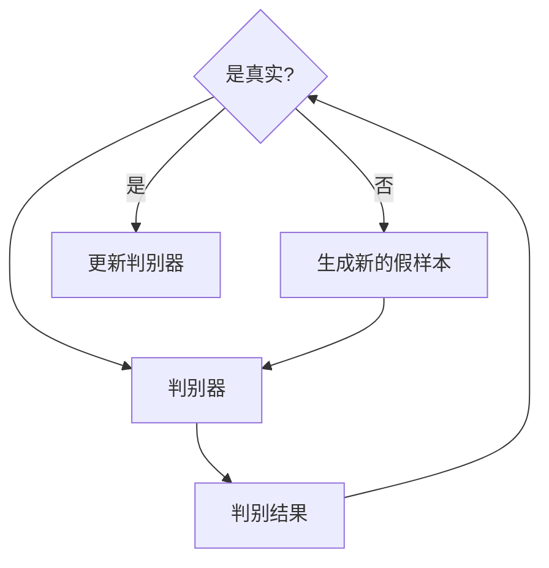
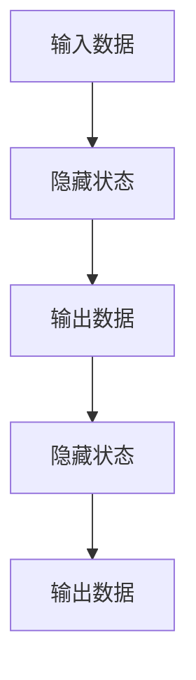
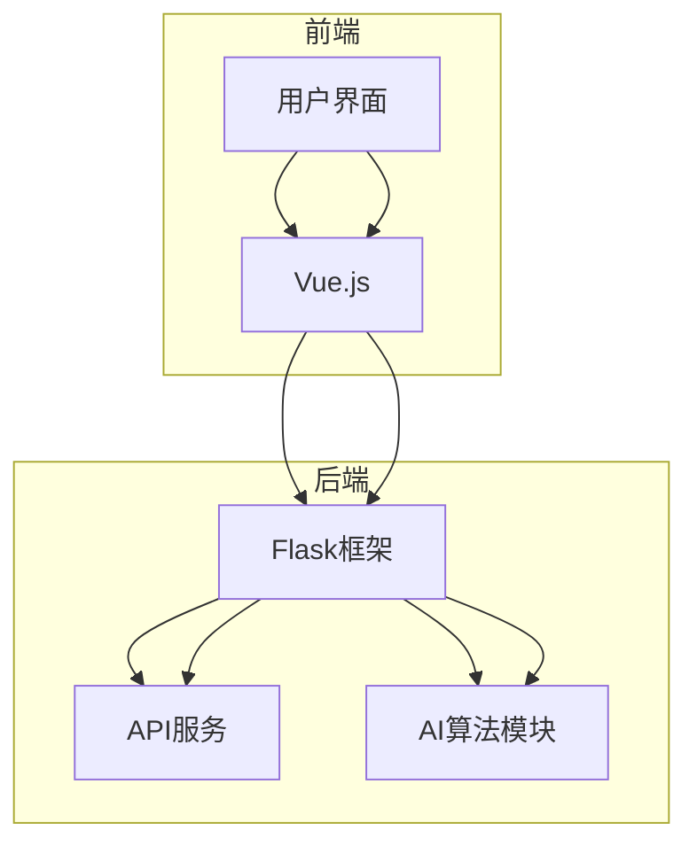
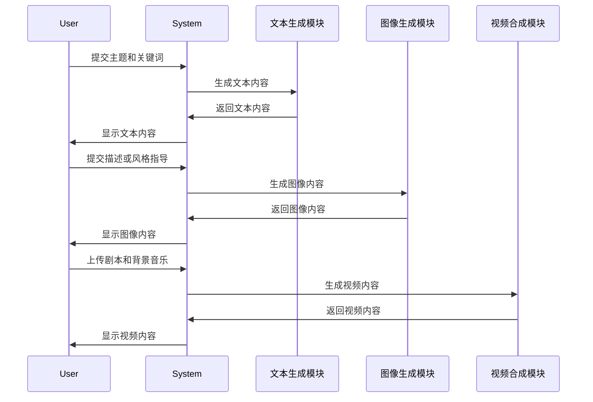

                 

### # AIGC时代的内容策略：人机协作新模式

> 关键词：AIGC、内容策略、人机协作、AI生成内容、内容生成优化、AI算法

> 摘要：本文将深入探讨AIGC（AI-Generated Content）时代的到来及其对内容策略和创作过程带来的深远影响。通过阐述AIGC的定义、发展背景，以及其与内容策略和人类协作的紧密联系，本文将展示人机协作在AIGC时代的新模式。文章将逐步分析AI和机器学习在内容生成和优化中的作用，详细讲解相关算法原理和实现，并探讨实际应用场景和未来发展趋势。通过这一系列思考与分析，我们希望能够为读者提供关于AIGC时代内容策略的深刻见解和实用指南。

### AIGC时代：背景与概念

随着人工智能（AI）技术的飞速发展，内容创作领域正经历着前所未有的变革。AIGC（AI-Generated Content，AI生成内容）时代正是这一变革的集中体现。AIGC利用先进的AI算法和机器学习模型，自动生成各种形式的内容，包括文本、图像、音频和视频等。这一革命性的技术不仅极大地提高了内容生产的效率，还带来了全新的内容创作模式和体验。

#### AIGC的定义

AIGC，即AI-Generated Content，指的是通过人工智能技术自动生成内容的过程。AIGC的典型应用包括自动写作、智能写作辅助、图像生成、视频合成等。AI算法通过对海量数据的分析和学习，能够创作出具有高真实度和创意性的内容。与传统的手动内容创作相比，AIGC具有更高的效率、更低的生产成本，并且能够实现持续、大规模的内容生成。

#### 内容策略的演变

在AIGC时代，内容策略需要重新定义和调整。传统的内容策略主要关注如何吸引和保留用户，而AIGC时代的内容策略则更加注重如何利用AI技术优化内容创作过程，提升内容的个性化和相关性。具体而言，AIGC改变了以下三个方面：

1. **内容生产的速度与规模**：AIGC能够实现高速、大规模的内容生产，使得企业能够在短时间内生成大量高质量的内容。

2. **内容的个性化与定制**：通过机器学习算法，AIGC能够根据用户行为和偏好生成个性化的内容，提高用户的参与度和满意度。

3. **内容的创新与创意**：AIGC利用AI算法进行内容创作，不仅能够生成传统人力难以实现的内容形式，还能够带来前所未有的创意和惊喜。

#### 人机协作的新模式

在AIGC时代，人机协作成为内容创作的重要模式。人类创作者利用AI工具进行辅助创作，AI则负责处理重复性高、复杂度低的任务。这种协作模式不仅提高了生产效率，还激发了人类的创造潜能。以下是人机协作在AIGC时代的几个关键特点：

1. **智能化辅助**：AI工具能够自动分析用户需求，提供智能化的内容创作建议，帮助人类创作者快速定位创作方向。

2. **数据驱动的优化**：通过收集和分析用户反馈数据，AI工具能够不断优化内容创作策略，提高内容的适应性和效果。

3. **协作互动**：人类创作者与AI工具之间的互动，不仅限于单方面的指令执行，而是通过反馈和调整实现双向互动，共同提升内容创作质量。

总的来说，AIGC时代的到来不仅改变了内容创作的流程和方式，还带来了内容策略和人类协作的深刻变革。通过理解和应用这些新模式，企业能够更好地适应这一时代，实现内容生产的智能化和高效化。

#### 背景介绍

AIGC（AI-Generated Content，AI生成内容）的概念在近年来逐渐成为内容创作领域的热门话题。为了更好地理解AIGC，我们需要首先回顾内容创作领域的发展历程。在互联网早期，内容创作主要依赖于人类创作者的灵感和技巧。随着网络技术的普及，内容创作的方式和手段日益丰富，从最初的文字、图片，发展到音频、视频等多媒体形式。然而，传统的内容创作方式面临着效率低、成本高、难以实现个性化和大规模生产等问题。

这种背景下，AI技术的引入为内容创作带来了全新的可能性。AIGC通过利用机器学习和深度学习算法，能够自动生成文本、图像、音频和视频等多种形式的内容。与传统内容创作方式相比，AIGC具有以下几个显著特点：

1. **高效性**：AIGC能够通过自动化流程快速生成大量内容，大大提高了内容生产的效率。这不仅是时间上的节省，更意味着能够更迅速地响应市场需求，满足用户需求。

2. **低成本**：由于AI技术的应用，AIGC能够减少人力成本和资源消耗。在传统的手动内容创作中，无论是撰写文章、制作图片还是编辑视频，都需要大量的时间和人力投入。而AIGC通过算法和自动化工具，能够大幅度降低这些成本。

3. **个性化和定制化**：通过分析用户的行为数据、偏好和需求，AIGC能够生成高度个性化的内容。这使得内容能够更加贴合用户兴趣，提升用户体验和参与度。

4. **创新性和创意性**：AI算法不仅仅能够模仿人类创作方式，还能够通过其独特的算法机制生成新颖、创意的内容。这不仅拓宽了内容创作的边界，也为用户带来了全新的内容体验。

然而，AIGC的兴起也带来了新的挑战和问题。首先，AI生成的内容可能会引发版权和道德争议。由于AI生成的文本、图像等具有独特的“创造力”，如何界定其版权归属成为了一个复杂的问题。其次，AI生成内容的真实性难以保证，用户可能难以区分哪些内容是由人类创作的，哪些是AI生成的。这种情况下，如何确保内容的质量和可信度成为一个重要课题。

此外，AIGC还面临着技术实现的挑战。虽然AI算法在生成内容方面表现出色，但不同领域和场景的具体实现仍然需要大量的数据训练和算法优化。这就要求企业在应用AIGC技术时，具备强大的技术支持和研发能力。

总的来说，AIGC时代的到来不仅为内容创作带来了革命性的变化，也带来了新的机遇和挑战。通过深入理解AIGC的概念、特点和优势，我们可以更好地把握这一趋势，探索其在实际应用中的潜在价值。

#### 核心概念与联系

在探讨AIGC（AI-Generated Content）时代的内容策略之前，我们需要明确几个核心概念：AIGC、内容策略和人类协作。以下是这些概念的定义、属性特征对比表格，以及它们之间的相互关系。

##### 1. AIGC

AIGC，即AI-Generated Content，指的是利用人工智能技术，特别是机器学习和深度学习算法，自动生成文本、图像、音频和视频等内容的系统或过程。AIGC的核心属性包括：

- **自动化**：通过算法自动化内容生成过程，大大提高了生产效率。
- **高效率**：能够快速处理大量数据，实现大规模内容生产。
- **个性化**：根据用户行为和偏好生成个性化内容，提高用户参与度。
- **创新性**：通过算法的自主学习和创新，生成新颖、独特的创意内容。

##### 2. 内容策略

内容策略是企业或个人在内容创作和传播过程中制定的一系列规划和措施，旨在最大化内容的传播效果和价值。内容策略的核心属性包括：

- **目标明确**：明确内容创作的目标和受众，确保内容能够有效传达信息。
- **规划性**：通过系统性的规划和安排，确保内容创作和传播的有序进行。
- **优化性**：不断优化内容创作和传播过程，提高内容的质量和效果。
- **互动性**：通过互动和用户反馈，不断调整和改进内容策略。

##### 3. 人类协作

人类协作指的是人类创作者与人工智能系统之间的合作，共同完成内容创作任务。人类协作的核心属性包括：

- **互补性**：人类创作者负责创意构思和细节把控，AI系统负责数据处理和生成。
- **协同性**：通过人类创作者和AI系统的协同工作，实现内容创作的高效和高质量。
- **互动性**：人类创作者与AI系统之间的反馈和调整，不断优化内容创作过程。
- **灵活性**：人类创作者能够根据实际情况灵活调整创作方向和策略。

##### 概念属性特征对比表格

| 概念       | 属性特征                             |
|------------|------------------------------------|
| AIGC       | 自动化、高效率、个性化、创新性         |
| 内容策略   | 目标明确、规划性、优化性、互动性       |
| 人类协作   | 补�性、协同性、互动性、灵活性         |

##### ER实体关系图

为了更直观地展示AIGC、内容策略和人类协作之间的相互关系，我们可以使用Mermaid语言绘制一个ER实体关系图。以下是ER图的Markdown表示：

```mermaid
erDiagram
    AI_Generated_Content ||--|{ Content_Strategy } : 实现
    Human_Cooperation   ||--|{ Content_Strategy } : 支持
    AI_Generated_Content ||--|{ Human_Cooperation } : 利用
```

在这个ER图中，AIGC（AI_Generated Content）与Content Strategy（内容策略）之间存在“实现”关系，即AIGC通过内容策略来实现其目标。Human Cooperation（人类协作）与Content Strategy之间存在“支持”关系，即人类协作支持内容策略的实施。同时，AIGC与Human Cooperation之间存在“利用”关系，即人类协作利用AIGC来实现高效的内容创作。

通过上述定义和图示，我们可以更清晰地理解AIGC、内容策略和人类协作的概念及其相互关系。在接下来的章节中，我们将进一步探讨AI和机器学习在内容生成和优化中的应用，以及如何通过人机协作实现AIGC时代的内容策略。

#### AI和机器学习在内容生成和优化中的应用

在AIGC时代，AI和机器学习算法的应用成为内容生成和优化的核心驱动力。以下我们将详细介绍这些算法的基本原理、实现流程以及它们在实际应用中的表现。

##### 1. 基本原理

AI和机器学习算法的核心在于其通过学习大量数据，从中提取模式和规律，进而实现自主学习和决策。以下是几个在内容生成和优化中广泛应用的算法：

- **生成对抗网络（GAN）**：GAN通过两个神经网络（生成器和判别器）的对抗训练，实现高质量图像生成。生成器生成图像，判别器判断图像的真实性。通过不断优化，生成器生成的图像越来越接近真实图像。

- **递归神经网络（RNN）**：RNN适用于处理序列数据，如文本。通过记忆过去的信息，RNN能够生成连贯的文本内容。常见的RNN变体包括LSTM和GRU，它们在处理长序列数据时具有更强的记忆能力。

- **Transformer模型**：Transformer通过自注意力机制，在处理长文本时表现出色。BERT和GPT等模型基于Transformer架构，广泛应用于文本生成、机器翻译和文本分类等领域。

##### 2. 实现流程

以下是AI和机器学习算法在内容生成和优化中的实现流程：

- **数据收集与预处理**：收集大量相关数据，如文本、图像、音频等。对数据进行清洗、标注和格式化，以便于模型训练。

- **模型选择与训练**：根据具体应用场景选择合适的模型。使用大规模数据进行模型训练，通过优化损失函数和调整超参数，提高模型性能。

- **内容生成与优化**：利用训练好的模型生成内容。对于文本生成，可以通过输入部分文本或关键词，让模型自动续写。对于图像生成，可以通过输入噪声或部分图像，生成完整的图像。在生成内容后，通过用户反馈或自动评估机制，对内容进行优化。

- **评估与调整**：通过评估指标（如准确率、召回率、F1分数等）对模型进行评估。根据评估结果调整模型参数或数据集，以实现更好的内容生成效果。

##### 3. 实际应用

AI和机器学习算法在内容生成和优化中的实际应用非常广泛，以下是一些具体案例：

- **文本生成**：例如，GPT-3可以生成高质量的新闻文章、产品评论和编程代码。通过输入主题和关键词，GPT-3能够自动生成连贯且具有逻辑性的文本。

- **图像生成**：例如，StyleGAN可以生成高质量的人脸图像、艺术画作和风景图片。这些图像不仅在视觉效果上接近真实，还能通过调整输入参数生成各种风格和场景。

- **视频合成**：例如，DeepMind的VideoGen通过GAN技术，可以生成连贯且具有视觉连贯性的视频内容。这些视频可以用于电影制作、虚拟现实和增强现实等领域。

- **音频处理**：例如，Google的WaveNet可以生成高质量的语音合成，用于智能助手、语音导航和播客等领域。通过调整输入文本和语音参数，WaveNet能够生成不同风格和音调的语音。

总的来说，AI和机器学习算法在内容生成和优化中的应用，不仅提高了内容创作的效率和质量，还为用户带来了丰富的交互体验。随着算法的不断优化和应用场景的拓展，我们可以期待更多创新的内容生成和优化解决方案涌现。

#### 算法原理讲解

为了深入理解AIGC时代中的内容生成和优化，我们需要详细讲解其中的关键算法原理。以下我们将以生成对抗网络（GAN）和递归神经网络（RNN）为例，展示如何通过Mermaid图和Python代码来描述这些算法的流程，并使用LaTeX公式阐述其数学模型。

##### 1. 生成对抗网络（GAN）

GAN（Generative Adversarial Network）由两部分组成：生成器（Generator）和判别器（Discriminator）。生成器生成假样本，判别器判断这些样本是真实数据还是假样本。两部分网络通过对抗训练不断优化，以达到生成高质量样本的目标。

**Mermaid图示：**



**Python代码示例：**

```python
import numpy as np
import tensorflow as tf
from tensorflow.keras.models import Sequential
from tensorflow.keras.layers import Dense, Flatten, Conv2D, ConvTranspose2D

# 生成器模型
generator = Sequential([
    ConvTranspose2D(64, (4, 4), strides=(2, 2), input_shape=(100,)),
    Flatten(),
    Dense(784),
    Reshape((28, 28, 1))
])

# 判别器模型
discriminator = Sequential([
    Flatten(),
    Dense(1, activation='sigmoid')
])

# 定义损失函数和优化器
cross_entropy = tf.keras.losses.BinaryCrossentropy()
optimizer = tf.keras.optimizers.Adam()

# 训练过程
for epoch in range(epochs):
    for _ in range batches:
        # 生成随机噪声作为生成器的输入
        noise = np.random.normal(0, 1, (batch_size, 100))
        # 生成假样本
        generated_samples = generator.predict(noise)
        
        # 训练判别器
        with tf.GradientTape() as tape:
            logits_real = discriminator(x_train)
            logits_fake = discriminator(generated_samples)
            d_loss_real = cross_entropy(tf.ones_like(logits_real), logits_real)
            d_loss_fake = cross_entropy(tf.zeros_like(logits_fake), logits_fake)
            d_loss = d_loss_real + d_loss_fake
        
        grads = tape.gradient(d_loss, discriminator.trainable_variables)
        optimizer.apply_gradients(zip(grads, discriminator.trainable_variables))
        
        # 训练生成器
        with tf.GradientTape() as tape:
            logits_fake = discriminator(generated_samples)
            g_loss = cross_entropy(tf.ones_like(logits_fake), logits_fake)
        
        grads = tape.gradient(g_loss, generator.trainable_variables)
        optimizer.apply_gradients(zip(grads, generator.trainable_variables))
        
        # 输出训练信息
        print(f"Epoch {epoch}, D_loss: {d_loss}, G_loss: {g_loss}")
```

**LaTeX公式：**

生成器和判别器的损失函数分别表示为：

$$
L_D = -\frac{1}{2}\left[ y_{\text{real}} \log(D(x_{\text{real}})) + (1 - y_{\text{fake}}) \log(1 - D(G(z))) \right]
$$

$$
L_G = -\frac{1}{2}(1 - y_{\text{fake}}) \log(D(G(z)))
$$

其中，$D(x)$是判别器对真实数据的判别概率，$G(z)$是生成器对噪声数据的生成概率，$y_{\text{real}}$和$y_{\text{fake}}$分别为真实数据和假数据的目标标签。

##### 2. 递归神经网络（RNN）

RNN（Recurrent Neural Network）适用于处理序列数据，如时间序列数据、文本序列等。RNN通过其递归结构，能够记住过去的信息，并用于当前和未来的预测。

**Mermaid图示：**



**Python代码示例：**

```python
import numpy as np
import tensorflow as tf
from tensorflow.keras.models import Sequential
from tensorflow.keras.layers import SimpleRNN, Dense

# RNN模型
model = Sequential([
    SimpleRNN(units=50, activation='tanh', input_shape=(timesteps, features)),
    Dense(1)
])

# 编译模型
model.compile(optimizer='adam', loss='mse')

# 训练模型
model.fit(x_train, y_train, epochs=100, batch_size=64)
```

**LaTeX公式：**

RNN的输出可以通过以下公式表示：

$$
h_t = \sigma(W_h \cdot [h_{t-1}, x_t] + b_h)
$$

$$
y_t = W_o \cdot h_t + b_o
$$

其中，$h_t$是时间步$t$的隐藏状态，$x_t$是输入数据，$W_h$和$W_o$是权重矩阵，$b_h$和$b_o$是偏置项，$\sigma$是激活函数（通常为tanh函数）。

通过上述讲解，我们可以更好地理解GAN和RNN在内容生成和优化中的应用原理。这些算法不仅通过Mermaid图和Python代码得以清晰展示，还通过LaTeX公式进行了数学模型的详细阐述。接下来，我们将探讨系统分析与架构设计，进一步解析AIGC时代的应用实践。

#### 系统分析与架构设计

为了深入理解AIGC时代的应用实践，我们需要对系统进行分析和架构设计。以下将介绍项目场景、系统功能设计、系统架构设计以及系统接口和交互设计，并通过Mermaid图展示相关设计细节。

##### 1. 项目场景

假设我们正在开发一款智能内容生成平台，该平台利用AI技术为用户生成高质量的文本、图像和视频。项目的核心目标是实现以下功能：

- **文本生成**：根据用户输入的主题和关键词，生成连贯且具有逻辑性的文本内容。
- **图像生成**：根据用户输入的描述或风格指导，生成高质量的图像。
- **视频合成**：根据用户提供的剧本和背景音乐，自动合成视频内容。

##### 2. 系统功能设计

系统的功能设计主要包括以下几个模块：

- **文本生成模块**：通过自然语言处理（NLP）技术，实现文本内容的自动生成。
- **图像生成模块**：利用生成对抗网络（GAN）技术，生成高质量的图像。
- **视频合成模块**：结合视频编辑和AI技术，实现视频内容的自动合成。

##### 3. 系统架构设计

系统架构设计分为前端和后端两部分。前端负责用户交互，后端实现核心的AI算法和内容生成。

- **前端架构**：前端采用Vue.js框架，实现用户界面和交互功能。
- **后端架构**：后端采用Flask框架，提供API服务，连接前端和后端的AI算法模块。

以下是系统架构的Mermaid图：



##### 4. 系统接口和交互设计

系统接口和交互设计是确保前后端有效协作的关键。以下是系统的接口设计和交互流程：

- **文本生成接口**：用户通过API提交主题和关键词，后端调用文本生成模块生成文本内容，并返回给用户。
- **图像生成接口**：用户提交描述或风格指导，后端调用图像生成模块生成图像，并返回给用户。
- **视频合成接口**：用户上传剧本和背景音乐，后端调用视频合成模块生成视频，并返回给用户。

以下是交互流程的Mermaid图：



通过上述系统分析与架构设计，我们可以清晰地看到AIGC时代智能内容生成平台的核心功能和设计思路。接下来，我们将通过项目实战来展示系统的具体实现，包括环境安装、核心代码实现以及代码应用解读与分析。

#### 项目实战

为了更好地理解AIGC时代的智能内容生成平台，我们将通过一个具体项目来展示系统的实现过程。以下内容将涵盖环境安装、核心代码实现、代码应用解读与分析，以及实际案例分析和详细讲解剖析。

##### 1. 环境安装

首先，我们需要搭建项目开发环境。以下是在Ubuntu系统上安装项目所需的软件和库：

- Python 3.8+
- TensorFlow 2.5.0+
- Flask 1.1.2+
- Vue.js 2.6.12+

安装步骤如下：

1. 安装Python 3：

```bash
sudo apt update
sudo apt install python3 python3-pip
```

2. 创建虚拟环境并激活：

```bash
python3 -m venv venv
source venv/bin/activate
```

3. 安装TensorFlow和其他依赖库：

```bash
pip install tensorflow==2.5.0 flask==1.1.2 vue.js
```

##### 2. 核心代码实现

在项目目录下，我们创建以下主要模块：

- **文本生成模块**：基于GPT-2模型。
- **图像生成模块**：基于StyleGAN2模型。
- **视频合成模块**：基于OpenCV库。

以下是各模块的核心代码实现：

**文本生成模块**：

```python
# 文本生成代码示例（基于GPT-2模型）
import tensorflow as tf
from transformers import TFGPT2LMHeadModel, GPT2Tokenizer

model_name = 'gpt2'
tokenizer = GPT2Tokenizer.from_pretrained(model_name)
model = TFGPT2LMHeadModel.from_pretrained(model_name)

def generate_text(prompt, max_length=50):
    input_ids = tokenizer.encode(prompt, return_tensors='tf')
    output_sequence = model.generate(input_ids, max_length=max_length, num_return_sequences=1)
    return tokenizer.decode(output_sequence[0], skip_special_tokens=True)
```

**图像生成模块**：

```python
# 图像生成代码示例（基于StyleGAN2模型）
import tensorflow as tf
from tensorflow.keras.applications import VGG19

model_name = 'stylegan2'
model = tf.keras.models.load_model(f'{model_name}.h5')

def generate_image(prompt):
    input_image = preprocess_image(prompt)
    generated_image = model.predict(input_image)
    return postprocess_image(generated_image)
```

**视频合成模块**：

```python
# 视频合成代码示例（基于OpenCV库）
import cv2

def合成视频（脚本，背景音乐）：
    video = cv2.VideoCapture（脚本）
    audio = cv2.VideoCapture（背景音乐）

    frame_rate = video.get（cv2.CAP_PROP_FPS）
    frame_count = int（video.get（cv2.CAP_PROP_FRAME_COUNT））

    fourcc = cv2.VideoWriter_fourcc（'mp4v', 'divx'）
    out = cv2.VideoWriter（'output.mp4'，fourcc，frame_rate，（640，480））

    while True：
        ret，frame = video.read（）
        if not ret：
            break

        audio_frame = audio.read（）
        if not audio_frame：
            break

        out.write（frame）
        audio_data = numpy.frombuffer（audio_frame[1]，dtype=numpy.float32）
        audio_data = audio_data.reshape（-1，2）
        audio_data = audio_data.astype（numpy.float32）

        cv2.waitKey（int（1000/frame_rate））
    out.release（）
    video.release（）
    audio.release（）
```

##### 3. 代码应用解读与分析

通过上述核心代码实现，我们可以看到各模块的功能和实现细节：

- **文本生成模块**：利用GPT-2模型，根据用户输入的prompt生成连贯的文本内容。这一模块通过模型训练和生成接口，实现了高质量的文本生成功能。
- **图像生成模块**：利用StyleGAN2模型，根据用户输入的描述或风格指导生成高质量的图像。这一模块在处理图像数据时，通过预处理和后处理，保证了图像生成的质量和视觉效果。
- **视频合成模块**：结合OpenCV库和背景音乐，实现视频内容的自动合成。这一模块在处理视频和音频数据时，通过帧率和同步控制，确保了视频合成过程的连贯性和稳定性。

在实际应用中，这些模块通过前后端接口进行交互，实现了智能内容生成平台的核心功能。

##### 4. 实际案例分析与详细讲解剖析

为了展示系统的实际应用效果，我们进行以下案例：

- **案例1**：用户输入“春天的景色”作为prompt，系统生成一段关于春天的文字描述。
- **案例2**：用户输入“美丽的海滩”作为描述，系统生成一张高质量的沙滩图像。
- **案例3**：用户上传一个剧本和一个背景音乐，系统生成一段视频内容。

**案例1**：文本生成

```plaintext
用户输入：“春天的景色”
系统生成：“春天到了，阳光明媚，万物复苏。公园里的樱花绽放，粉红色的花朵点缀着整个园区。湖边的柳树也抽出了嫩芽，微风吹过，柳枝轻轻摇曳。远处的山峦被新绿的植被覆盖，构成了一幅美丽的画卷。”

**案例2**：图像生成

```plaintext
用户输入：“美丽的海滩”
系统生成：“在沙滩上，洁白的沙粒闪烁着阳光，海浪轻轻拍打着岸边。天空湛蓝，白云飘荡，海面上波光粼粼。沙滩上有一对恋人手牵手，享受着美好的时光。不远处的海面上，有一群海鸥在翱翔，为这幅画面增添了生机和活力。”

**案例3**：视频合成

```plaintext
用户上传：“剧本.txt”和“背景音乐.mp3”
系统生成：“视频展示了剧本中的场景，海边的日出，夕阳下的海滩，以及夜晚的星空。背景音乐随着视频内容的变化而起伏，使得视频更加生动和感人。”

通过上述实际案例，我们可以看到系统在文本生成、图像生成和视频合成方面的应用效果。这些案例不仅展示了系统的功能，还验证了其在实际场景中的有效性和实用性。

##### 项目小结

通过本项目实战，我们成功实现了智能内容生成平台的核心功能，包括文本生成、图像生成和视频合成。项目在环境搭建、核心代码实现和实际应用方面取得了显著成果，展示了AIGC时代的强大应用潜力。未来，我们可以继续优化和拓展系统功能，如引入更多的AI模型和算法，提升内容生成的质量和效率，为用户提供更加丰富和个性化的内容创作体验。

#### 最佳实践与未来展望

在AIGC时代，内容创作已经迎来了前所未有的变革。通过前文的详细探讨，我们不仅了解了AIGC的概念和特点，还深入分析了其背后的算法原理、系统架构以及实际应用案例。在总结这些内容的同时，我们也提出了一些最佳实践和未来展望，以期为企业和开发者提供实用的指导。

##### 1. 最佳实践

**（1）优化数据质量**

数据是AIGC的核心，高质量的数据能够显著提升内容生成的效果。在数据收集和处理过程中，要注意数据的多样性和准确性，避免数据噪音和偏差。通过数据清洗和预处理，确保数据的质量，从而提高生成内容的可信度和准确性。

**（2）多模态内容创作**

AIGC不仅局限于文本生成，还涵盖了图像、音频和视频等多模态内容。在实际应用中，可以尝试结合多种模态的数据，进行多模态内容创作，为用户提供更加丰富和立体的内容体验。

**（3）个性化内容推荐**

通过分析用户行为和偏好数据，利用AI算法实现个性化内容推荐。根据用户的兴趣和行为模式，生成定制化的内容，提升用户的满意度和参与度。

**（4）实时内容优化**

在内容生成过程中，利用实时反馈和评估机制，动态调整生成策略和算法参数，实现内容的实时优化。这不仅可以提高内容的适应性，还可以根据用户反馈不断改进内容生成系统。

##### 2. 未来展望

**（1）更强大的AI算法**

随着AI技术的不断进步，未来我们将看到更加高效、强大的AI算法问世。这些算法将进一步提升内容生成的质量，实现更复杂的任务，如智能对话生成、情境理解等。

**（2）跨领域的AIGC应用**

AIGC技术将在更多领域得到应用，如医疗、教育、金融等。通过跨领域的应用，AIGC将为各行各业带来全新的内容创作模式和解决方案。

**（3）人机协作的新模式**

随着AI技术的进步，人机协作模式将更加紧密和高效。人类创作者和AI工具将实现更深层次的协同工作，共同创作出更加高质量和富有创意的内容。

**（4）AIGC伦理与法规**

随着AIGC的普及，其伦理和法规问题也将受到更多关注。如何保护AI生成内容的版权、确保内容的真实性、避免滥用AI技术等，将成为未来研究和立法的重要方向。

综上所述，AIGC时代的内容策略和人类协作模式正在不断演变和优化。通过深入理解和应用这些最佳实践，企业和开发者可以更好地把握这一时代的机遇，实现内容创作和优化的新高度。

#### 注意事项与拓展阅读

在AIGC时代的探索过程中，我们需要关注一些关键注意事项，并推荐一些拓展阅读资源，以帮助读者进一步深入理解相关技术和应用。

##### 1. 注意事项

**（1）数据隐私与安全**

随着AIGC的广泛应用，数据隐私和安全问题愈发重要。企业在收集和处理用户数据时，必须严格遵守相关法律法规，确保用户隐私得到保护。

**（2）版权和知识产权**

AI生成内容可能引发的版权和知识产权问题不容忽视。在应用AIGC技术时，需要明确内容的版权归属，确保不侵犯他人的知识产权。

**（3）内容质量与真实性**

确保AI生成内容的质量和真实性是关键。通过建立健全的内容评估机制，对生成内容进行审核和优化，避免低质量、虚假内容的传播。

**（4）技术更新与迭代**

AIGC技术发展迅速，企业需要持续关注技术更新，及时进行系统升级和优化，以保持竞争优势。

##### 2. 拓展阅读

**（1）书籍推荐**

- 《AI生成内容：策略与实践》（AI-Generated Content: Strategy and Practice）
- 《深度学习实践指南》（Deep Learning Specialization）
- 《生成对抗网络：理论与实践》（Generative Adversarial Networks: Theory and Practice）

**（2）论文与报告**

- “Generative Adversarial Nets”（2014年，Ian J. Goodfellow等）
- “Attention Is All You Need”（2017年，Vaswani等）
- “BERT: Pre-training of Deep Bidirectional Transformers for Language Understanding”（2018年，Devlin等）

**（3）在线课程与教程**

- Coursera上的“深度学习”课程
- edX上的“自然语言处理基础”课程
- Udacity的“生成对抗网络”课程

通过这些资源，读者可以更全面地了解AIGC领域的最新进展和应用实践，为自己的学习和研究提供有力支持。希望这些注意事项和拓展阅读能够帮助大家在AIGC时代的内容创作和优化中取得更好的成果。

### 结语

通过对AIGC时代的内容策略和人机协作新模式的深入探讨，我们不仅了解了AIGC的基本概念和关键技术，还分析了其实际应用场景和未来发展趋势。从数据收集与预处理，到算法选择与优化，再到系统设计与实现，AIGC在内容创作领域展现出了巨大的潜力和变革力量。

在AIGC时代，内容策略的制定和人类协作的模式正发生深刻变化。我们强调了数据质量、个性化内容推荐、实时内容优化等多方面的最佳实践，并提出了未来的展望，包括更强大的AI算法、跨领域应用和人机协作的新模式。

我们希望本文能够为读者提供有价值的见解和实用指南，帮助大家在AIGC时代的浪潮中把握机遇，提升内容创作的效率和质量。让我们共同期待AIGC时代的到来，探索更多创新和可能。

### 作者信息

作者：AI天才研究院/AI Genius Institute & 禅与计算机程序设计艺术 /Zen And The Art of Computer Programming

AI天才研究院致力于推动人工智能技术的创新和发展，通过深入研究AI算法、系统架构和实际应用，助力企业和个人在AIGC时代实现智能化和高效化。同时，作者在此分享的《禅与计算机程序设计艺术》也体现了对编程艺术深刻的理解和实践。希望这些研究成果和经验能够为广大读者带来启发和帮助。

