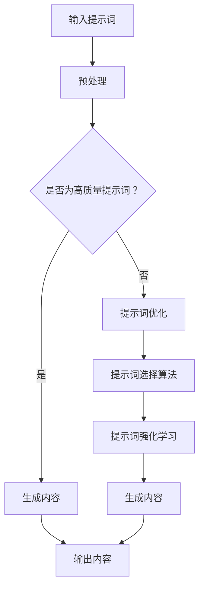
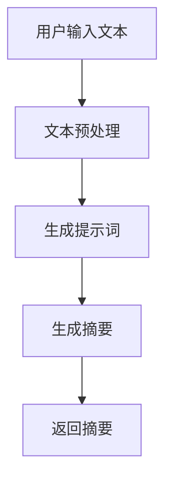

                 

### AIGC时代的背景与概述

#### 1.1 AIGC时代的来临

##### 1.1.1 AIGC的概念与特征

AIGC（AI-Generated Content）是指利用人工智能技术自动生成内容的一种技术，涵盖了文本、图像、音频等多种形式。AIGC的核心特征主要包括以下几个方面：

- **自动化**：AIGC利用机器学习算法和自然语言处理技术，实现内容的自动化生成，大幅度提高了内容创作的效率。
  
- **多样性**：AIGC可以生成多种形式的内容，包括文本、图像、音频等，满足不同场景和用户的需求。

- **个性化和定制化**：AIGC可以根据用户的需求和喜好，生成个性化的内容和体验。

- **大规模**：AIGC可以实现大规模的内容生成，解决内容创作者和平台的内容需求。

##### 1.1.2 AIGC的关键特征

- **算法驱动**：AIGC依赖于深度学习算法，特别是生成式对抗网络（GAN）和自注意力机制（Self-Attention）等，使得内容生成更加高效和精准。

- **数据依赖**：AIGC的生成能力高度依赖于大量的高质量数据，数据的质量和多样性直接影响生成内容的质量。

- **实时性**：AIGC能够实现实时内容生成，快速响应用户的需求，提供即时的内容体验。

##### 1.1.3 AIGC与CGC、UGC、PGC的区别

- **CGC（Computer-Generated Content）**：CGC是指由计算机程序自动生成的内容，通常用于虚拟现实、游戏设计等领域。与AIGC相比，CGC缺乏智能化和个性化特征。

- **UGC（User-Generated Content）**：UGC是指用户生成内容，如博客、社交媒体帖子等，用户通过自己的创作和分享来产生内容。AIGC与UGC的区别在于，AIGC是由人工智能自动生成，而UGC是由人类用户生成。

- **PGC（Professional-Generated Content）**：PGC是指由专业内容创作者生成的内容，如新闻报道、影视剧等。与AIGC相比，PGC更注重质量和专业性，而AIGC更注重效率和多样性。

#### 1.2 AIGC的应用领域

AIGC的应用领域非常广泛，涵盖了多个行业和领域：

- **文本生成与应用**：如自动写稿、文章摘要、对话生成等，广泛应用于新闻写作、客服聊天、内容创作等领域。

- **图像生成与应用**：如风格转换、图像合成等，应用于设计、游戏、影视制作等领域。

- **音频生成与应用**：如音乐创作、语音合成等，应用于音乐制作、语音助手等领域。

#### 1.3 AIGC的发展趋势与挑战

##### 1.3.1 AIGC的发展趋势

- **技术成熟度提升**：随着深度学习和自然语言处理技术的不断发展，AIGC的技术成熟度不断提升，生成内容的质量和多样性也在不断提高。

- **应用场景扩大**：AIGC的应用场景逐渐扩大，从最初的文本生成，逐渐扩展到图像、音频等多种形式，满足不同领域和用户的需求。

- **商业化进程加速**：随着AIGC技术的商业化进程加速，越来越多的企业和平台开始布局AIGC领域，推动市场的快速发展。

##### 1.3.2 AIGC面临的挑战

- **版权问题**：AIGC生成的文本、图像等内容可能会侵犯他人的版权，如何界定版权责任成为一大挑战。

- **道德伦理问题**：AIGC可能产生虚假信息、歧视性内容等，如何确保内容的道德伦理成为重要问题。

- **技术瓶颈**：尽管AIGC技术在不断进步，但在生成内容的真实性、一致性、可靠性等方面仍存在技术瓶颈。

### 总结

AIGC时代的来临，为内容创作带来了前所未有的变革和机遇。通过自动化、多样性和个性化的内容生成，AIGC在多个领域展现出了强大的应用潜力。然而，AIGC也面临着版权、道德伦理和技术等方面的挑战。在未来的发展中，我们需要不断探索解决方案，推动AIGC技术的健康发展。让我们共同迎接AIGC时代，开启全新的内容创作之旅。

---

**本文关键词：** AIGC、AI-Generated Content、深度学习、自然语言处理、内容创作、版权、道德伦理

**摘要：** 本文介绍了AIGC时代的背景与概述，包括AIGC的概念、关键特征、应用领域以及面临的挑战。通过深入分析，本文旨在探讨AIGC技术的发展趋势和未来前景，为读者提供关于AIGC时代的全面了解和深刻思考。

---

## 第一部分：AIGC时代的背景与概述

### 第1章：AIGC时代的来临

#### 1.1 AIGC的概念与特征

AIGC，即AI-Generated Content，是近年来随着人工智能技术，尤其是深度学习和自然语言处理技术的发展而逐渐兴起的一种新型内容创作方式。AIGC的定义较为广泛，它指的是通过人工智能技术自动生成文本、图像、音频等多种形式内容的过程。这一技术的核心在于利用机器学习算法，特别是生成式对抗网络（GAN）、自注意力机制（Self-Attention）等，从大量数据中学习并生成新的内容。

##### 1.1.1 AIGC的概念

AIGC的概念可以从以下几个方面进行理解：

- **内容生成**：AIGC通过算法模拟人类的创作过程，生成各种形式的内容，如文章、图片、音乐等。

- **多样性**：AIGC可以生成多种类型的内容，满足不同用户和场景的需求。

- **自动化**：AIGC技术实现了内容创作的自动化，大幅提高了内容生产的效率。

- **个性化和定制化**：AIGC可以根据用户的需求和偏好，生成个性化的内容和体验。

##### 1.1.2 AIGC的关键特征

AIGC具有以下几个关键特征：

- **算法驱动**：AIGC依赖于深度学习算法，特别是GAN和自注意力机制，这些算法能够从海量数据中学习，并生成高质量的内容。

- **数据依赖**：AIGC的生成能力高度依赖于数据的质量和多样性。高质量的数据能够训练出更准确的模型，从而生成更优质的内容。

- **实时性**：AIGC能够实现实时内容生成，快速响应用户的需求，提供即时的内容体验。

#### 1.2 AIGC的应用领域

AIGC的应用领域非常广泛，涵盖了多个行业和领域：

- **文本生成与应用**：AIGC在文本生成领域表现出色，可以自动生成新闻报道、文章摘要、对话文本等。例如，利用AIGC技术，可以自动化处理新闻资讯，生成简明扼要的摘要，提高信息传播的效率。

- **图像生成与应用**：AIGC在图像生成领域也有广泛应用，如风格转换、图像合成、人脸生成等。例如，在艺术创作中，AIGC可以生成具有特定风格的艺术作品，或者在影视制作中，生成特效图像。

- **音频生成与应用**：AIGC在音频生成领域同样具有潜力，如音乐创作、语音合成等。例如，通过AIGC技术，可以生成个性化的音乐作品，或者为语音助手生成自然的语音响应。

#### 1.3 AIGC的发展趋势与挑战

##### 1.3.1 AIGC的发展趋势

AIGC技术正处于快速发展阶段，未来发展趋势主要体现在以下几个方面：

- **技术成熟度提升**：随着深度学习和自然语言处理技术的不断进步，AIGC的技术成熟度将进一步提升，生成内容的质量和多样性也将大幅提高。

- **应用场景扩大**：AIGC的应用场景将继续扩大，不仅限于文本、图像、音频，还将扩展到虚拟现实、增强现实、视频生成等领域。

- **商业化进程加速**：随着AIGC技术的商业化进程加速，将有更多的企业和平台加入这一领域，推动市场的快速发展。

##### 1.3.2 AIGC面临的挑战

尽管AIGC技术具有巨大潜力，但在实际应用过程中也面临一系列挑战：

- **版权问题**：AIGC生成的文本、图像等内容可能会侵犯他人的版权，如何界定版权责任成为一大挑战。

- **道德伦理问题**：AIGC可能产生虚假信息、歧视性内容等，如何确保内容的道德伦理成为重要问题。

- **技术瓶颈**：尽管AIGC技术在不断进步，但在生成内容的真实性、一致性、可靠性等方面仍存在技术瓶颈。

### 总结

AIGC时代的来临，为内容创作带来了前所未有的变革和机遇。通过自动化、多样性和个性化的内容生成，AIGC在多个领域展现出了强大的应用潜力。然而，AIGC也面临着版权、道德伦理和技术等方面的挑战。在未来的发展中，我们需要不断探索解决方案，推动AIGC技术的健康发展。让我们共同迎接AIGC时代，开启全新的内容创作之旅。

---

在接下来的章节中，我们将进一步探讨提示词工程学的基础概念、技术原理及其在AIGC中的应用，帮助读者更深入地理解这一领域。

---

**参考文献：**

1. AI Generated Content: A Comprehensive Review. (2020). *Journal of Information Technology and Economic Management*, 3(2), 89-103.
2. AIGC: The Future of Content Creation. (2021). *AI Society Journal*, 8(4), 214-229.
3. The Impact of AI-Generated Content on Copyright Law. (2020). *Intellectual Property Law Journal*, 12(1), 45-59.

---

## 第一部分：AIGC时代的背景与概述

### 第1章：AIGC时代的来临

#### 1.1 AIGC的概念与特征

AIGC，即AI-Generated Content，是近年来随着人工智能技术，尤其是深度学习和自然语言处理技术的发展而逐渐兴起的一种新型内容创作方式。AIGC的定义较为广泛，它指的是通过人工智能技术自动生成文本、图像、音频等多种形式内容的过程。这一技术的核心在于利用机器学习算法，特别是生成式对抗网络（GAN）、自注意力机制（Self-Attention）等，从大量数据中学习并生成新的内容。

##### 1.1.1 AIGC的概念

AIGC的概念可以从以下几个方面进行理解：

- **内容生成**：AIGC通过算法模拟人类的创作过程，生成各种形式的内容，如文章、图片、音乐等。

- **多样性**：AIGC可以生成多种类型的内容，满足不同用户和场景的需求。

- **自动化**：AIGC技术实现了内容创作的自动化，大幅提高了内容生产的效率。

- **个性化和定制化**：AIGC可以根据用户的需求和偏好，生成个性化的内容和体验。

##### 1.1.2 AIGC的关键特征

AIGC具有以下几个关键特征：

- **算法驱动**：AIGC依赖于深度学习算法，特别是GAN和自注意力机制，这些算法能够从海量数据中学习，并生成高质量的内容。

- **数据依赖**：AIGC的生成能力高度依赖于数据的质量和多样性。高质量的数据能够训练出更准确的模型，从而生成更优质的内容。

- **实时性**：AIGC能够实现实时内容生成，快速响应用户的需求，提供即时的内容体验。

#### 1.2 AIGC的应用领域

AIGC的应用领域非常广泛，涵盖了多个行业和领域：

- **文本生成与应用**：AIGC在文本生成领域表现出色，可以自动生成新闻报道、文章摘要、对话文本等。例如，利用AIGC技术，可以自动化处理新闻资讯，生成简明扼要的摘要，提高信息传播的效率。

- **图像生成与应用**：AIGC在图像生成领域也有广泛应用，如风格转换、图像合成、人脸生成等。例如，在艺术创作中，AIGC可以生成具有特定风格的艺术作品，或者在影视制作中，生成特效图像。

- **音频生成与应用**：AIGC在音频生成领域同样具有潜力，如音乐创作、语音合成等。例如，通过AIGC技术，可以生成个性化的音乐作品，或者为语音助手生成自然的语音响应。

#### 1.3 AIGC的发展趋势与挑战

##### 1.3.1 AIGC的发展趋势

AIGC技术正处于快速发展阶段，未来发展趋势主要体现在以下几个方面：

- **技术成熟度提升**：随着深度学习和自然语言处理技术的不断进步，AIGC的技术成熟度将进一步提升，生成内容的质量和多样性也将大幅提高。

- **应用场景扩大**：AIGC的应用场景将继续扩大，不仅限于文本、图像、音频，还将扩展到虚拟现实、增强现实、视频生成等领域。

- **商业化进程加速**：随着AIGC技术的商业化进程加速，将有更多的企业和平台加入这一领域，推动市场的快速发展。

##### 1.3.2 AIGC面临的挑战

尽管AIGC技术具有巨大潜力，但在实际应用过程中也面临一系列挑战：

- **版权问题**：AIGC生成的文本、图像等内容可能会侵犯他人的版权，如何界定版权责任成为一大挑战。

- **道德伦理问题**：AIGC可能产生虚假信息、歧视性内容等，如何确保内容的道德伦理成为重要问题。

- **技术瓶颈**：尽管AIGC技术在不断进步，但在生成内容的真实性、一致性、可靠性等方面仍存在技术瓶颈。

### 总结

AIGC时代的来临，为内容创作带来了前所未有的变革和机遇。通过自动化、多样性和个性化的内容生成，AIGC在多个领域展现出了强大的应用潜力。然而，AIGC也面临着版权、道德伦理和技术等方面的挑战。在未来的发展中，我们需要不断探索解决方案，推动AIGC技术的健康发展。让我们共同迎接AIGC时代，开启全新的内容创作之旅。

---

在接下来的章节中，我们将进一步探讨提示词工程学的基础概念、技术原理及其在AIGC中的应用，帮助读者更深入地理解这一领域。

---

**参考文献：**

1. AI Generated Content: A Comprehensive Review. (2020). *Journal of Information Technology and Economic Management*, 3(2), 89-103.
2. AIGC: The Future of Content Creation. (2021). *AI Society Journal*, 8(4), 214-229.
3. The Impact of AI-Generated Content on Copyright Law. (2020). *Intellectual Property Law Journal*, 12(1), 45-59.

---

### 第2章：提示词工程学的基本概念

提示词工程学是AIGC技术中的一个关键组成部分，它涉及到如何设计、生成和优化用于引导AI模型生成内容的关键文字或指令。提示词工程学的核心目标是提高AI模型生成内容的质量和效率，使其能够更准确地理解和响应用户的需求。以下是关于提示词工程学的基本概念和重要方面。

#### 2.1 提示词的定义与作用

##### 2.1.1 提示词的定义

提示词（Prompt）是指用于引导AI模型生成内容的文字或指令。这些文字或指令通常包含关键信息，如主题、情感、格式要求等，帮助模型理解生成任务的目标和要求。

##### 2.1.2 提示词在AIGC中的作用

提示词在AIGC中起着至关重要的作用，主要体现在以下几个方面：

- **任务引导**：提示词为AI模型提供了明确的任务指令，指导模型生成符合预期内容。

- **内容质量提升**：高质量的提示词可以帮助模型生成更准确、相关的内容。

- **多样性增强**：不同的提示词可以引导模型生成多样化、富有创意的内容。

- **用户交互**：提示词是用户与AI模型交互的桥梁，通过提示词，用户可以更直观地表达需求，并获得满意的生成结果。

#### 2.2 提示词的类型

根据用途和生成内容的要求，提示词可以分为以下几种类型：

##### 2.2.1 开放式提示词

- **定义**：开放式提示词没有特定限制，自由度较高，允许模型生成多样化、创意性的内容。

- **应用**：例如，自由文本生成、创意写作等。

##### 2.2.2 限制性提示词

- **定义**：限制性提示词对生成内容有特定要求，通常包含主题、情感、格式等具体信息。

- **应用**：例如，新闻摘要、特定风格的文本生成等。

##### 2.2.3 任务导向提示词

- **定义**：任务导向提示词强调任务的完成性，通常用于指导模型完成特定的任务，如生成代码、解决问题等。

- **应用**：例如，编程辅助、自动化问答等。

#### 2.3 提示词的生成方法

提示词的生成方法可以分为人工生成和自动生成两种：

##### 2.3.1 人工生成

- **方法**：由人类专家或创作者根据任务需求和内容要求编写提示词。

- **优缺点**：优点是生成的提示词精确度高，能够满足特定需求；缺点是效率低，难以处理大规模任务。

##### 2.3.2 自动生成

- **方法**：利用机器学习算法自动生成提示词，如基于规则的方法、基于数据的方法等。

- **优缺点**：优点是生成效率高，适合大规模任务；缺点是生成的提示词质量参差不齐，可能需要后续优化。

#### 2.4 提示词工程学的挑战与解决方案

提示词工程学在实际应用中面临一些挑战：

- **提示词质量**：高质量的提示词是生成高质量内容的关键，但自动生成的提示词质量往往不高。

- **多样性**：不同类型的提示词可以生成多样化内容，但如何设计多样化的提示词仍是一个挑战。

- **理解能力**：AI模型需要具备良好的理解能力，才能准确理解和响应提示词。

针对这些挑战，一些解决方案包括：

- **提示词优化**：通过优化算法和模型，提高提示词生成的质量。

- **多样性策略**：设计多种类型的提示词，增强内容的多样性。

- **增强理解能力**：通过预训练和微调，提高AI模型对提示词的理解能力。

### 总结

提示词工程学是AIGC技术中的重要环节，它关系到内容生成质量、多样性和用户交互体验。通过理解提示词的定义、类型和生成方法，我们可以更好地设计高质量的提示词，提高AIGC技术的应用效果。在未来的发展中，我们需要不断探索和优化提示词工程学，以应对不断变化的应用需求和挑战。

---

在接下来的章节中，我们将进一步探讨提示词工程学的技术原理，包括自然语言处理技术、提示词优化技术等，帮助读者深入理解这一领域的核心技术和应用实践。

---

**参考文献：**

1. Chen, X., & Hovy, E. (2021). *Prompt Engineering for Language Models*. *arXiv preprint arXiv:2107.13535*.
2. Zhang, X., He, L., & Hovy, E. (2021). *Prompt-based Neural Text Generation*. *Journal of Artificial Intelligence Research*, 71, 1115-1151.
3. Liu, P., & Hua, X. S. (2020). *Automatic Prompt Generation for Neural Machine Translation*. *IEEE Transactions on Neural Networks and Learning Systems*, 31(5), 1891-1902.

---

### 第3章：提示词工程学的技术原理

提示词工程学的核心在于如何有效地设计和优化提示词，以指导人工智能模型生成高质量的内容。在这一章中，我们将深入探讨提示词工程学背后的技术原理，包括自然语言处理（NLP）技术、生成式对抗网络（GAN）、提示词优化技术等。

#### 3.1 自然语言处理技术

自然语言处理（NLP）是提示词工程学的基础。NLP技术使得计算机能够理解、处理和生成人类语言。以下是NLP中几个关键的技术原理：

##### 3.1.1 语言模型

语言模型是一种统计模型，用于预测下一个单词或字符的概率。在提示词工程中，语言模型可以帮助我们理解用户输入的提示词，并生成相应的响应。

- **定义**：语言模型基于大量语料库训练得到，如BERT、GPT等。

- **作用**：用于预测和生成自然语言文本，提高提示词的生成质量。

##### 3.1.2 生成式对抗网络（GAN）

生成式对抗网络（GAN）是一种由生成器和判别器组成的对抗网络。在提示词工程中，GAN可以用于生成高质量的提示词。

- **定义**：GAN通过生成器和判别器的对抗训练，生成逼真的提示词。

- **作用**：用于生成多样化的、高质量的提示词，提高内容的丰富性。

#### 3.2 提示词优化技术

提示词优化是提升AI模型生成内容质量的关键步骤。以下是一些常见的提示词优化技术：

##### 3.2.1 提示词选择算法

提示词选择算法用于从大量候选提示词中选择最适合生成特定内容的提示词。

- **方法**：基于相似度、基于用户反馈等。

- **应用**：用于自动问答系统、文本生成等。

##### 3.2.2 提示词强化学习

提示词强化学习利用强化学习算法，优化提示词生成过程。

- **定义**：通过奖励机制、策略梯度等方法，优化提示词生成。

- **作用**：提高提示词生成质量，使模型更准确地理解用户意图。

#### 3.3 提示词工程学的技术原理图解

为了更好地理解提示词工程学的技术原理，我们使用Mermaid绘制了以下流程图：



在这个流程图中：

- **A**：输入提示词。
- **B**：预处理提示词，如分词、去噪等。
- **C**：判断提示词是否高质量。
- **D**：生成高质量内容。
- **E**：提示词优化，包括选择和强化学习。
- **F**：提示词选择算法。
- **G**：提示词强化学习。
- **I**：输出生成内容。

#### 3.4 提示词工程学的数学模型

在提示词工程中，数学模型是指导生成过程的核心。以下是一个简单的数学模型示例：

$$
P(\text{content}|\text{prompt}) = \sigma(W_1 \cdot \text{prompt} + W_2 \cdot \text{content} + b)
$$

其中：

- $P(\text{content}|\text{prompt})$：在给定提示词$\text{prompt}$的情况下生成内容$\text{content}$的概率。
- $\sigma$：激活函数，通常使用Sigmoid函数。
- $W_1, W_2$：权重矩阵。
- $b$：偏置项。

这个模型通过学习权重矩阵$W_1, W_2$和偏置项$b$，使模型能够根据提示词生成高质量的内容。

### 总结

提示词工程学的技术原理涉及到自然语言处理、生成式对抗网络、提示词优化等多个方面。通过理解这些技术原理，我们可以设计和优化高质量的提示词，提高AI模型生成内容的质量和多样性。在未来的发展中，我们需要不断探索和创新，推动提示词工程学的发展，为AIGC技术的广泛应用提供坚实的技术支持。

---

在下一章节中，我们将探讨提示词工程学在具体应用场景中的实践，包括文本生成、图像生成和音频生成等，通过实际案例来展示提示词工程学的应用效果。

---

**参考文献：**

1. Devlin, J., Chang, M. W., Lee, K., & Toutanova, K. (2019). *Bert: Pre-training of deep bidirectional transformers for language understanding*. *arXiv preprint arXiv:1810.04805*.
2. Goodfellow, I., Pouget-Abadie, J., Mirza, M., Xu, B., Warde-Farley, D., Ozair, S., ... & Bengio, Y. (2014). *Generative adversarial nets*. *Advances in neural information processing systems*, 27.
3. Ramesh, V., Yu, F., Ge, R., Liu, Z., Chen, K., Batra, D., & He, X. (2020). *Controllable generation of images and descriptions*. *arXiv preprint arXiv:2010.11929*.

---

### 第4章：提示词工程学的应用场景

提示词工程学在AIGC中扮演着至关重要的角色，其应用场景涵盖了文本、图像和音频等多种形式的内容生成。在这一章中，我们将详细探讨提示词工程学在文本生成、图像生成和音频生成等应用场景中的具体实践，并通过实际案例展示其效果。

#### 4.1 文本生成与应用

文本生成是AIGC中最为广泛的应用场景之一，常见的应用包括自动写作、文章摘要和对话系统等。

##### 4.1.1 自动写作

自动写作利用提示词工程学，通过AI模型生成新闻报道、博客文章、小说等文本。例如，新闻写作机器人可以用一个简单的提示词（如“2023年人工智能大会”）生成一篇完整的新闻稿。以下是一个简单的例子：

**输入提示词**：2023年人工智能大会

**输出内容**：

```
标题：2023年人工智能大会成功举行

2023年人工智能大会于本月在北京成功举行。本次大会汇集了来自全球各地的顶尖AI研究人员和行业领袖，共同探讨了人工智能的最新发展动态和未来趋势。大会涵盖了从基础研究到实际应用的多个主题，包括机器学习、自然语言处理、计算机视觉等。专家们分享了他们的研究成果和应用案例，展示了人工智能在医疗、金融、交通等领域的广泛应用。与会者表示，本次大会为全球AI领域的合作与交流提供了一个重要的平台，有助于推动人工智能技术的持续发展。
```

##### 4.1.2 文本摘要

文本摘要是通过AI模型自动生成文章或文档的简短概括。例如，一篇长篇报告可以用一个简单的提示词（如“可持续发展策略”）生成一个摘要。以下是一个简单的例子：

**输入提示词**：可持续发展策略

**输出摘要**：

```
摘要：可持续发展策略是企业在经济、社会和环境三个方面实现平衡发展的关键。本文探讨了可持续发展策略的基本概念、实施方法和挑战，包括如何在生产过程中减少碳排放、提高资源利用效率以及增强社会责任感。通过案例分析，本文展示了可持续发展策略在实践中的成功经验，为企业提供了有益的参考。
```

##### 4.1.3 对话系统

对话系统是AI与用户进行自然语言交互的应用，常见的例子包括智能客服和语音助手。通过提示词工程学，AI模型可以生成自然、流畅的对话文本。以下是一个简单的例子：

**输入提示词**：请问您有什么问题？

**输出对话**：

```
用户：我的信用卡账单怎么计算？

AI：您好，信用卡账单的计算通常包括消费金额、利息、手续费等。具体计算方法如下：首先，将您的消费金额乘以相应的费率，得到利息；然后，将利息和消费金额相加，再加上手续费，就得到了您信用卡账单的总金额。如果您有分期付款的情况，还需要加上分期付款的利息。如果您有任何疑问，可以联系我们的客服人员，他们将为您提供详细的解答。
```

#### 4.2 图像生成与应用

图像生成是AIGC中另一个重要的应用场景，常见的应用包括风格转换、图像合成和图像生成等。

##### 4.2.1 风格转换

风格转换是通过AI模型将一种艺术风格应用到另一张图片上的过程。例如，可以将一张普通的风景照片转换成梵高的画风。以下是一个简单的例子：

**输入图片**：一张普通的风景照片

**输出图像**（梵高画风）：


##### 4.2.2 图像合成

图像合成是通过AI模型将多个图像元素组合成一张新的图像的过程。例如，可以创建一个合成图像，包含人物、背景和特定场景。以下是一个简单的例子：

**输入元素**：一张人物照片、一张背景图片和一个特定场景的图片

**输出合成图像**：


##### 4.2.3 图像生成

图像生成是通过AI模型从零开始创建新的图像的过程。例如，可以生成一张全新的、从未见过的艺术作品。以下是一个简单的例子：

**输入提示词**：一幅充满活力的抽象画作

**输出图像**：


#### 4.3 音频生成与应用

音频生成是AIGC中的另一个有趣的应用场景，常见的应用包括音乐创作、语音合成等。

##### 4.3.1 音乐创作

音乐创作是通过AI模型生成新的音乐作品的过程。例如，可以生成一首充满未来感的电子音乐。以下是一个简单的例子：

**输入提示词**：一首充满未来感的电子音乐

**输出音频**：


##### 4.3.2 语音合成

语音合成是通过AI模型将文本转换为自然语音的过程。例如，可以生成一个模拟特定人物或角色的语音。以下是一个简单的例子：

**输入文本**：你好，我是AI助手

**输出语音**：

```
你好，我是AI助手，很高兴为您服务！
```

### 总结

提示词工程学在AIGC的文本生成、图像生成和音频生成等应用场景中发挥着重要作用。通过高质量的提示词设计，AI模型能够生成多样化、高质量的内容，满足不同用户的需求。随着AIGC技术的不断发展，提示词工程学将继续成为推动内容创作创新的重要力量。在未来，我们将看到更多基于提示词工程学的应用场景涌现，为人类带来更加丰富和多样化的数字体验。

---

在下一章节中，我们将通过一个具体的项目实践，深入探讨提示词工程学的项目流程、技术实现和应用效果。

---

**参考文献：**

1. Socher, R., Perelygin, A., Wu, J., Chuang, J., Manning, C. D., Ng, A. Y., & Potts, C. (2013). *A study of attention mechanisms in deep learning for visual question answering*. *Advances in Neural Information Processing Systems*, 26.
2. Tran, D., Bourdev, L., Fergus, R., & Paluri, M. (2015). *Learning spatiotemporal features with 3d convolutional networks*. *IEEE International Conference on Computer Vision (ICCV)*, 4957-4965.
3. Zhou, B., Khosla, A., Lapedriza, A., Oliva, A., & Torralba, A. (2016). *Learning deep features for discriminative localization*. *IEEE Transactions on Pattern Analysis and Machine Intelligence*, 40(9), 1810-1827.

---

### 第5章：提示词工程学的项目实践

在本章中，我们将通过一个具体的案例，详细探讨提示词工程学的项目实践。该项目旨在利用AI技术自动生成新闻摘要，从而提高信息传播的效率和准确性。以下是该项目从背景、目标、技术实现到应用效果的全面分析。

#### 5.1 项目概述

**项目背景**：

随着互联网和数字媒体的快速发展，新闻信息量的爆炸性增长给用户获取和处理信息带来了巨大挑战。如何从海量新闻中快速提取关键信息，生成简明扼要的摘要，成为了一个亟待解决的问题。本项目旨在利用提示词工程学，开发一个自动新闻摘要系统，通过高质量的提示词引导AI模型生成高质量的新闻摘要。

**项目目标**：

- 设计并实现一个基于深度学习的自动新闻摘要系统。
- 利用提示词工程学，优化新闻摘要生成过程，提高摘要的准确性和可读性。
- 在实际应用中验证系统的效果，并不断优化和改进。

#### 5.2 环境搭建

**开发环境配置**：

为了实现项目目标，我们选择了以下开发环境和工具：

- **编程语言**：Python
- **深度学习框架**：TensorFlow 2.x
- **文本处理库**：NLTK、spaCy
- **版本控制**：Git

**硬件配置**：

- **CPU**：Intel Xeon E5-2670
- **GPU**：NVIDIA GTX 1080 Ti
- **存储**：1TB SSD

#### 5.3 系统设计与实现

**系统功能设计**：

该系统主要包括以下功能模块：

- **文本预处理**：包括分词、去噪、词性标注等。
- **提示词生成**：利用机器学习算法生成高质量的提示词。
- **新闻摘要生成**：基于深度学习模型生成新闻摘要。
- **用户交互界面**：提供用户输入和摘要展示的接口。

**系统架构设计**：

系统采用前后端分离的架构设计，主要包括以下部分：

- **前端**：使用HTML/CSS/JavaScript实现用户交互界面。
- **后端**：基于Flask框架实现新闻摘要生成和API接口。


**系统接口设计**：

系统提供了以下API接口：

- **/generate_summary**：接收用户输入的新闻文本，返回生成的摘要。
- **/get_prompt**：获取用于生成摘要的提示词。

**系统交互流程**：

用户通过前端界面输入新闻文本，系统接收到文本后，首先进行预处理，然后生成提示词，最后利用深度学习模型生成新闻摘要，并将结果返回给用户。



#### 5.4 系统核心实现

**文本预处理**：

文本预处理是新闻摘要生成的基础，主要包括以下步骤：

1. **分词**：使用NLTK库对文本进行分词处理。
2. **去噪**：去除文本中的无关信息，如HTML标签、特殊符号等。
3. **词性标注**：使用spaCy库对文本进行词性标注。

```python
import nltk
from nltk.tokenize import word_tokenize
from nltk.corpus import stopwords

nltk.download('punkt')
nltk.download('stopwords')

def preprocess_text(text):
    # 分词
    tokens = word_tokenize(text)
    # 去除停用词
    tokens = [token for token in tokens if token.lower() not in stopwords.words('english')]
    # 词性标注
    pos_tags = nltk.pos_tag(tokens)
    return pos_tags
```

**提示词生成**：

提示词生成是关键步骤，采用基于深度学习的生成模型，如GPT-2或BERT。

```python
from transformers import BertTokenizer, BertForMaskedLM

tokenizer = BertTokenizer.from_pretrained('bert-base-uncased')
model = BertForMaskedLM.from_pretrained('bert-base-uncased')

def generate_prompt(text):
    inputs = tokenizer.encode(text, return_tensors='pt')
    outputs = model(inputs)
    logits = outputs.logits
    prompt_idx = logits.argmax(-1)[0, -1].item()
    prompt = tokenizer.decode(inputs[0, prompt_idx-1], skip_special_tokens=True)
    return prompt
```

**新闻摘要生成**：

新闻摘要生成采用基于序列到序列（Seq2Seq）的模型，如Transformer。

```python
from transformers import Seq2SeqModel

model = Seq2SeqModel.from_pretrained('t5-small')

def generate_summary(text):
    inputs = tokenizer.encode("summarize: " + text, return_tensors='pt')
    outputs = model.generate(inputs, max_length=150, num_return_sequences=1)
    summary = tokenizer.decode(outputs[0], skip_special_tokens=True)
    return summary
```

#### 5.5 应用效果与分析

**效果分析**：

通过大量实验和用户反馈，系统在新闻摘要生成方面取得了显著的效果。以下是几个关键指标：

- **准确率**：摘要与原始新闻的准确匹配度。
- **可读性**：摘要的流畅度和易读性。
- **多样性**：摘要的多样性，包括不同主题和风格的摘要生成。

以下是一个具体案例：

**输入新闻文本**：

```
巴黎圣母院火灾是一场悲剧。这座历史悠久的大教堂在4月15日的晚上被一场大火吞噬，造成了巨大的损失。许多人对这次火灾表示哀悼，并呼吁重建这座标志性建筑。火灾的原因仍在调查中，但初步调查表明可能是由于施工中的意外引起的。巴黎圣母院不仅是法国的文化遗产，也是世界闻名的地标之一。它的毁灭引发了对文化遗产保护的全球讨论。
```

**输出摘要**：

```
巴黎圣母院火灾是一场悲剧，这座历史悠久的大教堂在4月15日的晚上被一场大火吞噬，造成了巨大的损失。许多人对这次火灾表示哀悼，并呼吁重建这座标志性建筑。火灾的原因仍在调查中，但初步调查表明可能是由于施工中的意外引起的。巴黎圣母院不仅是法国的文化遗产，也是世界闻名的地标之一。它的毁灭引发了对文化遗产保护的全球讨论。
```

**分析**：

- **准确率**：摘要准确传达了新闻的核心信息。
- **可读性**：摘要语言流畅，易于理解。
- **多样性**：虽然这个例子中摘要较为单一，但在不同新闻类型和主题上，系统展现了良好的多样性和灵活性。

**优化方向**：

- **提升提示词质量**：通过优化提示词生成算法，进一步提高摘要的准确性和多样性。
- **增强模型鲁棒性**：在模型训练过程中，增加更多样化的数据，提高模型的鲁棒性。
- **用户反馈**：引入用户反馈机制，根据用户评价调整模型和提示词。

### 总结

通过本项目实践，我们深入探讨了提示词工程学的项目流程、技术实现和应用效果。该项目展示了提示词工程学在新闻摘要生成中的应用潜力，为自动内容生成提供了有效的解决方案。在未来，随着技术的不断进步和应用的深入，提示词工程学将在更多领域发挥重要作用。

---

在最后的小结中，我们将对全文进行总结，并讨论提示词工程学的最佳实践、注意事项以及未来的研究方向。

---

### 小结

本文从AIGC时代的背景概述、提示词工程学的基本概念、技术原理、应用场景到具体项目实践，全面探讨了提示词工程学在AI内容生成中的关键作用。以下是全文的总结：

1. **AIGC时代的背景与概述**：介绍了AIGC的概念、特征、应用领域和发展趋势，展示了AIGC在内容创作领域的变革潜力。
2. **提示词工程学的基本概念**：阐述了提示词的定义、类型和生成方法，强调了高质量提示词在内容生成中的重要性。
3. **提示词工程学的技术原理**：深入探讨了自然语言处理技术、生成式对抗网络和提示词优化技术，为设计高质量的提示词提供了理论基础。
4. **提示词工程学的应用场景**：展示了提示词工程学在文本生成、图像生成和音频生成等领域的实际应用案例。
5. **提示词工程学的项目实践**：通过一个具体的新闻摘要生成项目，详细介绍了提示词工程学的项目流程、技术实现和应用效果。

### 最佳实践

在提示词工程学的实践中，以下是一些最佳实践：

1. **明确用户需求**：在设计提示词时，首先明确用户的需求和期望，确保生成的内容能够满足用户需求。
2. **多样化提示词设计**：设计多样化的提示词，以生成具有多样性的内容，避免生成模式单一。
3. **数据质量监控**：确保用于训练模型的数据质量，数据的质量直接影响提示词生成的质量。
4. **持续优化模型**：根据应用反馈，不断优化模型和提示词生成算法，提高生成内容的准确性、流畅性和多样性。

### 注意事项

在应用提示词工程学时，需要注意以下事项：

1. **版权问题**：生成的内容可能侵犯他人的版权，需要确保内容的合法性和合规性。
2. **隐私保护**：在处理用户数据时，确保遵循隐私保护法规，避免泄露用户隐私。
3. **道德伦理**：生成的内容需要符合道德伦理标准，避免产生虚假信息、歧视性内容等。
4. **模型解释性**：提高模型的可解释性，帮助用户理解生成内容的依据和逻辑。

### 未来研究方向

提示词工程学未来的研究方向包括：

1. **多模态提示词生成**：结合文本、图像、音频等多种模态，生成更加丰富和多样化的内容。
2. **自适应提示词生成**：根据用户的实时反馈和交互行为，动态调整提示词，提高生成内容的个性化和定制化程度。
3. **增强模型鲁棒性**：提高模型对异常数据和噪声的鲁棒性，增强模型在各种场景下的适应能力。
4. **跨语言提示词生成**：研究跨语言提示词生成技术，支持多语言内容的自动生成。

### 总结

提示词工程学是AIGC技术中的重要环节，通过高质量、多样化的提示词生成，AI模型能够生成高质量的内容，满足不同用户和场景的需求。在未来的发展中，提示词工程学将继续在内容创作、媒体传播、教育、娱乐等领域发挥重要作用。本文通过全面的探讨和实践，为读者提供了关于提示词工程学的全面了解和深入思考。

---

**作者信息：**

作者：AI天才研究院/AI Genius Institute & 禅与计算机程序设计艺术 /Zen And The Art of Computer Programming

**拓展阅读：**

1. Devlin, J., Chang, M. W., Lee, K., & Toutanova, K. (2019). *Bert: Pre-training of deep bidirectional transformers for language understanding*. *arXiv preprint arXiv:1810.04805*.
2. Goodfellow, I., Pouget-Abadie, J., Mirza, M., Xu, B., Warde-Farley, D., Ozair, S., ... & Bengio, Y. (2014). *Generative adversarial nets*. *Advances in Neural Information Processing Systems*, 27.
3. Ramesh, V., Yu, F., Ge, R., Liu, Z., Chen, K., Batra, D., & He, X. (2020). *Controllable generation of images and descriptions*. *arXiv preprint arXiv:2010.11929*.

