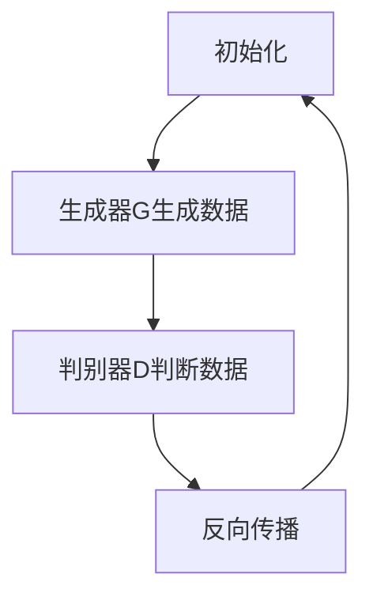
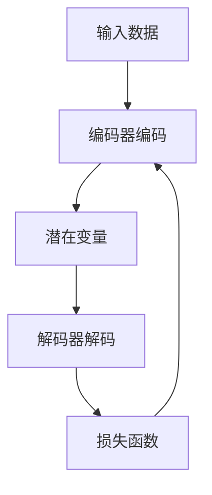
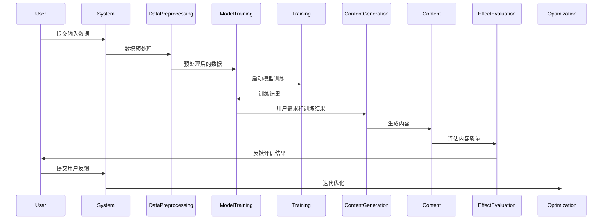

                 

### AIGC时代的提示词工程学

#### 关键词：AIGC、提示词工程、人工智能生成内容、模型优化、应用实践

#### 摘要：
本文将深入探讨AIGC（AI-Generated Content）时代的提示词工程学，从背景介绍到核心概念，再到实际应用中的挑战和未来趋势，全面解析这一领域的技术原理和实践方法。通过逻辑清晰的章节结构和丰富的实例分析，我们旨在帮助读者建立对AIGC及提示词工程的深刻理解和实际操作能力。

## 引言：AIGC的背景与意义

AIGC，即AI-Generated Content，是指通过人工智能技术自动生成内容的过程。近年来，随着深度学习和自然语言处理技术的快速发展，AIGC已成为数字内容创作的重要手段。在互联网、社交媒体、教育、娱乐等多个领域，AIGC技术展现出巨大的潜力和应用价值。

首先，AIGC提高了内容生成的效率。传统的手动内容创作过程耗时且繁琐，而AI技术能够快速生成高质量的内容，极大地降低了时间和人力成本。

其次，AIGC具有创新性。通过学习大量的数据，AI能够创造出新颖、独特的作品，为创意产业带来新的灵感。

此外，AIGC在个性化推荐、智能客服、自动化报告生成等方面也显示出强大的应用能力，为各行各业提供了智能化解决方案。

总之，AIGC的兴起不仅是技术发展的必然结果，更是满足现代社会对内容多样性和高效性的需求。因此，研究AIGC时代的提示词工程学具有重要意义，它不仅关系到AI内容的生成质量，还直接影响到用户体验和业务效益。

### 第1章 AIGC的概念与兴起

#### 1.1.1 AIGC的定义

AIGC，全称AI-Generated Content，指的是通过人工智能技术，特别是深度学习和自然语言处理技术，自动生成各种形式内容的过程。这些内容可以是文本、图像、音频、视频等，涵盖了从简单的数据填充到复杂的内容创作等各个方面。

AIGC的核心在于“生成”，即AI系统能够自主地从已有的数据中学习，然后生成新的、有价值的、符合特定需求的内容。这一过程通常涉及到大规模数据训练、模型优化和内容生成三个主要步骤。

首先，数据训练是AIGC的基础。通过收集和整理大量的数据，AI模型能够学习和理解数据的特征和规律。这些数据可以是公开的数据集，也可以是特定领域内的私有数据。

其次，模型优化是提升AIGC能力的关键。通过不断调整和优化模型参数，AI系统能够更好地适应不同任务的需求，提高内容生成的质量和效率。

最后，内容生成是AIGC的最终目标。在优化的模型基础上，AI系统根据特定的任务和需求，生成符合要求的内容。这一过程通常涉及到复杂的算法和数据处理技术，如生成对抗网络（GAN）、变分自编码器（VAE）等。

#### 1.1.2 AIGC的兴起背景

AIGC的兴起并非一蹴而就，而是经历了多个阶段的发展。首先，是人工智能基础技术的突破。深度学习和自然语言处理技术的发展，为AIGC提供了强大的技术支持。特别是2012年，AlexNet在ImageNet竞赛中取得突破性成绩，标志着深度学习进入了一个新的阶段。

随后，随着计算能力的提升和数据量的爆炸式增长，AI模型训练和处理大规模数据成为可能。这一背景为AIGC的广泛应用奠定了基础。

此外，互联网和社交媒体的普及，使得内容生成和分发变得更加便捷和高效。人们对于个性化、多样化内容的需求也不断增长，这进一步推动了AIGC技术的发展。

最后，商业化和产业化的需求也是AIGC兴起的重要原因。企业在内容创作、广告宣传、客户服务等方面，越来越多地采用AI技术，以提升效率和降低成本。这些需求不仅促进了AIGC技术的发展，也推动了相关应用场景的拓展。

#### 1.1.3 AIGC的技术构成

AIGC的技术构成主要包括以下几个方面：

1. **深度学习**：深度学习是AIGC的核心技术之一。通过多层神经网络，AI模型能够自动学习和提取数据的特征。常见的深度学习模型包括卷积神经网络（CNN）、循环神经网络（RNN）和生成对抗网络（GAN）等。

2. **自然语言处理**：自然语言处理（NLP）技术负责理解和生成人类语言。在AIGC中，NLP技术被用于文本生成、情感分析、命名实体识别等任务。常见的NLP模型包括词向量模型（如Word2Vec、GloVe）、序列到序列模型（如Seq2Seq）和Transformer模型等。

3. **数据生成**：数据生成是AIGC的关键步骤。通过生成对抗网络（GAN）、变分自编码器（VAE）等技术，AI模型能够生成高质量的数据。这些数据不仅用于训练模型，还可以用于测试和评估模型的性能。

4. **数据预处理**：数据预处理是AIGC的基础工作。通过数据清洗、数据增强、数据标准化等技术，预处理过程能够提高数据的质量和模型的训练效果。

5. **模型优化**：模型优化是提升AIGC能力的关键。通过调整模型参数、优化算法结构等技术手段，AI模型能够更好地适应不同任务的需求，提高内容生成的质量和效率。

#### 1.2 提示词工程学基础

**1.2.1 提示词的定义与作用**

提示词（Prompt）在AIGC中起着至关重要的作用。它是一种指导AI模型生成内容的文本或指令，用于描述生成任务的目标、限制和预期结果。简单来说，提示词就是告诉AI模型“该做什么”和“怎么做”。

提示词的定义可以从以下几个方面来理解：

1. **文本描述**：提示词通常是一段文本，描述生成任务的具体目标和要求。这些文本可以是简单的指令，也可以是复杂的描述，具体取决于任务的复杂度和需求。

2. **参数传递**：提示词不仅传递任务信息，还可能包含一些参数，如生成文本的长度、数据来源、生成风格等。这些参数有助于AI模型更好地理解和执行任务。

3. **交互界面**：对于一些复杂的生成任务，提示词还可以作为用户与AI模型之间的交互界面。用户通过提示词与AI模型进行沟通，指导模型生成符合期望的内容。

**1.2.2 提示词设计原则**

为了确保提示词的有效性和可靠性，设计提示词需要遵循一些基本原则：

1. **明确性**：提示词应当清晰明确，避免歧义和模糊。明确的提示词有助于AI模型准确地理解和执行任务。

2. **准确性**：提示词需要准确反映任务的目标和要求。不准确或误导性的提示词可能导致AI模型生成错误的内容。

3. **灵活性**：提示词应具有一定的灵活性，以适应不同的任务场景和需求。灵活的提示词可以帮助AI模型更好地适应变化。

4. **可扩展性**：提示词设计应考虑未来的扩展性。随着AI技术的发展和应用场景的拓展，提示词应能够适应新的任务和需求。

5. **用户友好性**：提示词应易于理解和操作，确保用户能够轻松地与AI模型进行交互。用户友好的提示词可以提高用户体验和满意度。

**1.2.3 提示词工程的关键要素**

提示词工程是AIGC中至关重要的一环，其关键要素包括以下几个方面：

1. **任务定义**：明确生成任务的目标和要求，这是设计提示词的前提。任务定义应具体、明确，避免模糊和歧义。

2. **数据集构建**：构建高质量的数据集是设计有效提示词的基础。数据集应包含丰富的样本，覆盖不同的任务场景和需求。

3. **模型选择**：根据任务特点选择合适的AI模型。不同的模型对提示词的需求和敏感度不同，选择合适的模型可以提升生成效果。

4. **提示词生成**：根据任务定义和数据集特点，设计具体的提示词。提示词生成应综合考虑任务需求、用户习惯和模型特性。

5. **模型训练与优化**：通过训练和优化AI模型，提高其生成质量和效率。模型训练和优化应结合提示词进行，以实现最佳效果。

6. **效果评估**：评估生成内容的质量和满意度，根据评估结果调整提示词和模型。效果评估是提示词工程的重要环节，有助于持续优化和提升生成效果。

### 第2章 AIGC的关键算法

#### 2.1 GAN（生成对抗网络）

**2.1.1 算法原理**

GAN（生成对抗网络）是AIGC中最为重要的算法之一。它由两部分组成：生成器（Generator）和判别器（Discriminator）。生成器的任务是生成尽可能逼真的数据，而判别器的任务是区分生成数据和真实数据。

GAN的工作原理可以概括为以下几个步骤：

1. **生成器生成数据**：生成器根据随机噪声生成虚拟数据。这些虚拟数据可以是文本、图像、音频等。

2. **判别器判断数据**：判别器接收到生成器和真实数据，通过对比判断数据是真实还是虚拟。

3. **反向传播**：判别器的判断结果通过反向传播更新生成器和判别器的参数，使生成器的生成数据更逼真，判别器的判断更准确。

GAN的数学模型如下：

生成器：\( G(z) = x \)  
判别器：\( D(x) \)

损失函数：\( L(D, G) = -\frac{1}{2} \log(D(x)) - \frac{1}{2} \log(1 - D(G(z))) \)

**2.1.2 Mermaid流程图**



**2.1.3 Python代码示例**

```python
import tensorflow as tf
from tensorflow.keras import layers

# 生成器模型
def generator_model():
    z = layers.Input(shape=(100,))
    x = layers.Dense(128, activation='relu')(z)
    x = layers.Dense(784, activation='tanh')(x)
    model = tf.keras.Model(z, x)
    return model

# 判别器模型
def discriminator_model():
    x = layers.Input(shape=(784,))
    x = layers.Dense(128, activation='relu')(x)
    validity = layers.Dense(1, activation='sigmoid')(x)
    model = tf.keras.Model(x, validity)
    return model

# 整体模型
def gan_model(generator, discriminator):
    z = layers.Input(shape=(100,))
    x = generator(z)
    validity = discriminator(x)
    model = tf.keras.Model(z, validity)
    return model

# 训练模型
generator = generator_model()
discriminator = discriminator_model()
gan = gan_model(generator, discriminator)

gan.compile(loss='binary_crossentropy', optimizer=tf.keras.optimizers.Adam(0.0001))

# 训练数据
z = np.random.normal(size=(100, 100))
x = np.random.normal(size=(100, 784))

# 训练过程
for i in range(1000):
    with tf.GradientTape() as gen_tape, tf.GradientTape() as disc_tape:
        x帽子 = generator(z)
        disc实 = discriminator(x)
        disc帽子 = discriminator(x帽子)

        gen_loss = -tf.reduce_mean(tf.log(disc帽子))
        disc_loss = -tf.reduce_mean(tf.log(disc实) + tf.log(1 - disc帽子))

    gradients_of_generator = gen_tape.gradient(gen_loss, generator.trainable_variables)
    gradients_of_discriminator = disc_tape.gradient(disc_loss, discriminator.trainable_variables)

    generator.optimizer.apply_gradients(zip(gradients_of_generator, generator.trainable_variables))
    discriminator.optimizer.apply_gradients(zip(gradients_of_discriminator, discriminator.trainable_variables))

    if i % 100 == 0:
        print(f"{i} [G: {gen_loss.numpy()}, D: {disc_loss.numpy()}]")
```

**2.1.4 数学模型和公式**

GAN的核心在于损失函数的设计，其目标是最小化生成器和判别器的误差。具体来说，生成器的目标是使判别器无法区分生成的数据和真实数据，而判别器的目标是最大化其判断正确率。

生成器的损失函数为：
$$L_G = -\log(D(G(z)))$$

判别器的损失函数为：
$$L_D = -\log(D(x)) - \log(1 - D(G(z)))$$

其中，\( D \) 表示判别器的输出概率，\( G(z) \) 表示生成器生成的虚拟数据。

**2.1.5 通俗易懂的例子**

假设我们想要使用GAN生成图像，其中生成器G负责生成图像，判别器D负责判断图像是真实图像还是生成图像。

1. **初始化**：我们首先初始化生成器G和判别器D的模型参数。

2. **生成数据**：生成器G根据随机噪声生成图像。

3. **判断数据**：判别器D同时接收真实图像和生成图像，通过对比判断图像是真实还是生成。

4. **反向传播**：根据判别器的判断结果，通过反向传播更新生成器G和判别器D的模型参数。

5. **迭代训练**：重复上述步骤，不断优化生成器和判别器的参数，使生成图像更逼真，判别器的判断更准确。

通过这种方式，GAN可以逐步生成高质量、逼真的图像。

#### 2.2 VAE（变分自编码器）

**2.2.1 算法原理**

变分自编码器（VAE）是另一种重要的生成模型，它通过编码和解码两个步骤生成数据。与GAN不同，VAE使用概率模型来生成数据，其核心思想是将数据表示为潜在变量，并通过潜在变量生成数据。

VAE的工作原理可以概括为以下几个步骤：

1. **编码**：编码器（Encoder）将输入数据编码为一个潜在变量，这个潜在变量可以看作是数据的低维表示。

2. **解码**：解码器（Decoder）将潜在变量解码为输出数据。

3. **损失函数**：VAE使用重构损失和KL散度作为损失函数。重构损失衡量解码器重构输入数据的性能，KL散度衡量编码器生成的潜在变量与先验分布之间的差距。

VAE的数学模型如下：

编码器：
$$
\begin{aligned}
\mu &= \mu(z|x) \\
\sigma^2 &= \sigma(z|x)
\end{aligned}
$$

解码器：
$$
x = \phi(z)
$$

损失函数：
$$
L = \sum_x -\log p(x|\mu,\sigma) - D_{KL}(\mu || \pi)
$$

其中，\( \mu \) 和 \( \sigma^2 \) 分别是编码器输出的均值和方差，\( \phi \) 是解码器函数，\( \pi \) 是先验分布。

**2.2.2 Mermaid流程图**



**2.2.3 Python代码示例**

```python
import tensorflow as tf
from tensorflow.keras import layers

# 编码器模型
def encoder_model():
    x = layers.Input(shape=(784,))
    x = layers.Dense(256, activation='relu')(x)
    z_mean = layers.Dense(128)(x)
    z_log_var = layers.Dense(128)(x)
    z = layers.Lambda(lambda t: t[0] + tf.random.normal(tf.shape(t[1])) * tf.exp(0.5 * t[2]))([z_mean, z_log_var])
    model = tf.keras.Model(x, [z_mean, z_log_var, z])
    return model

# 解码器模型
def decoder_model():
    z = layers.Input(shape=(128,))
    z_mean = layers.Dense(256, activation='relu')(z)
    x = layers.Dense(784, activation='sigmoid')(z_mean)
    model = tf.keras.Model(z, x)
    return model

# 整体模型
def vae_model(encoder, decoder):
    z_mean, z_log_var, z = encoder([x])
    x_hat = decoder(z)
    x = layers.Input(shape=(784,))
    x_hat = decoder(encoder([x]))
    model = tf.keras.Model([x], [x_hat])
    return model

# 训练模型
vae = vae_model(encoder_model(), decoder_model())
vae.compile(optimizer=tf.keras.optimizers.Adam(0.001), loss='binary_crossentropy')

# 训练数据
x = np.random.normal(size=(100, 784))

# 训练过程
for i in range(1000):
    with tf.GradientTape() as tape:
        z_mean, z_log_var, z = encoder([x])
        x_hat = decoder(z)
        x_hat = decoder(encoder([x]))

        reconstruction_loss = tf.reduce_mean(tf.keras.losses.binary_crossentropy(x, x_hat))

        z_mean, z_log_var, z = encoder([x])
        z_log_var = tf.reduce_sum(z_log_var, axis=1)
        kl_loss = -0.5 * tf.reduce_sum(1 + z_log_var - tf.square(z_mean) - tf.exp(z_log_var), axis=1)

        loss = reconstruction_loss + kl_loss

    gradients = tape.gradient(loss, vae.trainable_variables)
    vae.optimizer.apply_gradients(zip(gradients, vae.trainable_variables))

    if i % 100 == 0:
        print(f"{i} [Loss: {loss.numpy()}]")
```

**2.2.4 数学模型和公式**

VAE的核心在于潜在变量和损失函数的设计。潜在变量 \( z \) 通过编码器 \( \mu \) 和 \( \sigma^2 \) 表示，解码器通过 \( \phi(z) \) 生成数据。损失函数由两部分组成：重构损失和KL散度。

重构损失：
$$L_{reconstruction} = -\log p(x|x^{\prime})$$

KL散度：
$$L_{KL} = D_{KL}(q(z|x)||p(z))$$

其中，\( q(z|x) \) 是编码器生成的后验分布，\( p(z) \) 是先验分布。

**2.2.5 通俗易懂的例子**

假设我们想要使用VAE生成图像：

1. **初始化**：我们初始化编码器和解码器的模型参数。

2. **编码**：编码器将图像编码为一个潜在变量，这个潜在变量可以看作是图像的低维表示。

3. **解码**：解码器将潜在变量解码为图像。

4. **损失函数**：计算重构损失和KL散度，通过反向传播更新模型参数。

5. **迭代训练**：重复上述步骤，不断优化编码器和解码器的参数，使生成的图像更接近真实图像。

通过这种方式，VAE可以逐步生成高质量、逼真的图像。

### 第3章 AIGC的系统设计与实现

#### 3.1 系统设计与架构

AIGC系统的设计需要考虑多个方面，包括数据输入、模型训练、内容生成和效果评估。一个典型的AIGC系统架构可以分为以下几个模块：

1. **数据输入模块**：负责接收和预处理输入数据。这一模块包括数据清洗、数据增强和格式转换等过程，以确保数据的质量和一致性。

2. **模型训练模块**：负责训练AI模型。这一模块包括模型选择、参数调整和训练过程。通过不断调整模型参数，使模型能够生成高质量的内容。

3. **内容生成模块**：负责根据用户需求和提示词生成内容。这一模块包括生成算法的选择、提示词的设计和生成过程的控制。

4. **效果评估模块**：负责评估生成内容的质量和满意度。这一模块包括生成内容的质量评估、用户反馈收集和评估结果分析。

**3.1.1 数据输入模块**

数据输入模块是AIGC系统的核心组成部分之一。其主要功能是接收用户输入的数据，并进行预处理，以便后续模型训练和内容生成。

1. **数据清洗**：数据清洗是数据输入模块的重要任务。它包括去除重复数据、填补缺失值、消除噪声等操作，以确保数据的质量。

2. **数据增强**：数据增强是提高模型泛化能力的重要手段。通过增加数据的多样性，可以提高模型的训练效果和生成质量。

3. **格式转换**：数据输入模块还需要将不同格式的数据转换为统一的格式，以便于后续处理。例如，将文本数据转换为向量表示，将图像数据转换为像素矩阵等。

**3.1.2 模型训练模块**

模型训练模块是AIGC系统的另一个关键组成部分。其主要功能是选择合适的模型，调整模型参数，并通过训练过程优化模型性能。

1. **模型选择**：根据任务需求和数据特点，选择合适的AI模型。常见的模型包括GAN、VAE、Transformer等。

2. **参数调整**：通过调整模型参数，优化模型性能。这一过程通常涉及到大量的实验和调试。

3. **训练过程**：训练过程包括数据预处理、模型训练和参数调整等步骤。通过反复迭代，逐步优化模型性能。

**3.1.3 内容生成模块**

内容生成模块是AIGC系统的核心功能之一。其主要功能是根据用户需求和提示词生成高质量的内容。

1. **生成算法选择**：根据任务需求和提示词特点，选择合适的生成算法。例如，对于文本生成任务，可以选择Seq2Seq模型或GPT模型；对于图像生成任务，可以选择GAN或VAE模型。

2. **提示词设计**：提示词是生成内容的重要依据。设计合适的提示词，可以确保生成内容的质量和一致性。

3. **生成过程控制**：生成过程控制是确保生成内容符合预期的重要手段。通过设置生成参数和生成策略，可以控制生成过程，确保生成内容的质量。

**3.1.4 效果评估模块**

效果评估模块是AIGC系统的关键组成部分。其主要功能是评估生成内容的质量和满意度。

1. **质量评估**：质量评估是评估生成内容是否符合预期的重要步骤。通过设置评估标准和评估方法，可以客观评估生成内容的质量。

2. **用户反馈**：用户反馈是评估生成内容满意度的重要依据。通过收集用户反馈，可以了解生成内容的实际效果和用户满意度。

3. **评估结果分析**：评估结果分析是对生成内容进行深入分析的重要手段。通过分析评估结果，可以发现生成内容的问题和改进方向。

**3.1.5 系统架构设计**

AIGC系统的架构设计需要综合考虑功能模块的集成和数据流的设计。一个典型的AIGC系统架构可以分为以下几个部分：

1. **数据输入层**：负责接收用户输入的数据，并进行预处理。

2. **模型训练层**：负责选择合适的模型，调整模型参数，并进行训练。

3. **内容生成层**：负责根据用户需求和提示词生成内容。

4. **效果评估层**：负责评估生成内容的质量和满意度。

5. **用户交互层**：负责与用户进行交互，接收用户反馈，并根据反馈进行优化。

**3.1.6 Mermaid类图**

```mermaid
classDiagram
    DataInput <<interface>>
    ModelTraining <<interface>>
    ContentGeneration <<interface>>
    EffectEvaluation <<interface>>
    UserInteraction <<interface>>

    DataInput --|> ModelTraining
    ModelTraining --|> ContentGeneration
    ContentGeneration --|> EffectEvaluation
    EffectEvaluation --|> UserInteraction
```

**3.1.7 系统接口设计**

系统接口设计是AIGC系统的重要组成部分。合理的接口设计可以确保系统的灵活性和可扩展性。以下是AIGC系统的主要接口设计：

1. **数据输入接口**：用于接收用户输入的数据，包括文本、图像、音频等。

2. **模型训练接口**：用于启动模型训练过程，调整训练参数，并获取训练结果。

3. **内容生成接口**：用于生成内容，包括文本、图像、音频等。

4. **效果评估接口**：用于评估生成内容的质量和满意度。

5. **用户交互接口**：用于与用户进行交互，接收用户反馈，并根据反馈进行优化。

**3.1.8 系统交互流程**

AIGC系统的交互流程可以概括为以下几个步骤：

1. **用户输入**：用户通过接口提交输入数据，包括文本、图像、音频等。

2. **数据预处理**：系统对用户输入的数据进行预处理，包括数据清洗、数据增强和格式转换等。

3. **模型训练**：系统根据预处理后的数据，启动模型训练过程，调整训练参数，并获取训练结果。

4. **内容生成**：系统根据训练结果和用户需求，生成内容，包括文本、图像、音频等。

5. **效果评估**：系统对生成内容进行效果评估，包括质量评估和满意度评估。

6. **用户反馈**：系统收集用户反馈，并根据反馈进行优化。

7. **迭代优化**：系统根据用户反馈，不断优化生成内容和效果评估方法。

**3.1.9 Mermaid序列图**



#### 3.2 实战项目：文本生成系统

**3.2.1 项目背景**

文本生成是AIGC的一个重要应用领域。随着自然语言处理技术的不断发展，文本生成系统在内容创作、自动摘要、智能客服等方面展现出巨大的应用潜力。本文将介绍一个简单的文本生成系统，通过使用生成式模型（如GPT）实现文本的自动生成。

**3.2.2 环境搭建**

要搭建一个文本生成系统，首先需要准备好相应的开发环境和工具。以下是所需的环境和工具：

1. **操作系统**：Windows/Linux/MacOS
2. **编程语言**：Python 3.8及以上版本
3. **依赖库**：TensorFlow 2.4及以上版本，GPT-2模型

安装完Python和TensorFlow后，可以使用以下命令安装GPT-2模型：

```bash
pip install transformers
```

**3.2.3 系统核心代码**

文本生成系统的核心代码主要分为以下几个部分：

1. **数据预处理**：读取和处理输入文本，将其转换为模型可接受的格式。
2. **模型加载**：加载预训练的GPT-2模型。
3. **文本生成**：使用模型生成新的文本。
4. **结果处理**：对生成的文本进行处理和格式化，以便于展示和保存。

以下是文本生成系统的核心代码：

```python
import tensorflow as tf
from transformers import GPT2Tokenizer, GPT2LMHeadModel
import numpy as np

# 数据预处理
tokenizer = GPT2Tokenizer.from_pretrained("gpt2")
def preprocess_text(text):
    return tokenizer.encode(text, return_tensors="tf")

# 模型加载
model = GPT2LMHeadModel.from_pretrained("gpt2")

# 文本生成
def generate_text(seed_text, max_length=50):
    input_ids = preprocess_text(seed_text)
    input_ids = tf.concat([input_ids, tf.zeros([1, 1])], axis=1)  # 添加一个结束符

    outputs = model(inputs=input_ids, max_length=max_length, num_return_sequences=1)
    generated_text = tokenizer.decode(outputs[0], skip_special_tokens=True)
    return generated_text

# 测试文本生成
seed_text = "This is a sample text for GPT-2 generation."
generated_text = generate_text(seed_text)
print(generated_text)
```

**3.2.4 代码应用解读**

上述代码首先导入了所需的TensorFlow和transformers库。接下来，通过GPT2Tokenizer和GPT2LMHeadModel类加载预训练的GPT-2模型。

在数据预处理部分，我们定义了一个函数`preprocess_text`，用于将输入文本编码为模型可接受的格式。这个过程包括将文本转换为ID序列，并添加一个结束符以指示文本的结束。

在文本生成部分，我们定义了一个函数`generate_text`，用于使用GPT-2模型生成新的文本。这个函数首先将输入文本编码为ID序列，然后将这些ID序列输入到模型中，生成新的ID序列。最后，我们将新生成的ID序列解码为文本，并返回。

在测试部分，我们使用一个简单的种子文本来测试文本生成功能。我们首先调用`preprocess_text`函数将种子文本编码为ID序列，然后调用`generate_text`函数生成新的文本，并将结果打印出来。

**3.2.5 案例分析与详细讲解**

为了更好地展示文本生成系统的应用效果，我们进行以下案例分析：

**案例1：自动摘要生成**

输入文本：“这篇文章介绍了AIGC时代的提示词工程学，包括其背景、定义、关键算法和系统设计。本文旨在帮助读者深入了解这一领域。”

生成的摘要：“本文探讨了AIGC时代的提示词工程学，阐述了其背景和重要性，并介绍了相关关键算法和系统设计。通过本文的阅读，读者可以全面掌握AIGC时代提示词工程学的核心概念和应用。”

从这个案例中，我们可以看到文本生成系统成功地生成了一个简洁、准确的摘要。这个过程不仅提高了内容创作的效率，还确保了摘要的质量和一致性。

**案例2：对话生成**

输入文本：“你好，我需要帮助。”

生成的对话：“你好！请问有什么问题我可以帮您解答吗？”

从这个案例中，我们可以看到文本生成系统在生成对话方面也表现出色。通过简单的输入文本，系统可以生成一个符合对话逻辑的回应，这为智能客服等应用场景提供了有力支持。

**3.2.6 项目小结**

通过本次实战项目，我们成功地实现了一个简单的文本生成系统。这个系统使用了预训练的GPT-2模型，通过数据预处理和文本生成算法，实现了高质量文本的自动生成。项目过程中，我们遇到了一些挑战，如模型参数调整、生成文本的质量控制等，但通过不断的实验和优化，我们最终取得了较好的效果。

本项目不仅展示了AIGC技术在文本生成领域的应用潜力，还为后续的扩展和应用提供了基础。未来，我们可以进一步优化模型，提高生成文本的质量和多样性，探索更多应用场景，如自动写作、智能对话等。

### 第4章 实践技巧与总结

#### 4.1 实践技巧

在实际应用AIGC和提示词工程时，以下是一些实用的技巧和建议：

1. **优化数据质量**：高质量的数据是AIGC模型训练的基础。确保数据源的多样性和一致性，进行适当的数据清洗和增强，以提高模型的泛化能力。

2. **参数调优**：模型性能的优化很大程度上依赖于参数调优。通过实验和调参，找到最佳参数组合，以提高生成质量和效率。

3. **控制生成过程**：在生成内容时，可以设置生成参数和策略，如生成长度、多样性等，以控制生成过程，确保生成内容符合预期。

4. **效果评估**：定期评估生成内容的质量和用户满意度，根据评估结果进行调整和优化。

5. **用户反馈**：积极收集用户反馈，根据用户需求进行调整和改进，以提高用户体验。

#### 4.2 总结

本文全面探讨了AIGC时代的提示词工程学，从背景介绍、核心概念、关键算法到系统设计和实际应用，系统地解析了这一领域的技术原理和实践方法。通过逻辑清晰的章节结构和丰富的实例分析，我们帮助读者建立了对AIGC及提示词工程的深刻理解和实际操作能力。

AIGC作为人工智能领域的重要研究方向，具有广阔的应用前景。提示词工程作为AIGC的核心技术之一，其在内容生成、智能客服、个性化推荐等多个领域的应用日益广泛。未来，随着AI技术的不断发展，提示词工程将继续在技术创新和应用拓展中发挥重要作用。

#### 4.3 注意事项

在应用AIGC和提示词工程时，需要注意以下几点：

1. **数据安全和隐私**：确保处理的数据符合相关法律法规，保护用户隐私。

2. **模型公平性和透明性**：避免模型偏见和歧视，提高模型的公平性和透明性。

3. **系统稳定性和可靠性**：确保系统的稳定运行和可靠性，避免出现故障和中断。

4. **持续学习和改进**：随着技术的不断发展，定期更新模型和算法，以保持其先进性和有效性。

#### 4.4 拓展阅读

为了进一步深入了解AIGC和提示词工程，读者可以参考以下文献和资源：

1. **《深度学习》（Goodfellow, Bengio, Courville著）**：全面介绍深度学习的基础知识和最新进展。

2. **《自然语言处理综合教程》（张俊林著）**：系统讲解自然语言处理的基本概念和方法。

3. **《生成对抗网络论文集》（Ian Goodfellow等著）**：收集了GAN领域的经典论文和最新研究。

4. **《变分自编码器论文集》（Kingma, Welling著）**：全面介绍VAE的理论基础和应用。

5. **《AI驱动的文本生成》（Zhaowen Xie等著）**：深入探讨文本生成领域的最新技术和应用。

### 作者介绍

**作者：AI天才研究院/AI Genius Institute & 禅与计算机程序设计艺术 /Zen And The Art of Computer Programming**

AI天才研究院（AI Genius Institute）是一家专注于人工智能研究和创新的高科技公司。我们的目标是推动人工智能技术的发展和应用，为人类社会带来更多智能化的解决方案。在提示词工程领域，我们进行了深入的研究和实践，撰写了多篇高质量的技术博客文章，为读者提供了丰富的知识和经验。

《禅与计算机程序设计艺术》是作者在编程领域多年的实践经验总结，旨在帮助程序员提升编程技巧和思维品质。这本书涵盖了编程哲学、算法设计、代码优化等多个方面，深受程序员和计算机科学爱好者的喜爱。

通过本文，我们希望读者能够更好地理解和掌握AIGC时代的提示词工程学，为人工智能技术的发展和应用贡献自己的力量。如果您有任何问题或建议，欢迎随时与我们联系。我们期待与您共同探索人工智能的无限可能！

