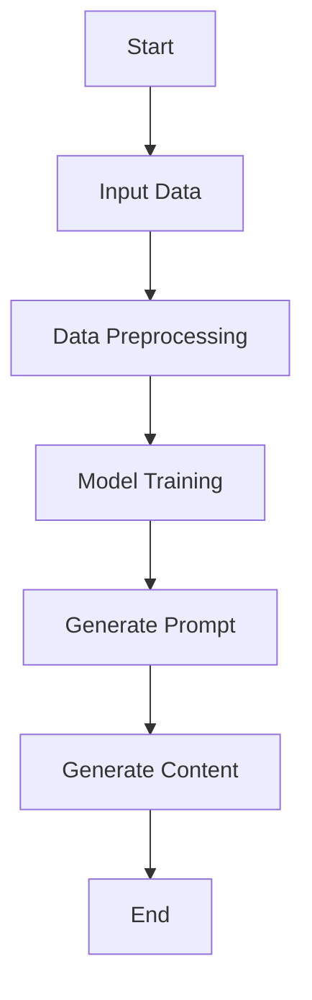
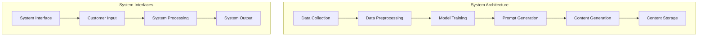
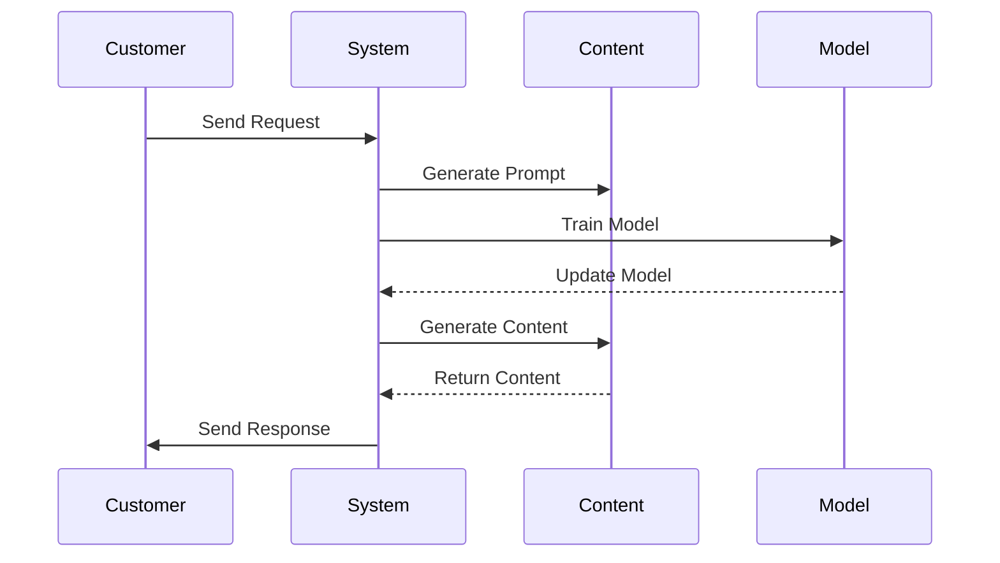

                 

# AIGC时代的提示词工程：挑战与解决之道

## 关键词：AIGC、提示词工程、挑战、解决之道、技术趋势

## 摘要：

随着人工智能生成内容（AIGC）技术的快速发展，提示词工程成为其核心组件之一。本文深入探讨了AIGC时代的背景与挑战，对提示词工程的核心概念进行了梳理，分析了其面临的挑战，并提出了相应的解决之道。通过实际案例分析，本文展示了提示词工程在智能客服系统、智能写作辅助工具和智能教育系统中的应用，最后对未来的发展趋势进行了展望。本文旨在为从事AIGC技术研究和实践的专业人士提供有价值的参考和指导。

## 第一部分：AIGC时代的背景与挑战

### 第1章：AIGC概述

#### 1.1.1 AIGC的定义与特点

人工智能生成内容（AIGC）是一种利用人工智能技术自动生成文本、图像、音频等多种类型内容的方法。与传统的生成内容方法相比，AIGC具有以下几个特点：

1. **数据驱动**：AIGC依赖于大规模的数据集进行训练，通过数据驱动的方法实现内容的生成。
2. **高效性**：AIGC能够在短时间内生成大量内容，提高了内容生产效率。
3. **多样性**：AIGC能够根据不同的输入条件生成具有多样性的内容，满足个性化需求。
4. **灵活性**：AIGC可以根据用户的需求和环境的变化，动态调整生成的内容。

#### 1.1.2 AIGC的技术架构

AIGC的技术架构主要包括以下几个关键组件：

1. **数据采集与处理**：收集并处理大量数据，为模型训练提供高质量的数据源。
2. **生成模型**：使用生成对抗网络（GAN）、变分自编码器（VAE）等生成模型，实现内容的自动生成。
3. **优化算法**：通过优化算法不断调整模型参数，提高生成内容的质量和多样性。
4. **应用接口**：提供方便的应用接口，方便用户使用AIGC技术生成内容。

#### 1.1.3 AIGC的应用领域

AIGC技术已经在多个领域得到了广泛应用，主要包括：

1. **内容创作**：如文章写作、音乐创作、图像生成等。
2. **智能客服**：通过生成个性化回答，提高客服系统的响应速度和服务质量。
3. **虚拟现实**：生成虚拟场景、角色和行为，提升虚拟现实体验。
4. **教育**：生成教学资源，如课程内容、习题解答等，提高教育效果。

### 第2章：提示词工程的核心概念

#### 2.1.1 提示词的定义与作用

提示词（Prompt）是指在生成模型中用于指导生成内容的关键信息。提示词的作用主要包括：

1. **引导生成方向**：提示词可以为生成模型提供明确的生成目标，引导模型生成符合要求的内容。
2. **增强内容质量**：通过设计合理的提示词，可以优化生成内容的质量和多样性。
3. **实现个性化**：提示词可以根据用户的需求和偏好，实现内容的个性化生成。

#### 2.1.2 提示词的类型与特点

提示词可以根据用途和形式进行分类，主要包括以下几种类型：

1. **主题型**：以主题为引导，生成相关内容，如文章、音乐等。
2. **任务型**：以具体任务为引导，生成符合任务要求的内容，如智能客服回答。
3. **风格型**：以特定风格为引导，生成具有特定风格的内容，如艺术作品。

#### 2.1.3 提示词的设计原则

提示词的设计需要遵循以下原则：

1. **清晰明确**：提示词应简洁明了，避免歧义，便于模型理解。
2. **针对性**：根据生成内容的类型和目标，设计具有针对性的提示词。
3. **多样性**：设计多种类型的提示词，以丰富生成内容的表现形式。
4. **适应性**：提示词应能够适应不同场景和用户需求，实现灵活调整。

### 第3章：提示词工程面临的挑战

#### 3.1.1 数据质量与多样性挑战

提示词工程面临的一个主要挑战是数据质量与多样性的问题。高质量、多样性的数据是生成高质量内容的基础。然而，在实际应用中，数据质量常常受到以下因素的影响：

1. **数据噪声**：数据中存在噪声和异常值，会影响提示词的生成效果。
2. **数据缺失**：数据不完整，导致模型无法准确理解生成目标。
3. **数据同质性**：数据过于同质，生成内容缺乏多样性。

为了解决数据质量与多样性问题，可以采取以下措施：

1. **数据清洗**：对数据进行预处理，去除噪声和异常值。
2. **数据增强**：通过数据扩展、数据变换等方法，增加数据的多样性。
3. **数据融合**：结合多个数据源，提高数据的综合质量。

#### 3.1.2 提示词生成效率与质量平衡

在提示词工程中，生成效率与生成质量常常是一对矛盾。为了在保证生成质量的同时提高生成效率，可以采取以下策略：

1. **模型优化**：通过模型调整和优化，提高生成速度。
2. **并行计算**：利用并行计算技术，加速模型训练和生成过程。
3. **任务调度**：合理安排生成任务，避免资源冲突，提高整体效率。

#### 3.1.3 提示词的个性化和泛化挑战

提示词的个性化和泛化是另一个重要挑战。个性化提示词可以根据用户需求生成符合个人喜好的内容，而泛化提示词可以生成适用于多种场景的内容。在实际应用中，可以采取以下策略：

1. **用户画像**：通过用户画像，了解用户需求和偏好，生成个性化提示词。
2. **场景识别**：通过场景识别技术，确定当前应用场景，生成适用于特定场景的提示词。
3. **模型泛化**：通过数据扩展和模型调整，提高模型的泛化能力。

## 第二部分：实践篇

### 第5章：提示词工程应用案例分析

#### 5.1.1 案例一：智能客服系统

智能客服系统通过提示词工程，实现了对用户问题的自动回答。以下是一个具体的案例：

1. **数据采集与处理**：收集用户问题和客服回答，进行预处理，去除噪声和异常值。
2. **模型训练**：使用预处理后的数据训练生成模型，如序列到序列（Seq2Seq）模型。
3. **提示词设计**：根据用户问题，设计针对性的提示词，如“请问您需要咨询什么问题？”。
4. **回答生成**：将用户问题作为输入，通过模型生成回答。

#### 5.1.2 案例二：智能写作辅助工具

智能写作辅助工具通过提示词工程，帮助用户生成文章内容。以下是一个具体的案例：

1. **数据采集与处理**：收集大量文章数据，进行预处理，去除噪声和异常值。
2. **模型训练**：使用预处理后的数据训练生成模型，如变分自编码器（VAE）。
3. **提示词设计**：根据文章类型和主题，设计针对性的提示词，如“请描述您的旅行经历”。
4. **内容生成**：将提示词作为输入，通过模型生成文章内容。

#### 5.1.3 案例三：智能教育系统

智能教育系统通过提示词工程，为学生提供个性化的学习资源和辅导。以下是一个具体的案例：

1. **数据采集与处理**：收集学生学习行为数据，进行预处理，去除噪声和异常值。
2. **模型训练**：使用预处理后的数据训练生成模型，如生成对抗网络（GAN）。
3. **提示词设计**：根据学生学习情况和课程要求，设计针对性的提示词，如“请列出您在本课程中遇到的问题”。
4. **学习资源生成**：将提示词作为输入，通过模型生成学习资源和辅导内容。

### 第6章：提示词工程实现与优化

#### 6.1.1 系统设计与实现

提示词工程系统的设计与实现包括以下几个关键步骤：

1. **需求分析**：明确系统功能需求，如数据采集、模型训练、提示词生成等。
2. **系统架构设计**：设计系统的整体架构，如数据处理模块、模型训练模块、提示词生成模块等。
3. **模块实现**：根据系统架构，实现各个模块的功能。

#### 6.1.2 系统性能优化

为了提高提示词工程系统的性能，可以采取以下优化措施：

1. **模型优化**：通过模型调整和优化，提高生成质量和速度。
2. **并行计算**：利用并行计算技术，加速模型训练和生成过程。
3. **任务调度**：合理安排生成任务，避免资源冲突，提高整体效率。

#### 6.1.3 系统安全性保障

在提示词工程系统中，安全性是一个重要问题。为了保障系统的安全性，可以采取以下措施：

1. **数据加密**：对敏感数据进行加密，防止数据泄露。
2. **访问控制**：设置访问权限，确保只有授权用户可以访问系统。
3. **安全审计**：对系统进行安全审计，及时发现和修复安全漏洞。

### 第7章：提示词工程的未来发展趋势

#### 7.1.1 技术演进趋势

随着人工智能技术的不断发展，提示词工程也将朝着以下趋势演进：

1. **多模态生成**：结合多种模态（如文本、图像、音频）进行内容生成，提高生成内容的多样性和质量。
2. **知识驱动**：利用知识图谱等技术，为生成模型提供丰富的知识支持，提高生成内容的准确性和相关性。
3. **自动调整**：通过自动调整技术，实现提示词的动态调整，提高生成内容的个性化程度。

#### 7.1.2 应用场景拓展

提示词工程的应用场景将不断拓展，主要包括：

1. **智能娱乐**：如智能创作、虚拟现实等。
2. **智能医疗**：如智能诊断、药物研发等。
3. **智能工业**：如智能制造、智能检测等。

#### 7.1.3 面临的挑战与机遇

在提示词工程的发展过程中，将面临以下挑战和机遇：

1. **数据质量与多样性**：高质量、多样性的数据是生成高质量内容的基础，需要不断改进数据采集和处理技术。
2. **模型优化与泛化**：通过模型优化和泛化技术，提高生成质量和效率。
3. **应用创新**：积极探索新的应用场景，推动提示词工程在各个领域的应用。

### 第8章：总结与展望

#### 8.1.1 提示词工程的价值与意义

提示词工程作为AIGC技术的重要组成部分，具有以下价值和意义：

1. **提高内容生产效率**：通过自动生成内容，减少人力成本，提高生产效率。
2. **满足个性化需求**：通过个性化生成，满足用户多样化的需求。
3. **推动技术创新**：提示词工程的发展将推动人工智能技术的不断进步。

#### 8.1.2 未来研究方向与展望

未来，提示词工程的研究将朝着以下方向发展：

1. **多模态生成**：结合多种模态进行内容生成，提高生成内容的多样性和质量。
2. **知识驱动**：利用知识图谱等技术，为生成模型提供丰富的知识支持，提高生成内容的准确性和相关性。
3. **自动调整**：通过自动调整技术，实现提示词的动态调整，提高生成内容的个性化程度。

作者：AI天才研究院/AI Genius Institute & 禅与计算机程序设计艺术 /Zen And The Art of Computer Programming

## 附录

#### 附录A：核心概念原理

以下是一个关于核心概念原理的ER实体关系图架构的Mermaid流程图：

```mermaid
erDiagram
    User ||--|{ Prompt } : generates
    Prompt ||--|{ Content } : contains
    Content ||--|{ Metadata } : has
```

#### 附录B：算法原理讲解

以下是一个关于算法原理讲解的Mermaid流程图和Python源代码：



```python
# Python源代码
def generate_content(prompt):
    # 提示词处理
    processed_prompt = preprocess_prompt(prompt)

    # 模型生成内容
    content = model.generate_content(processed_prompt)

    # 后处理
    final_content = postprocess_content(content)

    return final_content

def preprocess_prompt(prompt):
    # 提示词预处理
    # ...
    return processed_prompt

def model.generate_content(prompt):
    # 模型生成内容
    # ...
    return content

def postprocess_content(content):
    # 内容后处理
    # ...
    return final_content
```

#### 附录C：系统分析与架构设计方案

以下是一个关于系统分析与架构设计方案的Mermaid类图、架构图和序列图：

```mermaid
classDiagram
    Customer <<class>> Customer
    System <<class>> System
    Content <<class>> Content
    Prompt <<class>> Prompt
    Metadata <<class>> Metadata
    Customer "uses" System : to interact
    System "manages" Prompt : to generate content
    System "manages" Content : to store generated content
    Content "has" Metadata : to describe content details

```





#### 附录D：项目实战

以下是一个关于项目实战的详细讲解：

1. **环境安装**：安装必要的软件和库，如Python、TensorFlow等。
2. **系统核心实现**：编写源代码，实现系统的主要功能，如数据预处理、模型训练、提示词生成等。
3. **代码应用解读与分析**：对核心代码进行解读和分析，解释代码实现原理。
4. **实际案例分析**：通过实际案例，展示系统的应用效果和优势。
5. **项目小结**：对项目进行总结，指出项目的优点和改进方向。

#### 附录E：最佳实践 tips、小结、注意事项、拓展阅读等内容

以下是一些最佳实践、小结、注意事项和拓展阅读的建议：

1. **最佳实践**：在设计和实现提示词工程时，遵循以下最佳实践：
   - 确保数据质量，进行数据清洗和处理。
   - 设计合理的提示词，提高生成内容的质量和多样性。
   - 优化模型参数，提高生成效率和准确性。
   - 定期更新和调整模型，适应新的应用场景。

2. **小结**：提示词工程在AIGC时代具有重要的地位和作用，通过提示词的设计和优化，可以实现高质量、个性化、多样化的内容生成。

3. **注意事项**：
   - 提示词的设计要简洁明了，避免歧义。
   - 数据质量和多样性是生成高质量内容的关键。
   - 注意系统的性能和安全问题，优化系统的运行效率和安全性。

4. **拓展阅读**：
   - [1] [标题：AIGC技术综述](链接)
   - [2] [标题：生成对抗网络（GAN）原理与应用](链接)
   - [3] [标题：人工智能在智能客服中的应用](链接)

通过以上内容，本文全面介绍了AIGC时代的提示词工程，分析了其面临的挑战和解决之道，并通过实际案例展示了其应用效果。希望本文能为从事AIGC技术研究和实践的专业人士提供有价值的参考和指导。在未来的发展中，提示词工程将继续发挥重要作用，推动人工智能技术的不断进步。让我们共同期待AIGC时代的到来，开启新的内容创作和智能应用领域。

