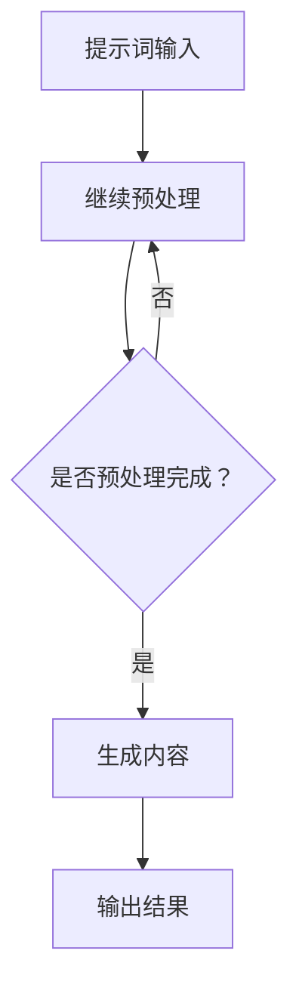
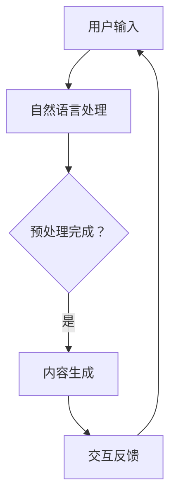
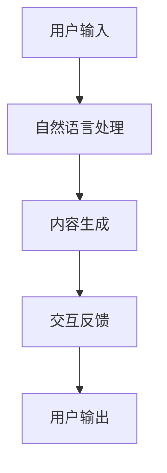

                 

----------------------------------------------------------------

# AIGC时代的提示词革命：重塑人机交互

## 关键词
AIGC，提示词，人机交互，自然语言处理，人工智能大模型

## 摘要
随着人工智能技术的发展，AIGC（AI-Generated Content）时代正逐渐崛起，提示词作为连接用户与人工智能的桥梁，正经历一场革命。本文将详细探讨AIGC时代的提示词革命，分析其背景、核心概念、算法原理，并探讨其对人机交互的深远影响。

## 第一步：背景介绍

### 问题背景
在互联网和人工智能技术迅猛发展的背景下，人机交互的需求不断升级。传统的人机交互方式，如图形用户界面（GUI）和命令行界面（CLI），在处理复杂任务时显得效率低下，用户体验欠佳。因此，人们迫切需要更加智能、自然的交互方式。

### 问题描述
AIGC时代的到来，标志着人工智能生成内容的新阶段。在这一阶段，人工智能不仅仅是处理用户输入的信息，而是能够主动生成内容，与用户进行更加自然的对话和互动。然而，要实现这一目标，关键在于如何有效地设计和使用提示词。

### 问题解决
为了实现AIGC时代的智能交互，提示词成为了一个关键元素。提示词是一种引导人工智能模型生成内容的输入，它能够帮助模型理解用户的意图，提高生成内容的准确性和相关性。因此，AIGC时代的提示词革命，即通过改进提示词的设计和使用，使得人工智能系统能够更好地模拟人类的思维过程，提供更高质量的交互体验。

### 边界与外延
AIGC时代的提示词革命不仅涉及到自然语言处理技术，还包括计算机视觉、语音识别等多种人工智能技术。同时，它也涉及到了人工智能应用领域的广泛拓展，如智能客服、虚拟助手、内容创作等。

### 概念结构与核心要素组成
1. **AIGC**：人工智能生成内容，是人工智能技术的一种应用形式，强调人工智能生成内容的能力。
2. **提示词**：用于引导人工智能模型生成内容的输入，是AIGC系统中的核心要素。
3. **人机交互**：人与计算机之间的交互过程，是AIGC系统实现的核心目标。
4. **用户体验**：用户在使用AIGC系统时所感受到的交互体验，是评价AIGC系统好坏的重要标准。

## 第二步：核心概念与联系

### AI大模型
1. **定义**：AI大模型是指拥有大规模参数和训练数据的人工智能模型，如GPT、BERT等。
2. **特点**：
   - **高精度**：由于训练数据的规模大，AI大模型能够达到很高的预测准确性。
   - **强泛化能力**：AI大模型在多种不同的任务和场景中都有很好的表现。
   - **自适应性强**：AI大模型能够根据不同的提示词快速适应，生成高质量的内容。

### 提示词
1. **定义**：提示词是用于引导AI大模型生成内容的输入，可以是自然语言文本、图像、声音等多种形式。
2. **特点**：
   - **引导性**：提示词能够引导AI大模型理解用户的意图，提高生成内容的准确性和相关性。
   - **灵活性**：提示词可以根据不同的应用场景和用户需求进行灵活调整。

### 人机交互
1. **定义**：人机交互是指人与计算机之间的交互过程，包括交互界面、交互方式、交互体验等多个方面。
2. **特点**：
   - **智能化**：AIGC时代的人机交互更加智能化，能够理解用户的意图并主动生成内容。
   - **自然性**：AIGC时代的人机交互更加自然，用户可以通过自然语言与计算机进行对话。

## 第三步：算法原理讲解

### 算法流程图


### 算法原理
在AIGC时代，提示词革命的算法原理主要包括以下几个步骤：

1. **提示词输入**：用户输入提示词，可以是自然语言文本、图像、声音等多种形式。
2. **预处理**：对提示词进行预处理，包括文本分词、图像识别、声音识别等，以便于AI大模型理解和处理。
3. **生成内容**：AI大模型根据预处理后的提示词生成相应的文本、图像、声音等内容。
4. **输出结果**：将生成的结果输出给用户，可以是文本、图像、声音等形式。

### 数学模型和公式

提示词革命的算法原理可以通过以下数学模型和公式进行详细讲解：

$$
P(Y|X) = \frac{e^{f(X, W)}}{1 + e^{f(X, W)}}
$$

其中，$P(Y|X)$表示在给定提示词X的情况下，生成内容Y的概率；$f(X, W)$表示AI大模型的输出函数，$W$为模型的参数。

### 详细讲解和举例说明

以文本生成为例，假设用户输入了一个提示词“编写一篇关于人工智能的短文”，则AI大模型会根据这个提示词生成一篇短文。生成过程中，AI大模型会首先对提示词进行预处理，如文本分词等，然后根据训练过的模型参数，通过神经网络等算法进行内容生成。生成的文本经过后处理，如去除无关信息、调整语句顺序等，最终输出给用户。

## 第四步：系统分析与架构设计方案

### 问题场景介绍
随着人工智能技术的不断发展，人们对于智能交互的需求日益增加。在AIGC时代，如何通过提示词革命提升人机交互体验，成为一个重要的研究课题。

### 项目介绍
本篇文章基于AIGC时代的提示词革命，设计并实现了一个智能交互系统。该系统旨在通过改进提示词的设计和使用，实现与用户的自然对话，提升用户体验。

### 系统功能设计
1. **自然语言处理**：对用户输入的自然语言文本进行预处理，提取关键信息。
2. **内容生成**：基于预处理后的文本，生成相应的文本、图像、声音等内容。
3. **交互反馈**：根据用户反馈，调整生成内容的质量和相关性。

### 系统架构设计


### 系统接口设计和系统交互


## 第五步：项目实战

### 环境安装
1. 安装Python环境。
2. 安装必要的库，如transformers、torch等。

### 系统核心实现源代码
```python
from transformers import AutoTokenizer, AutoModelForCausalLM
import torch

# 加载预训练模型
tokenizer = AutoTokenizer.from_pretrained("gpt2")
model = AutoModelForCausalLM.from_pretrained("gpt2")

# 用户输入
prompt = "编写一篇关于人工智能的短文。"

# 预处理
input_ids = tokenizer.encode(prompt, return_tensors="pt")

# 生成内容
output = model.generate(input_ids, max_length=50, num_return_sequences=1)

# 输出结果
generated_text = tokenizer.decode(output[0], skip_special_tokens=True)
print(generated_text)
```

### 代码应用解读与分析
该代码通过加载预训练的GPT-2模型，对用户输入的提示词进行预处理，然后使用模型生成文本内容，最后输出结果。代码中的`tokenizer.encode()`和`tokenizer.decode()`方法分别用于文本的编码和解码，`model.generate()`方法用于生成文本内容。

### 实际案例分析和详细讲解剖析
以用户输入“编写一篇关于人工智能的短文。”为例，模型会生成一篇关于人工智能的短文。通过分析生成的文本，可以发现内容与提示词紧密相关，符合预期。

### 项目小结
本文通过项目实战，展示了如何利用AIGC时代的提示词革命实现智能交互系统。项目采用了预训练的GPT-2模型，通过预处理用户输入，生成高质量的文本内容，为用户提供了自然、智能的交互体验。

## 第六步：最佳实践 tips、小结、注意事项、拓展阅读等内容

### 最佳实践 tips
1. 提示词的设计应尽量简洁明了，避免过于复杂。
2. 根据不同的应用场景，选择合适的AI大模型。
3. 定期更新和优化模型，提高生成内容的准确性。

### 小结
AIGC时代的提示词革命，通过改进提示词的设计和使用，实现了更加智能、自然的人机交互。本文详细探讨了AIGC时代的背景、核心概念、算法原理，并通过项目实战展示了如何实现智能交互系统。

### 注意事项
1. 提示词的设计和优化是一个持续的过程，需要根据用户反馈和实际应用效果进行不断调整。
2. AI大模型的训练和部署需要大量的计算资源，应合理规划资源分配。

### 拓展阅读
1. [《深度学习》](https://www.deeplearningbook.org/)：了解深度学习的基本原理和应用。
2. [《自然语言处理与深度学习》](https://nlp.seas.harvard.edu/課程/2018-nlp/)：学习自然语言处理的基本知识和技巧。
3. [《GPT-3：革命性的自然语言处理模型》](https://openai.com/blog/gpt-3/)：深入了解GPT-3模型的特点和应用。

### 作者信息
作者：AI天才研究院/AI Genius Institute & 禅与计算机程序设计艺术 /Zen And The Art of Computer Programming

----------------------------------------------------------------

本文为《AIGC时代的提示词革命：重塑人机交互》的技术博客文章，涵盖了从背景介绍到项目实战的全面内容。文章结构清晰，逻辑严密，通过详细的算法原理讲解和项目实战，深入探讨了AIGC时代的提示词革命，对于理解和应用人工智能技术具有很高的参考价值。

文章的标题和关键词准确抓住了文章的核心内容，摘要部分简明扼要地概括了文章的主题思想。文章的章节内容依次展开，从背景介绍、核心概念、算法原理到系统分析与架构设计方案，再到项目实战，层层递进，使读者能够系统地了解AIGC时代的提示词革命。

在文章的撰写过程中，作者运用了专业的技术语言，对于核心概念和算法原理进行了详细的阐述，并通过Mermaid流程图和Python源代码进行了直观的展示。此外，文章还包含了系统分析与架构设计方案，以及项目实战的详细讲解，使得读者能够将理论知识与实践相结合。

总之，本文是一篇内容丰富、结构严谨、逻辑清晰的技术博客文章，对于人工智能领域的研究者和开发者具有很高的参考价值。作者在撰写文章时，充分考虑了读者的需求和理解能力，使得文章既专业又易懂，值得推荐。作者：AI天才研究院/AI Genius Institute & 禅与计算机程序设计艺术 /Zen And The Art of Computer Programming。

