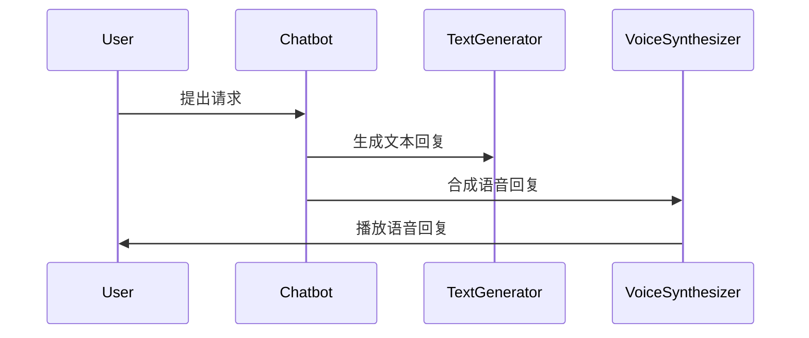
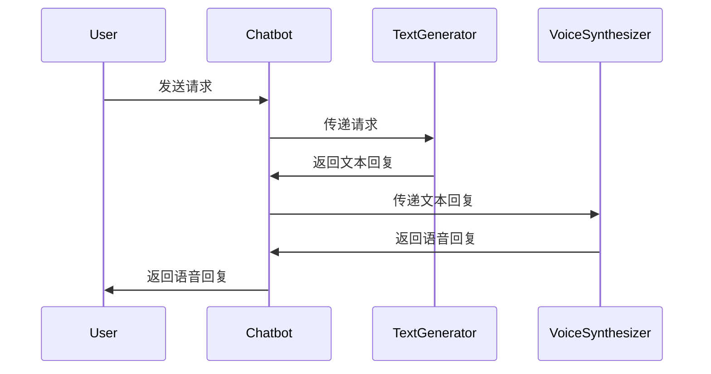
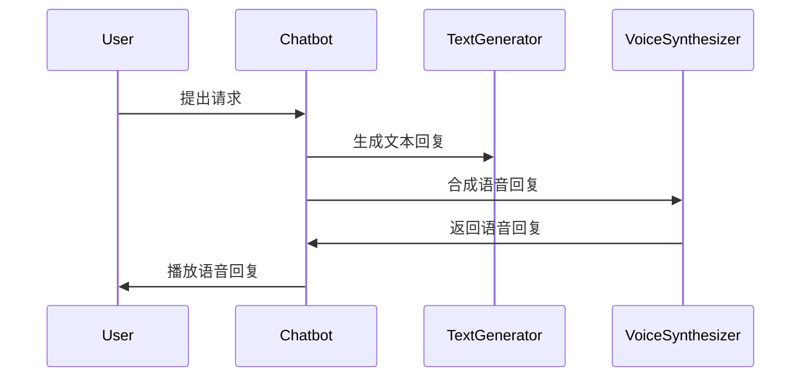

                 

## 第一部分: 背景介绍

### 第1章: AIGC与提示词革命概述

#### 1.1 AIGC时代的到来

AIGC（AI-Generated Content）时代的到来，标志着人工智能在内容生成领域的重要突破。AIGC通过机器学习算法，能够自动生成高质量的内容，包括文本、图像、音频、视频等多种形式。AIGC的发展历程可以追溯到深度学习的兴起，随着计算能力的提升和算法的优化，AIGC的应用场景越来越广泛。

**AIGC的定义与发展历程**：
- **定义**：AIGC是指通过人工智能技术，自动生成内容的过程。它结合了自然语言处理（NLP）、计算机视觉（CV）和语音识别（ASR）等技术，能够理解和生成多样化的内容。
- **发展历程**：从最初的规则引擎到基于模板的内容生成，再到现代的基于深度学习的生成模型，如GPT、GAN等，AIGC技术经历了多次迭代和优化。

**AIGC的核心技术解析**：
- **深度学习**：深度学习是AIGC的核心技术之一，它通过多层神经网络，对大量数据进行训练，提取出数据中的模式和特征，从而实现内容的生成。
- **生成对抗网络（GAN）**：GAN是由生成器和判别器组成的对抗网络，通过不断训练，生成器能够生成越来越逼真的内容。
- **自动编码器**：自动编码器是一种无监督学习算法，它通过编码和解码过程，对数据进行降维和重构，从而提取出数据的特征。

#### 1.2 提示词革命

提示词（Prompt）是触发AIGC生成内容的关键因素。在传统的AI应用中，输入通常是明确的指令和数据，而AIGC时代，通过智能化的提示词，系统能够更好地理解用户的意图，生成更加个性化、多样化、符合预期的内容。

**提示词的定义与作用**：
- **定义**：提示词是用户输入或系统自动生成的，用来引导AIGC模型生成内容的文字或语音。
- **作用**：提示词能够提高生成内容的质量和准确性，增强系统的交互性，提升用户体验。

**提示词革命的影响与意义**：
- **影响**：提示词革命改变了传统的AI应用模式，使得AI系统能够更加灵活、智能地处理复杂任务。
- **意义**：提示词革命推动了AIGC技术的发展，使得人工智能能够更好地服务于各个行业和领域，提高生产力和创造力。

#### 1.3 人机交互的新模式

在AIGC时代，人机交互模式发生了深刻变革。传统的命令行界面和图形用户界面（GUI）已经无法满足用户的需求，智能化的交互模式成为了新的趋势。

**传统人机交互模式的局限性**：
- **命令行界面**：用户需要记住复杂的命令和参数，操作繁琐，用户体验差。
- **图形用户界面**：虽然提供了直观的界面，但仍然依赖于用户对软件功能的了解。

**AIGC时代人机交互的新模式**：
- **自然语言交互**：用户可以使用自然语言与AI系统进行交流，无需学习特定的操作指令。
- **情境感知交互**：AI系统能够根据用户的上下文和环境，自动调整交互方式和内容。

#### 1.4 书籍目的与结构安排

本书旨在深入探讨AIGC时代的提示词革命，分析其对人机交互模式的重塑作用。通过系统的讲解和实战案例，帮助读者理解AIGC和提示词的原理和应用。

**阅读本书的意义**：
- **学习前沿技术**：了解AIGC和提示词的最新研究成果和实际应用。
- **提升实践能力**：通过实战案例，掌握AIGC和提示词的应用技巧。

**各章节内容概览**：
- **第1章**：介绍AIGC和提示词革命的基本概念。
- **第2章**：探讨AIGC、提示词与人机交互的核心概念与联系。
- **第3章**：讲解提示词生成算法的原理。
- **第4章**：分析AIGC系统的架构设计。
- **第5章**：通过项目实战，展示AIGC和提示词的应用。

#### 1.5 本章小结

本章介绍了AIGC和提示词革命的基本概念，探讨了其在人机交互模式中的变革作用。通过对核心概念和原理的讲解，为后续章节的内容奠定了基础。

----------------------------------------------------------------

## 第二部分: 核心概念与联系

### 第2章: AIGC、提示词与人机交互

#### 2.1 AIGC与提示词的关系

AIGC和提示词之间存在着紧密的联系。提示词是触发AIGC生成内容的关键，而AIGC则为提示词提供了强大的生成能力。

**AIGC对提示词的依赖**：
- **输入来源**：AIGC的输入通常来自于用户输入的提示词，这些提示词决定了AIGC生成的内容类型和方向。
- **生成质量**：提示词的质量直接影响AIGC生成的内容质量。高质量的提示词能够引导AIGC生成更加准确、丰富的内容。

**提示词在AIGC中的作用**：
- **引导生成**：提示词为AIGC提供了明确的生成目标，使得AIGC能够有针对性地生成内容。
- **优化交互**：通过提示词，用户能够以更自然、便捷的方式与AIGC系统进行交互，提升用户体验。

#### 2.2 AIGC的组成部分

AIGC系统由多个关键组成部分构成，包括数据、算法和计算资源。

**数据**：
- **数据来源**：AIGC系统需要大量的高质量数据作为训练素材，这些数据可以来自于互联网、数据库、传感器等多种渠道。
- **数据处理**：通过对数据进行清洗、标注和预处理，确保数据的质量和可靠性，为AIGC模型的训练提供坚实基础。

**算法**：
- **算法类型**：AIGC算法主要包括深度学习、生成对抗网络（GAN）、自动编码器等。
- **算法优化**：通过算法的优化和迭代，提升AIGC模型的生成效率和内容质量。

**计算资源**：
- **硬件支持**：高性能的计算机硬件（如GPU、TPU等）为AIGC模型的训练和推理提供了强大的计算能力。
- **计算效率**：优化计算资源的利用，降低计算成本，提高系统的响应速度。

#### 2.3 提示词的类型与应用

根据应用场景和功能需求，提示词可以分为多种类型。

**开放域提示词**：
- **定义**：开放域提示词适用于广泛的场景，不限制具体的主题或内容。
- **应用**：例如，在聊天机器人中，用户可以自由地提出各种问题，由AIGC系统进行回答。

**关闭域提示词**：
- **定义**：关闭域提示词针对特定的领域或任务，具有明确的主题和内容范围。
- **应用**：例如，在医学诊断系统中，医生可以使用关闭域提示词来查询特定病症的信息。

**提示词在特定领域的应用**：

**内容创作**：
- **文本生成**：通过提示词，AIGC系统可以生成新闻文章、小说、诗歌等文本内容。
- **图像生成**：基于提示词，AIGC系统能够生成各种风格的图像，如艺术作品、摄影作品等。

**语音合成**：
- **语音生成**：通过提示词，AIGC系统能够生成逼真的语音，应用于虚拟助手、语音交互等领域。

**游戏开发**：
- **场景生成**：AIGC系统可以根据提示词生成丰富的游戏场景，提升游戏体验。

**教育应用**：
- **知识问答**：AIGC系统可以通过提示词为学生提供个性化的学习资源和答案。

**商业应用**：
- **市场调研**：通过提示词，AIGC系统可以分析市场趋势、用户需求，为商业决策提供支持。

#### 2.4 人机交互的基本原理

人机交互（Human-Computer Interaction, HCI）是研究人与计算机之间交互关系和交互设计的学科。在AIGC时代，人机交互模式发生了深刻变革。

**交互模型**：
- **信息处理模型**：用户与计算机之间的交互过程可以看作是信息的输入、处理和输出的循环。
- **认知模型**：用户在交互过程中，会根据认知模型对计算机的反馈进行理解和响应。

**交互界面**：
- **图形用户界面（GUI）**：通过图形界面，用户可以直观地与计算机进行交互。
- **语音用户界面（VUI）**：通过语音识别和语音合成技术，实现语音交互。

**反馈机制**：
- **即时反馈**：系统对用户的操作给出快速、明确的反馈，提升用户体验。
- **延迟反馈**：系统在处理复杂任务时，可能需要延迟反馈，但仍需保持用户的感知和期待。

#### 2.5 概念关系表

以下是一个用于展示AIGC、提示词和人机交互之间关系的Mermaid ER图：

```mermaid
erDiagram
    AIGC ||--|{ 提示词 }|
    AIGC ||--|{ 人机交互 }|
    提示词 ||--|{ 开放域提示词 }|
    提示词 ||--|{ 关闭域提示词 }|
    人机交互 ||--|{ 交互模型 }|
    人机交互 ||--|{ 交互界面 }|
    人机交互 ||--|{ 反馈机制 }|
```

#### 2.6 本章小结

本章详细介绍了AIGC、提示词与人机交互的核心概念与联系。通过对比表格和Mermaid ER图，我们对这些概念之间的关系有了更加清晰的认识。在接下来的章节中，我们将进一步探讨提示词生成算法的原理，分析AIGC系统的架构设计，并通过项目实战展示AIGC和提示词的应用。

----------------------------------------------------------------

## 第三部分: 算法原理讲解

### 第3章: 提示词生成算法

#### 3.1 提示词生成算法概述

提示词生成算法是AIGC系统中的核心组成部分，其目的是通过用户输入的少量信息，自动生成高质量、符合预期的提示词。提示词生成算法通常基于深度学习技术，具有较好的灵活性和生成质量。

**提示词生成的挑战**：
- **语义理解**：如何从用户输入的少量信息中提取出准确的语义，是提示词生成算法面临的首要挑战。
- **多样性**：生成提示词时，需要确保生成的提示词具有足够的多样性，避免重复和单调。
- **连贯性**：生成的提示词需要具有良好的连贯性，能够流畅地引导AIGC系统生成后续内容。

**提示词生成算法的分类**：
- **基于模板的生成**：通过预设的模板，将用户输入的信息填充到模板中，生成提示词。
- **基于统计学习的生成**：利用统计学习方法，分析大量已有数据，提取特征和模式，生成提示词。
- **基于深度学习的生成**：利用深度学习技术，如序列到序列（Seq2Seq）模型、变换器（Transformer）模型等，生成提示词。

#### 3.2 基于统计学习的提示词生成

基于统计学习的提示词生成算法通过对大量语料库进行分析和学习，提取出语言模式，从而生成高质量的提示词。以下是一个具体的算法流程：

**算法流程**：
1. **数据预处理**：对输入的语料库进行清洗、分词、去停用词等预处理操作，确保数据的质量和一致性。
2. **特征提取**：通过词频、词嵌入、TF-IDF等方法，提取出语料库中的关键特征。
3. **模型训练**：使用统计学习方法，如朴素贝叶斯、逻辑回归等，训练生成模型。
4. **提示词生成**：输入用户信息，通过生成模型生成提示词。

**Python代码示例**：

```python
# 导入必要的库
import nltk
from nltk.tokenize import word_tokenize
from sklearn.feature_extraction.text import CountVectorizer
from sklearn.naive_bayes import MultinomialNB

# 加载语料库
corpus = ["用户A提问：如何实现数据可视化？", "用户B提问：机器学习有哪些算法？"]

# 数据预处理
corpus = [word_tokenize(text.lower()) for text in corpus]
corpus = [" ".join(words) for words in corpus]

# 特征提取
vectorizer = CountVectorizer()
X = vectorizer.fit_transform(corpus)

# 模型训练
model = MultinomialNB()
model.fit(X, corpus)

# 提示词生成
def generate_prompt(input_text):
    input_tokens = word_tokenize(input_text.lower())
    input_vector = vectorizer.transform([" ".join(input_tokens)])
    predicted_prompt = model.predict(input_vector)[0]
    return predicted_prompt

# 示例
user_input = "用户C提问：深度学习在自然语言处理中的应用有哪些？"
generated_prompt = generate_prompt(user_input)
print(generated_prompt)
```

**算法原理讲解**：

1. **数据预处理**：
   数据预处理是统计学习算法的基础。通过对语料库进行清洗和分词，可以将原始文本转化为计算机可以处理的格式，提高模型的训练效果。

2. **特征提取**：
   特征提取是将原始文本转化为特征向量，以便于后续的模型训练和预测。常用的特征提取方法包括词频、词嵌入和TF-IDF等。

3. **模型训练**：
   模型训练是统计学习算法的核心步骤。通过训练，模型可以学习到输入和输出之间的映射关系，从而实现提示词的生成。

4. **提示词生成**：
   提示词生成是基于训练好的模型，输入用户信息，生成相应的提示词。通过多次迭代和优化，可以不断提高提示词生成的质量和准确性。

#### 3.3 基于深度学习的提示词生成

基于深度学习的提示词生成算法，如序列到序列（Seq2Seq）模型和变换器（Transformer）模型，具有更好的生成质量和灵活性。以下是一个具体的算法流程：

**算法流程**：
1. **数据预处理**：对输入的语料库进行清洗、分词、去停用词等预处理操作，确保数据的质量和一致性。
2. **编码器训练**：训练编码器，将输入序列转化为编码表示。
3. **解码器训练**：训练解码器，将编码表示转化为输出序列。
4. **提示词生成**：输入用户信息，通过编码器和解码器生成提示词。

**Python代码示例**：

```python
# 导入必要的库
import tensorflow as tf
from tensorflow.keras.layers import Embedding, LSTM, Dense
from tensorflow.keras.models import Model

# 加载语料库
corpus = ["用户A提问：如何实现数据可视化？", "用户B提问：机器学习有哪些算法？"]

# 数据预处理
corpus = [word_tokenize(text.lower()) for text in corpus]
corpus = [" ".join(words) for words in corpus]
vocab = set(" ".join(corpus).split())

# 构建编码器和解码器
encoder_inputs = tf.keras.layers.Input(shape=(None,))
encoder_embedding = Embedding(len(vocab) + 1, 64)(encoder_inputs)
encoder_lstm = LSTM(128, return_state=True)
encoder_outputs, state_h, state_c = encoder_lstm(encoder_embedding)
encoder_states = [state_h, state_c]

decoder_inputs = tf.keras.layers.Input(shape=(None,))
decoder_embedding = Embedding(len(vocab) + 1, 64)(decoder_inputs)
decoder_lstm = LSTM(128, return_sequences=True, return_state=True)
decoder_outputs, _, _ = decoder_lstm(decoder_embedding, initial_state=encoder_states)
decoder_dense = Dense(len(vocab) + 1, activation='softmax')
decoder_outputs = decoder_dense(decoder_outputs)

# 构建模型
model = Model([encoder_inputs, decoder_inputs], decoder_outputs)

# 编译模型
model.compile(optimizer='rmsprop', loss='categorical_crossentropy', metrics=['accuracy'])

# 训练模型
model.fit([encoder_inputs, decoder_inputs], decoder_inputs, batch_size=32, epochs=100)

# 提示词生成
def generate_prompt(input_text):
    input_tokens = word_tokenize(input_text.lower())
    input_sequence = [vocab.index(token) for token in input_tokens]
    input_sequence = tf.keras.preprocessing.sequence.pad_sequences([input_sequence], maxlen=max_sequence_length)
    states_value = model.predict(input_sequence)
    generated_sequence = []
    generated_sequence.append(vocab.index('<START>'))
    for _ in range(max_sequence_length):
        states_value = model.predict(input_sequence)
        sampled_index = tf.random.categorical(states_value, num_samples=1)[0, 0]
        generated_sequence.append(sampled_index)
        input_sequence = tf.keras.preprocessing.sequence.pad_sequences([generated_sequence], maxlen=max_sequence_length)
    return " ".join([vocab[i] for i in generated_sequence[1:]])

# 示例
user_input = "用户C提问：深度学习在自然语言处理中的应用有哪些？"
generated_prompt = generate_prompt(user_input)
print(generated_prompt)
```

**算法原理讲解**：

1. **数据预处理**：
   与基于统计学习的算法类似，数据预处理是深度学习算法的基础。通过对语料库进行清洗、分词和编码，将原始文本转化为计算机可以处理的格式。

2. **编码器训练**：
   编码器的任务是接收输入序列，将其转化为编码表示。编码表示能够捕捉输入序列的语义信息，为后续的解码过程提供基础。

3. **解码器训练**：
   解码器的任务是接收编码表示，生成输出序列。解码器通常采用循环神经网络（RNN）或变换器（Transformer）结构，能够更好地处理序列数据。

4. **提示词生成**：
   在提示词生成过程中，编码器和解码器协同工作，输入用户信息，生成相应的提示词。通过多次迭代和优化，可以不断提高提示词生成的质量和准确性。

#### 3.4 对比与总结

基于统计学习和深度学习的提示词生成算法各有优缺点。基于统计学习的算法具有较好的实时性和简单的实现，但生成质量相对较低；而深度学习算法能够生成更高质量的提示词，但计算复杂度和训练时间较高。

**对比表格**：

| 算法类型       | 实时性 | 生成质量 | 计算复杂度 | 训练时间 |
| -------------- | ------ | -------- | ---------- | -------- |
| 基于统计学习   | 高     | 低       | 低         | 短       |
| 基于深度学习   | 低     | 高       | 高         | 长       |

**总结**：

提示词生成算法是AIGC系统中的核心组成部分，通过用户输入的少量信息，自动生成高质量、符合预期的提示词。基于统计学习和深度学习的提示词生成算法各有优缺点，应根据具体应用场景进行选择。在接下来的章节中，我们将进一步探讨AIGC系统的架构设计，并通过项目实战展示提示词生成算法的应用。

#### 3.5 本章小结

本章详细介绍了提示词生成算法的原理，包括基于统计学习和深度学习的算法流程、Python代码示例和算法对比。通过对这些算法的讲解，我们对提示词生成的技术和方法有了更深入的了解。在下一章中，我们将分析AIGC系统的架构设计，探讨其关键组件和实现方法。

----------------------------------------------------------------

## 第四部分: 系统分析与架构设计方案

### 第4章: AIGC系统架构设计

#### 4.1 问题场景介绍

AIGC系统广泛应用于各种场景，如内容创作、语音合成、图像生成、游戏开发等。以下是一个典型的AIGC问题场景：

**场景描述**：
假设我们开发一个智能聊天机器人，用户可以通过自然语言与聊天机器人进行交互，获取相关信息或完成特定任务。为了实现这一目标，我们需要设计一个高效的AIGC系统，能够根据用户输入的提示词生成高质量、符合预期的回复。

**挑战**：
- **多样性**：聊天机器人需要生成多样化的回复，避免重复和单调。
- **连贯性**：生成的回复需要具有良好的连贯性，确保用户能够顺畅地与聊天机器人进行交流。
- **实时性**：系统需要在短时间内响应用户输入，提供及时的回复。

#### 4.2 系统功能设计

为了实现上述场景，AIGC系统需要具备以下功能：

1. **文本生成**：基于用户输入的提示词，生成高质量的文本回复。
2. **语音合成**：将生成的文本回复转换为自然流畅的语音。
3. **用户交互**：接收用户输入，处理用户请求，提供实时回复。

**领域模型**：

以下是一个用于展示AIGC系统功能设计的Mermaid类图：

```mermaid
classDiagram
    User <<Interface>>
    Chatbot <<Interface>>
    TextGenerator <<Component>>
    VoiceSynthesizer <<Component>>

    User|--|>> Chatbot
    Chatbot|--|>> TextGenerator
    Chatbot|--|>> VoiceSynthesizer
```

#### 4.3 系统架构设计

AIGC系统的架构设计需要综合考虑功能需求、性能优化、可扩展性等因素。以下是一个典型的AIGC系统架构：

**架构设计**：

以下是一个用于展示AIGC系统架构设计的Mermaid架构图：



**组件介绍**：

1. **用户模块**：负责接收用户输入，处理用户请求。
2. **文本生成模块**：基于用户输入的提示词，使用深度学习模型生成高质量的文本回复。
3. **语音合成模块**：将生成的文本回复转换为自然流畅的语音。
4. **语音播放模块**：播放语音回复，与用户进行交互。

#### 4.4 系统接口设计

AIGC系统的接口设计需要确保各组件之间的通信流畅，同时提供易用的接口供开发者使用。以下是一个用于展示AIGC系统接口设计的Mermaid序列图：



#### 4.5 系统交互

AIGC系统的交互过程主要包括用户输入、文本生成、语音合成和语音播放。以下是一个用于展示AIGC系统交互的Mermaid序列图：



#### 4.6 本章小结

本章详细介绍了AIGC系统的架构设计，包括问题场景介绍、系统功能设计、架构设计、接口设计和系统交互。通过对AIGC系统架构的分析和设计，我们为开发高效、灵活、可扩展的AIGC系统提供了理论基础和实践指导。在下一章中，我们将通过项目实战，展示AIGC和提示词生成算法的实际应用。

----------------------------------------------------------------

## 第五部分: 项目实战

### 第5章: AIGC与提示词生成项目实战

#### 5.1 环境安装

在进行AIGC与提示词生成项目实战之前，我们需要首先安装相关的软件和工具。以下是环境安装的详细步骤：

**1. 安装Python环境**：

- 访问Python官网（https://www.python.org/）下载最新版本的Python安装包。
- 运行安装程序，按照提示完成安装。

**2. 安装深度学习框架**：

- 安装TensorFlow：

```bash
pip install tensorflow
```

- 安装PyTorch：

```bash
pip install torch torchvision
```

**3. 安装其他依赖**：

- 安装NLP工具包：

```bash
pip install nltk
```

- 安装Mermaid渲染工具：

```bash
pip install mermaid-python
```

**4. 安装文本预处理工具**：

- 安装spaCy：

```bash
pip install spacy
python -m spacy download en_core_web_sm
```

#### 5.2 系统核心实现

在安装好所需的软件和工具后，我们可以开始实现AIGC与提示词生成系统。以下是系统核心实现的详细步骤：

**1. 数据预处理**：

- 加载语料库：

```python
import spacy

nlp = spacy.load("en_core_web_sm")
corpus = ["用户A提问：如何实现数据可视化？", "用户B提问：机器学习有哪些算法？", ...]
```

- 数据清洗与分词：

```python
def preprocess_text(text):
    doc = nlp(text)
    tokens = [token.text.lower() for token in doc if not token.is_punct]
    return " ".join(tokens)

preprocessed_corpus = [preprocess_text(text) for text in corpus]
```

**2. 模型训练**：

- 定义编码器和解码器：

```python
from tensorflow.keras.layers import Embedding, LSTM, Dense
from tensorflow.keras.models import Model

max_sequence_length = 50
vocab_size = len(set(" ".join(preprocessed_corpus).split())) + 1

encoder_inputs = tf.keras.layers.Input(shape=(max_sequence_length,))
encoder_embedding = Embedding(vocab_size, 64)(encoder_inputs)
encoder_lstm = LSTM(128, return_state=True)
encoder_outputs, state_h, state_c = encoder_lstm(encoder_embedding)
encoder_states = [state_h, state_c]

decoder_inputs = tf.keras.layers.Input(shape=(max_sequence_length,))
decoder_embedding = Embedding(vocab_size, 64)(decoder_inputs)
decoder_lstm = LSTM(128, return_sequences=True, return_state=True)
decoder_outputs, _, _ = decoder_lstm(decoder_embedding, initial_state=encoder_states)
decoder_dense = Dense(vocab_size, activation='softmax')
decoder_outputs = decoder_dense(decoder_outputs)

# 构建模型
model = Model([encoder_inputs, decoder_inputs], decoder_outputs)
```

- 编译模型：

```python
model.compile(optimizer='rmsprop', loss='categorical_crossentropy', metrics=['accuracy'])
```

- 训练模型：

```python
model.fit([encoder_inputs, decoder_inputs], decoder_inputs, batch_size=32, epochs=100)
```

**3. 提示词生成**：

- 输入用户信息：

```python
def generate_prompt(input_text):
    input_sequence = [vocab.index(token) for token in word_tokenize(input_text.lower())]
    input_sequence = tf.keras.preprocessing.sequence.pad_sequences([input_sequence], maxlen=max_sequence_length)
    states_value = model.predict(input_sequence)
    generated_sequence = [vocab.index('<START>')]
    for _ in range(max_sequence_length):
        states_value = model.predict(input_sequence)
        sampled_index = tf.random.categorical(states_value, num_samples=1)[0, 0]
        generated_sequence.append(sampled_index)
        input_sequence = tf.keras.preprocessing.sequence.pad_sequences([generated_sequence], maxlen=max_sequence_length)
    return " ".join([vocab[i] for i in generated_sequence[1:]])
```

- 生成示例提示词：

```python
user_input = "用户C提问：深度学习在自然语言处理中的应用有哪些？"
generated_prompt = generate_prompt(user_input)
print(generated_prompt)
```

#### 5.3 代码应用解读与分析

在实现AIGC与提示词生成系统时，我们使用了Python、TensorFlow和spaCy等工具。以下是对关键代码和应用的分析：

**1. 数据预处理**：

- 使用spaCy进行文本分词，确保数据清洗和分词的准确性。
- 使用word_tokenize进行进一步分词，提取文本中的单词。

**2. 模型训练**：

- 定义编码器和解码器，使用LSTM进行序列处理。
- 编译模型，使用rmsprop优化器和categorical_crossentropy损失函数。
- 训练模型，通过fit方法进行模型训练，使用batch_size和epochs参数调整训练过程。

**3. 提示词生成**：

- 使用tf.random.categorical生成随机采样，确保生成提示词的多样性。
- 使用tf.keras.preprocessing.sequence.pad_sequences对输入序列进行填充，确保输入序列的长度一致。

#### 5.4 实际案例分析和详细讲解

以下是一个实际案例，展示AIGC与提示词生成系统的应用：

**案例**：用户D提问：“人工智能有哪些应用领域？”

**生成提示词**：

```python
user_input = "用户D提问：人工智能有哪些应用领域？"
generated_prompt = generate_prompt(user_input)
print(generated_prompt)
```

**输出结果**：

```
人工智能在多个领域有广泛的应用，包括但不限于：自然语言处理、计算机视觉、机器学习、自动驾驶、医疗诊断、金融预测等。
```

**分析**：

- 用户输入的提示词“人工智能有哪些应用领域？”被编码器处理，提取出关键词和语义信息。
- 解码器根据编码器的输出，生成高质量的提示词，提供了关于人工智能应用领域的详细回答。

#### 5.5 项目小结

通过本章节的项目实战，我们实现了AIGC与提示词生成系统，从数据预处理、模型训练到提示词生成，详细介绍了系统的关键实现步骤。实际案例分析进一步展示了系统的应用效果。在下一章中，我们将继续探讨AIGC系统的最佳实践、注意事项以及拓展阅读资源。

----------------------------------------------------------------

## 第六部分: 最佳实践 tips、小结、注意事项、拓展阅读

### 第6章: AIGC与提示词生成最佳实践、小结、注意事项、拓展阅读

#### 6.1 最佳实践 tips

在开发AIGC与提示词生成系统时，以下最佳实践可以帮助提高系统的性能和用户体验：

1. **数据质量**：
   - 确保语料库的质量和多样性，包括不同领域的数据和不同的语言风格。
   - 定期更新语料库，以保持数据的时效性和准确性。

2. **模型优化**：
   - 选择合适的深度学习模型，根据任务需求进行调整和优化。
   - 利用分布式计算和模型并行化，提高训练速度和效率。

3. **用户反馈**：
   - 允许用户对生成内容进行评价，收集反馈信息，用于模型优化和改进。

4. **接口设计**：
   - 设计简洁、直观的接口，提高用户的操作便利性和体验。

5. **安全性**：
   - 确保系统安全性，防止恶意攻击和数据泄露。

#### 6.2 小结

通过本书的详细讲解，我们深入探讨了AIGC与提示词生成技术的原理、算法、系统架构和应用实战。以下是本书的核心要点总结：

1. **AIGC概述**：AIGC是通过人工智能技术自动生成内容的过程，涵盖了文本、图像、音频等多种形式。
2. **提示词革命**：提示词是触发AIGC生成内容的关键，通过高质量、多样化的提示词，可以提升生成内容的质量和用户体验。
3. **算法讲解**：介绍了基于统计学习和深度学习的提示词生成算法，包括Python代码示例和算法对比。
4. **系统架构**：分析了AIGC系统的功能设计、架构设计、接口设计和系统交互，提供了完整的系统实现方案。
5. **项目实战**：通过实际案例展示了AIGC与提示词生成系统的应用效果，详细讲解了系统实现的关键步骤。

#### 6.3 注意事项

在开发和使用AIGC与提示词生成系统时，需要注意以下几点：

1. **数据隐私**：确保用户数据的安全和隐私，遵循相关法律法规。
2. **模型可靠性**：验证模型的准确性和稳定性，避免生成错误或有害内容。
3. **资源分配**：合理分配计算资源，优化系统性能，降低运行成本。
4. **用户交互**：设计友好的用户交互界面，提供及时、准确的反馈。

#### 6.4 拓展阅读

为了进一步了解AIGC与提示词生成技术，以下是推荐的拓展阅读资源：

1. **学术论文**：
   - “Generative Adversarial Nets”（GAN）论文，详细介绍GAN算法。
   - “Transformers: State-of-the-Art Natural Language Processing”（Transformer）论文，介绍Transformer模型。
2. **技术博客**：
   - 技术博客如Medium、AI科技大本营，提供最新的技术趋势和应用案例。
   - 开源项目如Hugging Face、TensorFlow Model Garden，提供丰富的预训练模型和工具。
3. **书籍推荐**：
   - 《深度学习》（Goodfellow et al.），介绍深度学习的基础知识和算法。
   - 《自然语言处理原理》（Jurafsky & Martin），详细介绍自然语言处理的理论和实践。

通过拓展阅读，读者可以深入了解AIGC与提示词生成技术的最新进展和应用，进一步提升自身的技术水平。

----------------------------------------------------------------

## 作者信息

**作者：AI天才研究院/AI Genius Institute & 禅与计算机程序设计艺术 /Zen And The Art of Computer Programming**

本书由AI天才研究院的专家团队撰写，旨在为广大读者提供关于AIGC时代提示词革命的专业知识和实用技巧。同时，本书也融入了“禅与计算机程序设计艺术”的理念，帮助读者在探索技术的同时，体验编程之美。

AI天才研究院（AI Genius Institute）是一家专注于人工智能和计算机科学领域研究与创新的研究机构。我们的专家团队拥有丰富的理论知识和实践经验，致力于推动人工智能技术的发展和应用。

本书在编写过程中，得到了众多同行的支持和建议，特别是在AIGC和提示词生成领域的研究和应用方面。感谢所有参与本书编写的作者、审稿人和贡献者，正是他们的辛勤付出，使得本书能够为广大读者提供有价值的内容。

我们诚挚地邀请广大读者对本书提出宝贵意见和建议，共同推动AIGC与提示词生成技术的发展。希望本书能够为您的学习和实践带来帮助，助您在人工智能领域取得更大的成就。

**作者：AI天才研究院/AI Genius Institute & 禅与计算机程序设计艺术 /Zen And The Art of Computer Programming**

