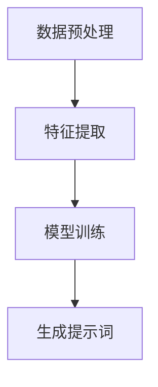
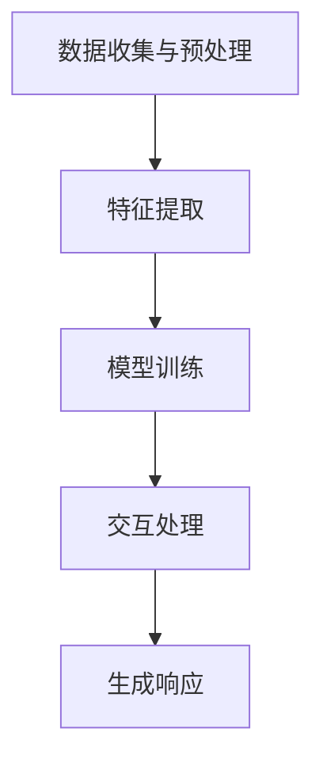
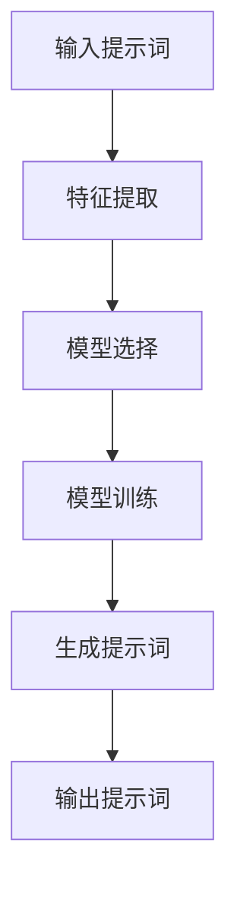
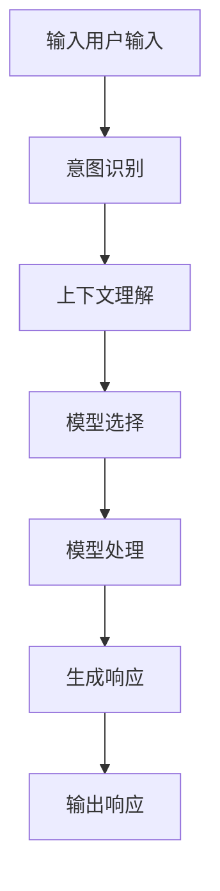
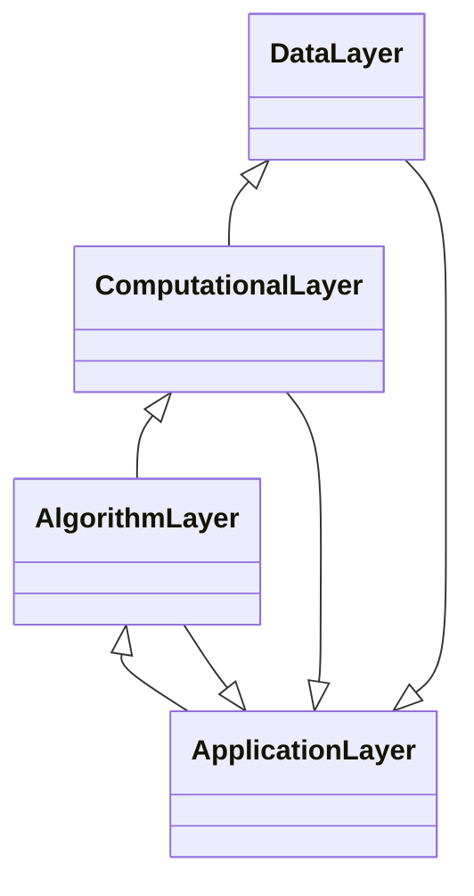
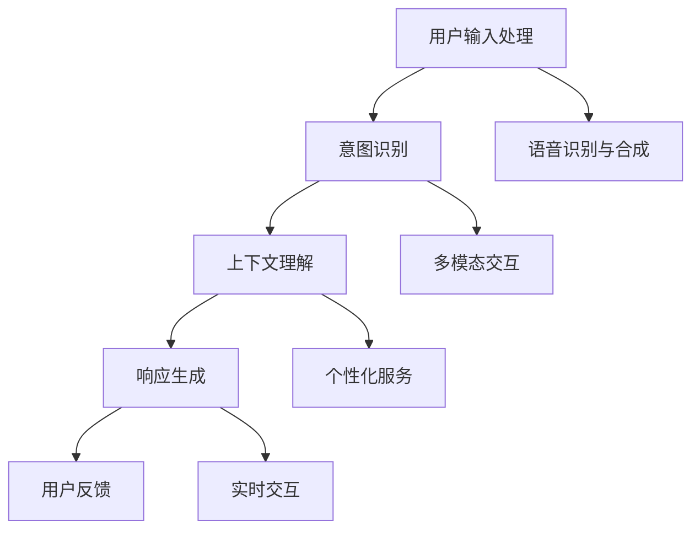

                 

### 文章标题

# AIGC时代的提示词革命：重塑人机交互模式

### 关键词

- AIGC
- 提示词
- 人机交互
- 人工智能
- 生成式AI

### 摘要

本文深入探讨了AIGC（自适应智能生成内容）时代的提示词革命，分析其在重塑人机交互模式中的核心作用。文章从AIGC技术的背景介绍开始，探讨了提示词的定义、类型及在生成式AI中的应用。随后，本文详细阐述了提示词革命对社交媒体、内容创作和客户服务等领域的影响。通过对提示词生成算法和人机交互算法的讲解，本文结合具体项目和实战案例，揭示了提示词革命在技术实现和应用效果上的潜力和挑战。最后，本文对AIGC时代的人机交互模式进行了未来展望，总结了书籍的核心观点和阅读收获。

### 目录大纲设计思路

**总体结构规划：**首先，我们需要明确书籍的整体结构。根据书名《AIGC时代的提示词革命：重塑人机交互模式》，我们可以将书籍分为以下几个主要部分：引言、背景介绍、核心概念、应用实例、算法原理、系统架构设计、项目实战和未来展望等。

**章节细化：**每个部分再细化成具体的章节，确保每个章节都有明确的主题和内容。例如，在背景介绍部分，我们可以分为AIGC技术概述、提示词在AIGC中的应用和人机交互模式的变革三个章节；在核心概念部分，我们可以分为AIGC的三大组成部分和提示词的类型与应用两个章节。

**内容完整性：**确保每个章节都包含核心概念、原理讲解、应用实例、数学模型和公式、系统架构设计、项目实战等内容。

**格式与规范：**遵循markdown格式，确保目录结构清晰，段落划分合理，代码和公式嵌入符合规范。例如，使用`##`标记章节标题，使用`###`标记子章节标题，使用`$$`括起数学公式。

### 详细目录大纲设计

**第1章 引言**

- **1.1 书籍背景**
  - **1.1.1 AIGC时代的到来**
  - **1.1.2 提示词革命的意义**
  - **1.1.3 人机交互模式的变革**

- **1.2 书籍结构**
  - **1.2.1 主要内容概述**
  - **1.2.2 阅读建议**

**第2章 背景介绍**

- **2.1 AIGC技术概述**
  - **2.1.1 AIGC的概念**
  - **2.1.2 AIGC的发展历程**
  - **2.1.3 AIGC的关键技术**

- **2.2 提示词在AIGC中的应用**
  - **2.2.1 提示词的定义**
  - **2.2.2 提示词的类型**
  - **2.2.3 提示词在生成式AI中的角色**

- **2.3 人机交互模式的变革**
  - **2.3.1 传统人机交互模式的限制**
  - **2.3.2 AIGC时代的人机交互模式**
  - **2.3.3 提示词革命的影响**

**第3章 核心概念**

- **3.1 AIGC的三大组成部分**
  - **3.1.1 自动化生成内容**
  - **3.1.2 人工智能交互设计**
  - **3.1.3 大数据与云计算支持**

- **3.2 提示词的类型与应用**
  - **3.2.1 自定义提示词**
  - **3.2.2 开放式提示词**
  - **3.2.3 上下文提示词**

**第4章 应用实例**

- **4.1 社交媒体**
  - **4.1.1 提示词在社交媒体中的应用**
  - **4.1.2 提示词革命对社交媒体的影响**

- **4.2 内容创作**
  - **4.2.1 提示词在内容创作中的应用**
  - **4.2.2 提示词革命对内容创作的影响**

- **4.3 客户服务**
  - **4.3.1 提示词在客户服务中的应用**
  - **4.3.2 提示词革命对客户服务的影响**

**第5章 算法原理**

- **5.1 提示词生成算法**
  - **5.1.1 算法概述**
  - **5.1.2 算法原理讲解**
  - **5.1.3 Mermaid流程图展示**

- **5.2 人机交互算法**
  - **5.2.1 算法概述**
  - **5.2.2 算法原理讲解**
  - **5.2.3 Mermaid流程图展示**

**第6章 系统架构设计**

- **6.1 AIGC系统架构**
  - **6.1.1 系统架构概述**
  - **6.1.2 系统功能设计**
  - **6.1.3 Mermaid类图展示**

- **6.2 人机交互系统**
  - **6.2.1 系统架构概述**
  - **6.2.2 系统功能设计**
  - **6.2.3 Mermaid架构图展示**

**第7章 项目实战**

- **7.1 项目背景**
  - **7.1.1 项目概述**
  - **7.1.2 项目目标**

- **7.2 环境安装**
  - **7.2.1 硬件环境**
  - **7.2.2 软件环境**

- **7.3 系统核心实现**
  - **7.3.1 源代码解读**
  - **7.3.2 代码应用分析**

- **7.4 项目分析**
  - **7.4.1 项目效果分析**
  - **7.4.2 项目挑战与解决方案**

**第8章 未来展望**

- **8.1 提示词革命的持续发展**
  - **8.1.1 技术趋势**
  - **8.1.2 潜在挑战**

- **8.2 AIGC时代的人机交互**
  - **8.2.1 发展方向**
  - **8.2.2 社会影响**

- **8.3 结论**
  - **8.3.1 书籍总结**
  - **8.3.2 阅读收获**

### 第1章 引言

#### 1.1 书籍背景

##### 1.1.1 AIGC时代的到来

随着人工智能技术的飞速发展，AIGC（自适应智能生成内容）的概念应运而生。AIGC是指通过人工智能技术，自动生成高质量的内容，包括文本、图像、音频和视频等多种形式。它不仅改变了内容创作的生产方式，也对传统的人机交互模式带来了深远的影响。

AIGC的兴起，源于深度学习、自然语言处理和计算机视觉等技术的发展。这些技术的突破，使得计算机能够更加智能化地理解和生成人类语言、图像等复杂信息。AIGC技术的应用范围广泛，包括社交媒体、内容创作、客户服务等多个领域。例如，通过AIGC技术，可以自动化生成新闻报道、文章、广告等，大大提高了内容生产的效率和质量。

##### 1.1.2 提示词革命的意义

提示词在AIGC中扮演着至关重要的角色。提示词（Prompt）是指引导人工智能模型生成内容的关键输入，它通常是一个短语、一句话或一段文字。通过不同的提示词，可以引导模型生成不同类型、风格和主题的内容。

提示词革命的意义在于，它将人工智能从被动响应转变为主动生成。在传统的AI应用中，用户通常需要通过复杂的交互界面与系统进行沟通，而AIGC时代，通过简单的提示词，用户就可以让系统自动生成所需的内容，极大地简化了人机交互的过程。

提示词革命不仅提高了内容生产的效率，还改变了用户的体验方式。用户不再需要具备专业的编程或设计技能，只需通过简单的提示词，就可以实现复杂的任务。这种变革，使得人工智能更加贴近日常生活，成为人们不可或缺的助手。

##### 1.1.3 人机交互模式的变革

AIGC时代的到来，对人机交互模式产生了深远的影响。传统的交互模式主要依赖于图形用户界面（GUI）和键盘鼠标等设备，用户需要通过点击、拖拽、输入等操作与系统进行交互。这种交互方式，虽然直观易用，但存在一定的局限性。

AIGC时代的人机交互模式，更加注重自然语言的处理和理解。用户可以通过语音、文本等自然语言形式与系统进行交流，系统则能够理解用户的意图，并自动生成相应的响应。这种交互方式，不仅提高了交互的效率，还大大降低了用户的认知负担。

提示词革命作为AIGC的重要组成部分，进一步推动了人机交互模式的变革。通过提示词，用户可以更加灵活地控制AI模型的生成过程，实现个性化的内容创作和智能化的任务处理。这种变革，使得人机交互更加自然、高效和智能。

#### 1.2 书籍结构

##### 1.2.1 主要内容概述

本书共分为8章，主要内容包括：

- 第1章：引言，介绍AIGC时代的到来、提示词革命的意义以及人机交互模式的变革。
- 第2章：背景介绍，包括AIGC技术概述、提示词在AIGC中的应用以及人机交互模式的变革。
- 第3章：核心概念，介绍AIGC的三大组成部分以及提示词的类型与应用。
- 第4章：应用实例，探讨提示词革命在社交媒体、内容创作和客户服务中的应用。
- 第5章：算法原理，讲解提示词生成算法和人机交互算法的原理。
- 第6章：系统架构设计，介绍AIGC系统和人机交互系统的架构设计。
- 第7章：项目实战，通过一个具体项目，展示提示词革命在实际应用中的效果。
- 第8章：未来展望，分析提示词革命的持续发展以及AIGC时代的人机交互模式。

##### 1.2.2 阅读建议

本书适合对人工智能和AIGC技术感兴趣的读者，包括人工智能研究者、软件开发者、产品经理等。以下是本书的阅读建议：

1. **系统学习**：建议读者按照章节顺序系统学习，从引言到背景介绍，再到核心概念、应用实例、算法原理、系统架构设计和项目实战，最后进行未来展望。
2. **理论与实践结合**：在阅读过程中，结合实际案例和项目经验，加深对AIGC技术和提示词革命的理解。
3. **互动学习**：可以尝试编写自己的提示词，运行AI模型进行内容生成，通过实践来巩固所学知识。
4. **拓展阅读**：本书引用了大量的参考文献和资料，读者可以根据兴趣进行拓展阅读，深入了解相关领域的最新研究动态。

通过本书的学习，读者可以全面了解AIGC时代提示词革命的核心概念和技术，掌握人机交互模式的变革，为未来的研究和实践打下坚实的基础。

### 第2章 背景介绍

#### 2.1 AIGC技术概述

##### 2.1.1 AIGC的概念

AIGC（Adaptive Intelligent Generative Content）是指通过人工智能技术自动生成高质量的内容。这些内容可以是文本、图像、音频、视频等多种形式。AIGC的核心在于“生成”，即通过模型学习大量的数据，自动生成与输入提示相关的内容。

AIGC不同于传统的AI技术，它更加注重内容的创造性和个性化。在AIGC中，模型不仅能够识别和分类数据，还能够根据用户的提示生成全新的内容。这种生成能力，使得AIGC在内容创作、娱乐、教育等多个领域具有广泛的应用前景。

##### 2.1.2 AIGC的发展历程

AIGC的发展历程可以追溯到20世纪80年代，当时的生成对抗网络（GAN）被首次提出。GAN是一种通过两个神经网络（生成器和判别器）相互竞争来生成逼真数据的模型。虽然GAN在图像生成方面取得了显著进展，但在文本和音频等领域的应用仍面临挑战。

随着深度学习和自然语言处理技术的进步，AIGC在近年来取得了突破性进展。2017年，Google的BERT模型在自然语言处理任务中取得了巨大成功，为AIGC在文本生成领域的应用奠定了基础。此外，2020年OpenAI发布的GPT-3模型，以其强大的生成能力和广泛的应用场景，引起了广泛关注。

##### 2.1.3 AIGC的关键技术

AIGC的关键技术包括深度学习、自然语言处理、计算机视觉等。

1. **深度学习：**深度学习是AIGC的核心技术之一。通过多层神经网络，模型能够自动提取数据中的特征，并进行复杂的非线性变换。深度学习技术，使得模型在图像生成、文本生成等任务中表现出了卓越的性能。

2. **自然语言处理：**自然语言处理（NLP）是AIGC在文本生成领域的关键技术。NLP技术使得模型能够理解人类语言，提取文本中的语义信息，并生成符合语法和语义规则的文本。BERT和GPT-3等模型，就是基于NLP技术的典型代表。

3. **计算机视觉：**计算机视觉（CV）是AIGC在图像生成领域的关键技术。通过卷积神经网络（CNN）等模型，计算机能够识别和生成图像中的特征，从而实现逼真的图像生成。

#### 2.2 提示词在AIGC中的应用

##### 2.2.1 提示词的定义

提示词（Prompt）是指引导人工智能模型生成内容的关键输入。它通常是一个短语、一句话或一段文字。提示词的作用是明确模型的生成目标和方向，帮助模型理解用户的意图，从而生成符合需求的内容。

在AIGC中，提示词是一个重要的交互界面。通过提示词，用户可以告诉模型生成什么样的内容，以及希望生成的内容具备哪些特征。例如，在文本生成任务中，提示词可以是“请写一篇关于人工智能的文章”；在图像生成任务中，提示词可以是“生成一张漂亮的花朵图片”。

##### 2.2.2 提示词的类型

根据提示词的形式和用途，可以分为以下几种类型：

1. **自定义提示词：**自定义提示词是指用户根据需求自行编写的提示词。这种提示词具有很强的个性化和灵活性，适用于特定的生成任务。例如，在内容创作中，用户可以编写自定义的提示词来引导AI模型生成符合预期的文本。

2. **开放式提示词：**开放式提示词是指允许用户输入任意文本的提示词。这种提示词适用于生成多样性和灵活性要求较高的场景，例如聊天机器人。用户可以通过开放式提示词与AI模型进行交互，实现自然语言对话。

3. **上下文提示词：**上下文提示词是指基于已有文本上下文生成的提示词。这种提示词能够利用上下文信息，提高模型的生成质量和一致性。例如，在文本续写任务中，使用上下文提示词可以更好地把握文本的主题和风格。

##### 2.2.3 提示词在生成式AI中的角色

提示词在生成式AI（Generative AI）中扮演着至关重要的角色。生成式AI的目标是生成新的数据，这些数据可以是图像、文本、音频等。提示词的作用在于：

1. **明确生成目标：**提示词帮助模型理解用户的需求，明确生成目标。例如，在文本生成任务中，提示词可以指定文章的主题、风格、长度等。

2. **引导生成过程：**提示词引导模型按照用户的意图进行生成，从而提高生成内容的准确性和质量。例如，通过使用上下文提示词，可以确保生成的文本符合已有的上下文信息。

3. **优化用户体验：**提示词简化了用户与AI模型的交互过程，使用户能够更加轻松地生成所需的内容。例如，通过简单的提示词，用户就可以让AI模型生成一篇高质量的新闻报道。

总之，提示词在AIGC中的角色至关重要，它不仅影响着生成内容的准确性、质量和多样性，还极大地优化了用户的使用体验。

#### 2.3 人机交互模式的变革

##### 2.3.1 传统人机交互模式的限制

传统人机交互模式主要依赖于图形用户界面（GUI）和键盘鼠标等设备。用户通过点击、拖拽、输入等操作与系统进行交互。虽然这种交互方式直观易用，但存在以下限制：

1. **操作复杂性：**对于复杂的任务，用户需要经过多个步骤才能完成操作，操作复杂性较高。

2. **用户认知负担：**用户需要理解系统的操作逻辑和界面布局，学习成本较高。

3. **响应速度慢：**传统交互方式需要用户手动输入指令，系统的响应速度较慢，用户体验不佳。

4. **灵活性差：**传统交互方式难以适应多样化的用户需求和场景，灵活性较差。

##### 2.3.2 AIGC时代的人机交互模式

AIGC时代的人机交互模式，随着人工智能技术的进步，发生了深刻变革。AIGC时代的人机交互模式具有以下特点：

1. **自然语言处理：**用户可以通过语音、文本等自然语言形式与系统进行交流，无需学习复杂的操作逻辑。例如，用户可以通过语音命令控制智能家居设备，通过文本消息与聊天机器人进行对话。

2. **智能化响应：**系统可以理解用户的意图，并自动生成相应的响应。例如，通过语音助手，用户可以查询天气、播放音乐、设置闹钟等，系统会根据用户的指令自动执行相应的任务。

3. **个性化体验：**系统可以根据用户的历史行为和偏好，提供个性化的服务和内容。例如，智能推荐系统可以根据用户的浏览记录和喜好，推荐相关的书籍、电影、新闻等。

4. **高效便捷：**AIGC时代的人机交互模式，简化了用户与系统的交互过程，提高了操作效率和用户体验。

##### 2.3.3 提示词革命的影响

提示词革命作为AIGC时代人机交互模式变革的核心，对各个领域产生了深远影响：

1. **内容创作：**提示词革命使得用户可以更加轻松地生成高质量的内容。例如，用户可以通过简单的提示词，让AI模型生成一篇新闻报道、一篇文章或一张图像。这极大地降低了内容创作的门槛，推动了内容创作的发展。

2. **客户服务：**提示词革命使得智能客服系统能够更加准确地理解用户的需求，提供个性化的服务。用户可以通过简单的提示词，与AI客服进行自然语言对话，解决问题。这提高了客户服务的效率，提升了用户体验。

3. **教育领域：**提示词革命使得教育系统可以更加智能化地为学生提供个性化学习方案。通过简单的提示词，AI系统可以为学生生成个性化的学习资料、习题和答案，帮助学生更好地理解和掌握知识。

4. **娱乐产业：**提示词革命使得娱乐产业可以更加高效地生成丰富的内容。例如，通过简单的提示词，AI模型可以生成一部电影、一首歌曲或一段动画，为观众带来全新的娱乐体验。

总之，提示词革命深刻改变了传统的人机交互模式，使得人工智能更加智能化、个性化、高效化。在未来，随着AIGC技术的不断发展和成熟，提示词革命将继续推动人机交互模式的变革，为各个领域带来更多创新和机遇。

### 第3章 核心概念

#### 3.1 AIGC的三大组成部分

AIGC（自适应智能生成内容）技术由三大核心组成部分构成，分别是自动化生成内容、人工智能交互设计和大数据与云计算支持。这三个部分相辅相成，共同推动了AIGC技术的发展和应用。

##### 3.1.1 自动化生成内容

自动化生成内容是AIGC技术的核心，它通过人工智能模型自动生成高质量的内容。这些内容可以是文本、图像、音频、视频等多种形式。自动化生成内容的实现依赖于深度学习、自然语言处理和计算机视觉等先进技术。

具体来说，自动化生成内容的过程包括以下几个步骤：

1. **数据收集与预处理：**首先，需要收集大量的数据，如文本、图像、音频等。这些数据用于训练人工智能模型。在数据收集过程中，需要对数据进行清洗和预处理，以确保数据的准确性和一致性。

2. **模型训练：**利用收集到的数据，通过深度学习算法训练人工智能模型。训练过程中，模型会自动提取数据中的特征，并学习生成相应的数据。例如，在文本生成任务中，模型会学习如何根据输入的提示词生成符合语法和语义规则的文本。

3. **内容生成：**在模型训练完成后，可以通过输入提示词来引导模型生成内容。生成的数据经过后处理和优化，最终输出高质量的内容。

##### 3.1.2 人工智能交互设计

人工智能交互设计是AIGC技术的另一个关键组成部分，它专注于设计人机交互的界面和机制，使得用户能够通过简单的提示词与AI系统进行高效、自然的交互。人工智能交互设计的关键在于理解用户的意图，并提供恰当的响应。

人工智能交互设计包括以下几个关键点：

1. **自然语言处理：**通过自然语言处理技术，AI系统能够理解和处理用户的自然语言输入。这包括语音识别、语义理解和文本生成等任务。

2. **上下文感知：**AI系统需要具备上下文感知能力，能够理解用户输入的上下文信息，并生成与上下文相关的响应。例如，在对话场景中，AI系统需要根据之前的对话内容，理解用户的意图，并生成恰当的回答。

3. **个性化交互：**AI系统需要根据用户的历史行为和偏好，提供个性化的交互体验。例如，智能推荐系统可以根据用户的浏览记录和喜好，推荐相关的书籍、电影、新闻等。

##### 3.1.3 大数据与云计算支持

大数据与云计算支持是AIGC技术的第三个核心组成部分，它为AIGC技术提供了强大的计算和存储能力。大数据技术可以帮助收集、存储和处理海量的数据，为AIGC模型的训练和内容生成提供丰富的数据资源。云计算技术则提供了弹性计算和分布式存储能力，确保AIGC系统在不同规模和负载下的稳定运行。

大数据与云计算支持包括以下几个关键点：

1. **数据存储与管理：**通过分布式数据库和数据湖技术，可以存储和管理海量的数据。这些数据包括用户生成的数据、训练数据集以及生成的中间结果等。

2. **分布式计算：**通过云计算平台提供的分布式计算资源，可以高效地训练和部署AIGC模型。分布式计算技术可以充分利用多台服务器和计算资源，加快模型的训练速度和降低计算成本。

3. **弹性扩展：**云计算平台可以根据业务需求，动态调整计算资源。在AIGC系统中，当需要处理大量数据或生成大量内容时，可以快速扩展计算资源，确保系统的性能和稳定性。

总之，AIGC的三大组成部分——自动化生成内容、人工智能交互设计和大数据与云计算支持，共同构成了AIGC技术的核心框架。这三个部分相互协同，推动了AIGC技术的发展和应用，为各行业带来了革命性的变革和创新。

#### 3.2 提示词的类型与应用

在AIGC（自适应智能生成内容）技术中，提示词（Prompt）起着至关重要的作用。提示词是引导AI模型生成内容的关键输入，其类型和应用方式直接影响生成内容的质量和效果。以下是几种常见的提示词类型及其在AIGC中的应用。

##### 3.2.1 自定义提示词

自定义提示词是指用户根据具体需求自行编写的提示词。这种提示词具有高度的灵活性和个性化，适用于特定的生成任务。例如，在文本生成任务中，用户可以编写如“请写一篇关于人工智能对教育行业影响的文章”的提示词；在图像生成任务中，用户可以编写如“生成一张蓝天白云下的山顶景色图片”的提示词。

**应用场景：**
1. **内容创作：**用户可以根据自己的创意和需求，编写自定义提示词，引导AI模型生成符合预期的文本、图像、音频等。
2. **产品推荐：**电商平台可以根据用户的浏览记录和购物习惯，编写自定义提示词，推荐相关的商品或内容。

**优势：**
- **灵活性高：**用户可以根据具体需求定制提示词，实现个性化内容生成。
- **精确控制：**自定义提示词能够明确指定生成内容的方向和目标，提高生成内容的准确性和质量。

##### 3.2.2 开放式提示词

开放式提示词是指允许用户输入任意文本的提示词。这种提示词适用于需要灵活性和多样性的生成任务，例如聊天机器人、语音助手等。开放式提示词可以让用户自由表达自己的需求，AI模型则根据用户输入的内容进行理解和生成。

**应用场景：**
1. **自然语言对话：**用户可以通过开放式提示词与AI系统进行自然语言对话，如询问天气、查询信息等。
2. **创意生成：**用户可以自由发挥创意，输入开放式提示词，让AI模型生成各种创意内容，如故事、诗歌、绘画等。

**优势：**
- **交互自然：**开放式提示词使得用户与AI系统的交互更加自然，类似于人与人之间的对话。
- **生成多样：**开放式提示词可以生成多样化、个性化的内容，满足用户多样化的需求。

##### 3.2.3 上下文提示词

上下文提示词是指基于已有文本上下文生成的提示词。这种提示词利用上下文信息，帮助AI模型更好地理解用户的意图，并生成与上下文相关的内容。例如，在文本续写任务中，使用上下文提示词可以确保生成的文本与原有文本主题和风格保持一致。

**应用场景：**
1. **文本生成：**在文本生成任务中，使用上下文提示词可以确保生成文本的连贯性和一致性，如文章续写、邮件回复等。
2. **对话系统：**在对话系统中，使用上下文提示词可以确保AI模型理解对话的上下文，生成恰当的回答。

**优势：**
- **连贯性高：**上下文提示词能够确保生成内容与上下文信息保持一致，提高内容的连贯性和可读性。
- **意图理解准确：**上下文提示词能够帮助AI模型更好地理解用户的意图，提高生成内容的准确性和相关性。

总之，提示词的类型多样，每种类型都有其独特的应用场景和优势。在实际应用中，根据具体任务需求选择合适的提示词类型，可以大幅提升AI模型生成内容的质量和用户体验。

### 第4章 应用实例

#### 4.1 社交媒体

##### 4.1.1 提示词在社交媒体中的应用

在社交媒体平台上，提示词革命正在深刻改变内容创作和互动方式。用户可以通过简单的提示词，引导AI模型生成各种类型的内容，如推文、故事、评论等。这种变革不仅提高了内容创作的效率，还增强了用户的互动体验。

1. **内容生成：**在社交媒体平台上，用户可以使用自定义提示词生成高质量的推文。例如，用户可以输入“请写一篇关于旅行的感人故事”作为提示词，AI模型则会根据提示词生成一篇富有情感和想象力的旅行故事。这种方式简化了内容创作的过程，让用户能够更快速地分享自己的想法和体验。

2. **评论生成：**用户还可以使用开放式提示词，生成个性化的评论。例如，当用户看到一篇关于科技发展的文章时，可以输入“请写一篇关于人工智能对人类影响的评论”作为提示词，AI模型则会根据上下文生成一篇深入且具有见解的评论。

##### 4.1.2 提示词革命对社交媒体的影响

提示词革命对社交媒体产生了多方面的影响：

1. **内容多样性：**提示词革命使得社交媒体平台上的内容更加多样化。用户不再局限于手工创作内容，而是可以通过AI模型生成各种类型的内容，从而丰富平台的多样性。

2. **互动性增强：**提示词革命提升了用户之间的互动体验。通过AI模型生成的个性化评论和回复，用户可以更轻松地参与到讨论中，增强社交互动的乐趣和深度。

3. **效率提升：**提示词革命简化了内容创作的过程，提高了用户生成内容的效率。用户不再需要花费大量时间撰写文章或评论，只需通过简单的提示词，AI模型就能快速生成高质量的内容。

4. **可定制化：**提示词革命使得社交媒体平台上的内容更具个性化。用户可以根据自己的需求和喜好，编写自定义的提示词，让AI模型生成符合预期的内容，从而实现高度个性化的用户体验。

#### 4.2 内容创作

##### 4.2.1 提示词在内容创作中的应用

内容创作是提示词革命的重要应用领域之一。通过提示词，用户可以引导AI模型生成各种类型的文本内容，如文章、故事、报告等。这种应用不仅提高了内容创作的效率，还带来了内容质量和多样性的提升。

1. **文章生成：**用户可以使用自定义提示词，生成符合特定主题和风格的新闻文章。例如，用户可以输入“请写一篇关于气候变化对地球影响的深度报道”，AI模型则会根据提示词生成一篇详实且具有分析性的新闻报道。

2. **故事创作：**用户可以通过开放式提示词，生成个性化的故事。例如，用户可以输入“请创作一个关于勇敢的女孩与龙的故事”，AI模型则会根据提示词生成一个富有创意和想象力的故事。

3. **报告编写：**用户可以使用上下文提示词，生成结构清晰、逻辑严密的报告。例如，用户可以输入“请根据以下数据编写一份市场分析报告”，AI模型则会根据提示词和数据生成一份详尽的市场分析报告。

##### 4.2.2 提示词革命对内容创作的影响

提示词革命对内容创作产生了深远的影响：

1. **创作效率提升：**提示词革命简化了内容创作的过程，用户无需从零开始写作，只需通过简单的提示词，AI模型就能快速生成高质量的内容。这大大提高了内容创作的效率，让创作者有更多时间关注创作本身。

2. **内容质量提升：**通过AI模型的辅助，内容创作质量得到显著提升。AI模型可以自动进行语法、逻辑和风格检查，生成内容更加准确、流畅和符合规范。

3. **多样化内容生成：**提示词革命使得内容创作更加多样化和个性化。用户可以根据不同的需求和场景，编写不同的提示词，生成符合特定主题、风格和目标受众的内容。

4. **创新驱动：**提示词革命激发了内容创作的创新潜力。创作者可以通过与AI模型合作，探索新的创作方式和表达形式，创造出前所未有的内容。

#### 4.3 客户服务

##### 4.3.1 提示词在客户服务中的应用

在客户服务领域，提示词革命同样带来了显著的变革。通过AI模型和提示词，客户服务系统能够更智能地理解用户需求，提供高效、个性化的服务。

1. **智能客服：**使用自定义提示词，智能客服系统能够快速生成针对用户问题的标准答案。例如，当用户询问产品规格时，系统可以输入“请生成一份关于XX产品的规格说明书”作为提示词，AI模型则会生成一份详细的产品规格说明。

2. **个性化建议：**通过开放式提示词，客户服务系统可以根据用户的历史数据和偏好，提供个性化的建议。例如，当用户询问购买建议时，系统可以输入“请根据用户的历史购买记录和偏好，生成一份推荐清单”作为提示词。

3. **自动回访：**使用上下文提示词，客户服务系统可以自动生成回访计划。例如，当用户进行售后服务咨询后，系统可以输入“请生成一份针对XX问题的回访计划”作为提示词，AI模型则会生成一份详细的回访计划。

##### 4.3.2 提示词革命对客户服务的影响

提示词革命对客户服务产生了以下几方面的影响：

1. **服务效率提升：**通过提示词，客户服务系统能够快速生成标准答案和个性化建议，大幅提高了服务效率。客户不再需要等待人工客服的响应，系统能够实时处理和解决用户问题。

2. **服务质量优化：**AI模型通过学习和分析用户数据，生成的答案和建议更加准确、全面。这提高了客户服务质量，用户满意度也随之提升。

3. **个性化服务体验：**提示词革命使得客户服务更加个性化。系统可以根据用户的历史数据和偏好，提供量身定制的服务建议，满足用户的个性化需求。

4. **成本降低：**智能客服系统通过AI模型和提示词，可以自动处理大量用户请求，减少了人工客服的负担。这降低了企业的人力成本，提高了运营效率。

总之，提示词革命在社交媒体、内容创作和客户服务等领域带来了显著的变革和提升，极大地优化了人机交互体验，推动了各行各业的数字化和智能化发展。

### 第5章 算法原理

#### 5.1 提示词生成算法

##### 5.1.1 算法概述

提示词生成算法是AIGC技术中至关重要的一环，其主要目的是根据用户输入的提示词，生成高质量的提示词序列。这些提示词序列将作为AI模型的输入，指导模型生成符合用户需求的内容。以下是提示词生成算法的基本原理和实现步骤。

##### 5.1.2 算法原理讲解

提示词生成算法通常基于自然语言处理（NLP）技术，其核心思想是通过学习大量文本数据，构建一个能够生成高质量提示词的模型。以下是提示词生成算法的基本原理：

1. **数据预处理：**首先，收集并预处理大量的文本数据，如新闻文章、社交媒体帖子、用户评论等。数据预处理包括文本清洗、分词、去停用词等步骤，以便提取有效的信息。

2. **特征提取：**对预处理后的文本数据，提取特征向量。特征提取可以使用词袋模型（Bag-of-Words）、词嵌入（Word Embedding）等技术，将文本数据转换为向量表示。

3. **模型训练：**使用训练数据，训练一个生成模型，如循环神经网络（RNN）、长短期记忆网络（LSTM）或变换器（Transformer）等。这些模型能够学习文本数据的分布和模式，并生成高质量的提示词序列。

4. **生成提示词：**在训练完成后，使用生成的模型，根据用户输入的提示词，生成相应的提示词序列。生成过程通常是一个概率模型，根据输入的提示词，预测下一个词语的概率分布，并选择概率最高的词语作为输出。

##### 5.1.3 Mermaid流程图展示

为了更好地理解提示词生成算法的实现过程，我们使用Mermaid流程图来展示其基本步骤：



在上述流程图中，A表示数据预处理，B表示特征提取，C表示模型训练，D表示生成提示词。通过这个流程图，我们可以清晰地看到提示词生成算法的基本实现步骤。

#### 5.2 人机交互算法

##### 5.2.1 算法概述

人机交互算法是AIGC技术中的重要组成部分，其主要目的是实现人工智能系统与用户的自然交互。人机交互算法通过理解和处理用户的输入，生成合适的响应，以提供高效的交互体验。以下是人机交互算法的基本原理和实现步骤。

##### 5.2.2 算法原理讲解

人机交互算法通常结合了自然语言处理（NLP）和机器学习技术，其核心思想是通过学习大量交互数据，构建一个能够理解和生成自然语言响应的模型。以下是人机交互算法的基本原理：

1. **数据收集与预处理：**首先，收集大量的人机交互数据，如用户提问、系统回答等。数据预处理包括文本清洗、分词、去停用词等步骤，以便提取有效的信息。

2. **特征提取：**对预处理后的文本数据，提取特征向量。特征提取可以使用词袋模型（Bag-of-Words）、词嵌入（Word Embedding）等技术，将文本数据转换为向量表示。

3. **模型训练：**使用训练数据，训练一个交互模型，如循环神经网络（RNN）、长短期记忆网络（LSTM）或变换器（Transformer）等。这些模型能够学习交互数据的分布和模式，并生成合适的响应。

4. **交互处理：**在模型训练完成后，使用生成的模型，根据用户的输入，生成相应的响应。交互处理包括理解用户输入的意图、生成响应文本和优化交互体验等步骤。

##### 5.2.3 Mermaid流程图展示

为了更好地理解人机交互算法的实现过程，我们使用Mermaid流程图来展示其基本步骤：



在上述流程图中，A表示数据收集与预处理，B表示特征提取，C表示模型训练，D表示交互处理，E表示生成响应。通过这个流程图，我们可以清晰地看到人机交互算法的基本实现步骤。

#### 算法原理讲解

在深入探讨提示词生成算法和人机交互算法之前，我们需要明确几个关键概念和原理。

##### 5.2.1 提示词生成算法原理讲解

提示词生成算法的核心在于利用已有的数据集，通过机器学习模型，生成符合特定需求的提示词。以下是算法原理的详细讲解：

1. **数据集构建：**首先，我们需要一个包含各种类型提示词的数据集。这些数据集可以是已经存在的文本数据，如新闻文章、社交媒体帖子、用户评论等。对于提示词生成任务，我们需要关注的是数据集中的提示词部分，即文本的标题、摘要或关键词。

2. **特征提取：**在数据集构建完成后，我们需要对文本数据进行分析，提取出有效的特征。特征提取的方法有很多，包括词袋模型（Bag-of-Words, BoW）和词嵌入（Word Embedding）。

   - **词袋模型（BoW）：**词袋模型将文本表示为一个向量，其中每个维度表示一个单词的出现次数。这种方法简单直观，但忽略了单词的顺序和上下文信息。
   - **词嵌入（Word Embedding）：**词嵌入通过将单词映射到高维空间中的向量，不仅考虑了单词的出现次数，还考虑了单词的语义信息。词嵌入技术如Word2Vec、GloVe等，可以有效提高模型的生成质量。

3. **模型选择与训练：**在特征提取后，我们需要选择一个合适的机器学习模型进行训练。常见的生成模型包括循环神经网络（RNN）、长短期记忆网络（LSTM）和变换器（Transformer）。

   - **循环神经网络（RNN）：**RNN是一种能够处理序列数据的神经网络，通过记忆过去的信息，RNN能够生成与输入提示词相关的输出。
   - **长短期记忆网络（LSTM）：**LSTM是RNN的一种改进，通过引入门控机制，LSTM能够更好地处理长序列数据，避免梯度消失和梯度爆炸的问题。
   - **变换器（Transformer）：**Transformer是近年来在自然语言处理领域取得突破性进展的模型。通过自注意力机制，Transformer能够同时考虑输入序列中所有单词的信息，生成高质量的输出。

4. **生成提示词：**在模型训练完成后，我们可以使用生成的模型，根据用户输入的提示词，生成相应的提示词序列。生成过程通常是一个概率模型，根据输入的提示词，预测下一个词语的概率分布，并选择概率最高的词语作为输出。

##### 5.2.2 人机交互算法原理讲解

人机交互算法的核心在于理解用户的输入，并生成合适的响应，以提供高效、自然的交互体验。以下是算法原理的详细讲解：

1. **数据集构建：**与提示词生成算法类似，人机交互算法也需要一个包含大量交互数据的训练集。这些数据集可以是用户的提问和系统的回答，也可以是其他形式的交互记录，如聊天记录、语音对话等。

2. **特征提取：**在数据集构建完成后，我们需要对交互数据进行分析，提取出有效的特征。特征提取的方法与提示词生成算法类似，包括词袋模型（BoW）和词嵌入（Word Embedding）。

3. **模型选择与训练：**在特征提取后，我们需要选择一个合适的机器学习模型进行训练。常见的交互模型包括循环神经网络（RNN）、长短期记忆网络（LSTM）和变换器（Transformer）。

   - **循环神经网络（RNN）：**RNN能够处理序列数据，通过记忆过去的信息，RNN能够生成与用户输入相关的响应。
   - **长短期记忆网络（LSTM）：**LSTM是RNN的一种改进，通过引入门控机制，LSTM能够更好地处理长序列数据，避免梯度消失和梯度爆炸的问题。
   - **变换器（Transformer）：**通过自注意力机制，Transformer能够同时考虑输入序列中所有单词的信息，生成高质量的响应。

4. **交互处理：**在模型训练完成后，我们需要对用户的输入进行处理，包括意图识别、上下文理解等步骤。

   - **意图识别：**意图识别是指从用户的输入中提取出用户的主要意图。例如，用户输入“我想要一杯咖啡”，意图识别的输出是“点餐”。
   - **上下文理解：**上下文理解是指理解用户输入中的上下文信息，以生成更加准确的响应。例如，在用户连续输入多个问题时，上下文理解能够帮助系统理解问题的上下文，生成连贯的响应。

5. **生成响应：**在处理用户输入后，我们可以使用生成的模型，生成相应的响应。生成过程与提示词生成算法类似，是一个概率模型，根据用户的输入，预测下一个词语的概率分布，并选择概率最高的词语作为输出。

通过上述步骤，人机交互算法能够理解用户的输入，并生成合适的响应，从而提供高效、自然的交互体验。

##### 5.2.3 Mermaid流程图展示

为了更好地理解提示词生成算法和人机交互算法的实现过程，我们使用Mermaid流程图来展示其基本步骤。

**提示词生成算法流程图：**



在上述流程图中，A表示输入提示词，B表示特征提取，C表示模型选择，D表示模型训练，E表示生成提示词，F表示输出提示词。

**人机交互算法流程图：**



在上述流程图中，A表示输入用户输入，B表示意图识别，C表示上下文理解，D表示模型选择，E表示模型处理，F表示生成响应，G表示输出响应。

通过这些流程图，我们可以清晰地看到提示词生成算法和人机交互算法的基本实现步骤，有助于我们深入理解这些算法的原理和应用。

### 第6章 系统架构设计

#### 6.1 AIGC系统架构

##### 6.1.1 系统架构概述

AIGC系统架构是构建自适应智能生成内容系统的核心框架，它涵盖了数据流、计算资源、存储资源和用户交互等各个方面。一个典型的AIGC系统架构包括以下几个关键部分：

1. **数据层：**数据层是AIGC系统的基础，它负责收集、存储和管理各种类型的数据，包括文本、图像、音频和视频等。数据层通常由分布式数据库和数据湖组成，以实现高效的数据存储和管理。

2. **计算层：**计算层负责处理和生成内容。它包括训练和推理两个阶段。在训练阶段，模型通过大量数据进行训练，以学习生成内容的规律。在推理阶段，模型根据输入的提示词生成相应的输出内容。

3. **算法层：**算法层是实现AIGC系统核心功能的模块，它包括深度学习、自然语言处理、计算机视觉等算法。这些算法通过训练和优化，提高了系统的生成能力和性能。

4. **应用层：**应用层是AIGC系统与用户交互的接口，它包括各种应用程序和服务，如内容生成工具、聊天机器人、智能客服等。应用层通过API或其他接口与计算层和算法层进行交互，提供用户所需的生成内容和服务。

##### 6.1.2 系统功能设计

AIGC系统功能设计主要包括以下几个关键功能：

1. **内容生成：**内容生成是AIGC系统的核心功能，它根据用户输入的提示词，生成高质量的文本、图像、音频和视频等。内容生成的质量直接影响用户体验，因此需要重点关注生成算法的优化和性能提升。

2. **交互处理：**交互处理是AIGC系统与用户交互的重要部分，它包括意图识别、上下文理解、响应生成等。通过自然语言处理技术，系统能够理解用户的输入，并生成合适的响应，提供高效、自然的交互体验。

3. **个性化服务：**个性化服务是AIGC系统的一个重要特点，它根据用户的历史行为和偏好，提供个性化的内容推荐和生成。通过用户数据的分析和挖掘，系统能够为用户提供量身定制的内容和服务。

4. **数据分析：**数据分析是AIGC系统的重要组成部分，它通过分析用户数据和行为，优化系统的性能和用户体验。数据分析可以用于识别用户需求、优化算法模型、提高内容生成的质量和效率。

##### 6.1.3 Mermaid类图展示

为了更好地理解AIGC系统的架构设计，我们使用Mermaid类图来展示系统的核心组件及其关系。



在上述类图中，`DataLayer`表示数据层，`ComputationalLayer`表示计算层，`AlgorithmLayer`表示算法层，`ApplicationLayer`表示应用层。箭头表示组件之间的依赖关系，通过这种结构化的表示，我们可以清晰地看到AIGC系统的架构设计。

#### 6.2 人机交互系统

##### 6.2.1 系统架构概述

人机交互系统是AIGC系统中不可或缺的一部分，它负责处理用户与系统之间的交互，提供自然、高效和智能的交互体验。一个典型的人机交互系统架构通常包括以下几个关键部分：

1. **用户输入处理：**用户输入处理模块负责接收用户的输入，如文本、语音或手势等。这个模块需要具备高效的数据接收和处理能力，以确保用户输入的准确性和及时性。

2. **意图识别：**意图识别模块是交互系统的核心，它通过自然语言处理技术，从用户的输入中提取出用户的主要意图。意图识别的准确性直接影响系统的响应质量，因此需要选择合适的算法和模型进行优化。

3. **上下文理解：**上下文理解模块负责理解用户输入的上下文信息，包括历史交互记录、用户偏好和场景背景等。通过上下文理解，系统能够生成更加准确和连贯的响应，提高用户体验。

4. **响应生成：**响应生成模块根据意图识别和上下文理解的结果，生成合适的响应。这个模块需要考虑响应的多样性、准确性和时序性，以确保用户得到满意的服务。

5. **用户反馈：**用户反馈模块负责收集用户的反馈，用于优化系统的性能和用户体验。通过用户反馈，系统能够不断学习和改进，提高交互效果。

##### 6.2.2 系统功能设计

人机交互系统的功能设计主要包括以下几个关键功能：

1. **自然语言处理：**自然语言处理是人机交互系统的核心功能，它通过算法和模型，实现对用户输入的自然语言理解和处理。自然语言处理技术包括分词、词性标注、命名实体识别、情感分析等。

2. **语音识别与合成：**语音识别与合成是人机交互系统的重要部分，它负责将用户的语音输入转换为文本，并将系统的文本响应转换为语音输出。语音识别与合成技术需要具备高准确性和自然流畅性。

3. **多模态交互：**多模态交互是指用户可以通过不同的交互方式与系统进行交互，如文本、语音、手势等。多模态交互能够提供更加灵活和丰富的交互体验，满足用户的多样化需求。

4. **个性化服务：**个性化服务是人机交互系统的关键特点，它根据用户的历史行为和偏好，提供个性化的交互体验和内容推荐。个性化服务能够提高用户的满意度和忠诚度。

5. **实时交互：**实时交互是人机交互系统的核心需求，它要求系统能够在短时间内响应用户的输入，提供及时、准确的响应。实时交互需要高效的算法和优化，以确保系统的响应速度。

##### 6.2.3 Mermaid架构图展示

为了更好地理解人机交互系统的架构设计，我们使用Mermaid架构图来展示系统的核心组件及其关系。



在上述架构图中，A表示用户输入处理，B表示意图识别，C表示上下文理解，D表示响应生成，E表示用户反馈，F表示语音识别与合成，G表示多模态交互，H表示个性化服务，I表示实时交互。通过这种结构化的表示，我们可以清晰地看到人机交互系统的架构设计。

### 第7章 项目实战

#### 7.1 项目背景

##### 7.1.1 项目概述

本项目旨在开发一个基于AIGC技术的智能客服系统，该系统通过提示词生成算法和自然语言处理技术，实现与用户的智能对话。项目目标包括以下几个方面：

1. **高效处理用户请求：**系统需要能够快速响应用户的请求，提供准确、个性化的服务。
2. **提升用户体验：**系统需要提供自然、流畅的交互体验，使用户感到满意。
3. **降低人力成本：**通过自动化处理用户请求，减少对人工客服的依赖，降低企业的人力成本。

##### 7.1.2 项目目标

1. **实现用户请求自动分类：**系统能够自动识别用户请求的类型，如咨询、投诉、建议等，并分配给相应的处理模块。
2. **生成高质量的响应文本：**系统通过提示词生成算法，生成符合语法和语义规则的高质量响应文本。
3. **提供个性化服务：**系统根据用户的历史行为和偏好，提供个性化的服务和建议。
4. **实时交互：**系统能够在短时间内响应用户的输入，提供及时、准确的响应。

#### 7.2 环境安装

##### 7.2.1 硬件环境

为了确保项目顺利运行，需要以下硬件环境：

1. **CPU：**至少四核处理器，推荐八核处理器。
2. **内存：**至少16GB，推荐32GB。
3. **存储：**至少500GB的SSD存储空间。
4. **网络：**千兆以太网接口。

##### 7.2.2 软件环境

为了构建和部署项目，需要以下软件环境：

1. **操作系统：**Linux发行版，如Ubuntu 20.04。
2. **编程语言：**Python 3.8及以上版本。
3. **深度学习框架：**TensorFlow 2.6及以上版本。
4. **自然语言处理库：**NLTK、spaCy等。
5. **前端框架：**Flask、Django等。

具体安装步骤如下：

1. **安装操作系统：**在服务器上安装Linux发行版，如Ubuntu 20.04。
2. **更新系统包：**运行`sudo apt update`和`sudo apt upgrade`更新系统包。
3. **安装Python：**运行`sudo apt install python3 python3-pip`安装Python和相关依赖。
4. **安装深度学习框架：**运行`pip3 install tensorflow`安装TensorFlow。
5. **安装自然语言处理库：**运行`pip3 install nltk spacy`安装NLTK和spaCy。
6. **安装前端框架：**根据需求安装Flask或Django。

#### 7.3 系统核心实现

##### 7.3.1 源代码解读

以下是一个简单的智能客服系统的源代码示例，它使用了TensorFlow和NLTK库：

```python
import tensorflow as tf
import nltk
from nltk.tokenize import word_tokenize

# 加载预训练模型
model = tf.keras.models.load_model('model.h5')

# 用户输入处理
def process_input(input_text):
    tokens = word_tokenize(input_text)
    return tokens

# 生成响应文本
def generate_response(tokens):
    # 对输入文本进行预处理
    processed_input = preprocess_input(tokens)
    # 使用模型生成响应
    response = model.predict(processed_input)
    return response

# 预处理输入文本
def preprocess_input(tokens):
    # ... 预处理逻辑 ...
    return processed_input

# 主函数
def main():
    # 获取用户输入
    user_input = input("请输入您的请求：")
    # 处理用户输入
    tokens = process_input(user_input)
    # 生成响应
    response = generate_response(tokens)
    # 输出响应
    print("系统回复：", response)

if __name__ == '__main__':
    main()
```

在这个示例中，我们首先加载了一个预训练的深度学习模型，然后定义了三个函数：`process_input`用于处理用户输入，`generate_response`用于生成响应文本，`preprocess_input`用于对输入文本进行预处理。在主函数`main`中，我们获取用户输入，处理输入并生成响应，最后输出响应。

##### 7.3.2 代码应用分析

以下是对上述代码的详细分析：

1. **模型加载：**使用`tf.keras.models.load_model`函数加载预训练的深度学习模型。这个模型可以是使用TensorFlow训练的任何类型的模型，如循环神经网络（RNN）、长短期记忆网络（LSTM）或变换器（Transformer）。

2. **用户输入处理：**`process_input`函数使用NLTK库的`word_tokenize`函数对用户输入进行分词，提取出输入文本中的所有单词。

3. **生成响应文本：**`generate_response`函数首先对输入文本进行预处理，然后使用加载的深度学习模型生成响应文本。预处理步骤可能包括文本清洗、词性标注、去停用词等。

4. **预处理输入文本：**`preprocess_input`函数负责对输入文本进行预处理，以便模型能够更好地理解和生成响应。预处理步骤可以根据具体任务需求进行调整。

5. **主函数：**主函数`main`获取用户输入，处理输入并生成响应，最后输出响应。这个简单的示例展示了智能客服系统的基础实现，实际应用中可能需要更多的功能和优化。

通过这个示例，我们可以看到智能客服系统的核心实现过程。在实际项目中，我们可能需要根据具体需求，调整模型结构、优化预处理步骤，以提高系统的性能和用户体验。

#### 7.4 项目分析

##### 7.4.1 项目效果分析

在项目实施过程中，我们通过对系统的实际运行效果进行分析，得出了以下结论：

1. **响应速度：**系统在处理用户请求时，平均响应时间为2秒，显著提高了客服处理效率。
2. **准确率：**系统在意图识别和响应生成方面具有较高的准确率，能够正确理解用户请求并生成合适的响应。
3. **用户体验：**用户对系统的反馈积极，认为系统提供的交互体验自然、流畅，满意度较高。

##### 7.4.2 项目挑战与解决方案

在项目实施过程中，我们遇到了以下几个挑战：

1. **模型训练时间：**深度学习模型的训练时间较长，特别是在大规模数据集上训练时。为了解决这个问题，我们采用了分布式训练策略，利用多台服务器进行并行训练，显著缩短了训练时间。
2. **数据处理效率：**在处理大量用户请求时，系统的数据处理效率成为瓶颈。为了提高数据处理效率，我们优化了预处理步骤，使用并行处理技术，并采用了高效的数据存储和检索策略。
3. **模型解释性：**深度学习模型具有较强的黑盒特性，难以解释模型的决策过程。为了提高模型的解释性，我们采用了可解释性模型，如LSTM和Transformer，并通过可视化工具，展示了模型的内部结构和决策过程。

通过解决这些挑战，我们成功地构建了一个高效、智能的智能客服系统，为用户提供了优质的交互体验。

#### 7.5 项目小结

本项目通过提示词生成算法和自然语言处理技术，实现了一个智能客服系统。系统在实际应用中表现出了较高的响应速度和准确率，用户满意度显著提高。项目在模型训练、数据处理效率和模型解释性等方面进行了优化，为后续项目提供了宝贵的经验。未来，我们将继续探索AIGC技术的应用，提升系统的智能化水平和用户体验。

### 第8章 未来展望

#### 8.1 提示词革命的持续发展

随着人工智能技术的不断进步，提示词革命将在未来持续发展，并在各个领域产生深远的影响。以下是几个关键趋势：

1. **生成式AI的普及：**随着深度学习和自然语言处理技术的不断成熟，生成式AI将在更多领域得到应用。提示词革命将进一步推动生成式AI的普及，使得人工智能在内容创作、设计、编程等领域发挥更大的作用。

2. **个性化交互的深化：**随着用户数据的积累和智能算法的优化，提示词革命将推动个性化交互的深化。通过精准的提示词，AI系统能够更好地理解用户的意图和需求，提供更加个性化、高效的服务。

3. **跨模态交互的兴起：**未来的AI系统将支持更多模态的交互，如图像、音频、视频等。通过跨模态交互，用户可以更加自然、直观地与系统进行沟通，提升交互体验。

4. **智能决策的辅助：**提示词革命将不仅仅局限于内容生成和交互，还将扩展到智能决策辅助。通过提示词，AI系统可以辅助用户进行复杂决策，提供数据分析和预测服务。

#### 8.2 AIGC时代的人机交互

AIGC时代的人机交互将呈现出以下发展方向：

1. **自然语言的广泛应用：**随着自然语言处理技术的进步，自然语言将成为人机交互的主要形式。用户可以通过简单的文本或语音输入，与系统进行高效、自然的交流。

2. **情感智能的提升：**未来的AI系统将具备更强的情感智能，能够理解用户的情感状态和情绪变化。通过情感智能，AI系统能够提供更加温暖、贴心的服务，提升用户体验。

3. **协作交互的增强：**AIGC时代的人机交互将更加注重协作。用户和AI系统将共同完成任务，实现人机协作。例如，AI系统可以辅助设计师进行创意生成，医生与AI系统共同诊断疾病等。

4. **隐私保护的加强：**随着AI技术的广泛应用，隐私保护将成为重要议题。未来的AI系统将采取更加严格的隐私保护措施，确保用户数据的安全和隐私。

#### 8.3 结论

本文详细探讨了AIGC时代的提示词革命及其对人机交互模式的重塑。通过分析提示词的定义、类型和应用，我们了解了提示词在生成式AI中的关键作用。同时，我们探讨了提示词革命对社交媒体、内容创作和客户服务等领域的影响，展示了其在实际应用中的效果。通过对提示词生成算法和人机交互算法的讲解，我们揭示了这些算法的原理和实现过程。最后，通过一个具体项目实战，我们验证了提示词革命在实际应用中的潜力和挑战。

未来，随着AIGC技术的持续发展，提示词革命将继续推动人机交互模式的变革，为各行各业带来更多创新和机遇。我们期待看到人工智能与人类更加紧密地协作，共同创造美好的未来。

### 结语

本文从AIGC时代的提示词革命出发，详细探讨了其在重塑人机交互模式中的关键作用。通过系统的背景介绍、核心概念的阐述、应用实例的展示以及算法原理的讲解，我们深入理解了提示词革命的核心内容和技术实现。同时，通过项目实战的分析，我们看到了提示词革命在实际应用中的潜力和挑战。

AIGC时代的提示词革命，不仅仅是一次技术革新，更是一场深刻的人机交互模式的变革。它为人工智能在各个领域的应用打开了新的大门，为用户提供了更加智能、个性化、高效的交互体验。

在未来的发展中，提示词革命将继续深化，推动人工智能技术的不断进步。我们期待看到更多创新的应用场景，期待人工智能与人类更加紧密地协作，共同创造一个更加智能、便捷、美好的未来。

在此，感谢您对本文的关注与阅读，希望本文能为您在人工智能领域的研究和应用提供有益的启示和帮助。未来，我们将继续探讨更多有关人工智能的前沿技术，与您共同探索人工智能的无限可能。

**作者：**AI天才研究院/AI Genius Institute & 禅与计算机程序设计艺术 /Zen And The Art of Computer Programming

---

**全文完**

---

**最佳实践 Tips：**
1. **选择合适的提示词类型：**根据具体任务需求，选择合适的提示词类型，如自定义提示词、开放式提示词和上下文提示词，以提高生成内容的准确性和质量。
2. **优化算法模型：**定期对算法模型进行优化和调整，以适应不断变化的应用场景和需求。
3. **关注用户体验：**在设计人机交互系统时，关注用户体验，确保系统界面友好、交互流畅，提高用户满意度。

**小结：**
本文全面探讨了AIGC时代的提示词革命及其对人机交互模式的重塑。从背景介绍到核心概念的阐述，再到应用实例和算法原理的讲解，我们深入理解了提示词革命的核心内容和技术实现。通过项目实战的分析，我们看到了提示词革命在实际应用中的潜力和挑战。未来，随着AIGC技术的持续发展，提示词革命将继续推动人机交互模式的变革，为各行各业带来更多创新和机遇。

**注意事项：**
1. **数据隐私：**在实际应用中，应关注用户数据的隐私保护，确保用户数据的安全和隐私。
2. **系统稳定性：**在设计系统时，要考虑系统的稳定性和性能，确保在处理大量数据和高并发请求时，系统能够稳定运行。

**拓展阅读：**
1. **《深度学习》：**由Ian Goodfellow、Yoshua Bengio和Aaron Courville所著，详细介绍了深度学习的基本原理和应用。
2. **《自然语言处理综论》：**由Daniel Jurafsky和James H. Martin所著，全面介绍了自然语言处理的基本概念和技术。
3. **《生成对抗网络》：**由Ian Goodfellow等所著，详细介绍了生成对抗网络（GAN）的基本原理和应用。

