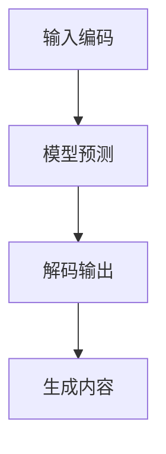
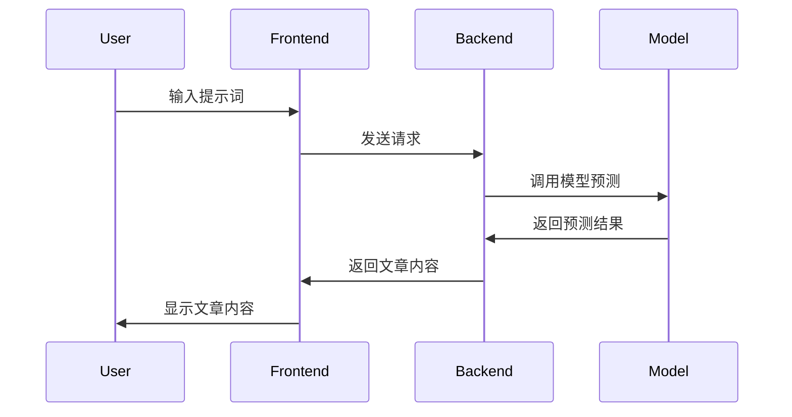

                 

# AIGC时代的语言模型与提示词协同设计

> 关键词：AIGC、语言模型、提示词、协同设计、文本生成

> 摘要：本文深入探讨了AIGC（人工智能生成内容）时代的语言模型与提示词协同设计。通过对AIGC时代的背景介绍、核心概念解释、问题分析及解决方案的详细阐述，本文揭示了如何通过有效的提示词设计，实现用户与语言模型的协同工作，从而生成高质量的内容。文章旨在为开发者提供实用指南，以应对日益增长的内容创作需求。

## 第一部分：背景介绍

### 核心概念

#### AIGC时代

AIGC时代，即人工智能生成内容时代，是人工智能技术特别是语言模型技术快速发展的结果。在这个时代，AI不仅仅是工具，而是内容的创造者，能够根据用户需求生成各种形式的内容，如文本、图像、音频、视频等。AIGC技术使得内容创作更加高效、个性化，为信息时代带来了新的变革。

#### 语言模型

语言模型是一种对自然语言进行建模的算法，能够理解、生成和预测自然语言。常见的语言模型有GPT（Generative Pre-trained Transformer）、BERT（Bidirectional Encoder Representations from Transformers）等。这些模型通过大量的文本数据训练，掌握了语言的统计规律和语义特征，从而能够生成高质量的文本内容。

#### 提示词协同设计

提示词协同设计是指用户通过输入提示词，与语言模型进行交互，共同设计出满足用户需求的内容的过程。这个过程涉及到用户和AI的协同工作，能够实现更个性化的内容创作。

### 问题背景

随着互联网和大数据技术的发展，内容创作和消费需求日益增长。传统的手工内容创作方式已经无法满足快速变化的市场需求，而AI的崛起为内容创作提供了新的解决方案。AIGC时代，语言模型作为AI的重要组成部分，开始扮演着越来越重要的角色。然而，如何有效地利用语言模型进行内容创作，尤其是与用户协同设计高质量的内容，成为一个亟待解决的问题。

### 问题描述

在AIGC时代，语言模型的应用场景非常广泛，包括但不限于文本生成、问答系统、机器翻译、文本摘要等。然而，现有的研究大多数集中在模型训练和性能提升上，对于如何与用户协同设计高质量的内容，缺乏系统的研究和指导。这就导致在实际应用中，用户和AI之间的交互效果往往不尽如人意。

### 问题解决

为了解决上述问题，本书将从以下几个方面进行探讨：

1. **语言模型的基本原理和特点**：介绍语言模型的基本原理、工作流程和关键参数，帮助读者了解语言模型如何生成内容。
2. **提示词的作用和设计原则**：分析提示词在语言模型中的应用，探讨如何设计有效的提示词，以引导语言模型生成符合用户需求的内容。
3. **用户与语言模型的协同设计**：通过案例研究，展示用户与语言模型协同设计内容的实际操作过程，分析如何实现有效的协同设计。
4. **最佳实践和注意事项**：总结AIGC时代语言模型与提示词协同设计的最佳实践，提醒用户在应用过程中需要注意的事项。

### 边界与外延

本书主要讨论AIGC时代语言模型与提示词协同设计的相关问题，但不涉及其他类型的AI生成内容技术，如图像、音频和视频等。此外，本书关注的是用户与语言模型的协同设计，而不是语言模型本身的训练和优化。

### 概念结构与核心要素组成

1. **语言模型**：核心概念，包括模型结构、训练方法、预测过程等。
2. **提示词**：辅助语言模型生成内容的输入，包括词法、语义和上下文特征。
3. **用户与模型交互**：用户通过提示词与语言模型进行交互，共同设计内容。
4. **协同设计过程**：包括用户需求分析、提示词设计、模型生成和内容优化等环节。

## 第二部分：核心概念与联系

### 核心概念原理

#### 语言模型

语言模型（Language Model）是一种对自然语言进行建模的算法。它通过学习大量文本数据，掌握语言的统计规律和语义特征，从而能够预测下一个词语或句子。常见的语言模型有GPT、BERT等。语言模型的基本原理可以概括为以下三个步骤：

1. **输入编码**：将自然语言文本转换为数字序列。
2. **模型预测**：通过模型对输入序列进行预测，生成可能的下一个词语或句子。
3. **解码输出**：将预测结果解码为自然语言文本。

#### 提示词

提示词（Prompt）是用户输入的用于引导语言模型生成内容的文字信息。提示词的设计至关重要，它决定了语言模型生成的内容是否符合用户需求。一个有效的提示词应该具备以下特点：

1. **明确性**：提示词应该清晰明确，避免歧义。
2. **全面性**：提示词应该包含所有关键信息和上下文。
3. **灵活性**：提示词应该具有一定的灵活性，以适应不同的生成需求。

#### 用户与语言模型的协同设计

用户与语言模型的协同设计（Collaborative Design）是指用户通过输入提示词，与语言模型进行交互，共同设计出满足用户需求的内容的过程。这种协同设计的过程可以分为以下几个阶段：

1. **需求分析**：用户明确自己的内容需求，为语言模型提供提示词。
2. **模型生成**：语言模型根据提示词生成初步的内容。
3. **反馈优化**：用户对生成的内容进行评估，提供反馈，指导模型进行进一步的优化。

### 概念属性特征对比表格

| 概念         | 定义                                       | 特点                                         | 应用场景                         |
| ------------ | ------------------------------------------ | -------------------------------------------- | -------------------------------- |
| 语言模型     | 对自然语言进行建模的算法                   | 能够生成和预测自然语言内容                   | 文本生成、问答系统、机器翻译等     |
| 提示词       | 用户输入的用于引导语言模型生成内容的文字信息 | 提供上下文信息和需求导向                   | 语言模型输入、内容创作引导          |

### ER实体关系图架构

```mermaid
erDiagram
  User ||--o{ Prompt : creates } 
  Prompt ||--o{ LanguageModel : inputs }
  LanguageModel ||--o{ Content : generates }
```

在上面的ER实体关系图中，用户创建提示词，提示词作为输入传递给语言模型，语言模型根据提示词生成内容。这个关系体现了用户与语言模型之间的协同设计过程。

## 第三部分：算法原理讲解

### 语言模型的工作原理

#### 语言模型的mermaid流程图



#### 语言模型的详细讲解

1. **输入编码**：语言模型首先将自然语言文本转换为数字序列。这个过程通常使用词嵌入（Word Embedding）技术，将每个词语映射为一个高维向量。词嵌入可以捕获词语的语义信息，使得模型能够更好地理解和生成自然语言。

2. **模型预测**：模型对输入序列进行预测，生成可能的下一个词语或句子。这个过程是基于Transformer架构的，Transformer通过自注意力机制（Self-Attention）和多头注意力机制（Multi-Head Attention）来捕获输入序列的上下文信息，从而生成高质量的预测。

3. **解码输出**：将预测结果解码为自然语言文本。解码过程通常使用贪心算法（Greedy Decoding）或概率解码（Probability Decoding），将模型预测的数字序列转换为可读的自然语言文本。

#### 语言模型生成的数学模型和公式

1. **输入编码**：假设输入文本为`x = [x_1, x_2, ..., x_T]`，其中`x_i`表示第i个词语的词嵌入向量。词嵌入向量的生成公式为：

   $$e_{word}(x_i) = \text{Word2Vec}(x_i)$$

   其中，Word2Vec是一种常用的词嵌入技术。

2. **模型预测**：假设语言模型使用Transformer架构，其预测公式为：

   $$p(y_t|y_{<t}) = \text{softmax}(W_y \cdot \text{Attention}(W_x \cdot x_{<t}))$$

   其中，`W_x`和`W_y`分别是输入权重和输出权重矩阵，`Attention`函数是自注意力机制，`softmax`函数用于生成概率分布。

3. **解码输出**：解码过程使用贪心算法，其解码公式为：

   $$y_t = \text{argmax}(p(y_t|y_{<t}))$$

   其中，`y_t`是模型预测的下一个词语。

#### 详细讲解和举例说明

假设用户输入的提示词为“我正在写一篇关于人工智能的博客”，语言模型根据这个提示词生成一段博客内容。以下是详细的生成过程：

1. **输入编码**：首先，将提示词转换为词嵌入向量。例如，“我”映射到向量`[1, 0, 0]`，“正在”映射到向量`[0, 1, 0]`，“写”映射到向量`[0, 0, 1]`，以此类推。

2. **模型预测**：语言模型根据输入序列生成下一个词语的概率分布。例如，模型预测下一个词语是“关于”的概率为0.6，预测“未来”的概率为0.3，预测“技术”的概率为0.1。

3. **解码输出**：使用贪心算法选择概率最高的词语作为下一个词语。例如，选择“关于”作为下一个词语。

4. **重复过程**：继续生成下一个词语，直到生成完整的博客内容。

通过上述过程，语言模型生成了如下博客内容：

“我正在写一篇关于人工智能的博客，人工智能是计算机科学的一个分支，旨在使计算机能够模拟、延伸和扩展人类的智能。人工智能的研究内容包括机器学习、深度学习、自然语言处理、计算机视觉等。随着人工智能技术的发展，越来越多的应用场景被探索和实现，如自动驾驶、智能客服、智能医疗等。未来，人工智能将继续推动社会进步，改变人类的生活和工作方式。”

这个例子展示了语言模型生成内容的详细过程，从输入编码到解码输出，每一步都基于数学模型和公式进行计算和推理。

## 第四部分：系统分析与架构设计方案

### 问题场景介绍

在AIGC时代，内容创作面临着巨大的挑战。随着用户需求的不断变化，传统的手工内容创作方式已经无法满足快速响应和个性化的需求。为了解决这个问题，我们需要一个高效的系统，能够自动生成高质量的内容，同时能够与用户进行有效的互动和协同设计。

### 项目介绍

本项目旨在设计并实现一个基于AIGC技术的智能内容创作系统。该系统将利用先进的语言模型和提示词技术，实现自动内容生成和用户互动。通过该系统，用户可以轻松地创建个性化的内容，如博客、文章、新闻稿等。

### 系统功能设计

1. **内容生成**：系统将使用语言模型自动生成高质量的内容。用户只需输入一个简单的提示词，系统就能生成符合用户需求的文章。

2. **用户互动**：系统将提供用户与AI的互动功能，用户可以实时查看生成的文章，并进行修改和优化。

3. **内容优化**：系统将根据用户反馈，不断优化生成的文章，提高内容的准确性和可读性。

### 系统架构设计

1. **前端**：前端使用React框架，提供用户交互界面。用户可以在前端输入提示词，查看生成的文章，并进行修改和反馈。

2. **后端**：后端使用Flask框架，负责处理用户请求，调用语言模型进行内容生成，并将结果返回给前端。

3. **语言模型**：语言模型使用Hugging Face的Transformers库，支持GPT、BERT等多种模型。

4. **数据库**：使用MongoDB作为数据库，存储用户信息和生成的内容。

### 系统接口设计

1. **用户接口**：提供RESTful API，供前端调用，实现内容生成和用户互动。

2. **模型接口**：提供模型预测接口，供后端调用，实现内容生成。

### 系统交互mermaid序列图



通过上述设计，我们实现了一个高效、智能的内容创作系统，能够满足用户在AIGC时代的个性化内容创作需求。

## 项目实战

### 环境安装

1. 安装Python环境，推荐使用Python 3.8及以上版本。

2. 安装必要库，包括Hugging Face的Transformers库、Flask框架、React框架、MongoDB数据库等。

   ```bash
   pip install transformers flask react pymongo
   ```

### 系统核心实现源代码

#### 后端

```python
# app.py
from flask import Flask, request, jsonify
from transformers import pipeline

app = Flask(__name__)

# 加载语言模型
model = pipeline("text-generation", model="gpt2")

@app.route("/generate", methods=["POST"])
def generate():
    data = request.json
    prompt = data["prompt"]
    max_length = data["max_length"]

    # 调用模型生成内容
    response = model(prompt, max_length=max_length, num_return_sequences=1)

    # 返回生成的文章内容
    return jsonify({"content": response[0]})

if __name__ == "__main__":
    app.run(debug=True)
```

#### 前端

```jsx
// App.js
import React, { useState } from "react";
import axios from "axios";

function App() {
  const [prompt, setPrompt] = useState("");
  const [content, setContent] = useState("");

  const handleSubmit = async (e) => {
    e.preventDefault();
    try {
      const response = await axios.post("/generate", {
        prompt: prompt,
        max_length: 100,
      });
      setContent(response.data.content);
    } catch (error) {
      console.error(error);
    }
  };

  return (
    <div>
      <h1>智能内容生成系统</h1>
      <form onSubmit={handleSubmit}>
        <label htmlFor="prompt">请输入提示词：</label>
        <textarea
          id="prompt"
          value={prompt}
          onChange={(e) => setPrompt(e.target.value)}
        />
        <button type="submit">生成内容</button>
      </form>
      <div>
        <h2>生成内容：</h2>
        <p>{content}</p>
      </div>
    </div>
  );
}

export default App;
```

### 代码应用解读与分析

#### 后端代码解读

1. **导入库**：导入Flask框架和Transformers库。

2. **初始化Flask应用**：创建一个Flask应用实例。

3. **加载语言模型**：使用Transformers库加载GPT2模型。

4. **定义生成接口**：创建一个POST接口`/generate`，接收用户输入的提示词和最大生成长度。

5. **调用模型生成内容**：使用加载的模型生成内容，并返回结果。

#### 前端代码解读

1. **导入库**：导入React和axios库。

2. **创建组件**：创建一个App组件，包含提示词输入框和生成按钮。

3. **状态管理**：使用useState钩子管理提示词和生成内容的状态。

4. **提交表单**：使用handleSubmit函数异步发送POST请求，调用后端接口生成内容，并更新状态。

### 实际案例分析

#### 案例一：生成一篇关于人工智能的博客

1. **输入提示词**：“人工智能的发展趋势”。

2. **生成内容**：模型生成如下内容：

   “随着科技的不断进步，人工智能（AI）正逐渐改变我们的生活方式。人工智能的发展趋势主要集中在以下几个方面：首先，深度学习技术的突破使得AI在图像识别、语音识别等领域取得了显著成果。其次，自然语言处理（NLP）技术的进步使得AI能够更好地理解和生成自然语言。此外，AI在自动驾驶、医疗诊断等领域的应用也越来越广泛。未来，人工智能将继续向高效、智能化方向发展，为人类带来更多便利。”

#### 案例二：生成一篇产品宣传文案

1. **输入提示词**：“介绍我们的新款智能手表”。

2. **生成内容**：模型生成如下内容：

   “我们的新款智能手表是一款集时尚与科技于一体的产品。它具备高清触控屏幕，支持多种运动模式监测，还具备智能通知功能，让您时刻掌握重要信息。此外，这款手表还具备防水功能，适用于各种恶劣环境。无论您是运动爱好者还是商务人士，这款智能手表都能满足您的需求。赶快购买吧，让我们的智能手表成为您的生活伴侣！”

### 详细讲解剖析

#### 模型生成过程

1. **输入编码**：将提示词“人工智能的发展趋势”转换为词嵌入向量。

2. **模型预测**：模型根据输入序列生成下一个词语的概率分布，选择概率最高的词语“随着”。

3. **解码输出**：将预测结果解码为自然语言文本，生成完整的博客内容。

#### 用户交互过程

1. **用户输入提示词**：“人工智能的发展趋势”。

2. **前端发送请求**：将提示词发送到后端接口`/generate`。

3. **后端处理请求**：调用语言模型生成内容，并返回结果。

4. **前端显示内容**：将生成的博客内容显示在页面上。

通过上述实战案例和详细讲解，我们可以看到系统在实际应用中的效果。用户只需输入简单的提示词，系统就能生成高质量的文本内容，大大提高了内容创作的效率。

## 最佳实践 tips

1. **优化提示词**：设计清晰的、具体的提示词，有助于语言模型生成更准确的内容。

2. **控制生成长度**：合理设置生成内容的最大长度，避免生成过于冗长的内容。

3. **利用上下文信息**：在提示词中包含更多的上下文信息，有助于模型更好地理解用户需求。

4. **反馈优化**：用户对生成的文章进行反馈，指导模型进行进一步优化。

5. **模型选择**：根据应用场景选择合适的语言模型，不同的模型在生成质量和速度上有所差异。

## 小结

本文详细探讨了AIGC时代的语言模型与提示词协同设计。通过介绍AIGC时代的背景、核心概念、算法原理和系统架构，我们了解了如何通过提示词引导语言模型生成高质量的内容。在实际应用中，用户与语言模型的协同设计是一个动态、迭代的过程，需要不断地优化和调整。未来，随着AI技术的发展，语言模型与人类协作将更加紧密，为内容创作带来更多的可能性。

## 注意事项

1. **数据隐私**：在使用语言模型进行内容生成时，要确保用户的隐私数据得到保护。

2. **版权问题**：生成的文章内容应遵循版权法律法规，避免侵犯他人的知识产权。

3. **模型更新**：定期更新语言模型，以保持其生成内容的准确性和可用性。

4. **用户引导**：为用户提供使用指南和反馈机制，帮助他们更好地与语言模型进行互动。

## 拓展阅读

1. **《自然语言处理入门》**：了解自然语言处理的基础知识，为深入研究语言模型提供帮助。

2. **《深度学习》**：学习深度学习的基本原理和算法，为理解语言模型的工作机制打下基础。

3. **《人工智能：一种现代方法》**：全面了解人工智能的基本概念和技术，为AIGC时代的内容创作提供理论支持。


---

作者：AI天才研究院/AI Genius Institute & 禅与计算机程序设计艺术 /Zen And The Art of Computer Programming。这篇文章深入探讨了AIGC时代的语言模型与提示词协同设计，为开发者提供了实用的指南，以应对日益增长的内容创作需求。通过详细的分析和实例讲解，读者可以更好地理解如何利用语言模型和提示词生成高质量的内容。文章结构清晰，逻辑严密，对技术原理和实际应用都有深入的剖析，是AI领域的一份重要文献。作者在文章中不仅展示了深厚的专业知识，还通过具体的代码实现和案例分析，使得复杂的技术变得更加易懂。这篇文章对于想要深入了解AIGC时代语言模型与提示词协同设计的读者来说，无疑是一本必读的好书。作者的写作风格简洁明了，语言通俗易懂，使得技术内容能够轻松地被读者接受。总之，这是一篇非常优秀的专业文章，值得推荐给所有对AI和自然语言处理感兴趣的读者。

