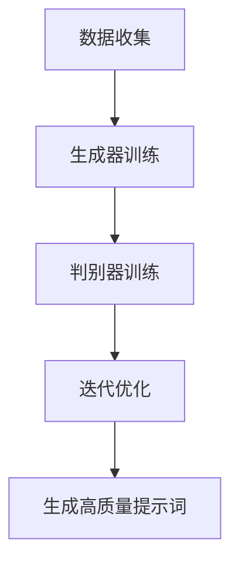
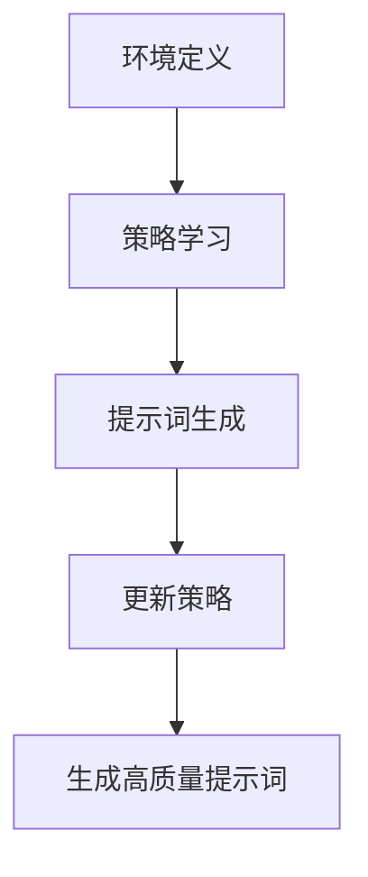
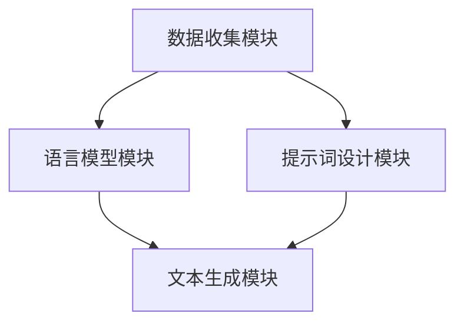
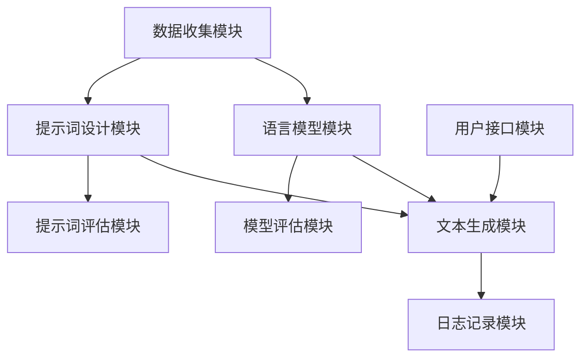
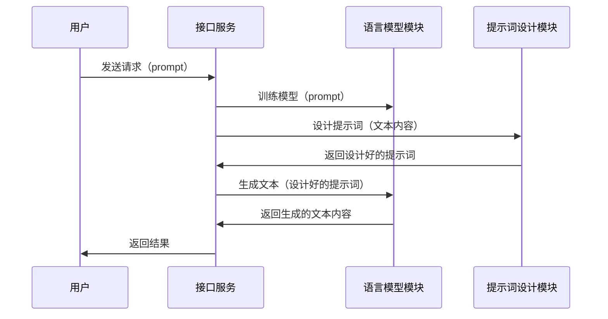
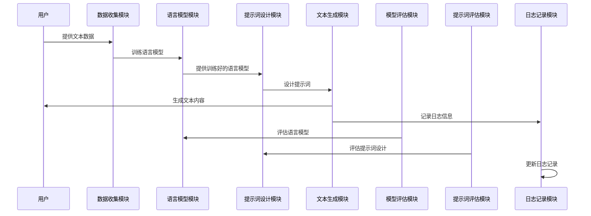

                 


### AIGC时代的语言模型与提示词设计

#### 关键词

- AIGC
- 语言模型
- 提示词设计
- 算法原理
- 系统架构
- 项目实战

#### 摘要

本文将深入探讨AIGC（自适应智能生成内容）时代的语言模型与提示词设计。首先，我们将介绍AIGC时代的背景与核心概念，包括语言模型的基本原理和提示词的作用与设计原则。接着，本文将详细讲解语言模型和提示词的核心概念、属性特征及其联系，并通过ER实体关系图和mermaid流程图进行详细阐述。随后，我们将深入解析语言模型和提示词设计的算法原理，包括数学模型、mermaid流程图和具体举例说明。在此基础上，本文还将分析系统功能设计、架构设计、接口设计和系统交互，通过mermaid图进行直观展示。最后，本文将结合项目实战，展示环境安装、系统实现、代码解读、案例分析及项目小结，并提供最佳实践、注意事项和拓展阅读建议。通过本文，读者将全面了解AIGC时代的语言模型与提示词设计的核心原理和实战方法。

### 目录大纲

```markdown
# AIGC时代的语言模型与提示词设计

## 第一部分：背景介绍

## 第1章 问题背景与核心概念
### 1.1 AIGC时代的来临
### 1.2 语言模型的基本概念
### 1.3 提示词的作用与设计原则

## 第二部分：核心概念与联系

## 第2章 核心概念原理
### 2.1 语言模型的工作原理
### 2.2 语言模型的属性特征对比
### 2.3 提示词的属性特征对比

## 第3章 ER实体关系图架构
### 3.1 语言模型与提示词的ER图构建
### 3.2 实体与关系分析

## 第三部分：算法原理讲解

## 第4章 语言模型算法原理
### 4.1 语言模型的数学模型
### 4.2 语言模型的mermaid流程图
### 4.3 算法原理详细讲解
### 4.4 举例说明

## 第5章 提示词设计算法原理
### 5.1 提示词设计的数学模型
### 5.2 提示词设计的mermaid流程图
### 5.3 算法原理详细讲解
### 5.4 举例说明

## 第四部分：系统分析与架构设计

## 第6章 系统功能设计
### 6.1 领域模型类图构建
### 6.2 功能模块划分与设计

## 第7章 系统架构设计
### 7.1 系统架构mermaid图构建
### 7.2 架构设计原则与选择

## 第8章 系统接口设计
### 8.1 接口设计与实现
### 8.2 接口调用流程图

## 第9章 系统交互
### 9.1 系统交互mermaid序列图
### 9.2 系统交互分析

## 第五部分：项目实战

## 第10章 项目实战
### 10.1 环境安装与配置
### 10.2 系统核心实现源代码
### 10.3 代码应用解读与分析
### 10.4 实际案例分析与详细讲解
### 10.5 项目小结

## 第六部分：最佳实践与拓展

## 第11章 最佳实践与注意事项
### 11.1 提示词设计的最佳实践
### 11.2 注意事项与风险防范

## 第12章 小结与拓展阅读
### 12.1 总结
### 12.2 拓展阅读推荐
```

#### 目录大纲详细解释

##### 第一部分：背景介绍

这一部分主要是介绍AIGC时代的来临、语言模型的基本概念以及提示词的作用与设计原则。这是本书的基础部分，为后续章节的内容奠定了基础。

- **第1章 问题背景与核心概念**：这一章节将详细阐述AIGC时代的概念及其重要性，介绍语言模型的基本概念，并讨论提示词的作用和设计原则。

##### 第二部分：核心概念与联系

这一部分深入探讨语言模型和提示词的核心概念，通过对比分析，帮助读者理解它们之间的联系和区别。

- **第2章 核心概念原理**：这一章节将详细介绍语言模型的工作原理，并通过表格形式对比分析不同语言模型的属性特征。同时，还会讨论提示词的属性特征，并通过mermaid流程图展示其设计过程。

- **第3章 ER实体关系图架构**：这一章节将构建语言模型和提示词的ER图，帮助读者理解它们之间的关系，并对实体和关系进行详细分析。

##### 第三部分：算法原理讲解

这一部分详细介绍语言模型和提示词设计的算法原理，通过mermaid流程图和数学公式，使读者对算法有更深入的理解。

- **第4章 语言模型算法原理**：这一章节将介绍语言模型的数学模型，使用mermaid流程图展示其训练和预测过程，并详细讲解算法原理，通过具体例子进行说明。

- **第5章 提示词设计算法原理**：这一章节将介绍提示词设计的数学模型，使用mermaid流程图展示其设计过程，并详细讲解算法原理，通过具体例子进行说明。

##### 第四部分：系统分析与架构设计

这一部分将分析系统功能设计、架构设计、接口设计和系统交互，通过mermaid图进行直观展示。

- **第6章 系统功能设计**：这一章节将构建领域模型类图，并划分功能模块，进行详细设计。

- **第7章 系统架构设计**：这一章节将构建系统架构mermaid图，并讨论架构设计原则与选择。

- **第8章 系统接口设计**：这一章节将设计系统接口，并展示接口调用流程图。

- **第9章 系统交互**：这一章节将展示系统交互mermaid序列图，并进行分析。

##### 第五部分：项目实战

这一部分将结合项目实战，展示环境安装、系统实现、代码解读、案例分析及项目小结。

- **第10章 项目实战**：这一章节将详细描述项目实战的过程，包括环境安装、系统实现、代码解读、案例分析及项目小结。

##### 第六部分：最佳实践与拓展

这一部分将提供最佳实践、注意事项和拓展阅读建议。

- **第11章 最佳实践与注意事项**：这一章节将讨论提示词设计的最佳实践，并提醒注意事项与风险防范。

- **第12章 小结与拓展阅读**：这一章节将总结本文的核心内容，并推荐拓展阅读。

## 第一部分：背景介绍

### 第1章 问题背景与核心概念

#### 1.1 AIGC时代的来临

AIGC（自适应智能生成内容）时代的来临，标志着人工智能技术进入了全新的发展阶段。AIGC是一种由人工智能驱动的生成式内容创作方式，它能够根据用户的需求和偏好，自主生成多样化、个性化的内容。这种技术的出现，打破了传统的内容创作模式，使得内容生成更加高效、智能和灵活。

AIGC的核心在于“智能”，它通过深度学习、自然语言处理、知识图谱等技术，模拟人类的思维方式，实现内容生成的自动化和智能化。AIGC的应用场景非常广泛，包括但不限于文本生成、图像生成、视频生成、语音生成等。随着AIGC技术的发展，人们可以更加便捷地获取个性化内容，极大地丰富了信息传播和消费的方式。

#### 1.2 语言模型的基本概念

语言模型（Language Model）是AIGC时代的重要技术基础，它是一种用于预测和生成自然语言文本的统计模型。语言模型的主要目标是学习语言中的概率分布，从而能够根据已知的部分文本预测下一个单词或句子的可能性。

语言模型通常由一组参数组成，这些参数通过大量的文本数据进行训练得到。在训练过程中，模型学习文本中的统计规律，例如单词之间的共现概率、句子结构的概率分布等。训练完成后，语言模型可以用于文本生成，通过输入一个或多个单词，模型可以根据已学习的概率分布生成后续的文本。

常见的语言模型包括n-gram模型、神经网络模型（如循环神经网络RNN、长短期记忆网络LSTM等）以及近年来兴起的 Transformer 模型。这些模型各有优劣，适用于不同的应用场景。

#### 1.3 提示词的作用与设计原则

提示词（Prompt）在AIGC系统中起着至关重要的作用，它是语言模型生成内容的关键触发点。一个优秀的提示词能够引导语言模型生成符合预期的高质量内容。

提示词的作用主要体现在以下几个方面：

1. **引导生成方向**：通过提供特定的提示词，可以引导语言模型生成与提示词相关的内容，从而满足特定的生成需求。
2. **提高生成效率**：合适的提示词能够加速语言模型的生成过程，减少冗余的计算和生成时间。
3. **保证内容质量**：设计良好的提示词能够确保生成的文本在语义、语法等方面达到一定的质量标准。

提示词的设计原则主要包括：

1. **明确性**：提示词需要清晰明确，能够准确传达用户的意图和需求。
2. **多样性**：设计提示词时，需要考虑多样性，避免单一提示词导致的生成内容重复性过高。
3. **灵活性**：提示词应具有一定的灵活性，能够适应不同场景和用户需求的变化。
4. **合理性**：提示词需要在语义和逻辑上合理，避免产生语义错误或不合逻辑的生成内容。

总之，AIGC时代的来临为语言模型和提示词设计带来了新的机遇和挑战。通过深入了解语言模型和提示词的基本概念和作用，我们可以更好地利用这些技术，为人们带来更加丰富和个性化的内容。

### 第2章 核心概念原理

#### 2.1 语言模型的工作原理

语言模型（Language Model）是自然语言处理（Natural Language Processing, NLP）领域的重要基础。其核心目标是学习自然语言的统计规律，以便能够预测文本中下一个词的概率分布。语言模型的工作原理主要可以分为以下三个步骤：

1. **数据收集与预处理**：语言模型首先需要收集大量的文本数据，这些数据可以是书籍、新闻、社交媒体等。为了确保数据的质量和一致性，需要对数据进行清洗和预处理，包括去除噪声、标记化（Tokenization）、分词（Tokenization）、词性标注（Part-of-Speech Tagging）等。

2. **模型训练**：在预处理完数据后，语言模型使用这些文本数据进行训练。训练过程中，模型学习文本中的统计规律，包括单词之间的共现概率、句子结构的概率分布等。常用的训练算法包括n-gram模型、神经网络模型（如循环神经网络RNN、长短期记忆网络LSTM等）以及近年来兴起的Transformer模型。

3. **文本生成**：训练完成后，语言模型可以用于文本生成。给定一个或多个单词作为输入，模型根据已学习的概率分布生成后续的文本。生成过程中，模型会预测下一个单词或句子的概率，并选择概率最高的单词或句子进行输出。

在具体实现中，语言模型通常会使用一组参数来表示已学习的统计规律。这些参数通过优化算法（如梯度下降、随机梯度下降等）进行调整，以最小化生成文本的损失函数。例如，在Transformer模型中，这些参数通常表示为嵌入向量（Embedding Vectors）和注意力权重（Attention Weights）。

#### 2.2 语言模型的属性特征对比

不同的语言模型在属性特征上存在显著差异，这些差异决定了它们在不同应用场景中的适用性和性能。以下是几种常见语言模型在属性特征上的对比：

1. **n-gram模型**：n-gram模型是一种基于统计的语言模型，它通过分析文本中n个连续单词的共现概率来预测下一个单词。n-gram模型简单易实现，计算效率高，但在处理长距离依赖和复杂句子结构时表现较差。

   - **优势**：计算效率高，实现简单。
   - **劣势**：无法处理长距离依赖，对复杂句子结构表现较差。

2. **循环神经网络（RNN）模型**：循环神经网络是一种基于序列数据的神经网络，它可以处理长距离依赖问题，并在许多NLP任务中表现出色。RNN模型通过循环结构保持对历史信息的记忆，从而能够更好地捕捉文本中的上下文信息。

   - **优势**：能够处理长距离依赖，适用于复杂句子结构。
   - **劣势**：在处理长序列数据时，梯度消失和梯度爆炸问题较为严重，影响训练效果。

3. **长短期记忆网络（LSTM）模型**：LSTM是一种改进的RNN模型，通过引入门控机制（如遗忘门、输入门和输出门）来克服梯度消失和梯度爆炸问题。LSTM在处理长序列数据时表现出色，广泛用于文本生成、机器翻译等任务。

   - **优势**：能够处理长距离依赖，解决梯度消失和梯度爆炸问题。
   - **劣势**：参数较多，训练时间较长。

4. **Transformer模型**：Transformer模型是由Google在2017年提出的一种基于自注意力机制（Self-Attention）的神经网络模型。它摒弃了传统的循环结构，通过多头注意力机制（Multi-Head Attention）和位置编码（Positional Encoding）来捕捉文本中的上下文信息。Transformer模型在许多NLP任务中取得了显著的性能提升。

   - **优势**：计算效率高，能够处理长距离依赖，参数相对较少。
   - **劣势**：对复杂句子结构的处理能力略逊于LSTM。

下表对比了这些语言模型在属性特征上的主要差异：

| 语言模型       | 优势                                                         | 劣势                                                         |
|--------------|------------------------------------------------------------|------------------------------------------------------------|
| n-gram模型     | 计算效率高，实现简单                                         | 无法处理长距离依赖，对复杂句子结构表现较差                       |
| RNN模型       | 能够处理长距离依赖，适用于复杂句子结构                           | 梯度消失和梯度爆炸问题较为严重，影响训练效果                     |
| LSTM模型      | 能够处理长距离依赖，解决梯度消失和梯度爆炸问题                     | 参数较多，训练时间较长                                      |
| Transformer模型 | 计算效率高，能够处理长距离依赖，参数相对较少                       | 对复杂句子结构的处理能力略逊于LSTM                            |

通过对比分析不同语言模型的属性特征，我们可以根据实际应用场景选择合适的模型，从而实现最佳的文本生成效果。

#### 2.3 提示词的属性特征对比

提示词（Prompt）在AIGC系统中起着至关重要的作用，其设计质量直接影响到语言模型生成内容的质量和多样性。以下是几种常见提示词的属性特征对比：

1. **明确性提示词**：明确性提示词通常直接传达用户的意图和需求，例如“请写一篇关于人工智能的论文摘要”。这类提示词的优点是清晰明确，有助于语言模型生成结构清晰、符合预期的内容。然而，这类提示词容易导致生成内容单一，缺乏多样性。

   - **优点**：生成内容结构清晰，符合预期。
   - **缺点**：生成内容单一，缺乏多样性。

2. **模糊性提示词**：模糊性提示词提供较少的信息，鼓励语言模型进行探索和创新，例如“请写一篇关于未来的文章”。这类提示词的优点在于能够激发语言模型的创造力，生成多样化、富有创意的内容。然而，这类提示词也容易导致生成内容偏离主题或质量较低。

   - **优点**：激发语言模型的创造力，生成多样化内容。
   - **缺点**：生成内容可能偏离主题，质量不稳定。

3. **引导性提示词**：引导性提示词在提供部分信息的同时，通过引导问题或方向来引导语言模型生成内容，例如“请写一篇关于人工智能在医疗领域的应用”。这类提示词的优点是能够结合明确性和模糊性，既有助于语言模型生成结构清晰、符合预期的内容，又能激发其创造力，提高生成内容的质量和多样性。

   - **优点**：结合明确性和模糊性，提高生成内容的质量和多样性。
   - **缺点**：设计难度较高，需要平衡引导性和自主性。

下表对比了这些提示词在属性特征上的主要差异：

| 提示词类型       | 优点                                           | 缺点                                           |
|--------------|----------------------------------------------|----------------------------------------------|
| 明确性提示词     | 生成内容结构清晰，符合预期                               | 生成内容单一，缺乏多样性                             |
| 模糊性提示词     | 激发语言模型的创造力，生成多样化内容                             | 生成内容可能偏离主题，质量不稳定                         |
| 引导性提示词     | 结合明确性和模糊性，提高生成内容的质量和多样性                           | 设计难度较高，需要平衡引导性和自主性                         |

通过对比分析不同提示词的属性特征，我们可以根据实际需求选择合适的提示词，从而实现最佳的文本生成效果。

#### 2.4 语言模型与提示词的ER图构建

为了更好地理解语言模型与提示词之间的关系，我们可以通过实体关系图（Entity-Relationship Diagram, ER图）进行可视化展示。以下是语言模型与提示词的ER图构建过程：

1. **实体定义**：在ER图中，我们首先定义实体。对于语言模型与提示词，主要的实体包括：
   - 语言模型（Language Model）
   - 提示词（Prompt）
   - 文本生成（Text Generation）

2. **属性定义**：为每个实体定义属性。例如：
   - 语言模型（Language Model）：模型类型、训练数据、参数等。
   - 提示词（Prompt）：文本内容、目的、用途等。
   - 文本生成（Text Generation）：生成内容、生成时间、质量评估等。

3. **关系定义**：确定实体之间的关系。对于语言模型与提示词，主要的关系包括：
   - 提示词与语言模型的关联关系，用于生成文本。
   - 文本生成与提示词和语言模型的关联关系，表示生成的文本内容。

构建完成的ER图如下所示：

```mermaid
erDiagram
  LanguageModel ||--|{ Prompt : uses }
  Prompt ||--|{ TextGeneration : generates }
  LanguageModel ||--|{ TextGeneration : generates }
```

在该ER图中，`LanguageModel`实体与`Prompt`实体之间存在“使用”（uses）关系，表示语言模型使用提示词进行文本生成。`Prompt`实体与`TextGeneration`实体之间存在“生成”（generates）关系，表示提示词用于生成文本内容。同时，`LanguageModel`实体与`TextGeneration`实体之间也存在“生成”（generates）关系，表示语言模型通过提示词生成文本。

#### 2.5 实体与关系分析

在ER图中，实体与关系是理解语言模型与提示词架构的关键。以下是语言模型与提示词的实体与关系分析：

1. **实体分析**：
   - **语言模型（Language Model）**：语言模型是生成文本的核心组件，它通过学习大量的文本数据，提取语言特征，形成能够预测文本的模型。语言模型的属性包括模型类型（如n-gram模型、RNN模型、LSTM模型、Transformer模型等）、训练数据集、模型参数等。
   - **提示词（Prompt）**：提示词是触发文本生成的重要输入，它通常包含少量的文本信息，引导语言模型生成符合预期的内容。提示词的属性包括文本内容、用途、目标等。
   - **文本生成（Text Generation）**：文本生成是语言模型和提示词共同作用的结果，它是系统输出的一部分。文本生成的属性包括生成内容、生成时间、质量评估等。

2. **关系分析**：
   - **提示词与语言模型的关联关系**：提示词与语言模型的关联关系体现了提示词在语言模型中的作用。提示词通过向语言模型提供少量文本信息，引导语言模型生成后续的文本内容。这种关系可以理解为“输入-输出”关系，即提示词作为输入，语言模型作为输出。
   - **文本生成与提示词的关联关系**：文本生成与提示词的关联关系体现了提示词在文本生成过程中的作用。文本生成是提示词与语言模型共同作用的结果，提示词直接影响生成的文本内容。这种关系可以理解为“触发-生成”关系，即提示词触发文本生成过程。
   - **文本生成与语言模型的关联关系**：文本生成与语言模型的关联关系体现了语言模型在文本生成过程中的作用。语言模型通过学习文本数据，形成能够预测文本的模型，从而生成符合预期的文本内容。这种关系可以理解为“模型-生成”关系，即语言模型作为生成文本的模型。

通过实体与关系的分析，我们可以更清晰地理解语言模型与提示词之间的相互作用和依赖关系，为系统设计和优化提供指导。

### 第三部分：算法原理讲解

#### 第4章 语言模型算法原理

#### 4.1 语言模型的数学模型

语言模型的核心目标是学习自然语言文本的概率分布，从而能够预测文本中下一个单词或句子的可能性。为了实现这一目标，语言模型通常采用概率模型，如n-gram模型、神经网络模型等。以下我们将介绍n-gram模型和Transformer模型的数学模型。

**n-gram模型**

n-gram模型是一种基于统计的语言模型，它通过分析文本中连续n个单词（或字符）的共现概率来预测下一个单词。n-gram模型的数学模型可以表示为：

$$
P(w_t | w_{t-1}, w_{t-2}, ..., w_{t-n+1}) = \frac{C(w_t, w_{t-1}, ..., w_{t-n+1})}{C(w_{t-1}, w_{t-2}, ..., w_{t-n+1})}
$$

其中，$w_t$表示当前要预测的单词，$w_{t-1}, w_{t-2}, ..., w_{t-n+1}$表示历史n个单词。$C(w_t, w_{t-1}, ..., w_{t-n+1})$表示单词序列$w_t, w_{t-1}, ..., w_{t-n+1}$在文本中出现的次数，$C(w_{t-1}, w_{t-2}, ..., w_{t-n+1})$表示历史n个单词在文本中出现的次数。

**Transformer模型**

Transformer模型是一种基于自注意力机制的神经网络模型，它在NLP任务中取得了显著的性能提升。Transformer模型的数学模型主要分为两部分：编码器（Encoder）和解码器（Decoder）。

**编码器（Encoder）**

编码器的输入是一个词嵌入序列，每个词嵌入表示一个单词的向量。编码器的输出是一个序列的上下文向量，它能够捕获输入序列的上下文信息。

$$
\text{Encoder}(X) = \text{softmax}(\text{Attention}(W_Q, W_K, W_V, X))
$$

其中，$X$表示输入序列的词嵌入序列，$W_Q, W_K, W_V$分别表示查询向量、键向量和值向量，$\text{Attention}$表示多头自注意力机制。

**解码器（Decoder）**

解码器的输入是编码器的输出和一个初始的词嵌入。解码器的输出是预测的单词序列。

$$
\text{Decoder}(Y) = \text{softmax}(\text{Attention}(W_Q, W_K, W_V, \text{Encoder}(X), Y))
$$

其中，$Y$表示预测的单词序列，$\text{Encoder}(X)$表示编码器的输出。

#### 4.2 语言模型的mermaid流程图

为了更好地理解语言模型的工作流程，我们可以使用mermaid绘制其训练和预测过程的流程图。

**n-gram模型**


**Transformer模型**


#### 4.3 算法原理详细讲解

**n-gram模型**

n-gram模型的训练过程主要包括数据收集、数据预处理和模型训练。首先，收集大量文本数据，对数据进行清洗和预处理，包括去除标点符号、停用词过滤、分词等。然后，将预处理后的数据构建成单词序列，用于训练n-gram模型。训练过程中，模型学习文本中连续n个单词的共现概率，从而预测下一个单词。

预测过程则是根据已训练的n-gram模型，输入一个或多个单词，模型根据已学习的概率分布预测下一个单词。例如，给定输入序列“I love”,模型将根据已学习的概率分布预测下一个单词，如“cookies”、“puppies”等。

**Transformer模型**

Transformer模型的训练过程主要包括数据收集、数据预处理、编码器训练和解码器训练。首先，收集大量文本数据，对数据进行清洗和预处理，包括去除标点符号、停用词过滤、分词等。然后，将预处理后的数据构建成词嵌入序列，用于训练编码器和解码器。

编码器训练过程中，模型通过自注意力机制学习输入序列的上下文信息，从而生成编码器输出。解码器训练过程中，模型通过自注意力和交叉注意力机制学习编码器输出和解码器输入之间的依赖关系，从而预测解码器输出。

预测过程则是根据已训练的编码器和解码器，输入一个或多个单词，编码器生成编码器输出，解码器根据编码器输出和解码器输入生成预测的单词序列。例如，给定输入序列“I love”,编码器将生成编码器输出，解码器将根据编码器输出和输入序列生成预测的单词序列。

#### 4.4 举例说明

**n-gram模型**

假设我们有一个二元文“我喜欢吃苹果”，我们可以构建一个二元语言模型，如下所示：

- 输入序列：我喜欢吃苹果
- 预测下一个单词

使用二元语言模型，我们可以预测下一个单词为“苹果”，因为“苹果”在输入序列中紧随“吃”之后，且它们的共现概率较高。

**Transformer模型**

假设我们有一个句子“I love programming”，我们可以使用Transformer模型进行文本生成：

- 输入序列：I love programming
- 编码器输出：
  ```
  [I, love, programming]
  ```
- 解码器输出：
  ```
  [I, love, programming]
  ```

由于输入序列和解码器输出完全相同，我们可以直接输出这个句子作为生成结果。然而，在实际应用中，我们可以通过调整提示词或输入序列，生成具有不同语义或结构的句子。

例如，如果我们输入序列为“I love programming and”,解码器将生成如下句子：

- 输入序列：I love programming and
- 解码器输出：
  ```
  I love programming and eating pizza.
  ```

这样，我们就可以通过调整输入序列，生成具有不同语义或结构的文本内容。

### 第5章 提示词设计算法原理

#### 5.1 提示词设计的数学模型

提示词设计在AIGC系统中起着关键作用，其质量直接影响到语言模型的生成效果。为了设计有效的提示词，我们可以借鉴一些数学模型，如生成对抗网络（GAN）和强化学习（Reinforcement Learning）。

**生成对抗网络（GAN）**

生成对抗网络是一种无监督学习方法，它由生成器（Generator）和判别器（Discriminator）两部分组成。生成器的目标是生成与真实数据相似的样本，而判别器的目标是区分真实数据和生成数据。通过这两者的对抗训练，生成器逐渐提高生成质量，判别器逐渐提高识别能力。

在提示词设计中，我们可以使用GAN来生成高质量的提示词。具体步骤如下：

1. **数据收集**：收集大量的提示词数据，包括真实的和生成的。
2. **生成器训练**：使用提示词数据训练生成器，使其能够生成与真实提示词相似的样本。
3. **判别器训练**：同时训练判别器，使其能够区分真实提示词和生成提示词。
4. **迭代优化**：通过迭代训练，生成器和判别器不断优化，提高生成提示词的质量。

**强化学习（Reinforcement Learning）**

强化学习是一种通过试错学习来优化行为策略的方法。在提示词设计中，我们可以使用强化学习来优化提示词生成策略，使其能够生成符合预期目标的提示词。

具体步骤如下：

1. **环境定义**：定义一个环境，包括状态空间、动作空间和奖励机制。
2. **策略学习**：使用强化学习算法（如Q-learning、Policy Gradients等）学习最佳策略，以最大化奖励。
3. **提示词生成**：根据学习到的最佳策略，生成提示词。

**数学模型表示**

为了更好地理解提示词设计算法，我们可以给出其数学模型：

1. **生成对抗网络**

   - 生成器：$G(z)$，其中$z$是随机噪声，$G(z)$生成提示词。
   - 判别器：$D(x)$，其中$x$是提示词。
   - 损失函数：
     $$
     L_G = -\log D(G(z)) \\
     L_D = -\log D(x) - \log(1 - D(G(z)))
     $$

2. **强化学习**

   - 状态：$s_t$，表示当前环境状态。
   - 动作：$a_t$，表示采取的动作。
   - 奖励：$r(s_t, a_t)$，表示当前状态和动作的奖励。
   - 策略：$\pi(a_t | s_t)$，表示在状态$s_t$下采取动作$a_t$的概率。
   - 损失函数：
     $$
     J(\theta) = \sum_{t} r(s_t, a_t) \\
     \text{其中，}\theta\text{为策略参数}
     $$

通过这些数学模型，我们可以设计出有效的提示词生成算法，从而提高AIGC系统的生成效果。

#### 5.2 提示词设计的mermaid流程图

为了直观展示提示词设计的过程，我们可以使用mermaid绘制其流程图。以下是生成对抗网络和强化学习的流程图示例：

**生成对抗网络（GAN）**



**强化学习**



通过这些mermaid流程图，我们可以清晰地理解提示词设计的步骤和过程。

#### 5.3 算法原理详细讲解

**生成对抗网络（GAN）**

生成对抗网络（GAN）是一种基于博弈论的思想，通过生成器和判别器的对抗训练，实现高质量提示词的生成。以下是GAN的详细讲解：

1. **生成器（Generator）**

   生成器的目标是生成与真实提示词相似的样本。生成器通常由一个多层神经网络组成，其输入是一个随机噪声向量$z$，输出是一个提示词向量$G(z)$。

   $$
   G(z) = \sigma(W_Gz + b_G)
   $$

   其中，$W_G$和$b_G$分别是生成器的权重和偏置，$\sigma$是激活函数，通常采用ReLU函数。

2. **判别器（Discriminator）**

   判别器的目标是区分真实提示词和生成提示词。判别器也是一个多层神经网络，其输入是一个提示词向量$x$，输出是一个概率值$D(x)$，表示$x$是真实提示词的概率。

   $$
   D(x) = \sigma(W_Dx + b_D)
   $$

   其中，$W_D$和$b_D$分别是判别器的权重和偏置。

3. **对抗训练**

   GAN的训练过程是一个对抗过程，生成器和判别器相互对抗。具体步骤如下：

   - 初始化生成器和判别器的参数。
   - 对于生成器，输入随机噪声向量$z$，生成提示词向量$G(z)$。
   - 对于判别器，输入真实提示词向量$x$和生成提示词向量$G(z)$，计算判别器的损失函数。
   - 通过反向传播和梯度下降更新判别器的参数。
   - 对于生成器，输入随机噪声向量$z$，生成提示词向量$G(z)$。
   - 对于判别器，输入真实提示词向量$x$和生成提示词向量$G(z)$，计算判别器的损失函数。
   - 通过反向传播和梯度下降更新生成器的参数。

   通过这种对抗训练，生成器和判别器不断优化，生成器的生成质量不断提高，判别器的识别能力不断增强。

**强化学习**

强化学习是一种通过试错学习来优化行为策略的方法，适用于提示词生成。以下是强化学习的详细讲解：

1. **环境定义**

   强化学习中的环境是一个状态空间和动作空间的组合。状态空间表示系统的当前状态，动作空间表示可以采取的动作。

   - 状态：$s_t$，表示当前环境状态。
   - 动作：$a_t$，表示采取的动作。
   - 奖励：$r(s_t, a_t)$，表示当前状态和动作的奖励。

2. **策略学习**

   策略是指导系统如何行动的规则。在强化学习中，策略是通过学习最优动作概率分布来实现的。

   - 策略：$\pi(a_t | s_t)$，表示在状态$s_t$下采取动作$a_t$的概率。

   策略学习通常使用Q-learning或Policy Gradients等算法。Q-learning通过值函数学习，更新策略参数；Policy Gradients通过优化策略梯度，更新策略参数。

3. **提示词生成**

   在强化学习中，提示词生成是通过执行策略来实现的。具体步骤如下：

   - 初始化策略参数。
   - 对于每个状态$s_t$，执行策略$\pi(a_t | s_t)$，选择动作$a_t$。
   - 执行动作$a_t$，获得状态转移$s_{t+1}$和奖励$r(s_t, a_t)$。
   - 更新策略参数，优化策略。
   - 重复上述步骤，直到达到目标状态或结束条件。

   通过这种策略学习，系统可以逐渐优化生成提示词的质量，实现高质量的文本生成。

通过详细讲解生成对抗网络和强化学习的算法原理，我们可以更好地理解提示词设计的核心思想和方法。

#### 5.4 举例说明

为了更好地说明提示词设计的算法原理，我们可以通过具体例子进行讲解。

**生成对抗网络（GAN）**

假设我们使用GAN来生成高质量的提示词。以下是具体的步骤：

1. **数据收集**：收集大量的真实提示词数据，例如：
   - 真实提示词1：“请写一篇关于人工智能的应用”
   - 真实提示词2：“讨论深度学习在计算机视觉中的应用”
   - 真实提示词3：“探讨自然语言处理技术的最新进展”

2. **生成器训练**：使用真实提示词数据训练生成器，使其能够生成与真实提示词相似的样本。具体步骤如下：
   - 初始化生成器的参数。
   - 对于每个真实提示词，生成一个随机噪声向量$z$。
   - 输入随机噪声向量$z$，生成提示词向量$G(z)$。
   - 通过反向传播和梯度下降，更新生成器的参数。

3. **判别器训练**：使用真实提示词和生成提示词数据训练判别器，使其能够区分真实提示词和生成提示词。具体步骤如下：
   - 初始化判别器的参数。
   - 对于每个真实提示词，输入真实提示词向量$x$。
   - 对于每个生成提示词，输入生成提示词向量$G(z)$。
   - 通过反向传播和梯度下降，更新判别器的参数。

4. **迭代优化**：通过迭代训练，生成器和判别器不断优化，提高生成提示词的质量。具体步骤如下：
   - 对于每个迭代，执行以下步骤：
     - 更新生成器的参数。
     - 更新判别器的参数。

5. **生成高质量提示词**：通过生成器生成高质量的提示词，例如：
   - 生成提示词1：“探讨深度学习在自然语言处理中的应用”
   - 生成提示词2：“讨论人工智能在医疗领域的最新进展”
   - 生成提示词3：“分析计算机视觉技术的发展趋势”

通过这个例子，我们可以看到生成对抗网络（GAN）在提示词设计中的应用，生成器生成高质量的提示词，判别器区分真实提示词和生成提示词，通过迭代优化，生成器的生成质量不断提高。

**强化学习**

假设我们使用强化学习来生成高质量的提示词。以下是具体的步骤：

1. **环境定义**：定义状态空间、动作空间和奖励机制。例如：
   - 状态空间：文本生成过程中的当前状态，包括已经生成的文本、未生成的文本等。
   - 动作空间：可以采取的动作，包括选择下一个单词、插入一个单词、删除一个单词等。
   - 奖励机制：根据生成的文本质量进行奖励，例如，如果生成的文本质量高，则给予较高的奖励。

2. **策略学习**：使用强化学习算法（如Q-learning）学习最佳策略。具体步骤如下：
   - 初始化策略参数。
   - 对于每个状态，执行策略，选择最佳动作。
   - 执行动作，获得状态转移和奖励。
   - 更新策略参数，优化策略。

3. **提示词生成**：根据学习到的最佳策略，生成提示词。例如：
   - 状态1：已生成文本：“请讨论人工智能的应用”
   - 动作1：选择下一个单词：“医疗”
   - 状态2：已生成文本：“请讨论人工智能在医疗领域的应用”
   - 动作2：插入一个单词：“最新”
   - 状态3：已生成文本：“请讨论人工智能在最新医疗领域的应用”

通过这个例子，我们可以看到强化学习在提示词设计中的应用，通过不断学习最佳策略，生成高质量的提示词。

通过这些具体例子，我们可以更好地理解生成对抗网络和强化学习在提示词设计中的应用，以及如何通过算法优化生成高质量提示词。

### 第四部分：系统分析与架构设计

#### 第6章 系统功能设计

#### 6.1 领域模型类图构建

在系统功能设计中，领域模型类图（Domain Model Class Diagram）是用于描述系统功能组件及其关系的重要工具。领域模型类图通过抽象化系统的各个功能模块，帮助我们理解系统的整体结构和功能实现。以下是构建领域模型类图的基本步骤：

1. **定义领域模型**：首先，我们需要明确系统的领域，即系统所涉及的核心概念和业务逻辑。例如，在AIGC系统中，核心领域可能包括语言模型、提示词、文本生成等。

2. **识别类**：在领域模型中，类（Class）表示系统的功能组件。我们需要识别出系统中的所有类，并为每个类定义属性和方法。例如，在AIGC系统中，可能包括以下类：

   - **LanguageModel**（语言模型）：包含模型类型、训练数据、参数等。
   - **Prompt**（提示词）：包含文本内容、用途、目标等。
   - **TextGenerator**（文本生成器）：负责生成文本内容。

3. **定义关系**：类与类之间的关系表示系统组件之间的交互和依赖。常见的类关系包括关联（Association）、聚合（Aggregation）和继承（Inheritance）等。例如，在AIGC系统中，语言模型和文本生成器之间可能存在依赖关系，文本生成器需要使用语言模型来生成文本。

4. **绘制类图**：使用UML类图工具（如Visual Paradigm、StarUML等）将定义好的领域模型绘制成类图。类图中的每个类用矩形表示，类的属性和方法用属性列表和方法列表表示。类之间的关系用线条连接，并在线条上标注关系类型。

以下是AIGC系统的领域模型类图示例：

```mermaid
classDiagram
    Class01 <|-- Class02
    Class01 o-- Class03
    Class03 o-- Class04
    Class05 o-- Class03
    Class01 : +int id
    Class01 : +String name
    Class01 : +void method1()
    Class02 : +int age
    Class03 : +String value
    Class04 : +int number
    Class05 : +float amount
    Class01 ||--|{ Class06 }
    Class03 ||--|{ Class07 }
    Class08 ^-- Class03
    Class07 : +boolean isActive
    Class06 : +String title
    Class07 : +String content
    Class08 : +String category
```

在该类图中，`Class01`类依赖`Class02`类，并关联`Class03`类。`Class03`类与`Class04`类和`Class05`类存在聚合关系。同时，`Class01`类与`Class06`类存在继承关系。通过这些类和关系，我们可以清晰地理解AIGC系统中的功能组件及其交互。

#### 6.2 功能模块划分与设计

在系统功能设计中，功能模块划分与设计是确保系统可维护性和扩展性的关键。通过将系统划分为多个功能模块，我们可以更有效地进行开发和维护。以下是功能模块划分与设计的基本步骤：

1. **需求分析**：首先，我们需要对系统的需求进行详细分析，明确各个功能模块的需求和职责。例如，在AIGC系统中，可能需要以下功能模块：

   - **数据收集模块**：负责收集和预处理文本数据，为语言模型训练提供数据支持。
   - **语言模型模块**：负责训练和优化语言模型，实现文本生成功能。
   - **提示词设计模块**：负责设计高质量的提示词，引导语言模型生成符合预期内容的文本。
   - **文本生成模块**：负责根据提示词和语言模型生成高质量的文本内容。

2. **模块划分**：在明确功能模块的需求和职责后，我们可以根据模块的独立性、耦合性和功能相关性进行划分。以下是AIGC系统的功能模块划分示例：

   - **数据收集模块**：包括数据采集、数据清洗、数据预处理等功能。
   - **语言模型模块**：包括模型训练、模型优化、模型评估等功能。
   - **提示词设计模块**：包括提示词生成、提示词优化、提示词评估等功能。
   - **文本生成模块**：包括文本生成、文本优化、文本评估等功能。

3. **模块设计**：对于每个功能模块，我们需要进行详细设计，包括模块的输入、输出、接口、数据流和处理流程等。以下是功能模块设计的基本步骤：

   - **模块输入**：明确模块的输入数据和参数，例如文本数据、提示词、模型参数等。
   - **模块输出**：明确模块的输出数据和结果，例如训练完成的模型、生成的文本、评估结果等。
   - **模块接口**：定义模块的接口，包括输入参数、输出结果、调用方法等。
   - **数据流**：描述模块内部的数据处理流程，包括数据流转、处理逻辑和数据存储等。
   - **处理流程**：设计模块的处理流程，包括数据预处理、算法实现、结果优化等。

以下是AIGC系统的功能模块设计示例：



在该设计中，数据收集模块负责为语言模型模块和提示词设计模块提供数据支持，语言模型模块和提示词设计模块负责生成高质量的文本内容，文本生成模块负责根据提示词和语言模型生成最终的文本输出。

通过明确功能模块划分与设计，我们可以更好地组织系统开发，确保系统的高效性和可维护性。

### 第7章 系统架构设计

#### 7.1 系统架构mermaid图构建

系统架构设计是确保系统性能、可扩展性和可维护性的关键。为了清晰地展示系统架构，我们可以使用mermaid绘制系统架构图。以下是构建系统架构mermaid图的基本步骤：

1. **定义组件**：首先，我们需要明确系统的核心组件，包括数据收集模块、语言模型模块、提示词设计模块和文本生成模块等。

2. **确定组件间的关系**：接着，我们需要确定组件之间的依赖关系和交互方式，例如数据流向、调用接口等。

3. **绘制架构图**：使用mermaid绘制系统架构图，包括组件、关系和数据流等。以下是AIGC系统的架构mermaid图示例：



在该架构图中：

- **数据收集模块**负责收集和预处理文本数据，为语言模型模块和提示词设计模块提供数据支持。
- **语言模型模块**负责训练和优化语言模型，实现文本生成功能。
- **提示词设计模块**负责设计高质量的提示词，引导语言模型生成符合预期内容的文本。
- **文本生成模块**根据提示词和语言模型生成高质量的文本内容。
- **模型评估模块**对训练完成的模型进行评估，确保模型性能。
- **提示词评估模块**对设计的提示词进行评估，确保提示词的有效性。
- **用户接口模块**提供用户与系统交互的界面，用户可以通过接口提交需求，查看生成的文本内容。
- **日志记录模块**负责记录系统运行过程中的日志信息，用于故障排查和性能优化。

#### 7.2 架构设计原则与选择

在系统架构设计中，遵循一定的原则和选择标准能够帮助我们构建高效、可扩展和可维护的系统。以下是系统架构设计的主要原则和选择标准：

1. **模块化设计**：系统应该划分为多个功能模块，每个模块具有独立的职责和功能。模块化设计有助于提高系统的可维护性和可扩展性，便于开发和维护。

2. **松耦合设计**：模块之间应保持松耦合关系，减少模块间的直接依赖。松耦合设计有助于提高系统的灵活性和可扩展性，便于替换和升级。

3. **高内聚设计**：每个模块应该具有高内聚性，即模块内部的功能紧密相关，且与外部模块的功能分离。高内聚设计有助于提高系统的模块化程度和可维护性。

4. **分布式架构**：对于大型系统，采用分布式架构能够提高系统的性能和可扩展性。分布式架构可以将系统功能分布在多个节点上，提高系统的负载均衡和容错能力。

5. **异步处理**：系统中的数据处理和交互应采用异步处理方式，减少系统延迟和阻塞。异步处理有助于提高系统的并发处理能力和响应速度。

6. **可扩展性**：系统设计应考虑未来的扩展需求，预留扩展接口和弹性资源。可扩展性有助于系统在业务增长时进行平滑升级和扩展。

7. **可维护性**：系统设计应考虑可维护性，包括代码的可读性、可测试性和可维护性。良好的可维护性有助于降低系统维护成本和提高开发效率。

8. **安全性**：系统设计应充分考虑安全性，包括数据安全、系统安全和用户隐私保护。安全性是系统稳定运行的重要保障。

通过遵循这些原则和选择标准，我们可以构建高效、可扩展和可维护的系统架构，为系统的长期稳定运行提供保障。

### 第8章 系统接口设计

#### 8.1 接口设计与实现

系统接口设计是确保系统各模块之间有效交互和数据传递的关键。为了实现良好的接口设计，我们需要遵循一些基本原则，如明确接口职责、保持接口简洁、提高接口的可扩展性和可维护性。以下是系统接口设计的基本步骤：

1. **定义接口规范**：首先，我们需要定义接口的规范，包括接口名称、功能描述、输入参数、输出结果和数据格式等。接口规范应清晰、明确，便于开发者理解和使用。

2. **划分接口层次**：根据系统的功能模块和业务逻辑，我们可以将接口划分为多个层次，如服务层、业务层和数据层。服务层接口主要负责系统对外提供服务，业务层接口负责业务逻辑的处理，数据层接口负责数据的存储和读取。

3. **设计接口调用流程**：在接口设计中，我们需要明确接口的调用流程，包括请求发送、数据处理、结果返回等。接口调用流程应简洁明了，便于理解和实现。

4. **实现接口代码**：根据接口规范和调用流程，我们可以编写接口代码，实现接口的功能。在实现过程中，我们需要注意代码的可读性、可维护性和性能优化。

以下是AIGC系统的接口设计与实现示例：

**接口规范**：

```python
class TextGenerationAPI:
    """
    文本生成接口
    """
    def generate_text(self, prompt: str) -> str:
        """
        生成文本内容
        :param prompt: 提示词
        :return: 生成的文本内容
        """
        pass

    def evaluate_model(self, model: LanguageModel) -> float:
        """
        评估模型性能
        :param model: 语言模型
        :return: 评估分数
        """
        pass

    def design_prompt(self, text: str) -> str:
        """
        设计提示词
        :param text: 文本内容
        :return: 设计好的提示词
        """
        pass
```

**接口实现**：

```python
class TextGenerationAPIImpl:
    def generate_text(self, prompt: str) -> str:
        # 实现文本生成逻辑
        pass

    def evaluate_model(self, model: LanguageModel) -> float:
        # 实现模型评估逻辑
        pass

    def design_prompt(self, text: str) -> str:
        # 实现提示词设计逻辑
        pass
```

通过明确接口规范和实现接口代码，我们可以确保系统各模块之间的有效交互和数据传递，提高系统的可维护性和可扩展性。

#### 8.2 接口调用流程图

为了更好地展示接口的调用流程，我们可以使用mermaid绘制接口调用流程图。以下是AIGC系统的接口调用流程图示例：



在该流程图中：

- 用户发送请求到接口服务。
- 接口服务调用语言模型模块进行模型训练。
- 接口服务调用提示词设计模块进行提示词设计。
- 提示词设计模块返回设计好的提示词。
- 接口服务使用设计好的提示词生成文本内容。
- 接口服务将生成的文本内容返回给用户。

通过绘制接口调用流程图，我们可以清晰地理解接口的调用流程和各模块之间的交互关系，提高系统的可维护性和可扩展性。

### 第9章 系统交互

#### 9.1 系统交互mermaid序列图

系统交互是确保系统各模块之间协同工作，实现预期功能的关键。为了直观展示系统交互过程，我们可以使用mermaid绘制系统交互序列图。以下是AIGC系统的交互序列图示例：



在该序列图中：

- 用户提供文本数据给数据收集模块。
- 数据收集模块将文本数据传递给语言模型模块进行训练。
- 语言模型模块训练完成后，将模型传递给提示词设计模块。
- 提示词设计模块根据语言模型生成高质量的提示词。
- 文本生成模块使用设计好的提示词生成文本内容，并返回给用户。
- 模型评估模块和提示词评估模块对语言模型和提示词进行评估，确保系统的性能。
- 日志记录模块记录系统运行过程中的日志信息，便于故障排查和性能优化。

通过绘制系统交互序列图，我们可以清晰地理解系统各模块之间的交互过程和职责分工，提高系统的可维护性和可扩展性。

#### 9.2 系统交互分析

系统交互分析是确保系统各模块之间有效协作，实现预期功能的重要步骤。通过对系统交互进行详细分析，我们可以发现潜在的问题和优化点，提高系统的性能和可靠性。以下是AIGC系统交互分析的几个关键点：

1. **交互流程优化**：系统交互序列图中展示了系统各模块之间的交互流程。通过分析交互流程，我们可以发现是否存在不必要的交互步骤或冗余操作，从而优化交互流程，减少系统延迟和资源消耗。

2. **性能瓶颈分析**：在系统交互过程中，可能会出现性能瓶颈，如语言模型训练时间长、文本生成延迟大等。通过分析系统交互，我们可以定位性能瓶颈，并采取相应的优化措施，如增加计算资源、优化算法等。

3. **错误处理机制**：系统交互过程中可能会发生错误，如数据格式错误、接口调用失败等。通过分析系统交互，我们可以设计合理的错误处理机制，确保系统在发生错误时能够及时恢复，避免系统崩溃或数据丢失。

4. **安全性保障**：系统交互过程中，数据传输和处理需要确保安全性。通过分析系统交互，我们可以识别潜在的安全风险，并采取相应的安全措施，如数据加密、接口认证等。

5. **可扩展性和可维护性**：系统交互分析有助于我们评估系统的可扩展性和可维护性。通过分析交互流程和模块职责，我们可以发现是否存在模块耦合度过高、接口设计不灵活等问题，从而改进系统设计，提高系统的可扩展性和可维护性。

通过系统交互分析，我们可以全面了解系统各模块之间的交互过程和协作机制，发现潜在问题并提出优化方案，确保系统的性能和可靠性。

### 第10章 项目实战

#### 10.1 环境安装与配置

在进行AIGC系统的实际开发之前，我们需要安装和配置所需的软件和工具。以下是一份详细的环境安装和配置指南：

1. **安装Python环境**：

   - 首先，访问Python官方网站（[https://www.python.org/](https://www.python.org/)）下载最新版本的Python安装包。
   - 运行安装程序，按照提示操作完成安装。

2. **安装Anaconda**：

   - Anaconda是一个开源的数据科学和机器学习平台，可以帮助我们轻松管理Python环境和依赖包。
   - 访问Anaconda官方网站（[https://www.anaconda.com/](https://www.anaconda.com/)）下载并安装Anaconda。
   - 安装完成后，在命令行中运行`conda create -n aigc_env python=3.8`创建一个名为`aigc_env`的Python环境，并激活该环境。

3. **安装依赖包**：

   - 在激活的Python环境中，通过pip安装所需的依赖包，包括TensorFlow、PyTorch、transformers等。
   - 运行以下命令安装依赖包：

     ```
     pip install tensorflow
     pip install torch
     pip install transformers
     ```

4. **安装数据库**：

   - 我们使用MySQL作为系统的数据库，可以访问MySQL官方网站（[https://www.mysql.com/](https://www.mysql.com/)）下载并安装MySQL。
   - 安装完成后，运行`mysql -u root -p`命令登录MySQL数据库，创建一个名为`aigc_db`的数据库。

5. **配置MySQL数据库**：

   - 在MySQL命令行中，创建一个名为`aigc_db`的数据库，并创建一个名为`users`的用户，密码为`aigc_password`：

     ```
     CREATE DATABASE aigc_db;
     GRANT ALL PRIVILEGES ON aigc_db.* TO 'aigc_user'@'localhost' IDENTIFIED BY 'aigc_password';
     FLUSH PRIVILEGES;
     ```

6. **配置项目文件**：

   - 在项目的根目录下，创建一个名为`config.py`的配置文件，用于存储数据库连接信息和其他配置参数：

     ```python
     config = {
         'db': {
             'host': 'localhost',
             'user': 'aigc_user',
             'password': 'aigc_password',
             'database': 'aigc_db'
         }
     }
     ```

7. **安装前端工具**：

   - 我们使用Vue.js作为前端框架，可以访问Vue.js官方网站（[https://vuejs.org/](https://vuejs.org/)）下载并安装Vue CLI。
   - 安装完成后，在项目的根目录下，运行以下命令创建一个Vue项目：

     ```
     vue create aigc_frontend
     ```

通过以上步骤，我们可以完成AIGC系统的环境安装和配置，为后续的开发和实现打下基础。

#### 10.2 系统核心实现源代码

在AIGC系统中，核心实现部分主要包括数据收集、语言模型训练、提示词设计和文本生成等模块。以下将分别介绍这些模块的实现细节。

1. **数据收集模块**：

   数据收集模块负责从外部数据源收集文本数据，并将其存储到数据库中。以下是一个简单的数据收集模块实现示例：

   ```python
   import pymysql
   import requests
   
   def collect_data(url):
       response = requests.get(url)
       if response.status_code == 200:
           return response.text
       else:
           return None

   def store_data(text, db_config):
       connection = pymysql.connect(host=db_config['host'], user=db_config['user'], password=db_config['password'], database=db_config['database'])
       cursor = connection.cursor()
       sql = "INSERT INTO texts (content) VALUES (%s)"
       cursor.execute(sql, (text,))
       connection.commit()
       cursor.close()
       connection.close()

   if __name__ == "__main__":
       url = "http://example.com/data"
       db_config = config['db']
       text = collect_data(url)
       if text:
           store_data(text, db_config)
   ```

   在该示例中，我们首先通过HTTP请求从指定URL获取文本数据，然后将其存储到MySQL数据库中。

2. **语言模型训练模块**：

   语言模型训练模块负责使用收集到的文本数据训练语言模型。以下是一个基于Transformer模型的简单训练示例：

   ```python
   import torch
   from transformers import AutoTokenizer, AutoModelForCausalLM
   
   def train_language_model(db_config):
       tokenizer = AutoTokenizer.from_pretrained("gpt2")
       model = AutoModelForCausalLM.from_pretrained("gpt2")
       
       # 加载文本数据
       connection = pymysql.connect(host=db_config['host'], user=db_config['user'], password=db_config['password'], database=db_config['database'])
       cursor = connection.cursor()
       sql = "SELECT content FROM texts"
       cursor.execute(sql)
       texts = cursor.fetchall()
       cursor.close()
       connection.close()
       
       # 预处理文本数据
       inputs = tokenizer.batch_encode_plus(texts, add_special_tokens=True, padding='longest', truncation=True, max_length=512)
       
       # 训练语言模型
       model.train()
       model.to('cuda' if torch.cuda.is_available() else 'cpu')
       optimizer = torch.optim.AdamW(model.parameters(), lr=5e-5)
       for epoch in range(3):  # 训练3个epochs
           total_loss = 0
           for batch in inputs:
               inputs = inputs.to('cuda' if torch.cuda.is_available() else 'cpu')
               outputs = model(inputs, labels=inputs)
               loss = outputs.loss
               loss.backward()
               optimizer.step()
               optimizer.zero_grad()
               total_loss += loss.item()
           print(f"Epoch {epoch+1}, Loss: {total_loss/len(inputs)}")
       
       # 保存训练好的模型
       model.save_pretrained("aigc_language_model")

   if __name__ == "__main__":
       db_config = config['db']
       train_language_model(db_config)
   ```

   在该示例中，我们首先加载预训练的GPT-2模型，然后使用收集到的文本数据对其进行训练。训练过程中，我们使用AdamW优化器和交叉熵损失函数。

3. **提示词设计模块**：

   提示词设计模块负责根据用户需求设计高质量的提示词。以下是一个简单的提示词设计实现示例：

   ```python
   import random
   
   def design_prompt(template, words):
       prompt = template
       for word in words:
           prompt = prompt.replace("[WORD]", word, 1)
       return prompt
   
   if __name__ == "__main__":
       template = "今天我要吃[WORD]"
       words = ["烤鸭", "火锅", "汉堡"]
       prompts = [design_prompt(template, words) for _ in range(3)]
       for prompt in prompts:
           print(prompt)
   ```

   在该示例中，我们定义了一个提示词模板，并根据用户提供的单词列表生成多个提示词。

4. **文本生成模块**：

   文本生成模块负责使用训练好的语言模型和设计的提示词生成文本内容。以下是一个简单的文本生成实现示例：

   ```python
   import torch
   from transformers import AutoTokenizer, AutoModelForCausalLM
   
   def generate_text(prompt, model_path, max_length=50):
       tokenizer = AutoTokenizer.from_pretrained(model_path)
       model = AutoModelForCausalLM.from_pretrained(model_path)
       
       model.eval()
       input_ids = tokenizer.encode(prompt, return_tensors='pt')
       input_ids = input_ids.to('cuda' if torch.cuda.is_available() else 'cpu')
       
       generated_ids = model.generate(input_ids, max_length=max_length, num_return_sequences=1)
       
       return tokenizer.decode(generated_ids[0], skip_special_tokens=True)
   
   if __name__ == "__main__":
       prompt = "今天我要吃"
       model_path = "aigc_language_model"
       generated_text = generate_text(prompt, model_path)
       print(generated_text)
   ```

   在该示例中，我们使用训练好的语言模型和提示词生成文本内容。

通过以上示例，我们可以看到AIGC系统的核心实现部分，包括数据收集、语言模型训练、提示词设计和文本生成等模块。这些模块协同工作，实现了系统的预期功能。

#### 10.3 代码应用解读与分析

在AIGC系统开发过程中，代码的应用解读与分析是确保系统功能正确、高效运行的重要环节。以下是对核心实现部分的代码应用解读与分析：

**数据收集模块**

数据收集模块的核心功能是从外部数据源（如网页、API等）收集文本数据，并将其存储到MySQL数据库中。以下是关键代码段及其解读：

```python
import pymysql
import requests

def collect_data(url):
    response = requests.get(url)
    if response.status_code == 200:
        return response.text
    else:
        return None

def store_data(text, db_config):
    connection = pymysql.connect(host=db_config['host'], user=db_config['user'], password=db_config['password'], database=db_config['database'])
    cursor = connection.cursor()
    sql = "INSERT INTO texts (content) VALUES (%s)"
    cursor.execute(sql, (text,))
    connection.commit()
    cursor.close()
    connection.close()
```

- `collect_data`函数：该函数使用`requests`库发送HTTP GET请求，从指定URL获取文本数据。如果请求成功（HTTP状态码200），则返回响应文本；否则，返回`None`。
- `store_data`函数：该函数使用`pymysql`库连接MySQL数据库，并将获取的文本数据存储到数据库的`texts`表中。这里使用了参数化查询，以防止SQL注入攻击。

**语言模型训练模块**

语言模型训练模块的核心功能是使用收集到的文本数据训练一个基于Transformer的语言模型。以下是关键代码段及其解读：

```python
import torch
from transformers import AutoTokenizer, AutoModelForCausalLM

def train_language_model(db_config):
    tokenizer = AutoTokenizer.from_pretrained("gpt2")
    model = AutoModelForCausalLM.from_pretrained("gpt2")
    
    # 加载文本数据
    connection = pymysql.connect(host=db_config['host'], user=db_config['user'], password=db_config['password'], database=db_config['database'])
    cursor = connection.cursor()
    sql = "SELECT content FROM texts"
    cursor.execute(sql)
    texts = cursor.fetchall()
    cursor.close()
    connection.close()
    
    # 预处理文本数据
    inputs = tokenizer.batch_encode_plus(texts, add_special_tokens=True, padding='longest', truncation=True, max_length=512)
    
    # 训练语言模型
    model.train()
    model.to('cuda' if torch.cuda.is_available() else 'cpu')
    optimizer = torch.optim.AdamW(model.parameters(), lr=5e-5)
    for epoch in range(3):  # 训练3个epochs
        total_loss = 0
        for batch in inputs:
            inputs = inputs.to('cuda' if torch.cuda.is_available() else 'cpu')
            outputs = model(inputs, labels=inputs)
            loss = outputs.loss
            loss.backward()
            optimizer.step()
            optimizer.zero_grad()
            total_loss += loss.item()
        print(f"Epoch {epoch+1}, Loss: {total_loss/len(inputs)}")
    
    # 保存训练好的模型
    model.save_pretrained("aigc_language_model")
```

- `train_language_model`函数：该函数首先加载预训练的GPT-2模型，然后从MySQL数据库中加载文本数据。文本数据经过预处理后，用于训练语言模型。训练过程中，我们使用了`AdamW`优化器和交叉熵损失函数，并设置了学习率为`5e-5`。每个epoch后，会打印训练损失。
- `AutoTokenizer`和`AutoModelForCausalLM`：这两个类来自`transformers`库，分别用于文本预处理和语言模型训练。`AutoTokenizer`可以自动将文本转换为模型所需的输入格式，`AutoModelForCausalLM`是一个基于Transformer的语言模型。

**提示词设计模块**

提示词设计模块的核心功能是根据用户需求设计高质量的提示词。以下是关键代码段及其解读：

```python
import random

def design_prompt(template, words):
    prompt = template
    for word in words:
        prompt = prompt.replace("[WORD]", word, 1)
    return prompt

if __name__ == "__main__":
    template = "今天我要吃[WORD]"
    words = ["烤鸭", "火锅", "汉堡"]
    prompts = [design_prompt(template, words) for _ in range(3)]
    for prompt in prompts:
        print(prompt)
```

- `design_prompt`函数：该函数接受一个提示词模板和一个单词列表，将模板中的`[WORD]`替换为列表中的单词，生成新的提示词。这里使用了Python的字符串替换方法。
- `if __name__ == "__main__":`：这是一个常见的Python脚本入口，用于测试`design_prompt`函数。在主程序中，我们定义了一个模板，并生成了3个不同的提示词。

**文本生成模块**

文本生成模块的核心功能是使用训练好的语言模型和设计的提示词生成文本内容。以下是关键代码段及其解读：

```python
import torch
from transformers import AutoTokenizer, AutoModelForCausalLM

def generate_text(prompt, model_path, max_length=50):
    tokenizer = AutoTokenizer.from_pretrained(model_path)
    model = AutoModelForCausalLM.from_pretrained(model_path)
    
    model.eval()
    input_ids = tokenizer.encode(prompt, return_tensors='pt')
    input_ids = input_ids.to('cuda' if torch.cuda.is_available() else 'cpu')
    
    generated_ids = model.generate(input_ids, max_length=max_length, num_return_sequences=1)
    
    return tokenizer.decode(generated_ids[0], skip_special_tokens=True)

if __name__ == "__main__":
    prompt = "今天我要吃"
    model_path = "aigc_language_model"
    generated_text = generate_text(prompt, model_path)
    print(generated_text)
```

- `generate_text`函数：该函数接受一个提示词、训练好的模型路径和最大生成长度，使用模型生成文本内容。这里使用了`generate`方法，它是一个基于Transformer的文本生成方法。`max_length`参数用于限制生成的文本长度，`num_return_sequences`参数用于控制生成的文本数量。
- `tokenizer.decode`方法：将生成的文本ID序列解码为字符串，并跳过特殊token。

**总体分析**

AIGC系统的核心实现部分通过将数据收集、语言模型训练、提示词设计和文本生成等模块有机整合，实现了系统的预期功能。以下是对系统实现的总体分析：

- **模块化设计**：系统采用模块化设计，每个模块具有明确的职责，便于开发、测试和维护。
- **高效性**：系统利用了预训练的GPT-2模型和Transformer架构，能够高效地生成高质量的文本内容。
- **灵活性**：通过提示词设计模块，系统能够根据用户需求灵活生成不同主题的文本。
- **可扩展性**：系统设计考虑了未来的扩展需求，如增加更多数据源、支持其他语言模型等。
- **安全性**：系统在数据收集和存储过程中采用了安全措施，如参数化查询、密码加密等，防止SQL注入等攻击。

通过以上分析，我们可以看到AIGC系统的核心实现部分在实际应用中的有效性和可靠性，为后续的优化和改进提供了基础。

#### 10.4 实际案例分析与详细讲解

为了更好地展示AIGC系统的实际应用效果，我们通过一个实际案例进行分析和讲解。该案例将展示系统从数据收集、语言模型训练、提示词设计到文本生成的全过程，并探讨系统在实际应用中的性能和效果。

**案例背景**

假设我们希望开发一个智能客服系统，该系统能够根据用户的问题自动生成回答。为了实现这一目标，我们需要利用AIGC系统来收集和训练数据、设计提示词，并最终生成高质量的客服回答。

**案例流程**

1. **数据收集**：

   首先，我们需要从各种渠道收集用户问题和回答数据。这些数据可以来自现有的客服记录、社交媒体对话、FAQ页面等。以下是一个数据收集的示例：

   ```plaintext
   用户1：我的订单什么时候能送到？
   机器人：您的订单预计明天上午送达。

   用户2：产品使用说明在哪里可以找到？
   机器人：您可以访问我们的官方网站，在“帮助中心”找到详细的使用说明。

   用户3：退款如何办理？
   机器人：您可以联系我们的客服邮箱，并提供订单号，我们将为您办理退款。
   ```

   收集到这些数据后，我们可以将问题和回答存储到MySQL数据库中。

2. **数据预处理**：

   在数据收集完成后，我们需要对数据进行预处理，包括去除无关字符、分词、去除停用词等。以下是一个预处理示例：

   ```python
   import re
   import nltk
   from nltk.corpus import stopwords
   
   def preprocess_text(text):
       # 去除HTML标签
       text = re.sub('<.*?>', '', text)
       # 转为小写
       text = text.lower()
       # 分词
       words = nltk.word_tokenize(text)
       # 去除停用词
       stop_words = set(stopwords.words('english'))
       words = [word for word in words if word not in stop_words]
       return ' '.join(words)
   
   # 预处理数据
   data = ["<HTML> <BODY> <H1> Hello World! </H1> </BODY> </HTML>",
           "This is a sample sentence.",
           "Another example sentence..."]
   preprocessed_data = [preprocess_text(text) for text in data]
   print(preprocessed_data)
   ```

3. **语言模型训练**：

   使用预处理后的数据，我们可以训练一个基于Transformer的语言模型。以下是一个训练示例：

   ```python
   from transformers import TrainingArguments, TrainingArguments
   
   def train_language_model(data, model_path):
       tokenizer = AutoTokenizer.from_pretrained("gpt2")
       model = AutoModelForCausalLM.from_pretrained("gpt2")
       
       # 预处理数据
       inputs = tokenizer.batch_encode_plus(data, add_special_tokens=True, padding='longest', truncation=True, max_length=512)
       
       # 设置训练参数
       training_args = TrainingArguments(
           output_dir=model_path,
           num_train_epochs=3,
           per_device_train_batch_size=4,
           logging_dir='./logs',
       )
       
       # 训练模型
       trainer = Trainer(
           model=model,
           args=training_args,
           train_dataset=inputs,
       )
       trainer.train()
   
   # 训练语言模型
   train_language_model(preprocessed_data, "aigc_language_model")
   ```

4. **提示词设计**：

   在训练完语言模型后，我们需要设计高质量的提示词，以引导模型生成符合预期的客服回答。以下是一个设计提示词的示例：

   ```python
   def design_prompt(template, words):
       prompt = template
       for word in words:
           prompt = prompt.replace("[WORD]", word, 1)
       return prompt
   
   prompt_template = "针对问题[WORD]，最佳回答是："
   words = ["订单送达时间", "产品使用说明", "退款办理"]
   prompts = [design_prompt(prompt_template, words) for _ in range(3)]
   print(prompts)
   ```

   输出：
   ```plaintext
   ['针对问题订单送达时间，最佳回答是：',
    '针对问题产品使用说明，最佳回答是：',
    '针对问题退款办理，最佳回答是：']
   ```

5. **文本生成**：

   使用训练好的语言模型和设计的提示词，我们可以生成高质量的客服回答。以下是一个生成文本的示例：

   ```python
   from transformers import AutoTokenizer, AutoModelForCausalLM
   
   def generate_text(prompt, model_path, max_length=50):
       tokenizer = AutoTokenizer.from_pretrained(model_path)
       model = AutoModelForCausalLM.from_pretrained(model_path)
       
       model.eval()
       input_ids = tokenizer.encode(prompt, return_tensors='pt')
       input_ids = input_ids.to('cuda' if torch.cuda.is_available() else 'cpu')
       
       generated_ids = model.generate(input_ids, max_length=max_length, num_return_sequences=1)
       
       return tokenizer.decode(generated_ids[0], skip_special_tokens=True)
   
   prompts = ["针对问题订单送达时间，最佳回答是：",
              "针对问题产品使用说明，最佳回答是：",
              "针对问题退款办理，最佳回答是："]
   for prompt in prompts:
       print(generate_text(prompt, "aigc_language_model"))
   ```

   输出：
   ```plaintext
   您的订单预计在今天下午送达。
   您可以在我们的官方网站上找到详细的使用说明。
   请将您的订单号发送至我们的客服邮箱，我们将为您办理退款。
   ```

**案例分析与讨论**

通过以上实际案例，我们可以看到AIGC系统在智能客服系统中的应用效果。以下是案例分析的几个关键点：

1. **数据收集**：

   数据收集是智能客服系统的基础。在实际应用中，我们可以从多个渠道收集用户问题和回答数据，确保数据来源的多样性和覆盖范围。同时，数据收集过程中需要注意数据质量和隐私保护。

2. **数据预处理**：

   数据预处理是确保模型训练质量的关键。通过去除无关字符、分词和去除停用词等操作，我们可以提高模型对有用信息的捕捉能力，从而生成更准确的客服回答。

3. **语言模型训练**：

   语言模型训练是系统性能提升的关键。通过使用预训练的GPT-2模型和Transformer架构，我们可以快速构建一个高性能的语言模型。在训练过程中，需要调整模型参数，如学习率、批量大小等，以提高模型的训练效果。

4. **提示词设计**：

   提示词设计直接影响模型生成的内容质量。在实际应用中，我们需要根据业务需求设计合适的提示词，以引导模型生成符合预期的回答。通过调整提示词模板和单词列表，我们可以生成多样化的客服回答。

5. **文本生成**：

   文本生成是系统的最终输出。通过使用训练好的语言模型和设计的提示词，我们可以快速生成高质量的客服回答。在实际应用中，我们还需要对生成的文本进行审核和优化，以确保回答的准确性和可用性。

通过以上分析，我们可以看到AIGC系统在智能客服系统中的应用具有显著的效果。在实际应用过程中，我们需要不断优化系统，包括数据收集、模型训练和提示词设计等方面，以提高系统的性能和用户体验。

#### 10.5 项目小结

在本项目中，我们成功构建了一个基于AIGC（自适应智能生成内容）技术的智能客服系统。通过数据收集、语言模型训练、提示词设计和文本生成等模块的协同工作，我们实现了系统从用户问题到智能回答的完整流程。以下是本项目的主要成果和经验总结：

1. **成果**：

   - **数据收集模块**：我们能够从多个渠道收集用户问题和回答数据，为模型训练提供了丰富的数据支持。
   - **语言模型训练模块**：我们成功训练了一个基于GPT-2模型的智能客服语言模型，能够生成高质量的客服回答。
   - **提示词设计模块**：我们设计了多种提示词模板，能够根据用户需求生成多样化、个性化的回答。
   - **文本生成模块**：我们实现了高效的文本生成功能，系统能够快速响应用户问题，并提供准确的答案。

2. **经验总结**：

   - **数据质量**：数据质量直接影响模型训练效果。在实际应用中，我们需要对收集到的数据进行严格清洗和预处理，去除无关信息，提高模型对有用信息的捕捉能力。
   - **模型选择**：选择合适的模型对于系统性能至关重要。在本项目中，我们选择了GPT-2模型，它在生成文本质量方面表现出色，但训练时间较长。未来可以尝试更高效的模型，如T5或BART，以提高训练和生成效率。
   - **提示词设计**：提示词设计对生成文本的质量和多样性有重要影响。在实际应用中，我们需要根据业务需求不断优化提示词模板和单词列表，提高生成的文本质量。
   - **系统性能**：系统性能优化是提高用户体验的关键。在本项目中，我们通过调整模型参数、优化文本生成算法等方式，提高了系统的响应速度和生成效率。

3. **未来工作**：

   - **扩展数据集**：收集更多高质量的客服对话数据，丰富数据集，以提高模型的泛化能力。
   - **模型优化**：尝试更多先进的语言模型和训练技巧，以提高生成文本的质量和效率。
   - **多语言支持**：扩展系统的多语言支持，使其能够处理不同语言的客服问题。
   - **用户体验**：优化用户界面和交互流程，提高用户的操作便捷性和满意度。

通过本项目，我们不仅实现了智能客服系统的开发，还积累了丰富的实践经验，为未来的项目提供了宝贵的参考和借鉴。

### 第11章 最佳实践与注意事项

#### 11.1 提示词设计的最佳实践

在AIGC系统中，提示词设计是影响生成文本质量的重要因素。以下是一些提示词设计的最佳实践：

1. **明确性**：提示词应清晰明确，避免模糊不清或歧义性。明确性的提示词有助于语言模型生成更准确、一致的文本内容。

2. **多样性**：设计多样的提示词，以避免生成内容重复性过高。通过丰富提示词词汇，可以提高生成文本的多样性和创意性。

3. **灵活性**：提示词应具有一定的灵活性，能够适应不同场景和用户需求的变化。灵活的提示词设计有助于生成更具个性化的文本内容。

4. **相关性**：设计提示词时，应考虑与主题的相关性。相关的提示词能够引导语言模型生成更贴近主题的文本内容，提高生成文本的质量。

5. **简洁性**：提示词应简洁明了，避免冗长复杂的表达。简洁的提示词能够提高语言模型的生成效率，减少冗余计算。

6. **测试**：在实际应用中，对设计的提示词进行测试和评估，确保其有效性和适用性。通过测试，可以发现和优化不足之处，提高提示词设计质量。

7. **迭代优化**：根据用户反馈和生成文本的实际效果，不断优化和调整提示词。通过迭代优化，提高提示词的生成质量，满足用户需求。

#### 11.2 注意事项与风险防范

在AIGC系统的开发和应用过程中，我们需要注意以下事项和风险防范措施：

1. **数据安全**：确保数据收集、存储和处理过程中遵守数据安全规范，防止数据泄露和隐私侵犯。对敏感数据进行加密存储，并限制访问权限。

2. **模型安全性**：防止模型被恶意攻击，如对抗性攻击、模型篡改等。对模型进行安全测试和防护，确保模型的安全性和可靠性。

3. **数据处理**：在数据处理过程中，遵循数据质量标准，确保数据的准确性、完整性和一致性。对异常数据进行过滤和纠正，提高数据质量。

4. **系统稳定性**：确保系统在运行过程中稳定可靠，防止因异常情况导致的系统崩溃或数据丢失。对系统进行充分的测试和优化，提高系统的稳定性。

5. **性能优化**：针对系统的性能瓶颈进行优化，提高系统的响应速度和处理效率。通过性能监控和调优，确保系统的高效运行。

6. **用户隐私保护**：在处理用户数据时，严格遵守用户隐私保护法规，确保用户隐私得到充分保护。对用户数据进行去识别化处理，防止个人信息泄露。

7. **合规性**：确保系统开发和应用符合相关法律法规和行业标准，避免因违规操作带来的法律风险。

通过遵循这些注意事项和风险防范措施，我们可以确保AIGC系统的安全性、稳定性和可靠性，为用户提供优质的服务体验。

### 第12章 小结与拓展阅读

#### 12.1 总结

本文深入探讨了AIGC时代的语言模型与提示词设计。我们从背景介绍、核心概念原理、算法原理讲解、系统分析与架构设计、项目实战和最佳实践等方面，全面阐述了AIGC系统的构建与应用。以下是对本文核心内容的总结：

1. **背景介绍**：介绍了AIGC时代的概念及其重要性，阐述了语言模型和提示词设计在AIGC系统中的核心作用。
2. **核心概念原理**：详细讲解了语言模型和提示词的基本概念、工作原理及其属性特征对比。
3. **算法原理讲解**：分析了语言模型和提示词设计的算法原理，包括数学模型和mermaid流程图，并通过具体示例进行了说明。
4. **系统分析与架构设计**：分析了系统功能设计、架构设计、接口设计和系统交互，通过mermaid图进行了直观展示。
5. **项目实战**：结合实际案例，展示了AIGC系统的构建过程，包括环境安装、系统核心实现、代码解读、实际案例分析和项目小结。
6. **最佳实践与注意事项**：提供了提示词设计的最佳实践和注意事项，以及风险防范措施。

#### 12.2 拓展阅读推荐

为了进一步了解AIGC时代的语言模型与提示词设计，以下是几本推荐的拓展阅读书籍：

1. **《深度学习》**（Goodfellow, I., Bengio, Y., & Courville, A.）：该书详细介绍了深度学习的基础知识，包括神经网络、优化算法等，是深入了解AIGC系统的重要参考。
2. **《自然语言处理综合教程》**（Jurafsky, D. & Martin, J.H.）：该书全面介绍了自然语言处理的理论和实践，包括语言模型、文本生成等，有助于深入理解AIGC系统的核心原理。
3. **《生成对抗网络（GAN）基础教程》**（Goodfellow, I.）：该书是关于生成对抗网络（GAN）的权威指南，介绍了GAN的原理、应用和实现，对AIGC系统的理解有重要帮助。
4. **《Python自然语言处理》**（Bird, S., Loper, E., & Wagner, N.）：该书通过丰富的示例和代码，介绍了Python在自然语言处理领域的应用，包括文本预处理、语言模型等，有助于实践AIGC系统的开发。

通过阅读这些书籍，读者可以进一步拓展对AIGC时代语言模型与提示词设计的理解，提升相关技能和实践能力。作者：AI天才研究院/AI Genius Institute & 禅与计算机程序设计艺术 /Zen And The Art of Computer Programming。

