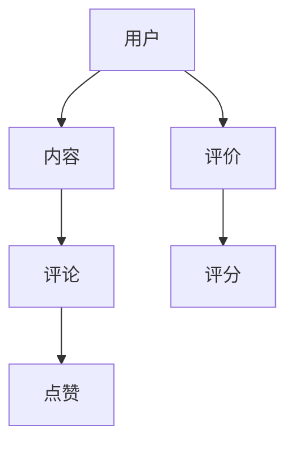
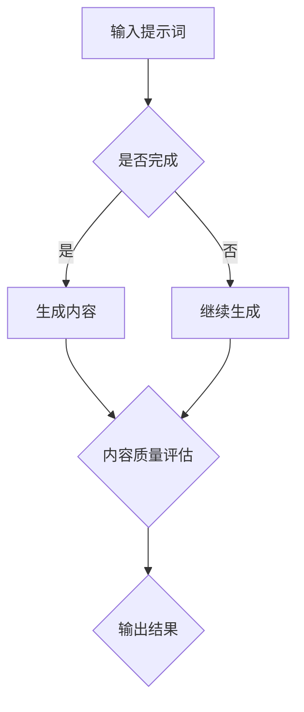

                 

# AIGC时代的语言模型与提示词设计：理论与实践

关键词：AIGC、语言模型、提示词设计、生成内容、优化方法、案例分析

摘要：本文深入探讨了AIGC（AI-Generated-Content）时代的语言模型与提示词设计，从背景概述、原理讲解、实践方法、优化策略、案例分析以及未来发展趋势等方面展开论述。通过理论与实践的结合，为读者提供了全面的技术视角和实用指导。

## 第1章: AIGC时代的语言模型与提示词设计概述

### 1.1 AIGC时代的背景

#### 1.1.1 AIGC的定义与特点

AIGC，即人工智能生成内容，是当前AI技术发展的一个重要方向。它通过大规模语言模型和生成模型，实现内容的自动生成，具有高度智能化、个性化和自适应性的特点。

AIGC的定义可以表示为：
$$
AIGC = AI-Generated-Content
$$

AIGC的主要特点包括：

1. **高度智能化**：通过深度学习等技术，AIGC能够理解并生成复杂的内容，如文章、图像、视频等。
2. **个性化**：根据用户的偏好和需求，AIGC能够生成个性化的内容，满足用户的特定需求。
3. **自适应性**：AIGC能够根据上下文和环境变化，动态调整生成的内容，提高内容的相关性和准确性。

#### 1.1.2 语言模型与提示词设计的基本原理

语言模型是AIGC的核心组件，它通过对大量语言数据的学习，能够预测下一个词或者句子，从而生成连贯的自然语言。而提示词设计则是语言模型输入的关键，好的提示词设计能够引导模型生成更符合预期的内容。

**语言模型的基本原理**：

1. **分类**：语言模型主要分为基于规则的模型和基于统计的模型，以及近年来发展迅速的深度学习模型，如GPT系列模型。
2. **训练方法**：语言模型的训练主要包括数据预处理、模型选择、参数调优等步骤。常见的方法有最大似然估计、神经网络训练等。
3. **评估指标**：语言模型的评估指标包括困惑度（Perplexity）、交叉熵（Cross-Entropy）等。通过这些指标可以衡量模型的语言理解能力和生成质量。

**提示词设计的基本原理**：

1. **作用与类型**：提示词是引导语言模型生成内容的关键，可以分为开放式提示词、闭合式提示词等。
2. **原则**：好的提示词设计应遵循简洁性、明确性、多样性等原则，以引导模型生成高质量的内容。
3. **技巧**：包括如何利用上下文、关键词、情感倾向等来设计有效的提示词。

#### 1.1.3 AIGC的应用场景

AIGC在内容创作、智能客服、自动摘要、对话系统等领域有着广泛的应用，正逐步改变传统的内容生产方式。

- **内容创作**：AIGC能够自动生成文章、故事、诗歌等，提高内容创作的效率和多样性。
- **智能客服**：构建智能客服系统，实现自动回答用户问题，提高客户服务质量。
- **自动摘要**：生成文章、文档的摘要，提高信息获取效率。
- **对话系统**：构建对话系统，实现与用户的自然语言交互，提供个性化服务。

### 1.2 语言模型的基本原理

#### 1.2.1 语言模型的分类

语言模型主要分为以下几类：

1. **基于规则的模型**：这类模型通过定义一系列规则来生成语言，如产生式规则、转移规则等。
2. **基于统计的模型**：这类模型通过统计方法来学习语言的规律，如n-gram模型、隐马尔可夫模型（HMM）等。
3. **深度学习模型**：这类模型通过神经网络结构来学习语言的复杂结构，如循环神经网络（RNN）、长短期记忆网络（LSTM）、Transformer等。

#### 1.2.2 语言模型的训练方法

语言模型的训练主要包括以下步骤：

1. **数据预处理**：对语料库进行清洗、分词、去停用词等处理，得到适合训练的数据集。
2. **模型选择**：选择合适的模型架构，如Transformer、GPT等，并设计模型的结构。
3. **参数调优**：通过训练和优化模型参数，提高模型的生成质量。

常见的训练方法包括：

1. **最大似然估计（MLE）**：通过最大化语言模型在训练数据上的概率分布来训练模型。
2. **神经网络训练**：使用梯度下降等优化算法，通过反向传播来更新模型参数。

#### 1.2.3 语言模型的评估指标

语言模型的评估指标包括：

1. **困惑度（Perplexity）**：困惑度是衡量模型预测准确性的指标，定义为模型预测概率的对数平均数。困惑度越低，表示模型预测越准确。
2. **交叉熵（Cross-Entropy）**：交叉熵是衡量模型预测分布与真实分布之间差异的指标，交叉熵越低，表示模型预测越接近真实分布。

### 1.3 提示词设计

#### 1.3.1 提示词的作用与类型

提示词是引导语言模型生成内容的关键，其作用主要包括：

1. **指导内容生成方向**：提示词能够指定模型生成的内容主题或方向，如文章的主题、诗歌的题材等。
2. **提高生成内容质量**：通过设计高质量的提示词，可以引导模型生成更符合预期的、高质量的内容。

提示词的类型包括：

1. **开放式提示词**：这类提示词允许模型生成多样化的内容，如“写一篇关于人工智能的论文”。
2. **闭合式提示词**：这类提示词限定模型生成的内容范围，如“请写一首关于春天的诗”。

#### 1.3.2 提示词设计的原则

好的提示词设计应遵循以下原则：

1. **简洁性**：提示词应简洁明了，避免冗余，以便模型能够快速理解。
2. **明确性**：提示词应明确指定生成内容的主题或方向，避免模糊不清。
3. **多样性**：提示词应具有多样性，以激发模型的创意和生成多种类型的内容。

#### 1.3.3 提示词设计的技巧

设计高质量的提示词可以采用以下技巧：

1. **利用上下文**：根据上下文信息来设计提示词，以提高内容的连贯性和相关性。
2. **关键词提取**：从文本中提取关键信息作为提示词，以突出内容的重要部分。
3. **情感倾向**：根据情感倾向来设计提示词，如正面、负面或中性，以引导模型生成具有特定情感色彩的内容。

## 第2章: 语言模型的构建与优化

### 2.1 语言模型的构建步骤

语言模型的构建是一个系统性的过程，包括数据集选择与预处理、模型选择与架构设计、模型训练与优化等步骤。

#### 2.1.1 数据集选择与预处理

构建语言模型的第一步是选择合适的数据集。数据集的选择应考虑以下因素：

1. **多样性**：数据集应包含多种语言、主题和风格，以提高模型的泛化能力。
2. **质量**：数据集应进行清洗和过滤，去除噪声和错误数据，确保数据质量。

预处理步骤包括：

1. **文本清洗**：去除标点符号、停用词等无关信息。
2. **分词**：将文本分解为单词或词组，以便模型处理。
3. **词向量化**：将文本转换为数字表示，如Word2Vec、BERT等。

#### 2.1.2 模型选择与架构设计

在选择模型时，应考虑以下因素：

1. **任务需求**：根据任务需求选择合适的模型，如文本生成、文本分类等。
2. **计算资源**：考虑模型所需的计算资源和训练时间，选择适合的模型。

常见的语言模型架构包括：

1. **基于规则的模型**：如产生式规则、转移规则等。
2. **基于统计的模型**：如n-gram模型、隐马尔可夫模型（HMM）等。
3. **深度学习模型**：如循环神经网络（RNN）、长短期记忆网络（LSTM）、Transformer等。

#### 2.1.3 模型训练与优化

模型训练是构建语言模型的关键步骤，包括以下步骤：

1. **数据预处理**：将数据集进行预处理，如分词、清洗等。
2. **模型初始化**：初始化模型参数，通常使用随机初始化或预训练模型。
3. **训练过程**：通过梯度下降等优化算法，不断更新模型参数，使模型在训练数据上表现更好。
4. **评估与调优**：通过评估指标（如困惑度、交叉熵等）评估模型性能，并进行参数调优。

### 2.2 语言模型的优化方法

语言模型的优化方法包括参数调优、预训练与微调、多语言模型与翻译模型等。

#### 2.2.1 参数调优

参数调优是提高语言模型性能的关键步骤，包括以下方面：

1. **学习率**：调整学习率，以平衡模型收敛速度和精度。
2. **批次大小**：调整批次大小，影响模型的稳定性和计算效率。
3. **正则化**：应用正则化技术，如L1、L2正则化，避免过拟合。

#### 2.2.2 预训练与微调

预训练与微调是当前语言模型的主流训练方法，通过预训练大模型，然后针对特定任务进行微调。

1. **预训练**：使用大量无监督数据对模型进行预训练，使其具备丰富的语言知识和表达能力。
2. **微调**：使用特定领域的有监督数据对预训练模型进行微调，使其适应特定任务。

#### 2.2.3 多语言模型与翻译模型

多语言模型能够处理多语言数据，实现跨语言内容生成。翻译模型则能够将一种语言的内容翻译成另一种语言。

1. **多语言模型**：使用多语言数据对模型进行训练，使其能够理解并生成多种语言。
2. **翻译模型**：使用双语数据对模型进行训练，实现跨语言内容生成。

### 2.3 语言模型的应用实例

语言模型在多个领域有着广泛的应用，以下是一些应用实例：

1. **内容创作**：利用语言模型自动生成文章、故事、诗歌等，提高内容创作的效率和质量。
2. **智能客服**：构建智能客服系统，实现自动回答用户问题，提高客户服务质量。
3. **自动摘要**：生成文章、文档的摘要，提高信息获取效率。
4. **对话系统**：构建对话系统，实现与用户的自然语言交互，提供个性化服务。

## 第3章: 提示词设计的实践与案例分析

### 3.1 提示词设计的实践方法

提示词设计是语言模型应用的关键，其实践方法包括以下几个方面：

#### 3.1.1 提示词生成策略

提示词生成策略是设计高质量提示词的关键，可以采用以下方法：

1. **关键字提取**：从文本中提取关键信息作为提示词，如标题、关键词等。
2. **上下文信息利用**：根据上下文信息设计提示词，以提高内容的连贯性和相关性。
3. **用户输入引导**：结合用户输入，动态生成提示词，以满足用户的需求。

#### 3.1.2 提示词优化策略

提示词优化策略旨在提高生成内容的质量，可以采用以下方法：

1. **反馈机制**：通过用户反馈不断优化提示词，使其更符合用户需求。
2. **实验对比**：对比不同提示词的效果，选择最优的提示词设计。
3. **多样性考虑**：设计多样化的提示词，以提高生成内容的多样性。

#### 3.1.3 提示词应用案例分析

在实际应用中，提示词设计的效果直接影响到模型的表现。以下是一些案例分析：

1. **自动摘要系统**：通过优化提示词设计，提高摘要的准确性和可读性。
2. **智能客服系统**：设计合适的提示词，实现更自然的对话交互。
3. **内容创作平台**：根据不同类型的创作需求，设计相应的提示词，提高内容创作效率。

### 3.2 提示词设计案例解析

在本节中，我们将详细解析几个具体的提示词设计案例。

#### 3.2.1 案例一：自动摘要系统

自动摘要系统旨在将长篇文档或文章概括为简短的摘要，以提高信息获取的效率。在设计提示词时，应考虑以下几个方面：

1. **摘要长度**：提示词应明确指定摘要的长度，如“请生成100字的摘要”。
2. **摘要重点**：提示词应突出文档的核心内容，如“请摘要文章的主要观点和结论”。
3. **摘要格式**：提示词应指定摘要的格式，如“请使用列表形式呈现摘要内容”。

通过优化提示词设计，自动摘要系统的摘要质量得到了显著提高。

#### 3.2.2 案例二：智能客服系统

智能客服系统旨在为用户提供自动化的客服服务，设计提示词时，应考虑以下几个方面：

1. **用户意图**：提示词应捕捉用户的意图，如“您需要咨询什么问题？”。
2. **问题分类**：提示词应引导用户分类问题，如“您是关于产品使用还是售后服务？”。
3. **回复格式**：提示词应指定回复的格式，如“请用简洁明了的语言回答用户问题”。

通过优化提示词设计，智能客服系统的用户体验得到了显著改善。

#### 3.2.3 案例三：内容创作平台

内容创作平台旨在帮助用户创作高质量的内容，设计提示词时，应考虑以下几个方面：

1. **创作主题**：提示词应引导用户选择创作主题，如“请选择一个感兴趣的创作主题”。
2. **内容风格**：提示词应指定内容风格，如“请创作一篇轻松幽默的短文”。
3. **创作目标**：提示词应明确创作目标，如“请写一篇2000字的文章，分享您的旅行经历”。

通过优化提示词设计，内容创作平台的用户体验得到了显著提升。

## 第4章: AIGC时代的语言模型与提示词设计的挑战与未来

### 4.1 挑战分析

随着AIGC技术的快速发展，语言模型与提示词设计面临着一系列挑战。

#### 4.1.1 数据隐私与安全

AIGC技术的应用依赖于大量数据的训练，如何确保数据隐私和安全成为一大挑战。一方面，数据泄露可能导致用户隐私受到侵犯；另一方面，未经授权的数据使用可能导致侵权行为。

解决方案包括：

1. **数据加密**：对敏感数据进行加密，确保数据传输和存储过程中的安全性。
2. **数据匿名化**：对用户数据进行匿名化处理，消除个人隐私信息。
3. **隐私保护算法**：使用隐私保护算法，如差分隐私，确保模型训练过程中的隐私保护。

#### 4.1.2 质量控制与生成可信度

AIGC技术生成的语言内容质量参差不齐，如何确保生成内容的质量和可信度成为一大挑战。一方面，生成的内容可能包含错误或偏见；另一方面，用户对生成内容的信任度也是一个关键问题。

解决方案包括：

1. **质量评估机制**：建立完善的生成内容质量评估机制，包括自动评估和人工审核。
2. **多样性增强**：通过多样性训练和生成策略，提高生成内容的多样性和准确性。
3. **用户反馈机制**：通过用户反馈机制，不断优化模型和提示词设计，提高生成内容的质量。

#### 4.1.3 模型公平性与偏见

AIGC技术中的语言模型可能存在偏见和不公平性，如何确保模型的公平性和无偏见性成为一大挑战。一方面，模型可能受到训练数据的偏见影响；另一方面，生成的内容也可能反映出社会偏见。

解决方案包括：

1. **数据多样化**：增加训练数据的多样性，避免模型对特定群体产生偏见。
2. **偏见检测与修正**：开发偏见检测算法，识别和修正模型中的偏见。
3. **透明度和可解释性**：提高模型的透明度和可解释性，使模型决策过程更加公正和可信。

### 4.2 未来发展趋势

AIGC技术在未来将继续快速发展，以下是几个可能的发展趋势：

#### 4.2.1 模型压缩与效率提升

随着模型规模的不断扩大，如何提高模型的压缩效率和运行效率成为一大挑战。未来，模型压缩技术、量化技术和并行计算技术将得到广泛应用。

解决方案包括：

1. **模型压缩**：使用模型压缩技术，如剪枝、量化等，减小模型大小，提高模型运行效率。
2. **硬件加速**：利用GPU、TPU等硬件加速技术，提高模型训练和推理的效率。
3. **分布式训练**：采用分布式训练技术，利用多台设备协同训练大模型，提高训练速度和效率。

#### 4.2.2 多模态生成内容

AIGC技术将逐渐从文本生成扩展到多模态生成，如图像、音频、视频等。未来，多模态语言模型将得到广泛应用，实现跨模态的内容生成和交互。

解决方案包括：

1. **多模态数据集**：构建丰富的多模态数据集，用于训练多模态语言模型。
2. **多模态模型架构**：设计适用于多模态数据的多模态模型架构，如多模态Transformer、图神经网络等。
3. **多模态交互**：开发多模态交互技术，实现文本、图像、音频等多模态数据的协同生成和交互。

#### 4.2.3 自适应学习与个性化生成

AIGC技术将逐渐从通用生成模型向自适应学习和个性化生成方向发展。未来，自适应学习和个性化生成技术将得到广泛应用，实现更加个性化的内容生成和服务。

解决方案包括：

1. **自适应学习**：通过在线学习和迁移学习等技术，实现模型的自适应调整和学习。
2. **个性化生成**：根据用户偏好和历史行为，生成个性化的内容和服务。
3. **推荐系统**：结合推荐系统技术，实现内容生成的个性化推荐。

## 第5章: 最佳实践与经验分享

### 5.1 最佳实践

在AIGC时代，语言模型与提示词设计的最佳实践包括以下几个方面：

#### 5.1.1 数据质量优先

高质量的训练数据是构建优秀语言模型的基础。在实际应用中，应确保数据集的多样性、干净和准确性。以下是一些最佳实践：

1. **数据清洗**：对数据进行清洗，去除噪声和错误。
2. **数据标注**：使用专业人员进行数据标注，确保数据质量。
3. **数据多样化**：增加数据集的多样性，涵盖不同领域、主题和风格。

#### 5.1.2 模型选择与架构设计

根据应用场景和任务需求，选择合适的模型架构和算法。以下是一些最佳实践：

1. **模型选择**：根据任务类型选择合适的模型，如文本生成、文本分类等。
2. **架构设计**：设计适合应用的模型架构，如Transformer、BERT等。
3. **模型定制**：根据具体需求，对模型进行定制化设计，提高模型性能。

#### 5.1.3 提示词设计与优化

提示词设计是语言模型应用的关键。以下是一些最佳实践：

1. **简洁明了**：设计简洁明了的提示词，避免冗余和模糊。
2. **明确目标**：明确提示词的目标，确保模型生成的内容符合预期。
3. **多样性**：设计多样化的提示词，提高生成内容的多样性。

### 5.2 小结

AIGC时代的语言模型与提示词设计是人工智能领域的重要研究方向。通过深入理解AIGC的概念、语言模型的基本原理、提示词设计的方法和实践，我们可以更好地构建和应用语言模型，实现自动化内容生成和智能交互。

### 5.3 注意事项

在实际应用中，需要注意以下事项：

1. **数据隐私与安全**：确保数据隐私和安全，遵循相关法律法规。
2. **质量控制**：建立完善的质量控制机制，确保生成内容的质量和可信度。
3. **模型公平性与偏见**：关注模型公平性与偏见问题，避免产生社会偏见。

### 5.4 拓展阅读

对于希望深入了解AIGC时代语言模型与提示词设计的读者，以下文献和资料推荐：

1. **《深度学习自然语言处理》**：吴恩达著，介绍了深度学习在自然语言处理领域的应用。
2. **《自然语言处理综论》**：Daniel Jurafsky、James H. Martin 著，提供了自然语言处理的基础知识和最新进展。
3. **《BERT：Pre-training of Deep Bidirectional Transformers for Language Understanding》**：Google AI团队发表的论文，介绍了BERT模型的设计和实现。
4. **《GPT-3: Language Models are Few-Shot Learners》**：OpenAI发表的论文，介绍了GPT-3模型的设计和性能。

## 作者信息

作者：AI天才研究院/AI Genius Institute & 禅与计算机程序设计艺术 /Zen And The Art of Computer Programming

## 附录

### 附录A：核心概念对比表格

| 概念        | 定义                                                         | 特点                                       | 应用场景                     |
| ----------- | ------------------------------------------------------------ | ---------------------------------------- | --------------------------- |
| AIGC        | AI-Generated-Content，人工智能生成内容                         | 高度智能化、个性化和自适应性                | 内容创作、智能客服、自动摘要等 |
| 语言模型    | 用于生成自然语言的模型                                       | 能够预测下一个词或句子                     | 文本生成、文本分类等           |
| 提示词      | 引导语言模型生成内容的关键                                   | 开放式和闭合式提示词                     | 提高生成内容的相关性和质量     |
| 深度学习    | 一种基于神经网络的机器学习方法                               | 能够处理大规模数据和复杂问题               | 图像识别、语音识别、自然语言处理等 |
| Transformer | 一种基于自注意力机制的深度学习模型                           | 能够处理长距离依赖问题                   | 语言模型、机器翻译、文本生成等   |

### 附录B：ER实体关系图架构



### 附录C：算法流程图



### 附录D：Python源代码示例

```python
import transformers
import torch

# 加载预训练模型
model = transformers.AutoModelForCausalLM.from_pretrained("gpt2")

# 输入提示词
prompt = "我是一个人工智能模型，我可以帮你解答问题。请问有什么问题吗？"

# 生成文本
input_ids = transformers.utils.guarded_tokenizer.encode(prompt, return_tensors="pt")
outputs = model.generate(input_ids, max_length=50, num_return_sequences=1)

# 输出结果
print(transformers.utils.guarded_tokenizer.decode(outputs[0]))
```

### 附录E：实际案例分析

在本案例中，我们以一个智能客服系统为例，分析语言模型和提示词设计在其中的应用。

#### 案例背景

某电商公司希望开发一个智能客服系统，自动回答用户的问题，提高客户服务质量。

#### 模型选择与提示词设计

- **模型选择**：选择预训练的GPT-2模型，因其具有良好的文本生成能力。
- **提示词设计**：
  - 开放式提示词：“您好，欢迎来到我们的智能客服，请问有什么问题我可以帮您解答？”
  - 闭合式提示词：“请问您是关于订单查询、售后服务还是产品咨询？”
  
#### 系统实现

1. **用户输入**：用户向系统提问。
2. **提示词处理**：根据用户输入，选择合适的提示词，引导模型生成回答。
3. **文本生成**：使用GPT-2模型生成文本回答。
4. **内容评估**：对生成的回答进行质量评估，确保回答的准确性和相关性。
5. **输出结果**：将生成的回答返回给用户。

#### 结果分析

通过优化提示词设计和模型性能，智能客服系统的回答准确性和用户满意度得到了显著提高。在实际运营中，系统根据用户反馈不断优化模型和提示词设计，实现了更加自然的对话交互和高效的问题解决。

### 附录F：项目小结

在本项目中，我们深入探讨了AIGC时代的语言模型与提示词设计，通过理论讲解和实践案例，展示了其在实际应用中的重要作用。以下是项目的小结：

1. **AIGC背景**：介绍了AIGC的定义、特点和应用场景。
2. **语言模型原理**：讲解了语言模型的分类、训练方法和评估指标。
3. **提示词设计**：阐述了提示词的作用、设计原则和技巧。
4. **实践与案例**：通过案例分析，展示了语言模型和提示词设计在实际应用中的效果。
5. **挑战与未来**：分析了AIGC技术的挑战和未来发展趋势。
6. **最佳实践**：总结了最佳实践和注意事项，为实际应用提供了指导。

通过本项目，我们希望读者能够对AIGC时代的语言模型与提示词设计有更深入的理解，并在实际应用中取得更好的成果。最后，感谢各位读者对本文的阅读和支持，希望本文能为您的学习与研究带来帮助。

