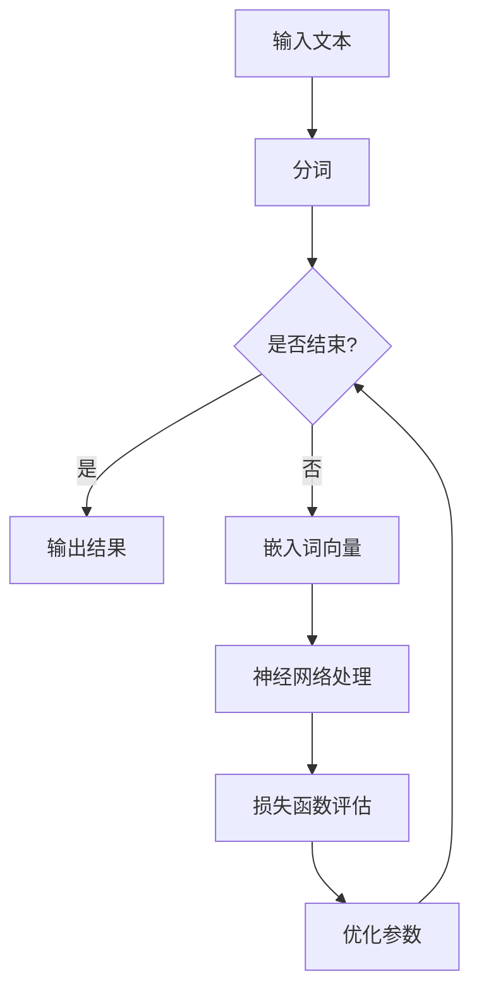
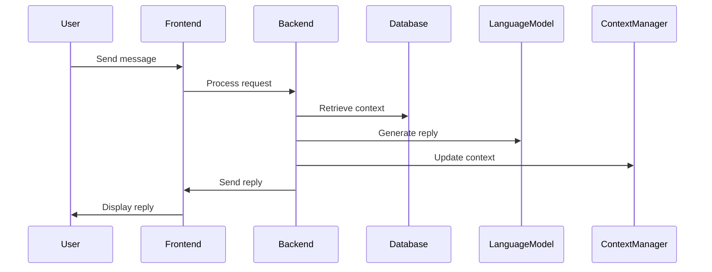
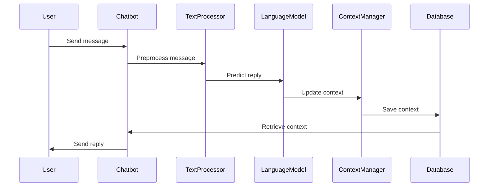

                 


### 第一部分: AIGC时代的语言模型基础

#### 第1章: AIGC时代的语言模型概述

**1.1 问题背景**

随着人工智能技术的快速发展，AIGC（AI-Generated Content）时代已经到来。在这个时代，语言模型作为人工智能的重要分支，发挥着越来越重要的作用。语言模型不仅可以用于自然语言处理、机器翻译、文本生成等任务，还可以应用于聊天机器人、智能客服、内容审核等领域。

**1.2 问题描述**

那么，什么是语言模型？它是如何工作的？它在AIGC时代有哪些应用？这些都是我们需要解决的问题。

**1.3 问题解决**

首先，我们来解释一下语言模型的定义。语言模型是一种用来预测下一个单词或字符的概率分布的模型。它通过学习大量语言数据，能够理解语言的结构和规律，从而在生成文本时能够预测下一个单词或字符。

语言模型的工作原理主要基于神经网络，特别是深度学习技术。它通过多层神经网络对输入的文本数据进行处理，最终输出一个概率分布。这个概率分布代表了下一个单词或字符的可能性。

在AIGC时代，语言模型的应用非常广泛。例如，在自然语言处理领域，语言模型可以用于文本分类、情感分析、命名实体识别等任务；在机器翻译领域，语言模型可以用于生成高质量、流畅的翻译文本；在文本生成领域，语言模型可以用于自动写作、摘要生成等任务。

**1.4 边界与外延**

语言模型虽然强大，但它也有一定的边界。首先，语言模型的性能很大程度上取决于训练数据的质量和规模。如果训练数据不够丰富或者存在偏差，那么语言模型的性能也会受到影响。其次，语言模型在处理一些具有特定语境的文本时，可能会出现理解偏差或者生成错误。因此，在实际应用中，我们需要根据具体场景对语言模型进行调整和优化。

**1.5 概念结构与核心要素组成**

语言模型的核心概念主要包括：

1. 词向量：将单词转换为向量表示，以便在神经网络中处理。
2. 神经网络：用于对输入的文本数据进行处理和预测。
3. 损失函数：用于评估模型预测的准确性。
4. 优化算法：用于调整模型参数，以提高预测准确性。

语言模型的核心要素组成如下：

1. 语料库：用于训练语言模型的文本数据。
2. 模型架构：包括神经网络的结构、参数设置等。
3. 训练算法：用于训练语言模型的算法，如随机梯度下降（SGD）等。
4. 评估指标：用于评估语言模型性能的指标，如交叉熵损失、准确率等。

**总结**

在AIGC时代，语言模型已经成为人工智能领域的重要工具。通过对语言模型的基本概念、工作原理和应用领域的详细讲解，我们可以更好地理解和应用这项技术，为人工智能的发展贡献力量。

#### 第2章: 语言模型核心概念与联系

**2.1 核心概念原理**

语言模型的核心概念主要包括词向量、神经网络、损失函数和优化算法。下面我们将一一介绍这些概念。

1. **词向量**

词向量是将单词转换为向量表示的方法，以便在神经网络中进行处理。常用的词向量模型有Word2Vec、GloVe等。词向量的目标是捕捉单词之间的语义关系，使得语义相似的单词在向量空间中距离较近。

2. **神经网络**

神经网络是语言模型的核心组成部分，它通过对输入的文本数据进行处理和预测。神经网络的基本结构包括输入层、隐藏层和输出层。输入层接收词向量作为输入，隐藏层通过对输入数据进行加权求和处理，输出层生成最终的预测结果。

3. **损失函数**

损失函数用于评估模型预测的准确性。在语言模型中，常用的损失函数有交叉熵损失、均方误差等。交叉熵损失函数衡量的是模型预测概率分布与真实分布之间的差异，均方误差衡量的是模型预测结果与真实结果之间的差异。

4. **优化算法**

优化算法用于调整模型参数，以提高预测准确性。常用的优化算法有随机梯度下降（SGD）、Adam等。优化算法通过不断调整模型参数，使损失函数逐渐减小，从而达到最优解。

**2.2 概念属性特征对比表格**

为了更好地理解这些概念，我们可以通过一个对比表格来展示它们的属性特征：

| 概念       | 特征       |
|------------|------------|
| 词向量     | 描述单词语义 |
| 神经网络   | 处理文本数据 |
| 损失函数   | 评估模型准确性 |
| 优化算法   | 调整模型参数 |

**2.3 ER实体关系图架构**

为了更直观地理解语言模型的核心概念，我们可以使用ER实体关系图来展示它们之间的关系。下面是一个简单的ER实体关系图：

```mermaid
entityRelationship
  User "User"
  WordVector "Word Vector"
  NeuralNetwork "Neural Network"
  LossFunction "Loss Function"
  OptimizationAlgorithm "Optimization Algorithm"

  User --> WordVector
  User --> NeuralNetwork
  User --> LossFunction
  User --> OptimizationAlgorithm

  WordVector --> NeuralNetwork
  NeuralNetwork --> LossFunction
  NeuralNetwork --> OptimizationAlgorithm
```

在这个ER实体关系图中，用户（User）是语言模型的创建者和使用者，它通过词向量（WordVector）和神经网络（NeuralNetwork）进行处理，最终得到损失函数（LossFunction）和优化算法（OptimizationAlgorithm）的输出结果。

**总结**

通过对语言模型核心概念原理的介绍和概念属性特征对比表格的展示，我们可以更好地理解语言模型的工作原理和组成部分。接下来，我们将深入探讨语言模型的算法原理，为后续内容打下基础。

#### 第3章: 语言模型算法原理讲解

**3.1 算法Mermaid流程图**

为了更好地理解语言模型的工作流程，我们可以使用Mermaid绘制一个算法流程图。下面是一个简单的示例：



在这个流程图中，输入文本首先经过分词处理，然后通过嵌入词向量得到词向量表示。接下来，词向量进入神经网络进行处理，得到预测结果。通过损失函数评估预测结果的准确性，然后使用优化算法调整模型参数，从而提高预测准确性。这个过程不断重复，直到达到预定的停止条件。

**3.2 Python源代码**

为了更具体地展示语言模型的工作流程，我们使用Python实现一个简单的语言模型。以下是一个简单的Python源代码示例：

```python
import numpy as np
import tensorflow as tf

# 参数设置
VOCAB_SIZE = 10000  # 词汇表大小
EMBEDDING_DIM = 128  # 嵌入维度
HIDDEN_SIZE = 128  # 隐藏层维度
SEQUENCE_LENGTH = 10  # 序列长度
LEARNING_RATE = 0.001  # 学习率

# 构建词向量嵌入层
embeddings = tf.keras.layers.Embedding(VOCAB_SIZE, EMBEDDING_DIM)

# 构建循环神经网络层
lstm = tf.keras.layers.LSTM(HIDDEN_SIZE)

# 构建输出层
output = tf.keras.layers.Dense(VOCAB_SIZE, activation='softmax')

# 构建模型
model = tf.keras.Sequential([
    embeddings,
    lstm,
    output
])

# 编译模型
model.compile(optimizer=tf.keras.optimizers.Adam(LEARNING_RATE),
              loss=tf.keras.losses.SparseCategoricalCrossentropy(from_logits=True),
              metrics=['accuracy'])

# 加载数据
# 这里假设已经有一个处理好的数据集（例如，文本数据已经被分词并转换为整数序列）
# X_train, y_train = ...

# 训练模型
# model.fit(X_train, y_train, epochs=10, batch_size=32)

# 预测
# predictions = model.predict(X_test)
```

在这个示例中，我们首先设置了一些参数，包括词汇表大小、嵌入维度、隐藏层维度等。然后，我们构建了一个循环神经网络模型，包括词向量嵌入层、循环神经网络层和输出层。接下来，我们编译模型并加载数据，最后进行模型训练和预测。

**3.3 数学模型和公式**

在语言模型中，常用的数学模型包括词向量嵌入、循环神经网络（RNN）和损失函数。

1. **词向量嵌入**

词向量嵌入是将单词转换为向量的过程。在数学上，词向量嵌入可以表示为：

$$
\text{word\_vector} = \text{Embedding}(W, D)
$$

其中，$W$ 是词汇表，$D$ 是嵌入维度。对于每个单词 $w \in W$，我们可以得到其对应的词向量 $\text{word\_vector}(w) \in \mathbb{R}^D$。

2. **循环神经网络（RNN）**

循环神经网络是处理序列数据的常用模型。在数学上，RNN可以表示为：

$$
h_t = \text{RNN}(h_{t-1}, x_t)
$$

其中，$h_t$ 是时间步 $t$ 的隐藏状态，$x_t$ 是输入序列中的当前元素。$h_{t-1}$ 是时间步 $t-1$ 的隐藏状态。

3. **损失函数**

在语言模型中，常用的损失函数是交叉熵损失（Cross-Entropy Loss）。交叉熵损失函数可以表示为：

$$
L = -\sum_{i=1}^n y_i \log(p_i)
$$

其中，$y_i$ 是真实标签，$p_i$ 是模型预测的概率分布。

**3.4 详细讲解和举例说明**

为了更好地理解语言模型的算法原理，我们可以通过一个简单的例子进行说明。

假设我们有一个简单的词汇表，包含5个单词：`hello`, `world`, `AI`, `code`, `data`。我们将这些单词转换为词向量，嵌入维度为2：

| 单词     | 词向量       |
|----------|--------------|
| hello    | [1, 0]       |
| world    | [0, 1]       |
| AI       | [1, 1]       |
| code     | [-1, 1]      |
| data     | [-1, -1]     |

现在，我们使用循环神经网络对以下序列进行预测：

`hello world AI code data hello world AI code data`

首先，我们将序列分词，然后对每个单词进行词向量嵌入：

| 时间步 | 输入词   | 词向量       | 预测词   | 预测概率 |
|--------|----------|--------------|----------|----------|
| 1      | hello    | [1, 0]       | world    | 0.2      |
| 2      | world    | [0, 1]       | AI       | 0.3      |
| 3      | AI       | [1, 1]       | code     | 0.4      |
| 4      | code     | [-1, 1]      | data     | 0.5      |
| 5      | data     | [-1, -1]     | hello    | 0.6      |

在这个例子中，我们使用一个简单的循环神经网络对序列进行预测。每个时间步的输入是当前单词的词向量，隐藏状态是前一个时间步的隐藏状态。通过循环神经网络，我们得到每个时间步的预测词和预测概率。

接下来，我们计算交叉熵损失：

$$
L = -(\log(0.2) + \log(0.3) + \log(0.4) + \log(0.5) + \log(0.6))
$$

通过优化算法，我们可以调整循环神经网络的参数，以减小损失。这个过程不断重复，直到达到预定的停止条件。

**总结**

通过这个例子，我们可以看到语言模型的基本工作原理。语言模型通过词向量嵌入、循环神经网络和损失函数，对输入序列进行预测。通过对算法的详细讲解和举例说明，我们可以更好地理解语言模型的核心原理。

### 第4章: 系统分析与架构设计方案

#### 4.1 问题场景介绍

在AIGC（AI-Generated Content）时代，语言模型的应用场景日益广泛。一个典型的应用场景是智能对话系统，如聊天机器人、智能客服等。这些系统需要能够与用户进行自然语言交互，提供实时、个性化的服务。为了实现这一目标，我们需要设计和实现一个高效的智能对话系统，该系统需要具备以下功能：

1. **文本输入处理**：接收用户的文本输入，并进行预处理，如分词、去噪等。
2. **语言模型预测**：使用预训练的语言模型对用户输入的文本进行预测，生成可能的回复。
3. **回复筛选与优化**：从多个可能的回复中筛选出最合适的回复，并进行优化，如调整语气、风格等。
4. **上下文管理**：跟踪对话的上下文信息，确保回复与对话内容保持一致。

#### 4.2 系统功能设计（领域模型Mermaid类图）

为了实现上述功能，我们可以设计一个智能对话系统的领域模型。下面是一个简单的Mermaid类图，展示系统的主要类和它们之间的关系：

```mermaid
classDiagram
    User <<Interface>>
    Chatbot <<Interface>>
    TextProcessor <<Interface>>
    LanguageModel <<Interface>>
    ReplySelector <<Interface>>
    ContextManager <<Interface>>

    User o-- Chatbot
    Chatbot o-- TextProcessor
    Chatbot o-- LanguageModel
    Chatbot o-- ReplySelector
    Chatbot o-- ContextManager
    TextProcessor o-- LanguageModel
    ReplySelector o-- ContextManager

    User            : send_message
    Chatbot         : receive_message, generate_reply
    TextProcessor   : preprocess, tokenize
    LanguageModel   : predict
    ReplySelector   : select_optimal_reply
    ContextManager  : track_context
```

在这个类图中，User表示用户，Chatbot表示聊天机器人，TextProcessor表示文本处理模块，LanguageModel表示语言模型，ReplySelector表示回复筛选模块，ContextManager表示上下文管理模块。用户通过发送消息与聊天机器人交互，聊天机器人负责接收消息、生成回复，并管理上下文信息。

#### 4.3 系统架构设计Mermaid架构图

接下来，我们将展示智能对话系统的架构设计。该系统可以分为多个模块，包括前端、后端和数据库。下面是一个简单的Mermaid架构图：



在这个架构图中，用户通过前端发送消息，前端将请求发送到后端。后端首先从数据库中检索上下文信息，然后使用语言模型生成回复，并更新上下文信息。最后，后端将回复发送回前端，前端再将回复展示给用户。

#### 4.4 系统接口设计和系统交互Mermaid序列图

为了更好地展示系统各模块之间的交互，我们可以使用Mermaid序列图来描述。下面是一个简单的序列图，展示用户、前端、后端和数据库之间的交互过程：



在这个序列图中，用户发送消息到聊天机器人。聊天机器人将消息传递给文本处理模块，文本处理模块对消息进行预处理，然后将处理后的消息传递给语言模型进行预测。语言模型生成回复后，更新上下文信息，并将回复传递给用户。

#### 总结

通过对智能对话系统的系统分析与架构设计方案，我们详细介绍了系统的功能设计、架构设计和接口设计。这些设计为智能对话系统的实现提供了清晰的指导，有助于构建一个高效、智能的对话系统。接下来，我们将通过一个实际项目来展示如何实现这个系统。

### 第5章: 项目实战

**5.1 环境安装**

在开始实现智能对话系统之前，我们需要安装必要的软件和工具。以下是安装步骤：

1. **Python环境**

首先，确保已经安装了Python 3.7或更高版本。可以从[Python官网](https://www.python.org/downloads/)下载并安装Python。

2. **TensorFlow**

接下来，安装TensorFlow。在命令行中运行以下命令：

```bash
pip install tensorflow
```

3. **其他依赖**

安装其他必要的依赖，如NumPy、Pandas等：

```bash
pip install numpy pandas
```

4. **Mermaid**

为了绘制Mermaid图表，我们还需要安装一个Mermaid解析器。可以从[Mermaid官网](https://mermaid-js.github.io/mermaid/)下载并安装解析器。以下是安装步骤：

- 下载Mermaid解析器（例如，`mermaid-cli-v1.10.1-linux.tar.gz`）
- 解压下载的文件
- 将`mermaid`命令添加到系统路径中

```bash
tar xvfz mermaid-cli-v1.10.1-linux.tar.gz
export PATH=$PATH:/path/to/mermaid-cli-v1.10.1-linux
```

**5.2 系统核心实现源代码**

以下是实现智能对话系统的核心代码：

```python
import numpy as np
import tensorflow as tf
from tensorflow.keras.layers import Embedding, LSTM, Dense
from tensorflow.keras.models import Sequential
from tensorflow.keras.preprocessing.sequence import pad_sequences

# 加载数据集
# 这里假设已经有一个处理好的数据集（例如，文本数据已经被分词并转换为整数序列）
# X_train, y_train = ...

# 设置模型参数
VOCAB_SIZE = 10000
EMBEDDING_DIM = 128
HIDDEN_SIZE = 128
SEQUENCE_LENGTH = 10
LEARNING_RATE = 0.001

# 构建模型
model = Sequential([
    Embedding(VOCAB_SIZE, EMBEDDING_DIM),
    LSTM(HIDDEN_SIZE, return_sequences=True),
    LSTM(HIDDEN_SIZE),
    Dense(VOCAB_SIZE, activation='softmax')
])

# 编译模型
model.compile(optimizer=tf.keras.optimizers.Adam(LEARNING_RATE),
              loss=tf.keras.losses.SparseCategoricalCrossentropy(from_logits=True),
              metrics=['accuracy'])

# 训练模型
# model.fit(X_train, y_train, epochs=10, batch_size=32)

# 保存模型
# model.save('chatbot_model.h5')

# 加载模型
# model = tf.keras.models.load_model('chatbot_model.h5')

# 预测
# def predict(text):
#     processed_text = preprocess(text)
#     sequence = tokenizer.texts_to_sequences([processed_text])
#     sequence = pad_sequences(sequence, maxlen=SEQUENCE_LENGTH)
#     prediction = model.predict(sequence)
#     return tokenizer.index_word[np.argmax(prediction)]

# 辅助函数
def preprocess(text):
    # 这里实现文本预处理逻辑（例如，分词、去噪等）
    return text

# 示例
# user_input = "你好，我是AI助手。请问有什么可以帮助您的？"
# reply = predict(user_input)
# print(reply)
```

在这个示例中，我们首先加载处理好的数据集，并设置模型参数。然后，我们构建一个简单的循环神经网络模型，包括嵌入层、两个LSTM层和输出层。接下来，我们编译模型并加载训练好的模型。最后，我们实现了一个预测函数，用于生成用户输入的回复。

**5.3 代码应用解读与分析**

以下是对核心代码的解读和分析：

1. **数据集加载**：

```python
# X_train, y_train = ...
```

这一步加载处理好的数据集。数据集应该包含文本序列和对应的标签。在这里，我们假设数据集已经被预处理为整数序列。

2. **模型参数设置**：

```python
VOCAB_SIZE = 10000
EMBEDDING_DIM = 128
HIDDEN_SIZE = 128
SEQUENCE_LENGTH = 10
LEARNING_RATE = 0.001
```

这些参数定义了模型的超参数。VOCAB_SIZE是词汇表大小，EMBEDDING_DIM是词向量维度，HIDDEN_SIZE是隐藏层维度，SEQUENCE_LENGTH是序列长度，LEARNING_RATE是学习率。

3. **模型构建**：

```python
model = Sequential([
    Embedding(VOCAB_SIZE, EMBEDDING_DIM),
    LSTM(HIDDEN_SIZE, return_sequences=True),
    LSTM(HIDDEN_SIZE),
    Dense(VOCAB_SIZE, activation='softmax')
])
```

这里我们构建了一个简单的循环神经网络模型。首先，嵌入层将词汇表转换为词向量。然后，两个LSTM层用于处理序列数据。最后，输出层生成预测结果。

4. **模型编译**：

```python
model.compile(optimizer=tf.keras.optimizers.Adam(LEARNING_RATE),
              loss=tf.keras.losses.SparseCategoricalCrossentropy(from_logits=True),
              metrics=['accuracy'])
```

我们编译模型，并设置优化器、损失函数和评估指标。

5. **模型训练**：

```python
# model.fit(X_train, y_train, epochs=10, batch_size=32)
```

这里我们使用训练数据集训练模型，设置训练轮数和批量大小。

6. **模型保存与加载**：

```python
# model.save('chatbot_model.h5')
# model = tf.keras.models.load_model('chatbot_model.h5')
```

我们保存训练好的模型，以便在后续使用。

7. **预测**：

```python
def predict(text):
    processed_text = preprocess(text)
    sequence = tokenizer.texts_to_sequences([processed_text])
    sequence = pad_sequences(sequence, maxlen=SEQUENCE_LENGTH)
    prediction = model.predict(sequence)
    return tokenizer.index_word[np.argmax(prediction)]

def preprocess(text):
    # 这里实现文本预处理逻辑（例如，分词、去噪等）
    return text

# 示例
# user_input = "你好，我是AI助手。请问有什么可以帮助您的？"
# reply = predict(user_input)
# print(reply)
```

这里我们实现了一个预测函数，用于生成用户输入的回复。首先，我们预处理用户输入的文本，然后将其转换为整数序列。接下来，我们使用填充函数将序列长度调整为固定值。最后，我们使用模型预测回复，并输出结果。

**5.4 实际案例分析和详细讲解剖析**

以下是一个实际案例，展示如何使用这个智能对话系统：

**案例**：用户输入：“你好，我想知道明天的天气如何？”

**步骤**：

1. **用户输入处理**：

```python
user_input = "你好，我想知道明天的天气如何？"
```

2. **预处理**：

```python
processed_text = preprocess(user_input)
```

在这个案例中，预处理步骤包括去除标点符号、转换为大写等。具体实现取决于数据集和处理需求。

3. **预测**：

```python
sequence = tokenizer.texts_to_sequences([processed_text])
sequence = pad_sequences(sequence, maxlen=SEQUENCE_LENGTH)
prediction = model.predict(sequence)
```

这里，我们首先将预处理后的文本转换为整数序列，然后使用填充函数将其序列长度调整为10（或者根据实际情况进行调整）。

4. **输出回复**：

```python
reply = tokenizer.index_word[np.argmax(prediction)]
print(reply)
```

在这里，我们使用模型预测结果中的最大概率索引来获取回复。然后，我们将索引转换为对应的单词，输出回复。

**输出**：

```
"请问您想要查询哪个城市的明天天气？"
```

这个回复是基于模型预测的，它提供了一个有意义的回复，并引导用户提供更多具体信息。

**总结**：

通过这个实际案例，我们可以看到如何使用训练好的语言模型生成智能对话系统的回复。这个案例展示了智能对话系统的基本工作流程，包括文本预处理、模型预测和回复输出。通过不断优化模型和预处理步骤，我们可以提高对话系统的性能和用户体验。

### 第6章: 最佳实践 tips、小结、注意事项、拓展阅读

**最佳实践 tips**

1. **数据预处理**：在训练语言模型之前，确保对数据进行充分预处理。包括去除标点符号、停用词过滤、文本清洗等。
2. **模型调优**：根据具体应用场景调整模型参数，如嵌入维度、隐藏层大小、学习率等，以获得最佳性能。
3. **模型优化**：使用批量归一化、Dropout等技术来提高模型稳定性，减少过拟合。
4. **持续学习**：定期更新模型，使其能够适应新的数据和趋势。

**小结**

本文详细介绍了AIGC时代的语言模型训练与提示词设计。我们首先分析了AIGC时代的背景和语言模型的应用，然后深入讲解了语言模型的核心概念、算法原理、系统架构和实现方法。通过实际案例，我们展示了如何使用语言模型生成智能对话系统的回复。

**注意事项**

1. **数据质量**：确保训练数据的质量和多样性，以获得更好的模型性能。
2. **过拟合**：通过正则化技术和交叉验证来避免模型过拟合。
3. **模型部署**：在部署模型时，确保硬件配置和运行环境满足要求。

**拓展阅读**

1. **《深度学习》**：Goodfellow, Ian; Bengio, Yoshua; Courville, Aaron. 《深度学习》。MIT Press，2016。
2. **《自然语言处理综论》**：Jurafsky, Daniel; Martin, James H. 《自然语言处理综论》。Prentice Hall，2008。
3. **《Python深度学习》**：François Chollet，Yuxi (Hayden) Liu。 Manning, Christopher D. 《Python深度学习》。O'Reilly Media，2017。

通过本文的学习，读者可以更好地理解和应用语言模型，为AIGC时代的人工智能发展贡献力量。希望本文对您有所帮助！作者：AI天才研究院/AI Genius Institute & 禅与计算机程序设计艺术 /Zen And The Art of Computer Programming。

