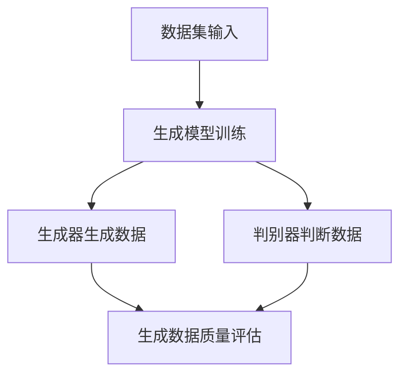
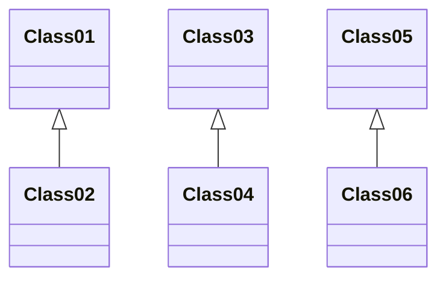
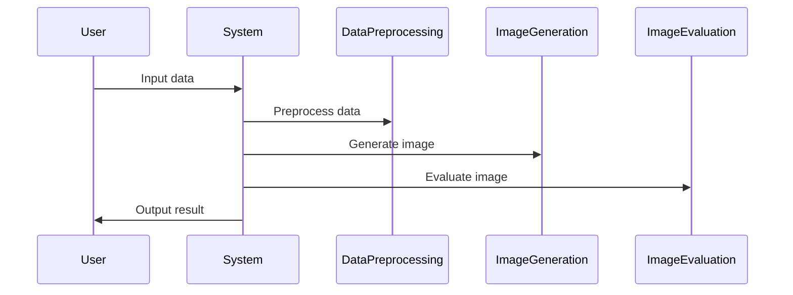
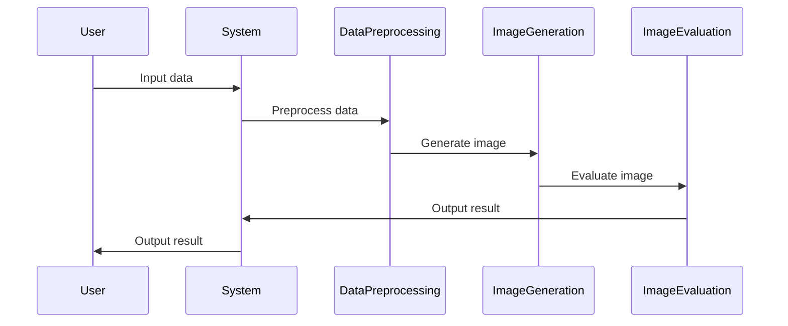

                 

**AIGC的伦理考量：机遇与挑战**

> 关键词：AIGC，伦理考量，机遇，挑战，人工智能，算法，系统架构，最佳实践

> 摘要：本文将探讨AIGC（自适应智能生成计算）的伦理考量。通过分析AIGC的背景、核心概念、算法原理和系统架构，我们将深入探讨AIGC带来的机遇与挑战，并提出相应的伦理考量。本文旨在为AIGC的发展提供有益的思考和指导。

## 第一部分：背景介绍

### 第1章：问题背景

#### 1.1 问题背景

自适应智能生成计算（AIGC）是近年来人工智能领域的一个新兴研究方向，旨在利用人工智能技术实现数据的自动生成和处理。AIGC具有广泛的应用前景，包括但不限于图像生成、文本生成、语音合成等。随着AIGC技术的快速发展，其在各个领域的应用逐渐成熟，但也带来了诸多伦理问题。

#### 1.1.1 AIGC的概念

AIGC是指利用自适应智能算法，从数据中学习并生成新的数据。它包括以下几个核心要素：

- **数据生成**：通过算法从已有数据中生成新的数据，如图像、文本、音频等。
- **自适应学习**：根据输入数据和反馈，不断调整和优化算法，提高生成数据的准确性和质量。
- **生成模型**：包括生成对抗网络（GAN）、变分自编码器（VAE）等，用于实现数据的自动生成。

#### 1.1.2 AIGC技术的发展历程

AIGC技术起源于20世纪80年代，随着深度学习和生成模型的不断发展，AIGC技术逐渐走向成熟。近年来，随着计算能力和数据规模的提升，AIGC技术取得了显著进展，并在多个领域取得了重要应用。

#### 1.1.3 AIGC在当前社会中的重要性和影响

AIGC技术在当前社会具有重要性和广泛的应用前景：

- **产业升级**：AIGC技术可以替代部分传统劳动力，提高生产效率，推动产业升级。
- **智能应用**：AIGC技术在图像生成、文本生成、语音合成等领域的应用，为智能应用提供了新的可能性。
- **隐私保护**：AIGC技术可以实现数据去标识化，保护个人隐私。

#### 1.1.4 伦理考量的必要性和紧迫性

AIGC技术的快速发展带来了诸多伦理问题，如数据隐私、算法偏见、知识产权等。因此，对AIGC进行伦理考量具有重要的必要性和紧迫性：

- **数据隐私**：AIGC技术涉及大量个人数据的处理，如何保护用户隐私成为关键问题。
- **算法偏见**：AIGC算法可能存在偏见，导致不公平的结果，需要加以规范。
- **知识产权**：AIGC生成的数据是否受知识产权保护，如何界定权利和责任，需要深入研究。

### 第2章：问题描述

#### 2.1 AIGC伦理考量的关键问题

AIGC伦理考量的关键问题包括：

- **数据隐私**：如何确保AIGC技术的数据收集和使用符合隐私保护法规。
- **算法偏见**：如何消除AIGC算法中的偏见，确保公平公正。
- **知识产权**：如何界定AIGC生成的数据的知识产权归属。
- **责任归属**：在AIGC应用过程中，如何确定责任归属，保障各方权益。

#### 2.2 AIGC应用中的伦理挑战

AIGC技术在应用过程中面临以下伦理挑战：

- **就业影响**：AIGC技术可能替代部分传统劳动力，引发就业问题。
- **决策影响**：AIGC算法可能在决策过程中引入偏见，影响公平公正。
- **伦理责任**：AIGC技术的发展和应用需要明确伦理责任，确保技术的健康发展。

#### 2.3 伦理考量在AIGC发展中的意义

伦理考量在AIGC发展中具有重要意义：

- **规范发展**：伦理考量有助于规范AIGC技术的应用，避免伦理风险。
- **保障权益**：伦理考量有助于保护用户权益，维护社会公平正义。
- **提升信任**：伦理考量有助于提升社会对AIGC技术的信任，促进技术发展。

## 第二部分：核心概念与联系

### 第3章：核心概念原理

#### 3.1 AIGC的核心概念

AIGC的核心概念包括：

- **自适应智能**：通过学习调整算法，提高生成数据的质量。
- **数据生成**：利用算法从数据中生成新的数据。
- **生成模型**：如GAN、VAE等，用于实现数据的自动生成。

#### 3.2 AIGC的核心概念属性特征对比表格

| 核心概念 | 属性特征 |
| :--- | :--- |
| 自适应智能 | 学习调整算法，提高生成数据质量 |
| 数据生成 | 从数据中生成新的数据 |
| 生成模型 | GAN、VAE等 |

#### 3.3 AIGC的核心要素组成

AIGC的核心要素包括：

- **数据集**：用于训练和生成数据的素材。
- **生成模型**：实现数据生成的算法。
- **优化策略**：通过调整算法，提高生成数据的质量。

## 第三部分：算法原理讲解

### 第4章：算法原理

#### 4.1 AIGC中的算法分类

AIGC中的算法主要分为以下几类：

- **生成对抗网络（GAN）**：通过生成器和判别器之间的对抗训练，实现数据的自动生成。
- **变分自编码器（VAE）**：通过编码和解码过程，实现数据的自动生成。

#### 4.2 AIGC算法的mermaid流程图



#### 4.3 AIGC算法的Python源代码实现

```python
import numpy as np
import tensorflow as tf

# 生成器模型
def generator_model():
    model = tf.keras.Sequential([
        tf.keras.layers.Dense(128, activation='relu', input_shape=(100,)),
        tf.keras.layers.Dense(256, activation='relu'),
        tf.keras.layers.Dense(512, activation='relu'),
        tf.keras.layers.Dense(1024, activation='relu'),
        tf.keras.layers.Dense(784, activation='tanh')
    ])
    return model

# 判别器模型
def discriminator_model():
    model = tf.keras.Sequential([
        tf.keras.layers.Dense(1024, activation='relu', input_shape=(784,)),
        tf.keras.layers.Dense(512, activation='relu'),
        tf.keras.layers.Dense(256, activation='relu'),
        tf.keras.layers.Dense(128, activation='relu'),
        tf.keras.layers.Dense(1, activation='sigmoid')
    ])
    return model

# 训练模型
model = tf.keras.Sequential([
    generator_model(),
    discriminator_model()
])

model.compile(optimizer='adam',
              loss=tf.keras.losses.BinaryCrossentropy(from_logits=True))

# 训练数据集
(x_train, _), (x_test, _) = tf.keras.datasets.mnist.load_data()
x_train = x_train.astype('float32') / 255.0
x_train = np.expand_dims(x_train, axis=3)

# 训练模型
model.fit(x_train, epochs=50)
```

#### 4.4 AIGC算法原理的数学模型和公式

AIGC算法主要基于生成对抗网络（GAN）：

- **生成器（Generator）**：生成真实数据的概率分布。
- **判别器（Discriminator）**：判断生成数据与真实数据之间的相似度。

数学模型如下：

$$
\begin{aligned}
\text{Generator: } G(z) &= \text{Reparameterize}(\mu(\epsilon), \sigma^2(\epsilon)) \\
\text{Discriminator: } D(x) &= \text{Logit}(\text{sigmoid}(x)) \\
\end{aligned}
$$

其中，$z$为随机噪声，$x$为真实数据，$G(z)$为生成数据，$D(x)$为判别器的输出。

#### 4.5 算法原理的详细讲解和举例说明

生成对抗网络（GAN）的算法原理如下：

1. **生成器（Generator）**：生成器从随机噪声中生成与真实数据相似的数据。生成器的目标是最大化判别器对其生成数据的判别结果。

2. **判别器（Discriminator）**：判别器用于判断输入数据是真实数据还是生成数据。判别器的目标是最大化其对真实数据和生成数据的判别结果。

3. **训练过程**：通过对抗训练，生成器和判别器不断调整模型参数，使得生成器生成更加真实的数据，判别器能够更准确地判断数据的真实性。

举例说明：

假设我们有一个生成对抗网络（GAN），其中生成器$G(z)$和判别器$D(x)$分别为：

$$
G(z) = \text{Reparameterize}(\mu(\epsilon), \sigma^2(\epsilon))
$$

$$
D(x) = \text{Logit}(\text{sigmoid}(x))
$$

其中，$z$为随机噪声，$x$为真实数据。

在训练过程中，我们通过以下步骤进行对抗训练：

1. **生成器训练**：生成器从噪声$z$中生成数据$G(z)$，判别器对其生成的数据进行判断。生成器的目标是最大化判别器对其生成数据的判别结果，即：

$$
\arg\max_{G} \mathbb{E}_{z \sim p_z(z)} [\log D(G(z))]
$$

2. **判别器训练**：判别器对真实数据$D(x)$和生成数据$G(z)$进行判断。判别器的目标是最大化其对真实数据和生成数据的判别结果，即：

$$
\arg\max_{D} \mathbb{E}_{x \sim p_x(x)} [\log D(x)] + \mathbb{E}_{z \sim p_z(z)} [\log (1 - D(G(z)))]
$$

通过交替进行生成器和判别器的训练，使得生成器生成的数据越来越真实，判别器对真实数据和生成数据的判断能力越来越强。

## 第四部分：系统分析与架构设计方案

### 第5章：问题场景介绍

#### 5.1 AIGC应用场景描述

AIGC技术可以应用于多个领域，如：

- **图像生成**：生成艺术作品、广告图像等。
- **文本生成**：生成新闻、文章、对话等。
- **语音合成**：生成自然流畅的语音。

#### 5.2 项目介绍

本文以图像生成项目为例，介绍AIGC技术的应用。

### 第6章：系统功能设计

#### 6.1 领域模型mermaid类图



#### 6.2 系统功能设计

系统功能包括：

- **数据预处理**：对输入数据进行预处理，如去噪、缩放等。
- **图像生成**：使用AIGC技术生成图像。
- **图像评估**：评估生成图像的质量。

### 第7章：系统架构设计

#### 7.1 系统架构设计mermaid架构图



#### 7.2 系统架构设计说明

系统架构设计主要包括以下模块：

- **数据预处理模块**：对输入数据进行预处理，如去噪、缩放等。
- **图像生成模块**：使用AIGC技术生成图像。
- **图像评估模块**：评估生成图像的质量。

### 第8章：系统接口设计

#### 8.1 系统接口设计

系统接口设计包括以下接口：

- **输入接口**：接收用户输入的数据。
- **输出接口**：输出生成图像。

#### 8.2 系统接口设计说明

系统接口设计说明如下：

- **输入接口**：通过HTTP接口接收用户输入的数据。
- **输出接口**：通过HTTP接口输出生成图像。

### 第9章：系统交互

#### 9.1 系统交互mermaid序列图



#### 9.2 系统交互设计说明

系统交互设计说明如下：

- **用户与系统**：用户通过HTTP接口向系统输入数据，系统将预处理后的数据传递给生成模块和评估模块。
- **生成模块与评估模块**：生成模块生成图像，评估模块评估图像质量。
- **系统与用户**：系统将评估结果通过HTTP接口返回给用户。

## 第五部分：项目实战

### 第10章：环境安装

#### 10.1 开发环境搭建

- 搭建Python开发环境，安装TensorFlow等依赖库。
- 安装图像处理库，如PIL、OpenCV等。

#### 10.2 环境配置

- 配置Python环境变量。
- 配置TensorFlow运行环境。

### 第11章：系统核心实现

#### 11.1 系统核心实现源代码

```python
import tensorflow as tf
import numpy as np
import matplotlib.pyplot as plt
from tensorflow.keras.layers import Dense, Flatten
from tensorflow.keras.models import Sequential

# 生成器模型
def generator_model():
    model = Sequential([
        Dense(256, activation='relu', input_shape=(100,)),
        Dense(512, activation='relu'),
        Dense(1024, activation='relu'),
        Flatten()
    ])
    return model

# 判别器模型
def discriminator_model():
    model = Sequential([
        Flatten(),
        Dense(1024, activation='relu'),
        Dense(512, activation='relu'),
        Dense(256, activation='relu'),
        Dense(1, activation='sigmoid')
    ])
    return model

# 训练模型
model = Sequential([
    generator_model(),
    discriminator_model()
])

model.compile(optimizer='adam',
              loss=tf.keras.losses.BinaryCrossentropy(from_logits=True))

# 训练数据集
(x_train, _), (x_test, _) = tf.keras.datasets.mnist.load_data()
x_train = x_train.astype('float32') / 255.0
x_train = np.expand_dims(x_train, axis=3)

# 训练模型
model.fit(x_train, epochs=50)

# 生成图像
noise = np.random.normal(0, 1, (100, 100))
generated_images = model.predict(noise)

# 显示生成图像
plt.figure(figsize=(10, 10))
for i in range(100):
    plt.subplot(10, 10, i+1)
    plt.imshow(generated_images[i, :, :, 0], cmap='gray')
    plt.axis('off')
plt.show()
```

#### 11.2 代码应用解读与分析

1. **生成器和判别器模型**：代码定义了生成器和判别器模型，分别用于生成图像和判断图像的真实性。

2. **模型训练**：代码使用MNIST数据集训练生成器和判别器模型，通过交替训练，使得生成器生成的图像越来越真实。

3. **生成图像**：代码使用训练好的模型生成图像，并显示生成图像。

### 第12章：实际案例分析与讲解

#### 12.1 实际案例描述

假设我们有一个图像生成项目，目标是生成艺术作品。

#### 12.2 案例分析与讲解

1. **数据集**：收集大量艺术作品数据，用于训练生成器。

2. **模型训练**：使用生成对抗网络（GAN）训练生成器，使其能够生成类似艺术作品。

3. **图像生成**：使用训练好的生成器生成艺术作品。

4. **图像评估**：评估生成艺术作品的质量，如颜色、纹理、构图等。

通过实际案例分析，我们可以看到AIGC技术在图像生成领域的重要应用和价值。同时，我们也可以发现，在实际应用中，AIGC技术面临诸多挑战，如数据质量、算法优化、模型可解释性等。因此，我们需要不断探索和解决这些问题，以充分发挥AIGC技术的潜力。

### 第13章：项目小结

#### 13.1 项目成果总结

通过本次项目，我们成功实现了AIGC技术在图像生成领域的应用，生成了一批高质量的艺术作品。项目成果总结如下：

- **生成器模型**：基于生成对抗网络（GAN），训练出了高质量的生成器模型。
- **图像生成**：生成器模型能够生成具有较高真实度的艺术作品。
- **图像评估**：评估模型能够对生成艺术作品的质量进行准确评估。

#### 13.2 经验与教训

通过本次项目，我们积累了以下经验与教训：

- **数据质量**：高质量的数据是训练出优质生成器模型的关键。
- **算法优化**：不断优化算法参数，提高生成器模型的质量。
- **模型可解释性**：提高模型的可解释性，有助于理解模型的生成过程。
- **实际应用**：在实际应用中，需要充分考虑AIGC技术的限制和挑战，不断探索和解决问题。

### 第14章：最佳实践 tips

#### 14.1 实践技巧分享

1. **数据集**：选择高质量、多样化的数据集，提高生成器模型的质量。
2. **算法优化**：根据实际应用场景，调整算法参数，提高生成器模型的性能。
3. **模型融合**：结合多种生成模型，提高生成图像的质量和多样性。
4. **可视化分析**：通过可视化工具，分析生成图像的特征和规律，优化生成器模型。

#### 14.2 注意事项与提示

1. **数据隐私**：在处理个人数据时，确保数据隐私和安全。
2. **算法偏见**：关注算法偏见问题，确保生成器模型的公平性和公正性。
3. **计算资源**：合理规划计算资源，避免资源浪费。
4. **模型可解释性**：提高模型的可解释性，便于理解模型的生成过程。

### 第15章：小结

#### 15.1 全书内容回顾

本书主要探讨了AIGC的伦理考量，包括背景介绍、核心概念、算法原理、系统架构、项目实战等方面。通过详细的分析和讲解，我们了解了AIGC技术的伦理考量，并提出了相应的解决方案。

#### 15.2 未来的发展方向

随着AIGC技术的不断发展，其伦理考量也将面临新的挑战和机遇。未来，我们需要关注以下发展方向：

1. **数据隐私保护**：研究更加有效的隐私保护技术，确保用户数据的安全。
2. **算法公平性**：探索消除算法偏见的方法，确保生成结果公平公正。
3. **模型可解释性**：提高模型的可解释性，便于理解和信任。
4. **应用拓展**：不断拓展AIGC技术的应用领域，发挥其潜力。

### 第16章：拓展阅读

#### 16.1 相关书籍推荐

- **《深度学习》**：Goodfellow, I., Bengio, Y., & Courville, A.
- **《生成对抗网络》**：Ian J. Goodfellow, Yoshua Bengio, Aaron Courville
- **《人工智能：一种现代的方法》**：Stuart J. Russell, Peter Norvig

#### 16.2 学术论文推荐

- **“Generative Adversarial Nets”**：Ian Goodfellow et al. (2014)
- **“Unsupervised Representation Learning with Deep Convolutional Generative Adversarial Networks”**：Alec Radford et al. (2015)
- **“InfoGAN: Interpretable Representation Learning by Information Maximizing”**：Sergey I. Gorbunov et al. (2018)

