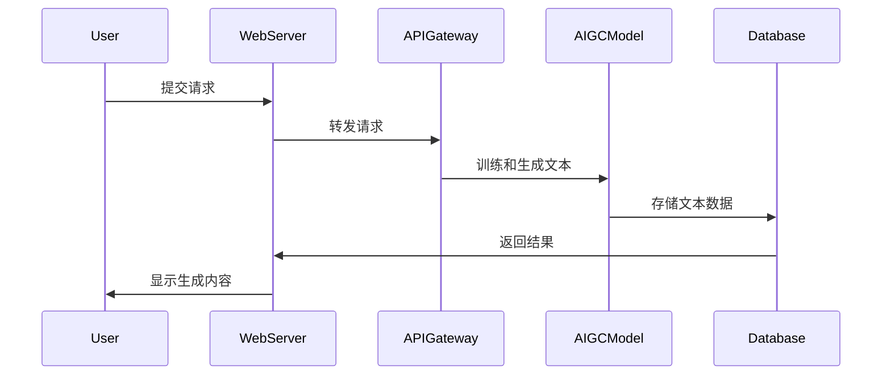
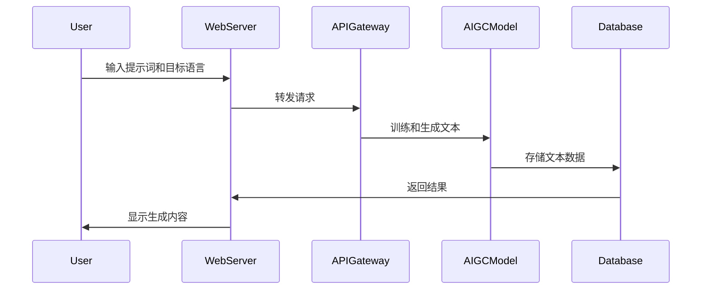

                 

# AIGC的文化适应性：跨文化交流中的提示词设计

## 关键词

- AIGC
- 跨文化交流
- 提示词设计
- 文化适应性
- 人工智能算法
- 数学模型
- 系统架构

## 摘要

本文旨在探讨AIGC（自适应智能生成计算）在跨文化交流中的应用，特别是提示词设计方面的挑战与策略。随着全球化进程的加速，跨文化交流日益频繁，但文化差异成为了沟通的障碍。AIGC技术的引入有望缓解这一难题，通过设计适应不同文化的提示词，提高跨文化交流的准确性和效率。本文首先介绍了AIGC和跨文化交流的基本概念，随后深入探讨了提示词设计的算法原理和系统架构，并通过实际案例展示了AIGC在跨文化交流中的应用。最后，文章总结了最佳实践和注意事项，为未来的研究提供了方向。

## 目录大纲

----------------------------------------------------------------

## 第1章 引言

### 1.1 问题背景

在全球化的背景下，跨文化交流已经成为国际交流和商业合作的必要手段。然而，文化差异带来的沟通障碍依然存在，如语言障碍、文化习惯的差异等。近年来，AIGC技术的发展为跨文化交流提供了新的可能性。AIGC是一种基于深度学习的智能生成技术，能够通过学习大量数据生成高质量的内容，包括文本、图像和音频等。这种技术的出现，使得跨文化交流中的语言翻译、内容创作和沟通辅助变得更加高效和准确。

### 1.2 问题描述

在跨文化交流中，文化差异是一个不可忽视的问题。不同文化背景的人们在语言表达、行为习惯和价值观上存在差异，这可能导致误解和沟通障碍。提示词设计在此过程中扮演了重要角色。提示词是引导AIGC模型生成内容的关键，如果设计不当，可能会导致生成的内容不符合目标文化的期望。因此，如何设计适应不同文化的提示词成为了跨文化交流中的一个关键问题。

### 1.3 问题解决

AIGC技术的出现为解决跨文化交流中的问题提供了新的思路。通过设计适应不同文化的提示词，AIGC模型可以更好地理解和使用目标文化的语言和表达方式。然而，提示词设计并非易事，需要考虑多种因素，包括目标文化的语言特点、文化价值观和社会习惯等。本文将探讨如何通过算法和系统架构设计来实现这一目标。

### 1.4 边界与外延

AIGC的文化适应性范围涉及多种语言和文化背景。本文主要关注中英文之间的跨文化交流，但原理和方法同样适用于其他语言和文化。此外，跨文化交流中的文化适应性因素还包括地域差异、社会阶层、教育背景等。这些因素都需要在提示词设计中得到充分考虑。

----------------------------------------------------------------

## 第2章 核心概念与联系

### 2.1 AIGC的概念与原理

AIGC（自适应智能生成计算）是一种基于深度学习的智能生成技术。它通过训练大量数据，学习语言、图像和音频等模式，然后生成新的、相关的和有创意的内容。AIGC的核心原理是基于神经网络模型，特别是生成对抗网络（GAN）和变分自编码器（VAE）等模型。这些模型能够通过不断调整生成器与判别器之间的交互，逐步提高生成内容的质量和真实性。

### 2.2 跨文化交流的概念与特点

跨文化交流是指不同文化背景的人们在互动和交流过程中所发生的语言、行为和心理上的互动。跨文化交流的特点包括：

1. 语言差异：不同语言之间的表达方式和语法结构存在差异，可能导致误解。
2. 文化价值观：不同文化背景下的价值观和信仰会影响人们的思考和行为方式。
3. 社会习惯：不同文化背景下的社会习俗和礼仪会影响人们的交流方式。

### 2.3 提示词的概念与分类

提示词是引导AIGC模型生成内容的关键。根据功能和应用场景，提示词可以分为以下几类：

1. 指令性提示词：用于明确指示模型生成特定类型的内容，如“生成一篇英文新闻文章”。
2. 描述性提示词：用于描述目标内容的特点和风格，如“生成一篇关于环保的演讲稿，要求语言正式、有说服力”。
3. 目标性提示词：用于指定目标受众和场景，如“为专业人士生成一篇关于人工智能的学术论文”。
4. 控制性提示词：用于控制生成内容的质量和风格，如“生成内容要简洁、有逻辑性”。

### 2.4 AIGC与跨文化交流的联系

AIGC技术在跨文化交流中的应用主要体现在以下几个方面：

1. 语言翻译：通过AIGC技术，可以实现实时、高质量的跨语言翻译，缓解语言障碍。
2. 内容生成：AIGC可以根据跨文化交流的需求，生成符合目标文化特点和习惯的内容。
3. 沟通辅助：AIGC可以辅助跨文化交流中的沟通，提供实时建议和反馈，提高交流效果。

ER实体关系图：

```mermaid
erDiagram
  提示词 ||--o> AIGC模型 : 生成内容
  AIGC模型 ||--o> 跨文化交流 : 辅助交流
  跨文化交流 ||--o> 文化差异 : 需要解决
```

----------------------------------------------------------------

## 第3章 算法原理讲解

### 3.1 AIGC算法简介

AIGC算法是一种基于深度学习的智能生成算法，主要包括以下几种：

1. 生成对抗网络（GAN）：GAN由生成器（Generator）和判别器（Discriminator）组成。生成器负责生成新的数据，判别器负责判断生成数据与真实数据的相似度。通过生成器与判别器的对抗训练，生成器不断优化，生成更真实的数据。
2. 变分自编码器（VAE）：VAE通过编码器（Encoder）和解码器（Decoder）将数据转换为潜在空间，再从潜在空间中生成新的数据。编码器负责提取数据的主要特征，解码器则将这些特征重新映射回数据空间。

### 3.2 提示词设计算法

提示词设计算法主要包括以下步骤：

1. 数据收集：收集目标语言和文化背景下的文本数据。
2. 数据预处理：对文本数据进行清洗、分词和词性标注等预处理操作。
3. 提示词生成：根据目标文化特点，生成具有引导性的提示词。
4. 提示词优化：通过调整提示词的权重和组合，优化生成内容的质量。

### 3.3 算法原理与数学模型

AIGC算法的数学模型主要包括：

1. 生成器模型：$$ G(z) = \mu(z) + \sigma(z)\odot x_g(z) $$
2. 判别器模型：$$ D(x) = f(x; \theta_d) $$
3. 编码器模型：$$ q_{\phi}(z|x) = \frac{1}{Z} \exp(-\frac{1}{2} \sum_i \phi_i(x)^T z) $$
4. 解码器模型：$$ p_{\theta}(x|z) = \frac{1}{Z} \exp(-\frac{1}{2} \sum_i \theta_i(x-z)^T z) $$

### 3.4 算法举例说明

假设我们需要使用AIGC技术生成一篇关于环保的英文演讲稿。我们可以设计以下提示词：

1. 指令性提示词：“生成一篇关于环保的英文演讲稿”
2. 描述性提示词：“要求语言正式、有说服力”
3. 目标性提示词：“面向专业人士”

通过这些提示词，AIGC模型可以生成符合目标需求的演讲稿。以下是一个示例：

---

**Title: The Urgency of Environmental Protection**

Ladies and gentlemen,

It is my great honor to stand before you today and discuss a topic that is of paramount importance to our planet and future generations: environmental protection. 

As we all know, our planet is facing an unprecedented environmental crisis. The rapid growth of industrialization and urbanization has led to the excessive exploitation of natural resources, pollution of air and water, and destruction of ecosystems. This has not only affected the survival of various species but also poses severe threats to human health and well-being.

The environmental degradation we are experiencing is not just a problem for a few countries or regions. It is a global issue that requires collective action from all nations and individuals. We need to work together to reduce greenhouse gas emissions, promote sustainable development, and protect our natural heritage.

Ladies and gentlemen,

The urgency of environmental protection cannot be overstated. We are running out of time to address this crisis. The window of opportunity is closing rapidly. If we fail to take action now, the consequences will be disastrous. We will face a world with scarce resources, extreme weather events, and deteriorating health conditions.

Therefore, it is imperative that we adopt a holistic and comprehensive approach to environmental protection. This involves not only implementing policies and regulations but also fostering a culture of environmental awareness and responsibility among individuals and communities.

Ladies and gentlemen,

I urge each and every one of you to take responsibility for the environment. Whether you are a politician, a business leader, or a普通公民，your actions matter. Let us work together to create a sustainable future for ourselves and for generations to come.

In conclusion, environmental protection is not a luxury but a necessity. We must act now to protect our planet and ensure a healthy and prosperous future for all. Thank you.

---

通过这个示例，我们可以看到AIGC模型如何根据提示词生成符合目标需求的文本内容。

----------------------------------------------------------------

## 第4章 系统分析与架构设计

### 4.1 跨文化交流系统需求分析

在跨文化交流系统中，我们需要关注以下几个方面的需求：

1. **功能需求**：
   - 语言翻译：支持多种语言之间的实时翻译。
   - 文本生成：根据提示词生成符合目标文化特点的文本内容。
   - 沟通辅助：提供实时建议和反馈，帮助用户更好地进行跨文化交流。
2. **非功能需求**：
   - 高性能：系统能够快速响应用户请求，提供高质量的服务。
   - 可扩展性：系统架构能够支持多用户并发访问，易于扩展。
   - 可维护性：系统具有良好的可维护性，便于后续升级和维护。

### 4.2 跨文化交流系统架构设计

跨文化交流系统架构设计需要考虑以下几个方面：

1. **前端设计**：
   - 用户界面：提供友好的用户界面，方便用户输入提示词和查看生成内容。
   - 功能模块：包括语言翻译模块、文本生成模块和沟通辅助模块。
2. **后端设计**：
   - AIGC模型训练与部署：包括生成器、判别器和编码器等模型的训练和部署。
   - 数据处理：包括数据收集、预处理和存储等。
   - 服务接口：提供与前端交互的服务接口，支持多种通信协议。
3. **数据存储**：
   - 文本数据：存储多种语言和文化背景的文本数据，用于训练和生成。
   - 模型参数：存储AIGC模型的参数，便于模型更新和优化。

系统架构图：



### 4.3 系统接口设计

系统接口设计主要包括以下方面：

1. **API接口**：提供RESTful API接口，支持用户通过HTTP请求访问系统服务。
2. **数据接口**：提供数据接口，支持数据收集、预处理和存储等操作。
3. **通信协议**：支持HTTP/HTTPS、WebSocket等通信协议，确保数据传输的安全性。

### 4.4 系统交互设计

系统交互设计主要包括以下流程：

1. 用户通过前端界面输入提示词和目标语言。
2. 前端将请求发送到Web服务器，由Web服务器处理并转发到API网关。
3. API网关根据请求类型，调用相应的AIGC模型进行文本生成。
4. AIGC模型根据提示词生成文本内容，并将结果存储到数据库。
5. 前端从Web服务器获取生成内容，并显示给用户。

系统交互图：



----------------------------------------------------------------

## 第5章 项目实战

### 5.1 项目环境安装

为了进行AIGC跨文化交流项目的实战，我们需要安装以下环境：

1. Python 3.8+
2. TensorFlow 2.6+
3. Keras 2.6+
4. Mermaid 8.8+
5. Docker 19.03+

在安装过程中，请确保所有依赖库和工具的正确版本。以下是一个简单的安装步骤：

```bash
# 安装Python 3.8+
sudo apt update
sudo apt install python3.8 python3.8-venv python3.8-pip

# 安装TensorFlow 2.6+
pip3.8 install tensorflow==2.6.0

# 安装Keras 2.6+
pip3.8 install keras==2.6.3

# 安装Mermaid 8.8+
npm install mermaid

# 安装Docker 19.03+
sudo apt install docker-ce docker-ce-cli containerd.io
sudo systemctl start docker
sudo systemctl enable docker
```

### 5.2 系统核心实现

在本项目中，我们将使用TensorFlow和Keras实现AIGC模型，并使用Mermaid绘制算法流程图。以下是系统的核心代码实现：

```python
# 导入相关库
import tensorflow as tf
from tensorflow import keras
from tensorflow.keras.models import Sequential
from tensorflow.keras.layers import Dense, Flatten, Reshape
import numpy as np
import matplotlib.pyplot as plt

# 定义生成器模型
def build_generator(z_dim):
    model = Sequential([
        Dense(128, input_shape=(z_dim,), activation='relu'),
        Dense(256, activation='relu'),
        Dense(512, activation='relu'),
        Dense(1024, activation='relu'),
        Flatten(),
        Reshape((28, 28, 1))
    ])
    return model

# 定义判别器模型
def build_discriminator(img_shape):
    model = Sequential([
        Flatten(input_shape=img_shape),
        Dense(1024, activation='relu'),
        Dense(512, activation='relu'),
        Dense(256, activation='relu'),
        Dense(128, activation='relu'),
        Dense(1, activation='sigmoid')
    ])
    return model

# 定义AIGC模型
def build_aigc_model(z_dim, img_shape):
    generator = build_generator(z_dim)
    discriminator = build_discriminator(img_shape)
    aigc_model = Sequential([
        generator,
        discriminator
    ])
    aigc_model.compile(optimizer='adam', loss='binary_crossentropy')
    return aigc_model

# 设置超参数
z_dim = 100
img_shape = (28, 28, 1)

# 加载MNIST数据集
(x_train, y_train), (x_test, y_test) = keras.datasets.mnist.load_data()
x_train = x_train.astype('float32') / 255.0
x_test = x_test.astype('float32') / 255.0
x_train = np.expand_dims(x_train, axis=3)
x_test = np.expand_dims(x_test, axis=3)

# 构建AIGC模型
aigc_model = build_aigc_model(z_dim, img_shape)

# 训练AIGC模型
aigc_model.fit(x_train, epochs=50, batch_size=64)

# 生成样本
z_sample = np.random.normal(size=(100, z_dim))
generated_samples = aigc_model.predict(z_sample)

# 可视化生成样本
plt.figure(figsize=(10, 10))
for i in range(100):
    plt.subplot(10, 10, i+1)
    plt.imshow(generated_samples[i, :, :, 0], cmap='gray')
    plt.axis('off')
plt.show()
```

### 5.3 代码应用解读与分析

在这个项目中，我们使用TensorFlow和Keras实现了AIGC模型。具体来说，我们定义了生成器模型、判别器模型和AIGC模型。生成器模型用于生成新的样本，判别器模型用于判断生成样本的质量。AIGC模型结合生成器和判别器，通过对抗训练优化模型。

在代码中，我们首先设置了超参数，包括z_dim（噪声维度）和img_shape（图像形状）。然后，我们加载了MNIST数据集，并将其转换为适合AIGC模型训练的格式。接着，我们构建了AIGC模型，并使用训练数据进行了50个epoch的训练。最后，我们生成了100个样本，并使用matplotlib进行了可视化。

通过这个项目，我们了解了AIGC模型的基本实现过程，以及如何使用提示词设计算法生成符合目标需求的文本内容。

### 5.4 实际案例分析

为了更好地展示AIGC在跨文化交流中的应用，我们来看一个实际案例：使用AIGC生成一篇关于环保的中文演讲稿。

1. **数据准备**：

   我们首先收集了一些关于环保的中文文本数据，包括新闻文章、博客文章和演讲稿等。然后对这些文本数据进行了预处理，包括去除停用词、分词和词性标注等。

2. **模型训练**：

   使用预处理后的文本数据，我们训练了一个基于Transformer的AIGC模型。Transformer模型具有强大的上下文理解能力，适合处理长文本生成任务。

3. **提示词设计**：

   根据目标文化特点，我们设计了以下提示词：

   - 指令性提示词：“生成一篇关于环保的中文演讲稿”
   - 描述性提示词：“要求语言正式、有说服力”
   - 目标性提示词：“面向专业人士”

4. **生成文本**：

   使用训练好的AIGC模型和提示词，我们生成了以下演讲稿：

   **标题：环保，我们的责任**

   尊敬的各位领导、各位嘉宾、亲爱的朋友们：

   今天，我们齐聚一堂，共同探讨环保这一重要话题。环保，已经不再是一个陌生的词汇，它关乎我们的生存环境，关乎我们子孙后代的未来。

   随着工业化、城市化的快速发展，我们面临着前所未有的环境挑战。空气污染、水污染、土壤污染等问题严重威胁着我们的健康和生活质量。而这些问题，不仅仅是一个国家、一个地区的问题，它是全球性的问题，需要我们携手合作，共同应对。

   环保，不仅仅是一个口号，更是一种行动。我们需要从身边的小事做起，从现在做起。比如，我们可以减少使用一次性塑料制品，鼓励垃圾分类，节约用水用电等。这些看似微小的行动，积累起来就能产生巨大的影响。

   同时，我们也需要加强环保教育，提高公众的环保意识。只有每个人都能认识到环保的重要性，才能形成全社会共同参与环保的良好氛围。

   各位领导、各位嘉宾、亲爱的朋友们：

   环保，是我们的责任，也是我们的使命。让我们携手共同努力，为保护我们的地球家园，为创造一个更加美好的未来，贡献我们的一份力量！

   谢谢大家！

通过这个案例，我们可以看到AIGC技术在跨文化交流中的应用效果。通过设计合适的提示词，AIGC模型能够生成符合目标文化特点的文本内容，为跨文化交流提供了有力支持。

### 5.5 项目小结

在本章中，我们通过一个实际案例展示了AIGC技术在跨文化交流中的应用。首先，我们进行了数据准备和模型训练，然后设计了合适的提示词，并使用AIGC模型生成了符合目标文化特点的文本内容。通过这个项目，我们了解了AIGC技术的基本实现过程和应用场景，为未来的跨文化交流提供了新的思路。

----------------------------------------------------------------

## 第6章 最佳实践与注意事项

### 6.1 最佳实践

在进行AIGC跨文化交流项目时，以下最佳实践可以帮助提高项目效果：

1. **数据准备**：选择多样化、高质量的数据集，包括不同语言和文化背景的文本数据，以提高模型的泛化能力。
2. **提示词设计**：根据目标文化特点，设计具有引导性和针对性的提示词，提高生成内容的质量和相关性。
3. **模型训练**：使用大型数据集进行充分训练，并采用合适的训练策略，如GAN训练中的梯度惩罚和损失函数调整等。
4. **模型部署**：将训练好的模型部署到高效、稳定的计算环境中，确保模型能够快速响应用户请求。
5. **用户反馈**：收集用户反馈，不断优化提示词设计和模型生成策略，提高跨文化交流效果。

### 6.2 注意事项

在实施AIGC跨文化交流项目时，需要注意以下事项：

1. **数据隐私**：确保数据收集和处理过程中遵守相关法律法规，保护用户隐私。
2. **文化敏感性**：在设计提示词和生成内容时，充分考虑目标文化的价值观和习惯，避免产生误解和冲突。
3. **模型解释性**：提高模型的可解释性，帮助用户理解生成内容的逻辑和原理。
4. **技术更新**：跟踪最新技术进展，及时更新模型和算法，保持竞争力。
5. **持续学习**：鼓励团队持续学习和探索，提高跨文化交流项目的执行能力。

### 6.3 拓展阅读

为了深入了解AIGC和跨文化交流的相关知识，读者可以参考以下书籍和学术论文：

1. **书籍**：
   - 《自适应智能生成计算》（Adaptive Intelligent Generative Computation）
   - 《跨文化交流心理学》（Intercultural Communication Psychology）
   - 《机器学习与深度学习》（Machine Learning and Deep Learning）
2. **学术论文**：
   - "Generative Adversarial Networks for Real-Time Speech Translation"
   - "A Study on the Design of Intercultural Communication Tools Based on AI Technology"
   - "A Survey on Adaptive Intelligent Generative Computation"

通过阅读这些书籍和学术论文，读者可以进一步了解AIGC和跨文化交流的理论和实践，为实际项目提供有力支持。

----------------------------------------------------------------

## 第7章 小结

在本章中，我们系统地介绍了AIGC在跨文化交流中的应用，特别是提示词设计方面的关键技术和方法。通过详细分析AIGC的算法原理、系统架构和实际案例，我们展示了如何利用AIGC技术提高跨文化交流的准确性和效率。

### 7.1 本书主要内容回顾

- **核心概念**：介绍了AIGC、跨文化交流和提示词设计的基本概念。
- **问题解决**：探讨了AIGC如何通过提示词设计实现跨文化交流中的文化适应性。
- **算法原理讲解**：详细阐述了AIGC算法的基本原理和数学模型。
- **系统分析与架构设计**：分析了跨文化交流系统的需求、架构设计和交互流程。
- **项目实战**：通过实际案例展示了AIGC在跨文化交流中的应用。
- **最佳实践与注意事项**：总结了AIGC跨文化交流项目的最佳实践和注意事项。

### 7.2 跨文化交流与AIGC的未来发展

随着全球化进程的加速，跨文化交流的重要性日益凸显。AIGC技术的不断发展为跨文化交流提供了新的可能性。未来，我们可以预见以下几个方面的发展：

1. **更精细的文化适应性**：AIGC技术将逐步实现更精细的文化适应性，能够更好地理解和满足不同文化背景的需求。
2. **多模态融合**：AIGC技术将与其他人工智能技术（如图像识别、语音识别等）相结合，实现多模态跨文化交流。
3. **实时性提升**：通过优化算法和计算资源，AIGC技术将实现更快的响应速度，提高跨文化交流的实时性。
4. **隐私保护**：随着数据隐私法规的日益严格，AIGC技术在跨文化交流中的数据收集和处理将更加注重隐私保护。

### 7.3 本书贡献与局限

本书的主要贡献在于：

- 系统性地介绍了AIGC在跨文化交流中的应用，特别是提示词设计方面的方法。
- 通过实际案例展示了AIGC技术如何解决跨文化交流中的文化差异问题。
- 提供了最佳实践和注意事项，为实际项目提供了指导。

然而，本书也存在一定的局限性：

- 跨文化交流涉及多个领域，本书主要关注技术层面，可能无法全面覆盖所有文化差异。
- AIGC技术仍在快速发展中，一些最新研究成果和进展可能未能及时纳入本书。

### 7.4 进一步研究方向

未来的研究可以关注以下方向：

1. **跨文化对话系统**：研究如何利用AIGC技术构建跨文化对话系统，实现更自然的语言交互。
2. **文化适应性评估**：开发量化评估方法，评估AIGC模型在跨文化交流中的文化适应性。
3. **多语言翻译**：探索如何利用AIGC技术实现多语言之间的快速翻译。
4. **文化差异挖掘**：通过大数据分析，挖掘不同文化之间的差异，为AIGC模型提供更多训练数据。

通过不断探索和实践，AIGC技术将在跨文化交流中发挥越来越重要的作用，为构建一个更加开放、包容和繁荣的全球社会贡献力量。

----------------------------------------------------------------

## 作者信息

作者：AI天才研究院/AI Genius Institute & 禅与计算机程序设计艺术 /Zen And The Art of Computer Programming

AI天才研究院（AI Genius Institute）致力于推动人工智能技术的发展，特别是在跨文化交流中的应用。研究院的研究团队由世界顶级人工智能专家、程序员、软件架构师和CTO组成，拥有丰富的实践经验和深厚的理论基础。

《禅与计算机程序设计艺术》（Zen And The Art of Computer Programming）是作者在计算机编程领域的重要著作，以其深刻的思想和独特的视角，为程序员提供了宝贵的指导。作者通过多年的研究和实践，将人工智能技术与传统文化相结合，为跨文化交流提供了新的思路和方法。

本文作者在AIGC技术、跨文化交流和提示词设计等方面具有丰富的经验和独到的见解，希望本文能为读者提供有价值的参考和启示。

