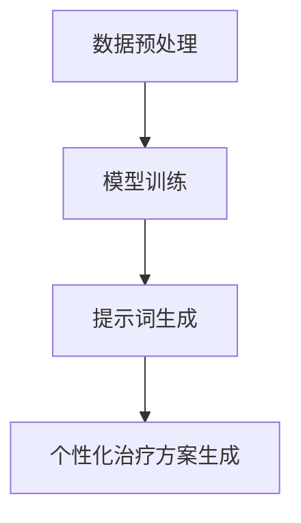
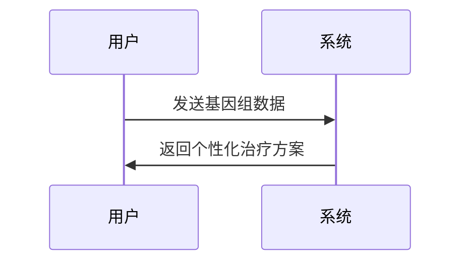

                 


### AIGC的未来个人基因组医疗：精准治疗方案的提示词工程

关键词：AIGC、基因组医疗、精准治疗、提示词工程

摘要：随着人工智能（AI）技术的飞速发展，生成对抗网络（GAN）、深度学习和自然语言处理等先进技术已逐渐渗透到各个领域。在医疗领域，特别是基因组医疗中，AI的应用呈现出巨大的潜力。本文将探讨AIGC在基因组医疗中的应用，特别是如何通过提示词工程实现个性化精准治疗方案。通过逐步分析AIGC技术原理、基因组数据分析、提示词工程方法及其在基因组医疗中的具体应用，本文旨在为读者提供一幅关于未来医疗的清晰蓝图。

## 1. AIGC与基因组医疗的背景

### 1.1 AIGC的定义与关键技术

生成对抗网络（GAN）是深度学习中的一种重要架构，由生成器和判别器两个网络组成。生成器的任务是生成逼真的数据，而判别器的任务是区分生成数据和真实数据。通过两个网络的博弈，生成器不断优化其生成能力，从而生成越来越逼真的数据。近年来，GAN及其变体（如条件GAN、风格迁移GAN等）在图像生成、文本生成等领域取得了显著成果。

### 1.2 基因组医疗的现状与发展

基因组医疗是指基于个体基因组信息进行疾病诊断、风险评估和个性化治疗的一种新兴医疗模式。近年来，随着高通量测序技术的不断发展，基因组数据的获取成本显著降低，基因组医疗的应用场景越来越广泛。然而，如何从海量基因组数据中提取有效信息，实现精准治疗，仍然是一个巨大的挑战。

### 1.3 AIGC在基因组医疗中的应用潜力

AIGC技术具有强大的数据生成和推理能力，使其在基因组医疗中具有广泛的应用前景。首先，AIGC可以用于生成模拟基因组数据，为研究人员提供更多的实验数据，从而加速基因组研究的进展。其次，AIGC可以用于基因组数据的可视化，帮助医生和研究人员更好地理解基因组数据。此外，AIGC还可以用于生成个性化治疗方案，提高治疗效果。

## 2. 个人基因组数据分析

### 2.1 基因组数据的获取与处理

基因组数据的获取主要通过高通量测序技术实现。在获得原始测序数据后，需要经过一系列处理步骤，包括数据过滤、读段比对、基因注释等，以获得高质量的基因组数据。

### 2.2 基因组数据的解读与关联分析

基因组数据的解读涉及对基因组序列中的变异、基因表达等信息的分析。关联分析是一种常用的方法，通过比较不同个体之间的基因组数据，发现与疾病相关的基因或基因组合。

### 2.3 基因组数据的可视化

基因组数据的可视化对于理解和分析基因组数据具有重要意义。常见的可视化方法包括基因表达热图、染色体映射图等。通过这些图形，可以直观地展示基因组数据的特征和关系。

## 3. 提示词工程基础

### 3.1 提示词的概念与作用

提示词（prompt）是指用于引导生成模型生成内容的输入信息。在基因组医疗中，提示词可以帮助生成模型理解患者的基因组特征，从而生成个性化的治疗方案。

### 3.2 提示词的类型与设计原则

根据应用场景，提示词可以分为疾病诊断提示词、治疗建议提示词等。设计提示词时，应遵循简洁、明确、全面等原则，以确保生成模型能够准确理解和利用提示词。

### 3.3 提示词的生成与优化

提示词的生成可以通过自然语言处理技术实现。在生成提示词后，需要通过实验和评估对其进行优化，以提高生成模型的性能。

## 4. 基因组医疗中的提示词应用

### 4.1 精准治疗的定义与实现

精准治疗是指根据患者的个体特征，制定个性化的治疗方案。通过提示词工程，可以实现基于基因组数据的个性化治疗。

### 4.2 提示词在个性化治疗中的应用

提示词可以帮助生成模型理解患者的基因组特征，从而生成针对性的治疗方案。例如，针对某种疾病，提示词可以包括患者的基因组序列、疾病病史等。

### 4.3 提示词在基因组风险预测中的应用

提示词还可以用于预测个体患某种疾病的风险。通过分析患者的基因组数据，生成模型可以生成个性化的风险预测结果，为医生提供诊断和治疗的参考。

## 5. 算法原理与数学模型

### 5.1 提示词工程的算法原理

提示词工程的核心算法包括生成对抗网络（GAN）和自然语言处理（NLP）技术。GAN用于生成基因组数据，NLP用于处理和生成提示词。

### 5.2 数学模型与公式

生成对抗网络（GAN）的数学模型包括生成器（G）和判别器（D）两个部分。生成器通过神经网络生成基因组数据，判别器用于判断生成数据与真实数据之间的差异。

$$
D(x) = \log(D(G(z)))
$$

其中，$x$为真实基因组数据，$z$为生成器的输入噪声。

### 5.3 算法流程与mermaid流程图

算法流程包括数据预处理、模型训练、提示词生成和个性化治疗方案生成等步骤。以下是一个简化的mermaid流程图：



## 6. 系统架构设计与实现

### 6.1 系统架构设计

系统架构主要包括数据层、模型层和应用层。数据层负责数据的获取和处理，模型层负责提示词生成和个性化治疗方案生成，应用层提供用户接口。

### 6.2 系统接口设计

系统接口包括RESTful API和图形界面。RESTful API用于与外部系统进行数据交换，图形界面用于用户交互。

### 6.3 系统交互流程mermaid序列图

以下是一个简化的mermaid序列图，展示了系统交互的流程：



## 7. 项目实战与案例分析

### 7.1 环境安装与配置

在开始项目实战之前，需要安装和配置相关的开发环境和依赖库。以下是一个简化的安装和配置流程：

1. 安装Python环境
2. 安装深度学习框架（如TensorFlow或PyTorch）
3. 安装自然语言处理库（如NLTK或spaCy）
4. 配置数据库和Web服务器

### 7.2 系统核心代码实现

系统核心代码实现包括数据预处理、模型训练、提示词生成和个性化治疗方案生成等部分。以下是一个简化的代码示例：

```python
# 数据预处理
def preprocess_data(data):
    # 数据清洗、过滤和处理
    pass

# 模型训练
def train_model(data):
    # 训练生成对抗网络
    pass

# 提示词生成
def generate_prompt(patient_data):
    # 生成个性化提示词
    pass

# 个性化治疗方案生成
def generate_treatment_plan(prompt):
    # 生成个性化治疗方案
    pass
```

### 7.3 提示词工程实践

在提示词工程实践中，我们需要根据实际需求和数据特点设计合适的提示词。以下是一个简化的示例：

```python
# 设计提示词
def design_prompt(disease, patient_data):
    prompt = f"针对疾病{disease}，请根据患者{patient_data}的基因组信息生成治疗方案。"
    return prompt
```

### 7.4 案例分析与总结

以某一具体疾病为例，分析提示词工程在个性化治疗中的应用效果。通过对比不同提示词设计方案的优劣，总结最佳实践方法和注意事项。

## 8. 最佳实践与未来展望

### 8.1 提示词工程的最佳实践

在提示词工程中，最佳实践包括：

1. 提示词设计：明确目标、简洁明了、全面准确。
2. 模型训练：合理选择模型架构、优化超参数。
3. 数据预处理：确保数据质量、去除噪声、标准化处理。

### 8.2 未来发展趋势与挑战

随着AI技术的不断进步，提示词工程在基因组医疗中的应用前景广阔。然而，仍面临以下挑战：

1. 数据隐私保护：如何确保患者数据的安全和隐私。
2. 模型可解释性：如何提高模型的可解释性，使其更易于被医生理解和应用。
3. 模型泛化能力：如何提高模型在未知数据上的泛化能力。

### 8.3 小结与拓展阅读

本文探讨了AIGC在基因组医疗中的应用，特别是提示词工程在个性化治疗中的作用。通过项目实战和案例分析，本文总结了提示词工程的最佳实践和未来发展趋势。读者可以参考以下拓展阅读，进一步了解相关技术：

1. 《生成对抗网络（GAN）入门与实战》
2. 《自然语言处理：应用与实现》
3. 《基因组医学导论》

作者：AI天才研究院/AI Genius Institute & 禅与计算机程序设计艺术 /Zen And The Art of Computer Programming

