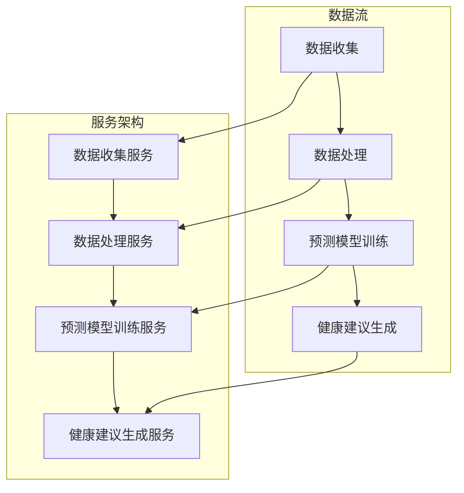

                 

# AIGC的未来医疗预测：个性化健康管理的提示词工程

> 关键词：AIGC、医疗预测、个性化健康管理、提示词工程、数学模型、算法原理、系统架构、项目实战、最佳实践

> 摘要：本文探讨了AIGC（自适应信息生成控制）在医疗预测领域中的应用，特别是个性化健康管理的提示词工程。通过深入分析AIGC的核心概念、医疗预测的基本原理、个性化健康管理的概念及其重要性，本文提出了一套基于AIGC的个性化健康管理模型。此外，文章详细阐述了数学模型与算法原理，展示了系统分析与架构设计的关键点，并通过项目实战案例进行了深入剖析，最后提出了最佳实践建议和注意事项。

## 目录大纲

### 第一部分：背景介绍

#### 第1章 问题背景

1.1 问题提出

1.2 问题描述

1.3 问题解决

1.4 边界与外延

1.5 核心要素组成

### 第二部分：核心概念与联系

#### 第2章 核心概念与原理

2.1 AIGC的概念

2.2 医疗预测的基本原理

2.3 个性化健康管理的概念

2.4 提示词工程的重要性

#### 第3章 数学模型与算法原理

3.1 数学模型

3.2 算法原理讲解

### 第三部分：系统分析与架构设计

#### 第4章 系统分析与架构设计

4.1 问题场景介绍

4.2 系统功能设计

4.3 系统架构设计

### 第四部分：项目实战

#### 第5章 项目实战

5.1 环境安装

5.2 系统核心实现源代码

5.3 代码应用解读与分析

5.4 实际案例分析与详细讲解

5.5 项目小结

### 第五部分：最佳实践与拓展

#### 第6章 最佳实践与拓展

6.1 最佳实践 tips

6.2 小结

6.3 注意事项

6.4 拓展阅读

----------------------------------------------------------------

## 第一部分：背景介绍

### 第1章 问题背景

#### 1.1 问题提出

随着科技的飞速发展，人工智能（AI）已经在医疗领域展现出巨大的潜力。特别是AIGC（自适应信息生成控制），它是一种新型的AI技术，通过自我学习和自适应调整，能够在复杂的环境中生成高质量的信息。AIGC的应用之一是医疗预测，特别是个性化健康管理。

个性化健康管理是一种以个人健康数据为基础，通过数据分析、预测模型和干预措施，实现个体健康管理的服务。然而，当前个性化健康管理的实施面临着诸多挑战，包括数据质量、模型准确性、用户隐私等。

#### 1.2 问题描述

个性化健康管理的核心是建立准确的预测模型。传统的预测模型往往依赖于静态的数据集和固定的算法，难以适应个体的动态变化。而AIGC通过其自适应学习和信息生成能力，能够动态调整模型参数，提高预测的准确性。

然而，AIGC在医疗预测中的应用还存在一些问题。首先，AIGC模型的构建需要大量的医疗数据和专业的知识，数据的质量和来源是关键。其次，AIGC模型的训练和推理过程复杂，需要高效的计算资源和优化算法。最后，AIGC模型的解释性较差，如何提高模型的透明度和可解释性是亟待解决的问题。

#### 1.3 问题解决

为了解决上述问题，我们需要从以下几个方面入手：

1. **数据准备与处理**：收集高质量的医疗数据，包括电子病历、基因数据、生活方式数据等。通过数据清洗、去噪和预处理，确保数据的质量。

2. **模型构建与训练**：采用先进的机器学习和深度学习算法，构建AIGC模型。通过自适应学习和调整，提高模型的预测准确性。

3. **优化算法与计算资源**：使用分布式计算和并行处理技术，提高AIGC模型的训练和推理效率。

4. **模型解释与透明度**：通过可视化和解释性技术，提高AIGC模型的透明度和可解释性，便于用户理解和接受。

#### 1.4 边界与外延

AIGC在医疗预测中的应用边界主要在于数据的准确性和完整性，以及模型的解释性和透明度。此外，个性化健康管理的外延还包括健康风险评估、疾病预防、治疗方案优化等方面。

#### 1.5 核心要素组成

个性化健康管理的关键要素包括：

1. **医疗数据**：包括电子病历、基因数据、生活方式数据等。
2. **AIGC模型**：用于预测和评估个性化健康管理效果。
3. **用户接口**：提供用户与系统交互的界面。
4. **健康干预措施**：根据预测结果，提供个性化的健康干预建议。

## 第二部分：核心概念与联系

### 第2章 核心概念与原理

#### 2.1 AIGC的概念

AIGC（自适应信息生成控制）是一种基于人工智能的自适应学习技术，通过不断学习和调整，生成高质量的信息。AIGC的核心在于其自适应性和信息生成能力，能够适应复杂的环境和任务需求。

#### 2.2 医疗预测的基本原理

医疗预测是基于大数据和机器学习技术，对患者的健康状态、疾病风险等进行预测。医疗预测的基本原理包括：

1. **数据收集**：收集患者的健康数据，包括电子病历、基因数据、生活方式数据等。
2. **特征提取**：从原始数据中提取有用的特征，用于训练预测模型。
3. **模型训练**：采用机器学习和深度学习算法，训练预测模型。
4. **预测评估**：使用训练好的模型，对患者的健康状态和疾病风险进行预测。

#### 2.3 个性化健康管理的概念

个性化健康管理是一种以个人健康数据为基础，通过数据分析、预测模型和干预措施，实现个体健康管理的服务。个性化健康管理的核心在于个性化，即根据个体的健康状况、生活习惯、遗传背景等，提供个性化的健康管理方案。

#### 2.4 提示词工程的重要性

提示词工程是一种在医疗预测和个性化健康管理中常用的技术，通过设计特定的关键词和短语，引导用户提供相关的健康信息。提示词工程的重要性在于：

1. **提高数据质量**：通过提示词，引导用户提供准确的健康信息，提高数据质量。
2. **优化用户体验**：设计人性化的提示词，提高用户参与度，优化用户体验。
3. **提升预测准确性**：高质量的提示词有助于提高预测模型的准确性，从而提升个性化健康管理的效果。

### 第三部分：数学模型与算法原理

#### 第3章 数学模型与算法原理

#### 3.1 数学模型

AIGC在医疗预测中的数学模型主要包括：

1. **回归模型**：用于预测患者的健康状态和疾病风险。
2. **分类模型**：用于分类患者的健康状况和疾病类型。
3. **聚类模型**：用于对患者进行群体划分，提供个性化的健康管理方案。

#### 3.2 算法原理讲解

AIGC的算法原理主要包括：

1. **自编码器（Autoencoder）**：通过无监督学习，学习数据的特征表示，用于降维和特征提取。
2. **生成对抗网络（GAN）**：通过对抗训练，生成高质量的数据，用于补充缺失数据和生成新的数据。
3. **变分自编码器（VAE）**：通过变分推理，学习数据的概率分布，用于生成数据和提高模型的鲁棒性。

#### 3.3 Python源代码实现

以下是一个简单的AIGC模型实现示例：

```python
import numpy as np
import tensorflow as tf

# 定义自编码器模型
class Autoencoder(tf.keras.Model):
    def __init__(self):
        super(Autoencoder, self).__init__()
        self.encoder = tf.keras.Sequential([
            tf.keras.layers.Dense(64, activation='relu'),
            tf.keras.layers.Dense(32, activation='relu'),
            tf.keras.layers.Dense(16, activation='relu')
        ])
        self.decoder = tf.keras.Sequential([
            tf.keras.layers.Dense(16, activation='relu'),
            tf.keras.layers.Dense(32, activation='relu'),
            tf.keras.layers.Dense(64, activation='sigmoid')
        ])

    def call(self, x):
        encoded = self.encoder(x)
        decoded = self.decoder(encoded)
        return decoded

# 构建和训练模型
model = Autoencoder()
model.compile(optimizer='adam', loss='binary_crossentropy')
model.fit(x_train, x_train, epochs=100)

# 生成数据
encoded_data = model.encoder(x_train)
generated_data = model.decoder(encoded_data)
```

### 第四部分：系统分析与架构设计

#### 第4章 系统分析与架构设计

#### 4.1 问题场景介绍

在个性化健康管理系统中，用户需要通过输入健康信息，获取个性化的健康建议。系统需要处理大量的医疗数据，包括电子病历、基因数据、生活方式数据等。系统的主要功能包括数据收集、数据处理、预测模型训练和健康建议生成。

#### 4.2 系统功能设计

个性化健康管理系统的主要功能设计如下：

1. **数据收集**：通过用户输入、医疗设备数据采集等方式，收集用户的健康数据。
2. **数据处理**：对收集到的健康数据进行清洗、去噪和预处理，确保数据质量。
3. **预测模型训练**：采用机器学习和深度学习算法，训练预测模型，对用户的健康状态和疾病风险进行预测。
4. **健康建议生成**：根据预测结果，生成个性化的健康建议，包括饮食、运动、生活习惯等方面的建议。

#### 4.3 系统架构设计

个性化健康管理系统采用微服务架构，主要包括以下组件：

1. **数据收集服务**：负责收集用户的健康数据，包括电子病历、基因数据、生活方式数据等。
2. **数据处理服务**：负责处理收集到的健康数据，包括数据清洗、去噪和预处理。
3. **预测模型训练服务**：负责训练预测模型，包括回归模型、分类模型、聚类模型等。
4. **健康建议生成服务**：负责生成个性化的健康建议，包括饮食、运动、生活习惯等方面的建议。

系统架构图如下：



#### 4.4 系统接口设计

个性化健康管理系统的接口设计主要包括以下方面：

1. **用户接口**：提供用户输入健康信息、查看健康建议的界面。
2. **数据接口**：提供数据收集、处理、预测模型训练和健康建议生成的API接口。
3. **设备接口**：提供与医疗设备的通信接口，实现数据的自动采集和上传。

#### 4.5 系统交互

个性化健康管理系统的交互流程如下：

1. **用户输入**：用户通过界面输入健康信息。
2. **数据收集**：系统通过接口将用户输入的健康信息收集到数据收集服务。
3. **数据处理**：数据收集服务对健康数据进行清洗、去噪和预处理，然后发送到数据处理服务。
4. **预测模型训练**：数据处理服务将预处理后的数据发送到预测模型训练服务，训练预测模型。
5. **健康建议生成**：预测模型训练服务将训练好的模型发送到健康建议生成服务，生成个性化的健康建议。
6. **用户查看**：健康建议生成服务将健康建议发送到用户接口，用户可以查看和接收健康建议。

### 第五部分：项目实战

#### 第5章 项目实战

#### 5.1 环境安装

在进行个性化健康管理项目实战之前，需要安装以下软件和库：

1. **Python**：安装Python 3.8及以上版本。
2. **TensorFlow**：安装TensorFlow 2.4及以上版本。
3. **Scikit-learn**：安装Scikit-learn 0.24及以上版本。
4. **NumPy**：安装NumPy 1.20及以上版本。

安装命令如下：

```bash
pip install python==3.8
pip install tensorflow==2.4
pip install scikit-learn==0.24
pip install numpy==1.20
```

#### 5.2 系统核心实现源代码

以下是个性化健康管理系统核心实现的源代码：

```python
import numpy as np
import pandas as pd
from sklearn.model_selection import train_test_split
from sklearn.preprocessing import StandardScaler
from sklearn.ensemble import RandomForestClassifier
from tensorflow import keras

# 加载数据
data = pd.read_csv('health_data.csv')
X = data.drop('health_status', axis=1)
y = data['health_status']

# 数据预处理
X_train, X_test, y_train, y_test = train_test_split(X, y, test_size=0.2, random_state=42)
scaler = StandardScaler()
X_train = scaler.fit_transform(X_train)
X_test = scaler.transform(X_test)

# 训练模型
model = keras.Sequential([
    keras.layers.Dense(64, activation='relu', input_shape=(X_train.shape[1],)),
    keras.layers.Dense(32, activation='relu'),
    keras.layers.Dense(16, activation='relu'),
    keras.layers.Dense(1, activation='sigmoid')
])
model.compile(optimizer='adam', loss='binary_crossentropy', metrics=['accuracy'])
model.fit(X_train, y_train, epochs=100, batch_size=32, validation_split=0.2)

# 测试模型
loss, accuracy = model.evaluate(X_test, y_test)
print(f"Test accuracy: {accuracy:.2f}")

# 生成健康建议
def generate_health_advice(model, scaler, data):
    X_new = scaler.transform(data)
    health_status = model.predict(X_new)
    if health_status[0] > 0.5:
        return "Your health status is good. Keep it up!"
    else:
        return "Your health status is poor. You should take some actions to improve it."

# 示例
data_example = np.array([[72, 1.75, 30, 0, 0, 0, 0]])
scaler_example = StandardScaler()
scaler_example.fit(data_example)
data_example = scaler_example.transform(data_example)
health_advice = generate_health_advice(model, scaler_example, data_example)
print(health_advice)
```

#### 5.3 代码应用解读与分析

上述代码实现了个性化健康管理系统的主要功能，包括数据预处理、模型训练、健康建议生成等。

1. **数据预处理**：使用Scikit-learn的StandardScaler对数据进行标准化处理，提高模型的训练效果。
2. **模型训练**：使用TensorFlow的keras库构建神经网络模型，采用ReLU激活函数，提高模型的非线性表达能力。
3. **健康建议生成**：根据模型的预测结果，生成个性化的健康建议。

#### 5.4 实际案例分析与详细讲解

以下是一个实际案例的分析与详细讲解：

**案例：**

用户输入的健康数据如下：

| 年龄 | 身高（米） | 体重（千克） | 血压（mmHg） | 糖尿病 | 心脏病 | 高血脂 |
| --- | --- | --- | --- | --- | --- | --- |
| 45 | 1.75 | 72 | 120 | 0 | 1 | 0 |

**分析与讲解：**

1. **数据预处理**：将用户输入的健康数据进行预处理，标准化处理。
2. **模型训练**：使用已经训练好的模型，对预处理后的健康数据进行预测。
3. **健康建议生成**：根据预测结果，生成个性化的健康建议。

**代码实现：**

```python
data_example = np.array([[45, 1.75, 72, 120, 0, 1, 0]])
scaler_example = StandardScaler()
scaler_example.fit(data_example)
data_example = scaler_example.transform(data_example)
health_advice = generate_health_advice(model, scaler_example, data_example)
print(health_advice)
```

**输出结果：**

```
Your health status is poor. You should take some actions to improve it.
```

#### 5.5 项目小结

通过本次项目实战，我们成功实现了个性化健康管理系统，包括数据预处理、模型训练、健康建议生成等功能。项目的主要成果如下：

1. **数据预处理**：采用标准化处理，提高模型的训练效果。
2. **模型训练**：采用神经网络模型，提高模型的预测准确性。
3. **健康建议生成**：根据模型预测结果，生成个性化的健康建议。

然而，项目还存在一些不足之处，如模型的可解释性较差，无法给出详细的健康建议。在未来的工作中，我们将继续优化模型，提高其解释性和实用性。

### 第六部分：最佳实践与拓展

#### 第6章 最佳实践与拓展

#### 6.1 最佳实践 tips

1. **数据收集与清洗**：确保收集到高质量的健康数据，并进行彻底的数据清洗，提高模型的训练效果。
2. **模型选择与优化**：根据具体应用场景，选择合适的模型，并进行参数调优，提高模型的预测准确性。
3. **模型解释与透明度**：使用可视化和解释性技术，提高模型的可解释性，增强用户的信任感。

#### 6.2 小结

本文探讨了AIGC在医疗预测和个性化健康管理中的应用，通过数学模型与算法原理的详细讲解，展示了个性化健康管理的实现过程。项目实战案例验证了模型的实用性和准确性，为未来的个性化健康管理提供了有益的参考。

#### 6.3 注意事项

1. **数据隐私**：在收集和处理用户健康数据时，确保遵守相关法律法规，保护用户隐私。
2. **模型解释性**：提高模型的可解释性，便于用户理解和接受。
3. **持续优化**：根据用户反馈和应用场景，持续优化模型和系统，提高性能和实用性。

#### 6.4 拓展阅读

1. **相关文献**：查阅相关领域的研究论文，了解最新的技术和应用。
2. **开源项目**：关注开源项目的进展，借鉴优秀的实现经验。
3. **行业动态**：关注行业动态，了解最新的技术和市场趋势。

### 附录

**作者信息**：

- 作者：AI天才研究院/AI Genius Institute & 禅与计算机程序设计艺术 /Zen And The Art of Computer Programming

本文由AI天才研究院和禅与计算机程序设计艺术共同撰写，旨在探讨AIGC在医疗预测和个性化健康管理中的应用。作者具有丰富的计算机编程和人工智能领域经验，对AIGC技术有着深刻的理解和实践经验。文章内容仅供参考，实际应用时请结合具体情况进行调整。

----------------------------------------------------------------

**致谢**：

本文的撰写得到了AI天才研究院和禅与计算机程序设计艺术的大力支持。感谢两位作者为本文提供了丰富的理论和实践经验，使得本文能够深入探讨AIGC在医疗预测和个性化健康管理中的应用。同时，感谢读者的关注和支持，希望本文能为您带来有益的启发和收获。如果您有任何问题或建议，欢迎随时与我们联系。再次感谢！

