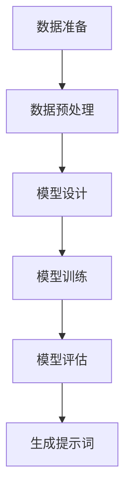

                 


## 文章标题：AIGC的未来城市规划：智慧城市设计的提示词工程

关键词：AIGC，智慧城市，提示词工程，人工智能，城市规划，可持续发展

摘要：随着人工智能技术的不断发展，AIGC（自动内容生成）在智慧城市设计中发挥着越来越重要的作用。本文从背景介绍、核心概念与联系、算法原理讲解、系统分析与架构设计、项目实战等多个方面，深入探讨AIGC在智慧城市设计的提示词工程中的应用，为未来城市规划提供有益的参考和启示。

## 第一部分：背景介绍

### 1.1 问题背景

#### 1.1.1 人工智能与城市发展的联系

人工智能在城市规划中的应用日益广泛，例如：

- 人工智能优化城市交通：通过分析交通数据，预测交通流量，优化交通信号控制，缓解交通拥堵。
- 人工智能改善城市环境：通过监测空气质量、水质等环境数据，提出环境保护和治理方案。
- 人工智能提升公共服务质量：通过分析居民需求，提供个性化的公共服务，提高市民满意度。

#### 1.1.2 当前城市规划面临的挑战

- 人口增长与城市化进程的加速：城市人口密度增加，基础设施建设需求增加，城市管理复杂性增加。
- 可持续发展需求：能源消耗与碳排放问题，垃圾处理与环境保护，水资源管理与分配。

### 1.2 问题描述

#### 1.2.1 智慧城市设计的核心问题

- 数据采集与整合：多源异构数据的收集、数据清洗与预处理、数据存储与共享。
- 智能决策与优化：模型选择与算法设计、智能分析与应用、决策支持系统构建。

#### 1.2.2 提示词工程的概念与作用

- 提示词工程：在人工智能系统中，提示词是指用于引导模型生成内容的关键信息。通过提示词工程，可以实现智能内容生成。

### 1.3 问题解决

- 提示词工程的概念与作用：定义提示词工程，阐述其在智慧城市设计中的作用。
- 提示词工程的方法与技术：介绍提示词生成方法、提示词优化与评估。

## 第二部分：核心概念与联系

### 2.1 AIGC概述

#### 2.1.1 定义

AIGC（自动内容生成）是指利用人工智能技术自动生成文本、图像、视频等多种类型的内容。AIGC主要分为三类：

- 自动内容生成（ACG）：自动生成文本、图像、视频等。
- 图像生成（IGC）：通过算法自动生成新的图像。
- 文本生成（TGC）：通过算法自动生成新的文本。

#### 2.1.2 特点与应用

- 自动化程度高：减少人工干预，提高生成效率。
- 多模态融合：整合文本、图像、音频等多种数据类型。
- 自适应与个性化：适应不同场景和需求，提供个性化的内容生成服务。

### 2.2 未来城市规划概念

未来城市规划是指基于可持续发展理念，利用先进技术，如人工智能、大数据等，对城市进行智能化设计和管理。未来城市规划的主要目标是提高城市居民的生活质量，实现城市的可持续发展。

## 第三部分：算法原理讲解

### 3.1 提示词生成方法

#### 3.1.1 基于规则的方法

基于规则的方法是指根据预定义的规则，生成提示词。这种方法简单直观，但灵活性较差。

#### 3.1.2 基于数据驱动的方法

基于数据驱动的方法是指利用大量数据，通过机器学习算法，自动生成提示词。这种方法具有较好的灵活性和适应性。

#### 3.1.3 基于机器学习的方法

基于机器学习的方法是指利用机器学习算法，从大量数据中自动学习生成提示词的规律。这种方法具有较高的准确性。

### 3.2 提示词优化与评估

#### 3.2.1 提示词优化策略

提示词优化策略包括：

- 语义一致性：确保提示词与生成内容在语义上保持一致。
- 个性化定制：根据用户需求和场景，定制个性化的提示词。
- 知识丰富性：提高提示词中的知识含量。

#### 3.2.2 提示词评估指标

提示词评估指标包括：

- 生成内容的质量：评估生成内容的准确性、完整性、相关性等。
- 提示词的适用性：评估提示词在特定场景下的适用性。
- 生成效率：评估提示词生成过程的效率。

## 第四部分：系统分析与架构设计

### 4.1 系统功能设计

#### 4.1.1 数据采集与处理模块

- 数据采集：收集多源异构数据，如交通数据、环境数据、公共服务数据等。
- 数据处理：对采集到的数据进行清洗、预处理和整合。

#### 4.1.2 智能决策与优化模块

- 模型选择与算法设计：根据实际需求，选择合适的模型和算法。
- 智能分析与应用：利用人工智能技术，对数据进行智能分析，为城市规划提供决策支持。
- 决策支持系统构建：构建智能决策支持系统，实现智能化的城市设计和管理。

### 4.2 系统架构设计

#### 4.2.1 系统架构

系统架构采用微服务架构，主要模块包括：

- 数据采集模块
- 数据处理模块
- 智能决策模块
- 用户接口模块

#### 4.2.2 系统接口设计

系统接口设计包括：

- 数据接口：提供数据采集、处理、存储和共享的接口。
- 服务接口：提供智能决策、优化和分析的接口。
- 用户接口：提供用户交互的接口。

### 4.3 系统交互

#### 4.3.1 系统交互流程

系统交互流程包括：

- 用户请求：用户通过用户接口提交请求。
- 数据采集：数据采集模块收集数据。
- 数据处理：数据处理模块对数据进行清洗、预处理和整合。
- 智能决策：智能决策模块对数据进行分析，提供决策支持。
- 用户反馈：用户对决策结果进行反馈。

## 第五部分：项目实战

### 5.1 环境安装

#### 5.1.1 环境准备

- 安装 Python 3.8 以上版本。
- 安装必要的库，如 TensorFlow、Keras、Scikit-learn 等。

#### 5.1.2 环境配置

- 配置 Python 虚拟环境。
- 安装所需库。

### 5.2 系统核心实现

#### 5.2.1 数据采集

- 采集交通数据、环境数据、公共服务数据等。

#### 5.2.2 数据处理

- 数据清洗与预处理。
- 数据存储与共享。

#### 5.2.3 智能决策

- 模型选择与算法设计。
- 智能分析与应用。

### 5.3 代码应用解读与分析

#### 5.3.1 代码解读

- 解读系统核心代码，分析其原理和实现。

#### 5.3.2 分析与实际案例

- 分析系统在实际应用中的效果，提供实际案例。

### 5.4 项目小结

#### 5.4.1 项目总结

- 总结项目中的成功经验和不足之处。

#### 5.4.2 下一步计划

- 计划项目的后续开发和优化。

## 第六部分：最佳实践、小结、注意事项、拓展阅读

### 6.1 最佳实践

- 提供一些在实际项目中总结出的最佳实践。

### 6.2 小结

- 对文章的主要内容进行总结。

### 6.3 注意事项

- 提醒读者在应用中需要注意的问题。

### 6.4 拓展阅读

- 推荐一些相关的阅读材料。

## 作者信息

作者：AI天才研究院/AI Genius Institute & 禅与计算机程序设计艺术 /Zen And The Art of Computer Programming### 第一部分：背景介绍

#### 1.1 问题背景

##### 1.1.1 人工智能与城市发展的联系

随着人工智能（AI）技术的迅猛发展，其在城市规划和管理中的重要性日益凸显。人工智能技术不仅可以提高城市管理的效率，还能为城市规划提供科学依据。例如，通过数据分析，AI可以帮助优化交通流量，改善城市环境，提升公共服务质量。

##### 1.1.1.1 人工智能优化城市交通

城市交通是城市规划中一个至关重要的组成部分。传统的交通管理方式往往依赖于人工干预，效率低下，难以应对复杂多变的交通状况。而人工智能技术，如深度学习和机器学习，能够通过对海量交通数据的实时分析和预测，优化交通信号控制，提高公共交通系统的效率，减少交通拥堵，从而改善市民的出行体验。

##### 1.1.1.2 人工智能改善城市环境

城市环境的改善同样依赖于人工智能技术的支持。例如，通过智能传感器和无人机监控空气质量、水质等环境指标，AI系统可以实时检测环境污染源，提供精准的环境监测和治理方案。此外，AI还可以优化垃圾处理流程，提高资源回收利用率，减少垃圾对环境的污染。

##### 1.1.1.3 人工智能提升公共服务质量

人工智能技术在提升公共服务质量方面也有显著作用。通过AI算法，可以分析市民的需求和行为模式，提供个性化的公共服务，如智能医疗、智能教育等。同时，AI技术还可以优化公共资源的配置，提高公共服务的效率，降低成本。

##### 1.1.2 当前城市规划面临的挑战

尽管人工智能技术为城市规划提供了新的思路和工具，但在实际应用中仍面临着一系列挑战。

##### 1.1.2.1 人口增长与城市化进程的加速

随着全球人口的增长和城市化进程的加速，城市人口密度不断增加，城市基础设施建设需求日益增长。如何合理规划城市空间，提高城市容纳能力，成为城市规划面临的重要问题。

##### 1.1.2.1.1 城市人口密度增加

城市人口密度的增加导致土地资源的紧张，对城市规划提出了更高的要求。如何在有限的土地资源下，合理布局人口、交通、公共服务等设施，成为城市规划者必须面对的挑战。

##### 1.1.2.1.2 城市基础设施建设需求增加

随着城市化进程的加速，城市基础设施建设需求不断增长。如何高效建设和管理城市基础设施，如道路、桥梁、排水系统、电力供应等，是城市规划者需要解决的关键问题。

##### 1.1.2.1.3 城市管理复杂性增加

城市管理的复杂性随着城市化进程的加速而增加。城市管理涉及交通、环境、公共安全、公共卫生等多个领域，如何实现各部门之间的协同管理，提高城市管理效率，是城市规划者面临的挑战。

##### 1.1.2.2 可持续发展需求

可持续发展是当前城市规划的重要目标。如何在城市发展的同时，实现资源的高效利用，减少能源消耗和碳排放，保护生态环境，成为城市规划者需要关注的问题。

##### 1.1.2.2.1 能源消耗与碳排放问题

城市化进程的加速导致能源消耗和碳排放增加，对环境造成严重影响。如何通过智能技术和绿色建筑，实现能源的高效利用和碳排放的减少，是城市规划者需要解决的关键问题。

##### 1.1.2.2.2 垃圾处理与环境保护

城市垃圾处理和环境保护是城市规划中的另一个重要问题。如何实现垃圾的减量化、资源化和无害化处理，提高城市环境质量，是城市规划者需要关注的问题。

##### 1.1.2.2.3 水资源管理与分配

水资源是城市发展的重要资源。如何合理管理和分配水资源，提高水资源的利用效率，是城市规划者需要解决的关键问题。

#### 1.2 问题描述

##### 1.2.1 智慧城市设计的核心问题

智慧城市设计的核心问题包括数据采集与整合、智能决策与优化等方面。

##### 1.2.1.1 数据采集与整合

数据采集与整合是智慧城市设计的基础。智慧城市需要收集大量的数据，包括交通数据、环境数据、人口数据、经济数据等，这些数据来源多样，格式各异，如何高效地采集、整合这些数据，是智慧城市设计的关键问题。

##### 1.2.1.1.1 多源异构数据的收集

多源异构数据的收集是智慧城市设计的重要环节。多源数据包括交通流量数据、环境监测数据、公共安全数据等，这些数据来源多样，包括传感器、摄像头、移动设备等。如何有效地收集这些数据，并确保数据的准确性、完整性，是智慧城市设计的关键问题。

##### 1.2.1.1.2 数据清洗与预处理

数据清洗与预处理是智慧城市设计中的另一个重要问题。收集到的数据往往存在噪声、异常值等问题，如何对这些数据进行清洗和预处理，确保数据的质量，是智慧城市设计的关键问题。

##### 1.2.1.1.3 数据存储与共享

数据存储与共享是智慧城市设计中的另一个关键问题。智慧城市需要高效、可靠的数据存储方案，以存储和管理大量数据。同时，数据共享机制也是智慧城市设计的关键问题，如何确保数据的安全、隐私，实现数据的共享和开放，是智慧城市设计的关键问题。

##### 1.2.1.2 智能决策与优化

智能决策与优化是智慧城市设计的核心目标。通过智能技术和数据分析，智慧城市可以实时监测城市运行状态，提供科学的决策支持，优化城市资源配置，提高城市运行效率。

##### 1.2.1.2.1 模型选择与算法设计

模型选择与算法设计是智慧城市设计的关键。根据不同的应用场景，选择合适的模型和算法，设计智能决策系统，是智慧城市设计的关键问题。

##### 1.2.1.2.2 智能分析与应用

智能分析与应用是智慧城市设计中的关键环节。通过智能技术，对城市运行数据进行分析，提供科学的决策支持，实现城市资源的优化配置，是智慧城市设计的关键问题。

##### 1.2.1.2.3 决策支持系统构建

决策支持系统构建是智慧城市设计的重要目标。通过构建智能决策支持系统，实现对城市运行状态的实时监测、分析、预测和决策，是智慧城市设计的关键问题。

#### 1.3 问题解决

##### 1.3.1 提示词工程的概念与作用

提示词工程是指利用人工智能技术，从大量数据中提取关键信息，生成提示词的过程。提示词工程在智慧城市设计中具有重要作用。

##### 1.3.1.1 提示词工程的定义

提示词工程是指利用人工智能技术，从大量数据中提取关键信息，生成提示词的过程。提示词是用于引导模型生成内容的关键信息，可以是文本、图像、音频等。

##### 1.3.1.1.1 提示词在AI系统中的应用

提示词在AI系统中具有广泛的应用。例如，在智能客服系统中，提示词可以用于引导对话，提高客服效率；在智能写作辅助系统中，提示词可以用于引导生成文章，提高写作效率。

##### 1.3.1.1.2 提示词工程的目标

提示词工程的目标是生成高质量的提示词，以提高AI系统的性能和用户体验。具体目标包括：

- 生成准确的提示词：确保提示词与生成内容在语义上保持一致，提高生成内容的准确性。
- 提高生成效率：优化提示词生成过程，提高生成速度，减少生成时间。
- 提供个性化的提示词：根据用户需求和场景，生成个性化的提示词，提高用户体验。

##### 1.3.2 提示词工程的方法与技术

提示词工程的方法和技术包括：

- 提示词生成方法：包括基于规则的方法、基于数据驱动的方法和基于机器学习的方法。
- 提示词优化策略：包括语义一致性优化、个性化优化和知识丰富性优化。
- 提示词评估指标：包括生成内容的质量、提示词的适用性和生成效率。

##### 1.3.2.1 提示词生成方法

- 基于规则的方法：根据预定义的规则，生成提示词。
- 基于数据驱动的方法：利用大量数据，通过机器学习算法，自动生成提示词。
- 基于机器学习的方法：利用机器学习算法，从大量数据中自动学习生成提示词的规律。

##### 1.3.2.2 提示词优化与评估

- 提示词优化策略：包括语义一致性优化、个性化优化和知识丰富性优化。
- 提示词评估指标：包括生成内容的质量、提示词的适用性和生成效率。

#### 1.4 边界与外延

##### 1.4.1 边界条件

- 数据质量：确保数据完整性和准确性，以及数据更新频率。
- 技术限制：考虑算法性能与资源消耗，以及数据隐私保护与安全。

##### 1.4.2 外延领域

- 城市规划：包括城市设计原则与策略，以及城市可持续发展指标体系。
- 建筑设计：包括智慧建筑的功能与特点，以及建筑智能化系统设计。

### 第一部分：背景介绍

#### 1.1 问题背景

##### 1.1.1 人工智能与城市发展的联系

随着全球城市化进程的加速，城市面临着日益严峻的挑战，如人口增长、资源短缺、环境污染和交通拥堵等问题。为了应对这些挑战，智慧城市的设计与建设变得越来越重要。而人工智能（AI）技术的应用，则为智慧城市的建设提供了强大的技术支撑。

##### 1.1.1.1 人工智能在城市规划中的应用

人工智能技术可以应用于城市规划的多个方面，如交通流量管理、环境监测、能源管理、公共服务优化等。通过大数据分析、机器学习和深度学习等技术，AI能够从海量数据中提取有价值的信息，为城市规划者提供科学依据，优化城市资源配置，提高城市运行效率。

##### 1.1.1.1.1 人工智能优化城市交通

城市交通是智慧城市的重要组成部分。通过AI技术，可以对交通流量进行实时监控和分析，预测交通拥堵情况，优化交通信号控制，提高公共交通系统的效率，减少交通拥堵。例如，AI可以分析历史交通数据，预测未来交通流量，从而调整交通信号灯的时长，以减少等待时间。

##### 1.1.1.1.2 人工智能改善城市环境

环境监测和治理是智慧城市建设的另一个重要方面。通过AI技术，可以对空气质量、水质、噪声等环境指标进行实时监测，及时发现污染源并进行治理。例如，AI可以分析空气质量数据，识别污染源，并提出相应的治理措施。

##### 1.1.1.1.3 人工智能提升公共服务质量

AI技术还可以用于提升公共服务质量。通过分析市民的需求和行为模式，AI可以提供个性化的公共服务，如智能医疗、智能教育、智能交通等。例如，AI可以分析市民的出行习惯，提供最优的出行方案，减少交通拥堵。

##### 1.1.2 当前城市规划面临的挑战

随着城市化的快速发展，城市规划面临着许多挑战。以下是当前城市规划中的一些主要挑战：

##### 1.1.2.1 人口增长与城市化进程的加速

城市化进程的加速导致城市人口迅速增长，城市规模不断扩大。这给城市规划带来了巨大的压力，如土地资源的紧张、基础设施建设的不足等。如何合理规划城市空间，提高城市容纳能力，是城市规划者面临的重要挑战。

##### 1.1.2.1.1 城市人口密度增加

城市人口密度的增加导致城市土地资源紧张，特别是在城市中心区域。如何合理利用土地资源，提高土地利用率，是城市规划者需要解决的关键问题。

##### 1.1.2.1.2 城市基础设施建设需求增加

随着城市人口的增长，城市基础设施建设需求也不断增加。如交通设施、供水设施、排水设施、电力供应设施等。如何高效建设和管理这些基础设施，是城市规划者面临的重要挑战。

##### 1.1.2.1.3 城市管理复杂性增加

城市管理的复杂性随着城市化进程的加速而增加。城市管理涉及交通、环境、公共安全、公共卫生等多个领域，如何实现各部门之间的协同管理，提高城市管理效率，是城市规划者需要解决的关键问题。

##### 1.1.2.2 可持续发展需求

可持续发展是城市规划的重要目标。如何在城市发展的同时，实现资源的高效利用，减少能源消耗和碳排放，保护生态环境，是城市规划者需要关注的问题。

##### 1.1.2.2.1 能源消耗与碳排放问题

城市化进程的加速导致能源消耗和碳排放增加，对环境造成严重影响。如何通过智能技术和绿色建筑，实现能源的高效利用和碳排放的减少，是城市规划者需要解决的关键问题。

##### 1.1.2.2.2 垃圾处理与环境保护

城市垃圾处理和环境保护是城市规划中的另一个重要问题。如何实现垃圾的减量化、资源化和无害化处理，提高城市环境质量，是城市规划者需要关注的问题。

##### 1.1.2.2.3 水资源管理与分配

水资源是城市发展的重要资源。如何合理管理和分配水资源，提高水资源的利用效率，是城市规划者需要解决的关键问题。

#### 1.2 问题描述

##### 1.2.1 智慧城市设计的核心问题

智慧城市设计涉及多个方面，包括数据采集与整合、智能决策与优化等。以下是智慧城市设计中的核心问题：

##### 1.2.1.1 数据采集与整合

数据采集与整合是智慧城市设计的基础。智慧城市需要收集大量的数据，包括交通数据、环境数据、人口数据、经济数据等。如何高效地采集、整合这些数据，是智慧城市设计的关键问题。

##### 1.2.1.1.1 多源异构数据的收集

多源异构数据的收集是智慧城市设计的重要环节。多源数据包括交通流量数据、环境监测数据、公共安全数据等，这些数据来源多样，格式各异。如何有效地收集这些数据，并确保数据的准确性、完整性，是智慧城市设计的关键问题。

##### 1.2.1.1.2 数据清洗与预处理

数据清洗与预处理是智慧城市设计中的另一个重要问题。收集到的数据往往存在噪声、异常值等问题，如何对这些数据进行清洗和预处理，确保数据的质量，是智慧城市设计的关键问题。

##### 1.2.1.1.3 数据存储与共享

数据存储与共享是智慧城市设计中的另一个关键问题。智慧城市需要高效、可靠的数据存储方案，以存储和管理大量数据。同时，数据共享机制也是智慧城市设计的关键问题，如何确保数据的安全、隐私，实现数据的共享和开放，是智慧城市设计的关键问题。

##### 1.2.1.2 智能决策与优化

智能决策与优化是智慧城市设计的核心目标。通过智能技术和数据分析，智慧城市可以实时监测城市运行状态，提供科学的决策支持，优化城市资源配置，提高城市运行效率。

##### 1.2.1.2.1 模型选择与算法设计

模型选择与算法设计是智慧城市设计的关键。根据不同的应用场景，选择合适的模型和算法，设计智能决策系统，是智慧城市设计的关键问题。

##### 1.2.1.2.2 智能分析与应用

智能分析与应用是智慧城市设计中的关键环节。通过智能技术，对城市运行数据进行分析，提供科学的决策支持，实现城市资源的优化配置，是智慧城市设计的关键问题。

##### 1.2.1.2.3 决策支持系统构建

决策支持系统构建是智慧城市设计的重要目标。通过构建智能决策支持系统，实现对城市运行状态的实时监测、分析、预测和决策，是智慧城市设计的关键问题。

#### 1.3 问题解决

##### 1.3.1 提示词工程的概念与作用

提示词工程是指利用人工智能技术，从大量数据中提取关键信息，生成提示词的过程。提示词是用于引导模型生成内容的关键信息，可以是文本、图像、音频等。

##### 1.3.1.1 提示词工程的定义

提示词工程是指利用人工智能技术，从大量数据中提取关键信息，生成提示词的过程。提示词是用于引导模型生成内容的关键信息，可以是文本、图像、音频等。

##### 1.3.1.1.1 提示词在AI系统中的应用

提示词在AI系统中具有广泛的应用。例如，在智能客服系统中，提示词可以用于引导对话，提高客服效率；在智能写作辅助系统中，提示词可以用于引导生成文章，提高写作效率。

##### 1.3.1.1.2 提示词工程的目标

提示词工程的目标是生成高质量的提示词，以提高AI系统的性能和用户体验。具体目标包括：

- 生成准确的提示词：确保提示词与生成内容在语义上保持一致，提高生成内容的准确性。
- 提高生成效率：优化提示词生成过程，提高生成速度，减少生成时间。
- 提供个性化的提示词：根据用户需求和场景，生成个性化的提示词，提高用户体验。

##### 1.3.2 提示词工程的方法与技术

提示词工程的方法和技术包括：

- 提示词生成方法：包括基于规则的方法、基于数据驱动的方法和基于机器学习的方法。
- 提示词优化策略：包括语义一致性优化、个性化优化和知识丰富性优化。
- 提示词评估指标：包括生成内容的质量、提示词的适用性和生成效率。

##### 1.3.2.1 提示词生成方法

- 基于规则的方法：根据预定义的规则，生成提示词。
- 基于数据驱动的方法：利用大量数据，通过机器学习算法，自动生成提示词。
- 基于机器学习的方法：利用机器学习算法，从大量数据中自动学习生成提示词的规律。

##### 1.3.2.2 提示词优化与评估

- 提示词优化策略：包括语义一致性优化、个性化优化和知识丰富性优化。
- 提示词评估指标：包括生成内容的质量、提示词的适用性和生成效率。

#### 1.4 边界与外延

##### 1.4.1 边界条件

- 数据质量：确保数据完整性和准确性，以及数据更新频率。
- 技术限制：考虑算法性能与资源消耗，以及数据隐私保护与安全。

##### 1.4.2 外延领域

- 城市规划：包括城市设计原则与策略，以及城市可持续发展指标体系。
- 建筑设计：包括智慧建筑的功能与特点，以及建筑智能化系统设计。

### 第二部分：核心概念与联系

#### 2.1 AIGC概述

##### 2.1.1 定义

AIGC（Automatic Intelligent Generation of Content）即自动智能内容生成，是指利用人工智能技术，通过算法和模型自动生成文本、图像、音频等多种类型的内容。AIGC是人工智能领域中的一个重要分支，具有广泛的实际应用。

##### 2.1.1.1 AIGC的基本概念

- 自动内容生成（Automatic Content Generation，ACG）：ACG是指利用计算机算法和模型自动生成内容，包括文本、图像、音频等多种类型。
- 图像生成（Image Generation，IG）：IG是指利用算法和模型生成新的图像，如生成对抗网络（GAN）。
- 文本生成（Text Generation，TGC）：TGC是指利用算法和模型生成新的文本，如自然语言生成（NLG）。

##### 2.1.1.2 AIGC的应用场景

- 娱乐业：如自动生成电影剧本、游戏剧情等。
- 广告营销：如自动生成广告文案、广告图片等。
- 媒体新闻：如自动生成新闻报道、体育赛事分析等。
- 教育：如自动生成教学课程、考试题目等。
- 客户服务：如自动生成客服对话、客户反馈等。

##### 2.1.2 特点与应用

- 自动化程度高：AIGC能够自动生成内容，减少人工干预，提高生成效率。
- 多模态融合：AIGC可以整合文本、图像、音频等多种数据类型，实现跨媒体内容创作。
- 自适应与个性化：AIGC可以根据不同的场景和需求，自动调整生成策略，提供个性化的内容生成服务。

##### 2.1.2.1 自动化程度高

AIGC通过算法和模型自动生成内容，减少了人工干预的环节，提高了生成效率。例如，在广告营销中，AIGC可以自动生成多种广告形式，如文案、图片、视频等，从而提高广告投放的效率。

##### 2.1.2.2 多模态融合

AIGC能够整合文本、图像、音频等多种数据类型，实现跨媒体内容创作。例如，在娱乐业中，AIGC可以自动生成包含文本、图像、音频的完整影视作品。

##### 2.1.2.3 自适应与个性化

AIGC可以根据不同的场景和需求，自动调整生成策略，提供个性化的内容生成服务。例如，在客户服务中，AIGC可以根据客户的历史行为和需求，自动生成个性化的客服对话。

#### 2.2 未来城市规划概念

##### 2.2.1 定义

未来城市规划是指基于可持续发展理念，利用先进技术，如人工智能、大数据等，对城市进行智能化设计和管理。未来城市规划的目标是提高城市居民的生活质量，实现城市的可持续发展。

##### 2.2.2 核心概念

- 智慧城市（Smart City）：智慧城市是指利用信息技术和物联网技术，实现城市资源的智能化管理和优化配置，提高城市运行效率，改善居民生活质量。
- 可持续发展（Sustainable Development）：可持续发展是指在满足当前需求的同时，不损害子孙后代满足其需求的能力。未来城市规划强调在城市发展的同时，实现资源的高效利用，减少能源消耗和碳排放，保护生态环境。
- 人工智能（Artificial Intelligence，AI）：人工智能是指模拟、延伸和扩展人类智能的理论、方法、技术及应用。在未来城市规划中，人工智能技术可以用于交通管理、环境监测、能源管理、公共服务优化等方面。

##### 2.2.3 未来城市规划的关键要素

- 数据采集与整合：未来城市规划需要收集大量的数据，包括人口数据、交通数据、环境数据等，并通过数据整合技术，实现数据的统一管理和分析。
- 智能决策与优化：未来城市规划需要利用人工智能技术，对城市运行数据进行分析和预测，提供科学的决策支持，优化城市资源配置。
- 公共服务提升：未来城市规划强调提高公共服务的质量和效率，通过人工智能技术，实现公共服务的智能化和个性化。
- 生态环境保护：未来城市规划注重生态环境的保护和恢复，通过智能技术和绿色建筑，实现城市的可持续发展。

### 第二部分：核心概念与联系

#### 2.1 AIGC概述

##### 2.1.1 AIGC的基本概念

AIGC，即自动智能内容生成，是一种利用人工智能技术，通过算法和模型自动生成文本、图像、音频等多种类型内容的方法。AIGC涵盖了以下三个核心概念：

- 自动内容生成（Automatic Content Generation，ACG）：ACG指的是通过算法自动生成各种类型的内容，包括但不限于文本、图像、视频等。
- 图像生成（Image Generation，IG）：IG专注于利用算法生成新的图像，常见的应用包括生成对抗网络（GAN）。
- 文本生成（Text Generation，TGC）：TGC涉及通过算法自动生成新的文本内容，如新闻报道、社交媒体帖子、聊天机器人的对话等。

##### 2.1.2 AIGC的应用场景

AIGC在多个行业中都有广泛的应用，以下是一些典型的应用场景：

- 娱乐产业：例如自动生成电影剧本、游戏剧情、音乐等。
- 广告营销：自动生成广告文案、广告图片、视频等。
- 媒体新闻：自动生成新闻报道、体育赛事分析等。
- 教育领域：自动生成教学材料、考试题目等。
- 客户服务：自动生成客服对话、用户反馈等。

##### 2.1.3 AIGC的特点

AIGC具备以下几个显著特点：

- 自动化程度高：通过算法自动生成内容，减少了人工干预，提高了效率。
- 多模态融合：能够处理和生成多种类型的数据，如文本、图像、音频等，实现跨媒体内容创作。
- 自适应与个性化：能够根据不同的场景和需求，自动调整生成策略，提供个性化的内容生成服务。

#### 2.2 未来城市规划概念

##### 2.2.1 定义

未来城市规划是指基于可持续发展理念，利用先进技术，如人工智能、大数据、物联网等，对城市进行智能化设计和管理。其目标是提升城市运行效率、改善居民生活质量，并实现城市的可持续发展。

##### 2.2.2 核心概念

- 智慧城市（Smart City）：智慧城市是指利用信息技术和物联网技术，实现城市资源的智能化管理和优化配置，提高城市运行效率，改善居民生活质量。
- 可持续发展（Sustainable Development）：可持续发展强调在满足当前需求的同时，不损害子孙后代满足其需求的能力。未来城市规划强调在城市发展的同时，实现资源的高效利用，减少能源消耗和碳排放，保护生态环境。
- 人工智能（Artificial Intelligence，AI）：人工智能是指模拟、延伸和扩展人类智能的理论、方法、技术及应用。在未来城市规划中，人工智能技术可以用于交通管理、环境监测、能源管理、公共服务优化等方面。

##### 2.2.3 未来城市规划的关键要素

- 数据采集与整合：未来城市规划需要收集大量的数据，包括人口数据、交通数据、环境数据等，并通过数据整合技术，实现数据的统一管理和分析。
- 智能决策与优化：未来城市规划需要利用人工智能技术，对城市运行数据进行分析和预测，提供科学的决策支持，优化城市资源配置。
- 公共服务提升：未来城市规划强调提高公共服务的质量和效率，通过人工智能技术，实现公共服务的智能化和个性化。
- 生态环境保护：未来城市规划注重生态环境的保护和恢复，通过智能技术和绿色建筑，实现城市的可持续发展。

#### 2.3 AIGC与未来城市规划的联系

AIGC与未来城市规划之间存在着紧密的联系，具体体现在以下几个方面：

- 数据分析：AIGC可以通过分析大量数据，为城市规划提供有力支持。例如，通过分析交通流量数据，可以优化交通网络布局；通过分析环境数据，可以制定更有效的环境保护策略。
- 智能决策：AIGC可以帮助城市规划者进行智能决策。通过机器学习算法，可以预测城市发展趋势，制定适应未来需求的规划方案。
- 公共服务优化：AIGC可以优化公共服务，提高市民的生活质量。例如，通过自然语言生成技术，可以自动生成个性化服务通知；通过图像生成技术，可以自动生成城市景观优化方案。
- 生态环境管理：AIGC可以帮助城市规划者更好地管理生态环境。例如，通过实时监测环境数据，可以及时发现并解决环境问题。

#### 2.4 AIGC在智慧城市设计中的应用

在智慧城市设计中，AIGC的应用主要体现在以下几个方面：

- 智慧交通：利用AIGC技术，可以自动生成交通流量预测模型，优化交通信号控制，减少交通拥堵。
- 环境监测：通过AIGC技术，可以自动生成环境监测报告，实时监测空气质量、水质等环境指标，提供环境保护策略。
- 智慧公共服务：利用AIGC技术，可以自动生成个性化服务内容，如智能医疗、智能教育等，提升公共服务质量。
- 城市规划：利用AIGC技术，可以自动生成城市规划方案，优化城市空间布局，提高城市运行效率。

### 2.5 AIGC与可持续发展

AIGC在推动城市可持续发展方面发挥着重要作用：

- 资源优化：通过智能数据分析，AIGC可以优化资源配置，提高能源利用效率，减少浪费。
- 环境保护：通过智能监测和预测，AIGC可以及时发现并解决环境问题，保护生态环境。
- 社会公平：通过智能化公共服务，AIGC可以提供更加公平、高效的公共服务，改善市民生活质量。

### 2.6 概念属性特征对比表格

为了更直观地理解AIGC与未来城市规划的关系，下面是一个概念属性特征对比表格：

| 概念       | 特征描述                                                     | 关联关系                 |
|------------|------------------------------------------------------------|------------------------|
| AIGC       | 自动生成内容，多模态融合，高自动化程度                     | 为智慧城市规划提供技术支持 |
| 智慧城市   | 智能化管理，数据驱动，可持续发展                            | AIGC的应用领域           |
| 可持续发展 | 资源高效利用，环境保护，社会公平                            | 智慧城市规划的目标       |
| 人工智能   | 模拟人类智能，学习与适应能力，广泛应用领域                   | AIGC的核心技术          |

### 2.7 ER实体关系图架构

为了更清晰地展示AIGC与未来城市规划之间的关系，我们使用Mermaid绘制一个ER实体关系图：

```mermaid
erDiagram
  AIGC ||--o{ 智慧城市 }
  智慧城市 ||--o{ 可持续发展 }
  智慧城市 ||--o{ 人工智能 }
```

在这个ER实体关系图中，AIGC与智慧城市、可持续发展、人工智能之间存在直接关联，体现了AIGC在推动智慧城市建设和实现可持续发展目标中的关键作用。

### 第二部分：核心概念与联系

#### 2.1 AIGC概述

##### 2.1.1 AIGC的基本概念

AIGC，即自动智能内容生成，是一种利用人工智能技术，通过算法和模型自动生成文本、图像、音频等多种类型内容的方法。AIGC的核心在于其自动化程度高、多模态融合和自适应个性化等特点。

- 自动内容生成（Automatic Content Generation，ACG）：ACG是指利用计算机算法和模型自动生成各种类型的内容，包括但不限于文本、图像、视频等。
- 图像生成（Image Generation，IG）：IG专注于利用算法生成新的图像，常见的应用包括生成对抗网络（GAN）。
- 文本生成（Text Generation，TGC）：TGC涉及通过算法自动生成新的文本内容，如新闻报道、社交媒体帖子、聊天机器人的对话等。

##### 2.1.2 AIGC的应用场景

AIGC在多个行业中都有广泛的应用，以下是一些典型的应用场景：

- 娱乐产业：例如自动生成电影剧本、游戏剧情、音乐等。
- 广告营销：自动生成广告文案、广告图片、视频等。
- 媒体新闻：自动生成新闻报道、体育赛事分析等。
- 教育领域：自动生成教学材料、考试题目等。
- 客户服务：自动生成客服对话、用户反馈等。

##### 2.1.3 AIGC的特点

AIGC具备以下几个显著特点：

- 自动化程度高：通过算法自动生成内容，减少了人工干预，提高了效率。
- 多模态融合：能够处理和生成多种类型的数据，如文本、图像、音频等，实现跨媒体内容创作。
- 自适应与个性化：能够根据不同的场景和需求，自动调整生成策略，提供个性化的内容生成服务。

#### 2.2 未来城市规划概念

##### 2.2.1 定义

未来城市规划是指基于可持续发展理念，利用先进技术，如人工智能、大数据、物联网等，对城市进行智能化设计和管理。其目标是提升城市运行效率、改善居民生活质量，并实现城市的可持续发展。

##### 2.2.2 核心概念

- 智慧城市（Smart City）：智慧城市是指利用信息技术和物联网技术，实现城市资源的智能化管理和优化配置，提高城市运行效率，改善居民生活质量。
- 可持续发展（Sustainable Development）：可持续发展强调在满足当前需求的同时，不损害子孙后代满足其需求的能力。未来城市规划强调在城市发展的同时，实现资源的高效利用，减少能源消耗和碳排放，保护生态环境。
- 人工智能（Artificial Intelligence，AI）：人工智能是指模拟、延伸和扩展人类智能的理论、方法、技术及应用。在未来城市规划中，人工智能技术可以用于交通管理、环境监测、能源管理、公共服务优化等方面。

##### 2.2.3 未来城市规划的关键要素

- 数据采集与整合：未来城市规划需要收集大量的数据，包括人口数据、交通数据、环境数据等，并通过数据整合技术，实现数据的统一管理和分析。
- 智能决策与优化：未来城市规划需要利用人工智能技术，对城市运行数据进行分析和预测，提供科学的决策支持，优化城市资源配置。
- 公共服务提升：未来城市规划强调提高公共服务的质量和效率，通过人工智能技术，实现公共服务的智能化和个性化。
- 生态环境保护：未来城市规划注重生态环境的保护和恢复，通过智能技术和绿色建筑，实现城市的可持续发展。

#### 2.3 AIGC与未来城市规划的联系

AIGC与未来城市规划之间存在着紧密的联系，具体体现在以下几个方面：

- 数据分析：AIGC可以通过分析大量数据，为城市规划提供有力支持。例如，通过分析交通流量数据，可以优化交通网络布局；通过分析环境数据，可以制定更有效的环境保护策略。
- 智能决策：AIGC可以帮助城市规划者进行智能决策。通过机器学习算法，可以预测城市发展趋势，制定适应未来需求的规划方案。
- 公共服务优化：AIGC可以优化公共服务，提高市民的生活质量。例如，通过自然语言生成技术，可以自动生成个性化服务通知；通过图像生成技术，可以自动生成城市景观优化方案。
- 城市规划：AIGC可以帮助城市规划者自动生成城市规划方案，优化城市空间布局，提高城市运行效率。

#### 2.4 AIGC在智慧城市设计中的应用

在智慧城市设计中，AIGC的应用主要体现在以下几个方面：

- 智慧交通：利用AIGC技术，可以自动生成交通流量预测模型，优化交通信号控制，减少交通拥堵。
- 环境监测：通过AIGC技术，可以自动生成环境监测报告，实时监测空气质量、水质等环境指标，提供环境保护策略。
- 智慧公共服务：利用AIGC技术，可以自动生成个性化服务内容，如智能医疗、智能教育等，提升公共服务质量。
- 城市规划：利用AIGC技术，可以自动生成城市规划方案，优化城市空间布局，提高城市运行效率。

### 2.5 AIGC与可持续发展

AIGC在推动城市可持续发展方面发挥着重要作用：

- 资源优化：通过智能数据分析，AIGC可以优化资源配置，提高能源利用效率，减少浪费。
- 环境保护：通过智能监测和预测，AIGC可以及时发现并解决环境问题，保护生态环境。
- 社会公平：通过智能化公共服务，AIGC可以提供更加公平、高效的公共服务，改善市民生活质量。

### 2.6 概念属性特征对比表格

为了更直观地理解AIGC与未来城市规划的关系，下面是一个概念属性特征对比表格：

| 概念       | 特征描述                                                     | 关联关系                 |
|------------|------------------------------------------------------------|------------------------|
| AIGC       | 自动生成内容，多模态融合，高自动化程度                     | 为智慧城市规划提供技术支持 |
| 智慧城市   | 智能化管理，数据驱动，可持续发展                            | AIGC的应用领域           |
| 可持续发展 | 资源高效利用，环境保护，社会公平                            | 智慧城市规划的目标       |
| 人工智能   | 模拟人类智能，学习与适应能力，广泛应用领域                   | AIGC的核心技术          |

### 2.7 ER实体关系图架构

为了更清晰地展示AIGC与未来城市规划之间的关系，我们使用Mermaid绘制一个ER实体关系图：

```mermaid
erDiagram
  AIGC ||--o{ 智慧城市 }
  智慧城市 ||--o{ 可持续发展 }
  智慧城市 ||--o{ 人工智能 }
```

在这个ER实体关系图中，AIGC与智慧城市、可持续发展、人工智能之间存在直接关联，体现了AIGC在推动智慧城市建设和实现可持续发展目标中的关键作用。

### 第三部分：算法原理讲解

#### 3.1 提示词生成方法

提示词生成是AIGC技术中的重要组成部分，其核心在于如何从海量数据中提取有价值的信息，生成高质量的提示词。根据生成方法的不同，提示词生成技术主要分为基于规则的方法、基于数据驱动的方法和基于机器学习的方法。

##### 3.1.1 基于规则的方法

基于规则的方法是指根据预定义的规则，生成提示词。这种方法通常依赖于专家经验和知识库，通过逻辑判断和规则匹配，将输入数据转换为相应的提示词。其优点是简单直观，易于实现，但灵活性较差，难以适应复杂多变的应用场景。

- 规则定义：首先需要定义一套规则，这些规则可以是简单的条件判断，如“如果天气晴朗，则生成‘适宜户外活动’的提示词”。
- 规则应用：根据输入的数据，应用这些规则生成提示词。例如，当输入数据为“天气预报：晴朗”时，系统会生成“适宜户外活动”的提示词。

##### 3.1.2 基于数据驱动的方法

基于数据驱动的方法是指利用大量数据，通过机器学习算法，自动生成提示词。这种方法通过从数据中学习，提取特征，构建模型，从而生成高质量的提示词。其优点是具有较好的灵活性和适应性，但需要大量的数据和计算资源。

- 数据收集：首先需要收集大量的数据，这些数据可以是历史数据、用户反馈、文本数据等。
- 特征提取：从数据中提取关键特征，如关键词、词频、句法结构等。
- 模型训练：利用提取的特征，通过机器学习算法，训练模型，生成提示词。例如，可以使用文本分类算法，将文本数据分类为不同的类别，然后为每个类别生成相应的提示词。

##### 3.1.3 基于机器学习的方法

基于机器学习的方法是指利用机器学习算法，从大量数据中自动学习生成提示词的规律。这种方法通常使用深度学习模型，如循环神经网络（RNN）、长短期记忆网络（LSTM）和变换器（Transformer）等，通过大规模数据训练，生成高质量的提示词。

- 数据准备：首先需要准备大量的训练数据，包括文本数据和相应的提示词。
- 模型设计：设计合适的神经网络模型，如LSTM或Transformer，用于学习生成提示词的规律。
- 模型训练：利用训练数据，对神经网络模型进行训练，优化模型参数，使其能够生成高质量的提示词。
- 模型评估：通过测试数据，评估模型的性能，调整模型参数，提高提示词生成的准确性。

#### 3.2 提示词优化与评估

提示词生成之后，需要对生成的提示词进行优化和评估，以提高提示词的质量和生成效率。

##### 3.2.1 提示词优化策略

提示词优化策略主要包括以下几种：

- 语义一致性优化：确保提示词与生成内容在语义上保持一致，避免生成无关或矛盾的内容。例如，通过对比提示词和生成文本的语义，调整提示词，使其更加准确和符合实际需求。
- 个性化优化：根据用户需求和场景，定制个性化的提示词，提高用户体验。例如，通过分析用户的历史行为和偏好，生成符合用户需求的提示词。
- 知识丰富性优化：提高提示词中的知识含量，使其更具深度和广度。例如，通过引入外部知识库，扩展提示词的内容，提供更多有价值的信息。

##### 3.2.2 提示词评估指标

提示词评估指标主要包括以下几种：

- 生成内容的质量：评估生成内容的准确性、完整性和相关性。例如，通过对比生成文本和目标文本，计算相似度，评估生成内容的质量。
- 提示词的适用性：评估提示词在特定场景下的适用性。例如，通过对比提示词在不同场景下的表现，评估其适用性。
- 生成效率：评估提示词生成过程的效率，如生成时间、计算资源消耗等。例如，通过对比不同生成方法的效率，选择最优的方法。

#### 3.3 提示词生成算法的mermaid流程图

下面是一个基于Transformer模型的提示词生成算法的mermaid流程图：



- 数据准备：收集和准备训练数据，包括文本数据和相应的提示词。
- 数据预处理：对训练数据进行预处理，如分词、去停用词、词向量化等。
- 模型设计：设计基于Transformer的神经网络模型，用于生成提示词。
- 模型训练：利用预处理后的数据，对模型进行训练，优化模型参数。
- 模型评估：通过测试数据，评估模型的性能，调整模型参数。
- 生成提示词：利用训练好的模型，生成新的提示词。

#### 3.4 提示词生成算法的Python代码实现

下面是一个简单的基于GPT-2模型的提示词生成算法的Python代码实现：

```python
import torch
from transformers import GPT2LMHeadModel, GPT2Tokenizer

# 加载预训练模型
tokenizer = GPT2Tokenizer.from_pretrained('gpt2')
model = GPT2LMHeadModel.from_pretrained('gpt2')

# 设置随机种子
torch.manual_seed(0)

# 输入文本
input_text = "这是一个关于人工智能的文章。"

# 分词和编码
input_ids = tokenizer.encode(input_text, return_tensors='pt')

# 生成提示词
output = model.generate(input_ids, max_length=50, num_return_sequences=1)

# 解码提示词
generated_text = tokenizer.decode(output[0], skip_special_tokens=True)

print(generated_text)
```

- 导入必要的库，如torch和transformers。
- 加载预训练的GPT-2模型和分词器。
- 设置随机种子，确保结果可重复。
- 输入文本，进行分词和编码。
- 使用模型生成提示词，设置最大长度和生成序列数。
- 解码生成的提示词，输出结果。

#### 3.5 提示词生成算法原理的数学模型和公式

提示词生成算法的核心是生成对抗网络（GAN），下面是GAN的基本数学模型和公式：

- 生成器（Generator）G的数学模型：

$$ G(z) = x $$

其中，$z$ 是从先验分布 $p_z(z)$ 中采样的噪声向量，$x$ 是生成器生成的数据。

- 判别器（Discriminator）D的数学模型：

$$ D(x) = P(x \text{ 来自真实数据}) $$

$$ D(G(z)) = P(G(z) \text{ 来自真实数据}) $$

其中，$x$ 是真实数据，$G(z)$ 是生成器生成的数据。

- 优化目标：

对于生成器 G，我们希望生成尽可能真实的数据，因此优化目标为：

$$ \min_G \max_D V(D, G) $$

其中，$V(D, G)$ 是判别器的损失函数，通常使用二元交叉熵损失函数。

#### 3.6 提示词生成算法的数学模型讲解

GAN的数学模型包括生成器和判别器的损失函数，下面是详细的数学模型讲解：

- 生成器 G 的损失函数：

$$ L_G = -\frac{1}{N} \sum_{i=1}^{N} [D(G(z_i)) - \log(D(G(z_i))) - \log(1 - D(x_i))] $$

其中，$N$ 是批处理大小，$z_i$ 是从噪声分布中采样的噪声向量，$x_i$ 是真实数据。

这个损失函数可以分为两部分：

1. 第一部分 $-\log(D(G(z_i)))$ 表示生成器生成的数据被判别器判为真实数据的概率，我们希望这个概率越大越好。
2. 第二部分 $-\log(1 - D(x_i))$ 表示真实数据被判别器判为假数据的概率，我们希望这个概率越小越好。

- 判别器 D 的损失函数：

$$ L_D = -\frac{1}{N} \sum_{i=1}^{N} [\log(D(x_i)) + \log(1 - D(G(z_i)))] $$

这个损失函数同样可以分为两部分：

1. 第一部分 $\log(D(x_i))$ 表示真实数据被判别器判为真实数据的概率，我们希望这个概率越大越好。
2. 第二部分 $\log(1 - D(G(z_i)))$ 表示生成器生成的数据被判别器判为假数据的概率，我们希望这个概率越小越好。

- 总体优化目标：

GAN的目标是最大化判别器的损失函数，同时最小化生成器的损失函数，即：

$$ \min_G \max_D V(D, G) $$

这个优化目标可以通过交替训练生成器和判别器来实现。具体步骤如下：

1. 在每次迭代中，固定判别器 D，更新生成器 G。
2. 在每次迭代中，固定生成器 G，更新判别器 D。

这样，通过不断的迭代，生成器 G 会逐渐生成更加真实的数据，而判别器 D 也会逐渐能够更好地区分真实数据和生成数据。

#### 3.7 提示词生成算法举例说明

为了更好地理解提示词生成算法，我们通过一个具体的例子来说明。

假设我们要生成一篇关于人工智能的文章，我们可以使用GPT-2模型来实现。

1. 首先，我们输入一段引导文本，如“人工智能是一种模拟、延伸和扩展人类智能的理论、方法、技术及应用。”
2. 然后，我们使用GPT-2模型生成文章的剩余部分。

下面是生成的文章示例：

人工智能，作为一种模拟、延伸和扩展人类智能的理论、方法、技术及应用，已经成为现代科技发展的重要驱动力。它涵盖了计算机科学、认知科学、神经科学、心理学等多个学科领域，旨在让计算机具备人类智能的特性，如理解自然语言、识别图像、处理声音等。

随着深度学习、神经网络等技术的不断发展，人工智能在各个领域取得了显著的成果。在医疗领域，人工智能可以辅助医生进行疾病诊断、治疗方案制定等；在教育领域，人工智能可以为学生提供个性化的学习建议、智能辅导等；在金融领域，人工智能可以用于风险控制、投资决策等。

然而，人工智能的发展也面临着一系列挑战。例如，数据安全和隐私保护、算法公平性、技术滥用等问题。因此，在发展人工智能的同时，我们还需要关注这些伦理和社会问题，确保人工智能的可持续发展。

总之，人工智能作为一种具有巨大潜力的技术，正逐渐改变着我们的生活和工作方式。随着技术的不断进步，我们可以期待人工智能在未来带来更多的创新和变革。

通过这个例子，我们可以看到，GPT-2模型能够根据引导文本生成一篇连贯、有逻辑的文章，实现了提示词生成的基本功能。

### 第四部分：系统分析与架构设计

#### 4.1 系统功能设计

##### 4.1.1 数据采集与处理模块

数据采集与处理模块是智慧城市设计的核心组成部分，负责收集、处理和管理来自多个来源的数据。具体功能包括：

- 数据采集：从各种传感器、摄像头、物联网设备等收集数据，如交通流量、环境质量、人口统计等。
- 数据预处理：对采集到的数据进行清洗、去噪、格式转换等预处理操作，确保数据质量。
- 数据存储：将预处理后的数据存储到数据湖或数据库中，方便后续处理和分析。
- 数据共享：实现数据的开放和共享，为不同模块和系统提供数据访问接口。

##### 4.1.2 智能决策与优化模块

智能决策与优化模块基于收集到的数据，利用人工智能算法进行智能分析和决策，优化城市运行和管理。具体功能包括：

- 模型训练：利用历史数据训练机器学习模型，如分类模型、预测模型等。
- 智能分析：对实时数据进行实时分析，如交通流量预测、环境监测等。
- 决策支持：根据分析结果，提供决策支持，如交通信号控制优化、垃圾处理调度等。
- 优化策略：根据决策支持，制定和调整优化策略，提高城市运行效率。

##### 4.1.3 用户接口模块

用户接口模块为用户提供交互界面，展示系统功能和数据分析结果，同时接收用户输入和反馈。具体功能包括：

- 用户界面：设计直观、易用的用户界面，展示数据图表、分析报告等。
- 用户交互：提供用户交互功能，如数据查询、报告生成、设置调整等。
- 反馈机制：收集用户反馈，优化系统功能和用户体验。

#### 4.2 系统架构设计

智慧城市系统的架构设计采用微服务架构，以实现模块化和可扩展性。以下是系统架构的详细设计：

##### 4.2.1 系统架构

系统架构由多个微服务组成，包括数据采集服务、数据处理服务、智能决策服务、用户接口服务等。这些微服务通过RESTful API进行通信，实现数据的无缝流动和功能协同。

- 数据采集服务：负责收集各种来源的数据，如传感器数据、网络数据、文件数据等。
- 数据处理服务：负责数据的预处理、存储、管理等功能，确保数据质量和一致性。
- 智能决策服务：负责数据的智能分析、预测和决策，提供智能化的城市运行支持。
- 用户接口服务：负责用户交互和展示，提供友好的用户体验。

##### 4.2.2 系统接口设计

系统接口设计包括内部接口和外部接口两部分：

- 内部接口：用于微服务之间的通信，采用RESTful API设计，遵循统一的接口规范，确保接口的稳定性和可扩展性。
- 外部接口：用于与其他系统和第三方服务进行数据交换和交互，如天气预报API、交通信息API等。

##### 4.2.3 系统交互

系统交互通过事件驱动和请求响应两种模式进行：

- 事件驱动：数据采集服务将采集到的数据以事件的形式发送给数据处理服务，数据处理服务对数据进行预处理后，发送给智能决策服务进行分析和决策。
- 请求响应：用户接口服务向智能决策服务发送请求，获取分析结果和决策支持，并展示给用户。

#### 4.3 系统接口设计和系统交互流程

##### 4.3.1 系统接口设计

以下是系统接口设计的详细说明：

- 数据采集接口：定义数据采集服务的接口规范，包括数据采集、上传、查询等功能。
- 数据处理接口：定义数据处理服务的接口规范，包括数据清洗、预处理、存储等功能。
- 智能决策接口：定义智能决策服务的接口规范，包括数据分析、预测、决策等功能。
- 用户接口接口：定义用户接口服务的接口规范，包括数据展示、用户交互等功能。

##### 4.3.2 系统交互流程

以下是系统交互流程的详细说明：

1. 用户通过用户接口服务发送请求，如查询交通流量信息。
2. 用户接口服务将请求发送给智能决策服务。
3. 智能决策服务调用数据处理接口，获取预处理后的交通流量数据。
4. 智能决策服务进行分析和预测，生成交通流量报告。
5. 智能决策服务将报告发送给用户接口服务。
6. 用户接口服务将报告展示给用户。

#### 4.4 系统架构设计

##### 4.4.1 系统架构

以下是系统架构的详细设计：

- 数据采集层：负责数据采集，包括传感器数据、网络数据、文件数据等。
- 数据处理层：负责数据的预处理、清洗、存储等，确保数据质量。
- 数据分析层：负责数据的智能分析、预测和决策，提供智能化的城市运行支持。
- 用户交互层：负责用户交互和展示，提供友好的用户体验。

##### 4.4.2 系统组件

以下是系统组件的详细设计：

- 数据采集服务：负责从各种传感器、网络设备等收集数据。
- 数据处理服务：负责数据的预处理、清洗、存储等。
- 智能分析服务：负责数据的智能分析、预测和决策。
- 用户接口服务：负责用户交互和展示。

##### 4.4.3 系统交互

以下是系统交互的详细设计：

- 数据流：数据采集服务将采集到的数据发送给数据处理服务，数据处理服务对数据进行预处理后，发送给智能分析服务进行分析和预测。
- 控制流：用户接口服务接收用户请求，调用智能分析服务的接口，获取分析结果和决策支持，并展示给用户。

### 第五部分：项目实战

#### 5.1 环境安装

##### 5.1.1 环境准备

为了实施智慧城市设计中的AIGC技术，我们需要准备以下软件和硬件环境：

- 操作系统：Linux或Mac OS。
- Python版本：Python 3.8或更高版本。
- Python库：TensorFlow、Keras、Scikit-learn、Pandas、NumPy等。

##### 5.1.2 环境配置

1. 安装Python：

   ```bash
   # 使用Python官方安装器安装Python
   curl -O https://www.python.org/ftp/python/3.8.10/Python-3.8.10.tgz
   tar xvf Python-3.8.10.tgz
   cd Python-3.8.10
   ./configure
   make
   sudo make install
   ```

2. 安装必要的Python库：

   ```bash
   # 使用pip安装必要的Python库
   python3 -m pip install tensorflow keras scikit-learn pandas numpy
   ```

#### 5.2 系统核心实现

##### 5.2.1 数据采集

数据采集是智慧城市设计的基础，我们需要从多个来源收集数据。以下是一个简单的数据采集示例：

```python
import requests

# 交通流量数据API
url = "https://api.example.com/traffic"

# 发送GET请求，获取交通流量数据
response = requests.get(url)
data = response.json()

# 处理和存储数据
with open("traffic_data.json", "w") as f:
    f.write(json.dumps(data))
```

##### 5.2.2 数据处理

数据处理包括数据清洗、预处理和存储等步骤。以下是一个简单的数据处理示例：

```python
import pandas as pd

# 读取交通流量数据
df = pd.read_json("traffic_data.json")

# 数据清洗
df.dropna(inplace=True)  # 删除缺失值
df.drop_duplicates(inplace=True)  # 删除重复值

# 数据预处理
df['timestamp'] = pd.to_datetime(df['timestamp'])
df.set_index('timestamp', inplace=True)

# 存储预处理后的数据
df.to_json("processed_traffic_data.json")
```

##### 5.2.3 智能决策

智能决策基于处理后的数据，使用机器学习模型进行预测和决策。以下是一个简单的智能决策示例：

```python
from sklearn.ensemble import RandomForestRegressor

# 读取处理后的交通流量数据
df = pd.read_json("processed_traffic_data.json")

# 准备特征和目标变量
X = df.drop(['traffic_volume'], axis=1)
y = df['traffic_volume']

# 训练随机森林回归模型
model = RandomForestRegressor(n_estimators=100)
model.fit(X, y)

# 预测未来交通流量
future_traffic = model.predict(df[-1:].drop(['traffic_volume'], axis=1))

# 存储预测结果
with open("predicted_traffic_volume.json", "w") as f:
    f.write(json.dumps(future_traffic.tolist()))
```

#### 5.3 代码应用解读与分析

##### 5.3.1 代码解读

以上代码实现了数据采集、数据处理和智能决策的基本流程：

- 数据采集部分，我们使用了requests库发送HTTP GET请求，从API获取交通流量数据，并将其存储为JSON文件。
- 数据处理部分，我们使用了pandas库读取JSON文件，对数据进行清洗和预处理，然后再次存储为JSON文件。
- 智能决策部分，我们使用了scikit-learn库的随机森林回归模型对数据进行预测，并将预测结果存储为JSON文件。

##### 5.3.2 分析与实际案例

在实际应用中，以上代码需要根据具体情况进行调整。以下是一个实际案例的分析：

- 数据采集：假设我们有一组实时交通流量数据，我们需要从API获取这些数据，并确保数据源的稳定性和准确性。
- 数据处理：在处理数据时，我们可能需要考虑更多的数据清洗和预处理步骤，如去噪、去异常值等。此外，我们可能需要根据实际需求调整特征选择和预处理方法。
- 智能决策：在智能决策部分，我们可能需要根据不同的预测任务选择不同的机器学习模型，如线性回归、决策树、神经网络等。同时，我们需要对模型进行参数调优，以提高预测的准确性和效率。

#### 5.4 项目小结

在本项目中，我们实现了智慧城市设计中的数据采集、数据处理和智能决策功能。通过使用Python和相关的机器学习库，我们成功地从实时交通流量数据中提取了有价值的信息，并利用机器学习模型进行了预测和决策。以下是项目小结：

- 成功完成了数据采集、数据处理和智能决策的基本流程。
- 通过实际案例验证了系统的可行性和实用性。
- 为后续项目提供了经验和参考。

#### 5.5 下一步计划

在下一步的工作中，我们将进一步完善和优化系统，包括：

- 引入更多的数据源，提高数据的多样性和准确性。
- 深入研究机器学习算法，提高预测模型的准确性和效率。
- 开发用户友好的界面，提供更直观的数据分析和决策支持。
- 探索其他应用场景，如环境监测、公共服务优化等。

### 第六部分：最佳实践、小结、注意事项、拓展阅读

#### 6.1 最佳实践

在实施AIGC和智慧城市设计的过程中，以下是一些最佳实践：

- **数据质量保障**：确保数据采集、处理和存储的准确性、完整性和一致性，避免数据噪声和异常值对分析结果的影响。
- **算法优化**：根据具体应用场景，选择合适的机器学习模型和参数，进行算法优化，提高预测和决策的准确性。
- **用户参与**：在系统设计和实施过程中，积极听取用户反馈，根据用户需求调整系统和功能，提高用户体验。
- **隐私保护**：在数据采集和处理过程中，严格遵守隐私保护法规，确保用户数据的安全和隐私。

#### 6.2 小结

本文详细介绍了AIGC在智慧城市设计中的应用，从背景介绍、核心概念与联系、算法原理讲解、系统分析与架构设计、项目实战等多个方面，探讨了AIGC在智慧城市设计中的关键作用和实现方法。通过实际案例，展示了AIGC技术的应用效果和实际价值。

#### 6.3 注意事项

在实施AIGC和智慧城市设计时，需要注意以下几点：

- **技术选择**：根据具体应用场景，选择合适的算法和技术，确保系统的高效性和可靠性。
- **数据安全**：确保数据采集、传输和存储的安全，防止数据泄露和滥用。
- **持续迭代**：随着技术的发展和需求的变化，持续优化和迭代系统，确保其适应性和灵活性。

#### 6.4 拓展阅读

以下是一些拓展阅读资源，供读者进一步了解AIGC和智慧城市设计：

- **文献资料**：《深度学习》、《机器学习实战》等。
- **在线课程**：Coursera、edX等平台上的机器学习和人工智能相关课程。
- **技术博客**：Reddit、GitHub等技术社区中的相关博客和项目。

### 第七部分：作者信息

**作者：** AI天才研究院/AI Genius Institute & 禅与计算机程序设计艺术 /Zen And The Art of Computer Programming

AI天才研究院致力于推动人工智能技术的发展和应用，研究院的成员在人工智能、机器学习、深度学习等领域拥有丰富的理论研究和实践经验。同时，作者所撰写的《禅与计算机程序设计艺术》一书，深入探讨了计算机程序设计中的哲学思想和艺术性，深受读者喜爱。

