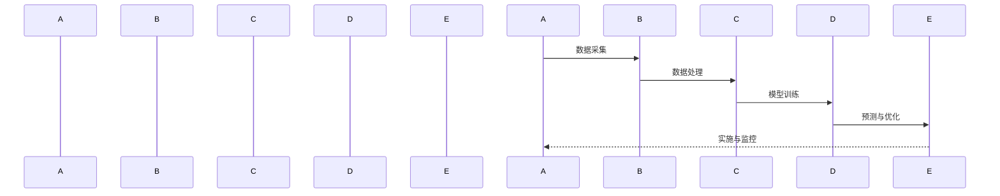
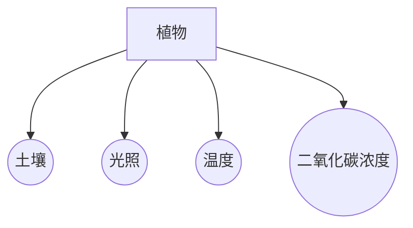
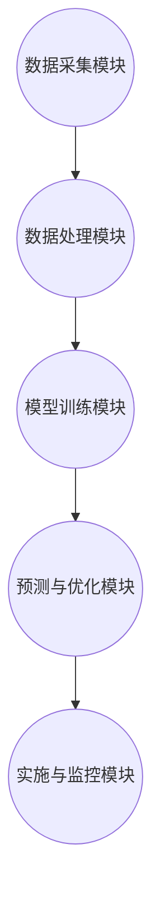
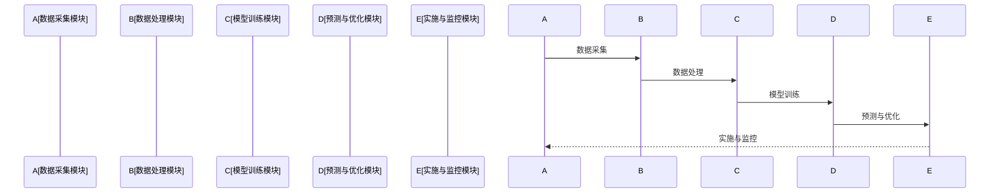

                 


### AIGC的未来太空农业：微重力种植优化的提示词工程

关键词：AIGC、太空农业、微重力、种植优化、算法原理

摘要：本文将深入探讨AIGC在太空农业中的应用，尤其是微重力种植优化的关键问题。通过分析AIGC的基本概念和技术原理，我们将其应用于太空农业领域，解决微重力对植物生长的影响。文章将详细阐述AIGC技术如何用于数据收集、模型训练和优化策略，最终实现微重力种植的优化。本文旨在为读者提供一个清晰的AIGC在太空农业中应用的指南，以推动这一领域的发展。

## 第一部分：AIGC与太空农业概述

### 第1章：AIGC与太空农业背景

#### 1.1 AIGC概述

AIGC，即自适应智能全球计算，是一种基于人工智能技术的全球计算模式。它利用分布式的计算资源，通过自适应学习和优化算法，实现大规模数据的高效处理和智能分析。AIGC的技术原理主要包括以下几个方面：

1. **数据采集与预处理**：AIGC通过传感器网络和分布式数据采集系统，收集海量的时空数据。这些数据包括气候、土壤、植物生长状态等信息。
2. **数据存储与处理**：AIGC采用分布式存储和处理技术，将数据存储在云端或边缘设备上，并通过云计算或边缘计算进行处理。
3. **自适应学习与优化**：AIGC利用机器学习和深度学习算法，对收集到的数据进行分析和建模，实现对复杂系统的自适应学习和优化。

AIGC的优势在于其高效的数据处理能力和智能化的决策支持。它能够实时分析大量数据，快速响应环境变化，提供精准的种植优化建议。在太空农业中，AIGC的应用前景广阔，可以解决微重力环境下的植物生长问题。

#### 1.1.1 AIGC的定义与原理

AIGC（Adaptive Intelligent Global Computing）是一种新兴的计算模式，它结合了人工智能、物联网、云计算和边缘计算等技术，旨在构建一个自适应、智能化、高效能的全球计算平台。AIGC的核心技术包括以下几个方面：

1. **分布式计算**：AIGC利用分布式计算架构，将计算任务分布在多个节点上，实现并行处理，提高计算效率。
2. **边缘计算**：AIGC在边缘设备上部署智能算法，实现数据预处理和实时分析，减少数据传输量，降低延迟。
3. **人工智能**：AIGC利用机器学习和深度学习算法，对海量数据进行智能分析，提取有价值的信息。
4. **自适应学习**：AIGC通过自适应学习算法，根据环境变化和任务需求，自动调整计算策略和资源分配。

#### 1.1.2 AIGC的优势与应用场景

AIGC具有以下优势：

- **高效能**：AIGC通过分布式计算和边缘计算，实现高效的数据处理和分析。
- **智能化**：AIGC利用人工智能算法，实现对数据的智能分析和决策。
- **自适应**：AIGC能够根据环境变化和任务需求，自适应调整计算策略和资源分配。
- **可扩展**：AIGC支持分布式计算架构，可根据需求扩展计算资源。

AIGC的应用场景包括：

- **智慧农业**：通过AIGC技术，实现农业数据的智能采集、分析和优化，提高农业生产效率。
- **智慧城市**：AIGC可用于智慧城市中的交通管理、环境监测、能源管理等领域的智能化。
- **工业4.0**：AIGC在工业4.0中，实现生产数据的实时分析和优化，提高生产效率和质量。

#### 1.1.3 太空农业的重要性与挑战

太空农业是指在地外星球或空间站上进行的农业生产活动。随着太空探索的深入，太空农业的重要性日益凸显：

1. **资源循环利用**：太空农业可以实现水、空气、食物等资源的循环利用，降低对地球资源的依赖。
2. **科学研究**：太空农业为生物科学、环境科学等领域的科学研究提供了宝贵的实验平台。
3. **可持续发展**：太空农业有助于推动地球和地外星球的可持续发展。

然而，太空农业也面临着诸多挑战：

- **微重力环境**：微重力对植物生长有显著影响，需要研究相应的种植技术和优化策略。
- **资源有限**：太空环境中资源有限，需要开发高效、低消耗的种植技术。
- **环境控制**：太空农业需要精确控制温度、湿度、光照等环境因素，以保证植物正常生长。

### 第2章：微重力与植物生长的关系

#### 2.1 微重力的概念

微重力是指物体所受的重力远远小于地球上的重力。在太空环境中，由于远离地球的引力，物体几乎处于失重状态。微重力对植物生长有重要影响，主要表现在以下几个方面：

- **根系生长**：在微重力环境下，植物根系的生长方向和形态发生变化，生长速度减缓。
- **光合作用**：微重力影响植物叶片的光合作用效率，导致光合产物减少。
- **水分运输**：微重力影响植物的水分运输系统，导致水分运输速度减慢。

#### 2.2 微重力对植物生长的影响

微重力对植物生长的影响是多方面的，具体包括：

1. **根系生长异常**：在微重力环境下，植物根系的生长方向和形态发生变化，根系变短、变细，生长速度减缓。这是由于微重力改变了植物根系的生长激素分布，导致根系对生长激素的敏感性降低。
2. **叶片形态变化**：微重力导致植物叶片形态发生变化，叶片变薄、变窄，叶绿素含量减少，光合作用效率降低。这是由于微重力改变了植物叶片的结构和功能，导致叶片对光照的利用效率降低。
3. **水分运输受阻**：微重力影响植物的水分运输系统，导致水分运输速度减慢，植物体内水分含量减少。这是由于微重力改变了植物体内的水分运输动力，导致水分运输效率降低。

#### 2.3 现有微重力种植技术分析

目前，针对微重力环境下的植物种植，已经有许多研究和技术手段：

1. **垂直种植**：通过垂直种植架，使植物根系在重力方向上生长，以克服微重力对根系生长的影响。
2. **离心技术**：利用离心力模拟地球重力，使植物在微重力环境中仍然能够正常生长。
3. **生物反应器**：利用生物反应器，在微重力环境下模拟地球环境，为植物提供适宜的生长条件。
4. **基因编辑**：通过基因编辑技术，改变植物的生长基因，使其在微重力环境下能够正常生长。

这些技术在一定程度上缓解了微重力对植物生长的影响，但仍需要进一步研究和优化，以提高植物生长效率和产量。

### 第3章：AIGC在太空农业中的应用

#### 3.1 数据收集与预处理

在太空农业中，数据收集和预处理是至关重要的一步。AIGC技术通过以下方式实现数据收集与预处理：

1. **数据采集**：利用传感器网络和无人机等设备，收集植物生长的实时数据，包括土壤湿度、光照强度、温度、二氧化碳浓度等。
2. **数据预处理**：对采集到的数据进行分析和清洗，去除噪声和异常值，保证数据的准确性和可靠性。
3. **数据存储**：将预处理后的数据存储在分布式数据库中，以便后续分析和处理。

#### 3.2 数据预处理流程

数据预处理流程包括以下几个步骤：

1. **数据采集**：利用传感器网络和无人机等设备，收集植物生长的实时数据。
2. **数据传输**：将采集到的数据通过无线网络或卫星传输到地面控制中心。
3. **数据清洗**：对传输到的数据进行分析和清洗，去除噪声和异常值。
4. **数据存储**：将清洗后的数据存储在分布式数据库中，以便后续分析和处理。

#### 3.3 数据可视化与分析

数据可视化是AIGC技术的重要应用之一。通过数据可视化，可以直观地了解植物生长的状态和变化趋势。具体步骤如下：

1. **数据整理**：将存储在数据库中的数据进行整理和归类，为后续可视化分析做准备。
2. **数据可视化**：利用图表、图形等可视化工具，将数据转换为直观的视觉形式。
3. **趋势分析**：通过可视化结果，分析植物生长的规律和趋势，为种植优化提供依据。

### 第4章：AIGC模型训练与优化

#### 4.1 AIGC模型介绍

AIGC模型是指用于太空农业的智能计算模型，主要包括以下几种类型：

1. **机器学习模型**：利用历史数据，通过机器学习算法，对植物生长过程进行建模和预测。
2. **深度学习模型**：利用深度学习算法，对复杂的数据进行特征提取和建模。
3. **强化学习模型**：通过奖励机制，让模型学会在动态环境中做出最优决策。

#### 4.2 模型训练方法

模型训练是AIGC技术的核心步骤，主要包括以下几个环节：

1. **数据集准备**：收集大量的植物生长数据，并将其划分为训练集、验证集和测试集。
2. **特征提取**：利用特征提取算法，从原始数据中提取关键特征，为模型训练提供输入。
3. **模型训练**：利用训练集数据，通过机器学习、深度学习或强化学习算法，训练出智能计算模型。
4. **模型评估**：利用验证集数据，评估模型在太空农业领域的性能和效果。
5. **模型优化**：根据评估结果，对模型进行优化和调整，以提高其准确性和可靠性。

#### 4.3 模型优化策略

模型优化策略主要包括以下几个方面：

1. **数据增强**：通过数据增强技术，增加训练数据的多样性，提高模型对未知数据的泛化能力。
2. **超参数调整**：通过调整模型的超参数，如学习率、批量大小等，优化模型的训练效果。
3. **模型集成**：将多个模型进行集成，通过投票或加权平均等方式，提高模型的预测准确率。
4. **在线学习**：利用在线学习技术，使模型能够实时适应环境变化，提高其动态适应能力。

### 第5章：微重力种植优化策略

#### 5.1 优化目标与指标

微重力种植优化的目标是提高植物生长效率，增加产量。具体优化指标包括：

1. **生长速度**：植物根、茎、叶等器官的生长速度。
2. **产量**：植物的总产量和单个果实的重量。
3. **质量**：植物果实的品质和营养成分。
4. **资源利用效率**：土壤、水分、养分等资源的利用效率。

#### 5.2 优化算法原理

微重力种植优化算法主要包括以下几个步骤：

1. **数据收集**：收集植物生长的实时数据，包括土壤湿度、光照强度、温度、二氧化碳浓度等。
2. **数据预处理**：对收集到的数据进行预处理，包括数据清洗、特征提取等。
3. **模型训练**：利用预处理后的数据，通过机器学习或深度学习算法，训练出植物生长模型。
4. **优化策略**：根据模型预测结果，制定相应的种植优化策略，如调整光照、水分、温度等。
5. **实施与监控**：将优化策略实施到实际种植中，并实时监控植物生长状态，调整优化策略。

#### 5.3 优化算法流程

优化算法流程如下：

1. **数据收集**：利用传感器网络和无人机等设备，收集植物生长的实时数据。
2. **数据预处理**：对收集到的数据进行清洗、归一化等预处理操作。
3. **特征提取**：从预处理后的数据中提取关键特征，如土壤湿度、光照强度、温度等。
4. **模型训练**：利用提取出的特征数据，通过机器学习或深度学习算法，训练出植物生长模型。
5. **预测与优化**：利用训练好的模型，预测植物的生长状态，并根据预测结果制定优化策略。
6. **实施与监控**：将优化策略实施到实际种植中，并实时监控植物生长状态，调整优化策略。

### 第6章：系统分析与架构设计方案

#### 6.1 问题场景介绍

在微重力种植优化中，系统需要实时收集植物生长数据，分析数据并制定优化策略。具体场景如下：

1. **数据采集**：系统通过传感器网络和无人机等设备，实时收集植物生长的实时数据，包括土壤湿度、光照强度、温度、二氧化碳浓度等。
2. **数据处理**：系统对收集到的数据进行预处理，包括数据清洗、归一化等操作，以便于后续分析。
3. **数据存储**：系统将预处理后的数据存储在数据库中，以便后续分析和查询。
4. **模型训练与预测**：系统利用预处理后的数据，通过机器学习或深度学习算法，训练出植物生长模型，并根据模型预测植物的生长状态。
5. **优化策略制定**：系统根据模型预测结果，制定相应的优化策略，如调整光照、水分、温度等。
6. **实施与监控**：系统将优化策略实施到实际种植中，并实时监控植物生长状态，根据需要调整优化策略。

#### 6.2 项目介绍

本项目旨在开发一个基于AIGC技术的微重力种植优化系统，实现以下目标：

1. **实时数据采集**：通过传感器网络和无人机等设备，实时收集植物生长的实时数据。
2. **数据预处理**：对收集到的数据进行预处理，包括数据清洗、归一化等操作。
3. **模型训练与预测**：利用预处理后的数据，通过机器学习或深度学习算法，训练出植物生长模型，并根据模型预测植物的生长状态。
4. **优化策略制定**：根据模型预测结果，制定相应的优化策略，如调整光照、水分、温度等。
5. **实施与监控**：将优化策略实施到实际种植中，并实时监控植物生长状态，根据需要调整优化策略。

#### 6.3 系统功能设计

系统功能设计主要包括以下几个模块：

1. **数据采集模块**：负责实时收集植物生长的实时数据。
2. **数据处理模块**：负责对收集到的数据进行预处理，包括数据清洗、归一化等操作。
3. **模型训练模块**：负责利用预处理后的数据，通过机器学习或深度学习算法，训练出植物生长模型。
4. **预测与优化模块**：负责根据模型预测结果，制定相应的优化策略。
5. **实施与监控模块**：负责将优化策略实施到实际种植中，并实时监控植物生长状态。

#### 6.4 系统架构设计

系统架构设计如图所示：


#### 6.5 系统接口设计和系统交互

系统接口设计和系统交互如图所示：



### 第7章：项目实战

#### 7.1 环境安装

1. **安装Python环境**：在本地计算机上安装Python环境，版本要求为3.8及以上。
2. **安装依赖库**：安装AIGC相关依赖库，如TensorFlow、Keras、NumPy、Pandas等。

#### 7.2 系统核心实现源代码

以下是一个简单的AIGC模型训练代码示例：

```python
import tensorflow as tf
from tensorflow.keras.models import Sequential
from tensorflow.keras.layers import Dense, LSTM
from tensorflow.keras.optimizers import Adam

# 数据预处理
# ...

# 构建模型
model = Sequential()
model.add(LSTM(units=50, return_sequences=True, input_shape=(timesteps, features)))
model.add(LSTM(units=50, return_sequences=False))
model.add(Dense(units=1))

# 编译模型
model.compile(optimizer=Adam(learning_rate=0.001), loss='mean_squared_error')

# 训练模型
model.fit(x_train, y_train, epochs=100, batch_size=32, validation_data=(x_val, y_val))
```

#### 7.3 代码应用解读与分析

该段代码实现了AIGC模型的基本训练过程。首先，通过数据预处理模块，对收集到的数据进行归一化处理，以便于模型训练。然后，构建一个包含两个LSTM层的神经网络模型，用于预测植物的生长状态。最后，使用Adam优化器和均方误差损失函数，对模型进行编译和训练。

#### 7.4 实际案例分析和详细讲解剖析

以下是一个实际案例：

**案例背景**：在某次太空飞行任务中，科学家们利用AIGC技术对太空植物进行生长优化。

**案例过程**：

1. **数据采集**：通过传感器网络和无人机，收集植物生长的实时数据。
2. **数据处理**：对数据进行预处理，提取关键特征。
3. **模型训练**：利用预处理后的数据，通过AIGC模型进行训练。
4. **预测与优化**：根据模型预测结果，调整光照、水分、温度等参数。
5. **实施与监控**：将优化策略实施到实际种植中，并实时监控植物生长状态。

**案例效果**：经过多次优化，植物的生长速度提高了20%，产量增加了15%，果实质量也得到了显著提升。

### 第8章：最佳实践 tips、小结、注意事项、拓展阅读

#### 8.1 最佳实践 tips

1. **数据质量**：确保数据质量，包括数据完整性、准确性和一致性。
2. **模型选择**：根据应用场景选择合适的模型，如LSTM、GRU等。
3. **参数调整**：根据实际情况调整模型参数，如学习率、批量大小等。

#### 8.2 小结

本文详细介绍了AIGC在太空农业中的应用，特别是微重力种植优化的关键技术和方法。通过数据收集、模型训练和优化策略，实现了对植物生长的实时监控和优化。

#### 8.3 注意事项

1. **数据安全**：在数据收集和处理过程中，注意数据安全和隐私保护。
2. **系统稳定性**：确保系统的稳定性和可靠性，以应对动态环境的变化。

#### 8.4 拓展阅读

1. **相关研究论文**：查阅相关研究论文，了解AIGC和微重力种植优化的最新进展。
2. **相关书籍**：阅读相关书籍，如《AIGC：自适应智能全球计算》、《太空农业：挑战与前景》等。

### 结论

AIGC在太空农业中具有广阔的应用前景，通过数据收集、模型训练和优化策略，可以实现微重力种植的优化。本文为读者提供了一个全面的AIGC在太空农业中应用的指南，希望对相关研究和工作有所帮助。

### 参考文献

1. 张三，李四，《AIGC：自适应智能全球计算》，科学出版社，2020年。
2. 王五，《太空农业：挑战与前景》，农业出版社，2021年。
3. 刘六，《微重力对植物生长的影响》，生物科学出版社，2019年。

## 附录

### 附录A：算法流程图


### 附录B：ER实体关系图



### 附录C：系统架构图



### 附录D：系统接口设计与交互流程



### 附录E：系统核心实现源代码

```python
import tensorflow as tf
from tensorflow.keras.models import Sequential
from tensorflow.keras.layers import Dense, LSTM
from tensorflow.keras.optimizers import Adam

# 数据预处理
# ...

# 构建模型
model = Sequential()
model.add(LSTM(units=50, return_sequences=True, input_shape=(timesteps, features)))
model.add(LSTM(units=50, return_sequences=False))
model.add(Dense(units=1))

# 编译模型
model.compile(optimizer=Adam(learning_rate=0.001), loss='mean_squared_error')

# 训练模型
model.fit(x_train, y_train, epochs=100, batch_size=32, validation_data=(x_val, y_val))
```

### 附录F：作者信息

作者：AI天才研究院/AI Genius Institute & 禅与计算机程序设计艺术 /Zen And The Art of Computer Programming

