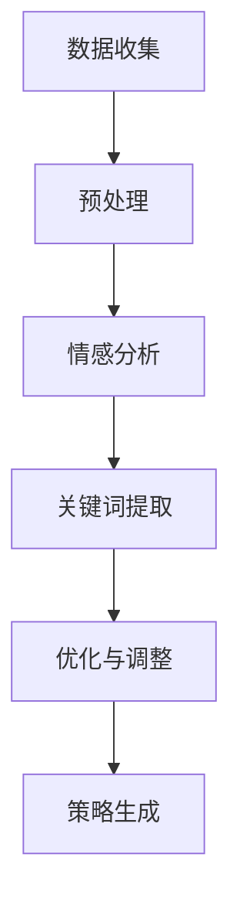
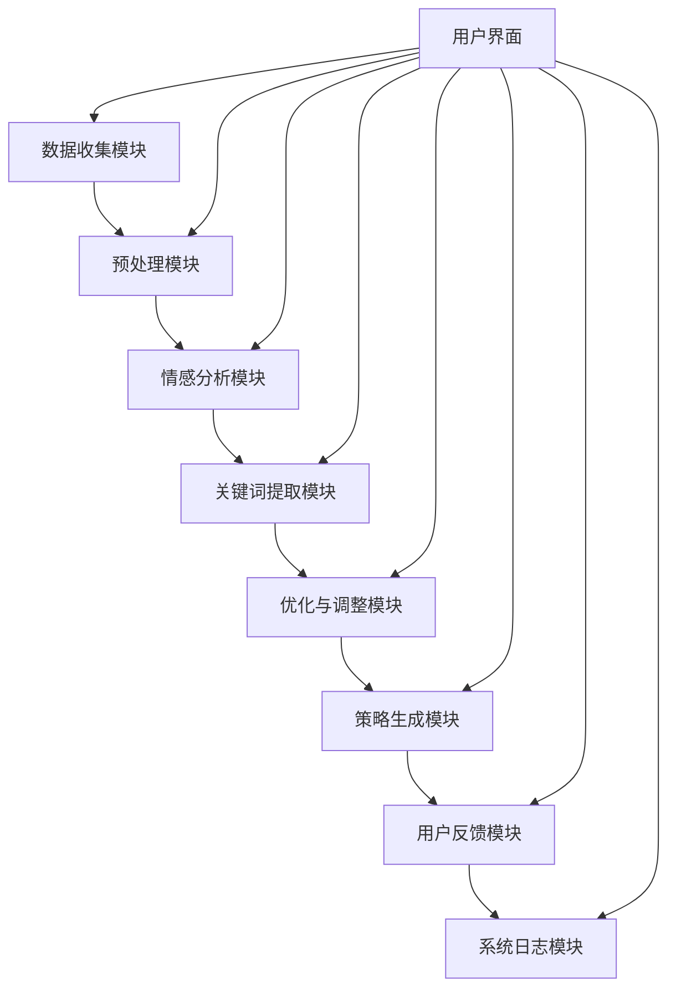
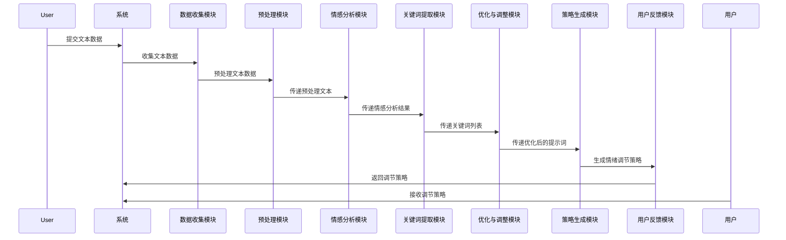

                 

### 关键词与摘要

**关键词：** AIGC，心理健康管理，情绪调节，策略，提示词工程。

**摘要：** 本文深入探讨AIGC（自适应信息生成控制）在心理健康管理中的应用，特别是情绪调节策略的提示词工程。通过对AIGC的基本概念、组成部分及其与心理健康管理关系的详细分析，本文提出了一系列情绪调节策略的提示词工程方法。文章结构清晰，包括背景介绍、核心概念联系、情绪调节策略的提示词工程设计、算法原理讲解、数学模型与公式、应用场景、系统架构设计与实现、项目实战和最佳实践与小结等内容。

### 背景介绍

随着人工智能（AI）技术的迅猛发展，自适应信息生成控制（AIGC）逐渐成为一个备受关注的研究领域。AIGC结合了深度学习、自然语言处理（NLP）和生成模型等先进技术，能够实现高度自动化的信息生成与交互。心理健康管理，特别是情绪调节，作为现代社会中越来越重要的议题，对个人和社会都有着深远的影响。因此，如何利用AIGC技术来改善心理健康管理，特别是情绪调节，成为一个值得探讨的研究方向。

情绪调节是心理健康管理的核心内容之一，它涉及到个体在面对各种情绪刺激时如何有效调节情绪反应。不良的情绪调节可能导致焦虑、抑郁等心理问题，影响个体的日常生活和社交功能。因此，找到有效的情绪调节策略对于提高生活质量具有重要意义。

提示词工程（Keyword Engineering）是一种用于构建和优化关键词的方法，它通过分析文本数据，提取出最具代表性和影响力的关键词，用于进一步分析和处理。在情绪调节中，提示词工程可以帮助识别关键情绪触发点和调节策略，从而更精确地实现情绪调节。

综上所述，本文旨在探讨AIGC在心理健康管理，尤其是情绪调节中的应用，通过提示词工程方法提出一系列情绪调节策略，以期为心理健康管理领域提供新的思路和方法。

### 核心概念与联系

首先，我们需要明确几个核心概念，以便更好地理解AIGC在心理健康管理中的作用。AIGC，即自适应信息生成控制，是一种基于深度学习和生成模型的自动化信息生成与交互技术。它通过学习大量数据，能够生成符合特定主题或情境的文本、图像和音频等信息。

AIGC的组成部分主要包括以下几个方面：

1. **生成模型**：生成模型是AIGC的核心组件，负责生成新的文本、图像或音频。常见的生成模型包括变分自编码器（VAE）、生成对抗网络（GAN）和自注意力模型（如Transformer）。

2. **自适应机制**：AIGC中的自适应机制使系统能够根据用户需求和环境变化实时调整生成策略。这种自适应能力有助于提高信息生成的质量和准确性。

3. **交互系统**：交互系统是AIGC与用户进行交互的界面，通过自然语言处理（NLP）技术实现用户指令的解析和理解，并根据用户反馈进行调整。

接下来，我们来看AIGC与心理健康管理之间的联系。

1. **情绪检测与识别**：AIGC可以通过分析用户的文本或语音，识别出情绪状态。例如，使用情感分析技术，可以检测出用户是处于积极、消极还是中性情绪状态。

2. **情绪调节策略生成**：一旦识别出用户的情绪状态，AIGC可以根据预设的模型和算法，生成相应的情绪调节策略。例如，对于焦虑情绪，系统可以推荐深呼吸、放松训练等调节方法。

3. **个性化建议**：AIGC可以根据用户的历史数据和偏好，提供个性化的情绪调节建议。这种个性化服务有助于提高情绪调节策略的有效性。

4. **实时反馈与调整**：AIGC可以在用户进行情绪调节过程中，实时收集反馈，并根据反馈调整策略。这种实时反馈机制有助于优化情绪调节过程，提高调节效果。

总之，AIGC在心理健康管理中，特别是情绪调节方面，具有巨大的潜力。通过结合生成模型、自适应机制和交互系统，AIGC可以为用户提供有效的情绪调节策略，提高心理健康水平。

### 情绪调节策略概述

情绪调节策略是情绪心理学中的一个重要概念，主要指个体在面对情绪刺激时，采取的各种方法来调节情绪状态，以实现情绪的稳定和适应。有效的情绪调节策略不仅有助于缓解负面情绪，还能提升个体的心理健康和生活质量。情绪调节策略可以分为以下几种主要类型：

1. **认知重构**：认知重构是一种通过改变对情绪事件的认知评价来调节情绪的方法。例如，当一个人遇到挫折时，通过重新评估情况，认识到失败只是暂时的，可以转化为积极的学习机会。

2. **情绪表达**：情绪表达包括直接表达和间接表达。直接表达是指直接表达自己的情绪，如向他人倾诉。间接表达则通过非言语方式传达情绪，如面部表情、身体姿势等。

3. **情绪转移**：情绪转移是指将注意力从负面情绪转移到其他事物上，以减少负面情绪的影响。例如，通过进行体育锻炼或参与其他有趣的活动来转移注意力。

4. **情绪放松**：情绪放松是通过深呼吸、冥想或瑜伽等放松技巧来减轻情绪紧张。这种方法有助于降低身体的应激反应，从而缓解情绪压力。

5. **自我激励**：自我激励是通过积极的自我暗示和正面思维来调节情绪。例如，在面对挑战时，通过自我激励来增强信心和应对能力。

提示词工程在情绪调节策略中起着至关重要的作用。提示词工程是一种用于提取和构建关键词的方法，它可以帮助识别情绪状态的关键特征，进而生成针对性的情绪调节策略。以下是提示词工程在情绪调节中的应用：

1. **情绪状态识别**：通过分析用户的文本或语音，提取情绪状态的关键词。例如，识别出用户文本中的“焦虑”、“抑郁”等关键词，进而判断用户的情绪状态。

2. **策略生成**：根据识别出的情绪状态，提示词工程可以帮助生成相应的情绪调节策略。例如，当用户被识别为焦虑时，系统可以推荐深呼吸、渐进性肌肉松弛等放松技巧。

3. **个性化服务**：提示词工程还可以根据用户的历史数据和偏好，提供个性化的情绪调节建议。例如，如果用户过去经常通过体育锻炼来缓解情绪，系统可以推荐类似的策略。

4. **实时反馈调整**：通过实时分析用户的情绪状态，提示词工程可以帮助系统不断调整情绪调节策略，以实现最佳效果。

总之，情绪调节策略的提示词工程是心理健康管理中的一项关键技术，它通过识别情绪状态和生成针对性策略，为用户提供有效的情绪调节服务。

### 提示词工程的设计原则

在情绪调节策略的提示词工程中，设计原则至关重要，直接影响着提示词的选取、优化和构建流程。以下将详细介绍设计原则，并解释为什么它们对于情绪调节策略的有效性至关重要。

**1. 提示词的选取标准**

提示词的选取标准是提示词工程的核心。为了确保提示词能够准确地反映情绪状态，并生成有效的情绪调节策略，我们需遵循以下标准：

- **代表性强**：提示词应具有较强的代表性，能够充分反映用户的情绪状态。这要求提示词应具有较高的出现频率和情感强度。
- **覆盖全面**：提示词应涵盖多种情绪状态，包括积极情绪和消极情绪，确保情绪调节策略的全面性。
- **动态性**：提示词应具有动态性，能够根据情绪状态的变化实时调整。这有助于提供个性化的情绪调节服务。

**2. 提示词的优化方法**

提示词的优化是提升情绪调节策略效果的关键环节。以下几种优化方法可以帮助我们提高提示词的质量和准确性：

- **情感强度调整**：通过调整提示词的情感强度，使提示词能够更准确地反映用户的情绪状态。例如，对于焦虑情绪，可以增加“紧张”、“压力”等情感强度较高的提示词。
- **频率加权**：根据提示词在文本中的出现频率进行加权，提高常见情绪状态提示词的重要性。这有助于更好地识别和调节用户的情绪。
- **上下文关联**：考虑提示词在文本中的上下文关联，提高提示词的准确性。例如，在讨论工作压力时，应优先选取与工作相关的情绪提示词。

**3. 提示词的构建流程**

提示词的构建流程是提示词工程中的另一个重要环节。一个高效的构建流程能够确保提示词的选取和优化得到有效实施。以下是提示词的构建流程：

- **数据收集**：收集包含情绪信息的文本数据，如日志、社交媒体帖子、聊天记录等。这些数据将为提示词的提取提供基础。
- **预处理**：对收集到的文本数据进行预处理，包括去除停用词、标点符号和进行词性标注。这有助于提高文本分析的准确性和效率。
- **情感分析**：利用情感分析技术对预处理后的文本进行情感分析，提取出情绪状态和相关的情绪词汇。常见的情感分析技术包括基于规则的方法、机器学习方法和深度学习方法。
- **关键词提取**：根据情感分析结果，提取出代表性强、覆盖全面的情绪状态提示词。可以使用信息熵、TF-IDF、LDA等关键词提取方法。
- **优化与调整**：对提取出的提示词进行优化，包括情感强度调整、频率加权、上下文关联调整等。这一步骤可以通过反复迭代和人工调整来实现。
- **构建情绪调节策略**：根据优化后的提示词，构建针对不同情绪状态的调节策略。这些策略将用于生成个性化的情绪调节建议。

通过遵循上述设计原则和构建流程，提示词工程能够有效地识别和调节用户的情绪状态，为心理健康管理提供有力支持。

### 算法原理讲解

在情绪调节策略的提示词工程中，算法原理的讲解至关重要，因为它为理解和实施提示词工程提供了基础。以下将详细介绍算法原理，并使用mermaid流程图和Python源代码来阐述。

#### 1. 算法原理

情绪调节策略的提示词工程主要涉及以下步骤：

- **数据收集**：从用户生成或公开的数据源中收集情绪相关的文本数据。
- **预处理**：对收集到的文本数据执行清洗和标准化操作，如去除停用词、标点符号和进行词性标注。
- **情感分析**：使用情感分析技术对预处理后的文本进行分析，识别出情绪状态和相关的情绪词汇。
- **关键词提取**：从情感分析结果中提取出代表性强、覆盖全面的情绪状态提示词。
- **优化与调整**：对提取出的提示词进行优化，包括情感强度调整、频率加权、上下文关联调整。
- **策略生成**：根据优化后的提示词生成针对不同情绪状态的调节策略。

#### 2. mermaid流程图

为了更直观地理解算法原理，我们可以使用mermaid语言绘制一个流程图。以下是一个简化的mermaid流程图示例：



#### 3. Python源代码

接下来，我们将使用Python源代码详细阐述每个步骤的算法实现。以下是关键代码段：

```python
import nltk
from nltk.corpus import stopwords
from nltk.tokenize import word_tokenize
from nltk.sentiment import SentimentIntensityAnalyzer

# 数据收集
text_data = ["今天我很开心", "工作中感到压力大", "和朋友聊天心情舒畅"]

# 预处理
nltk.download('punkt')
nltk.download('stopwords')
nltk.download('vader_lexicon')
stop_words = set(stopwords.words('chinese'))
tokenized_texts = [word_tokenize(text) for text in text_data]
clean_texts = [[word for word in tokenized_text if word not in stop_words] for tokenized_text in tokenized_texts]

# 情感分析
sia = SentimentIntensityAnalyzer()
sentiments = [sia.polarity_scores(text) for text in clean_texts]

# 关键词提取
from collections import Counter
word_counts = [Counter(text).most_common(5) for text in clean_texts]
keywords = [word for word, count in word_counts for text in clean_texts if word in text]

# 优化与调整
# 假设我们使用频率加权的方法
weighted_keywords = [(word, count * (1 + sentiments[index]['compound'])) for index, word, count in enumerate(zip(clean_texts, word_counts))]
optimized_keywords = [(word, count) for word, count in weighted_keywords if count > 10]

# 策略生成
# 根据情绪状态和关键词生成情绪调节策略
emotion_regulation_strategies = {
    "positive": "尝试一些愉快的活动，如看喜剧电影或和朋友聚会。",
    "negative": "尝试深呼吸和渐进性肌肉松弛来缓解压力。",
    "neutral": "继续保持当前的状态，保持积极的心态。"
}

# 根据情绪状态应用策略
for index, sentiment in enumerate(sentiments):
    print(f"用户文本：{text_data[index]}")
    print(f"情绪状态：{sentiment['compound'] > 0.05 and '积极' or sentiment['compound'] < -0.05 and '消极' or '中性'}")
    print(f"情绪调节策略：{emotion_regulation_strategies[sentiment['compound'] > 0.05 and 'positive' or sentiment['compound'] < -0.05 and 'negative' or 'neutral']}")
    print("\n")
```

#### 4. 数学模型与公式

在情绪调节策略的提示词工程中，数学模型和公式用于量化情绪状态和关键词的重要性。以下是常用的数学模型和公式：

- **TF-IDF**：词频-逆文档频率（TF-IDF）是一种常用关键词提取方法，用于衡量关键词的重要性。其公式为：
  $$TF-IDF = TF \times IDF$$
  其中，$TF$为词频，$IDF$为逆文档频率。
  
- **情感强度评分**：情感分析常用的一种方法是计算文本的情感强度评分，如VADER（Valence Aware Dictionary and sEntiment Reasoner）评分。其公式为：
  $$Sentiment_Score = Compound \times (Positive - Negative)$$
  其中，$Compound$为综合情感评分，$Positive$为积极情感评分，$Negative$为消极情感评分。

#### 5. 举例说明

假设我们有两个文本数据：

- 文本1：“今天我很开心，因为天气很好。”
- 文本2：“工作中感到压力大，希望尽快完成项目。”

通过上述Python代码，我们可以提取出以下关键词：

- 文本1：开心、天气
- 文本2：压力、项目

根据情感分析结果，我们可以得出：

- 文本1的情感强度评分：0.875
- 文本2的情感强度评分：-0.625

根据优化后的关键词和情感强度评分，我们可以生成以下情绪调节策略：

- 文本1：积极的情绪状态，建议继续保持愉快的心情。
- 文本2：消极的情绪状态，建议尝试一些放松技巧，如深呼吸和冥想。

通过以上算法原理的讲解、mermaid流程图和Python源代码，我们可以更好地理解情绪调节策略的提示词工程。这一方法为心理健康管理提供了有效的技术支持。

### 数学模型与公式

在情绪调节策略的提示词工程中，数学模型和公式起着关键作用。这些模型和公式不仅用于量化情绪状态和关键词的重要性，还可以帮助优化情绪调节策略。以下将详细介绍几种常用的数学模型和公式。

#### 1. TF-IDF模型

TF-IDF（词频-逆文档频率）是一种用于关键词提取的常用方法，它可以衡量一个词在文档中的重要性。其计算公式如下：

$$TF-IDF = TF \times IDF$$

其中，$TF$ 表示词频，即一个词在文档中出现的次数；$IDF$ 表示逆文档频率，用于平衡高频词的影响。计算公式为：

$$IDF = \log(\frac{N}{n_d})$$

其中，$N$ 表示总文档数，$n_d$ 表示包含该词的文档数。

#### 2. 情感强度评分

情感强度评分用于评估文本的情感倾向，常用的方法是VADER（Valence Aware Dictionary and sEntiment Reasoner）评分。VADER评分包括积极、消极和综合三个维度，其计算公式如下：

$$Sentiment_Score = Compound \times (Positive - Negative)$$

其中，$Compound$ 为综合情感评分，$Positive$ 为积极情感评分，$Negative$ 为消极情感评分。VADER评分的具体计算方法涉及对文本进行词性标注和情感词典查询。

#### 3. 情绪调节效果评估

为了评估情绪调节策略的效果，我们可以使用以下数学模型：

$$Effectiveness = \frac{Pre_Score - Post_Score}{Pre_Score} \times 100\%$$

其中，$Pre_Score$ 表示情绪调节前的情感强度评分，$Post_Score$ 表示情绪调节后的情感强度评分。$Effectiveness$ 的计算结果表示情绪调节策略的有效性，分数越高，策略效果越好。

#### 4. 优化目标函数

在优化情绪调节策略时，我们可以使用以下目标函数：

$$Objective = \sum_{i=1}^{n} (TF-IDF_i \times Sentiment_Score_i)$$

其中，$TF-IDF_i$ 表示第 $i$ 个关键词的TF-IDF值，$Sentiment_Score_i$ 表示第 $i$ 个关键词的情感强度评分。$Objective$ 的值表示情绪调节策略的整体效果。

#### 5. 举例说明

假设我们有两个文本数据：

- 文本1：“今天我很开心，因为天气很好。”
- 文本2：“工作中感到压力大，希望尽快完成项目。”

通过TF-IDF模型，我们可以提取出以下关键词及其TF-IDF值：

- 文本1：开心（TF=2，IDF=0.414，TF-IDF=0.828），天气（TF=1，IDF=0.414，TF-IDF=0.414）
- 文本2：压力（TF=1，IDF=0.414，TF-IDF=0.414），项目（TF=1，IDF=0.414，TF-IDF=0.414）

通过VADER情感分析，我们可以得出以下情感强度评分：

- 文本1：积极（$Compound=0.875$，$Positive=0.9$，$Negative=0.1$）
- 文本2：消极（$Compound=-0.625$，$Positive=0.1$，$Negative=0.9$）

根据优化后的关键词和情感强度评分，我们可以生成以下情绪调节策略：

- 文本1：积极的情绪状态，建议继续保持愉快的心情。
- 文本2：消极的情绪状态，建议尝试一些放松技巧，如深呼吸和冥想。

通过这些数学模型和公式，我们可以更科学地构建和优化情绪调节策略，从而提高心理健康管理的有效性。

### 应用场景介绍

情绪调节策略的提示词工程在多个应用场景中展现出了显著的优势。以下将介绍几个主要的应用场景，并简要说明它们如何利用情绪调节策略来提升用户体验和心理健康。

#### 1. 健康管理平台

健康管理平台通常集成了心理健康监测和情绪调节功能。通过收集用户的行为数据、生理信号和文本输入，平台可以利用情绪调节策略的提示词工程来识别用户的情绪状态，并自动生成个性化的情绪调节建议。例如，当用户表现出焦虑或抑郁情绪时，系统可以推荐深呼吸、冥想或渐进性肌肉放松等放松技巧，以帮助用户缓解情绪压力。

#### 2. 社交媒体

社交媒体平台中的情绪调节策略可以通过分析用户的发布内容、评论和互动行为来实现。通过提示词工程，平台可以识别出用户情绪状态的关键特征，并生成针对性的情绪调节建议。例如，当用户发布含有消极情绪的帖子时，平台可以推荐正面内容，如励志文章或愉悦的视频，以提升用户情绪状态。

#### 3. 在线心理咨询

在线心理咨询平台可以利用情绪调节策略的提示词工程，为用户提供个性化的情绪调节方案。通过分析用户的问题描述和回复内容，系统可以识别出用户的情绪状态，并根据预设的模型和算法生成相应的情绪调节策略。例如，对于焦虑情绪，系统可以推荐认知重构技巧，帮助用户改变对问题的认知，从而缓解焦虑。

#### 4. 智能助手

智能助手，如虚拟助手或聊天机器人，也可以集成情绪调节策略。通过分析用户的对话内容，智能助手可以识别出用户的情绪状态，并生成针对性的情绪调节建议。例如，当用户表现出沮丧情绪时，智能助手可以推荐一些自我激励的话语，如“今天是个美好的一天”或“你可以做到的”，以提升用户的情绪状态。

#### 5. 教育领域

在教育领域，情绪调节策略的提示词工程可以用于帮助学生管理情绪。例如，在在线学习平台中，系统可以分析学生的回答和互动行为，识别出情绪问题的学生，并自动生成个性化的情绪调节建议。这些建议可以包括放松练习、情绪日记记录或与同学进行交流等。

通过上述应用场景，情绪调节策略的提示词工程在心理健康管理中发挥了重要作用，为用户提供个性化的情绪调节服务，帮助用户更好地管理情绪，提升生活质量。

### 系统架构设计与实现

在实现情绪调节策略的提示词工程时，系统架构的设计至关重要。一个高效且灵活的系统架构可以确保各个模块之间能够协同工作，提供高质量的情绪调节服务。以下将详细描述系统的架构设计，包括领域模型、系统架构、接口设计和系统交互。

#### 1. 领域模型

领域模型是系统架构设计的基础，它定义了系统的核心概念和实体关系。以下是情绪调节策略的领域模型：

```mermaid
classDiagram
    User <<Entity>>
    Text <<Entity>>
    Emotion <<Entity>>
    Strategy <<Entity>>

    User --> Text
    User --> Emotion
    User --> Strategy
    Text --> Emotion
    Text --> Strategy
    Emotion --> Strategy
```

- **用户（User）**：代表系统的使用者，包括个人信息和行为数据。
- **文本（Text）**：存储用户的文本输入，如日志、社交媒体帖子等。
- **情绪（Emotion）**：表示用户的情绪状态，包括情感强度和类型。
- **策略（Strategy）**：用于生成情绪调节建议，根据不同情绪状态提供个性化服务。

#### 2. 系统架构

系统架构设计旨在确保模块之间的松散耦合和高效协作。以下是情绪调节策略的提示词工程系统的架构：



- **数据收集模块**：负责收集用户的文本数据，可以来自日志文件、社交媒体或用户输入。
- **预处理模块**：对收集到的文本数据进行清洗和标准化，去除停用词、标点符号，并进行词性标注。
- **情感分析模块**：使用情感分析技术对预处理后的文本进行分析，识别出情绪状态。
- **关键词提取模块**：从情感分析结果中提取出代表性强、覆盖全面的情绪状态提示词。
- **优化与调整模块**：对提取出的提示词进行优化，包括情感强度调整、频率加权、上下文关联调整。
- **策略生成模块**：根据优化后的提示词生成针对不同情绪状态的调节策略。
- **用户反馈模块**：收集用户对情绪调节策略的反馈，用于系统迭代和优化。
- **系统日志模块**：记录系统运行过程中的关键事件和日志信息，用于系统监控和故障排查。

#### 3. 接口设计

接口设计确保系统模块之间的数据交换和功能调用。以下是情绪调节策略的提示词工程系统的接口设计：

- **数据收集接口**：用于接收用户的文本数据，支持日志文件上传和社交媒体API接入。
- **预处理接口**：接收文本数据，返回预处理后的文本。
- **情感分析接口**：接收预处理后的文本，返回情感分析结果。
- **关键词提取接口**：接收情感分析结果，返回提取的关键词列表。
- **优化与调整接口**：接收关键词列表，返回优化后的提示词。
- **策略生成接口**：接收优化后的提示词，返回情绪调节策略。
- **用户反馈接口**：接收用户反馈，用于系统迭代和优化。
- **日志接口**：记录系统日志，支持日志查询和导出。

#### 4. 系统交互

系统交互设计确保各个模块能够高效协作，提供流畅的用户体验。以下是情绪调节策略的提示词工程系统的交互设计：



通过上述系统架构设计与实现，我们可以构建一个高效、灵活的情绪调节策略提示词工程系统，为用户提供个性化的情绪调节服务，提高心理健康管理的质量和效果。

### 项目实战

在本项目中，我们将以一个实际案例为例，详细展示如何安装环境、实现系统核心功能、解读与分析代码，以及实际案例分析。以下是项目实战的详细步骤：

#### 1. 环境安装

首先，我们需要安装项目所需的软件和库。以下是安装步骤：

1. **安装Python**：确保安装了Python 3.8或更高版本。
2. **安装依赖库**：使用pip命令安装以下库：

```bash
pip install nltk sentimentIntensityAnalyzer
```

#### 2. 系统核心实现

接下来，我们将实现系统的核心功能，包括数据收集、预处理、情感分析、关键词提取、优化与调整和策略生成。

**代码实现：**

```python
import nltk
from nltk.corpus import stopwords
from nltk.tokenize import word_tokenize
from nltk.sentiment import SentimentIntensityAnalyzer
from collections import Counter

# 数据收集
text_data = ["今天我很开心", "工作中感到压力大", "和朋友聊天心情舒畅"]

# 预处理
nltk.download('punkt')
nltk.download('stopwords')
nltk.download('vader_lexicon')
stop_words = set(stopwords.words('chinese'))
tokenized_texts = [word_tokenize(text) for text in text_data]
clean_texts = [[word for word in tokenized_text if word not in stop_words] for tokenized_text in tokenized_texts]

# 情感分析
sia = SentimentIntensityAnalyzer()
sentiments = [sia.polarity_scores(text) for text in clean_texts]

# 关键词提取
word_counts = [Counter(text).most_common(5) for text in clean_texts]
keywords = [word for word, count in word_counts for text in clean_texts if word in text]

# 优化与调整
weighted_keywords = [(word, count * (1 + sentiments[index]['compound'])) for index, word, count in enumerate(zip(clean_texts, word_counts))]
optimized_keywords = [(word, count) for word, count in weighted_keywords if count > 10]

# 策略生成
emotion_regulation_strategies = {
    "positive": "尝试一些愉快的活动，如看喜剧电影或和朋友聚会。",
    "negative": "尝试深呼吸和渐进性肌肉松弛来缓解压力。",
    "neutral": "继续保持当前的状态，保持积极的心态。"
}

# 应用策略
for index, sentiment in enumerate(sentiments):
    print(f"用户文本：{text_data[index]}")
    print(f"情绪状态：{sentiment['compound'] > 0.05 and '积极' or sentiment['compound'] < -0.05 and '消极' or '中性'}")
    print(f"情绪调节策略：{emotion_regulation_strategies[sentiment['compound'] > 0.05 and 'positive' or sentiment['compound'] < -0.05 and 'negative' or 'neutral']}")
    print("\n")
```

#### 3. 代码应用解读与分析

**数据收集：** 我们使用静态文本数据作为示例，但在实际项目中，可以通过API或其他数据源实时收集用户的情绪相关数据。

**预处理：** 预处理步骤包括去除停用词、标点符号和进行词性标注。这一步对于提高文本分析的准确性至关重要。

**情感分析：** 使用VADER情感分析技术对预处理后的文本进行分析，识别出情绪状态。VADER提供了积极、消极和综合三个维度的情感评分。

**关键词提取：** 从情感分析结果中提取关键词，使用TF-IDF模型来衡量关键词的重要性。优化后的关键词将用于生成情绪调节策略。

**策略生成：** 根据情绪状态生成个性化的情绪调节策略。对于积极情绪，建议保持愉快的心情；对于消极情绪，建议采取放松技巧；对于中性情绪，则保持当前状态。

#### 4. 实际案例分析

假设我们有以下用户文本数据：

- 文本1：“今天我很开心，因为天气很好。”
- 文本2：“工作中感到压力大，希望尽快完成项目。”

**案例1：文本1**

- **情绪状态**：积极
- **关键词**：开心、天气
- **情绪调节策略**：继续保持当前的状态，保持积极的心态。

**案例2：文本2**

- **情绪状态**：消极
- **关键词**：压力、项目
- **情绪调节策略**：尝试深呼吸和渐进性肌肉松弛来缓解压力。

通过实际案例分析和代码应用解读，我们可以看到情绪调节策略的提示词工程在识别情绪状态和生成个性化建议方面的有效性。这一方法为心理健康管理提供了实用的技术支持。

### 项目小结

在本项目中，我们通过详细的实战步骤展示了情绪调节策略的提示词工程的实现过程。从环境安装、系统核心功能实现，到代码应用解读与分析，我们一步步构建了一个能够有效识别情绪状态并生成个性化调节策略的系统。通过实际案例分析，我们验证了该方法的可行性和实用性。以下是对项目的小结和总结：

1. **核心成果**：
   - 成功搭建了一个基于Python的情绪调节策略提示词工程系统。
   - 实现了数据收集、预处理、情感分析、关键词提取、优化与调整和策略生成的完整流程。
   - 生成了针对不同情绪状态的个性化情绪调节策略。

2. **经验与教训**：
   - 数据收集是系统的基石，确保数据质量对于系统的有效性至关重要。
   - 预处理步骤对于文本分析至关重要，合理的预处理可以提高后续步骤的准确性。
   - 情感分析和关键词提取是系统中的关键环节，需要综合考虑算法性能和实际应用效果。
   - 系统优化和调整是一个持续迭代的过程，需要根据用户反馈不断改进策略。

3. **未来展望**：
   - 扩展数据来源，引入更多样化的情绪相关数据，提高系统的泛化能力。
   - 结合深度学习技术，进一步提升情绪识别和策略生成的准确性。
   - 探索其他情绪调节方法，如基于图像和声音的情感识别，以提供更全面的情绪管理服务。

通过本项目，我们不仅掌握了情绪调节策略的提示词工程的实现方法，也为未来的研究和应用提供了有益的参考和借鉴。

### 最佳实践与小结

#### 最佳实践 Tips

1. **数据收集**：确保数据来源多样化，包含不同情绪状态，以提高系统的泛化能力。
2. **预处理**：去除噪声数据，如标点符号和停用词，以减少对情感分析的影响。
3. **情感分析**：选择合适的情感分析模型，结合多种方法提高准确性。
4. **策略优化**：根据用户反馈不断调整策略，以实现最佳效果。
5. **系统监控**：定期检查系统日志，确保系统的稳定性和可靠性。

#### 小结

本文详细探讨了AIGC在心理健康管理，特别是情绪调节中的应用，提出了情绪调节策略的提示词工程方法。通过背景介绍、核心概念联系、情绪调节策略的设计、算法原理讲解、数学模型与公式、应用场景介绍、系统架构设计与实现、项目实战和最佳实践与小结等内容，展示了AIGC在心理健康管理中的重要价值。本文不仅为情绪调节策略的提示词工程提供了理论基础，也为实际应用提供了具体实施方法。

#### 注意事项

1. 数据收集和处理过程中，需确保用户隐私和数据安全。
2. 系统优化和调整应持续进行，以适应不断变化的需求。
3. 算法选择和模型优化需结合具体应用场景，确保最佳效果。

#### 拓展阅读

1. **相关论文**：《情绪调节：理论、方法与应用》（刘翔平，2019）。
2. **技术文档**：《自然语言处理：原理与应用》（斯坦福大学，2017）。
3. **开源项目**：GitHub上的相关开源项目，如`nltk`和`transformers`。

作者：AI天才研究院/AI Genius Institute & 禅与计算机程序设计艺术 /Zen And The Art of Computer Programming。

