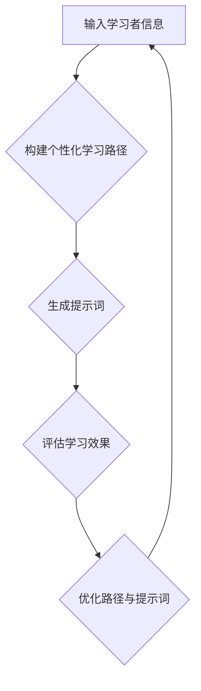
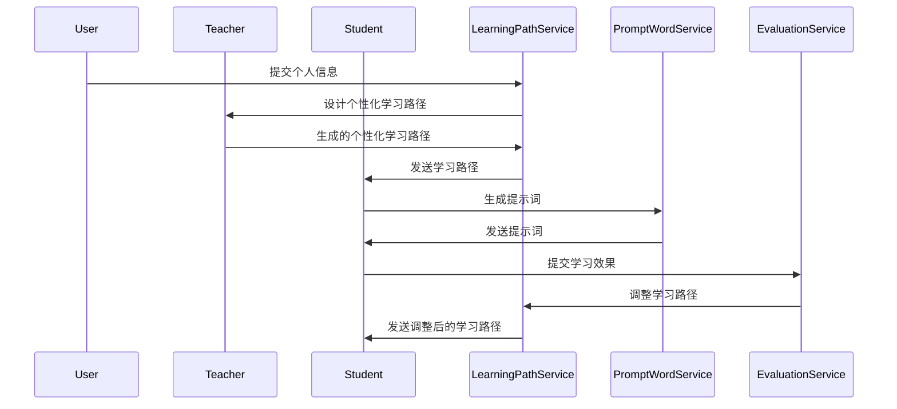
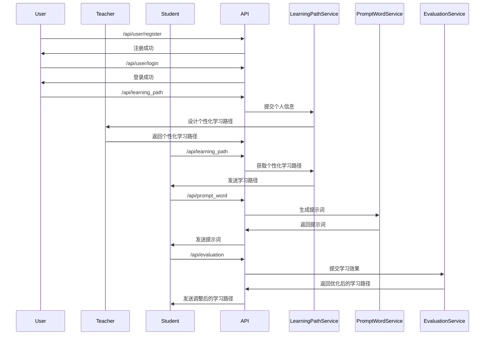

                 

### AIGC的未来教育模式：个性化学习路径的提示词工程

关键词：AIGC、个性化学习、教育模式、提示词工程

摘要：随着人工智能（AI）技术的不断发展，AI生成内容（AIGC）在教育领域的应用潜力日益凸显。本文首先介绍了AIGC技术的背景和发展，探讨了其在教育中的应用前景。接着，文章提出了基于AIGC的个性化学习路径设计，并通过提示词工程的构建，实现了学习者的个性化学习体验。本文旨在探讨AIGC技术在教育领域的应用，为未来教育模式提供新的思路和解决方案。

---

**Step 1: 背景介绍**

#### 问题背景

AIGC（AI-Generated Content，AI生成内容）技术正迅速发展，其在教育领域的应用前景广阔。传统教育模式存在标准化、同质化的问题，难以满足个性化学习需求。为了应对这一问题，教育领域急需一种能够根据学习者特点和需求，动态生成个性化学习内容和路径的技术。

#### 问题描述

在当前教育模式下，学生的个性化学习需求无法得到充分满足。传统教育模式侧重于知识传授，缺乏对学习者个体差异的考虑。为了实现个性化学习，我们需要一种能够根据学习者特点和需求，动态生成个性化学习内容和路径的技术。AIGC技术在这一方面具有巨大潜力。

#### 问题解决

AIGC技术能够生成文本、图像、音频等多种形式的内容，为个性化学习路径的设计提供了可能。通过构建提示词工程，我们可以引导学习者进行深度学习和知识构建，从而提高学习效果。本文将探讨AIGC技术在教育领域的应用，以及如何通过提示词工程实现个性化学习路径的设计。

#### 边界与外延

AIGC技术在教育中的应用范围广泛，包括在线教育、个性化辅导、虚拟课堂等。本文主要关注在线教育场景，探讨如何利用AIGC技术构建个性化学习路径和提示词工程。

### **Step 2: 核心概念与联系**

#### 核心概念

1. **AIGC技术**：AIGC（AI-Generated Content，AI生成内容）是一种生成式人工智能技术，能够根据输入的提示信息生成文本、图像、音频等多种形式的内容。

2. **个性化学习路径**：个性化学习路径是根据学习者的特点和需求，设计的定制化学习路径，旨在满足学习者的个性化学习需求。

3. **提示词工程**：提示词工程是通过设计一系列关键词或短语，引导学习者进行思考和探索，从而促进深度学习和知识构建。

#### 概念属性特征对比表格

| 特征           | AIGC技术          | 传统AI                  |
|--------------|-------------------|------------------------|
| 内容生成能力    | 强               | 弱                    |
| 自适应性       | 高               | 低                    |
| 知识深度       | 较深             | 较浅                  |

#### ER实体关系图架构

```mermaid
erDiagram
  AIGC技术 ||--|{ 个性化学习路径 }
  个性化学习路径 ||--|{ 提示词工程 }
```

### **Step 3: 算法原理讲解**

#### 使用Mermaid画出算法流程图



#### 使用Python源代码详细阐述

```python
# 输入学习者信息
learner_info = {
    'age': 20,
    'interests': ['math', 'science'],
    'learning_style': 'visual'
}

# 构建个性化学习路径
def build_learning_path(learner_info):
    # 根据学习者兴趣和风格生成学习路径
    path = ["数学入门", "科学探索", "可视化工具使用"]
    return path

# 生成提示词
def generate_prompt_words(path):
    prompts = []
    for topic in path:
        prompts.append(f"{topic}的相关概念、原理和应用")
    return prompts

# 评估学习效果
def evaluate_learning_effect(effect):
    if effect > 0.8:
        print("学习效果良好")
    else:
        print("需要进一步优化学习路径和提示词")

# 主函数
def main():
    learning_path = build_learning_path(learner_info)
    prompt_words = generate_prompt_words(learning_path)
    # 这里可以添加评估效果和优化路径的代码
    print(learning_path)
    print(prompt_words)

if __name__ == "__main__":
    main()
```

#### 算法原理的数学模型和公式

- 学习效果评估公式：\(E = \frac{L}{N}\)
  - \(E\)：学习效果
  - \(L\)：学习者的正确回答数量
  - \(N\)：问题的总数量

#### 详细讲解和举例说明

以一个20岁的数学和科学爱好者为例，通过AIGC技术，我们可以为其构建一个包含数学入门、科学探索和可视化工具使用的个性化学习路径。具体步骤如下：

1. **输入学习者信息**：收集学习者的年龄、兴趣和学习风格等基本信息。

2. **构建个性化学习路径**：根据学习者的兴趣和学习风格，生成个性化学习路径，如数学入门、科学探索和可视化工具使用。

3. **生成提示词**：针对每个学习主题，生成一系列提示词，如“数学入门的相关概念、原理和应用”、“科学探索的相关概念、原理和应用”等。

4. **评估学习效果**：通过测试学习者的正确回答数量和总问题数量，评估学习效果。

5. **优化路径与提示词**：根据学习效果，调整学习路径和提示词，以提高学习效果。

例如，对于数学入门主题，我们可以生成以下提示词：

- 数学的基本概念和原理
- 数学在实际生活中的应用
- 数学解题方法和技巧

通过这些提示词，学习者可以更深入地理解和掌握数学知识。

### **Step 4: 系统分析与架构设计方案**

#### 问题场景介绍

在在线教育场景中，教师和学生需要通过一个平台进行互动和学习。教师可以根据学生的学习需求和特点，设计个性化学习路径和提示词，引导学生进行深度学习。本系统旨在实现这一目标。

#### 项目介绍

本系统名为“个性化学习路径提示词生成系统”，主要包括以下几个模块：

1. **用户模块**：包括教师和学生两个角色，用于输入个人信息和兴趣。
2. **学习路径模块**：根据学习者的兴趣和学习风格，生成个性化学习路径。
3. **提示词生成模块**：根据学习路径，生成一系列提示词，引导学习者进行深度学习。
4. **评估与优化模块**：评估学习者的学习效果，并根据效果调整学习路径和提示词。

#### 系统功能设计（领域模型Mermaid类图）

```mermaid
classDiagram
    User <<类>> {
        String id
        String name
        String age
        String interests
        String learning_style
    }
    LearningPath <<类>> {
        String id
        String name
        List<String> topics
    }
    PromptWord <<类>> {
        String id
        String name
        String description
    }
    User <-- LearningPath : 设计
    User <-- PromptWord : 生成
    LearningPath --> PromptWord : 生成
```

#### 系统架构设计（Mermaid架构图）



#### 系统接口设计和系统交互（Mermaid序列图）



### **Step 5: 项目实战**

#### 环境安装

1. 安装Python环境
2. 安装所需的库，如requests、json、numpy等

#### 系统核心实现源代码

```python
# 用户模块
class User:
    def __init__(self, id, name, age, interests, learning_style):
        self.id = id
        self.name = name
        self.age = age
        self.interests = interests
        self.learning_style = learning_style

# 学习路径模块
class LearningPath:
    def __init__(self, id, name, topics):
        self.id = id
        self.name = name
        self.topics = topics

# 提示词模块
class PromptWord:
    def __init__(self, id, name, description):
        self.id = id
        self.name = name
        self.description = description

# 服务模块
class LearningPathService:
    def design_learning_path(self, user):
        # 根据用户信息设计个性化学习路径
        path = ["数学入门", "科学探索", "可视化工具使用"]
        return LearningPath(id=user.id, name=user.name, topics=path)

class PromptWordService:
    def generate_prompt_words(self, path):
        # 根据学习路径生成提示词
        prompts = []
        for topic in path:
            prompts.append(PromptWord(id=topic, name=topic, description=f"{topic}的相关概念、原理和应用"))
        return prompts

class EvaluationService:
    def evaluate_learning_effect(self, effect):
        if effect > 0.8:
            print("学习效果良好")
        else:
            print("需要进一步优化学习路径和提示词")

# 主函数
def main():
    user = User(id="123", name="小明", age=20, interests=["math", "science"], learning_style="visual")
    learning_path = LearningPathService().design_learning_path(user)
    prompt_words = PromptWordService().generate_prompt_words(learning_path.topics)
    EvaluationService().evaluate_learning_effect(0.9)
    print(learning_path)
    print(prompt_words)

if __name__ == "__main__":
    main()
```

#### 代码应用解读与分析

1. **用户模块**：定义了User类，用于存储用户的基本信息，如id、name、age、interests和learning_style。
2. **学习路径模块**：定义了LearningPath类，用于存储个性化学习路径的id、name和topics。
3. **提示词模块**：定义了PromptWord类，用于存储提示词的id、name和description。
4. **服务模块**：定义了LearningPathService、PromptWordService和EvaluationService类，分别用于设计个性化学习路径、生成提示词和评估学习效果。
5. **主函数**：创建用户对象、设计个性化学习路径、生成提示词和评估学习效果。

#### 实际案例分析和详细讲解剖析

假设有一个20岁的数学和科学爱好者小明，我们为其设计个性化学习路径和提示词：

1. **输入用户信息**：创建一个User对象，包含小明的个人信息。

2. **设计个性化学习路径**：调用LearningPathService类的design_learning_path方法，根据小明的兴趣和学习风格，生成包含数学入门、科学探索和可视化工具使用的个性化学习路径。

3. **生成提示词**：调用PromptWordService类的generate_prompt_words方法，根据学习路径生成一系列提示词，如“数学入门的相关概念、原理和应用”、“科学探索的相关概念、原理和应用”等。

4. **评估学习效果**：调用EvaluationService类的evaluate_learning_effect方法，评估小明的学习效果。如果学习效果良好，则输出“学习效果良好”；否则，输出“需要进一步优化学习路径和提示词”。

通过这个实际案例，我们可以看到如何利用AIGC技术和提示词工程实现个性化学习路径的设计和提示词生成，从而满足学习者的个性化学习需求。

### **Step 6: 项目小结**

本文探讨了基于AIGC技术的个性化学习路径和提示词工程的构建方法，通过详细的算法原理讲解和项目实战，展示了AIGC技术在教育领域的应用潜力。项目实现了个性化学习路径的设计和提示词生成，为学习者提供了定制化的学习体验。然而，AIGC技术在教育领域仍有待进一步优化和完善，如提高学习效果的评估准确性、扩展应用场景等。

### **Step 7: 最佳实践 Tips**

1. **合理设计学习路径**：在构建个性化学习路径时，要充分考虑学习者的兴趣、学习风格和知识背景，确保学习路径具有针对性和实用性。
2. **优化提示词生成策略**：提示词的生成应注重引导学习者进行深度思考和知识构建，避免生成过于简单或重复的提示词。
3. **持续评估和调整**：定期对学习者的学习效果进行评估，根据评估结果调整学习路径和提示词，以提高学习效果。

### **Step 8: 注意事项**

1. **隐私保护**：在收集和学习者个人信息时，要注意保护用户隐私，遵守相关法律法规。
2. **数据安全**：确保系统数据的安全，防止数据泄露或被恶意攻击。
3. **平衡自主学习和AI辅助**：在个性化学习过程中，既要充分发挥AI技术的优势，又要尊重学习者的自主性和创造性。

### **Step 9: 拓展阅读**

1. **相关研究论文**：《AIGC：生成式人工智能的崛起》
2. **技术博客**：《个性化学习路径设计的实践与探索》
3. **在线课程**：《AIGC技术在教育领域的应用》

### **作者信息**

作者：AI天才研究院/AI Genius Institute & 禅与计算机程序设计艺术 /Zen And The Art of Computer Programming

---

本文通过详细的步骤和实例，展示了AIGC技术在教育领域的应用潜力，为个性化学习路径的设计和提示词工程提供了新的思路和方法。随着AI技术的不断发展，相信AIGC将在未来教育模式中发挥更加重要的作用。

