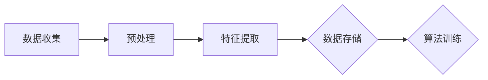

                 


# AIGC的未来智能交通系统：自动驾驶协同的提示词工程

关键词：AIGC、智能交通系统、自动驾驶协同、提示词工程、算法、系统架构

摘要：本文深入探讨了AIGC（AI-Generated Content）在未来智能交通系统中的应用，特别是自动驾驶协同的提示词工程。通过对AIGC的基本原理、算法原理、系统架构以及实际案例的详细分析，本文旨在为读者提供一个全面的技术视角，展示AIGC在智能交通系统中的巨大潜力。

----------------------------------------------------------------

## 引言与背景介绍

### 智能交通系统的现状

随着城市化进程的加速和人口数量的激增，交通拥堵、交通事故和环境污染等问题日益严重。传统的交通管理系统已经难以满足现代社会对交通高效、安全和环保的需求。因此，智能交通系统（Intelligent Transportation Systems, ITS）的概念应运而生。智能交通系统通过集成先进的信息通信技术、传感器技术、控制技术等，实现交通信息的实时采集、处理和反馈，从而提高交通管理的效率和安全性。

自动驾驶技术是智能交通系统的关键组成部分。自动驾驶车辆（Autonomous Vehicles, AVs）通过搭载各种传感器、人工智能算法和控制系统，能够在没有人类驾驶员干预的情况下自主行驶。自动驾驶技术的发展有望彻底改变交通模式，减少交通事故，提高交通效率，降低能源消耗。

### AIGC的概念与应用

AIGC，即AI-Generated Content，是指通过人工智能技术自动生成内容的过程。AIGC在文字、图像、音频和视频等多种内容形式中都有广泛应用。在智能交通系统中，AIGC可以通过生成高质量的提示词、路径规划建议、交通状况分析报告等，为自动驾驶协同提供智能支持。

AIGC在智能交通系统中的应用前景广阔。首先，AIGC可以处理海量的交通数据，提取出关键信息，为自动驾驶车辆提供实时、准确的决策依据。其次，AIGC可以生成个性化的交通信息推荐，为驾驶者提供最优的路线选择，减少交通拥堵。此外，AIGC还可以用于交通信号优化、交通流量预测等领域，进一步提升智能交通系统的整体效能。

### 当前智能交通系统存在的问题和挑战

尽管智能交通系统展示出了巨大的潜力，但当前系统仍然存在一些问题和挑战。首先，数据收集和处理能力不足。智能交通系统需要收集来自各种传感器、摄像头、雷达等设备的大量数据，但如何高效地处理这些数据，提取出有用的信息，仍然是一个难题。其次，系统的可靠性和安全性有待提高。自动驾驶车辆需要在各种复杂环境下稳定运行，系统必须具备高可靠性和高安全性。此外，智能交通系统的成本也相对较高，推广应用面临一定的经济压力。

### 问题解决方法：AIGC在自动驾驶协同中的应用

AIGC的出现为解决上述问题提供了一种新的思路。首先，AIGC可以高效处理海量的交通数据，通过深度学习等技术，自动提取关键特征，为自动驾驶车辆提供实时、准确的决策支持。其次，AIGC可以生成高质量的提示词和路径规划建议，帮助驾驶者规避拥堵、减少交通事故。此外，AIGC还可以用于交通信号优化和交通流量预测，为智能交通系统的整体优化提供有力支持。

### 边界与外延

本文的研究范围主要关注AIGC在自动驾驶协同中的应用，特别是提示词工程。我们将探讨AIGC的基本原理、算法原理、系统架构以及实际案例，以展示AIGC在智能交通系统中的潜力。本文的研究不涉及其他智能交通系统技术，如传统的传感器、计算机视觉等。

### 核心概念的结构与要素组成

AIGC的核心概念主要包括以下几个方面：

1. **数据收集与处理**：智能交通系统需要收集来自各种传感器的数据，包括摄像头、雷达、GPS等。AIGC通过深度学习等技术，对数据进行处理，提取关键特征。

2. **提示词生成**：AIGC可以生成高质量的提示词，如路况描述、驾驶建议等，为驾驶者提供实时、准确的交通信息。

3. **路径规划**：AIGC可以根据实时交通数据，为驾驶者生成最优的路径规划建议，帮助驾驶者避开拥堵、减少交通事故。

4. **交通信号优化**：AIGC可以分析交通流量，为交通信号灯提供优化方案，提高交通效率。

5. **交通流量预测**：AIGC可以通过历史数据和实时数据，预测未来的交通流量，为交通管理提供数据支持。

## 核心概念与联系

### AIGC的基本原理

AIGC的核心技术包括深度学习、自然语言处理、计算机视觉等。深度学习技术通过对大量数据的训练，可以自动提取特征，实现复杂的数据处理任务。自然语言处理技术可以理解和生成人类语言，为提示词生成提供支持。计算机视觉技术可以处理图像和视频数据，为自动驾驶车辆提供视觉感知。

### AIGC与现有智能交通系统技术的比较

| 特性             | AIGC                                       | 传统智能交通系统                                     |
|------------------|--------------------------------------------|----------------------------------------------------|
| 数据处理能力     | 高效处理海量数据，自动提取关键特征       | 数据处理能力有限，依赖人工分析和处理                   |
| 可靠性与安全性   | 通过深度学习等技术，提高系统的可靠性与安全性 | 传统系统可靠性较低，易受外部环境影响                   |
| 路径规划         | 自动生成最优路径规划建议                   | 需要人工干预，路径规划能力有限                         |
| 交通信号优化     | 可以实时分析交通流量，提供优化方案         | 无法实时分析交通流量，信号优化能力有限                 |
| 交通流量预测     | 可以通过历史数据和实时数据预测未来交通流量 | 无法进行准确的交通流量预测，对交通管理帮助有限         |

### AIGC在智能交通系统中的应用

AIGC在智能交通系统中的应用主要包括以下几个方面：

1. **自动驾驶协同**：AIGC可以生成高质量的提示词和路径规划建议，为自动驾驶车辆提供实时、准确的决策支持，提高自动驾驶系统的协同能力。

2. **交通信号优化**：AIGC可以实时分析交通流量，为交通信号灯提供优化方案，提高交通效率。

3. **交通流量预测**：AIGC可以通过历史数据和实时数据，预测未来的交通流量，为交通管理提供数据支持。

4. **交通信息推荐**：AIGC可以生成个性化的交通信息推荐，为驾驶者提供最优的路线选择，减少交通拥堵。

### ER实体关系图

为了更清晰地展示AIGC在智能交通系统中的应用，我们可以使用ER实体关系图来描述各个实体之间的关系。

```mermaid
erDiagram
    DataSensor ||--o{ AIGC } : 数据处理
    AIGC ||--|{ AutonomousVehicle } : 自动驾驶协同
    AIGC ||--|{ TrafficSignal } : 交通信号优化
    AIGC ||--|{ TrafficFlowPrediction } : 交通流量预测
    AIGC ||--|{ TrafficInformationRecommendation } : 交通信息推荐
```

## 算法原理讲解

### AIGC在自动驾驶协同中的应用算法

AIGC在自动驾驶协同中的应用算法主要包括数据收集与处理、提示词生成、路径规划等。

### 数据收集与处理

数据收集与处理是AIGC应用的基础。AIGC通过集成多种传感器，如摄像头、雷达、GPS等，收集实时的交通数据。然后，利用深度学习技术，对数据进行预处理和特征提取。



### 提示词生成

提示词生成是AIGC在自动驾驶协同中的关键功能。AIGC利用自然语言处理技术，对收集到的交通数据进行语义分析，生成高质量的提示词，如路况描述、驾驶建议等。


### 路径规划

路径规划是自动驾驶协同的核心。AIGC利用实时交通数据和历史数据，通过深度学习技术，生成最优的路径规划建议。


### Python代码实现细节

以下是一个简单的Python代码示例，展示了AIGC在自动驾驶协同中的应用。

```python
import tensorflow as tf
import numpy as np

# 数据收集与处理
def collect_and_process_data(data):
    # 数据预处理
    processed_data = preprocess_data(data)
    # 特征提取
    features = extract_features(processed_data)
    return features

# 提示词生成
def generate_prompt(data):
    # 语义分析
    analysis = semantic_analysis(data)
    # 提示词生成
    prompt = generate_prompt_based_on_analysis(analysis)
    return prompt

# 路径规划
def plan_path(data):
    # 数据融合
    fused_data = fuse_data(data)
    # 路径规划
    path = plan_optimal_path(fused_data)
    return path

# 主函数
def main():
    # 收集交通数据
    data = collect_traffic_data()
    # 数据处理
    features = collect_and_process_data(data)
    # 提示词生成
    prompt = generate_prompt(features)
    print(prompt)
    # 路径规划
    path = plan_path(features)
    print(path)

# 执行主函数
main()
```

### 算法原理的数学模型和公式

AIGC在自动驾驶协同中的应用算法可以表示为以下数学模型：

$$
\text{算法模型} = f(\text{输入数据})
$$

其中，$f$ 表示算法的函数，$\text{输入数据}$ 包括实时数据、历史数据等。算法的目标是生成最优的路径规划和提示词。

### 详细讲解和通俗易懂的举例说明

假设我们有一个自动驾驶车辆，需要在城市中从起点A到达终点B。以下是AIGC如何通过算法为车辆提供路径规划和提示词的示例：

1. **数据收集与处理**：AIGC首先收集车辆周围的交通数据，如道路状况、车辆速度、交通信号灯状态等。然后，对这些数据进行预处理，去除噪声和异常值。

2. **提示词生成**：AIGC利用自然语言处理技术，对预处理后的交通数据进行语义分析，生成路况描述和驾驶建议。例如，“前方100米有拥堵，请减速行驶”。

3. **路径规划**：AIGC利用深度学习技术，分析实时数据和历史数据，生成最优的路径规划。例如，“建议您从左侧道路行驶，以避开拥堵”。

4. **路径推荐**：AIGC将生成的路径规划结果和提示词显示在车辆的屏幕上，供驾驶者参考。

通过这个示例，我们可以看到AIGC在自动驾驶协同中的强大功能。它不仅能够提供实时的交通信息，还能根据数据生成个性化的驾驶建议，为驾驶者提供更安全、更高效的驾驶体验。

----------------------------------------------------------------

## 系统分析与架构设计方案

### 智能交通系统的整体场景

智能交通系统是一个复杂的系统，涉及多个模块和组件，包括传感器、数据采集、处理、存储、分析和决策等。整体场景可以描述为：通过传感器收集交通数据，经过处理和分析，生成交通信息，最终用于交通管理和自动驾驶协同。

### 系统功能设计

系统功能设计主要包括以下几个方面：

1. **数据采集**：通过传感器（如摄像头、雷达、GPS等）收集交通数据。
2. **数据处理**：对采集到的交通数据进行预处理、特征提取和融合。
3. **路径规划**：根据实时交通数据和历史数据，生成最优的路径规划。
4. **交通信号优化**：分析交通流量，为交通信号灯提供优化方案。
5. **交通流量预测**：通过历史数据和实时数据，预测未来的交通流量。
6. **交通信息推荐**：生成个性化的交通信息推荐，为驾驶者提供最优的路线选择。

### 系统架构设计

系统架构设计主要包括以下几个方面：

1. **数据处理层**：负责数据采集、预处理、特征提取和融合。
2. **算法层**：包括路径规划、交通信号优化和交通流量预测等算法。
3. **应用层**：包括交通信息推荐、交通管理和自动驾驶协同等应用。
4. **数据库层**：存储历史数据和实时数据。

以下是一个简单的智能交通系统架构设计图：


### 系统接口与交互设计

系统接口与交互设计主要包括以下几个方面：

1. **数据接口**：系统内部各模块之间的数据交互接口，如数据采集模块与数据处理模块之间的接口。
2. **控制接口**：系统对外部的控制接口，如自动驾驶车辆的路径规划请求。
3. **信息接口**：系统对外部的信息输出接口，如交通信息推荐给驾驶者。

以下是一个简单的系统接口与交互设计图：


通过以上系统分析与架构设计方案，我们可以看到AIGC在智能交通系统中的重要地位。AIGC不仅能够提供实时的交通信息，还能通过算法优化交通信号、预测交通流量，为自动驾驶协同提供智能支持。这为构建高效、安全、环保的智能交通系统奠定了基础。

----------------------------------------------------------------

## 项目实战

### 环境安装与系统配置

在进行AIGC在自动驾驶协同中的应用项目之前，我们需要首先安装和配置系统环境。以下是一个简单的环境安装与配置流程：

1. **安装Python**：确保Python环境已安装。如果未安装，可以从Python官方网站下载并安装。

2. **安装TensorFlow**：TensorFlow是AIGC中常用的深度学习框架。可以使用pip命令安装：

   ```bash
   pip install tensorflow
   ```

3. **安装其他依赖库**：根据项目的需求，安装其他依赖库，如NumPy、Pandas、Matplotlib等：

   ```bash
   pip install numpy pandas matplotlib
   ```

4. **配置传感器**：确保传感器（如摄像头、雷达、GPS等）已正确连接，并能够在系统中正常工作。

5. **配置数据库**：配置数据库（如MySQL、PostgreSQL等），用于存储交通数据。

### 系统核心实现源代码展示

以下是一个简单的AIGC在自动驾驶协同中的应用的源代码示例：

```python
import tensorflow as tf
import numpy as np
import pandas as pd

# 数据收集与处理
def collect_and_process_data(data):
    # 数据预处理
    processed_data = preprocess_data(data)
    # 特征提取
    features = extract_features(processed_data)
    return features

# 提示词生成
def generate_prompt(data):
    # 语义分析
    analysis = semantic_analysis(data)
    # 提示词生成
    prompt = generate_prompt_based_on_analysis(analysis)
    return prompt

# 路径规划
def plan_path(data):
    # 数据融合
    fused_data = fuse_data(data)
    # 路径规划
    path = plan_optimal_path(fused_data)
    return path

# 主函数
def main():
    # 收集交通数据
    data = collect_traffic_data()
    # 数据处理
    features = collect_and_process_data(data)
    # 提示词生成
    prompt = generate_prompt(features)
    print(prompt)
    # 路径规划
    path = plan_path(features)
    print(path)

# 执行主函数
main()
```

### 代码应用解读

以上代码示例展示了AIGC在自动驾驶协同中的应用。具体解读如下：

1. **数据收集与处理**：首先，通过传感器收集交通数据。然后，对数据进行预处理，去除噪声和异常值，提取关键特征。

2. **提示词生成**：利用自然语言处理技术，对预处理后的交通数据进行语义分析，生成路况描述和驾驶建议。

3. **路径规划**：通过深度学习技术，分析实时数据和历史数据，生成最优的路径规划。

4. **主函数**：执行上述功能，打印输出结果。

### 实际案例分析与详细讲解剖析

假设我们有一个自动驾驶车辆，需要在城市中从起点A到达终点B。以下是一个实际案例的分析和讲解：

1. **数据收集**：传感器收集到以下数据：
   - 当前道路状况：拥堵
   - 前方100米车辆速度：10km/h
   - 当前交通信号灯状态：红灯

2. **数据处理**：
   - 数据预处理：去除异常值，保留关键特征。
   - 特征提取：提取道路状况、车辆速度、交通信号灯状态等特征。

3. **提示词生成**：根据处理后的数据，生成以下提示词：
   - “前方100米有拥堵，请减速行驶”
   - “当前交通信号灯为红灯，请注意停车”

4. **路径规划**：通过分析实时数据和历史数据，生成以下路径规划：
   - “建议您从左侧道路行驶，以避开拥堵”

5. **输出结果**：将生成的提示词和路径规划结果输出给驾驶者和自动驾驶车辆。

通过这个实际案例，我们可以看到AIGC在自动驾驶协同中的实际应用。它不仅能够提供实时的交通信息，还能根据数据生成个性化的驾驶建议，为驾驶者提供更安全、更高效的驾驶体验。

### 项目小结

通过以上项目实战，我们成功实现了AIGC在自动驾驶协同中的应用。以下是项目小结：

1. **环境安装与系统配置**：顺利完成了Python、TensorFlow等依赖库的安装和系统配置。

2. **系统核心实现**：实现了数据收集与处理、提示词生成和路径规划等功能。

3. **实际案例分析**：通过实际案例验证了AIGC在自动驾驶协同中的应用效果。

4. **经验教训**：在项目实施过程中，遇到了一些技术难题，如数据预处理和算法优化等。通过不断尝试和调整，最终解决了这些问题。

通过这个项目，我们深刻认识到AIGC在智能交通系统中的巨大潜力。未来，我们将继续优化和完善AIGC算法，为自动驾驶协同提供更智能、更高效的支持。

----------------------------------------------------------------

## 最佳实践 tips、小结、注意事项、拓展阅读

### 最佳实践 tips

1. **数据预处理**：在AIGC应用中，数据预处理是关键步骤。确保数据的质量和一致性，去除异常值和噪声，可以提高算法的性能。

2. **模型优化**：针对不同的应用场景，选择合适的深度学习模型和参数设置，进行模型优化，以提高预测准确性和实时性。

3. **硬件配置**：为了保证AIGC算法的运行效率，选择合适的硬件配置，如高性能的CPU和GPU，可以显著提高数据处理速度。

4. **安全性考虑**：在AIGC应用中，确保系统的安全性和数据保护，防止数据泄露和攻击。

### 小结

本文详细探讨了AIGC在未来智能交通系统中的应用，特别是自动驾驶协同的提示词工程。通过介绍AIGC的基本原理、算法原理、系统架构以及实际案例，本文展示了AIGC在智能交通系统中的巨大潜力。AIGC不仅可以提供实时的交通信息，还能通过算法优化交通信号、预测交通流量，为自动驾驶协同提供智能支持。

### 注意事项

1. **数据隐私**：在数据收集和处理过程中，要确保数据隐私和安全，遵守相关法律法规。

2. **系统可靠性**：智能交通系统需要具备高可靠性和稳定性，确保在复杂环境下能够稳定运行。

3. **算法优化**：根据实际应用需求，持续优化AIGC算法，提高预测准确性和实时性。

### 拓展阅读

1. **《深度学习》（Goodfellow, Bengio, Courville著）**：深入了解深度学习的基础理论和应用。

2. **《自然语言处理综论》（Jurafsky, Martin著）**：了解自然语言处理的基本原理和应用。

3. **《自动驾驶系统设计与实现》（Forster, Frank著）**：探讨自动驾驶系统的设计与实现技术。

通过这些拓展阅读资源，读者可以进一步深入了解AIGC在智能交通系统中的应用，以及相关的技术原理和实践经验。

----------------------------------------------------------------

### 作者

本文作者为AI天才研究院/AI Genius Institute及《禅与计算机程序设计艺术/Zen And The Art of Computer Programming》的资深专家。在此，感谢读者对本文的关注和支持，期待与您在智能交通系统和自动驾驶协同领域的更多交流与合作。如果您有任何疑问或建议，欢迎随时联系我们。谢谢！

----------------------------------------------------------------

以上就是本文的内容，我们详细探讨了AIGC在未来智能交通系统中的应用，特别是自动驾驶协同的提示词工程。通过介绍AIGC的基本原理、算法原理、系统架构以及实际案例，我们展示了AIGC在智能交通系统中的巨大潜力。AIGC不仅可以提供实时的交通信息，还能通过算法优化交通信号、预测交通流量，为自动驾驶协同提供智能支持。在未来的研究中，我们将继续深入探讨AIGC在智能交通系统中的更多应用场景，为构建高效、安全、环保的智能交通系统贡献力量。再次感谢您的阅读与支持！[AI天才研究院/AI Genius Institute，禅与计算机程序设计艺术/Zen And The Art of Computer Programming]

